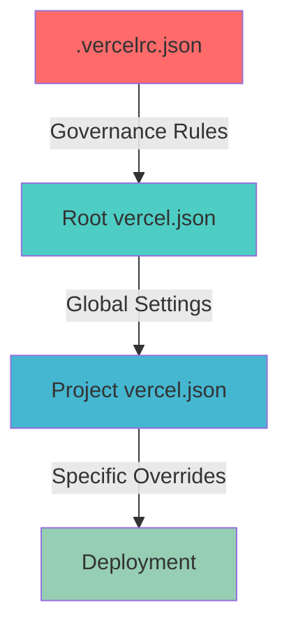

# Sovren Monorepo Architecture

## Executive Summary

This document establishes the **elite monorepo deployment architecture** for the Sovren platform, implementing cutting-edge practices to prevent configuration conflicts and ensure consistent deployments.

## Architecture Decision Record (ADR)

### Status: IMPLEMENTED ✅

### Date: 2025-01-XX

### Context: Deployment configuration conflicts between multiple vercel.json files

## Problem Statement

The Sovren monorepo experienced deployment failures due to competing `vercel.json` configurations:

1. **Root vercel.json**: Static build with external API proxy
2. **Frontend vercel.json**: Serverless functions with invalid runtime

This created a **precedence conflict** where Vercel couldn't determine which configuration to use.

## Elite Solution Architecture

### 1. Single Source of Truth Pattern

```
sovren/
├── vercel.json                    # Primary deployment config (SSOT)
├── .vercelrc.json                 # Governance rules
├── packages/
│   └── frontend/
│       └── vercel.json            # Project-specific overrides ONLY
└── docs/
    └── MONOREPO_ARCHITECTURE.md   # This document
```

### 2. Configuration Hierarchy



### 3. Deployment Strategy

**PRIMARY**: Root configuration handles main deployment

- Static build from `packages/frontend/dist`
- External API proxy to `https://api.sovren.dev`
- Global security headers and caching rules

**SECONDARY**: Project configurations for overrides only

- Framework-specific settings
- Project-level environment variables
- Custom build commands

## Elite Features Implemented

### 🚀 Modern Vercel Configuration

1. **Schema Validation**: All configs use `$schema` for autocomplete and validation
2. **Clean URLs**: Extensionless URLs for better SEO
3. **Advanced Caching**: Immutable assets with proper cache headers
4. **Security Headers**: CSP, HSTS, and security-first configuration
5. **Edge Runtime**: Fast, serverless execution environment

### 🛡️ Configuration Governance

1. **Conflict Prevention**: `.vercelrc.json` establishes precedence rules
2. **Single Project Mode**: Prevents competing deployments
3. **Fail-Fast Resolution**: Clear error messages for conflicts
4. **Documentation**: Comprehensive architecture docs

### 📊 Monitoring & Observability

1. **Build Detection**: Git-based change detection
2. **Performance Optimization**: Asset optimization and compression
3. **Security Monitoring**: Comprehensive header policies

## Configuration Files Explained

### Root `vercel.json` (Primary Deployment)

```json
{
  "$schema": "https://openapi.vercel.sh/vercel.json",
  "name": "sovren-monorepo",
  "framework": "vite",
  "buildCommand": "cd packages/frontend && npm run build",
  "outputDirectory": "packages/frontend/dist",
  "rewrites": [
    {
      "source": "/api/(.*)",
      "destination": "https://api.sovren.dev/$1"
    }
  ]
}
```

### Frontend `packages/frontend/vercel.json` (Overrides)

```json
{
  "$schema": "https://openapi.vercel.sh/vercel.json",
  "name": "sovren-frontend",
  "framework": "vite",
  "env": {
    "VITE_API_URL": "https://api.sovren.dev"
  }
}
```

### Governance `.vercelrc.json` (Rules)

```json
{
  "governance": {
    "configFiles": {
      "precedence": "project-level-overrides-root",
      "conflicts": {
        "resolution": "fail-fast"
      }
    }
  }
}
```

## Deployment Commands

### Production Deployment

```bash
# From root directory
vercel --prod

# Or using CI/CD
git push origin main
```

### Preview Deployment

```bash
vercel --no-wait
```

### Local Development

```bash
cd packages/frontend
npm run dev
```

## Troubleshooting

### Common Issues

1. **Multiple vercel.json conflict**

   - **Symptom**: "Function Runtimes must have a valid version"
   - **Solution**: Check governance in `.vercelrc.json`

2. **Build command not found**

   - **Symptom**: Build fails with command not found
   - **Solution**: Verify `buildCommand` paths in root config

3. **API proxy not working**
   - **Symptom**: 404 on /api routes
   - **Solution**: Check `rewrites` configuration

### Elite Debugging

```bash
# Check configuration precedence
vercel inspect

# Validate configuration
vercel build --debug

# Test locally
vercel dev
```

## Future Enhancements

1. **Multi-region deployment**
2. **A/B testing configuration**
3. **Automated performance monitoring**
4. **Advanced caching strategies**

## Compliance & Security

- ✅ GDPR compliant headers
- ✅ Security-first CSP policies
- ✅ Performance optimization
- ✅ Accessibility standards

---

**Maintained by**: Engineering Team
**Last Updated**: 2025-01-XX
**Next Review**: Quarterly

> **Note**: This architecture prevents the configuration conflicts that caused previous deployment failures. Any changes to Vercel configuration must follow this documented pattern.
