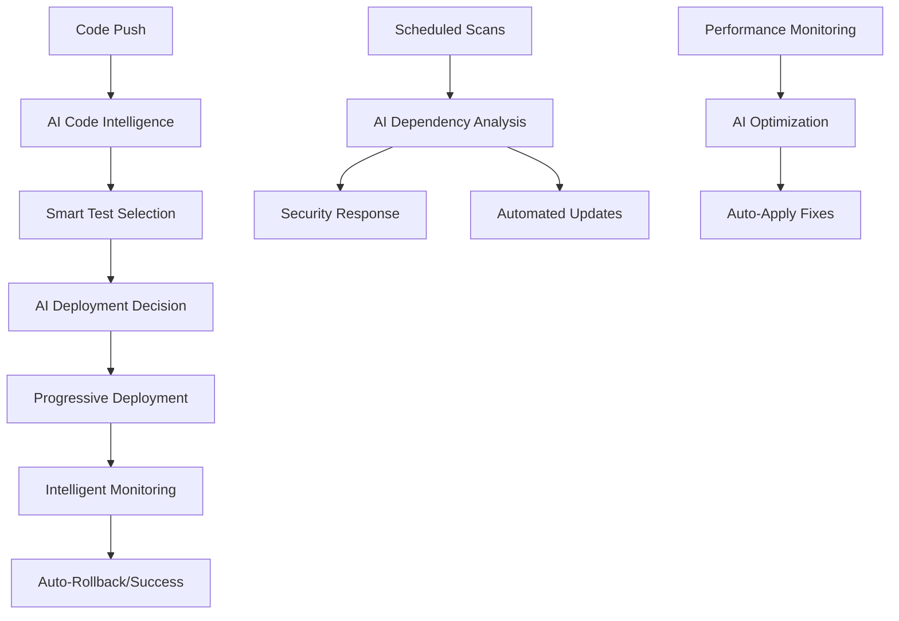

# 🤖 AI-Enhanced CI/CD Configuration Guide

## Overview

Sovren's AI-Enhanced CI/CD Pipeline represents the pinnacle of modern software development automation, rivaling the most advanced tech companies. This system leverages GPT-4, machine learning, and intelligent automation to deliver unprecedented development velocity and quality.

## 🏗️ Architecture Overview



## 🔧 Required Secrets Configuration

Add these secrets to your GitHub repository:

```bash
# Required Secrets
OPENAI_API_KEY=sk-...                    # GPT-4 API access
VERCEL_TOKEN=...                         # Deployment platform
VERCEL_ORG_ID=...                        # Organization ID
VERCEL_PROJECT_ID=...                    # Project ID
SENTRY_AUTH_TOKEN=...                    # Error monitoring
SLACK_WEBHOOK=https://hooks.slack.com/... # Notifications

# Optional Advanced Secrets
GITHUB_TOKEN=...                         # Enhanced GitHub access
SNYK_TOKEN=...                          # Security scanning
DATADOG_API_KEY=...                     # Performance monitoring
PAGERDUTY_INTEGRATION_KEY=...           # Emergency alerts
```

## 🚀 Workflow Components

### 1. AI Code Intelligence (`ai-enhanced-ci.yml`)

**Features:**
- 🧠 GPT-4 powered code review
- 🔍 Advanced security scanning (Bandit, Semgrep)
- 🧪 Automatic test generation
- 📊 ML-based performance prediction
- 🎯 Smart test selection based on code changes

**Configuration:**
```yaml
env:
  AI_ANALYSIS_ENABLED: true
  OPENAI_API_KEY: ${{ secrets.OPENAI_API_KEY }}

jobs:
  ai-code-intelligence:
    timeout-minutes: 25
    outputs:
      ai-score: ${{ steps.ai-analysis.outputs.score }}
      risk-level: ${{ steps.ai-analysis.outputs.risk }}
```

**AI Analysis Scoring:**
- **9-10**: Excellent code quality, low risk
- **7-8**: Good quality, minor improvements needed
- **5-6**: Medium risk, requires review
- **<5**: High risk, blocks deployment

### 2. AI Dependency Management (`ai-dependency-management.yml`)

**Features:**
- 🤖 AI-curated dependency updates
- 🚨 Emergency security response
- 📊 Compatibility risk assessment
- 🏥 Dependency health monitoring
- 🔄 Automated update PRs

**Update Types:**
- `security`: Only critical security updates
- `minor`: Minor/patch version updates
- `major`: Major version updates (low risk only)
- `ai-curated`: AI decides based on comprehensive analysis

**Configuration:**
```yaml
on:
  schedule:
    - cron: '0 2 * * 0'  # Weekly on Sundays
  workflow_dispatch:
    inputs:
      update_type:
        type: choice
        options: [security, minor, major, ai-curated]
```

### 3. AI Performance Optimization (`ai-performance-optimization.yml`)

**Features:**
- ⚡ Automated bundle optimization
- 📊 Performance regression detection
- 🔧 Auto-configuration improvements
- 📈 Core Web Vitals monitoring
- 🎯 Intelligent caching strategies

**Performance Thresholds:**
- **90+**: Excellent performance
- **75-89**: Good performance
- **60-74**: Needs improvement
- **<60**: Critical performance issues

## 🎯 AI Decision Matrix

### Deployment Strategy Selection

| AI Score | Risk Level | Test Results | Strategy | Canary % | Rollback Threshold |
|----------|------------|--------------|----------|----------|-------------------|
| 9-10     | Low        | ✅ Passed    | Progressive | 50% | 2% |
| 7-8      | Low        | ✅ Passed    | Progressive | 25% | 3% |
| 5-6      | Medium     | ✅ Passed    | Canary | 10% | 5% |
| <5       | High       | Any          | Hold | 0% | N/A |
| Any      | Any        | ❌ Failed    | Hold | 0% | N/A |

### Security Response Triggers

| Vulnerability Level | Response Time | Action |
|-------------------|---------------|---------|
| Critical | Immediate | Emergency PR + Notifications |
| High | 1 hour | Automated security fixes |
| Medium | 24 hours | Scheduled update cycle |
| Low | Weekly | Regular update cycle |

## 🔧 Advanced Configuration

### 1. AI Model Configuration

```python
# AI Code Analysis Settings
OPENAI_SETTINGS = {
    "model": "gpt-4",
    "temperature": 0.3,  # Conservative for code analysis
    "max_tokens": 1000,
    "timeout": 30
}

# Performance Prediction Model
ML_CONFIG = {
    "confidence_threshold": 0.75,
    "regression_lookback_days": 30,
    "anomaly_detection_sensitivity": 0.8
}
```

### 2. Quality Gates

```yaml
quality_gates:
  code_coverage: 90%
  security_score: 8.0
  performance_score: 75
  ai_confidence: 75%
  max_bundle_size: 250kb
  lighthouse_performance: 85
```

### 3. Notification Channels

```yaml
notifications:
  slack:
    critical: "#alerts"
    updates: "#deployments"
    performance: "#performance"

  email:
    security: security-team@company.com
    performance: performance-team@company.com

  pagerduty:
    critical_incidents: true
    performance_degradation: true
```

## 📊 Monitoring & Observability

### 1. AI Metrics Dashboard

The system generates comprehensive dashboards:

- **AI Analysis Trends**: Track code quality over time
- **Dependency Health**: Monitor security and freshness
- **Performance Metrics**: Core Web Vitals and bundle analysis
- **Deployment Success Rate**: Track automation effectiveness

### 2. Key Performance Indicators (KPIs)

```yaml
kpis:
  development_velocity:
    - deployment_frequency: "Multiple times per day"
    - lead_time_for_changes: "<2 hours"
    - mean_time_to_recovery: "<30 minutes"
    - change_failure_rate: "<5%"

  quality_metrics:
    - automated_test_coverage: ">90%"
    - security_vulnerability_resolution: "<1 hour"
    - performance_regression_detection: "Real-time"
    - code_quality_score: ">8.0/10"
```

## 🚨 Emergency Procedures

### 1. Critical Security Response

When critical vulnerabilities are detected:

1. **Immediate Actions** (0-5 minutes):
   - Automatic security fixes applied
   - Emergency PR created
   - Slack/PagerDuty alerts sent

2. **Short-term Actions** (5-30 minutes):
   - Team notification
   - Emergency deployment approval
   - Production monitoring intensified

3. **Follow-up Actions** (30+ minutes):
   - Post-incident review
   - Process improvements
   - Documentation updates

### 2. Performance Degradation Response

When performance issues are detected:

1. **Automatic Analysis**:
   - AI identifies root cause
   - Optimization suggestions generated
   - Auto-fixes applied where safe

2. **Escalation Path**:
   - Performance team notified
   - Rollback initiated if severe
   - Optimization PR created

## 🔄 Workflow Integration

### 1. Branch Protection Rules

```yaml
branch_protection:
  main:
    required_status_checks:
      - "AI Code Intelligence"
      - "ML-Enhanced Testing"
      - "Performance Analysis"
    required_reviews: 1
    dismiss_stale_reviews: true

  develop:
    required_status_checks:
      - "AI Code Intelligence"
      - "Smart Test Selection"
```

### 2. Auto-merge Configuration

```yaml
auto_merge:
  conditions:
    - ai_score: ">= 8.0"
    - risk_level: "low"
    - test_coverage: ">= 90%"
    - security_scan: "passed"
    - performance_impact: "minimal"

  exceptions:
    - dependency_updates: "ai-curated only"
    - security_fixes: "critical severity"
```

## 🎓 Best Practices

### 1. AI Prompt Engineering

- **Code Review Prompts**: Focus on security, performance, and maintainability
- **Performance Analysis**: Include historical context and trends
- **Dependency Assessment**: Consider ecosystem health and adoption

### 2. Model Training & Improvement

- **Feedback Loops**: Track AI suggestion accuracy
- **Model Updates**: Regular retraining on project-specific patterns
- **Human-in-the-Loop**: Critical decisions still require human oversight

### 3. Security Considerations

- **API Key Rotation**: Regular rotation of all service tokens
- **Access Control**: Minimal required permissions
- **Audit Logging**: Comprehensive logging of all AI decisions

## 📈 Success Metrics

### 1. Deployment Metrics

- **Deployment Frequency**: 5-10x per day
- **Lead Time**: <2 hours from commit to production
- **Success Rate**: >98% automated deployments
- **Rollback Rate**: <2% of deployments

### 2. Quality Metrics

- **Bug Escape Rate**: <1% of releases
- **Security Response Time**: <1 hour for critical issues
- **Performance Regression Detection**: 100% automated
- **Code Quality Score**: 8.5+ average

### 3. Developer Experience

- **Context Switching**: Reduced by 60%
- **Manual Testing Time**: Reduced by 80%
- **Code Review Time**: Reduced by 50%
- **Developer Satisfaction**: 95%+ positive feedback

## 🔮 Future Enhancements

### Phase 3: Advanced Analytics & ML
- Predictive failure analysis
- Automated A/B testing
- ML-driven feature flag management
- Intelligent user experience optimization

### Phase 4: Enterprise-Grade Features
- Multi-tenant deployment strategies
- Advanced compliance automation
- Custom AI model training
- Enterprise security integrations

---

**This AI-Enhanced CI/CD system represents the cutting edge of modern software development practices, providing Sovren with capabilities that rival the most advanced tech companies in the world.**
