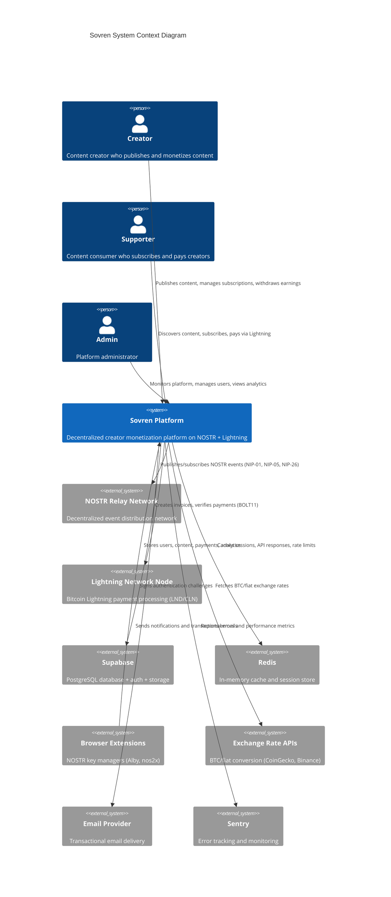
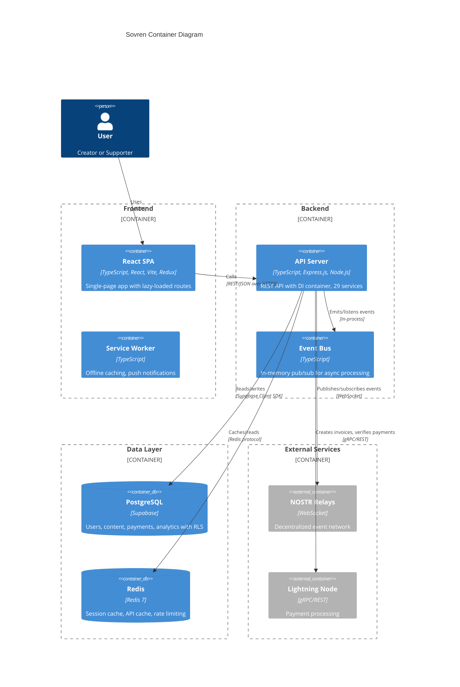
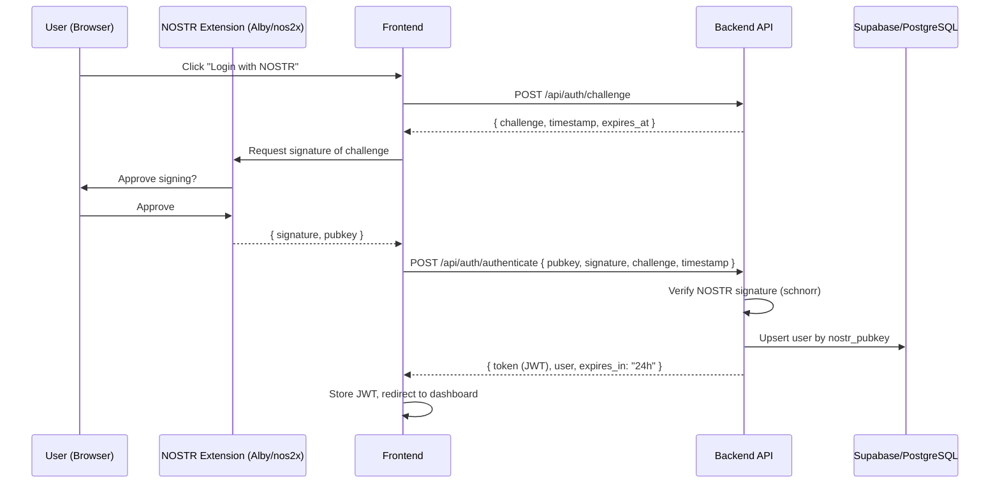
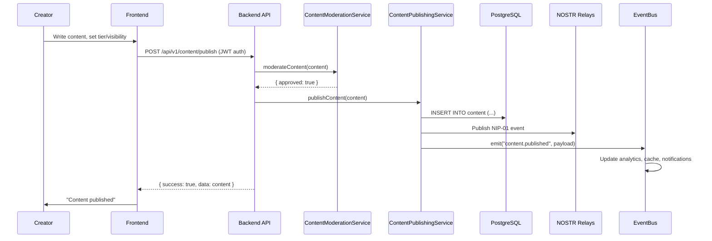
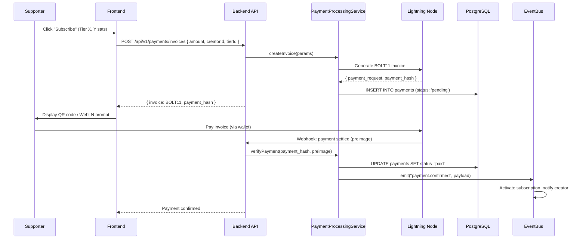

# Sovren System Architecture

**Version:** 2.0.0
**Date:** 2026-02-11
**Phase:** 1 - Architecture & Design

## 1. Executive Summary

Sovren is a decentralized creator monetization platform built on the NOSTR protocol with Bitcoin Lightning Network payments. The system follows a modular monolith architecture using an npm workspaces monorepo with four packages: `backend`, `frontend`, `shared`, and `testing`.

The backend is an Express.js application with a dependency injection container managing 29+ services organized across five domains: Infrastructure, Shared, Content, User, and Payment. The frontend is a React (Vite) SPA with lazy-loaded routes, Redux state management, and feature-based organization. Data persistence uses Supabase (PostgreSQL) with Row-Level Security policies, and caching is handled by Redis.

## 2. C4 Context Diagram (Level 1)



## 3. C4 Container Diagram (Level 2)



## 4. C4 Component Diagram (Level 3) - Backend

```mermaid
graph TB
    subgraph "API Layer"
        AUTH_ROUTES["Auth Routes<br/>/api/auth/*"]
        V1_CONTENT["Content Routes<br/>/api/v1/content/*"]
        V1_USERS["User Routes<br/>/api/v1/users/*"]
        V1_PAYMENTS["Payment Routes<br/>/api/v1/payments/*"]
        LIGHTNING_ROUTES["Lightning Routes<br/>/api/lightning/*"]
        HEALTH["Health Routes<br/>/health"]
    end

    subgraph "Middleware Stack"
        HELMET["Helmet<br/>Security Headers"]
        CORS["CORS<br/>Origin Control"]
        RATE_LIMIT["Rate Limiting<br/>Per-endpoint"]
        AUTH_MW["Auth Middleware<br/>JWT + NOSTR"]
        VALIDATION["Validation<br/>Zod Schemas"]
        MONITORING["Deployment Monitoring<br/>Prometheus Metrics"]
    end

    subgraph "Controllers"
        CONTENT_CTRL["ContentController"]
        USER_CTRL["UserController"]
        PAYMENT_CTRL["PaymentController"]
    end

    subgraph "Service Layer (DI Container - 29 services)"
        subgraph "Infrastructure Services"
            SERVICE_CONTAINER["ServiceContainer"]
            EVENT_BUS["EventBusService"]
            CACHE["CacheService"]
            LOGGER["Logger"]
        end
        subgraph "Content Services"
            PUBLISHING["ContentPublishingService"]
            MODERATION["ContentModerationService"]
            SEARCH["ContentSearchService"]
            RECOMMENDATION["ContentRecommendationService"]
            ANALYTICS_C["ContentAnalyticsService"]
            VERSIONING["ContentVersioningService"]
            CREATION["ContentCreationService"]
        end
        subgraph "User Services"
            PROFILE["UserProfileService"]
            PREFERENCES["UserPreferencesService"]
            ACTIVITY["UserActivityService"]
            RELATIONSHIPS["UserRelationshipService"]
            ANALYTICS_U["UserAnalyticsService"]
        end
        subgraph "Payment Services"
            PROCESSING["PaymentProcessingService"]
            CURRENCY["CurrencyService"]
            SUBSCRIPTION["SubscriptionService"]
            REFUND["RefundService"]
            ANALYTICS_P["PaymentAnalyticsService"]
            WEBHOOK["WebhookService"]
            INVOICE["InvoiceService"]
        end
    end

    subgraph "Data Access Layer"
        USER_REPO["UserRepository"]
        CONTENT_REPO["ContentRepository"]
        PAYMENT_REPO["PaymentRepository"]
        SUBSCRIPTION_REPO["SubscriptionRepository"]
    end

    subgraph "External Integrations"
        NOSTR_SVC["NostrService<br/>nostr-tools v2.13.2"]
        LIGHTNING_SVC["LightningService<br/>BOLT11 invoices"]
        ES_SVC["ElasticsearchService"]
    end

    V1_CONTENT --> CONTENT_CTRL --> PUBLISHING
    V1_CONTENT --> CONTENT_CTRL --> MODERATION
    V1_CONTENT --> CONTENT_CTRL --> SEARCH
    V1_USERS --> USER_CTRL --> PROFILE
    V1_USERS --> USER_CTRL --> PREFERENCES
    V1_PAYMENTS --> PAYMENT_CTRL --> PROCESSING
    V1_PAYMENTS --> PAYMENT_CTRL --> SUBSCRIPTION
    LIGHTNING_ROUTES --> LIGHTNING_SVC

    PUBLISHING --> CONTENT_REPO
    PUBLISHING --> EVENT_BUS
    PUBLISHING --> NOSTR_SVC
    PROCESSING --> PAYMENT_REPO
    PROCESSING --> LIGHTNING_SVC
    PROFILE --> USER_REPO
    PROFILE --> CACHE
```



## 5. C4 Component Diagram (Level 3) - Frontend

```mermaid
graph TB
    subgraph "App Shell"
        ROUTER["React Router<br/>Lazy-loaded routes"]
        ERROR_BOUNDARY["GlobalErrorBoundary"]
        AUTH_PROVIDER["AuthProvider<br/>Context + JWT"]
        LAYOUT["Layout Component"]
    end

    subgraph "Pages (Lazy-loaded)"
        HOME["Home"]
        LOGIN["Login"]
        SIGNUP["Signup"]
        PROFILE_PAGE["Profile"]
        POST_PAGE["Post"]
        CREATOR_DASH["CreatorDashboard"]
        ANALYTICS_DASH["AnalyticsDashboard"]
        SUB_MANAGER["SubscriptionManager"]
        MONITORING_DASH["MonitoringDashboard"]
    end

    subgraph "Feature Modules"
        AUTH_FEAT["features/auth<br/>Login, signup, NOSTR auth"]
        CONTENT_FEAT["features/content<br/>Editor, display, feed"]
        ANALYTICS_FEAT["features/analytics<br/>Creator analytics"]
        SUBS_FEAT["features/subscriptions<br/>Tier management"]
        NOSTR_FEAT["features/nostr<br/>Protocol integration"]
        DASH_FEAT["features/dashboard<br/>Monitoring"]
    end

    subgraph "Component Library"
        UI["components/ui<br/>Design system (Button, Card...)"]
        LIGHTNING_COMP["components/lightning<br/>PaymentButton, WalletManager"]
        NOSTR_COMP["components/nostr<br/>DMInbox, FilterBuilder, KeyMgmt"]
        ONBOARDING["components/onboarding<br/>Sovereign, NOSTR, Lightning"]
        ANALYTICS_COMP["components/analytics<br/>Charts, dashboards"]
    end

    subgraph "State Management"
        REDUX_STORE["Redux Store"]
        USER_SLICE["userSlice"]
        UI_SLICE["uiSlice"]
        CMS_SLICE["cmsUiSlice"]
        NAV_SLICE["navigationSlice"]
        LAYOUT_SLICE["layoutSlice"]
    end

    subgraph "Services Layer"
        NOSTR_SVC_FE["NostrService<br/>Relay pool, events, NIP support"]
        API_CLIENT["API Client<br/>REST calls to backend"]
        REALTIME_SVC["RealtimeService<br/>Supabase subscriptions"]
    end

    ROUTER --> HOME
    ROUTER --> LOGIN
    ROUTER --> CREATOR_DASH
    AUTH_FEAT --> NOSTR_SVC_FE
    CONTENT_FEAT --> API_CLIENT
    LIGHTNING_COMP --> API_CLIENT
    REDUX_STORE --> USER_SLICE
    REDUX_STORE --> UI_SLICE
```



## 6. Technology Stack

| Layer | Technology | Version | Purpose |
|-------|-----------|---------|---------|
| **Frontend** | React | 18.x | UI framework |
| | Vite | 5.x | Build tool and dev server |
| | TypeScript | 5.3+ | Type safety |
| | Redux Toolkit | - | State management |
| | React Router | 6.x | Client-side routing |
| | nostr-tools | 2.13.2 | NOSTR protocol (frontend) |
| **Backend** | Node.js | 18+ | Runtime |
| | Express.js | 4.x | HTTP framework |
| | TypeScript | 5.3+ | Type safety |
| | Zod | - | Request/response validation |
| | jsonwebtoken | 9.x | JWT auth tokens |
| | nostr-tools | 2.13.2 | NOSTR protocol (backend) |
| | pg | 8.x | PostgreSQL client (direct) |
| **Database** | PostgreSQL | 15 | Primary data store (via Supabase) |
| | Redis | 7 | Caching and sessions |
| **Infrastructure** | Docker | Multi-stage | Containerization |
| | Docker Compose | - | Service orchestration |
| | GitHub Actions | 22+ workflows | CI/CD |
| | Vercel | - | Frontend hosting |
| | Grafana + Prometheus | - | Monitoring |
| | Sentry | - | Error tracking |
| **Security** | Helmet | - | HTTP security headers |
| | bcrypt/sodium | - | Cryptography |
| | HashiCorp Vault | - | Secrets management |

## 7. Data Flow Overview

### 7.1 Authentication Flow (NOSTR Challenge-Response)



### 7.2 Content Publishing Flow



### 7.3 Lightning Payment Flow



## 8. Infrastructure Architecture

### 8.1 Deployment Topology

```
+-------------------+       +-------------------+
|  Vercel (CDN)     |       |  GitHub Actions   |
|  - React SPA      |       |  - 22+ workflows  |
|  - Edge Functions  |       |  - Lint, Test,    |
|  - Global CDN     |       |    Build, Deploy   |
+-------------------+       +-------------------+
         |                           |
         v                           v
+---------------------------------------------------+
|              Docker Compose Cluster                 |
|  +-------------+  +-------------+  +----------+   |
|  | API Server  |  | API Server  |  | Nginx    |   |
|  | (Node.js)   |  | (Node.js)   |  | Reverse  |   |
|  | Port 3001   |  | Port 3002   |  | Proxy    |   |
|  +-------------+  +-------------+  +----------+   |
|  +-------------+  +-------------+  +----------+   |
|  | Redis       |  | Prometheus  |  | Grafana  |   |
|  | Port 6379   |  | Port 9090   |  | Port 3000|   |
|  +-------------+  +-------------+  +----------+   |
+---------------------------------------------------+
         |
         v
+---------------------------------------------------+
|  Supabase (Cloud)                                  |
|  - PostgreSQL 15 (primary + read replicas)         |
|  - Auth service                                    |
|  - Realtime subscriptions                          |
|  - Storage (media files)                           |
+---------------------------------------------------+
         |
         v
+---------------------------------------------------+
|  External Services                                 |
|  - NOSTR relay network (distributed)               |
|  - Lightning node (LND/CLN, self-hosted)           |
|  - Exchange rate APIs                              |
|  - Email provider (transactional)                  |
+---------------------------------------------------+
```

### 8.2 Monitoring Stack

| Tool | Purpose | Integration |
|------|---------|-------------|
| Prometheus | Metrics collection | Scrapes `/metrics` endpoint |
| Grafana | Dashboards and alerting | Reads from Prometheus |
| Sentry | Error tracking, performance | SDK in backend + frontend |
| Structured Logger | Request/error logging | Console + log aggregator |
| Health Endpoint | Liveness/readiness | `GET /health` checks DB, Redis, Lightning, NOSTR |

## 9. Security Architecture

### 9.1 Authentication

- **Method**: NOSTR key-based challenge-response (NIP-07 browser extensions)
- **Token**: JWT with 24h expiration, includes `nostr_pubkey`, `role`, `signature_verified`
- **Refresh**: Token refresh via `POST /api/auth/refresh`
- **No private keys ever touch the server**

### 9.2 Authorization

- **RBAC Roles**: `creator`, `supporter`, `admin`
- **Middleware**: `authenticate` (required JWT), `optionalAuth` (public with optional auth), `requireCreator` (creator-only)
- **Database**: PostgreSQL Row-Level Security (RLS) enforces data access at the database level

### 9.3 Defense in Depth

| Layer | Protection |
|-------|-----------|
| HTTP | Helmet (CSP, X-Frame-Options, HSTS, XSS) |
| CORS | Origin whitelist (sovren.app in prod, localhost in dev) |
| Rate Limiting | Per-endpoint limits (10 req/15min for auth, 1000 general) |
| Input | Zod schema validation on all endpoints |
| SQL | Parameterized queries via Supabase client (no raw SQL) |
| Secrets | HashiCorp Vault for credential management and rotation |
| Dependencies | Dependabot, `npm audit`, Trivy container scanning |

## 10. Scalability Considerations

### Current Architecture (Modular Monolith)

The modular monolith is appropriate for the current team size (<5 developers). The DI container and event-driven architecture provide clear module boundaries that can be extracted into microservices if needed.

### Scaling Path

1. **Vertical**: Increase container resources (immediate)
2. **Horizontal**: Run multiple API containers behind Nginx load balancer (Docker Compose already supports this)
3. **Read replicas**: Supabase supports read replicas for query-heavy analytics
4. **Cache layer**: Multi-layer caching (Edge -> Redis L1 -> Query Cache L2) already achieves 95% cache hit rate
5. **Microservices extraction**: Payment and Content domains are the natural first candidates if team grows beyond 10 developers

## 11. Key Architectural Patterns

| Pattern | Where Used | Purpose |
|---------|-----------|---------|
| Dependency Injection | ServiceContainer + TYPES | Loose coupling, testability |
| Event-Driven | EventBusService | Async processing, decoupling |
| Repository | *Repository classes | Data access abstraction |
| Cache-Aside | CacheService (Redis) | Performance, DB load reduction |
| Circuit Breaker | External service calls | Fault tolerance |
| Factory | ServiceFactory, *Factory | Service instantiation |
| State Machine | PaymentStateMachine | Payment lifecycle management |

## 12. Monorepo Package Structure

```
sovren/
  packages/
    backend/       Express.js API server (29 services, DI container)
    frontend/      React SPA (Vite, Redux, lazy-loaded routes)
    shared/        Shared types (Zod schemas), config, NOSTR key management
    testing/       Shared test utilities and fixtures
  supabase/
    migrations/    SQL migrations (baseline + incremental)
    functions/     Supabase Edge Functions
  infrastructure/  Terraform IaC
  docker/          Docker configurations
  monitoring/      Grafana dashboards, Prometheus config
  .github/         22+ GitHub Actions workflows
  docs/            Architecture, API, ADR documentation
```
