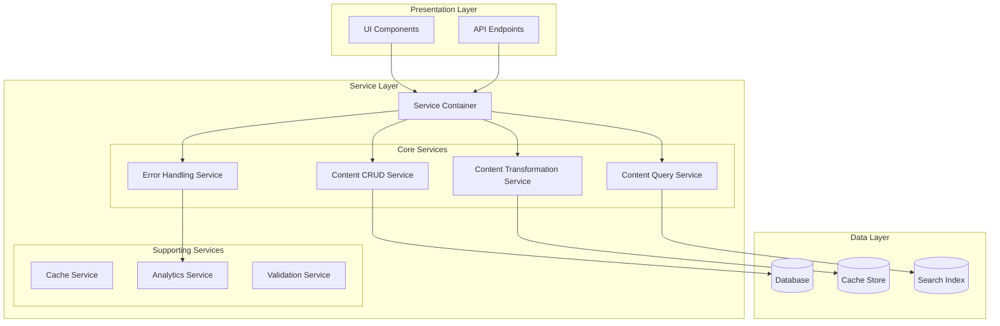
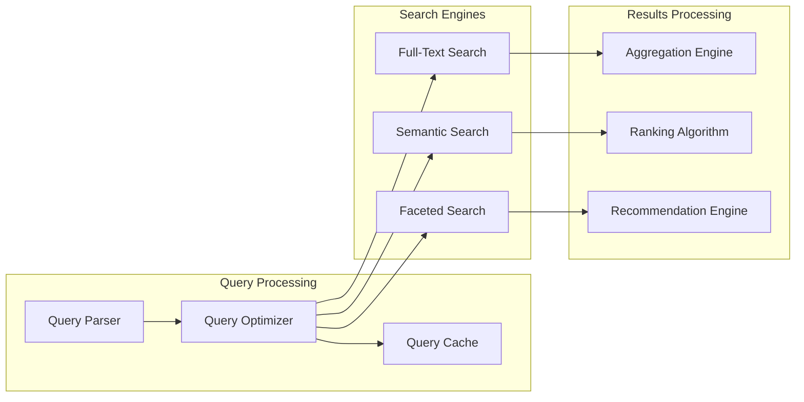
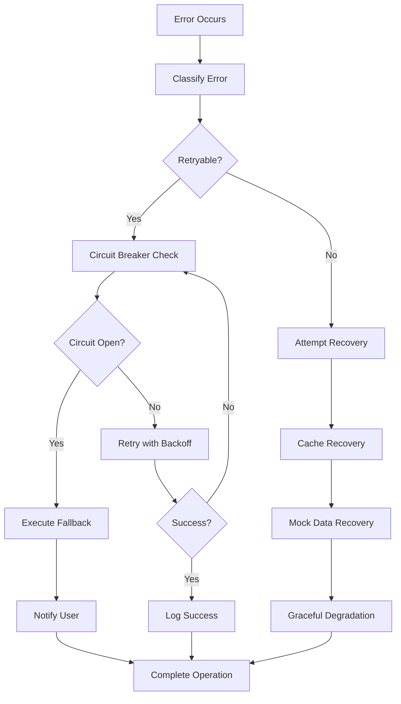
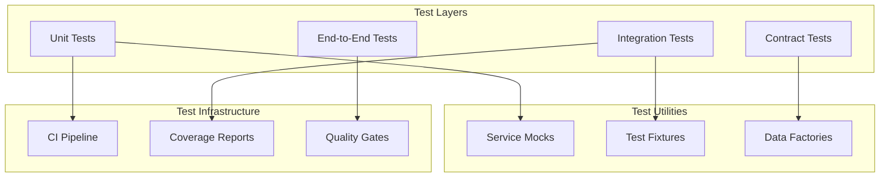
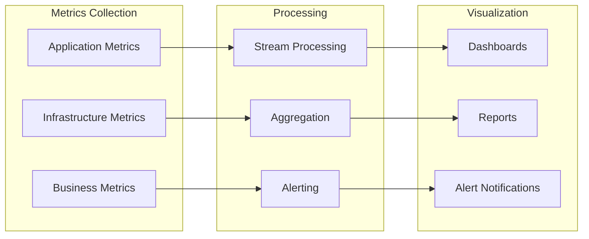

# Content Service Layer Architecture

**Elite Engineering Documentation - US-217 Implementation**

## 📋 Executive Summary

The Content Service Layer provides a comprehensive abstraction for all content management operations in the Sovren platform. This service layer implements enterprise-grade patterns including dependency injection, error handling, circuit breakers, and comprehensive monitoring.

## 🏗️ Architecture Overview

The Content Service Layer follows a modular, interface-driven architecture that separates business logic from presentation components. The architecture implements multiple design patterns to ensure maintainability, testability, and scalability.

### Core Components

1. **Service Container** - Dependency injection and lifecycle management
2. **Service Interfaces** - Contract definitions and type safety
3. **Base Service** - Common functionality for all services
4. **Content CRUD Service** - Core content operations
5. **Content Query Service** - Advanced search and filtering
6. **Content Transformation Service** - Format conversion and optimization
7. **Error Handling Service** - Comprehensive error management

## 📊 System Architecture Diagram



## 🔧 Service Container Architecture

The Service Container implements dependency injection with automatic resolution and lifecycle management.

### Features

- **Dependency Injection**: Automatic service resolution with circular dependency detection
- **Lifecycle Management**: Singleton, transient, and scoped service lifetimes
- **Health Monitoring**: Continuous health checks and diagnostics
- **Hot Reloading**: Development-time service replacement

### Configuration

```typescript
const serviceContainer = new ServiceContainer({
  enableDiagnostics: true,
  enableHealthChecks: true,
  circularDependencyDetection: true,
  maxDependencyDepth: 15,
});
```

## 📝 Content CRUD Service

Handles all create, read, update, and delete operations for content with comprehensive validation and conflict resolution.

### Key Features

- **ACID Transactions**: Ensures data consistency
- **Optimistic Concurrency**: Conflict detection and resolution
- **Audit Logging**: Complete change tracking
- **Bulk Operations**: Efficient batch processing
- **Version Control**: Content versioning and rollback

### API Example

```typescript
// Create content
const content = await crudService.create(
  {
    title: 'New Article',
    type: 'article',
    content: blocks,
    metadata: { tags: ['bitcoin', 'lightning'] },
  },
  context
);

// Update with conflict resolution
const updated = await crudService.update(
  contentId,
  {
    title: 'Updated Article',
    version: content.version,
  },
  context
);
```

## 🔍 Content Query Service

Provides advanced search, filtering, and aggregation capabilities with AI-powered recommendations.

### Capabilities

- **Full-Text Search**: Semantic and keyword-based search
- **Advanced Filtering**: Multiple criteria with faceted search
- **Performance Optimization**: Query caching and optimization
- **Real-Time Aggregations**: Live analytics and metrics
- **AI Recommendations**: Machine learning-powered suggestions

### Search Architecture



## 🔄 Content Transformation Service

Handles format conversion, validation, sanitization, and optimization of content.

### Transformation Pipeline

1. **Input Validation**: Schema and format validation
2. **Sanitization**: XSS protection and content cleaning
3. **Format Conversion**: Multi-format transformation
4. **Optimization**: Compression and performance optimization
5. **Export/Import**: Batch processing with error handling

### Supported Formats

- **Input**: HTML, Markdown, JSON, XML, CSV, PDF, DOCX
- **Output**: HTML, Markdown, JSON, XML, CSV, PDF
- **Optimization**: Image compression, text minification, metadata removal

## ⚡ Error Handling Service

Comprehensive error management with recovery strategies and circuit breaker patterns.

### Error Handling Flow



### Recovery Strategies

1. **Cache Recovery**: Use cached data when available
2. **Mock Data**: Provide realistic mock responses
3. **Graceful Degradation**: Simplified functionality
4. **Circuit Breaker**: Fail-fast for problematic services

## 🔌 Service Integration Patterns

### Dependency Injection Usage

```typescript
// Register services
serviceContainer.register('contentCrud', {
  factory: (container) => new ContentCrudService(container.resolve('database')),
  lifetime: 'singleton',
  dependencies: ['database', 'cache'],
});

// Resolve services
const crudService = serviceContainer.resolve<IContentCrudService>('contentCrud');
```

### Error Handling Integration

```typescript
// Service with error handling
const result = await errorHandler.executeWithRetry(
  () => crudService.create(data, context),
  context,
  { maxAttempts: 3, exponentialBackoff: true }
);

// Fallback pattern
const content = await errorHandler.executeWithFallback(
  () => apiService.getContent(id),
  () => cacheService.getContent(id),
  context
);
```

## 📊 Performance Considerations

### Caching Strategy

- **Query Caching**: Intelligent query result caching
- **Service Caching**: Service-level result caching
- **CDN Integration**: Static content delivery optimization
- **Cache Invalidation**: Smart cache invalidation patterns

### Optimization Techniques

- **Lazy Loading**: On-demand service instantiation
- **Connection Pooling**: Database connection optimization
- **Batch Operations**: Bulk processing for efficiency
- **Compression**: Content and response compression

## 🔒 Security Implementation

### Security Layers

1. **Input Validation**: Comprehensive data validation
2. **Sanitization**: XSS and injection protection
3. **Authorization**: Role-based access control
4. **Audit Logging**: Complete operation tracking
5. **Encryption**: Data encryption at rest and in transit

### Security Patterns

```typescript
// Input validation
await transformationService.validate(content, {
  requiredFields: ['title', 'type'],
  maxContentLength: 100000,
  allowedBlockTypes: ['text', 'image', 'video'],
});

// Sanitization
const sanitized = await transformationService.sanitize(content);

// Audit logging
await auditService.log('content.create', {
  contentId: content.id,
  userId: context.userId,
  timestamp: new Date(),
  metadata: { title: content.title },
});
```

## 🎯 Testing Strategy

### Test Coverage

- **Unit Tests**: Individual service functionality
- **Integration Tests**: Service interaction testing
- **Contract Tests**: Interface compliance verification
- **Performance Tests**: Load and stress testing
- **Security Tests**: Vulnerability and penetration testing

### Test Architecture



## 🚀 Deployment and Operations

### Deployment Strategy

- **Blue-Green Deployment**: Zero-downtime deployments
- **Feature Flags**: Gradual feature rollout
- **Health Checks**: Continuous service monitoring
- **Auto-Scaling**: Dynamic resource allocation

### Monitoring and Observability

```typescript
// Service metrics
const metrics = await service.getMetrics();
console.log(`Success rate: ${metrics.successRate}%`);
console.log(`Average response time: ${metrics.averageResponseTime}ms`);

// Health monitoring
const isHealthy = await service.isHealthy();
if (!isHealthy) {
  await alertingService.triggerAlert('service_unhealthy', {
    service: service.name,
    timestamp: new Date(),
  });
}
```

## 📈 Performance Metrics

### Key Performance Indicators

- **Response Time**: < 200ms for 95th percentile
- **Throughput**: 1000+ requests per second
- **Availability**: 99.9% uptime
- **Error Rate**: < 0.1% error rate
- **Cache Hit Rate**: > 80% cache efficiency

### Monitoring Dashboard



## 🔧 Configuration Management

### Environment Configuration

```typescript
// Service configuration
const config = {
  database: {
    connectionString: process.env.DATABASE_URL,
    poolSize: parseInt(process.env.DB_POOL_SIZE, 10) || 10,
  },
  cache: {
    ttl: parseInt(process.env.CACHE_TTL, 10) || 3600,
    maxSize: parseInt(process.env.CACHE_MAX_SIZE, 10) || 1000,
  },
  errorHandling: {
    maxRetryAttempts: 3,
    baseRetryDelay: 1000,
    circuitBreakerEnabled: true,
  },
};
```

### Feature Flags Integration

```typescript
// Feature flag usage
if (await featureFlags.isEnabled('advanced-search', context)) {
  result = await queryService.performSemanticSearch(query);
} else {
  result = await queryService.performBasicSearch(query);
}
```

## 📚 API Documentation

### Service Interface Documentation

All services implement well-defined interfaces with comprehensive TypeScript definitions:

- **IContentCrudService**: CRUD operations interface
- **IContentQueryService**: Search and filtering interface
- **IContentTransformationService**: Format transformation interface
- **IErrorHandlingService**: Error management interface

### OpenAPI Specification

Complete API documentation is available via OpenAPI 3.0 specifications with interactive documentation, request/response examples, and authentication requirements.

## 🎓 Developer Guidelines

### Best Practices

1. **Always use dependency injection** for service resolution
2. **Implement proper error handling** with recovery strategies
3. **Write comprehensive tests** for all service functionality
4. **Use TypeScript interfaces** for type safety
5. **Follow logging standards** for observability
6. **Implement health checks** for all services
7. **Use feature flags** for gradual rollouts

### Code Standards

- **ESLint configuration**: Enforced code quality rules
- **Prettier formatting**: Consistent code formatting
- **TypeScript strict mode**: Enhanced type safety
- **Test coverage**: Minimum 95% coverage required
- **Documentation**: JSDoc for all public APIs

## 🔄 Migration Guide

### Migrating Existing Code

1. **Identify service boundaries** in existing code
2. **Extract business logic** into service classes
3. **Implement service interfaces** for type safety
4. **Register services** with the dependency injection container
5. **Update component integration** to use services
6. **Add comprehensive testing** for migrated functionality

### Backward Compatibility

The service layer maintains backward compatibility with existing code through adapter patterns and gradual migration strategies.

## 📋 Conclusion

The Content Service Layer provides a robust, scalable foundation for content management operations. By implementing enterprise-grade patterns and comprehensive error handling, it ensures reliable operation at scale while maintaining developer productivity and code quality.

### Key Benefits

- **Separation of Concerns**: Clear boundary between business logic and presentation
- **Type Safety**: Comprehensive TypeScript integration
- **Error Resilience**: Advanced error handling and recovery
- **Performance**: Optimized for high-throughput operations
- **Maintainability**: Modular, testable architecture
- **Scalability**: Designed for horizontal scaling

### Next Steps

1. **Performance Optimization**: Continuous performance monitoring and optimization
2. **Feature Enhancement**: Additional service capabilities based on requirements
3. **Integration Expansion**: Integration with additional external services
4. **Monitoring Enhancement**: Advanced observability and alerting capabilities
