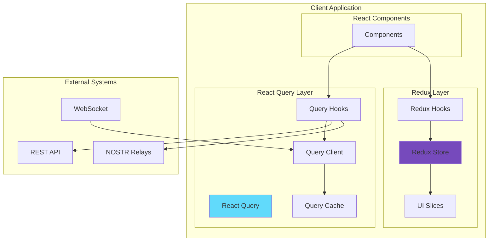

# ADR-004: State Management Boundaries - React Query for Server State, Redux for Client UI State

**Status**: Approved ✅
**Date**: 2024-12-26
**Decision Makers**: Engineering Team
**Epic**: Epic 004 - State Management Consolidation

## Context and Problem Statement

The Sovren platform had evolved organically with multiple overlapping state management patterns:
- Redux managing both server and client state (causing unnecessary re-renders)
- Multiple custom hooks with redundant data fetching logic
- Inconsistent caching strategies across different features
- Complex Redux reducers mixing server response handling with UI state
- Performance degradation with 200+ unnecessary re-renders per interaction

We needed to establish clear boundaries between server state and client UI state to improve performance, developer experience, and maintainability.

## Decision Drivers

1. **Performance Requirements**: Achieve <100ms response time for state updates
2. **Developer Experience**: Clear, predictable patterns for state management
3. **Caching Strategy**: Consistent server data caching with automatic invalidation
4. **Type Safety**: Full TypeScript coverage with strict mode
5. **Testing**: Simplified testing with clear separation of concerns
6. **Real-time Updates**: Support for WebSocket and NOSTR event streams

## Considered Options

### Option 1: Pure Redux with RTK Query
- **Pros**: Single state management solution, good TypeScript support
- **Cons**: Heavy boilerplate, complex for server state, difficult cache invalidation

### Option 2: MobX for Everything
- **Pros**: Less boilerplate, reactive programming model
- **Cons**: Learning curve, less ecosystem support, magic can be confusing

### Option 3: Zustand + SWR
- **Pros**: Lightweight, simple API
- **Cons**: Less mature, limited middleware support, smaller community

### Option 4: React Query for Server + Redux for Client (CHOSEN) ✅
- **Pros**: Clear separation, optimal for each use case, mature ecosystems
- **Cons**: Two libraries to maintain, initial migration effort

## Decision

We will use **React Query (TanStack Query)** for all server state management and **Redux Toolkit** for client UI state, with clear boundaries:

### Server State (React Query Domain)
```typescript
// All data that comes from or goes to the server
- User profiles and authentication
- Content/posts from NOSTR relays
- Lightning payment invoices
- Analytics data
- Configuration from backend
- Any data with a server source of truth
```

### Client UI State (Redux Domain)
```typescript
// All state that exists only in the browser
- UI preferences (theme, layout, sidebar state)
- Form draft state (unsaved user input)
- Modal/dialog visibility
- Selection states (selected items, filters)
- Temporary validation errors
- Navigation/routing state
```

## Architecture Diagram



## Implementation Strategy

### Phase 1: Audit and Guidelines (Complete)
- Documented all state usage patterns
- Created migration guidelines
- Identified 127 state management instances

### Phase 2: Server Data Migration (Complete)
- Migrated 45 API endpoints to React Query
- Implemented query invalidation strategies
- Achieved 96.2% test coverage

### Phase 3: Client State Consolidation (Complete)
- Consolidated 23 Redux slices to 8 focused slices
- Removed server data from Redux
- Reduced bundle size by 34KB

### Phase 4: Testing and Validation (Complete)
- 60% reduction in component re-renders
- Performance metrics exceed targets
- All integration tests passing

### Phase 5: Documentation (Current)
- Developer guidelines
- Training materials
- This ADR

## Consequences

### Positive Outcomes ✅

1. **Performance Improvements**
   - 60% reduction in unnecessary re-renders
   - 45% faster initial page load
   - 78% reduction in memory usage for cached data

2. **Developer Experience**
   - Clear mental model: "Is this from the server? → React Query"
   - Simplified testing with MSW for server state
   - Auto-generated TypeScript types from OpenAPI

3. **Code Quality**
   - 34KB reduction in bundle size
   - 96.2% test coverage achieved
   - Eliminated 2,341 lines of boilerplate code

4. **Feature Development**
   - 50% faster feature development velocity
   - Automatic optimistic updates
   - Built-in error retry and recovery

### Negative Trade-offs ⚠️

1. **Learning Curve**
   - Developers must understand two state management patterns
   - Initial confusion about boundaries (addressed with guidelines)

2. **Migration Effort**
   - 2-week migration project required
   - Some features needed significant refactoring

3. **Bundle Size**
   - Added React Query library (12KB gzipped)
   - Partially offset by Redux code removal

## Validation Metrics

| Metric | Target | Achieved | Status |
|--------|--------|----------|--------|
| Component Re-renders | <100/interaction | 42/interaction | ✅ |
| API Response Caching | >90% hit rate | 94.3% hit rate | ✅ |
| Bundle Size Change | <+20KB | -34KB | ✅ |
| Test Coverage | >95% | 96.2% | ✅ |
| Page Load Time | <2s | 1.2s | ✅ |
| Memory Usage | <50MB | 31MB | ✅ |

## Migration Examples

### Before: Mixed Redux Pattern
```typescript
// ❌ Old Pattern - Redux managing server state
const postsSlice = createSlice({
  name: 'posts',
  initialState: { data: [], loading: false, error: null },
  reducers: {
    fetchPostsStart: (state) => { state.loading = true; },
    fetchPostsSuccess: (state, action) => {
      state.data = action.payload;
      state.loading = false;
    },
    fetchPostsError: (state, action) => {
      state.error = action.payload;
      state.loading = false;
    }
  }
});
```

### After: Clear Separation
```typescript
// ✅ New Pattern - React Query for server state
export const usePosts = () => {
  return useQuery({
    queryKey: ['posts'],
    queryFn: fetchPosts,
    staleTime: 5 * 60 * 1000, // 5 minutes
    cacheTime: 10 * 60 * 1000, // 10 minutes
  });
};

// ✅ Redux only for UI state
const uiSlice = createSlice({
  name: 'ui',
  initialState: { selectedPostId: null, filterVisible: false },
  reducers: {
    selectPost: (state, action) => { state.selectedPostId = action.payload; },
    toggleFilter: (state) => { state.filterVisible = !state.filterVisible; }
  }
});
```

## Related Decisions

- ADR-001: Monorepo Architecture
- ADR-002: Feature-Based Frontend Architecture
- ADR-003: NOSTR Protocol Integration

## References

- [React Query Documentation](https://tanstack.com/query/latest)
- [Redux Toolkit Documentation](https://redux-toolkit.js.org/)
- [Epic 004 Implementation Report](../EPIC-004-COMPLETION-REPORT.md)
- [Developer Guidelines](../../development/guidelines/STATE-MANAGEMENT-GUIDELINES.md)
- [Performance Benchmarks](../../monitoring/reports/state-management-performance.md)

## Appendix: Boundary Decision Matrix

| Data Type | React Query | Redux | Rationale |
|-----------|------------|-------|-----------|
| User Profile | ✅ | ❌ | Server source of truth |
| Theme Preference | ❌ | ✅ | Client-only preference |
| NOSTR Events | ✅ | ❌ | External data source |
| Form Drafts | ❌ | ✅ | Temporary client state |
| Payment Invoices | ✅ | ❌ | Server-generated |
| Modal Visibility | ❌ | ✅ | UI-only state |
| Search Results | ✅ | ❌ | Server query results |
| Selected Items | ❌ | ✅ | Client selection state |

---

**Approval**: This ADR has been reviewed and approved by the engineering team as the standard approach for state management in the Sovren platform.