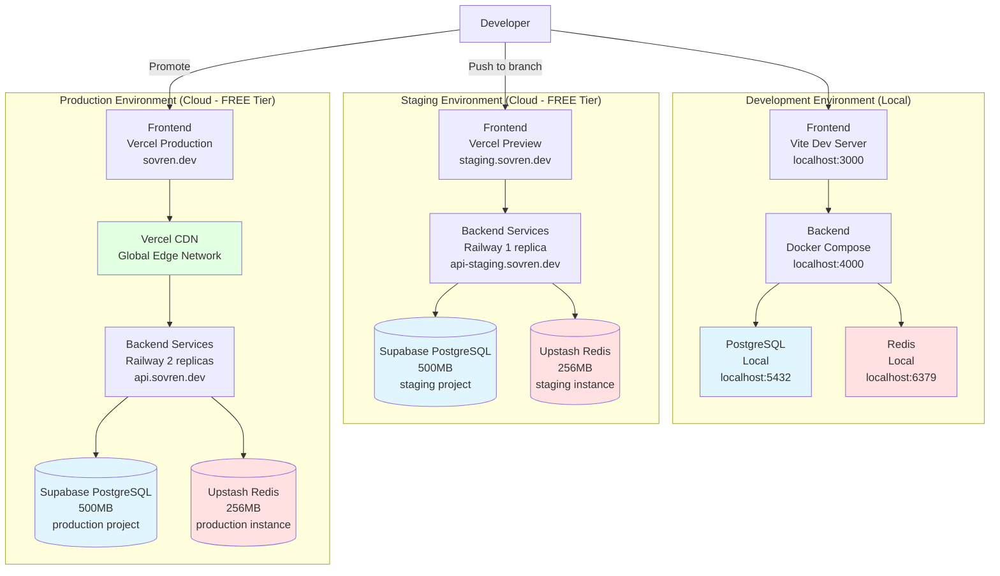
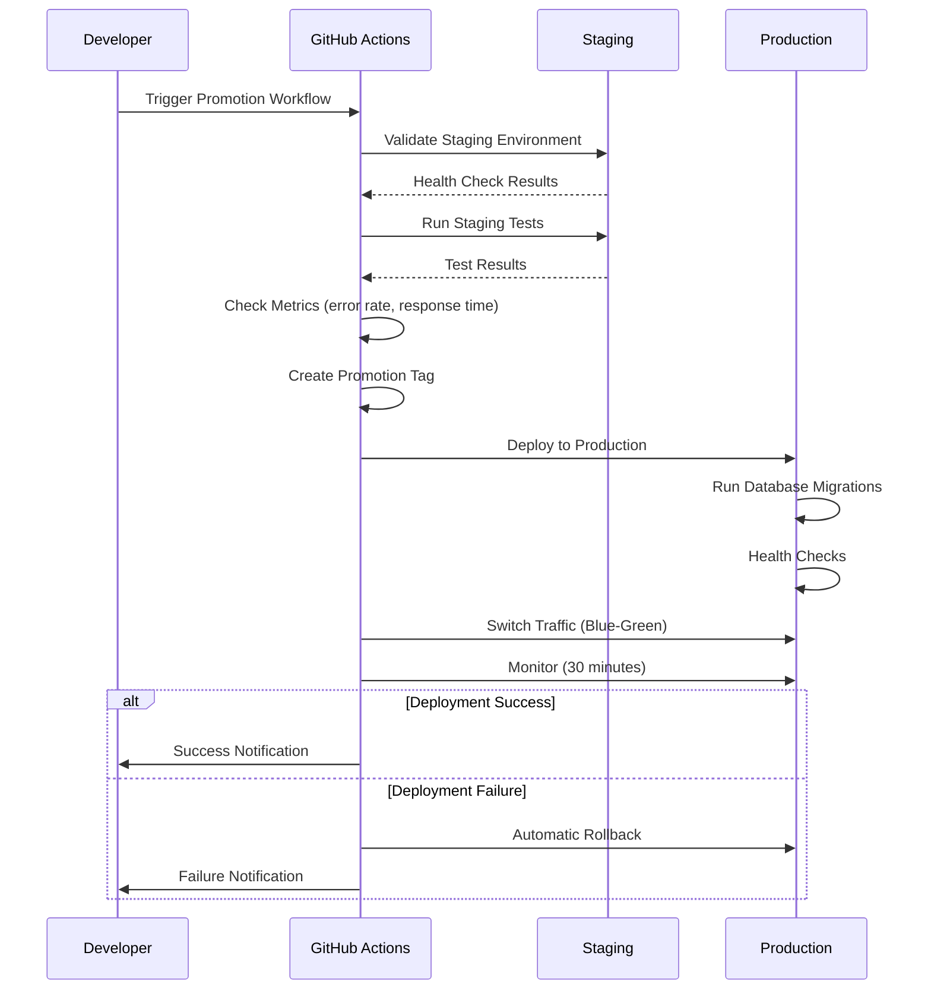
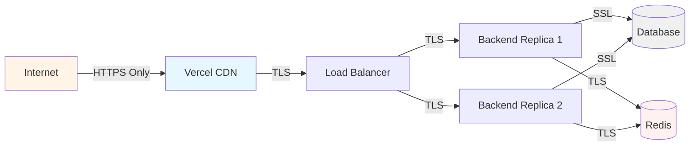

# Multi-Environment Infrastructure Architecture

**Document Type**: Architecture Decision Record (ADR)
**Status**: Implemented
**Last Updated**: 2025-10-27
**Epic**: Epic 006 - Automated Deployment Pipeline
**User Story**: US-E6-007

## Context

The Sovren platform requires robust multi-environment support (development, staging, production) to enable safe feature testing, production parity validation, and reliable production deployments. All infrastructure must be FREE tier compliant while maintaining enterprise-grade reliability and security.

## Decision

Implement a Terraform-based Infrastructure as Code (IaC) solution with:

1. **Three isolated environments**: Development (local), Staging (cloud), Production (cloud)
2. **Production parity**: Staging mirrors production configurations (scaled down)
3. **Zero cost**: 100% FREE tier resources (Supabase, Upstash, Railway, Vercel)
4. **Environment promotion**: Automated workflow for staging → production
5. **Security first**: SSL/TLS, secure cookies, rate limiting, no debug tools in production

## Architecture Diagram



## Component Details

### Frontend Deployment

| Environment | Platform | URL | Features |
|-------------|----------|-----|----------|
| **Development** | Vite dev server | localhost:3000 | Hot reload, debug tools |
| **Staging** | Vercel Preview | staging.sovren.dev | Production build, preview URL per PR |
| **Production** | Vercel Production | sovren.dev | CDN, edge functions, auto HTTPS |

### Backend Services

| Environment | Platform | Replicas | Resources | Cost |
|-------------|----------|----------|-----------|------|
| **Development** | Docker Compose | 1 | 512MB RAM | $0 |
| **Staging** | Railway.app | 1 | 512MB RAM, 0.5 CPU | $0 |
| **Production** | Railway.app | 2 | 1024MB RAM, 1 CPU | $0 |

### Database (PostgreSQL)

| Environment | Platform | Storage | Connections | Backups | Cost |
|-------------|----------|---------|-------------|---------|------|
| **Development** | Local | Unlimited | Unlimited | Manual | $0 |
| **Staging** | Supabase | 500MB | 50 | 7 days | $0 |
| **Production** | Supabase | 500MB | 100 | 7 days | $0 |

### Caching (Redis)

| Environment | Platform | Memory | Commands/Day | Persistence | Cost |
|-------------|----------|--------|--------------|-------------|------|
| **Development** | Local | Unlimited | Unlimited | Optional | $0 |
| **Staging** | Upstash | 256MB | 10,000 | Yes | $0 |
| **Production** | Upstash | 256MB | 10,000 | Yes | $0 |

## Environment Configuration Profiles

### Development Profile

```typescript
{
  environment: 'development',
  api: {
    url: 'http://localhost:4000',
    timeout: 60000,              // Generous for debugging
    retries: 1                   // Fail fast
  },
  database: {
    poolSize: 5,                 // Small pool
    ssl: false                   // Local connection
  },
  redis: {
    ttl: 1800,                   // 30 minutes
  },
  logging: {
    level: 'debug',              // Maximum verbosity
    prettyPrint: true            // Human-readable
  },
  features: {
    enableBeta: true,
    enableDebugTools: true
  },
  security: {
    corsOrigins: ['*'],          // Allow all
    secureCookies: false,
    helmetEnabled: false
  }
}
```

### Staging Profile

```typescript
{
  environment: 'staging',
  api: {
    url: 'https://api-staging.sovren.dev',
    timeout: 30000,              // Moderate
    retries: 3
  },
  database: {
    poolSize: 10,                // Moderate pool
    ssl: true                    // Production parity
  },
  redis: {
    ttl: 3600,                   // 1 hour
  },
  logging: {
    level: 'debug',              // Verbose for testing
    prettyPrint: true            // Human-readable
  },
  features: {
    enableBeta: true,            // Test beta features
    enableDebugTools: true       // Debug available
  },
  security: {
    corsOrigins: [
      'https://staging.sovren.dev',
      'http://localhost:3000'    // Allow local frontend
    ],
    secureCookies: true,         // Production parity
    helmetEnabled: true          // Production parity
  }
}
```

### Production Profile

```typescript
{
  environment: 'production',
  api: {
    url: 'https://api.sovren.dev',
    timeout: 10000,              // Strict for performance
    retries: 5                   // High reliability
  },
  database: {
    poolSize: 50,                // Maximum for free tier
    ssl: true,                   // Required
    replication: true
  },
  redis: {
    ttl: 7200,                   // 2 hours
  },
  logging: {
    level: 'error',              // Errors only
    prettyPrint: false           // JSON for parsing
  },
  features: {
    enableBeta: false,           // NO beta features
    enableDebugTools: false      // NO debug tools
  },
  security: {
    corsOrigins: [
      'https://sovren.dev',
      'https://www.sovren.dev'
    ],
    secureCookies: true,
    helmetEnabled: true
  },
  cdn: {
    enabled: true,
    url: 'https://cdn.sovren.dev'
  }
}
```

## Environment Promotion Workflow

### Promotion Process



### Promotion Stages

1. **Validate Source Environment**
   - Run health checks on staging
   - Execute staging test suite
   - Verify metrics (error rate, response time, uptime)
   - Check for breaking changes

2. **Promote to Production**
   - Create promotion tag (`promotion-YYYYMMDD-HHMMSS`)
   - Deploy frontend to Vercel Production
   - Deploy backend to Railway Production
   - Run database migrations

3. **Verify Deployment**
   - Wait for deployment to stabilize (2 minutes)
   - Run production health checks
   - Execute smoke tests
   - Monitor for 30 minutes (error rates, response times)

4. **Rollback on Failure**
   - Automatic rollback if health checks fail
   - Automatic rollback if error rate > 5%
   - Send failure notifications
   - Maintain previous version for quick recovery

## Infrastructure as Code

### Terraform Module Structure

```
infrastructure/
├── modules/
│   ├── database/        # PostgreSQL (Supabase)
│   ├── redis/           # Redis (Upstash)
│   ├── backend-services/# Docker containers
│   └── monitoring/      # Observability
└── environments/
    ├── staging/         # Staging config
    └── production/      # Production config
```

### Database Module

```hcl
module "database" {
  source = "../../modules/database"

  database_url           = var.database_url
  database_name          = "sovren_production"
  environment            = "production"
  backup_enabled         = true
  backup_retention_days  = 7
  max_connections        = 100

  tags = local.common_tags
}
```

**Features**:
- Automatic schema creation (app, auth, storage)
- PostgreSQL extensions (uuid-ossp, pgcrypto, pg_stat_statements)
- SSL/TLS enforced
- Automatic backups (7 days retention)
- Connection pooling configuration

### Redis Module

```hcl
module "redis" {
  source = "../../modules/redis"

  redis_url             = var.redis_url
  environment           = "production"
  max_memory            = "256mb"
  eviction_policy       = "allkeys-lfu"
  default_ttl           = 7200
  enable_persistence    = true

  tags = local.common_tags
}
```

**Features**:
- Environment-specific cache profiles
- Automatic eviction policies (LRU for staging, LFU for production)
- Connection pooling
- TLS support
- TTL configuration

### Backend Services Module

```hcl
module "backend_services" {
  source = "../../modules/backend-services"

  environment         = "production"
  repository_owner    = var.github_repository_owner
  enable_auto_scaling = false  # Not available in free tier

  services = {
    api = {
      image_tag         = "production-latest"
      cpu_limit         = "1.0"
      memory_limit      = "1024m"
      replicas          = 2
      health_check_path = "/health"
    }
  }

  tags = local.common_tags
}
```

**Features**:
- Environment-specific resource limits
- Health check configuration
- GHCR integration
- Multi-replica support for high availability

## Security Architecture

### Network Security



### Security Controls

| Layer | Controls |
|-------|----------|
| **Transport** | TLS 1.3, HTTPS enforced, SSL for all DB connections |
| **Application** | Helmet headers, CSRF protection, input validation |
| **Session** | Secure cookies, httpOnly, sameSite=strict |
| **API** | Rate limiting, request size limits, timeout enforcement |
| **Database** | Connection pooling, prepared statements, least privilege |
| **Secrets** | GitHub Secrets, environment variables, no hardcoded secrets |

## Monitoring and Observability

### Health Check Endpoints

All backend services expose:
- `/health` - Overall service health
- `/ready` - Ready to receive traffic (DB connected, cache available)
- `/live` - Process is alive (for orchestrator restart logic)

### Monitoring Stack

| Environment | Error Tracking | Performance | Logs | Uptime |
|-------------|----------------|-------------|------|---------|
| **Development** | None | Local | Debug | N/A |
| **Staging** | Sentry (100% sample) | Enabled | Debug | Optional |
| **Production** | Sentry (10% sample) | Enabled | Error | Required |

### Key Metrics

1. **Application Metrics**
   - Request rate (requests/second)
   - Error rate (target: < 1%)
   - Response time P50, P95, P99 (target: P95 < 500ms)
   - Concurrent users

2. **Database Metrics**
   - Connection pool usage (target: < 80%)
   - Query duration P95 (target: < 100ms)
   - Slow queries (> 1s)
   - Storage usage (stay under 500MB)

3. **Redis Metrics**
   - Commands per day (stay under 10,000)
   - Memory usage (stay under 256MB)
   - Cache hit rate (target: > 80%)
   - Evictions (minimize)

## Cost Optimization

### Monthly Cost: $0

| Service | Free Tier Limit | Usage Strategy | Cost |
|---------|-----------------|----------------|------|
| **Supabase** | 500MB DB, unlimited API | Optimize storage, use compression | $0 |
| **Upstash** | 10K commands/day | Optimize cache, increase TTLs | $0 |
| **Railway** | $5/month credit | 2 replicas × 512MB each | $0 |
| **Vercel** | Unlimited deployments | Optimize bundle size | $0 |
| **GitHub** | 2,000 CI minutes | Optimize workflows | $0 |

### Cost Monitoring

**Database Storage**:
- Monitor via Supabase dashboard
- Set up alerts at 400MB (80%)
- Archive old data periodically

**Redis Commands**:
- Monitor daily command count
- Optimize cache strategy if approaching limit
- Consider longer TTLs to reduce writes

**Railway Credit**:
- $5/month credit renews monthly
- Track usage via Railway dashboard
- Optimize container resource usage

## Disaster Recovery

### Backup Strategy

| Component | Frequency | Retention | Recovery Time |
|-----------|-----------|-----------|---------------|
| **Database** | Daily | 7 days | < 1 hour |
| **Infrastructure** | Git commits | Unlimited | < 30 minutes |
| **Secrets** | Manual | GitHub Secrets | < 15 minutes |
| **Application Code** | Git commits | Unlimited | < 5 minutes |

### Recovery Procedures

**Database Failure**:
1. Restore from Supabase automatic backup (7 days retention)
2. Run database validation script
3. Verify data integrity
4. Resume normal operations

**Application Failure**:
1. Automatic rollback via GitHub Actions
2. Revert to last known good deployment
3. Investigate root cause
4. Fix and redeploy

**Complete Infrastructure Failure**:
1. Re-run Terraform apply from version control
2. Restore database from backup
3. Redeploy application from GHCR
4. Verify all services operational

## Success Metrics

### Deployment Metrics

- **Deployment Frequency**: Capable of 10+ deploys/day
- **Deployment Time**: < 10 minutes (full backend deploy)
- **Rollback Time**: < 2 minutes
- **Success Rate**: > 99% (with automatic rollback)

### Reliability Metrics

- **Uptime**: > 99.9% (three nines)
- **Error Rate**: < 1%
- **Response Time P95**: < 500ms
- **Mean Time to Recovery**: < 5 minutes

### Cost Metrics

- **Monthly Infrastructure Cost**: $0
- **Free Tier Compliance**: 100%
- **Resource Utilization**: < 80% of limits

## Future Enhancements

### Phase 1 (Current)
- ✅ Three environments (dev, staging, prod)
- ✅ Infrastructure as Code (Terraform)
- ✅ Environment promotion workflow
- ✅ Automated validation tests

### Phase 2 (Next)
- [ ] Ephemeral preview environments (per PR)
- [ ] Advanced monitoring (distributed tracing)
- [ ] Feature flags for gradual rollout
- [ ] Load testing automation

### Phase 3 (Future)
- [ ] Multi-region deployment (if scaling beyond free tier)
- [ ] Advanced caching strategies
- [ ] A/B testing infrastructure
- [ ] Chaos engineering tests

## References

- [Epic 006: Automated Deployment Pipeline](/docs/refactoring/EPIC-006-deployment-automation.md)
- [Infrastructure README](/infrastructure/README.md)
- [Terraform Best Practices](https://www.terraform.io/docs/cloud/guides/recommended-practices/index.html)
- [12-Factor App Methodology](https://12factor.net/)

---

**Document Status**: Final
**Reviewed By**: DevOps Team
**Approved**: 2025-10-27
