# Unified Content Management Architecture

**Implementation Date**: 2024-12-29
**Status**: 🏗️ ARCHITECTURE DESIGN COMPLETE
**Version**: 1.0.0
**Scope**: Unified content management system consolidating all duplicate implementations

## 🎯 **ARCHITECTURE OVERVIEW**

The Unified Content Management System (UCMS) consolidates all duplicate content management implementations into a single, cohesive system that provides comprehensive content operations through a unified interface.

## 🏗️ **SYSTEM ARCHITECTURE**

```mermaid
graph TB
    subgraph "🎯 Unified Content Management System"
        A["🏠 ContentManagementHub<br/>Main Controller"] --> B["📝 ContentEditor<br/>Universal Editor"]
        A --> C["📚 ContentLibrary<br/>Content Browser"]
        A --> D["🏷️ ContentCollections<br/>Organization"]
        A --> E["📺 ContentSeries<br/>Sequential Content"]
        A --> F["📊 ContentAnalytics<br/>Metrics & Insights"]

        B --> B1["🔧 BlockEditor<br/>Content Blocks"]
        B --> B2["🤖 AIAssistant<br/>Content Enhancement"]
        B --> B3["💾 AutoSave<br/>State Management"]

        C --> C1["🔍 ContentSearch<br/>Advanced Search"]
        C --> C2["🏷️ ContentFilters<br/>Filtering System"]
        C --> C3["📋 BulkOperations<br/>Mass Actions"]

        D --> D1["📁 Collections<br/>Content Groups"]
        D --> D2["🏷️ Tags<br/>Flexible Labels"]
        D --> D3["📦 Bundles<br/>Premium Packages"]

        E --> E1["📚 Series<br/>Course Content"]
        E --> E2["🎯 Episodes<br/>Sequential Items"]
        E --> E3["📈 Progress<br/>Learning Tracking"]

        F --> F1["📊 Performance<br/>Content Metrics"]
        F --> F2["🎯 Engagement<br/>User Analytics"]
        F --> F3["💰 Revenue<br/>Monetization"]
    end

    subgraph "🏪 State Management Layer"
        G["🏪 ContentStore<br/>Unified State"] --> G1["📝 Editor State"]
        G --> G2["📚 Content Items"]
        G --> G3["🏷️ Collections"]
        G --> G4["📺 Series"]
        G --> G5["🤖 AI State"]
    end

    subgraph "🌐 Service Layer"
        H["🔧 ContentService<br/>API Abstraction"] --> H1["📝 CRUD Operations"]
        H --> H2["🔍 Search Service"]
        H --> H3["📊 Analytics Service"]
        H --> H4["🤖 AI Service"]
        H --> H5["💾 Storage Service"]
    end

    subgraph "🛠 Backend Integration"
        I["🌐 Content API<br/>Backend Routes"] --> I1["📝 Content Endpoints"]
        I --> I2["🏷️ Collection Endpoints"]
        I --> I3["📺 Series Endpoints"]
        I --> I4["📊 Analytics Endpoints"]

        J["💾 ContentManagementService<br/>Backend Service"] --> J1["📊 Supabase Integration"]
        J --> J2["🔍 Search Engine"]
        J --> J3["📁 File Storage"]
        J --> J4["🤖 AI Integration"]
    end

    A --> G
    G --> H
    H --> I
    I --> J

    style A fill:#e1f5fe,stroke:#01579b,stroke-width:3px
    style G fill:#f3e5f5,stroke:#4a148c,stroke-width:2px
    style H fill:#e8f5e8,stroke:#1b5e20,stroke-width:2px
    style I fill:#fff3e0,stroke:#e65100,stroke-width:2px
    style J fill:#fce4ec,stroke:#880e4f,stroke-width:2px
```



## 🧩 **COMPONENT HIERARCHY**

### **1. ContentManagementHub (Root Component)**

```typescript
interface ContentManagementHubProps {
  initialView?: 'library' | 'editor' | 'collections' | 'series' | 'analytics';
  userId: string;
  permissions: ContentPermissions;
  theme?: 'light' | 'dark' | 'auto';
}
```

**Responsibilities**:

- Route between different content management views
- Manage global content management state
- Provide unified navigation and layout
- Handle cross-component communication

### **2. ContentEditor (Integrated Editor)**

```typescript
interface UnifiedContentEditorProps {
  contentId?: string;
  mode: 'create' | 'edit' | 'view';
  collaborative?: boolean;
  aiAssisted?: boolean;
  autoSave?: boolean;
}
```

**Features**:

- Block-based content editing
- Real-time collaboration
- AI content assistance
- Auto-save functionality
- Version management
- Media integration

### **3. ContentLibrary (Content Browser)**

```typescript
interface ContentLibraryProps {
  view: 'grid' | 'list' | 'table';
  filters: ContentFilters;
  selectionMode: 'single' | 'multiple' | 'none';
  onContentSelect?: (content: ContentItem) => void;
}
```

**Features**:

- Advanced search and filtering
- Bulk operations
- Sorting and pagination
- Content previews
- Quick actions

### **4. ContentCollections (Organization System)**

```typescript
interface ContentCollectionsProps {
  type: 'all' | 'series' | 'category' | 'playlist' | 'bundle' | 'tag';
  allowCreation?: boolean;
  allowEditing?: boolean;
  dragAndDrop?: boolean;
}
```

**Features**:

- Hierarchical organization
- Drag & drop reordering
- Collection templates
- Access control
- Sharing capabilities

### **5. ContentSeries (Sequential Content)**

```typescript
interface ContentSeriesProps {
  seriesId?: string;
  allowEpisodeReordering?: boolean;
  showProgress?: boolean;
  enablePrerequisites?: boolean;
}
```

**Features**:

- Sequential content organization
- Progress tracking
- Prerequisites management
- Completion certificates
- Learning paths

### **6. ContentAnalytics (Metrics & Insights)**

```typescript
interface ContentAnalyticsProps {
  timeRange: 'day' | 'week' | 'month' | 'quarter' | 'year';
  contentTypes?: ContentType[];
  metricsTypes: AnalyticsMetric[];
}
```

**Features**:

- Performance metrics
- Engagement analytics
- Revenue tracking
- Trend analysis
- Export capabilities

## 🏪 **UNIFIED STATE MANAGEMENT**

### **Enhanced CMS Slice Structure**

```typescript
interface UnifiedCMSState {
  // Core Content Management
  content: {
    items: ContentItem[];
    currentItem: ContentItem | null;
    selectedItems: string[];
    filters: ContentFilters;
    pagination: PaginationState;
  };

  // Collections & Organization
  collections: {
    items: ContentCollection[];
    currentCollection: ContentCollection | null;
    types: CollectionType[];
  };

  // Series Management
  series: {
    items: ContentSeries[];
    currentSeries: ContentSeries | null;
    episodes: SeriesEpisode[];
  };

  // Editor State
  editor: {
    mode: 'create' | 'edit' | 'view';
    currentContent: ContentItem | null;
    isDirty: boolean;
    autoSaveEnabled: boolean;
    lastSaved: string | null;
    collaborators: string[];
    aiAssistant: AIAssistantState;
  };

  // Analytics & Metrics
  analytics: {
    metrics: ContentMetrics[];
    timeRange: TimeRange;
    filters: AnalyticsFilters;
    loading: boolean;
  };

  // UI State
  ui: {
    activeView: ContentManagementView;
    sidebarOpen: boolean;
    selectedTab: string;
    theme: 'light' | 'dark' | 'auto';
  };

  // Loading & Error States
  loading: {
    content: boolean;
    collections: boolean;
    series: boolean;
    analytics: boolean;
  };

  error: {
    content: string | null;
    collections: string | null;
    series: string | null;
    analytics: string | null;
  };
}
```

## 🔧 **SERVICE LAYER ARCHITECTURE**

### **Unified Content Service**

```typescript
class UnifiedContentService {
  // Content Operations
  async createContent(data: CreateContentData): Promise<ContentItem>;
  async updateContent(id: string, data: UpdateContentData): Promise<ContentItem>;
  async deleteContent(id: string): Promise<void>;
  async getContent(filters: ContentFilters): Promise<ContentResponse>;

  // Collection Operations
  async createCollection(data: CreateCollectionData): Promise<ContentCollection>;
  async addToCollection(collectionId: string, contentId: string): Promise<void>;
  async removeFromCollection(collectionId: string, contentId: string): Promise<void>;

  // Series Operations
  async createSeries(data: CreateSeriesData): Promise<ContentSeries>;
  async addEpisode(seriesId: string, episode: SeriesEpisode): Promise<void>;
  async reorderEpisodes(seriesId: string, episodeOrder: string[]): Promise<void>;

  // Search & Discovery
  async searchContent(query: SearchQuery): Promise<SearchResults>;
  async getRecommendations(contentId: string): Promise<ContentItem[]>;

  // Analytics
  async getAnalytics(filters: AnalyticsFilters): Promise<AnalyticsData>;
  async trackEvent(event: AnalyticsEvent): Promise<void>;

  // AI Integration
  async generateContent(prompt: AIPrompt): Promise<GeneratedContent>;
  async enhanceContent(contentId: string): Promise<ContentEnhancement>;
}
```

## 🔄 **COMPONENT INTEGRATION PATTERNS**

### **1. State Synchronization**

- **Centralized State**: All components use unified CMS state
- **Optimistic Updates**: Immediate UI updates with backend sync
- **Error Boundaries**: Component-level error handling with recovery

### **2. Event Communication**

```typescript
interface ContentManagementEvents {
  'content:created': (content: ContentItem) => void;
  'content:updated': (content: ContentItem) => void;
  'content:deleted': (contentId: string) => void;
  'collection:created': (collection: ContentCollection) => void;
  'series:created': (series: ContentSeries) => void;
  'editor:save': (content: ContentItem) => void;
  'analytics:update': (metrics: ContentMetrics) => void;
}
```

### **3. Route Management**

```typescript
const contentManagementRoutes = {
  '/content': 'ContentLibrary',
  '/content/create': 'ContentEditor',
  '/content/:id/edit': 'ContentEditor',
  '/content/collections': 'ContentCollections',
  '/content/series': 'ContentSeries',
  '/content/analytics': 'ContentAnalytics',
};
```

## 🎨 **UI/UX DESIGN PATTERNS**

### **1. Consistent Design System**

- **Color Palette**: Unified color scheme across all components
- **Typography**: Consistent font hierarchy and sizing
- **Spacing**: Standardized padding and margin system
- **Components**: Shared UI component library

### **2. Navigation Patterns**

- **Tab Navigation**: Primary navigation between content areas
- **Breadcrumbs**: Context navigation within content hierarchy
- **Quick Actions**: Floating action buttons for common tasks
- **Search Bar**: Global search across all content

### **3. Responsive Design**

- **Mobile First**: Optimized for mobile content creation
- **Adaptive Layout**: Dynamic layout based on screen size
- **Touch Interactions**: Touch-friendly controls and gestures
- **Keyboard Navigation**: Full keyboard accessibility

## 🔒 **SECURITY & PERMISSIONS**

### **Permission-Based Access Control**

```typescript
interface ContentPermissions {
  create: boolean;
  read: boolean;
  update: boolean;
  delete: boolean;
  publish: boolean;
  collaborate: boolean;
  analyze: boolean;
}

interface ContentAccessControl {
  owner: string;
  editors: string[];
  viewers: string[];
  public: boolean;
  permissions: ContentPermissions;
}
```

## 📊 **PERFORMANCE OPTIMIZATION**

### **1. State Management Optimization**

- **Memoization**: React.memo for component optimization
- **Selector Optimization**: Reselect for state selection
- **Lazy Loading**: Code splitting for component loading
- **Virtualization**: Virtual scrolling for large lists

### **2. API Optimization**

- **Request Batching**: Combine multiple API calls
- **Caching Strategy**: Smart caching with invalidation
- **Pagination**: Efficient data loading
- **Background Sync**: Offline-first approach

### **3. Bundle Optimization**

- **Tree Shaking**: Remove unused code
- **Code Splitting**: Dynamic imports for features
- **Asset Optimization**: Optimized images and media
- **Progressive Loading**: Incremental feature loading

## 🧪 **TESTING STRATEGY**

### **1. Component Testing**

- **Unit Tests**: Individual component logic
- **Integration Tests**: Component interaction
- **Visual Tests**: Storybook visual regression
- **Accessibility Tests**: WCAG compliance testing

### **2. State Management Testing**

- **Action Tests**: Redux action creators
- **Reducer Tests**: State transformation logic
- **Selector Tests**: State selection logic
- **Async Tests**: Thunk and saga testing

### **3. End-to-End Testing**

- **User Workflows**: Complete user journeys
- **Cross-Browser**: Multi-browser compatibility
- **Performance Tests**: Load and stress testing
- **Mobile Tests**: Touch and responsive testing

## 🚀 **DEPLOYMENT & MONITORING**

### **1. Feature Flag Management**

```typescript
interface ContentFeatureFlags {
  unifiedContentManagement: boolean;
  aiContentAssistant: boolean;
  collaborativeEditing: boolean;
  advancedAnalytics: boolean;
  contentRecommendations: boolean;
}
```

### **2. Performance Monitoring**

- **Component Performance**: Render time tracking
- **State Performance**: State update metrics
- **API Performance**: Request/response timing
- **User Experience**: Core Web Vitals tracking

### **3. Error Monitoring**

- **Error Boundaries**: Component-level error capture
- **API Error Tracking**: Backend error monitoring
- **User Error Reporting**: User-reported issues
- **Performance Issues**: Automatic issue detection

This unified architecture provides a comprehensive foundation for consolidating all content management implementations into a single, world-class system that exceeds industry standards for performance, usability, and maintainability.
