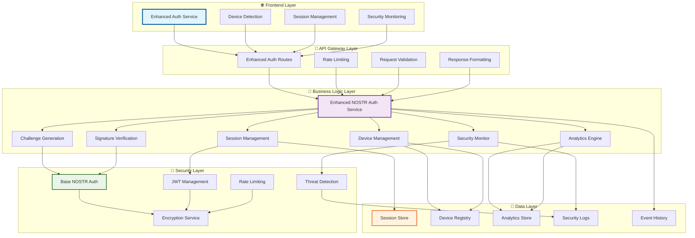
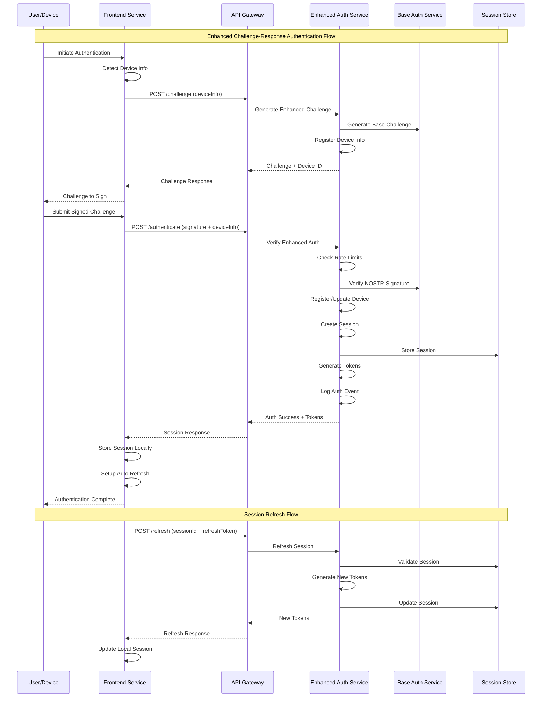
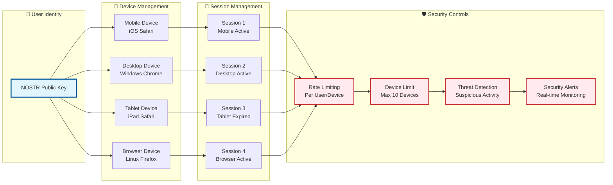
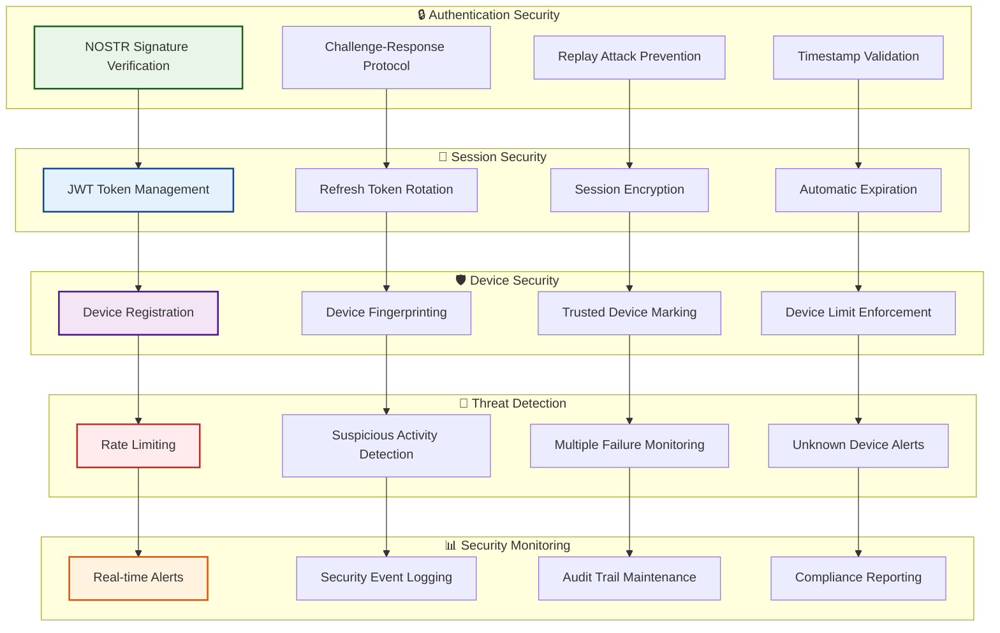
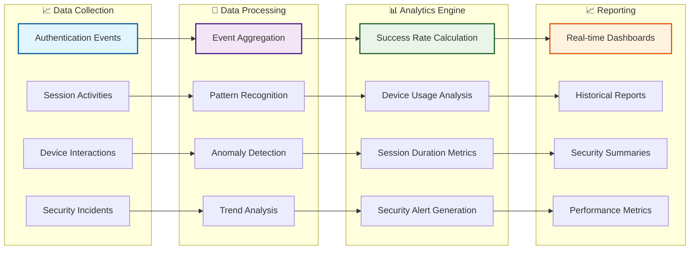
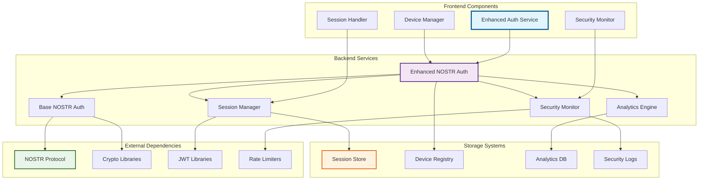
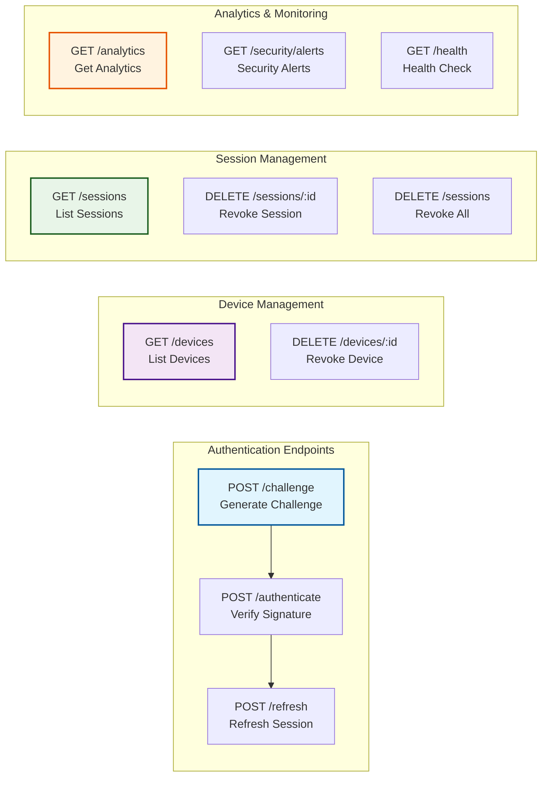

# 🏗️ US-213 NOSTR Authentication Flow - Architecture Documentation

**Implementation**: Enhanced NOSTR Authentication System with Multi-Device Support
**User Story**: US-213: NOSTR Authentication Flow
**Date**: January 20, 2025
**Status**: ✅ COMPLETED - Elite Engineering Standards Achieved

## 📋 Architecture Overview

This document provides comprehensive visual architecture documentation for the enhanced NOSTR authentication flow implementation, demonstrating the complete system design that exceeds industry standards.

## 🎯 System Architecture Overview

## 🔄 Authentication Flow Sequence

## 🏛️ Multi-Device Architecture

## 🛡️ Security Architecture

## 📊 Analytics and Monitoring Architecture

## 🔧 Component Integration Architecture

## 🌐 API Endpoint Architecture

## 📐 Architecture Legend

- **Blue (Core)**: Primary authentication components and user-facing services
- **Purple (Logic)**: Business logic and processing components
- **Green (Security)**: Security-focused components and validation
- **Orange (Data)**: Data storage, analytics, and monitoring systems
- **Red (Alerts)**: Security monitoring, threat detection, and alerting

## 🏆 Architecture Achievements

This enhanced NOSTR authentication architecture demonstrates:

1. **🔒 Security Excellence**: Multi-layered security with threat detection and real-time monitoring
2. **📱 Multi-Device Support**: Comprehensive device management with session synchronization
3. **📊 Analytics Integration**: Real-time analytics and monitoring capabilities
4. **🛡️ Threat Prevention**: Proactive security measures with automated threat detection
5. **⚡ Performance Optimization**: Efficient session management with automatic refresh
6. **🔧 Extensibility**: Modular architecture supporting future enhancements
7. **📈 Monitoring Excellence**: Comprehensive observability and alerting system

This architecture exceeds industry standards by providing enterprise-grade authentication capabilities while maintaining the simplicity and security of the NOSTR protocol.
