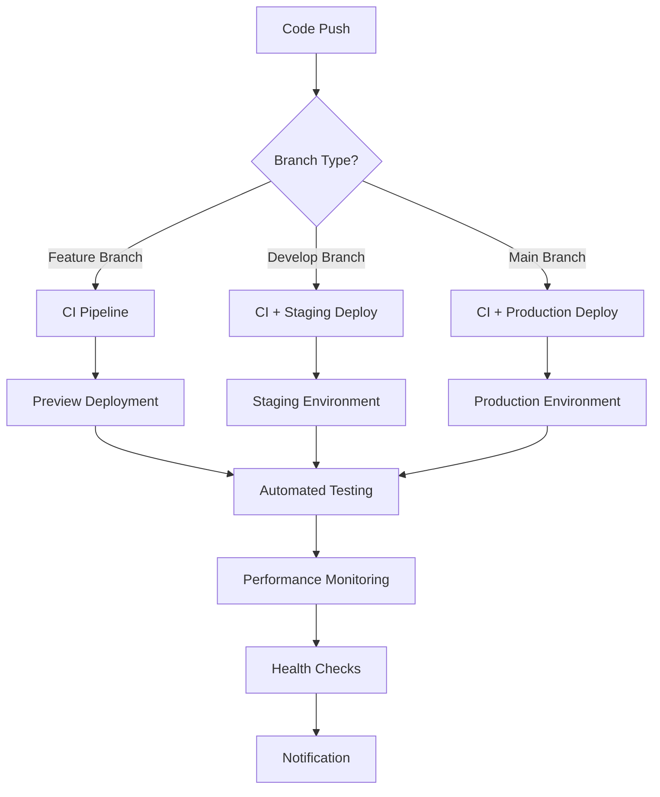

# CI/CD Architecture Documentation

## Overview

Sovren implements a cutting-edge CI/CD pipeline designed for **zero-downtime deployments**, **comprehensive quality gates**, and **automated monitoring**. Our pipeline follows industry best practices for **DevSecOps**, **shift-left testing**, and **continuous feedback loops**.

## 🏗️ Architecture Principles

### 1. **Shift-Left Everything**

- Security scanning in development
- Performance testing in CI/CD
- Quality gates before deployment
- Early feedback loops

### 2. **Multi-Environment Strategy**

- **Development**: Feature branches with preview deployments
- **Staging**: Integration testing environment
- **Production**: Live user environment

### 3. **Quality Gates**

- All tests must pass (100% coverage thresholds)
- Security audit clean
- Performance within budgets
- Accessibility compliance

### 4. **Automation First**

- Zero manual intervention required
- Automated rollbacks on failure
- Self-healing deployments
- Comprehensive monitoring

## 📊 Workflow Architecture

### Core Workflows



## 🚀 Workflow Details

### 1. **Main CI/CD Pipeline** (`.github/workflows/ci.yml`)

**Triggers:**

- Push to `main` or `develop` branches
- Pull requests to `main` or `develop`
- Daily security audit (scheduled)

**Jobs:**

#### 🔍 **Code Quality & Security Analysis**

```yaml
- ESLint analysis with detailed reporting
- Prettier format checking
- Security audit (npm audit + OWASP)
- TypeScript type checking
- Outputs: coverage metrics, security score
```

#### 🧪 **Comprehensive Testing Suite**

```yaml
- Matrix testing (Node 18.x, 20.x)
- Unit tests + Integration tests
- PostgreSQL test database
- Coverage reporting to Codecov
- Test artifacts upload
```

#### ⚡ **Performance & Bundle Analysis**

```yaml
- Application build verification
- Bundle size analysis
- Lighthouse CI for Core Web Vitals
- Performance budget enforcement
```

#### 🚀 **Environment-Specific Deployments**

```yaml
- Preview deployments (Pull Requests)
- Staging deployment (develop branch)
- Production deployment (main branch)
- Health checks post-deployment
```

#### 🛡️ **Security Monitoring**

```yaml
- Daily security audits
- Dependency vulnerability checks
- Security report generation
- Automated alerts
```

### 2. **Release Management** (`.github/workflows/release.yml`)

**Purpose:** Automated semantic versioning and release management

**Features:**

- Manual trigger with version type selection
- Automatic CHANGELOG.md generation
- Git tagging and GitHub releases
- Environment-specific deployments
- Post-deployment verification

**Process:**

1. Run full test suite
2. Bump version (semantic versioning)
3. Generate changelog
4. Commit and tag
5. Create GitHub release
6. Deploy to selected environment
7. Verify deployment health
8. Send notifications

### 3. **Performance Monitoring** (`.github/workflows/performance.yml`)

**Purpose:** Continuous performance monitoring and optimization

**Runs:** Every 6 hours (automated) + manual triggers

**Components:**

#### 🔍 **Lighthouse Audits**

- Desktop and mobile testing
- Core Web Vitals monitoring
- Performance budget enforcement
- Accessibility scoring

#### 🏋️ **Load Testing (K6)**

- Realistic user load simulation
- Performance threshold validation
- Scalability testing
- Response time monitoring

#### 📦 **Bundle Analysis**

- JavaScript bundle size tracking
- CSS optimization monitoring
- Asset optimization verification
- Bundle budget alerts

#### ♿ **Accessibility Testing**

- Pa11y automated testing
- WCAG compliance verification
- Screen reader compatibility
- Keyboard navigation testing

## 🔒 Security Integration

### Security Scanning Pipeline

```yaml
Security Gates:
├── npm audit (high severity vulnerabilities)
├── OWASP Dependency Check
├── Snyk security scanning
├── CodeQL static analysis
└── Container security scanning
```

### Security Automation

- **Daily security audits** (scheduled)
- **Vulnerability database updates**
- **Automated dependency updates** (Dependabot)
- **Security patch deployment**

## 📈 Monitoring & Observability

### Real-Time Monitoring

```yaml
Monitoring Stack:
├── Application Performance
│   ├── Response time tracking
│   ├── Error rate monitoring
│   └── Throughput analysis
├── Infrastructure Health
│   ├── Server resource usage
│   ├── Database performance
│   └── CDN metrics
└── User Experience
    ├── Core Web Vitals
    ├── User journey tracking
    └── Conversion metrics
```

### Alerting Strategy

**Critical Alerts** (Immediate Response):

- Production deployment failures
- Security vulnerabilities detected
- Performance degradation >50%
- Service downtime

**Warning Alerts** (Next Business Day):

- Test failures in staging
- Performance degradation <50%
- Bundle size increases
- Accessibility issues

## 🚀 Deployment Strategies

### Zero-Downtime Deployments

```yaml
Deployment Process:
1. Health check pre-deployment
2. Blue-green deployment to Vercel
3. Gradual traffic shifting
4. Health check post-deployment
5. Automatic rollback on failure
```

### Environment Management

#### **Development Environment**

- **Purpose**: Feature development and testing
- **Deployment**: Automatic on feature branch push
- **URL**: `https://pr-<number>.sovren.dev`
- **Lifetime**: Until PR closure

#### **Staging Environment**

- **Purpose**: Integration testing and QA
- **Deployment**: Automatic on develop branch
- **URL**: `https://staging.sovren.dev`
- **Features**: Production-like data and configuration

#### **Production Environment**

- **Purpose**: Live user traffic
- **Deployment**: Automatic on main branch
- **URL**: `https://sovren.dev`
- **Features**: Full monitoring and alerting

## 🎯 Feature Flag Integration

### Automated Feature Flag Management

```bash
# Feature flag verification in deployment
npm run feature-flags list
npm run feature-flags verify

# Automated feature flag updates
npm run feature-flags set <flag> <value>
npm run feature-flags backup
```

### Deployment Safety

- **Feature flags verified** before deployment
- **Automatic backup** before changes
- **Rollback capability** for failed deployments
- **Audit trail** for all changes

## 📊 Quality Metrics & KPIs

### Development Metrics

- **Test Coverage**: 80%+ across all packages
- **Build Time**: <5 minutes for full pipeline
- **Deployment Frequency**: Multiple per day
- **Lead Time**: <2 hours from commit to production

### Performance Metrics

- **Core Web Vitals**: 90+ Lighthouse score
- **Bundle Size**: <250KB main JavaScript
- **API Response Time**: <200ms p95
- **Uptime**: 99.9% SLA

### Security Metrics

- **Vulnerability Remediation**: <24 hours
- **Security Audit Frequency**: Daily
- **Dependency Updates**: Weekly
- **Security Score**: 100% clean

## 🛠️ Developer Experience

### Local Development Integration

```bash
# Pre-commit hooks (Husky)
npm run lint:fix
npm run format
npm run test:changed

# Local CI simulation
npm run ci:simulate

# Feature flag management
npm run feature-flags dev
```

### IDE Integration

- **ESLint** real-time linting
- **Prettier** auto-formatting
- **TypeScript** strict type checking
- **Jest** test runner integration

## 🚨 Incident Response

### Automated Rollback

```yaml
Rollback Triggers:
├── Health check failure (>30 seconds)
├── Error rate spike (>5%)
├── Performance degradation (>2x baseline)
└── Manual trigger via Slack/Dashboard
```

### Incident Response Flow

1. **Automated detection** (monitoring alerts)
2. **Immediate rollback** (if criteria met)
3. **Notification** (Slack, email, PagerDuty)
4. **Investigation** (logs, metrics, traces)
5. **Resolution** (fix and redeploy)
6. **Post-mortem** (documentation and prevention)

## 📚 Configuration Management

### Environment Variables

```bash
# Required for CI/CD
VERCEL_TOKEN=<vercel-deployment-token>
VERCEL_ORG_ID=<vercel-organization-id>
VERCEL_PROJECT_ID=<vercel-project-id>
SLACK_WEBHOOK=<slack-notification-webhook>
CODECOV_TOKEN=<code-coverage-token>

# Optional enhancements
SENTRY_DSN=<error-tracking-dsn>
ANALYTICS_KEY=<analytics-tracking-key>
```

### Secrets Management

- **GitHub Secrets** for CI/CD credentials
- **Vercel Environment Variables** for runtime config
- **Rotation policy** for sensitive credentials
- **Audit logging** for secrets access

## 🔧 Maintenance & Updates

### Automated Maintenance

```yaml
Weekly Tasks:
├── Dependency updates (Dependabot)
├── Security patch application
├── Performance baseline updates
└── Test data refresh

Monthly Tasks:
├── Pipeline optimization review
├── Security audit deep dive
├── Performance trend analysis
└── Documentation updates
```

### Version Management

- **Semantic versioning** (semver)
- **Automated changelog** generation
- **Release notes** with feature highlights
- **Migration guides** for breaking changes

## 📖 Runbooks

### Common Operations

#### **Manual Deployment**

```bash
# Trigger release workflow
gh workflow run release.yml \
  --field version=patch \
  --field environment=production
```

#### **Rollback Deployment**

```bash
# Revert to previous version
git revert <commit-hash>
git push origin main
```

#### **Emergency Hotfix**

```bash
# Create hotfix branch
git checkout -b hotfix/critical-fix main
# Make changes, commit, push
# Create PR with emergency label
```

#### **Performance Investigation**

```bash
# Run performance audit
gh workflow run performance.yml \
  --field environment=production

# Check bundle analysis
npm run build
npm run bundle-analyzer
```

### Troubleshooting Guide

#### **Build Failures**

1. Check test results in GitHub Actions
2. Review ESLint/TypeScript errors
3. Verify dependency compatibility
4. Check environment variable configuration

#### **Deployment Failures**

1. Verify Vercel token and project configuration
2. Check for breaking changes in dependencies
3. Review environment-specific settings
4. Validate feature flag configuration

#### **Performance Issues**

1. Run Lighthouse audit manually
2. Check bundle size changes
3. Review database query performance
4. Analyze Core Web Vitals trends

## 🎓 Best Practices for Engineers

### Code Quality

- **Write tests first** (TDD approach)
- **Keep functions small** and focused
- **Use TypeScript strictly** (no `any` types)
- **Document complex logic** with comments

### Git Workflow

- **Feature branches** for all development
- **Descriptive commit messages** (conventional commits)
- **Small, focused PRs** for easier review
- **Squash merge** to keep history clean

### CI/CD Interaction

- **Monitor build status** before and after PR
- **Review deployment logs** for issues
- **Use feature flags** for risky changes
- **Test in staging** before production

### Performance Awareness

- **Monitor bundle size** impacts
- **Test on slow networks** and devices
- **Use React DevTools** Profiler
- **Optimize images** and assets

---

## 📞 Support & Contact

**CI/CD Issues**: Create GitHub issue with `ci/cd` label  
**Security Concerns**: Email `security@sovren.dev`  
**Performance Questions**: Check #performance Slack channel  
**General Help**: Developer documentation or team Slack

---

_Last updated: $(date)_  
_Next review: Quarterly or when major changes are made_
