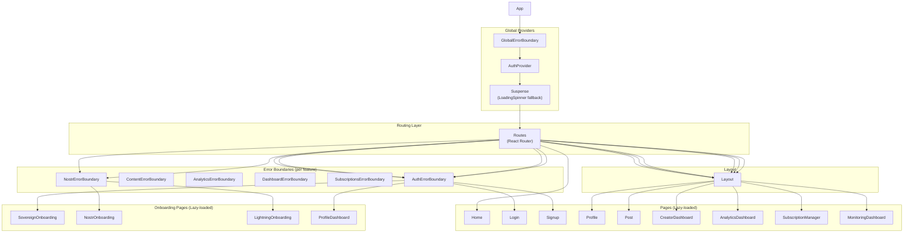
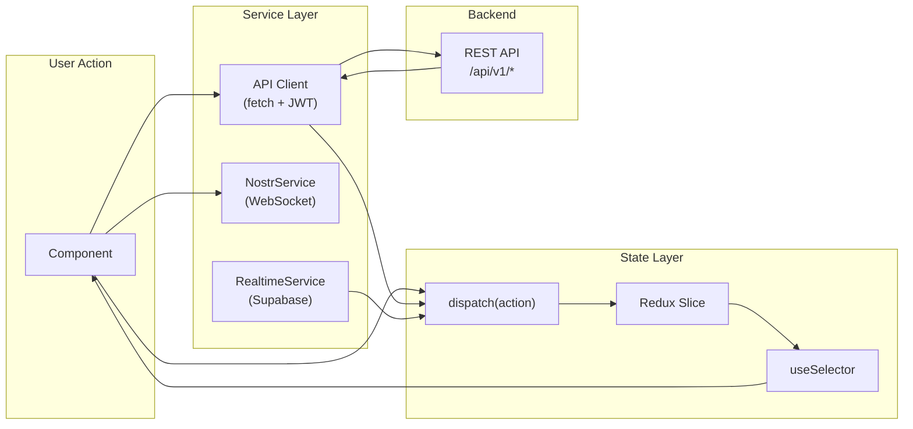

# Sovren Frontend Component Tree

**Version:** 2.0.0
**Date:** 2026-02-11
**Framework:** React 18 + TypeScript + Vite + Redux Toolkit

## Route-Component Mapping

```
/                          -> Home (public)
/login                     -> Login (public, AuthErrorBoundary)
/signup                    -> Signup (public, AuthErrorBoundary)
/onboarding                -> SovereignOnboarding (public, AuthErrorBoundary)
/onboarding/nostr          -> NostrOnboarding (public, NostrErrorBoundary)
/onboarding/lightning       -> LightningOnboarding (public, NostrErrorBoundary)
/profile-dashboard          -> ProfileDashboard (public, AuthErrorBoundary)
/profile                   -> Profile (protected, Layout, AuthErrorBoundary)
/post/:id                  -> Post (protected, Layout, ContentErrorBoundary)
/create                    -> CreatorDashboard (protected, Layout, ContentErrorBoundary)
/dashboard                 -> CreatorDashboard (protected, Layout, DashboardErrorBoundary)
/dashboard/analytics       -> AnalyticsDashboard (protected, Layout, AnalyticsErrorBoundary)
/dashboard/subscriptions   -> SubscriptionManager (protected, Layout, SubscriptionsErrorBoundary)
/monitoring                -> MonitoringDashboard (protected, role=admin, Layout, DashboardErrorBoundary)
```

## Component Hierarchy



## Feature Modules

```
packages/frontend/src/
  features/
    auth/           Authentication flows (Login, Signup, NOSTR key auth)
      ErrorBoundary.tsx
      components/
        AuthProvider.tsx
        ProtectedRoute.tsx
    content/        Content creation, display, editing
      ErrorBoundary.tsx
      components/
    analytics/      Creator analytics dashboards
      ErrorBoundary.tsx
      components/
        CreatorDashboard.tsx
    subscriptions/  Subscription tier management
      ErrorBoundary.tsx
      components/
        SubscriptionManager.tsx
    nostr/          NOSTR protocol integration
      ErrorBoundary.tsx
      components/
    dashboard/      Monitoring and admin dashboards
      ErrorBoundary.tsx
      components/
        MonitoringDashboard.tsx
```

## Shared Component Library

```
packages/frontend/src/components/
  ui/                 Design system primitives
    Layout.tsx          Main layout wrapper (header, sidebar, content area)
    Button, Card, Input, etc.

  auth/               Authentication components
    ExtensionSelector.tsx     NOSTR browser extension picker
    NOSTRKeyManager.tsx       Key import/export UI
    NOSTRSessionProtection.tsx Session security
    NOSTRSigningValidator.tsx  Signature verification UI

  lightning/           Lightning Network components
    LightningPaymentButton.tsx   Pay-with-Lightning button + QR modal
    LightningSubscriptionCard.tsx Subscription tier display + payment
    LightningWalletManager.tsx    Wallet connection management
    PaymentHistory.tsx            Transaction history view

  nostr/              NOSTR protocol components
    DMInbox.tsx          Encrypted direct message inbox (NIP-04)
    FilterBuilder.tsx    NOSTR event filter construction UI
    NostrKeyManagement.tsx Key generation and management
    NostrMonitoringDashboard.tsx Relay health monitoring
    errors/             NOSTR-specific error display components
    backup/             Key backup and restore dialogs

  analytics/          Analytics visualization
    AnalyticsDashboard.tsx    Main analytics view
    EngagementAnalyticsDashboard.tsx Engagement metrics
    GrowthForecastingChart.tsx      Growth predictions
    OptimizationSuggestionPanel.tsx AI-powered suggestions
    PerformancePredictionViewer.tsx Performance forecasts

  onboarding/         Guided onboarding flows
    SovereignOnboarding.tsx   Main onboarding entry point
    NostrOnboarding.tsx       NOSTR key setup wizard
    LightningOnboarding.tsx   Lightning wallet setup wizard

  performance/        Performance optimization
    APIResponseCache.tsx
    ImageOptimizer.tsx
    PageLoadOptimizer.tsx
    PWAServiceWorker.tsx
    LiveContentUpdates.tsx

  admin/              Admin dashboard components
    AutomatedContentModerationDashboard.tsx
    AutonomousUserManagementDashboard.tsx

  providers/          Context providers
    ModalManager.tsx
    NotificationProvider.tsx
    ThemeProvider.tsx
```

## State Management (Redux)

```
packages/frontend/src/store/
  index.ts            Redux store configuration
  hooks.ts            Typed useSelector/useDispatch hooks
  types.ts            Root state types

  slices/
    userSlice.ts        User authentication state, profile, role
    uiSlice.ts          UI state (theme, modals, toasts)
    layoutSlice.ts      Layout state (sidebar, responsive breakpoints)
    navigationSlice.ts  Navigation state (breadcrumbs, history)
    cmsUiSlice.ts       CMS editor state
    paginationSlice.ts  Pagination state
    unifiedCmsSlice.ts  Unified CMS management state
```

## Frontend Services

```
packages/frontend/src/services/
  nostr/                     NOSTR protocol services
    RelayPoolManager.ts        WebSocket relay pool management
    SubscriptionManagerService.ts NOSTR subscription management
    EventPublisherService.ts   Event creation and publishing
    EventCacheService.ts       Event deduplication and caching
    KeyManagementService.ts    Key generation, storage
    NIP04Service.ts            Encrypted DM (NIP-04)
    NIP05Service.ts            Identity verification (NIP-05)
    NIP19Service.ts            Bech32 encoding (NIP-19)
    NIP26Service.ts            Delegated signing (NIP-26)
    NIP65Service.ts            Relay list metadata (NIP-65)
    MonitoringService.ts       Relay health monitoring
    RateLimiter.ts             Client-side rate limiting
    WebSocketConnectionManager.ts WebSocket lifecycle

  NOSTRKeyManagementService.ts   Key storage and retrieval
  NOSTRSessionService.ts         Session management
  NOSTRSigningService.ts         Event signing
  NOSTRAccountProtectionService.ts Account security
  PrivacyControlsService.ts      Privacy settings management
  supabase-realtime-service.ts   Supabase realtime subscriptions
```

## Data Flow


