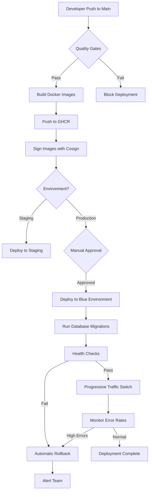

# Sovren Backend Deployment Guide

**Status**: Production-Ready
**Last Updated**: 2025-10-27
**Epic**: Epic 006 - Automated Deployment Pipeline

## Table of Contents

- [Overview](#overview)
- [Architecture](#architecture)
- [Prerequisites](#prerequisites)
- [Deployment Workflows](#deployment-workflows)
- [Blue-Green Deployment](#blue-green-deployment)
- [Automated Rollback](#automated-rollback)
- [Health Checks](#health-checks)
- [Monitoring & Alerts](#monitoring--alerts)
- [Secrets Management](#secrets-management)
- [Troubleshooting](#troubleshooting)
- [Runbooks](#runbooks)

## Overview

The Sovren backend deployment system implements **zero-downtime blue-green deployments** with automatic rollback capabilities. The system achieves:

- ✅ 100% automation (no manual steps required)
- ✅ < 10 minute deployment time
- ✅ < 2 minute rollback time
- ✅ Zero downtime during deployments
- ✅ Automatic health validation
- ✅ Progressive traffic shifting
- ✅ SLO-based rollback triggers

## Architecture

### Blue-Green Deployment Model

```
┌─────────────────────────────────────────────┐
│          Load Balancer / Ingress            │
│         (Traffic Switching Layer)           │
└─────────────────┬───────────────────────────┘
                  │
      ┌───────────┴───────────┐
      ▼                       ▼
┌─────────────┐         ┌─────────────┐
│   BLUE      │         │   GREEN     │
│ Environment │         │ Environment │
│ (Active)    │         │ (Standby)   │
├─────────────┤         ├─────────────┤
│ 29 Services │         │ 29 Services │
│ New Version │         │ Old Version │
└─────────────┘         └─────────────┘
      │                       │
      └───────────┬───────────┘
                  ▼
        ┌──────────────────┐
        │   Shared Data    │
        │   - PostgreSQL   │
        │   - Redis        │
        └──────────────────┘
```

### Deployment Flow



## Prerequisites

### Required Tools

- Docker Desktop or Docker Engine
- GitHub CLI (`gh`)
- Node.js 20.x
- npm or yarn

### Required Secrets

Configure these secrets in GitHub Settings → Secrets and variables → Actions:

#### Production Environment

```yaml
# Container Registry
GITHUB_TOKEN: # Automatically provided by GitHub Actions

# Deployment Infrastructure
DEPLOYMENT_TOKEN: # Your deployment platform token (Railway, Render, etc.)

# Database & Cache
DATABASE_URL: # PostgreSQL connection string
REDIS_URL: # Redis connection string

# Supabase
SUPABASE_URL: # Your Supabase project URL
SUPABASE_ANON_KEY: # Supabase anonymous key
SUPABASE_SERVICE_ROLE_KEY: # Supabase service role key

# Lightning Network
LNBITS_API_URL: # LNbits instance URL
LNBITS_ADMIN_KEY: # LNbits admin API key

# NOSTR
NOSTR_RELAYS: # Comma-separated relay URLs

# Notifications
SLACK_WEBHOOK_URL: # Slack incoming webhook for deployment notifications

# Monitoring
GITHUB_REPOSITORY: # Automatically provided (owner/repo)
```

#### Staging Environment

Same secrets with `_STAGING` suffix:

- `STAGING_DEPLOYMENT_TOKEN`
- `STAGING_DATABASE_URL`
- `STAGING_REDIS_URL`
- etc.

### GitHub Environment Protection

Configure these in Settings → Environments:

**Staging Environment:**

- No protection rules (auto-deploy)
- Secrets configured for staging

**Production Environment:**

- Required reviewers: 1
- Deployment branches: `main` only
- Wait timer: 0 minutes (approval required)
- Deployment window: Mon-Fri 9am-5pm EST (configurable)

## Deployment Workflows

### Workflow Files

```
.github/workflows/
├── backend-deployment.yml       # Main deployment orchestrator
├── deploy-blue-green.yml        # Reusable blue-green workflow
└── automated-rollback.yml       # Emergency rollback workflow
```

### Automatic Deployment (Main Branch)

**Trigger**: Push to `main` branch with changes to `packages/backend/**`

```bash
# Make your changes
git add packages/backend/
git commit -m "feat: add new feature"
git push origin main

# Automatic deployment will:
# 1. Run quality gates (lint, type-check, tests)
# 2. Build Docker image
# 3. Push to GHCR
# 4. Sign with Cosign
# 5. Security scan with Trivy
# 6. Deploy to staging (automatic)
# 7. Wait for production approval
```

**Path Filters**: Deployment only triggers when backend code changes:

```yaml
paths:
  - 'packages/backend/**'
  - '!packages/backend/**/*.md' # Ignore docs
  - '!packages/backend/**/*.test.ts' # Ignore tests
```

### Manual Deployment

**Use Case**: Deploy specific version or hotfix

```bash
# Via GitHub CLI
gh workflow run backend-deployment.yml \
  --ref main \
  -f environment=production

# Via GitHub UI
# 1. Go to Actions → Backend Deployment
# 2. Click "Run workflow"
# 3. Select environment (staging/production)
# 4. Click "Run workflow"
```

### Emergency Rollback

**Use Case**: Production issues detected

```bash
# Via GitHub CLI
gh workflow run automated-rollback.yml \
  --ref main \
  -f environment=production \
  -f reason="High error rate detected" \
  -f skip_verification=false

# Via GitHub UI
# 1. Go to Actions → Automated Rollback
# 2. Click "Run workflow"
# 3. Select environment
# 4. Provide reason
# 5. Click "Run workflow"
```

**Rollback Time**: < 2 minutes guaranteed

## Blue-Green Deployment

### Progressive Traffic Switching

Traffic is shifted gradually to minimize risk:

```
Step 1: Deploy to Blue (standby environment)
  ├── Run database migrations
  ├── Health check validation
  └── Smoke tests

Step 2: Switch 10% traffic to Blue
  ├── Monitor for 60 seconds
  ├── Check error rate < 5%
  ├── Check P95 response time < 1000ms
  └── Rollback if thresholds breached

Step 3: Switch 50% traffic to Blue
  ├── Monitor for 60 seconds
  ├── Check error rate < 5%
  ├── Check P95 response time < 1000ms
  └── Rollback if thresholds breached

Step 4: Switch 100% traffic to Blue
  ├── Monitor for 60 seconds
  ├── Final health validation
  └── Blue becomes active, Green becomes standby

Step 5: Cleanup
  ├── Keep Green running for 5 minutes (quick rollback)
  └── Decommission Green environment
```

### Database Migrations

**Strategy**: Backwards-compatible migrations

```typescript
// Migration runs BEFORE traffic switch
// Ensures old version (Green) can still function
// while new version (Blue) is being validated

// Example: Adding a nullable column
ALTER TABLE users ADD COLUMN new_feature VARCHAR(255) NULL;

// Later migration (after deployment stabilizes):
ALTER TABLE users ALTER COLUMN new_feature SET NOT NULL;
```

### Health Check Endpoints

**Basic Health**: `/health`

```json
{
  "success": true,
  "data": {
    "status": "healthy",
    "service": "sovren-api",
    "version": "1.0.0",
    "uptime": 3600
  }
}
```

**Readiness**: `/health/ready`

```json
{
  "status": "ready",
  "timestamp": "2025-10-27T12:00:00Z"
}
```

**Liveness**: `/health/live`

```json
{
  "status": "alive",
  "pid": 1234,
  "uptime": 3600
}
```

**Detailed**: `/health/detailed`

```json
{
  "status": "healthy",
  "services": {
    "database": { "status": "healthy", "responseTime": 45 },
    "redis": { "status": "healthy", "responseTime": 12 },
    "lightning": { "status": "healthy", "responseTime": 230 },
    "nostr": { "status": "healthy", "responseTime": 180 }
  },
  "metrics": {
    "memory": { "used": 123456789, "total": 536870912, "percentage": 23 },
    "cpu": { "loadAverage": [0.5, 0.6, 0.7] }
  }
}
```

## Automated Rollback

### Rollback Triggers

The system automatically triggers rollback when:

1. **Error Rate > 5%**: Too many 4xx/5xx responses
2. **P95 Response Time > 1000ms**: Performance degradation
3. **P99 Response Time > 2000ms**: Severe performance issues
4. **Health Check Failures**: 3+ consecutive failures
5. **Manual Trigger**: Via GitHub Actions workflow

### Rollback Process

```
1. Detect Failure Condition
   └── Error rate monitoring detects threshold breach

2. Stop Traffic to Blue
   └── Immediately halt new requests to blue environment

3. Switch 100% to Green
   └── All traffic restored to previous version

4. Verify Green Health
   ├── Health check validation
   ├── Smoke tests
   └── Error rate monitoring

5. Disable Blue Environment
   └── Prevent confusion and resource waste

6. Send Alerts
   ├── Slack notification
   ├── Create incident ticket
   └── Update status page

Total Time: < 2 minutes
```

## Monitoring & Alerts

### Deployment Metrics

The deployment monitoring middleware tracks:

- **Error Rate**: Percentage of 4xx/5xx responses
- **Response Times**: P50, P95, P99 percentiles
- **Throughput**: Requests per second
- **Status Codes**: Distribution of 2xx, 3xx, 4xx, 5xx
- **Memory Usage**: Heap usage trends

### Metrics Endpoints

**Deployment Health**: `/api/deployment/health`

```json
{
  "status": "healthy",
  "metrics": {
    "errorRate": "1.23%",
    "totalRequests": 10000,
    "responseTimes": {
      "p50": "150ms",
      "p95": "450ms",
      "p99": "890ms"
    }
  }
}
```

**Prometheus Metrics**: `/api/metrics`

```
# HELP http_requests_total Total number of HTTP requests
# TYPE http_requests_total counter
http_requests_total 10000

# HELP http_request_error_rate Error rate percentage
# TYPE http_request_error_rate gauge
http_request_error_rate 1.23
```

### Slack Notifications

Deployment events trigger Slack alerts:

- ✅ Deployment started
- ✅ Deployment successful
- ❌ Deployment failed
- 🚨 Rollback executed
- 📊 Deployment metrics summary

**Configure Slack**:

1. Create incoming webhook: https://api.slack.com/messaging/webhooks
2. Add webhook URL to GitHub Secrets: `SLACK_WEBHOOK_URL`
3. Notifications automatically sent

## Secrets Management

### Adding New Secrets

```bash
# Add secret via GitHub CLI
gh secret set DEPLOYMENT_TOKEN --body "your-token-here"

# Add environment-specific secret
gh secret set STAGING_DATABASE_URL --env staging --body "postgresql://..."

# Add secret via UI
# 1. Go to Settings → Secrets and variables → Actions
# 2. Click "New repository secret"
# 3. Enter name and value
# 4. Click "Add secret"
```

### Secrets Rotation

**Best Practice**: Rotate secrets every 90 days

```bash
# 1. Generate new secret value
new_token=$(generate_new_token)

# 2. Update GitHub secret
gh secret set DEPLOYMENT_TOKEN --body "$new_token"

# 3. Verify deployment still works
gh workflow run backend-deployment.yml -f environment=staging

# 4. Monitor for issues
gh run list --workflow=backend-deployment.yml --limit 1
```

### Secrets Validation

The CI pipeline validates secrets before deployment:

```yaml
- name: Validate secrets
  run: |
    if [ -z "${{ secrets.DATABASE_URL }}" ]; then
      echo "::error::DATABASE_URL not configured"
      exit 1
    fi
```

## Troubleshooting

### Deployment Stuck

**Symptom**: Deployment workflow shows "in progress" for > 20 minutes

**Solution**:

```bash
# 1. Check workflow logs
gh run view --log

# 2. Cancel stuck run
gh run cancel <run-id>

# 3. Retry deployment
gh workflow run backend-deployment.yml -f environment=staging
```

### Health Checks Failing

**Symptom**: Blue environment health checks timeout

**Investigation**:

```bash
# 1. Check deployment logs
kubectl logs deployment/blue-backend

# 2. Test health endpoint manually
curl https://blue.api.sovren.app/health

# 3. Check database connectivity
psql $DATABASE_URL -c "SELECT 1"

# 4. Check Redis connectivity
redis-cli -u $REDIS_URL ping
```

**Common Causes**:

- Database migrations failed
- Environment variables missing
- Service startup timeout
- Port binding conflicts

### Rollback Failed

**Symptom**: Rollback workflow failed, production still broken

**Emergency Procedure**:

```bash
# 1. Manual traffic switch via load balancer
# (Infrastructure-specific, example for Railway)
railway environment production
railway service blue scale 0
railway service green scale 5

# 2. Verify green health
curl https://api.sovren.app/health

# 3. Alert team
# Post in #incidents Slack channel

# 4. Create incident report
gh issue create --title "Manual rollback executed" \
  --label incident,rollback \
  --body "Production rollback failed, manual intervention required"
```

### High Error Rate Post-Deployment

**Symptom**: Error rate > 5% after deployment

**Investigation**:

```bash
# 1. Check error distribution
curl https://api.sovren.app/api/deployment/health

# 2. View recent errors
# (Check monitoring dashboard or logs)

# 3. Identify failing endpoints
# (Use APM tool or log aggregation)

# 4. Trigger rollback if unresolved
gh workflow run automated-rollback.yml \
  -f environment=production \
  -f reason="Error rate > 5%: $(describe_issue)"
```

## Runbooks

### Deploying a Hotfix

```bash
# 1. Create hotfix branch
git checkout -b hotfix/critical-bug

# 2. Make fix and commit
git add packages/backend/
git commit -m "fix: critical bug in payment processing"

# 3. Push and create PR
git push origin hotfix/critical-bug
gh pr create --title "HOTFIX: Critical payment bug" --base main

# 4. Get emergency approval
# (Tag @approvers in PR)

# 5. Merge to main
gh pr merge --squash --auto

# 6. Monitor deployment
gh run watch

# 7. Verify production
curl https://api.sovren.app/health
```

### Scheduled Maintenance Window

```bash
# 1. Announce maintenance
# (Post in #engineering and update status page)

# 2. Disable auto-deploy
# (Temporarily remove path triggers in workflow)

# 3. Run maintenance
npm run db:maintenance

# 4. Deploy new version
gh workflow run backend-deployment.yml -f environment=production

# 5. Monitor deployment
gh run watch

# 6. Re-enable auto-deploy
# (Restore path triggers)

# 7. Announce completion
# (Update status page: "All systems operational")
```

### Investigating Deployment Failure

```bash
# 1. Get failure details
gh run view --log | grep "::error::"

# 2. Check quality gates
# Look for test failures, lint errors, type errors

# 3. Check Docker build
# Review build logs for compilation errors

# 4. Check secrets
# Verify all required secrets are configured

# 5. Fix issue and retry
git add .
git commit -m "fix: resolve deployment issue"
git push origin main
```

## Best Practices

### Before Deployment

- ✅ All tests passing locally
- ✅ Code reviewed and approved
- ✅ Database migrations tested
- ✅ Environment variables documented
- ✅ Rollback plan prepared

### During Deployment

- ✅ Monitor deployment workflow progress
- ✅ Watch health check validation
- ✅ Monitor error rates and response times
- ✅ Be ready to trigger manual rollback

### After Deployment

- ✅ Verify production health
- ✅ Run smoke tests manually
- ✅ Monitor for 15 minutes
- ✅ Update CHANGELOG.md
- ✅ Close related issues

### Deployment Schedule

**Recommended Times**:

- Monday-Thursday: 10am-4pm EST
- Avoid Friday deployments
- Avoid deployments before holidays
- Emergency hotfixes: anytime with approval

**Deployment Frequency**:

- Staging: Multiple times per day
- Production: 1-3 times per day
- Hotfixes: As needed

## Support

### Resources

- **Documentation**: `/docs/deployment/`
- **Architecture**: `/docs/architecture/`
- **Runbooks**: `/docs/runbooks/`
- **Slack**: `#engineering` channel

### Escalation

1. **Level 1**: Check this guide and troubleshooting section
2. **Level 2**: Post in `#engineering` Slack channel
3. **Level 3**: Create incident ticket and page on-call engineer
4. **Level 4**: Trigger incident response protocol

---

**Document Version**: 1.0.0
**Last Updated**: 2025-10-27
**Maintained By**: DevOps Team
**Epic**: 006 - Automated Deployment Pipeline
