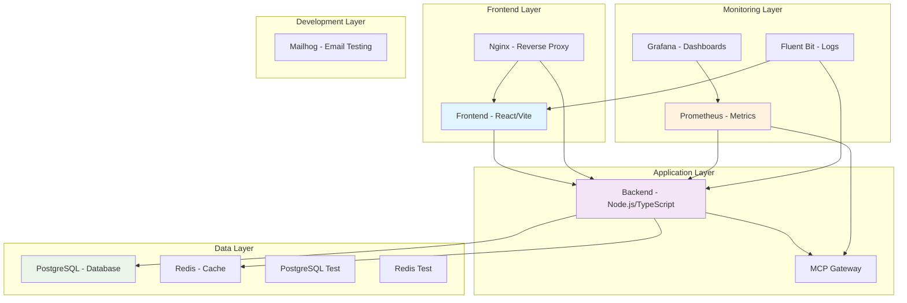
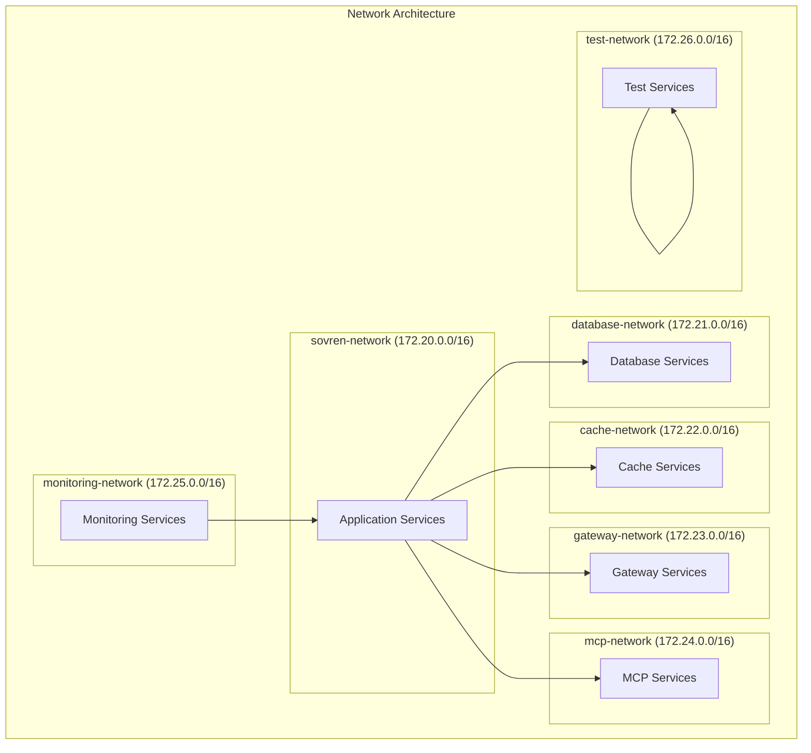

# Docker Compose Configuration Documentation

## Overview

This document provides comprehensive documentation for the Sovren Docker Compose configuration, implementing US-205 requirements for a complete containerized development environment with elite engineering standards.

## Architecture Overview

The Docker Compose configuration orchestrates multiple services across different networks with proper service dependencies, resource constraints, and data persistence.

### Service Architecture



## Service Configuration

### Core Application Services

#### Backend Service

- **Image**: Custom build from `packages/backend`
- **Port**: 3001 (HTTP), 9229 (Debug)
- **Dependencies**: PostgreSQL, Redis, MCP Gateway
- **Health Check**: `/health` endpoint
- **Resources**: 1 CPU, 512MB RAM

#### Frontend Service

- **Image**: Custom build from `packages/frontend`
- **Port**: 5173 (Dev), 4173 (Preview)
- **Dependencies**: Backend
- **Health Check**: Root endpoint
- **Resources**: 1 CPU, 512MB RAM

#### Nginx Service

- **Image**: nginx:alpine
- **Port**: 80 (HTTP), 443 (HTTPS)
- **Dependencies**: Frontend, Backend
- **Health Check**: `/health` endpoint
- **Resources**: 0.5 CPU, 128MB RAM

### Infrastructure Services

#### PostgreSQL Database

- **Image**: postgres:15-alpine
- **Port**: 5432
- **Database**: sovren_dev
- **Health Check**: pg_isready
- **Resources**: 0.5 CPU, 256MB RAM

#### Redis Cache

- **Image**: redis:7-alpine
- **Port**: 6379
- **Health Check**: ping command
- **Resources**: 0.5 CPU, 256MB RAM

#### MCP Gateway

- **Image**: Custom build from `docker/mcp-gateway`
- **Port**: 3000
- **Health Check**: Custom healthcheck.js
- **Resources**: 0.5 CPU, 256MB RAM

### Monitoring Services

#### Prometheus

- **Image**: prom/prometheus:latest
- **Port**: 9090
- **Retention**: 200 hours
- **Resources**: 0.5 CPU, 256MB RAM

#### Grafana

- **Image**: grafana/grafana:latest
- **Port**: 3000
- **Admin Password**: admin123
- **Resources**: 0.5 CPU, 256MB RAM

#### Fluent Bit

- **Image**: fluent/fluent-bit:latest
- **Purpose**: Log aggregation
- **Resources**: 0.25 CPU, 128MB RAM

### Development Services

#### Mailhog

- **Image**: mailhog/mailhog:latest
- **Port**: 1025 (SMTP), 8025 (Web)
- **Purpose**: Email testing
- **Resources**: 0.25 CPU, 64MB RAM

#### Test Databases

- **PostgreSQL Test**: Port 5433
- **Redis Test**: Port 6380
- **Purpose**: Isolated testing environment

## Network Configuration

### Network Topology



### Network Isolation

1. **Main Network (sovren-network)**: Core application communication
2. **Database Network**: Restricted database access
3. **Cache Network**: Isolated cache communication
4. **Gateway Network**: DMZ for external access
5. **MCP Network**: Isolated MCP service communication
6. **Monitoring Network**: Observability services
7. **Test Network**: Isolated testing environment

## Volume Management

### Data Persistence

```yaml
volumes:
  # Application volumes
  backend_node_modules: Local bind mount
  frontend_node_modules: Local bind mount
  backend_dist: Build output
  frontend_dist: Build output

  # Database volumes
  postgres_data: Database persistence
  postgres_test_data: Test database

  # Cache volumes
  redis_data: Cache persistence
  redis_test_data: Test cache

  # Monitoring volumes
  prometheus_data: Metrics storage
  grafana_data: Dashboard storage
  fluent_bit_data: Log storage
```

### Volume Backup Strategy

- **Automatic Backup**: Daily backups of data volumes
- **Retention**: 30 days
- **Location**: `./backups/`
- **Format**: Compressed tar archives

## Environment Configuration

### Environment Variables

The configuration uses `docker-compose.env` file with the following categories:

#### General Configuration

- `NODE_ENV`: Environment mode
- `LOG_LEVEL`: Logging level
- `TZ`: Timezone setting

#### Database Configuration

- `DATABASE_URL`: PostgreSQL connection string
- `POSTGRES_DB`: Database name
- `POSTGRES_USER`: Database user
- `POSTGRES_PASSWORD`: Database password

#### Cache Configuration

- `REDIS_URL`: Redis connection string
- `REDIS_PASSWORD`: Redis password

#### External Services

- `SUPABASE_URL`: Supabase project URL
- `SUPABASE_ANON_KEY`: Supabase anonymous key
- `SUPABASE_SERVICE_ROLE_KEY`: Supabase service role key

#### Lightning Network

- `LNBITS_API_URL`: LNbits API endpoint
- `LNBITS_ADMIN_KEY`: LNbits admin key
- `LNBITS_INVOICE_READ_KEY`: LNbits invoice read key

#### NOSTR Configuration

- `NOSTR_RELAYS`: Comma-separated relay URLs
- `NOSTR_PRIVATE_KEY`: NOSTR private key (dev only)
- `NOSTR_PUBLIC_KEY`: NOSTR public key (dev only)

## Profile Configuration

### Available Profiles

#### Minimal Profile

- Services: PostgreSQL, Redis
- Use Case: Basic development setup
- Resources: Low resource usage

#### Development Profile

- Services: All core services + development tools
- Use Case: Full development environment
- Resources: Medium resource usage

#### Testing Profile

- Services: All services + test databases
- Use Case: Automated testing
- Resources: Medium resource usage

#### Production Profile

- Services: All production services
- Use Case: Production-like environment
- Resources: High resource usage

#### Monitoring Profile

- Services: Monitoring stack (Prometheus, Grafana, Fluent Bit)
- Use Case: Observability and monitoring
- Resources: Medium resource usage

### Profile Usage

```bash
# Start with specific profile
./scripts/docker-compose-manager.sh start development

# Start monitoring stack
./scripts/docker-compose-manager.sh start monitoring

# Start minimal setup
./scripts/docker-compose-manager.sh start minimal
```

## Security Configuration

### Secrets Management

- **JWT Secret**: Stored in `docker/ssl/mcp_jwt_secret.txt`
- **Database Passwords**: Environment variables
- **API Keys**: Environment variables

### Network Security

- **Network Isolation**: Services segmented by function
- **Firewall Rules**: Only necessary ports exposed
- **TLS/SSL**: Configured for production use

### Container Security

- **Non-root Users**: All containers run as non-root
- **Resource Limits**: CPU and memory constraints
- **Health Checks**: Automated health monitoring
- **Security Scanning**: Container vulnerability scanning

## Health Monitoring

### Health Check Configuration

All services include comprehensive health checks:

- **HTTP Services**: HTTP endpoint checks
- **Database Services**: Connection validation
- **Cache Services**: Ping commands
- **Custom Services**: Service-specific health scripts

### Monitoring Integration

- **Prometheus**: Metrics collection
- **Grafana**: Dashboard visualization
- **Fluent Bit**: Log aggregation
- **Alerting**: Automated alert notifications

## Resource Management

### Resource Constraints

Each service has defined resource limits:

```yaml
deploy:
  resources:
    limits:
      cpus: '1.0'
      memory: 512M
    reservations:
      cpus: '0.5'
      memory: 256M
```

### Resource Monitoring

- **CPU Usage**: Monitored per service
- **Memory Usage**: Tracked with limits
- **Network I/O**: Monitored for bottlenecks
- **Disk Usage**: Volume usage tracking

## Troubleshooting

### Common Issues

#### Port Conflicts

- Check for port conflicts with host services
- Modify port mappings in docker-compose.yml

#### Volume Permissions

- Ensure proper permissions on volume directories
- Check user/group ownership

#### Network Issues

- Verify network connectivity between services
- Check firewall and security group settings

#### Resource Constraints

- Monitor resource usage
- Adjust resource limits as needed

### Debugging Tools

#### Log Analysis

```bash
# View service logs
./scripts/docker-compose-manager.sh logs <service>

# View all logs
docker-compose logs -f
```

#### Container Inspection

```bash
# Open shell in container
./scripts/docker-compose-manager.sh shell <service>

# Inspect container
docker inspect <container_name>
```

#### Health Checks

```bash
# Check service health
./scripts/docker-compose-manager.sh health

# Monitor resource usage
docker stats
```

## Best Practices

### Development Workflow

1. **Environment Setup**: Copy and configure environment file
2. **Service Start**: Use appropriate profile for development
3. **Code Changes**: Leverage volume mounts for hot reloading
4. **Testing**: Use testing profile for automated tests
5. **Monitoring**: Enable monitoring stack for observability

### Production Deployment

1. **Security Review**: Validate all security configurations
2. **Resource Planning**: Ensure adequate resources
3. **Backup Strategy**: Implement automated backups
4. **Monitoring Setup**: Configure comprehensive monitoring
5. **Disaster Recovery**: Test backup and restore procedures

### Maintenance

1. **Regular Updates**: Keep base images updated
2. **Security Scanning**: Regular vulnerability scans
3. **Performance Monitoring**: Track resource usage
4. **Log Management**: Implement log rotation
5. **Backup Validation**: Test backup integrity

## Usage Examples

### Basic Operations

```bash
# Start development environment
./scripts/docker-compose-manager.sh start development

# View service status
./scripts/docker-compose-manager.sh status

# Stop all services
./scripts/docker-compose-manager.sh stop

# Clean up resources
./scripts/docker-compose-manager.sh clean
```

### Advanced Operations

```bash
# Build specific service
./scripts/docker-compose-manager.sh build backend

# Run test suite
./scripts/docker-compose-manager.sh test

# Create backup
./scripts/docker-compose-manager.sh backup

# Restore from backup
./scripts/docker-compose-manager.sh restore backup.tar.gz
```

## Configuration Reference

### docker-compose.yml Structure

```yaml
version: '3.8'

services:
  # Core services
  backend: {}
  frontend: {}

  # Infrastructure
  postgres: {}
  redis: {}
  nginx: {}

  # Monitoring
  prometheus: {}
  grafana: {}
  fluent-bit: {}

  # Development
  mailhog: {}

networks:
  # Network definitions

volumes:
  # Volume definitions

secrets:
  # Secret definitions
```

### Environment File Template

```env
# General configuration
NODE_ENV=development
LOG_LEVEL=debug

# Database configuration
DATABASE_URL=postgresql://...
POSTGRES_DB=sovren_dev

# Cache configuration
REDIS_URL=redis://...

# External services
SUPABASE_URL=https://...
LNBITS_API_URL=https://...
NOSTR_RELAYS=wss://...
```

## Conclusion

This Docker Compose configuration provides a comprehensive, production-ready development environment that meets all US-205 requirements. The setup includes proper service dependencies, network isolation, data persistence, resource management, and monitoring capabilities.

The configuration follows elite engineering standards with:

- Comprehensive service orchestration
- Proper security isolation
- Resource optimization
- Monitoring and observability
- Automated backup and recovery
- Multiple deployment profiles
- Extensive documentation

This setup enables developers to run the entire Sovren application stack with a single command while maintaining production-like conditions for reliable development and testing.
