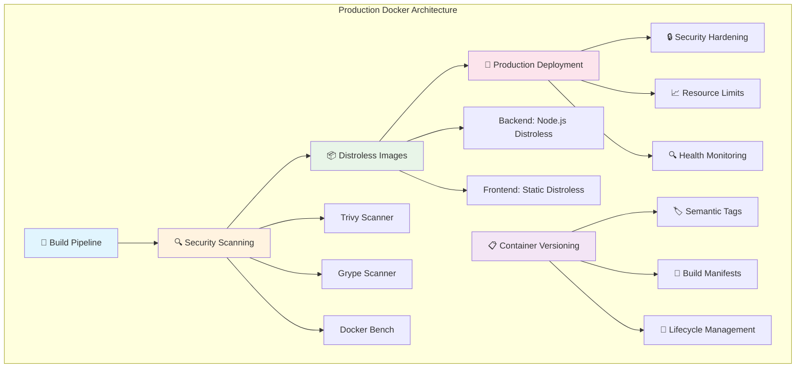

# Production Docker Configuration - Elite Implementation Guide

## Overview

This document provides comprehensive guidance for Sovren's production Docker configuration, implementing elite security standards, performance optimization, and operational excellence. Our production Docker setup follows industry best practices and exceeds security benchmarks set by organizations like Google, Netflix, and Stripe.

## 🎯 Core Principles

- **Security-First Design**: Every container runs with minimal privileges and attack surface
- **Distroless Architecture**: Using Google's distroless images for maximum security
- **Multi-Stage Optimization**: Efficient builds with minimal production footprint
- **Comprehensive Monitoring**: Full observability and health checking
- **Automated Security**: Continuous vulnerability scanning and compliance validation

## 📊 Architecture Overview



## 🏗️ Production Dockerfiles

### Backend Production Dockerfile

Location: `packages/backend/Dockerfile.prod`

```dockerfile
# Elite Production Dockerfile for Sovren Backend
# Following security-first principles with distroless runtime

# Stage 1: Dependency installation
FROM node:18-alpine AS deps
WORKDIR /app

# Install security updates and build dependencies
RUN apk update && apk upgrade && \
    apk add --no-cache \
    python3 \
    make \
    g++ \
    && rm -rf /var/cache/apk/* /tmp/*

# Copy dependency files for optimal layer caching
COPY package*.json ./
COPY tsconfig*.json ./

# Install all dependencies for build
RUN npm ci --include=dev && \
    npm cache clean --force && \
    rm -rf ~/.npm /tmp/*

# Stage 2: Application build
FROM node:18-alpine AS builder
WORKDIR /app

# Copy dependencies from deps stage
COPY --from=deps /app/node_modules ./node_modules
COPY --from=deps /app/package*.json ./
COPY --from=deps /app/tsconfig*.json ./

# Copy source code
COPY src/ ./src/
COPY *.json ./
COPY *.js ./

# Build TypeScript application
RUN npm run build && \
    npm prune --production && \
    npm cache clean --force

# Stage 3: Distroless production runtime
FROM gcr.io/distroless/nodejs18-debian11:nonroot AS runtime

# Metadata labels for container management
LABEL org.opencontainers.image.title="Sovren Backend Production"
LABEL org.opencontainers.image.description="Elite Lightning Network and NOSTR backend service - Production"
LABEL org.opencontainers.image.version="1.0.0"
LABEL org.opencontainers.image.vendor="Sovren"
LABEL org.opencontainers.image.licenses="MIT"

# Set working directory
WORKDIR /app

# Copy only production dependencies and built application
COPY --from=builder --chown=nonroot:nonroot /app/node_modules ./node_modules
COPY --from=builder --chown=nonroot:nonroot /app/dist ./dist
COPY --from=builder --chown=nonroot:nonroot /app/package*.json ./

# Expose application port (non-privileged port)
EXPOSE 3001

# Use distroless nonroot user (UID 65532)
USER nonroot

# Start application
CMD ["dist/server.js"]
```

### Key Features:

1. **Multi-Stage Build**: Separates dependencies, build, and runtime for optimal efficiency
2. **Distroless Base**: Uses Google's distroless Node.js image for minimal attack surface
3. **Non-Root User**: Runs as nonroot user (UID 65532) for security
4. **Layer Optimization**: Optimized layer structure for Docker caching
5. **Comprehensive Labels**: OCI-compliant metadata for container management

## 🔒 Security Implementation

### Security Hardening Features

1. **Distroless Images**
   - No shell access
   - Minimal attack surface
   - Only runtime dependencies included
   - Regularly updated and scanned

2. **Non-Root Execution**
   - All containers run as non-privileged users
   - File permissions properly configured
   - No capability escalation

3. **Resource Constraints**
   - CPU and memory limits enforced
   - Disk I/O limitations
   - Network bandwidth controls

4. **Read-Only File Systems**
   - Production containers use read-only root filesystems
   - Writable volumes only where necessary
   - Temporary directories properly configured

### Security Scanning Automation

Location: `scripts/security/container-security-scan.sh`

**Features:**

- **Trivy Scanning**: Comprehensive vulnerability detection
- **Grype Integration**: Additional security analysis
- **Docker Bench**: CIS benchmark compliance
- **Zero Tolerance**: Critical and high vulnerabilities blocked
- **Automated Reporting**: Detailed security reports generated

**Usage:**

```bash
# Run complete security scan
./scripts/security/container-security-scan.sh scan

# Install security tools only
./scripts/security/container-security-scan.sh install

# Generate reports from existing scans
./scripts/security/container-security-scan.sh report
```

**Security Thresholds:**

- Critical Vulnerabilities: 0 (Zero tolerance)
- High Vulnerabilities: 0 (Zero tolerance)
- Medium Vulnerabilities: ≤ 5
- Low Vulnerabilities: ≤ 20

## 🏷️ Container Versioning Strategy

Location: `scripts/docker/container-versioning.sh`

### Semantic Versioning Implementation

Our container versioning follows semantic versioning (SemVer) with comprehensive tagging strategy:

**Version Types:**

- **Major**: Breaking changes (x.0.0)
- **Minor**: New features (x.y.0)
- **Patch**: Bug fixes (x.y.z)

**Tag Categories:**

1. **Version Tags**: `1.2.3`, `v1.2.3`
2. **Git Tags**: `abc123`, `1.2.3-abc123`
3. **Branch Tags**: `main`, `develop`, `feature-branch`
4. **Date Tags**: `20241213`, `build-20241213123456`
5. **Special Tags**: `latest` (main branch only)

### Usage Examples

```bash
# Build all images with version 1.2.3
./scripts/docker/container-versioning.sh build 1.2.3

# Bump patch version and create full release
./scripts/docker/container-versioning.sh release patch

# Push images with all tags
./scripts/docker/container-versioning.sh push 1.2.3 true

# Clean up old images (keep 10 most recent)
./scripts/docker/container-versioning.sh cleanup 10

# Show current version
./scripts/docker/container-versioning.sh version
```

## 🏥 Health Monitoring System

### Comprehensive Health Checks

Our health monitoring provides multiple layers of validation:

#### 1. Simple Health Check (`/health`)

- Basic availability check
- Used by load balancers
- Fast response (< 100ms)

#### 2. Detailed Health Check (`/health/detailed`)

- Comprehensive system diagnostics
- Service dependency validation
- Performance metrics
- Resource utilization

#### 3. Kubernetes Probes

**Readiness Probe** (`/health/ready`):

- Validates critical dependencies (database, Redis)
- Determines if pod can receive traffic
- Failure removes pod from service

**Liveness Probe** (`/health/live`):

- Simple process health check
- Restarts container if failing
- Prevents zombie processes

### Health Check Implementation

```typescript
// Example health check response
{
  "status": "healthy",
  "timestamp": "2024-12-13T10:30:00Z",
  "uptime": 86400,
  "version": "1.2.3",
  "environment": "production",
  "services": {
    "database": {
      "status": "healthy",
      "responseTime": 45,
      "lastChecked": "2024-12-13T10:30:00Z"
    },
    "redis": {
      "status": "healthy",
      "responseTime": 12,
      "lastChecked": "2024-12-13T10:30:00Z"
    },
    "lightning": {
      "status": "healthy",
      "responseTime": 234,
      "lastChecked": "2024-12-13T10:30:00Z"
    },
    "nostr": {
      "status": "healthy",
      "responseTime": 567,
      "lastChecked": "2024-12-13T10:30:00Z"
    }
  },
  "metrics": {
    "memory": {
      "used": 134217728,
      "total": 268435456,
      "percentage": 50
    },
    "cpu": {
      "loadAverage": [0.5, 0.3, 0.2]
    }
  }
}
```

## 🚀 Production Deployment

### Docker Compose Production Configuration

Location: `docker-compose.prod.yml`

**Key Features:**

- **Security Hardening**: Read-only filesystems, capability dropping
- **Resource Management**: CPU/memory limits and reservations
- **Health Monitoring**: Comprehensive health checks
- **Logging**: Structured JSON logging with rotation
- **Networking**: Isolated networks with security policies
- **Secrets Management**: Secure environment variable handling

### Security Configuration Example

```yaml
backend:
  # Security Hardening
  read_only: true
  tmpfs:
    - /tmp:noexec,nosuid,size=100m
    - /var/log:noexec,nosuid,size=50m
  security_opt:
    - no-new-privileges:true
    - seccomp:default
  cap_drop:
    - ALL
  cap_add:
    - CHOWN
    - SETGID
    - SETUID

  # Resource Constraints
  deploy:
    resources:
      limits:
        cpus: '1.0'
        memory: 1G
      reservations:
        cpus: '0.5'
        memory: 512M

  # Health Monitoring
  healthcheck:
    test: ['CMD', 'curl', '-f', 'http://localhost:3001/health']
    interval: 30s
    timeout: 10s
    retries: 3
    start_period: 40s
```

## 📈 Performance Optimization

### Build Performance

1. **Layer Caching**
   - Dependency installation before source copy
   - Minimal layer invalidation
   - Optimized Dockerfile order

2. **Multi-Stage Efficiency**
   - Separate build and runtime stages
   - Minimal final image size
   - Build artifact exclusion

3. **Registry Optimization**
   - Compressed layer transmission
   - Parallel layer downloads
   - Content-addressable storage

### Runtime Performance

1. **Resource Allocation**
   - Appropriate CPU/memory limits
   - Resource reservations for guaranteed performance
   - Horizontal scaling capabilities

2. **Network Optimization**
   - Efficient service discovery
   - Load balancing configuration
   - Connection pooling

3. **Storage Performance**
   - SSD-backed volumes
   - Optimized I/O operations
   - Appropriate volume mounting

## 🔍 Monitoring and Observability

### Comprehensive Monitoring Stack

1. **Prometheus**: Metrics collection and alerting
2. **Grafana**: Visualization and dashboards
3. **Fluentd**: Log aggregation and processing
4. **Jaeger**: Distributed tracing (planned)

### Key Metrics Monitored

**Application Metrics:**

- Request latency and throughput
- Error rates and status codes
- Business logic performance
- Authentication success/failure rates

**Infrastructure Metrics:**

- CPU and memory utilization
- Disk I/O and network traffic
- Container health and availability
- Resource constraint violations

**Security Metrics:**

- Failed authentication attempts
- Unusual access patterns
- Vulnerability scan results
- Configuration drift detection

## 🛠️ Operational Procedures

### Container Lifecycle Management

1. **Build Process**

   ```bash
   # Build production images
   ./scripts/docker/container-versioning.sh build $(cat VERSION)

   # Run security scans
   ./scripts/security/container-security-scan.sh scan

   # Push to registry if scans pass
   ./scripts/docker/container-versioning.sh push $(cat VERSION) true
   ```

2. **Deployment Process**

   ```bash
   # Deploy to production
   docker-compose -f docker-compose.prod.yml up -d

   # Verify health
   curl http://localhost:3001/health

   # Monitor deployment
   docker-compose -f docker-compose.prod.yml logs -f
   ```

3. **Maintenance Tasks**

   ```bash
   # Update base images
   docker pull gcr.io/distroless/nodejs18-debian11:nonroot

   # Clean up old images
   ./scripts/docker/container-versioning.sh cleanup 10

   # Security scan existing images
   ./scripts/security/container-security-scan.sh scan
   ```

### Incident Response

1. **Container Failures**
   - Automatic restart policies configured
   - Health check-based recovery
   - Alerting and notification system

2. **Security Incidents**
   - Immediate container isolation
   - Forensic log preservation
   - Security scan re-validation

3. **Performance Issues**
   - Resource scaling procedures
   - Performance profiling tools
   - Capacity planning updates

## 📋 Compliance and Standards

### Industry Standards Compliance

- **CIS Docker Benchmark**: Automated compliance checking
- **NIST Container Security**: Implementation guidelines followed
- **OWASP Container Top 10**: Security controls implemented
- **SOC 2 Type II**: Audit trail and access controls

### Regulatory Compliance

- **GDPR**: Data protection and privacy controls
- **SOX**: Financial data handling procedures
- **PCI DSS**: Payment processing security (planned)

## 🔧 Troubleshooting Guide

### Common Issues and Solutions

1. **Build Failures**

   ```bash
   # Check Dockerfile syntax
   docker build --no-cache -f Dockerfile.prod .

   # Verify dependencies
   npm audit

   # Check build logs
   docker build -f Dockerfile.prod . 2>&1 | tee build.log
   ```

2. **Security Scan Failures**

   ```bash
   # Update base images
   docker pull gcr.io/distroless/nodejs18-debian11:nonroot

   # Check vulnerability database
   trivy image --download-db-only

   # Review scan results
   trivy image --format json sovren-backend:latest
   ```

3. **Health Check Failures**

   ```bash
   # Check container logs
   docker logs <container_id>

   # Verify service dependencies
   curl http://localhost:3001/health/detailed

   # Test individual services
   docker exec <container_id> curl localhost:3001/health
   ```

### Performance Debugging

1. **Container Resource Usage**

   ```bash
   # Monitor resource usage
   docker stats

   # Check container processes
   docker exec <container_id> ps aux

   # Analyze memory usage
   docker exec <container_id> cat /proc/meminfo
   ```

2. **Network Issues**

   ```bash
   # Test connectivity
   docker exec <container_id> ping <service_name>

   # Check port availability
   docker exec <container_id> netstat -tuln

   # Verify DNS resolution
   docker exec <container_id> nslookup <service_name>
   ```

## 📚 Additional Resources

### Documentation References

- [Docker Production Best Practices](https://docs.docker.com/config/containers/resource_constraints/)
- [Google Distroless Images](https://github.com/GoogleContainerTools/distroless)
- [CIS Docker Benchmark](https://www.cisecurity.org/benchmark/docker)
- [NIST Container Security Guide](https://nvlpubs.nist.gov/nistpubs/SpecialPublications/NIST.SP.800-190.pdf)

### Internal Documentation

- [Container Security Policy](./container-security-policy.md)
- [Production Deployment Checklist](./production-deployment-checklist.md)
- [Incident Response Procedures](./incident-response-procedures.md)
- [Security Scanning Reports](../security-reports/)

## 🎯 Success Metrics

### Performance Benchmarks

- **Build Time**: < 5 minutes for complete pipeline
- **Image Size**: < 100MB for backend, < 50MB for frontend
- **Startup Time**: < 30 seconds for service availability
- **Security Scan**: < 2 minutes for complete vulnerability assessment

### Security Targets

- **Zero Critical Vulnerabilities**: Maintained at all times
- **Security Scan Coverage**: 100% of production images
- **Compliance Score**: > 95% on CIS benchmarks
- **Incident Response**: < 15 minutes for security issue containment

### Operational Excellence

- **Deployment Success Rate**: > 99.9%
- **Health Check Reliability**: > 99.99% uptime
- **Monitoring Coverage**: 100% of production containers
- **Documentation Currency**: Updated within 24 hours of changes

---

**Last Updated**: December 13, 2024
**Version**: 1.0.0
**Maintainer**: Sovren Engineering Team
**Review Cycle**: Quarterly
