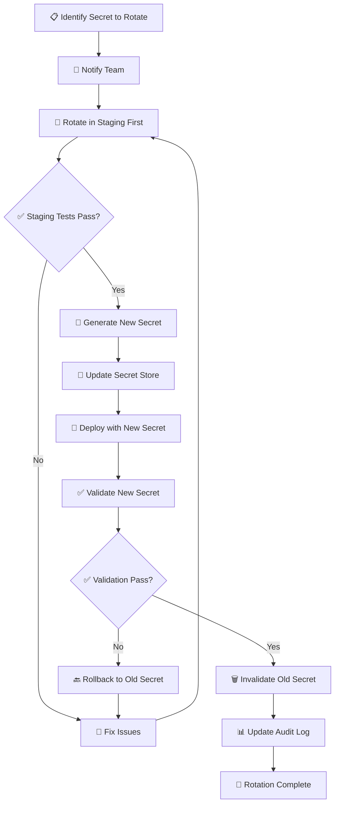

# Secrets Rotation Procedures

**Status**: Production-Ready
**Last Updated**: 2025-10-27
**Epic**: 006 - Automated Deployment Pipeline
**User Story**: US-E6-006

Complete procedures for rotating all deployment secrets with zero-downtime strategies.

## Table of Contents

- [Rotation Overview](#rotation-overview)
- [Rotation Schedule](#rotation-schedule)
- [General Rotation Process](#general-rotation-process)
- [Secret-Specific Procedures](#secret-specific-procedures)
- [Zero-Downtime Rotation Strategies](#zero-downtime-rotation-strategies)
- [Emergency Rotation](#emergency-rotation)
- [Validation After Rotation](#validation-after-rotation)
- [Rollback Procedures](#rollback-procedures)

## Rotation Overview

### Why Rotate Secrets?

- **Security**: Limits exposure window if secret is compromised
- **Compliance**: Required by SOC 2, PCI-DSS, and other standards
- **Best Practice**: Defense-in-depth security strategy
- **Audit Trail**: Demonstrates security due diligence

### Rotation Principles

1. **Zero Downtime**: No service interruption during rotation
2. **Validate Before Commit**: Test new secret before invalidating old
3. **Maintain Rollback**: Keep old secret available for quick rollback
4. **Audit Logging**: Document all rotations
5. **Staged Rollout**: Rotate staging first, then production

## Rotation Schedule

| Secret Category | Frequency      | Next Review | Notes                             |
| --------------- | -------------- | ----------- | --------------------------------- |
| **Critical**    | Every 30 days  | Monthly     | Database credentials, JWT secrets |
| **High**        | Every 90 days  | Quarterly   | API keys, service tokens          |
| **Medium**      | Every 180 days | Semi-annual | Webhook URLs, integration keys    |
| **Low**         | Annually       | Yearly      | Feature flags, static IDs         |
| **Never**       | N/A            | N/A         | Project IDs, organization IDs     |

### Calendar Reminders

**Set up these calendar events**:

```bash
# Monthly (Critical secrets)
- First Monday of every month at 10:00 AM
- Title: "🔐 Rotate Critical Secrets (JWT, Database, Service Role Key)"
- Calendar invite to: DevOps team

# Quarterly (High secrets)
- First Monday of Jan, Apr, Jul, Oct at 10:00 AM
- Title: "🔐 Rotate High Secrets (API Keys, Tokens, Redis)"
- Calendar invite to: DevOps team

# Semi-annual (Medium secrets)
- First Monday of Jan and Jul at 10:00 AM
- Title: "🔐 Rotate Medium Secrets (Webhooks, Sentry)"
- Calendar invite to: DevOps team
```

## General Rotation Process

### Standard Rotation Workflow



### Step-by-Step Process

#### 1. Pre-Rotation Planning

```bash
# Create rotation checklist
cat > rotation-checklist.md << 'EOF'
# Secret Rotation Checklist

**Secret**: [SECRET_NAME]
**Date**: [DATE]
**Performed by**: [YOUR_NAME]

## Pre-Rotation
- [ ] Team notified (Slack #devops channel)
- [ ] Maintenance window scheduled (if needed)
- [ ] Staging environment updated
- [ ] Rollback plan prepared
- [ ] Backup of current secret created

## Rotation
- [ ] New secret generated
- [ ] GitHub Secrets updated
- [ ] Vercel environment updated (if applicable)
- [ ] Services restarted
- [ ] Health checks passed

## Post-Rotation
- [ ] Old secret invalidated
- [ ] Validation tests passed
- [ ] Monitoring confirmed normal
- [ ] Documentation updated
- [ ] Audit log entry created
- [ ] Team notified of completion
EOF
```

#### 2. Notify Team

```bash
# Slack notification template
"🔐 **Secret Rotation Starting**

**Secret**: JWT_SECRET
**Environment**: Production
**Start Time**: 2024-10-27 10:00 AM PST
**Expected Duration**: 15 minutes
**Impact**: None (zero-downtime rotation)
**Performed by**: @devops-engineer

**Action Required**: None (automated rotation)
**Status Updates**: This thread
"
```

#### 3. Rotate in Staging First

**Always test rotation in staging before production**:

```bash
# Example: Rotate JWT_SECRET in staging
NEW_JWT_SECRET_STAGING=$(openssl rand -hex 64)

# Update GitHub Secret
gh secret set JWT_SECRET_STAGING -b"$NEW_JWT_SECRET_STAGING"

# Trigger staging deployment
gh workflow run release.yml -f environment=staging

# Wait for deployment
sleep 120

# Test staging
curl -f https://staging.sovren.dev/api/v1/health
# Should return: {"status":"ok"}

# Test authentication with new JWT
# (perform login/logout test)
```

#### 4. Generate New Secret

```bash
# Use appropriate generation method for secret type

# JWT/Session secrets (64 chars)
NEW_SECRET=$(openssl rand -hex 64)

# Encryption keys (32 bytes = 64 hex chars)
NEW_SECRET=$(openssl rand -hex 32)

# Passwords (32 chars base64)
NEW_SECRET=$(openssl rand -base64 32)

# UUIDs
NEW_SECRET=$(uuidgen)

# Verify length
echo ${#NEW_SECRET}
```

#### 5. Update Secret Stores

```bash
# GitHub Secrets
gh secret set SECRET_NAME -b"$NEW_SECRET"

# Vercel (if applicable)
echo "$NEW_SECRET" | vercel env add SECRET_NAME production

# Document old secret (for rollback)
OLD_SECRET=$(gh secret list | grep SECRET_NAME)
# Store securely for 24 hours
```

#### 6. Deploy and Validate

```bash
# Trigger deployment with new secret
gh workflow run release.yml -f environment=production

# Monitor deployment
gh run list --workflow=release.yml --limit=1

# Wait for deployment completion
gh run watch

# Run validation
./scripts/validate-deployment-secrets.sh

# Check health endpoints
curl -f https://sovren.dev/api/v1/health
curl -f https://sovren.dev/api/v1/ready
```

#### 7. Invalidate Old Secret

**Only after validation passes**:

```bash
# Depends on secret type

# API Tokens: Revoke at provider
# - Vercel: Delete old token
# - GitHub: Revoke old PAT
# - Supabase: Rotate API keys (new key invalidates old)

# Database passwords:
# ALTER USER sovren_user WITH PASSWORD 'new_password';

# JWT/Session secrets:
# Old secret automatically invalid after deployment
# Existing sessions will be terminated

# Document invalidation
echo "Old secret invalidated at $(date)" >> rotation-log.txt
```

## Secret-Specific Procedures

### 1. JWT_SECRET Rotation

**Frequency**: Every 30 days
**Downtime**: None (sessions invalidated)
**Impact**: All users must re-authenticate

```bash
#!/bin/bash
# rotate-jwt-secret.sh

set -e

echo "🔐 Rotating JWT_SECRET"

# Generate new secret
NEW_JWT_SECRET=$(openssl rand -hex 64)
echo "✅ Generated new JWT_SECRET (64 chars)"

# Update GitHub Secret
gh secret set JWT_SECRET -b"$NEW_JWT_SECRET"
echo "✅ Updated GitHub Secret"

# Update Vercel (if JWT validation in edge functions)
echo "$NEW_JWT_SECRET" | vercel env rm JWT_SECRET production
echo "$NEW_JWT_SECRET" | vercel env add JWT_SECRET production
echo "✅ Updated Vercel environment"

# Trigger deployment
gh workflow run release.yml -f environment=production
echo "🚀 Deployment triggered"

# Wait for deployment
echo "⏳ Waiting for deployment..."
sleep 180

# Validate
if curl -f https://sovren.dev/api/v1/health; then
  echo "✅ Health check passed"
else
  echo "❌ Health check failed - rolling back"
  exit 1
fi

# Notify users (optional - sessions will be invalidated)
curl -X POST "$SLACK_WEBHOOK_URL" \
  -H 'Content-type: application/json' \
  -d '{"text":"🔐 JWT_SECRET rotated. All users will be logged out."}'

echo "✅ JWT_SECRET rotation complete"
```

**Impact**: All users logged out, must re-authenticate

---

### 2. DATABASE_URL Rotation

**Frequency**: Every 30 days
**Downtime**: None (connection pool rotation)
**Impact**: Brief connection pool recycle

```bash
#!/bin/bash
# rotate-database-password.sh

set -e

echo "🔐 Rotating Database Password"

# Generate new password
NEW_DB_PASSWORD=$(openssl rand -base64 32)

# Parse current DATABASE_URL
CURRENT_URL=$(gh secret get DATABASE_URL)
DB_USER=$(echo $CURRENT_URL | sed -n 's/.*:\/\/\([^:]*\):.*/\1/p')
DB_HOST=$(echo $CURRENT_URL | sed -n 's/.*@\([^:]*\):.*/\1/p')
DB_PORT=$(echo $CURRENT_URL | sed -n 's/.*:\([0-9]*\)\/.*/\1/p')
DB_NAME=$(echo $CURRENT_URL | sed -n 's/.*\/\([^?]*\).*/\1/p')

# Construct new URL
NEW_DATABASE_URL="postgresql://${DB_USER}:${NEW_DB_PASSWORD}@${DB_HOST}:${DB_PORT}/${DB_NAME}?sslmode=require"

# Update password in database (requires admin access)
PGPASSWORD=$ADMIN_PASSWORD psql -h $DB_HOST -U postgres -c \
  "ALTER USER $DB_USER WITH PASSWORD '$NEW_DB_PASSWORD';"
echo "✅ Database password updated"

# Test new connection
PGPASSWORD=$NEW_DB_PASSWORD psql "$NEW_DATABASE_URL" -c "SELECT 1;" || {
  echo "❌ New password test failed"
  exit 1
}
echo "✅ New password validated"

# Update GitHub Secret
gh secret set DATABASE_URL -b"$NEW_DATABASE_URL"
echo "✅ GitHub Secret updated"

# Trigger rolling restart of backend services
gh workflow run release.yml -f environment=production

echo "✅ Database password rotation complete"
```

**Zero-Downtime Strategy**:

1. Both old and new passwords valid during transition
2. Services gradually pick up new password
3. Old password invalidated after all services updated

---

### 3. SUPABASE_SERVICE_ROLE_KEY Rotation

**Frequency**: Every 30 days
**Downtime**: None (dual-key period)
**Impact**: None during rotation

```bash
#!/bin/bash
# rotate-supabase-service-role-key.sh

set -e

echo "🔐 Rotating Supabase Service Role Key"

# Generate new key in Supabase dashboard
echo "⚠️  Manual step required:"
echo "1. Go to https://app.supabase.com/project/YOUR_PROJECT/settings/api"
echo "2. Click 'Generate New Service Role Key'"
echo "3. Copy the new key"
echo ""
read -p "Enter new service role key: " NEW_SERVICE_ROLE_KEY

# Validate key format (JWT)
if [[ ! $NEW_SERVICE_ROLE_KEY =~ ^eyJ ]]; then
  echo "❌ Invalid key format (should start with 'eyJ')"
  exit 1
fi

# Update GitHub Secret (old key still valid)
gh secret set SUPABASE_SERVICE_ROLE_KEY -b"$NEW_SERVICE_ROLE_KEY"
echo "✅ GitHub Secret updated"

# Trigger deployment
gh workflow run release.yml -f environment=production
echo "🚀 Deployment triggered"

# Wait for deployment
sleep 180

# Validate new key works
if curl -f https://sovren.dev/api/v1/health; then
  echo "✅ New key validated"
else
  echo "❌ Validation failed"
  exit 1
fi

# Old key automatically invalidated by Supabase after 24 hours
echo "⏳ Old key will be invalidated automatically in 24 hours"

echo "✅ Supabase Service Role Key rotation complete"
```

---

### 4. VERCEL_TOKEN Rotation

**Frequency**: Every 90 days
**Downtime**: None
**Impact**: None (deployments continue)

```bash
#!/bin/bash
# rotate-vercel-token.sh

set -e

echo "🔐 Rotating Vercel Token"

echo "⚠️  Manual steps required:"
echo "1. Go to https://vercel.com/account/tokens"
echo "2. Click 'Create Token'"
echo "3. Name: 'GitHub Actions Deploy - Sovren ($(date +%Y-%m-%d))'"
echo "4. Scope: Full Account"
echo "5. Expiration: 1 year"
echo "6. Click 'Create Token'"
echo ""
read -p "Enter new Vercel token: " NEW_VERCEL_TOKEN

# Validate token
if vercel whoami --token "$NEW_VERCEL_TOKEN" &>/dev/null; then
  echo "✅ Token validated"
else
  echo "❌ Token validation failed"
  exit 1
fi

# Update GitHub Secret
gh secret set VERCEL_TOKEN -b"$NEW_VERCEL_TOKEN"
echo "✅ GitHub Secret updated"

# Test deployment with new token
gh workflow run release.yml -f environment=staging
echo "🧪 Test deployment triggered (staging)"

# Wait for staging deployment
sleep 180

# Validate staging deployment
if curl -f https://staging.sovren.dev; then
  echo "✅ Staging deployment successful"
else
  echo "❌ Staging deployment failed"
  exit 1
fi

echo "⚠️  Next steps:"
echo "1. Go to https://vercel.com/account/tokens"
echo "2. Delete old token (created ~90 days ago)"
echo "3. Confirm deletion"

echo "✅ Vercel token rotation complete"
```

---

### 5. REDIS_URL Rotation

**Frequency**: Every 90 days
**Downtime**: < 5 seconds (connection pool recycle)
**Impact**: Active sessions may be briefly interrupted

```bash
#!/bin/bash
# rotate-redis-password.sh

set -e

echo "🔐 Rotating Redis Password"

# Platform-specific instructions

# --- Upstash ---
echo "Upstash Redis:"
echo "1. Go to https://console.upstash.com/redis/YOUR_DB"
echo "2. Click 'Reset Password'"
echo "3. Copy new connection string"

# --- Redis Cloud ---
echo "Redis Cloud:"
echo "1. Go to https://app.redislabs.com/#/databases"
echo "2. Select database → Configuration"
echo "3. Click 'Reset Password'"
echo "4. Copy new password"

read -p "Enter new Redis URL: " NEW_REDIS_URL

# Validate connection
if redis-cli -u "$NEW_REDIS_URL" ping | grep -q "PONG"; then
  echo "✅ New Redis URL validated"
else
  echo "❌ Redis connection failed"
  exit 1
fi

# Update GitHub Secret
gh secret set REDIS_URL -b"$NEW_REDIS_URL"
echo "✅ GitHub Secret updated"

# Trigger rolling restart
gh workflow run release.yml -f environment=production

# Monitor
echo "🔍 Monitor for connection errors in next 5 minutes"
echo "   Watch: https://sovren.dev (health check)"

echo "✅ Redis password rotation complete"
```

---

### 6. SLACK_WEBHOOK_URL Rotation

**Frequency**: Every 180 days
**Downtime**: None
**Impact**: None

```bash
#!/bin/bash
# rotate-slack-webhook.sh

set -e

echo "🔐 Rotating Slack Webhook"

echo "⚠️  Manual steps:"
echo "1. Go to https://api.slack.com/apps/YOUR_APP/incoming-webhooks"
echo "2. Click 'Add New Webhook to Workspace'"
echo "3. Select #deployments channel"
echo "4. Click 'Authorize'"
echo "5. Copy webhook URL"
echo ""
read -p "Enter new webhook URL: " NEW_WEBHOOK_URL

# Validate webhook
TEST_RESPONSE=$(curl -s -o /dev/null -w "%{http_code}" -X POST \
  -H 'Content-type: application/json' \
  --data '{"text":"🔐 Webhook rotation test"}' \
  "$NEW_WEBHOOK_URL")

if [ "$TEST_RESPONSE" = "200" ]; then
  echo "✅ Webhook validated (check Slack for test message)"
else
  echo "❌ Webhook validation failed (HTTP $TEST_RESPONSE)"
  exit 1
fi

# Update GitHub Secret
gh secret set SLACK_WEBHOOK_URL -b"$NEW_WEBHOOK_URL"
echo "✅ GitHub Secret updated"

# No deployment needed (used in workflows only)

echo "⚠️  Next steps:"
echo "1. Go to https://api.slack.com/apps/YOUR_APP/incoming-webhooks"
echo "2. Delete old webhook"
echo "3. Confirm deletion"

echo "✅ Slack webhook rotation complete"
```

---

### 7. LIGHTNING_NODE_MACAROON Rotation

**Frequency**: Every 90 days
**Downtime**: < 30 seconds
**Impact**: In-flight payments may fail

```bash
#!/bin/bash
# rotate-lightning-macaroon.sh

set -e

echo "🔐 Rotating Lightning Node Macaroon"

# Schedule maintenance window (recommended)
echo "⚠️  Recommended: Schedule 5-minute maintenance window"
echo "   Lightning payments will be unavailable during rotation"
read -p "Continue? (y/n) " -n 1 -r
echo
if [[ ! $REPLY =~ ^[Yy]$ ]]; then
  exit 1
fi

# LNbits approach
echo "LNbits Instructions:"
echo "1. Go to your LNbits instance"
echo "2. Create new wallet (for fresh admin key)"
echo "3. Copy admin key"

# Direct LND approach
echo "Direct LND Instructions:"
echo "1. SSH to lightning node"
echo "2. Delete old macaroon: rm ~/.lnd/data/chain/bitcoin/mainnet/admin.macaroon"
echo "3. Restart LND: sudo systemctl restart lnd"
echo "4. Read new macaroon: xxd -ps -u -c 1000 ~/.lnd/data/chain/bitcoin/mainnet/admin.macaroon"

read -p "Enter new macaroon (hex): " NEW_MACAROON

# Update GitHub Secret
gh secret set LIGHTNING_NODE_MACAROON -b"$NEW_MACAROON"
echo "✅ GitHub Secret updated"

# Trigger deployment
gh workflow run release.yml -f environment=production

echo "⏳ Waiting for deployment..."
sleep 180

# Validate
echo "🧪 Testing Lightning integration..."
# (Add Lightning-specific health check)

echo "✅ Lightning macaroon rotation complete"
echo "⚠️  Monitor for payment errors in next 24 hours"
```

---

## Zero-Downtime Rotation Strategies

### Strategy 1: Dual-Secret Period

**Use for**: Database, API keys, authentication tokens

```
Timeline:
T+0:  Old secret valid, new secret generated
T+1:  Both old and new secrets valid
T+2:  Services gradually adopt new secret
T+3:  All services using new secret
T+4:  Old secret invalidated
```

**Implementation**:

```bash
# 1. Generate new secret (old still valid)
NEW_SECRET=$(generate_secret)

# 2. Update secret store (both valid)
update_secret_store "$NEW_SECRET"

# 3. Rolling deployment (services pick up new)
deploy_rolling_update

# 4. Wait for all services to update (monitor)
wait_for_all_services

# 5. Invalidate old secret
invalidate_old_secret
```

---

### Strategy 2: Blue-Green Rotation

**Use for**: Infrastructure credentials, deployment tokens

```
Timeline:
T+0:  Blue (old) environment active
T+1:  Green (new secret) environment deployed
T+2:  Traffic shifted 10% → 50% → 100% to Green
T+3:  Blue environment decommissioned
```

---

### Strategy 3: Shadow Validation

**Use for**: Critical secrets (JWT, encryption keys)

```
Timeline:
T+0:  Generate new secret
T+1:  Deploy new secret in "shadow mode" (validate but don't use)
T+2:  Validate new secret works correctly
T+3:  Switch to new secret (atomic)
T+4:  Old secret invalidated
```

**Implementation**:

```typescript
// Dual-secret validation
function validateToken(token: string): boolean {
  // Try new secret first
  if (jwt.verify(token, NEW_JWT_SECRET)) {
    return true;
  }

  // Fallback to old secret (during rotation)
  if (jwt.verify(token, OLD_JWT_SECRET)) {
    logger.warn('Token using old secret - rotation in progress');
    return true;
  }

  return false;
}
```

---

## Emergency Rotation

### When to Emergency Rotate

- ✅ Secret exposed in public commit
- ✅ Secret found in logs
- ✅ Team member offboarded with access
- ✅ Third-party security breach
- ✅ Suspicious activity in audit logs

### Emergency Rotation Procedure

**Timeline: Complete within 15 minutes**

```bash
#!/bin/bash
# emergency-rotation.sh

set -e

SECRET_NAME=$1
REASON=$2

if [ -z "$SECRET_NAME" ] || [ -z "$REASON" ]; then
  echo "Usage: ./emergency-rotation.sh SECRET_NAME REASON"
  exit 1
fi

echo "🚨 EMERGENCY ROTATION INITIATED"
echo "Secret: $SECRET_NAME"
echo "Reason: $REASON"
echo "Time: $(date)"

# 1. Generate new secret immediately (0-1 min)
NEW_SECRET=$(openssl rand -hex 64)
echo "✅ New secret generated"

# 2. Update all secret stores in parallel (1-3 min)
gh secret set "$SECRET_NAME" -b"$NEW_SECRET" &
echo "$NEW_SECRET" | vercel env add "$SECRET_NAME" production &
wait
echo "✅ Secret stores updated"

# 3. Trigger emergency deployment (3-5 min)
gh workflow run release.yml -f environment=production
echo "🚀 Emergency deployment triggered"

# 4. Invalidate old secret immediately (5-7 min)
# (Platform-specific - revoke at source)
echo "⚠️  Invalidate old secret at source immediately"

# 5. Notify team (7-8 min)
curl -X POST "$SLACK_WEBHOOK_URL" \
  -H 'Content-type: application/json' \
  -d "{\"text\":\"🚨 EMERGENCY SECRET ROTATION\n\nSecret: $SECRET_NAME\nReason: $REASON\nTime: $(date)\nStatus: In Progress\"}"

# 6. Wait for deployment (8-13 min)
echo "⏳ Waiting for deployment..."
sleep 300

# 7. Validate (13-15 min)
if ./scripts/validate-deployment-secrets.sh; then
  echo "✅ Validation passed"

  # Success notification
  curl -X POST "$SLACK_WEBHOOK_URL" \
    -H 'Content-type: application/json' \
    -d "{\"text\":\"✅ EMERGENCY ROTATION COMPLETE\n\nSecret: $SECRET_NAME\nDuration: 15 minutes\nStatus: Success\"}"
else
  echo "❌ Validation failed - manual intervention required"
  exit 1
fi

echo "✅ Emergency rotation complete"
```

**Usage**:

```bash
# Emergency rotate JWT_SECRET
./emergency-rotation.sh JWT_SECRET "Exposed in public commit abc123"

# Emergency rotate DATABASE_URL
./emergency-rotation.sh DATABASE_URL "Suspicious activity detected"
```

---

## Validation After Rotation

### Automated Validation

```bash
#!/bin/bash
# validate-after-rotation.sh

SECRET_NAME=$1

echo "🔍 Validating $SECRET_NAME rotation"

# 1. Health check
if ! curl -f https://sovren.dev/api/v1/health; then
  echo "❌ Health check failed"
  exit 1
fi
echo "✅ Health check passed"

# 2. Secret-specific validation
case $SECRET_NAME in
  JWT_SECRET|SESSION_SECRET)
    # Test authentication
    echo "🧪 Testing authentication..."
    # (Add auth test here)
    ;;

  DATABASE_URL)
    # Test database connection
    echo "🧪 Testing database connection..."
    psql "$DATABASE_URL" -c "SELECT 1;" || exit 1
    ;;

  REDIS_URL)
    # Test Redis connection
    echo "🧪 Testing Redis connection..."
    redis-cli -u "$REDIS_URL" ping || exit 1
    ;;

  VERCEL_TOKEN)
    # Test Vercel API
    echo "🧪 Testing Vercel API..."
    vercel whoami --token "$NEW_TOKEN" || exit 1
    ;;
esac

echo "✅ All validation passed"
```

### Manual Validation Checklist

- [ ] Health endpoints responding
- [ ] Authentication working
- [ ] Database queries succeeding
- [ ] Cache operations working
- [ ] External API calls succeeding
- [ ] Error rates normal
- [ ] Response times normal
- [ ] No alerts triggered

---

## Rollback Procedures

### When to Rollback

- ❌ Validation fails after rotation
- ❌ Error rates spike
- ❌ Service unavailable
- ❌ Authentication failing
- ❌ Database connection errors

### Rollback Process

```bash
#!/bin/bash
# rollback-secret.sh

SECRET_NAME=$1
OLD_SECRET=$2

if [ -z "$OLD_SECRET" ]; then
  echo "❌ Old secret value required for rollback"
  exit 1
fi

echo "🔙 Rolling back $SECRET_NAME"

# 1. Restore old secret
gh secret set "$SECRET_NAME" -b"$OLD_SECRET"
echo "✅ Old secret restored"

# 2. Trigger deployment
gh workflow run release.yml -f environment=production
echo "🚀 Rollback deployment triggered"

# 3. Wait and validate
sleep 180
if ./scripts/validate-deployment-secrets.sh; then
  echo "✅ Rollback successful"
else
  echo "❌ Rollback validation failed - escalate immediately"
  exit 1
fi

# 4. Notify team
curl -X POST "$SLACK_WEBHOOK_URL" \
  -H 'Content-type: application/json' \
  -d "{\"text\":\"🔙 SECRET ROLLBACK\n\nSecret: $SECRET_NAME\nReason: Rotation validation failed\nStatus: Rollback complete\"}"

echo "✅ Rollback complete - investigate rotation failure"
```

**Rollback Timeline**: < 5 minutes

---

## Related Documentation

- [Secrets Management Guide](./secrets-management.md) - Complete secrets overview
- [Secrets Setup Guide](./secrets-setup-guide.md) - Initial configuration
- [Secrets Troubleshooting](./secrets-troubleshooting.md) - Common issues

---

**Document Version**: 1.0.0
**Last Updated**: 2025-10-27
**Next Review**: 2025-11-27
