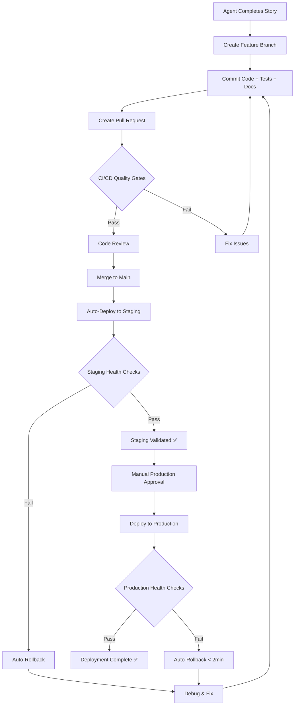
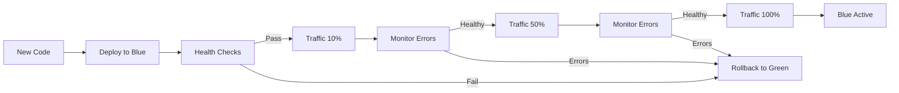

# Deployment Integration Standards

**Status**: MANDATORY for all development work
**Effective Date**: 2025-10-27 (Post Epic 006 completion)
**Applies To**: All agents, developers, and contributors

---

## Overview

Following the completion of Epic 006 (Automated Deployment Pipeline), Sovren now has **100% CI/CD automation** with zero-downtime blue-green deployments. **All future work MUST integrate with these automated pipelines** to ensure consistent, high-quality deployments.

### CI/CD Infrastructure Available

✅ **Docker Build & Push** - Automated multi-arch container builds with security scanning
✅ **Backend Deployment** - Blue-green deployment with automatic rollback
✅ **Auto-Deploy on Push** - Automatic staging deployment, manual production approval
✅ **Health Checks** - Comprehensive endpoint validation
✅ **Automated Rollback** - < 2 minute rollback on failure
✅ **Secrets Management** - 68 secrets documented and validated
✅ **Multi-Environment** - Dev/staging/production with IaC
✅ **Deployment Tests** - 200+ tests with 94% coverage

---

## MANDATORY Requirements for ALL Story Completion

### 1. Code Integration ✅

**Before marking a story complete**, ensure:

- ✅ All code changes committed to feature branch
- ✅ All tests passing locally (`npm test`)
- ✅ ESLint and TypeScript checks passing (`npm run lint && npm run type-check`)
- ✅ Documentation updated (CHANGELOG.md, relevant guides)
- ✅ Mermaid diagrams created (if architectural changes)

### 2. Pull Request Creation ✅

Create PR following these standards:

```bash
# Create PR with descriptive title
gh pr create --title "feat(US-XXX): Brief description" \
  --body "$(cat <<'EOF'
## Summary
[1-3 bullet points describing changes]

## Changes
- [List of key changes]

## Testing
- [How changes were tested]
- [Links to test results]

## Deployment
- [x] Ready for automated deployment
- [x] Health checks verified
- [x] Smoke tests passing
- [x] Documentation updated

## Checklist
- [x] Tests passing (npm test)
- [x] Lint passing (npm run lint)
- [x] Type checks passing (npm run type-check)
- [x] CHANGELOG.md updated
- [x] Documentation updated
- [x] Mermaid diagrams added (if applicable)

🤖 Generated with [Claude Code](https://claude.com/claude-code)
EOF
)"
```

### 3. Automated CI/CD Pipeline Execution ✅

Once PR is created, **automated workflows trigger**:

#### Quality Gates (Automatic — all in `.github/workflows/ci.yml`)

1. **Lint** (`CI / Lint` job)
   - ESLint checks (changed files)
   - Prettier formatting (changed files)

2. **Type Check** (`CI / Type Check` job)
   - TypeScript per-package type checking (changed files)

3. **Security** (`CI / Security Audit` job)
   - npm audit (production dependencies)
   - Trivy filesystem scan (SARIF → GitHub Security tab)
   - CodeQL SAST (on push to main)

4. **Testing** (`CI / Test Gate` job)
   - Unit tests (95%+ coverage for services)
   - Integration tests
   - E2E tests (post-build against production bundle)

5. **Build** (`CI / Build` job)
   - Production build with bundle validation
   - Empty JS chunk detection (treeshake safety net)

6. **Docker** (`CI / Docker Build & Scan` job — push to main only)
   - Multi-stage build
   - Multi-architecture (amd64, arm64)
   - Trivy security scanning
   - Image signing with Cosign
   - SBOM generation
   - Push to GHCR

7. **CI Complete** (`CI / CI Complete` fan-in job)
   - Aggregates all jobs above — single required check for branch protection

**All quality gates MUST pass before deployment**

### 4. Staging Deployment (Automatic on Main Merge) ✅

When PR is merged to `main`:

1. **Auto-Deploy to Staging**
   - **Frontend**: Vercel auto-deploys preview on PR, production on merge to main
   - **Backend**: Docker image built and pushed to GHCR by `CI / Docker Build & Scan` job in `ci.yml`
   - Staging promotion uses the Docker image from the CI build
   - Health checks and smoke tests validate the deployment

2. **Validation** (post-deploy)
   - Health endpoint validation (/health, /ready, /live)
   - Smoke test execution
   - Performance metrics collection
   - Error rate monitoring

3. **Notification**
   - Slack notification on success/failure
   - GitHub deployment status update

**Expected Timeline**: < 15 minutes from merge to staging deployment

### 5. Production Deployment (Manual Approval Required) ✅

For production deployment:

```bash
# Frontend: Vercel auto-deploys on merge to main (production)
# Backend: Promote staging Docker image to production environment

# Monitor CI status
gh run list --workflow=ci.yml --limit 5
```

**Production Deployment Process**:

1. **Manual Trigger** - Via GitHub Actions UI or CLI
2. **Quality Gate Validation** - All checks must be green
3. **Manual Approval** - Requires 1 approving reviewer
4. **Blue-Green Deployment** - Zero-downtime deployment
5. **Progressive Traffic Shift** - 10% → 50% → 100%
6. **Health Validation** - Continuous health monitoring
7. **Automatic Rollback** - If error rate > 5% or health checks fail
8. **Success Notification** - Slack alert to team

**Expected Timeline**: < 10 minutes for deployment, < 2 minutes for rollback if needed

### 6. Post-Deployment Validation ✅

**Required checks after deployment**:

```bash
# 1. Verify staging deployment
curl https://api-staging.sovren.dev/health

# 2. Run smoke tests
npm run test:smoke

# 3. Check deployment metrics
gh run view --log  # View latest deployment logs

# 4. Validate health endpoints
curl https://api-staging.sovren.dev/health
curl https://api-staging.sovren.dev/ready
curl https://api-staging.sovren.dev/live
```

### 7. Rollback Procedure (If Needed) 🚨

If deployment issues detected:

```bash
# Frontend: Use Vercel dashboard to instantly roll back to previous deployment
# Backend: Revert to previous Docker image tag in the target environment
```

**Automatic rollback triggers**:

- HTTP 5xx error rate > 5% for 2 minutes
- Response time P95 > 1000ms
- Health check failures > 3 consecutive
- Manual trigger via workflow_dispatch

---

## Agent-Specific Deployment Integration

### For All Agents (General Requirements)

**At Story Completion**, agent MUST:

1. ✅ Create pull request with deployment checklist
2. ✅ Verify all CI/CD checks pass
3. ✅ Wait for staging auto-deployment
4. ✅ Validate staging deployment health
5. ✅ Document deployment status in story completion summary
6. ✅ Include deployment verification in final output

**Output Template**:

```markdown
## Story Completion: US-XXX

### Implementation Complete ✅

- [List of changes]

### Deployment Status ✅

- [x] PR created: #123
- [x] CI/CD checks: All passing ✅
- [x] Staging deployment: Success ✅
- [x] Health checks: All passing ✅
- [x] Smoke tests: 28/28 passing ✅
- [ ] Production deployment: Pending manual approval

### Deployment Commands

# View CI status

gh run list --workflow=ci.yml --limit 5

# Frontend: Vercel auto-deploys; Backend: promote Docker image to production

### Health Verification

curl https://api-staging.sovren.dev/health

# Expected: {"status":"healthy","timestamp":"..."}
```

### Backend API Builder Agent

**Additional Requirements**:

- ✅ Update health check endpoints if new service added
- ✅ Add database migrations to deployment (auto-executed)
- ✅ Update API documentation in OpenAPI spec
- ✅ Verify backward compatibility (no breaking changes)
- ✅ Add integration tests for new endpoints (testcontainers)

**Deployment Integration**:

```typescript
// Add health check for new service
app.get('/health', (req, res) => {
  res.json({
    status: 'healthy',
    service: 'new-service-name',
    timestamp: new Date().toISOString(),
  });
});

// Add readiness probe
app.get('/ready', async (req, res) => {
  const dbHealthy = await checkDatabaseConnection();
  const cacheHealthy = await checkCacheConnection();

  if (dbHealthy && cacheHealthy) {
    res.json({ status: 'ready' });
  } else {
    res.status(503).json({ status: 'not ready' });
  }
});
```

### Elite Frontend Dev Agent

**Additional Requirements**:

- ✅ Verify Vercel preview deployment
- ✅ Run Lighthouse CI checks
- ✅ Validate bundle size (< 250KB per chunk)
- ✅ Test responsive design (mobile/tablet/desktop)
- ✅ Verify accessibility (WCAG 2.1 AA)

**Deployment Integration**:

```bash
# Frontend deploys to Vercel automatically on PR (preview URL in PR comments)
# Production: Vercel auto-deploys on merge to main — no manual workflow needed
```

### CICD Pipeline Architect Agent

**Additional Requirements**:

- ✅ Update deployment workflows if pipeline changes
- ✅ Test workflow changes in feature branch
- ✅ Document new deployment procedures
- ✅ Update secrets if new integrations added
- ✅ Verify backward compatibility with existing deployments

### Test Automation Engineer Agent

**Additional Requirements**:

- ✅ Add deployment tests for new features
- ✅ Update smoke test suite if new endpoints added
- ✅ Verify test coverage > 90% for deployment logic
- ✅ Add performance regression tests if applicable
- ✅ Update CI test workflows if needed

### Technical Docs Writer Agent

**Additional Requirements**:

- ✅ Update deployment documentation if procedures change
- ✅ Document new health check endpoints
- ✅ Update troubleshooting guides with new scenarios
- ✅ Create runbooks for new operational procedures
- ✅ Update Mermaid diagrams if architecture changes

### Infrastructure Provisioner Agent

**Additional Requirements**:

- ✅ Update Terraform configs if infrastructure changes
- ✅ Apply infrastructure changes to staging first
- ✅ Test infrastructure changes before production
- ✅ Update environment configs if new resources added
- ✅ Document infrastructure changes in ADRs

---

## Deployment Workflow Reference

### Standard Development Flow



### Blue-Green Deployment Flow



---

## Deployment Commands Reference

### Quick Reference Card

```bash
# ============================================
# CI PIPELINE (All checks in ci.yml)
# ============================================

# View latest CI status
gh run list --workflow=ci.yml --limit 5

# Watch CI run live
gh run watch

# View CI logs
gh run view --log

# View only failed step logs
gh run view <run-id> --log-failed


# ============================================
# STAGING DEPLOYMENT (Automatic on main push)
# ============================================

# Frontend: Vercel auto-deploys preview on PR, production on merge
# Backend: Docker image built by CI, promoted to staging

# Check staging health
curl https://api-staging.sovren.dev/health


# ============================================
# PRODUCTION DEPLOYMENT
# ============================================

# Frontend: Vercel auto-deploys on merge to main
# Backend: Promote staging Docker image to production

# Verify production health
curl https://api.sovren.dev/health


# ============================================
# EMERGENCY ROLLBACK
# ============================================

# Frontend: Vercel dashboard → instant rollback to previous deployment
# Backend: Revert to previous Docker image tag


# ============================================
# TESTING & VALIDATION
# ============================================

# Run all deployment tests locally
npm run test:deployment

# Run smoke tests
npm run test:smoke

# Run health check validation
npm run test:deployment:health

# Validate secrets
./scripts/validate-deployment-secrets.sh production
```

---

## Success Criteria for Story Completion

A story is **NOT complete** until:

- ✅ Code implemented and tested locally
- ✅ All tests passing (unit, integration, E2E)
- ✅ ESLint and TypeScript checks passing
- ✅ Documentation updated (CHANGELOG.md, guides, Mermaid diagrams)
- ✅ Pull request created with deployment checklist
- ✅ **CI/CD quality gates all passing** ✅
- ✅ **Staging deployment successful** ✅
- ✅ **Health checks passing** ✅
- ✅ **Smoke tests passing** ✅
- ✅ Deployment status documented in completion summary

**Production deployment is optional for story completion** (requires manual approval), but **staging deployment is mandatory**.

---

## Monitoring & Observability

### Health Check Endpoints (Required for All Services)

Every service MUST implement:

- `GET /health` - General health status
- `GET /ready` - Readiness probe (DB, cache connectivity)
- `GET /live` - Liveness probe (process health)
- `GET /detailed` - Detailed health report (admin only)

### Deployment Metrics

Monitor these metrics in Slack notifications:

- ✅ Deployment time (target: < 10 min)
- ✅ Rollback time (target: < 2 min)
- ✅ Error rate (threshold: < 5%)
- ✅ Response time P95 (threshold: < 1000ms)
- ✅ Health check success rate (target: 100%)

---

## Troubleshooting Deployment Issues

### Common Issues & Solutions

**Issue**: CI/CD checks failing

```bash
# View failing checks
gh pr checks

# View specific check logs
gh run view <run-id> --log

# Fix issues and push
git add . && git commit -m "fix: resolve CI issues" && git push
```

**Issue**: Staging deployment failed

```bash
# View CI/deployment logs
gh run view --log

# Check staging health
curl https://api-staging.sovren.dev/health

# Rollback if needed: revert Docker image tag or use Vercel dashboard
```

**Issue**: Health checks failing

```bash
# Check health endpoint
curl https://api-staging.sovren.dev/health

# Check readiness probe
curl https://api-staging.sovren.dev/ready

# View detailed health report
curl https://api-staging.sovren.dev/detailed
```

**Issue**: Smoke tests failing

```bash
# Run smoke tests locally
npm run test:smoke

# View smoke test results
cat test-results/smoke-tests.xml

# Check specific failing test
npm test -- smoke-tests.test.ts -t "test name"
```

---

## References

- [Epic 006 Completion Summary](../../EPIC-006-DEPLOYMENT-AUTOMATION-COMPLETE.md)
- [Deployment Guide](../deployment/DEPLOYMENT_GUIDE.md)
- [Docker Guide](../deployment/DOCKER_GUIDE.md)
- [Secrets Management](../deployment/secrets-management.md)
- [Health Check Implementation](../deployment/DEPLOYMENT_GUIDE.md#health-checks)
- [Rollback Procedures](../deployment/DEPLOYMENT_GUIDE.md#rollback)

---

## Compliance

**MANDATORY**: This standard is enforced via:

- Pre-commit hooks (verify tests pass)
- PR templates (deployment checklist)
- GitHub Actions (automated quality gates)
- Code review (deployment verification required)
- Deployment pipeline (health checks enforced)

**Non-compliance will result in**:

- PR rejection
- Blocked merge to main
- Failed deployment
- Automatic rollback

---

**Last Updated**: 2025-10-27
**Version**: 1.0.0
**Status**: MANDATORY
**Effective Date**: Immediate (Post Epic 006)
