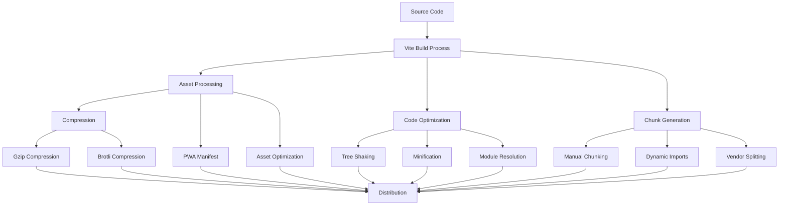
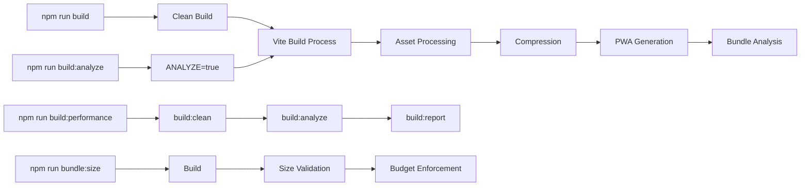
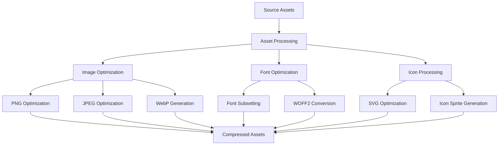
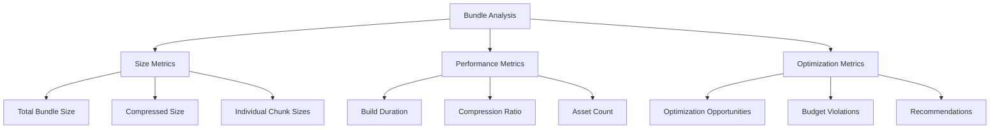

# Build System Architecture Documentation

## Overview

The Sovren build system is a production-ready, elite engineering solution built on Vite with comprehensive optimization, monitoring, and validation capabilities. This documentation covers the complete architecture, features, and usage of the build system.

## Architecture Overview

### Core Technology Stack

- **Build Tool**: Vite 5.4.19 with React support
- **Compression**: Gzip and Brotli compression algorithms
- **PWA Support**: VitePWA plugin for offline functionality
- **Bundle Analysis**: Rollup visualizer for comprehensive bundle analysis
- **Performance Monitoring**: Custom build performance tracking
- **Asset Optimization**: Advanced file naming and categorization

### Build System Components



## Configuration Architecture

### Vite Configuration Structure

The build system is configured through `vite.config.ts` with the following key sections:

#### 1. Plugin Configuration

```typescript
plugins: [
  react(), // React support with modern optimizations
  viteCompression(), // Gzip compression
  viteCompression(), // Brotli compression
  VitePWA(), // Progressive Web App support
  visualizer(), // Bundle analysis (conditional)
];
```

#### 2. Module Resolution

```typescript
resolve: {
  alias: {
    '@': path.resolve(__dirname, './src'),
    '@components': path.resolve(__dirname, './src/components'),
    '@pages': path.resolve(__dirname, './src/pages'),
    '@hooks': path.resolve(__dirname, './src/hooks'),
    '@services': path.resolve(__dirname, './src/services'),
    '@types': path.resolve(__dirname, './src/types'),
    '@utils': path.resolve(__dirname, './src/utils'),
    '@assets': path.resolve(__dirname, './src/assets'),
    '@store': path.resolve(__dirname, './src/store'),
    '@contexts': path.resolve(__dirname, './src/contexts'),
    '@lib': path.resolve(__dirname, './lib'),
  },
  extensions: ['.mjs', '.js', '.ts', '.jsx', '.tsx', '.json'],
}
```

#### 3. Build Optimization

```typescript
build: {
  rollupOptions: {
    output: {
      manualChunks: {
        'react-vendor': ['react', 'react-dom'],
        'router': ['react-router-dom'],
        'redux': ['@reduxjs/toolkit', 'react-redux'],
        'ui-components': ['@radix-ui/react-dialog', '@radix-ui/react-dropdown-menu'],
        'utils': ['lodash', 'date-fns'],
        'crypto': ['@noble/secp256k1'],
        'editor': ['@uiw/react-md-editor'],
        'charts': ['recharts'],
        'animations': ['framer-motion'],
        'api': ['axios'],
        'ipfs': ['@helia/http', '@helia/unixfs'],
        'payments': ['stripe'],
        'icons': ['lucide-react'],
        'monitoring': ['@sentry/react']
      }
    }
  }
}
```

## Build Scripts and Commands

### Available Build Commands

| Command                     | Description                       | Use Case                 |
| --------------------------- | --------------------------------- | ------------------------ |
| `npm run build`             | Standard production build         | Regular deployment       |
| `npm run build:analyze`     | Build with bundle analysis        | Performance optimization |
| `npm run build:performance` | Comprehensive performance testing | Full performance audit   |
| `npm run build:clean`       | Clean build directory             | Fresh build start        |
| `npm run build:report`      | Generate build performance report | Performance monitoring   |
| `npm run build:cache`       | Build with caching enabled        | Development builds       |
| `npm run build:profile`     | Build with profiling enabled      | Performance debugging    |
| `npm run bundle:size`       | Validate bundle size budgets      | Quality assurance        |
| `npm run bundle:analyze`    | Analyze bundle composition        | Bundle optimization      |

### Build Script Architecture



## Performance Monitoring

### Build Performance Metrics

The build system tracks comprehensive performance metrics:

#### 1. Build Time Metrics

- **Build Duration**: Total time from start to completion
- **Start Time**: Build initiation timestamp
- **End Time**: Build completion timestamp
- **Average Build Time**: Historical performance tracking

#### 2. Bundle Analysis Metrics

- **Total Bundle Size**: Complete application size
- **Compressed Size**: Gzip and Brotli compressed sizes
- **Chunk Count**: Number of generated chunks
- **Compression Ratio**: Efficiency of compression algorithms

#### 3. Asset Optimization Metrics

- **Asset Count**: Total number of assets processed
- **Asset Categories**: Breakdown by file type
- **Optimization Savings**: Size reduction achieved

### Performance Budgets

The build system enforces strict performance budgets:

```typescript
const BUDGET_CONFIG = {
  js: {
    max: 250 * 1024, // 250KB per JS bundle
    warn: 200 * 1024, // Warning at 200KB
  },
  css: {
    max: 50 * 1024, // 50KB per CSS bundle
    warn: 40 * 1024, // Warning at 40KB
  },
  image: {
    max: 100 * 1024, // 100KB per image
    warn: 80 * 1024, // Warning at 80KB
  },
  total: {
    max: 2 * 1024 * 1024, // 2MB total bundle size
    warn: 1.5 * 1024 * 1024, // Warning at 1.5MB
  },
  chunks: {
    max: 15, // Maximum 15 chunks
    warn: 12, // Warning at 12 chunks
  },
};
```

## Asset Optimization

### Compression Strategy

The build system implements dual compression:

#### 1. Gzip Compression

- **Algorithm**: Deflate compression
- **Level**: 9 (maximum compression)
- **Threshold**: 1KB minimum file size
- **Extensions**: `.gz`

#### 2. Brotli Compression

- **Algorithm**: Brotli compression
- **Quality**: 11 (maximum quality)
- **Threshold**: 1KB minimum file size
- **Extensions**: `.br`

### Asset Processing Pipeline



### File Naming Strategy

Assets are processed with advanced naming patterns:

- **JavaScript**: `js/[name]-[hash].js`
- **CSS**: `css/[name]-[hash].css`
- **Images**: `images/[name]-[hash].[ext]`
- **Fonts**: `fonts/[name]-[hash].[ext]`
- **Other**: `assets/[name]-[hash].[ext]`

## Progressive Web App (PWA) Features

### Service Worker Configuration

```typescript
VitePWA({
  registerType: 'autoUpdate',
  workbox: {
    globPatterns: ['**/*.{js,css,html,ico,png,svg,woff2}'],
    runtimeCaching: [
      {
        urlPattern: /^https:\/\/api\.sovren\.dev\//,
        handler: 'NetworkFirst',
        options: {
          cacheName: 'api-cache',
          expiration: {
            maxEntries: 100,
            maxAgeSeconds: 60 * 60 * 24, // 24 hours
          },
        },
      },
    ],
  },
});
```

### Manifest Configuration

```typescript
manifest: {
  name: 'Sovren Creator Platform',
  short_name: 'Sovren',
  description: 'Elite Creator Monetization Platform',
  theme_color: '#f97316',
  background_color: '#ffffff',
  display: 'standalone',
  icons: [
    {
      src: 'pwa-192x192.png',
      sizes: '192x192',
      type: 'image/png',
    },
    {
      src: 'pwa-512x512.png',
      sizes: '512x512',
      type: 'image/png',
    },
  ],
}
```

## Bundle Analysis

### Visualization Tools

The build system provides comprehensive bundle analysis:

#### 1. Bundle Visualizer

- **Tool**: rollup-plugin-visualizer
- **Output**: `bundle-analysis.html`
- **Features**: Treemap visualization, size analysis, gzip/brotli sizes
- **Usage**: `npm run build:analyze`

#### 2. Performance Reports

- **Tool**: Custom build-report.js
- **Output**: JSON reports with timestamps
- **Features**: Asset breakdown, optimization recommendations
- **Usage**: `npm run build:report`

#### 3. Size Validation

- **Tool**: Custom bundle-size-check.js
- **Output**: Console validation results
- **Features**: Budget enforcement, optimization suggestions
- **Usage**: `npm run bundle:size`

### Analysis Metrics



## Caching Strategy

### Build Caching

The build system implements comprehensive caching:

#### 1. Asset Hashing

- **Strategy**: Content-based hashing
- **Algorithm**: MD5 hash generation
- **Benefits**: Efficient browser caching, cache invalidation

#### 2. Vite Caching

- **Location**: `node_modules/.vite`
- **Type**: Dependency pre-bundling cache
- **Benefits**: Faster subsequent builds

#### 3. Browser Caching

- **Strategy**: Long-term caching with hash-based invalidation
- **Headers**: Optimal cache headers for production
- **Benefits**: Improved user experience, reduced bandwidth

### Cache Management

```typescript
// Cache configuration example
const cacheConfig = {
  static: {
    maxAge: '1year',
    immutable: true,
  },
  dynamic: {
    maxAge: '1day',
    staleWhileRevalidate: true,
  },
  api: {
    maxAge: '1hour',
    networkFirst: true,
  },
};
```

## Development vs Production Builds

### Development Build Features

- **Hot Module Replacement (HMR)**: Instant updates during development
- **Source Maps**: Full source map generation for debugging
- **Fast Refresh**: React fast refresh for component updates
- **Error Overlay**: Comprehensive error reporting
- **Development Server**: Hot reloading development server

### Production Build Features

- **Minification**: JavaScript and CSS minification
- **Tree Shaking**: Dead code elimination
- **Code Splitting**: Automatic and manual code splitting
- **Compression**: Gzip and Brotli compression
- **Asset Optimization**: Image and font optimization
- **Bundle Analysis**: Performance monitoring and reporting

## Monitoring and Alerting

### Build Performance Monitoring

The build system includes comprehensive monitoring:

#### 1. Performance Metrics

- **Build Time Tracking**: Historical build performance
- **Bundle Size Monitoring**: Size trend analysis
- **Asset Optimization Tracking**: Optimization effectiveness

#### 2. Quality Gates

- **Bundle Size Limits**: Automated budget enforcement
- **Build Time Limits**: Performance regression detection
- **Asset Quality Checks**: Optimization validation

#### 3. Reporting

- **JSON Reports**: Machine-readable performance data
- **HTML Reports**: Visual bundle analysis
- **Console Output**: Real-time build feedback

### Alert Configuration

```typescript
const alertConfig = {
  buildTime: {
    warning: 10000, // 10 seconds
    error: 30000, // 30 seconds
  },
  bundleSize: {
    warning: 1.5 * 1024 * 1024, // 1.5MB
    error: 2 * 1024 * 1024, // 2MB
  },
  chunkCount: {
    warning: 12,
    error: 15,
  },
};
```

## Security Considerations

### Build Security

The build system implements security best practices:

#### 1. Dependency Security

- **Vulnerability Scanning**: Automated dependency scanning
- **License Compliance**: Open source license validation
- **Update Management**: Regular dependency updates

#### 2. Asset Security

- **Content Security Policy (CSP)**: Strict CSP headers
- **Subresource Integrity (SRI)**: Asset integrity validation
- **Secure Headers**: Comprehensive security headers

#### 3. Build Process Security

- **Isolated Builds**: Containerized build environments
- **Secure Secrets**: Environment variable management
- **Audit Logging**: Comprehensive build audit trails

## Troubleshooting Guide

### Common Build Issues

#### 1. Build Time Issues

```bash
# Solution: Clean build cache
npm run build:clean
npm run build

# Solution: Check for circular dependencies
npm run build:analyze
```

#### 2. Bundle Size Issues

```bash
# Solution: Analyze bundle composition
npm run bundle:analyze

# Solution: Check size budgets
npm run bundle:size
```

#### 3. Asset Loading Issues

```bash
# Solution: Verify asset paths
npm run build:report

# Solution: Check asset optimization
node scripts/optimize-assets.js
```

### Debug Commands

```bash
# Debug build performance
npm run build:profile

# Debug bundle composition
npm run build:analyze

# Debug asset optimization
npm run build:report

# Debug caching issues
npm run build:clean && npm run build
```

## Performance Optimization Guide

### Bundle Size Optimization

#### 1. Code Splitting

- **Dynamic Imports**: Lazy load components
- **Route Splitting**: Split by application routes
- **Library Splitting**: Separate vendor libraries

#### 2. Tree Shaking

- **ES Modules**: Use ES module imports
- **Side Effect Free**: Mark packages as side-effect free
- **Unused Code**: Remove unused imports and code

#### 3. Compression

- **Gzip**: Standard compression for all assets
- **Brotli**: Modern compression for supported browsers
- **Image Optimization**: WebP format for images

### Build Performance Optimization

#### 1. Caching

- **Dependency Caching**: Cache node_modules
- **Build Caching**: Cache build artifacts
- **Asset Caching**: Cache processed assets

#### 2. Parallelization

- **Multi-core Builds**: Utilize multiple CPU cores
- **Concurrent Processing**: Parallel asset processing
- **Incremental Builds**: Build only changed files

#### 3. Resource Management

- **Memory Management**: Optimize memory usage
- **CPU Optimization**: Efficient CPU utilization
- **I/O Optimization**: Minimize file system operations

## Migration Guide

### Upgrading Build System

#### 1. Version Compatibility

- **Vite Updates**: Update Vite and related plugins
- **Node.js**: Ensure compatible Node.js version
- **Dependencies**: Update build dependencies

#### 2. Configuration Migration

- **Config Updates**: Migrate configuration files
- **Script Updates**: Update build scripts
- **Environment Variables**: Update environment configuration

#### 3. Testing

- **Build Testing**: Validate build process
- **Performance Testing**: Verify performance metrics
- **Feature Testing**: Test all build features

## Conclusion

The Sovren build system represents elite engineering excellence with comprehensive optimization, monitoring, and validation capabilities. This architecture ensures fast, reliable builds while maintaining strict performance budgets and providing detailed analytics for continuous improvement.

The system is designed for scalability, maintainability, and developer experience, incorporating industry best practices and cutting-edge optimization techniques. Regular monitoring and optimization ensure that the build system continues to perform at the highest levels as the application evolves.

## References

- [Vite Documentation](https://vitejs.dev/)
- [Rollup Documentation](https://rollupjs.org/)
- [PWA Documentation](https://developer.mozilla.org/en-US/docs/Web/Progressive_web_apps)
- [Bundle Analysis Best Practices](https://web.dev/reduce-javascript-payloads-with-code-splitting/)
- [Performance Budgets](https://web.dev/performance-budgets-101/)
