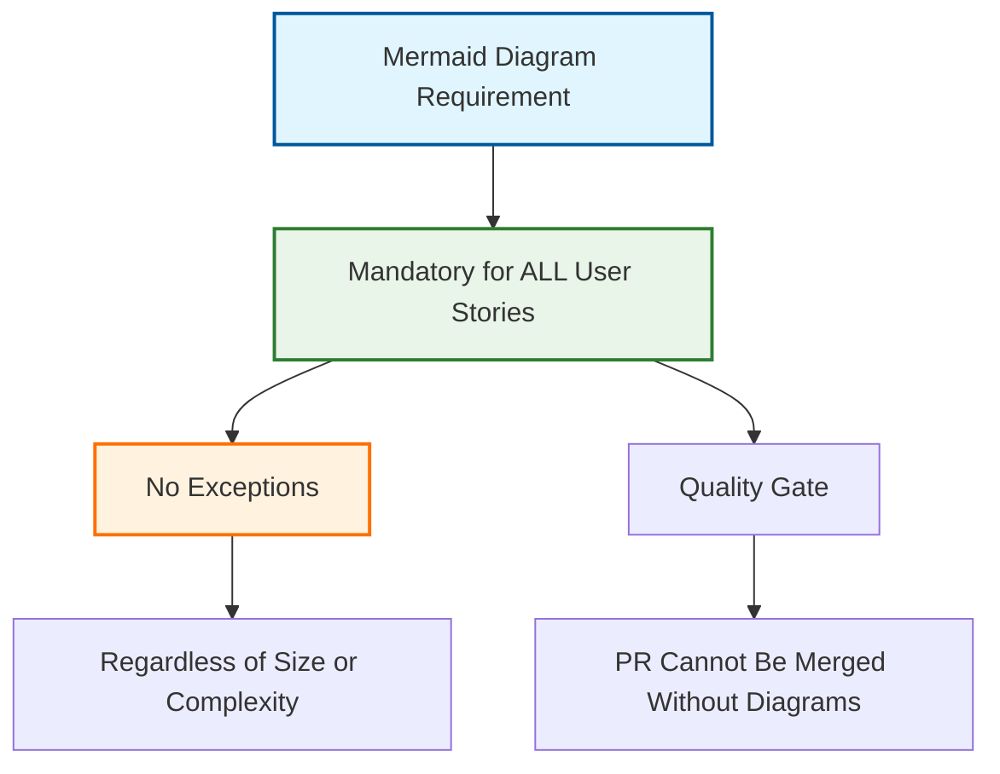
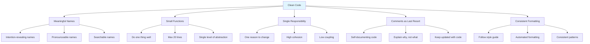
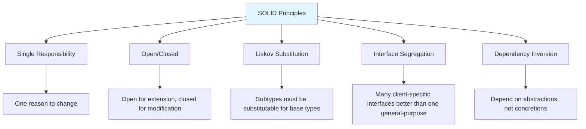
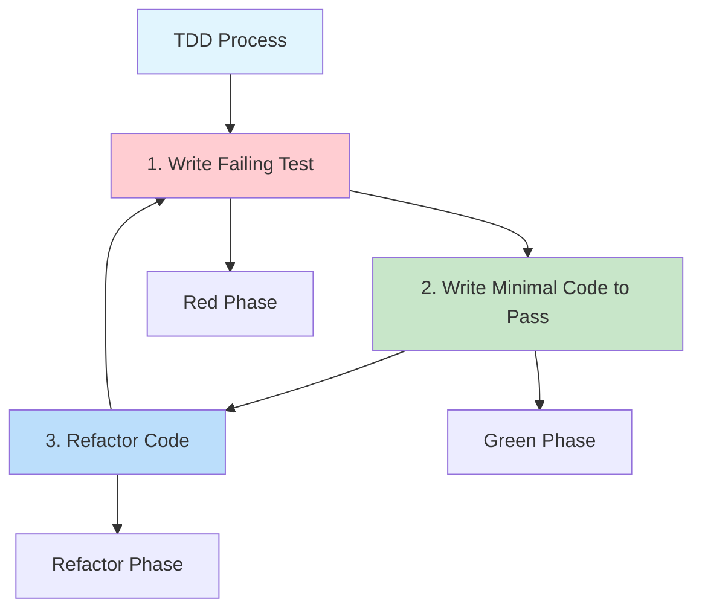
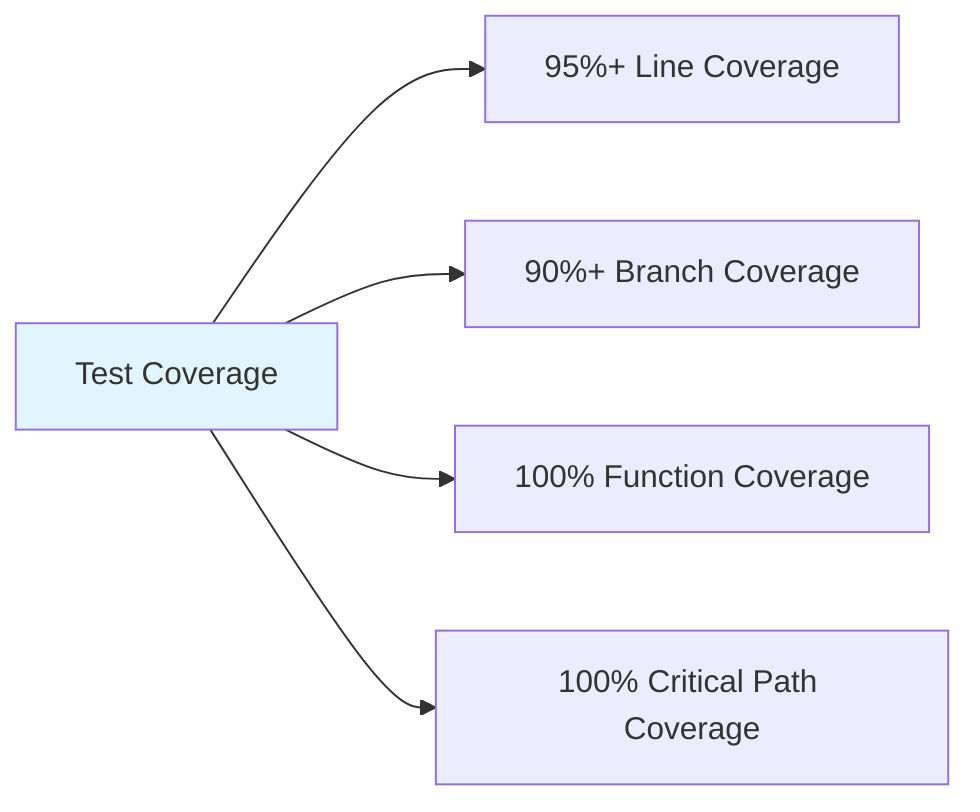
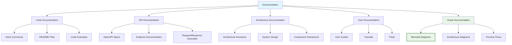
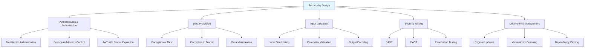
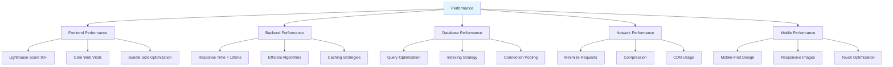

# 🛡️ Code of Craft

## 📋 Overview

This document establishes the core principles and practices that define our elite engineering standards at Sovren. It serves as the foundation for all development work and ensures consistent, high-quality delivery across the platform.

## 🎯 Core Principles

```mermaid
graph TD
    A[Code of Craft] --> B[1. Elite Engineering Standards]
    A --> C[2. Documentation as First-Class Citizen]
    A --> D[3. Test-Driven Development]
    A --> E[4. Security by Design]
    A --> F[5. Performance as a Feature]
    A --> G[6. Visual Architecture Documentation]

    B --> B1[Clean Code]
    B --> B2[SOLID Principles]
    B --> B3[DRY & KISS]

    C --> C1[Comprehensive Documentation]
    C --> C2[Living Documentation]
    C --> C3[Knowledge Transfer]

    D --> D1[Red-Green-Refactor]
    D --> D2[95%+ Coverage]
    D --> D3[Behavior-Driven Development]

    E --> E1[Secure by Default]
    E --> E2[Zero Trust Architecture]
    E --> E3[Privacy by Design]

    F --> F1[Performance Budgets]
    F --> F2[Optimization Metrics]
    F --> F3[Mobile-First]

    G --> G1[Mermaid Diagrams]
    G --> G2[Architecture Documentation]
    G --> G3[Visual Knowledge Sharing]

    style A fill:#e1f5fe,stroke:#01579b,stroke-width:2px
    style G fill:#e8f5e8,stroke:#2e7d32,stroke-width:2px
    style G1 fill:#e8f5e8,stroke:#2e7d32,stroke-width:2px
```

### 1. Elite Engineering Standards

- **Clean Code**: Write code that is readable, maintainable, and follows best practices
- **SOLID Principles**: Apply SOLID principles in all design decisions
- **DRY & KISS**: Don't Repeat Yourself and Keep It Simple, Stupid
- **Code Reviews**: Thorough code reviews for all changes
- **Continuous Improvement**: Regularly refactor and improve existing code

### 2. Documentation as First-Class Citizen

- **Comprehensive Documentation**: Document all aspects of the system
- **Living Documentation**: Keep documentation up-to-date with code changes
- **Knowledge Transfer**: Ensure knowledge is shared across the team
- **Self-Documenting Code**: Write code that is self-explanatory
- **API Documentation**: Document all APIs with OpenAPI specifications

### 3. Test-Driven Development

- **Red-Green-Refactor**: Write tests before implementation
- **95%+ Coverage**: Maintain high test coverage for all code
- **Behavior-Driven Development**: Use BDD for feature implementation
- **Automated Testing**: Automate all testing processes
- **Test Quality**: Focus on meaningful tests, not just coverage metrics

### 4. Security by Design

- **Secure by Default**: Implement security at every level
- **Zero Trust Architecture**: Never trust, always verify
- **Privacy by Design**: Protect user data at all costs
- **Secure Coding Practices**: Follow OWASP guidelines
- **Regular Security Audits**: Conduct security reviews regularly

### 5. Performance as a Feature

- **Performance Budgets**: Establish and maintain performance budgets
- **Optimization Metrics**: Track and optimize key performance metrics
- **Mobile-First**: Design for mobile performance first
- **Efficient Resource Usage**: Minimize CPU, memory, and network usage
- **Performance Testing**: Regular performance testing and optimization

### 6. Visual Architecture Documentation

- **Mermaid Diagrams**: Create visual diagrams for all implementations
- **Architecture Documentation**: Document system architecture visually
- **Visual Knowledge Sharing**: Use diagrams to share knowledge
- **Documentation Standards**: Follow established diagram standards
- **Living Visual Documentation**: Keep diagrams updated with code changes

## 📊 Mermaid Diagram Requirement

**MANDATORY REQUIREMENT**: Every user story implementation MUST include the following Mermaid diagrams:

1. **Architecture Overview Diagram**:
   - Shows the components involved in the implementation
   - Illustrates the relationship between components
   - Places the changes within the broader system context

2. **Component Interaction Diagram**:
   - Details how components interact with each other
   - Shows the sequence of operations
   - Illustrates API calls and data exchange patterns

3. **Data Flow Diagram**:
   - Visualizes how data moves through the system
   - Shows data transformation steps
   - Illustrates storage points and persistence mechanisms

4. **Process Flow Diagram**:
   - Provides step-by-step visualization of user interactions
   - Shows system processes and decision points
   - Illustrates error handling paths

5. **Implementation-Specific Diagrams** (as needed):
   - Database schema diagrams for data model changes
   - State machine diagrams for complex state management
   - Network topology diagrams for infrastructure changes
   - Security flow diagrams for authentication/authorization features

This requirement applies to ALL user stories without exception and serves as a quality gate for pull request approval. Detailed requirements and examples can be found in the [Mermaid Diagram Requirement](./mermaid-requirement.md) document.

## 📝 Code Quality Standards

### Clean Code Principles

- **Meaningful Names**: Use intention-revealing, pronounceable, searchable names
- **Small Functions**: Functions should do one thing, do it well, and be small
- **Single Responsibility**: Each class/module should have one reason to change
- **Comments as Last Resort**: Write self-documenting code, comment only when necessary
- **Consistent Formatting**: Follow established style guides and formatting rules

### SOLID Principles

- **Single Responsibility**: A class should have only one reason to change
- **Open/Closed**: Classes should be open for extension but closed for modification
- **Liskov Substitution**: Subtypes must be substitutable for their base types
- **Interface Segregation**: Many client-specific interfaces are better than one general-purpose interface
- **Dependency Inversion**: Depend on abstractions, not on concretions

## 🧪 Testing Standards

### Test-Driven Development

- **Write Tests First**: Always write tests before implementation code
- **Red-Green-Refactor**: Follow the TDD cycle rigorously
- **Test Coverage**: Maintain minimum 95% test coverage
- **Test Quality**: Focus on meaningful tests, not just coverage
- **Test Independence**: Tests should be independent and repeatable

### Test Coverage Requirements

- **Line Coverage**: Minimum 95% of all lines of code
- **Branch Coverage**: Minimum 90% of all branches
- **Function Coverage**: 100% of all functions and methods
- **Critical Path Coverage**: 100% coverage for authentication, payments, and security code

## 📚 Documentation Standards

### Comprehensive Documentation

- **Code Documentation**: Document all code with appropriate comments and README files
- **API Documentation**: Document all APIs with OpenAPI specifications
- **Architecture Documentation**: Document system architecture and design decisions
- **User Documentation**: Provide comprehensive user guides and tutorials
- **Visual Documentation**: Use Mermaid diagrams for visual documentation

### Documentation Requirements

- **README Files**: Every directory must have a README file explaining its purpose
- **API Documentation**: Every API endpoint must have OpenAPI documentation
- **Architecture Decisions**: Document all architectural decisions with ADRs
- **Mermaid Diagrams**: Every user story must include required Mermaid diagrams
- **CHANGELOG**: Keep a detailed CHANGELOG for all changes

## 🔒 Security Standards

### Security by Design

- **Authentication & Authorization**: Implement robust authentication and authorization
- **Data Protection**: Encrypt sensitive data at rest and in transit
- **Input Validation**: Validate and sanitize all inputs
- **Security Testing**: Conduct regular security testing
- **Dependency Management**: Keep dependencies updated and scan for vulnerabilities

### Security Requirements

- **Authentication**: Use multi-factor authentication where appropriate
- **Authorization**: Implement role-based access control
- **Encryption**: Use industry-standard encryption algorithms
- **Input Validation**: Validate all inputs on both client and server
- **Security Headers**: Implement all recommended security headers

## ⚡ Performance Standards

### Performance as a Feature

- **Frontend Performance**: Optimize loading and rendering performance
- **Backend Performance**: Optimize API response times and processing
- **Database Performance**: Optimize queries and database access
- **Network Performance**: Minimize network requests and payload size
- **Mobile Performance**: Optimize for mobile devices and networks

### Performance Requirements

- **Lighthouse Score**: Minimum 90+ for all pages
- **Core Web Vitals**: Meet all Core Web Vitals thresholds
- **API Response Time**: < 100ms for 95% of requests
- **Bundle Size**: < 200KB initial load (compressed)
- **Database Queries**: < 50ms for 95% of queries

## 🏆 Elite Engineering Status

Implementation achieves **Elite Status** when:

✅ **All code quality standards met** with no compromises
✅ **Test coverage exceeds 95%** for the implementation
✅ **All required Mermaid diagrams** are present and follow standards
✅ **Documentation is complete** and up-to-date
✅ **Security best practices** are followed throughout
✅ **Performance metrics** meet or exceed requirements

---

**MANDATORY REQUIREMENT**: All code must adhere to these standards to achieve elite engineering status. No exceptions.
