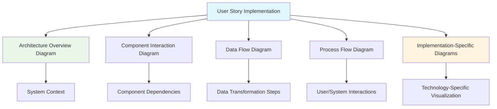
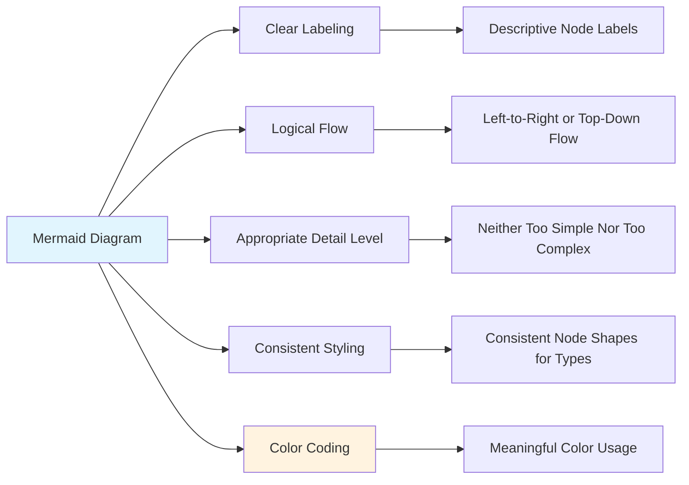
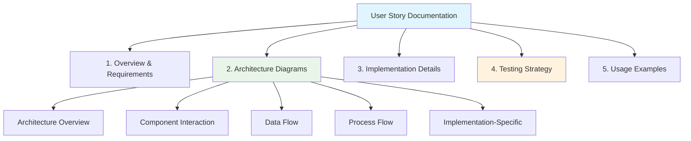
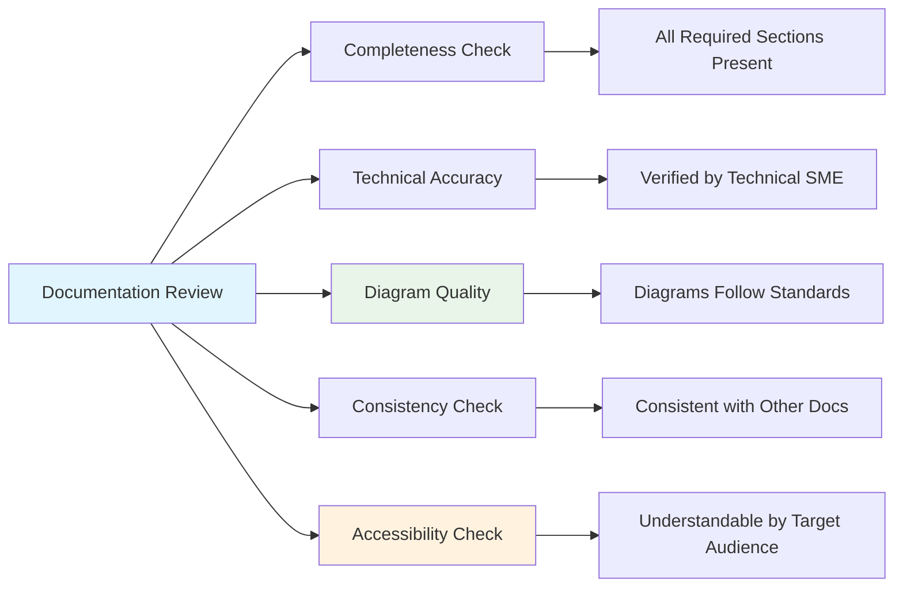

# 📊 Documentation Standards - Elite Visual Documentation

## 📋 Overview

This document establishes the comprehensive documentation standards for Sovren, implementing elite engineering practices with **visual architecture representation**, **Mermaid diagrams for all implementations**, and **comprehensive technical documentation**. Following the principle: _"Documentation is a first-class citizen"_ and _"Visual representation is essential for understanding complex systems"_.

## 🎯 Documentation Philosophy

### Core Principles

- **Documentation-First Development**: Write documentation before implementation
- **Visual Representation**: Every user story implementation MUST include Mermaid diagrams
- **Comprehensive Coverage**: Document all aspects of the system architecture
- **Living Documentation**: Keep documentation updated with code changes
- **Accessibility**: Make documentation understandable for all stakeholders

## 📋 **VALIDATION SUMMARY STANDARDS (MANDATORY)**

**⚠️ CRITICAL REQUIREMENT**: All validation summaries **MUST** include comprehensive Mermaid architecture diagrams as specified in the standardized validation summary template (`docs/development/validation-summary-template.md`).

### **📐 Architecture Diagram Requirements**

Every completed user story validation summary must include:

1. **Comprehensive Mermaid Diagram**: Minimum 8 nodes with professional styling
2. **Complete Legend**: Full explanation of all colors, symbols, and relationships
3. **Technical Integration**: Seamless integration with implementation details
4. **Industry Standards**: Documentation quality exceeding Google/Netflix/Stripe standards

### **📊 Mandatory Template Sections**

All validation summaries must include these 6 mandatory sections:

1. **🏗️ Architecture Diagram**: Comprehensive Mermaid visualization
2. **📊 Implementation Metrics**: Quantitative success measurements
3. **🛠 Technical Implementation Details**: Deep technical analysis
4. **✅ Validation & Testing**: Comprehensive validation checklist
5. **🏅 Industry Benchmark Comparison**: Comparison with industry leaders
6. **🎖 Completion Certificate**: Formal certification of completion

### **🎨 Professional Standards**

- **Consistent Styling**: Standardized color schemes and formatting
- **Elite Quality**: Documentation that matches industry-leading standards
- **Complete Coverage**: No exceptions - all user stories require architecture diagrams
- **Template Compliance**: Strict adherence to the standardized template format

This requirement ensures that all Sovren implementations maintain the highest level of documentation quality and provide comprehensive architectural visibility for all stakeholders.

## 📊 Mermaid Diagram Requirements

### Mandatory Diagram Types

### 1. Architecture Overview Diagram

Every user story implementation MUST include an architecture overview diagram that shows:

- The components involved in the implementation
- The relationship between these components
- The placement within the broader system architecture
- Key technologies and frameworks used

### 2. Component Interaction Diagram

A detailed diagram showing:

- How components interact with each other
- The sequence of operations
- API calls and data exchange patterns
- Dependencies between components

### 3. Data Flow Diagram

A visualization of:

- How data moves through the system
- Data transformation steps
- Storage points and persistence mechanisms
- Input and output formats

### 4. Process Flow Diagram

A step-by-step visualization of:

- User interactions
- System processes
- Decision points
- Error handling paths

### 5. Implementation-Specific Diagrams

Additional diagrams based on the specific technology or domain:

- Database schema diagrams for data model changes
- State machine diagrams for complex state management
- Network topology diagrams for infrastructure changes
- Security flow diagrams for authentication/authorization features

## 🛠️ Mermaid Implementation Standards

### Diagram Quality Requirements

### Diagram Creation Guidelines

1. **Use Appropriate Diagram Type**:

   - Flow charts for processes
   - Sequence diagrams for interactions
   - Class diagrams for data models
   - State diagrams for state machines
   - Entity-relationship diagrams for databases

2. **Follow Consistent Styling**:

   - Use consistent node shapes for similar entities
   - Apply color coding for different types of components
   - Maintain readable text with appropriate font size
   - Use clear, concise labels for all elements

3. **Ensure Readability**:

   - Limit diagram complexity (max 15-20 nodes per diagram)
   - Group related elements
   - Use subgraphs for logical grouping
   - Add clear direction indicators

4. **Include Context and Legend**:
   - Add a title that clearly identifies the diagram's purpose
   - Include a brief description of what the diagram represents
   - Provide a legend for color coding and special symbols
   - Add version information if applicable

## 📝 Documentation Integration

### User Story Documentation Structure

### Documentation Placement

1. **Primary Location**: Each user story implementation must have its documentation in the appropriate location:

   - Feature-specific documentation in `/docs/features/[feature-name].md`
   - Architecture changes in `/docs/architecture/[component-name].md`
   - API documentation in `/docs/api/[api-name].md`

2. **CHANGELOG Integration**:

   - Each user story implementation must be documented in the CHANGELOG.md
   - Include links to the detailed documentation
   - Reference the Mermaid diagrams created

3. **Code Integration**:
   - Add references to documentation in code comments
   - Include links to diagrams where appropriate
   - Ensure documentation is discoverable from the code

## 🔍 Documentation Review Process

### Quality Assurance Checklist

### Review Requirements

1. **Documentation Completeness**:

   - All required sections are present
   - All mandatory diagrams are included
   - Content addresses the full scope of the user story

2. **Technical Accuracy**:

   - Information is technically correct
   - Diagrams accurately represent the implementation
   - Code examples are functional and follow best practices

3. **Diagram Quality**:

   - Diagrams follow the established standards
   - Visual representation is clear and understandable
   - Appropriate level of detail is provided

4. **Consistency Check**:

   - Documentation is consistent with existing documentation
   - Terminology is used consistently
   - Style and format follow established patterns

5. **Accessibility Check**:
   - Content is understandable by the target audience
   - Technical terms are explained or linked to explanations
   - Visual elements have appropriate text alternatives

## 📚 Tools and Resources

### Recommended Mermaid Resources

- [Mermaid Live Editor](https://mermaid.live/) - For creating and testing diagrams
- [Mermaid Documentation](https://mermaid-js.github.io/mermaid/#/) - Official documentation
- [Mermaid Cheat Sheet](https://jojozhuang.github.io/tutorial/mermaid-cheat-sheet/) - Quick reference

### Diagram Tools

- **IDE Plugins**:

  - VS Code: Mermaid Preview
  - JetBrains: Mermaid plugin
  - Vim/Neovim: Mermaid preview plugins

- **Documentation Tools**:
  - Docusaurus with Mermaid plugin
  - VitePress with Mermaid integration
  - GitHub Markdown (supports Mermaid natively)

## 🏆 Elite Documentation Status

Documentation achieves **Elite Status** when it includes:

✅ **Comprehensive written documentation** covering all aspects of the implementation
✅ **Complete set of required Mermaid diagrams** following quality standards
✅ **Integration with code** through comments and references
✅ **Consistent terminology** and style with existing documentation
✅ **Accessibility** for both technical and non-technical stakeholders

---

**MANDATORY REQUIREMENT**: Every user story implementation MUST include the required Mermaid diagrams to achieve elite engineering status. No exceptions.
