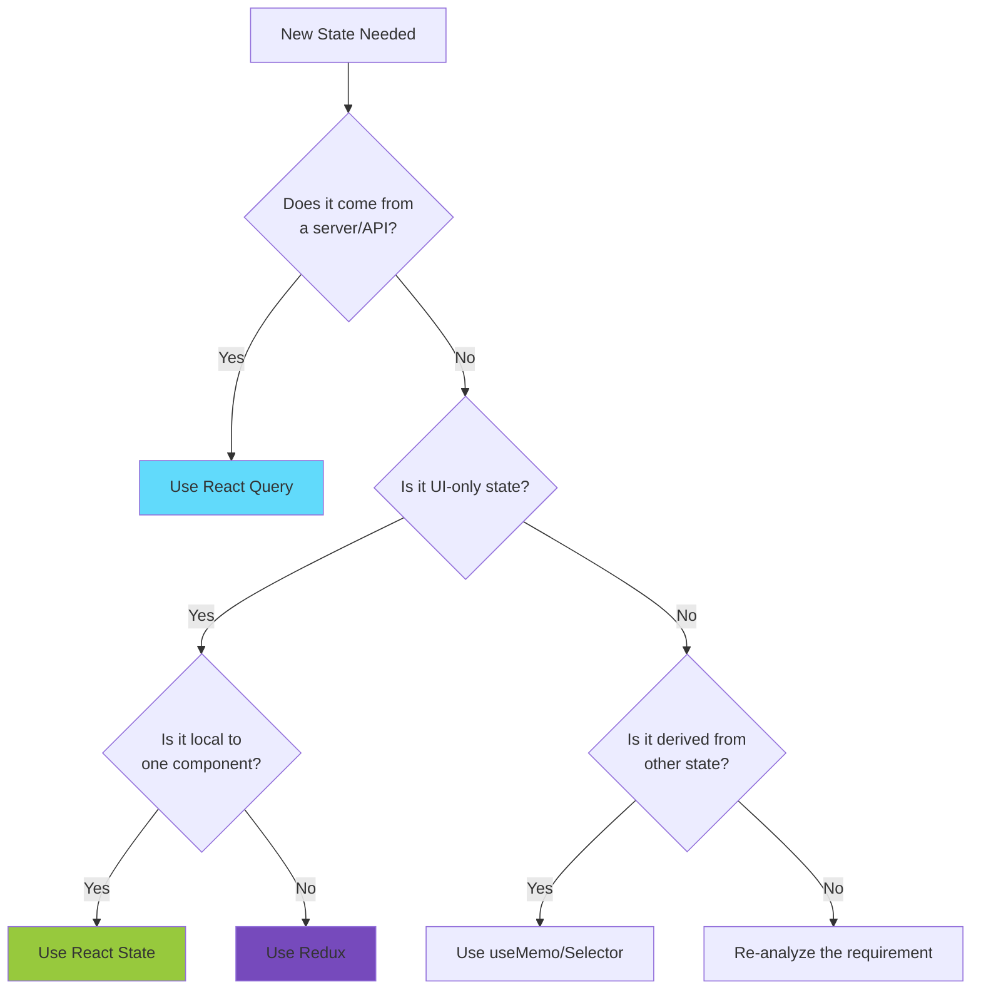

# State Management Developer Guidelines

**Version**: 1.0.0
**Last Updated**: 2024-12-26
**Epic**: Epic 004 - State Management Consolidation

## Table of Contents

1. [Quick Start](#quick-start)
2. [Core Principles](#core-principles)
3. [State Management Boundaries](#state-management-boundaries)
4. [React Query Patterns](#react-query-patterns)
5. [Redux Patterns](#redux-patterns)
6. [Common Patterns](#common-patterns)
7. [Anti-Patterns to Avoid](#anti-patterns-to-avoid)
8. [Code Review Checklist](#code-review-checklist)
9. [Debugging Guide](#debugging-guide)
10. [Performance Optimization](#performance-optimization)
11. [Quick Reference](#quick-reference)

## Quick Start

### Decision Tree: Where Does This State Belong?



### Installation & Setup

```bash
# Ensure packages are installed
npm install @tanstack/react-query @reduxjs/toolkit react-redux

# Import in your component
import { useQuery, useMutation } from '@tanstack/react-query';
import { useSelector, useDispatch } from 'react-redux';
import { RootState, AppDispatch } from '@/store';
```

## Core Principles

### 1. Single Source of Truth
- **Server State**: React Query owns all server data
- **Client State**: Redux owns all UI state
- **Component State**: useState for truly local state

### 2. Clear Boundaries
```typescript
// ✅ CORRECT: Server state in React Query
const { data: userProfile } = useQuery({
  queryKey: ['user', userId],
  queryFn: () => fetchUser(userId)
});

// ✅ CORRECT: UI state in Redux
const theme = useSelector((state: RootState) => state.ui.theme);
```

### 3. Immutability
- Never mutate state directly
- Use Redux Toolkit's Immer for Redux
- React Query handles server state immutability

## State Management Boundaries

### What Goes in React Query

| Category | Examples | Implementation |
|----------|----------|---------------|
| API Responses | User data, posts, comments | `useQuery`, `useMutation` |
| External Data | NOSTR events, blockchain data | `useQuery` with WebSocket |
| Server Config | Feature flags, settings | `useQuery` with long cache |
| File Uploads | Images, documents | `useMutation` with progress |
| Search Results | Filtered/paginated data | `useInfiniteQuery` |

### What Goes in Redux

| Category | Examples | Implementation |
|----------|----------|---------------|
| UI State | Theme, sidebar, modals | UI slice |
| Form Drafts | Unsaved user input | Form slice |
| Selection | Multi-select, active items | Selection slice |
| Navigation | Breadcrumbs, tab state | Navigation slice |
| Notifications | Toasts, alerts | Notification slice |

### What Stays in Component State

```typescript
// Local state that doesn't need sharing
const [isHovered, setIsHovered] = useState(false);
const [inputFocus, setInputFocus] = useState(false);
const [localValidation, setLocalValidation] = useState('');
```

## React Query Patterns

### Basic Query Pattern

```typescript
// ✅ GOOD: Comprehensive query setup
export const useUserProfile = (userId: string) => {
  return useQuery({
    queryKey: ['user', userId],
    queryFn: () => api.users.getProfile(userId),
    staleTime: 5 * 60 * 1000, // Consider fresh for 5 minutes
    cacheTime: 10 * 60 * 1000, // Keep in cache for 10 minutes
    retry: 3,
    retryDelay: attemptIndex => Math.min(1000 * 2 ** attemptIndex, 30000),
    enabled: !!userId, // Only run if userId exists
  });
};

// Usage in component
function UserProfile({ userId }: Props) {
  const { data, isLoading, error } = useUserProfile(userId);

  if (isLoading) return <Skeleton />;
  if (error) return <ErrorBoundary error={error} />;
  return <Profile data={data} />;
}
```

### Mutation Pattern

```typescript
// ✅ GOOD: Mutation with optimistic updates
export const useUpdateProfile = () => {
  const queryClient = useQueryClient();

  return useMutation({
    mutationFn: api.users.updateProfile,
    onMutate: async (newProfile) => {
      // Cancel in-flight queries
      await queryClient.cancelQueries({ queryKey: ['user', newProfile.id] });

      // Save previous value
      const previousProfile = queryClient.getQueryData(['user', newProfile.id]);

      // Optimistic update
      queryClient.setQueryData(['user', newProfile.id], newProfile);

      return { previousProfile };
    },
    onError: (err, newProfile, context) => {
      // Rollback on error
      if (context?.previousProfile) {
        queryClient.setQueryData(
          ['user', newProfile.id],
          context.previousProfile
        );
      }
    },
    onSettled: (data, error, variables) => {
      // Always refetch after mutation
      queryClient.invalidateQueries({ queryKey: ['user', variables.id] });
    },
  });
};
```

### Dependent Queries Pattern

```typescript
// ✅ GOOD: Queries that depend on other data
export const useUserPosts = (userId?: string) => {
  const { data: user } = useUserProfile(userId!);

  return useQuery({
    queryKey: ['posts', 'user', userId],
    queryFn: () => api.posts.getByUser(userId!),
    enabled: !!user, // Only fetch posts after user is loaded
  });
};
```

### Infinite Query Pattern

```typescript
// ✅ GOOD: Pagination with infinite scroll
export const useInfinitePosts = () => {
  return useInfiniteQuery({
    queryKey: ['posts', 'infinite'],
    queryFn: ({ pageParam = 0 }) => api.posts.getPage(pageParam),
    getNextPageParam: (lastPage, pages) => lastPage.nextCursor,
    staleTime: 1 * 60 * 1000,
  });
};
```

## Redux Patterns

### Slice Creation Pattern

```typescript
// ✅ GOOD: Focused UI slice
import { createSlice, PayloadAction } from '@reduxjs/toolkit';

interface UIState {
  theme: 'light' | 'dark';
  sidebarOpen: boolean;
  activeModal: string | null;
}

const initialState: UIState = {
  theme: 'light',
  sidebarOpen: true,
  activeModal: null,
};

const uiSlice = createSlice({
  name: 'ui',
  initialState,
  reducers: {
    setTheme: (state, action: PayloadAction<'light' | 'dark'>) => {
      state.theme = action.payload;
    },
    toggleSidebar: (state) => {
      state.sidebarOpen = !state.sidebarOpen;
    },
    openModal: (state, action: PayloadAction<string>) => {
      state.activeModal = action.payload;
    },
    closeModal: (state) => {
      state.activeModal = null;
    },
  },
});

export const { setTheme, toggleSidebar, openModal, closeModal } = uiSlice.actions;
export default uiSlice.reducer;
```

### Selector Pattern

```typescript
// ✅ GOOD: Memoized selectors
import { createSelector } from '@reduxjs/toolkit';
import { RootState } from '@/store';

// Basic selector
export const selectTheme = (state: RootState) => state.ui.theme;

// Memoized computed selector
export const selectUIConfig = createSelector(
  [selectTheme, (state: RootState) => state.ui.sidebarOpen],
  (theme, sidebarOpen) => ({
    theme,
    sidebarOpen,
    isDark: theme === 'dark',
  })
);
```

## Common Patterns

### Pattern 1: Form with Server Validation

```typescript
// ✅ GOOD: Combining Redux (draft) with React Query (validation)
function CreatePostForm() {
  const dispatch = useDispatch();
  const draft = useSelector(selectPostDraft);

  // Local draft in Redux
  const handleChange = (field: string, value: string) => {
    dispatch(updateDraft({ field, value }));
  };

  // Server submission with React Query
  const { mutate: submitPost, isLoading } = useMutation({
    mutationFn: api.posts.create,
    onSuccess: () => {
      dispatch(clearDraft());
      navigate('/posts');
    },
  });

  return (
    <form onSubmit={() => submitPost(draft)}>
      {/* Form fields */}
    </form>
  );
}
```

### Pattern 2: Real-time Updates with WebSocket

```typescript
// ✅ GOOD: WebSocket updates to React Query cache
export const useRealtimePosts = () => {
  const queryClient = useQueryClient();

  useEffect(() => {
    const ws = new WebSocket(WS_URL);

    ws.onmessage = (event) => {
      const update = JSON.parse(event.data);

      // Update React Query cache with WebSocket data
      queryClient.setQueryData(
        ['posts', update.id],
        (old) => ({ ...old, ...update })
      );
    };

    return () => ws.close();
  }, [queryClient]);

  return useQuery({
    queryKey: ['posts'],
    queryFn: api.posts.getAll,
  });
};
```

### Pattern 3: Optimistic UI Updates

```typescript
// ✅ GOOD: Optimistic updates for better UX
export const useLikePost = () => {
  const queryClient = useQueryClient();

  return useMutation({
    mutationFn: api.posts.like,
    onMutate: async (postId) => {
      // Optimistically update UI
      await queryClient.cancelQueries(['posts', postId]);

      const previousPost = queryClient.getQueryData(['posts', postId]);

      queryClient.setQueryData(['posts', postId], old => ({
        ...old,
        likes: old.likes + 1,
        isLiked: true,
      }));

      return { previousPost };
    },
    onError: (err, postId, context) => {
      // Revert on error
      if (context?.previousPost) {
        queryClient.setQueryData(['posts', postId], context.previousPost);
      }
    },
  });
};
```

## Anti-Patterns to Avoid

### ❌ Anti-Pattern 1: Server State in Redux

```typescript
// ❌ BAD: Don't put server data in Redux
const postsSlice = createSlice({
  name: 'posts',
  initialState: { data: [], loading: false },
  reducers: {
    setPosts: (state, action) => {
      state.data = action.payload;
    }
  }
});

// ✅ GOOD: Use React Query instead
const { data: posts } = useQuery({
  queryKey: ['posts'],
  queryFn: api.posts.getAll
});
```

### ❌ Anti-Pattern 2: Duplicating State

```typescript
// ❌ BAD: Copying server state to component state
function BadComponent() {
  const { data } = useQuery(['user'], fetchUser);
  const [user, setUser] = useState(data); // Duplicate state!

  useEffect(() => {
    setUser(data); // Sync nightmare!
  }, [data]);
}

// ✅ GOOD: Use server state directly
function GoodComponent() {
  const { data: user } = useQuery(['user'], fetchUser);
  // Use `user` directly, no copying
}
```

### ❌ Anti-Pattern 3: Manual Cache Management

```typescript
// ❌ BAD: Manual cache invalidation
async function updateUser(data) {
  await api.updateUser(data);
  // Manually refetch everything
  await queryClient.refetchQueries(['user']);
  await queryClient.refetchQueries(['posts']);
  await queryClient.refetchQueries(['comments']);
}

// ✅ GOOD: Use mutation with smart invalidation
const mutation = useMutation({
  mutationFn: api.updateUser,
  onSuccess: () => {
    // Targeted invalidation
    queryClient.invalidateQueries({
      queryKey: ['user'],
      exact: false // Invalidate all user-related queries
    });
  }
});
```

## Code Review Checklist

### React Query Checklist
- [ ] Query keys are consistent and descriptive
- [ ] Stale time and cache time are appropriate
- [ ] Error handling is implemented
- [ ] Loading states are handled
- [ ] Mutations include optimistic updates where appropriate
- [ ] No duplicate queries for same data
- [ ] Proper query invalidation after mutations
- [ ] Dependent queries use `enabled` flag

### Redux Checklist
- [ ] Only UI state in Redux (no server data)
- [ ] Slices are focused and cohesive
- [ ] Actions are descriptive and typed
- [ ] Selectors are memoized where needed
- [ ] No direct state mutation
- [ ] Proper TypeScript types for all state

### General Checklist
- [ ] Clear separation between server and client state
- [ ] No state duplication
- [ ] Proper error boundaries
- [ ] Performance metrics met
- [ ] Tests cover state management

## Debugging Guide

### Common Issues and Solutions

#### Issue 1: Stale Data After Mutation
**Symptom**: UI doesn't update after successful mutation
**Solution**:
```typescript
// Ensure proper invalidation
onSuccess: () => {
  queryClient.invalidateQueries({ queryKey: ['affected', 'queries'] });
}
```

#### Issue 2: Infinite Render Loop
**Symptom**: Component keeps re-rendering
**Solution**:
```typescript
// Check dependencies
const { data } = useQuery({
  queryKey: ['data', stableVariable], // Ensure stable key
  queryFn: () => fetchData(stableVariable),
  enabled: !!stableVariable, // Prevent unnecessary queries
});
```

#### Issue 3: Race Conditions
**Symptom**: Old data overwrites new data
**Solution**:
```typescript
// Cancel in-flight queries
onMutate: async (newData) => {
  await queryClient.cancelQueries({ queryKey: ['data'] });
  // ... rest of optimistic update
}
```

### Debugging Tools

```typescript
// Enable React Query DevTools
import { ReactQueryDevtools } from '@tanstack/react-query-devtools';

function App() {
  return (
    <>
      <Routes />
      <ReactQueryDevtools initialIsOpen={false} />
    </>
  );
}

// Redux DevTools
const store = configureStore({
  reducer: rootReducer,
  devTools: process.env.NODE_ENV !== 'production',
});
```

## Performance Optimization

### React Query Optimizations

```typescript
// 1. Prefetch critical data
const prefetchUser = async (userId: string) => {
  await queryClient.prefetchQuery({
    queryKey: ['user', userId],
    queryFn: () => fetchUser(userId),
    staleTime: 10 * 60 * 1000,
  });
};

// 2. Use select to minimize re-renders
const { data: username } = useQuery({
  queryKey: ['user', userId],
  queryFn: fetchUser,
  select: (data) => data.username, // Only re-render when username changes
});

// 3. Batch cache updates
queryClient.setQueriesData(
  { queryKey: ['posts'], exact: false },
  (old) => updateAllPosts(old)
);
```

### Redux Optimizations

```typescript
// 1. Use normalized state shape
const postsSlice = createSlice({
  name: 'posts',
  initialState: {
    byId: {} as Record<string, Post>,
    allIds: [] as string[],
  },
  // ...
});

// 2. Memoize expensive selectors
export const selectExpensiveData = createSelector(
  [selectPosts, selectFilters],
  (posts, filters) => expensiveComputation(posts, filters)
);

// 3. Use React.memo for pure components
export const PureComponent = React.memo(Component);
```

## Quick Reference

### Decision Matrix

| Need | Solution | Example |
|------|----------|---------|
| Fetch data from API | React Query | `useQuery(['users'], fetchUsers)` |
| Update server data | React Query | `useMutation(updateUser)` |
| Toggle modal | Redux | `dispatch(openModal('edit'))` |
| Theme preference | Redux | `dispatch(setTheme('dark'))` |
| Form input | Component State | `useState(initialValue)` |
| Computed values | Selector/Memo | `useMemo(() => compute(data))` |
| WebSocket data | React Query + WS | Update query cache on message |
| Temp validation | Component State | `useState(errors)` |

### Import Cheatsheet

```typescript
// React Query
import {
  useQuery,
  useMutation,
  useInfiniteQuery,
  useQueryClient
} from '@tanstack/react-query';

// Redux
import { useSelector, useDispatch } from 'react-redux';
import { createSlice, PayloadAction } from '@reduxjs/toolkit';
import type { RootState, AppDispatch } from '@/store';

// React
import { useState, useEffect, useMemo, useCallback } from 'react';
```

### Query Key Conventions

```typescript
// Consistent query key structure
['resource'] // All resources
['resource', id] // Specific resource
['resource', 'list', { filters }] // Filtered list
['resource', id, 'relation'] // Related data
['resource', 'search', query] // Search results
```

---

## Additional Resources

- [React Query Documentation](https://tanstack.com/query/latest)
- [Redux Toolkit Documentation](https://redux-toolkit.js.org/)
- [ADR-004: State Management Boundaries](../architecture/decisions/ADR-004-state-management-boundaries.md)
- [Performance Monitoring Dashboard](https://sovren.app/monitoring)
- [Epic 004 Implementation Report](../EPIC-004-COMPLETION-REPORT.md)

## Getting Help

- **Slack Channel**: #state-management
- **Office Hours**: Tuesdays 2-3pm PT
- **Code Reviews**: Tag @state-management-team
- **Emergency**: Page on-call engineer for production issues

---

*Last reviewed: 2024-12-26 | Next review: 2025-01-26*