# 📊 Mermaid Diagram Guide

## 📋 Overview

This document provides a comprehensive guide for creating Mermaid diagrams for Sovren user story implementations. Mermaid diagrams are **mandatory** for all user story implementations and must follow the standards outlined in this guide to achieve elite engineering status.

## 🎯 Diagram Types and Requirements

### Required Diagram Types

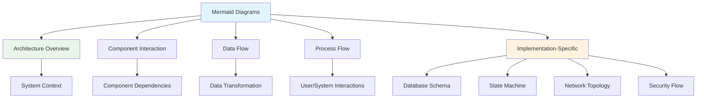

## 📊 Diagram Creation Guidelines

### 1. Architecture Overview Diagram

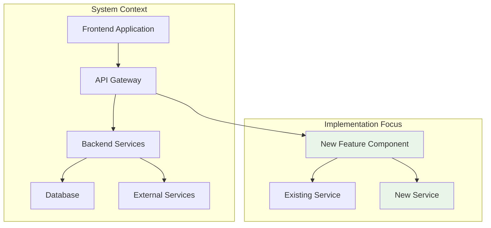

**Purpose**: Illustrate where the implementation fits within the overall system architecture.

**Requirements**:

- Show the major components involved in the implementation
- Highlight new or modified components
- Show relationships between components
- Use clear, descriptive labels for all components
- Use color coding to distinguish new/modified components

**When to Create**: At the beginning of the implementation, after requirements analysis.

### 2. Component Interaction Diagram

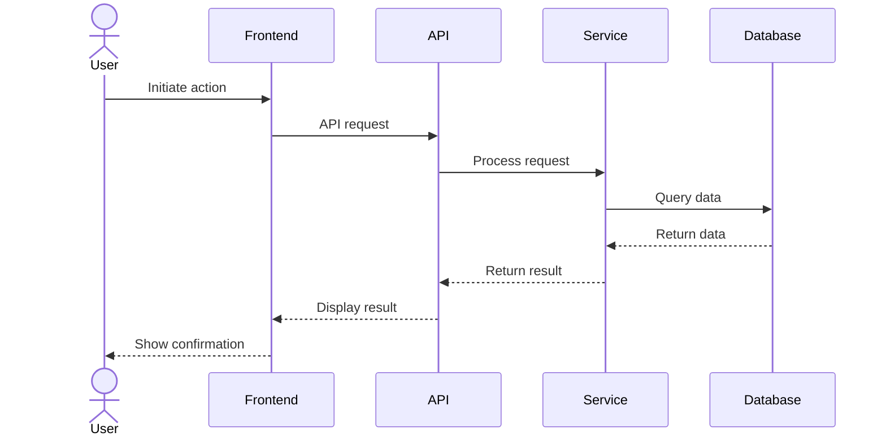

**Purpose**: Show how components interact with each other during the execution of a feature.

**Requirements**:

- Use sequence diagrams to show the flow of interactions
- Include all components involved in the interaction
- Show the sequence of operations in chronological order
- Include error handling paths where appropriate
- Use clear, descriptive messages for each interaction

**When to Create**: During technical design, after identifying all components.

### 3. Data Flow Diagram

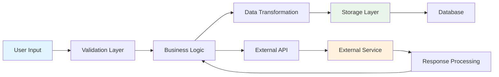

**Purpose**: Visualize how data flows through the system during the execution of a feature.

**Requirements**:

- Show the path of data through the system
- Include data transformation steps
- Show data storage points
- Include external data sources/destinations
- Use clear, descriptive labels for data elements

**When to Create**: During technical design, when defining data models and flows.

### 4. Process Flow Diagram

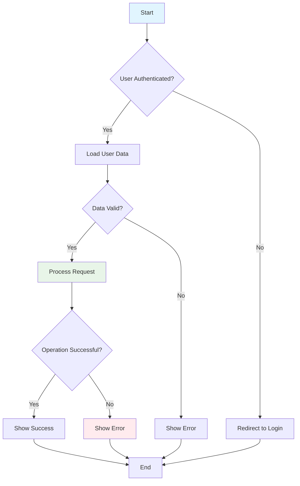

**Purpose**: Provide a step-by-step visualization of the process flow, including decision points and error handling.

**Requirements**:

- Show the complete process flow from start to end
- Include all decision points with clear conditions
- Show error handling paths
- Use consistent symbols for different types of steps
- Use clear, descriptive labels for all steps

**When to Create**: During technical design, when defining the process flow.

### 5. Implementation-Specific Diagrams

#### Database Schema Diagram

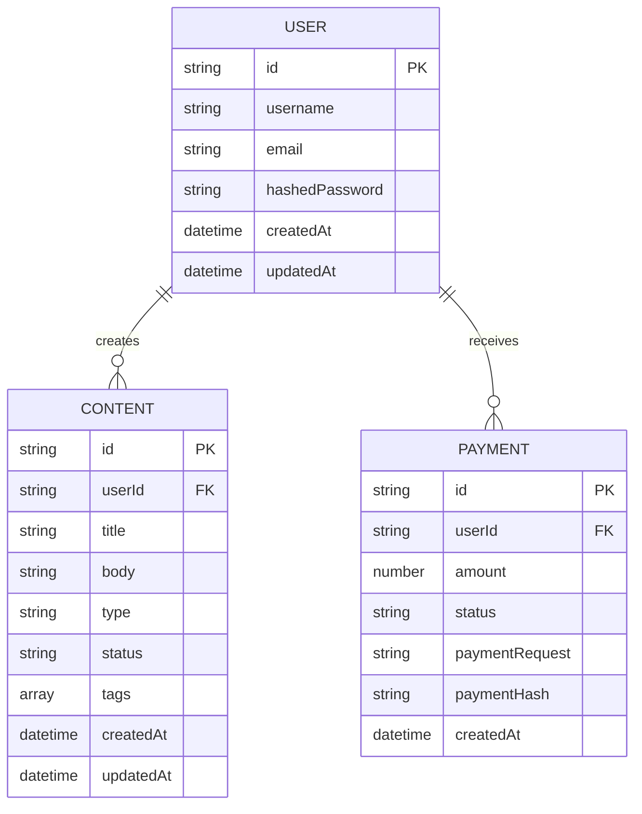

**Purpose**: Visualize database schema changes or relationships.

**Requirements**:

- Show all relevant tables and their relationships
- Include field names and types
- Highlight primary and foreign keys
- Show cardinality of relationships
- Highlight new or modified tables/fields

**When to Create**: When implementing features that involve database changes.

#### State Machine Diagram

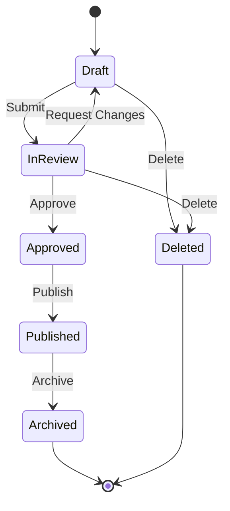

**Purpose**: Visualize state transitions for entities with complex lifecycle management.

**Requirements**:

- Show all possible states
- Include all valid transitions between states
- Label transitions with the events that trigger them
- Include initial and final states
- Use clear, descriptive names for states and transitions

**When to Create**: When implementing features with complex state management.

#### Network Topology Diagram

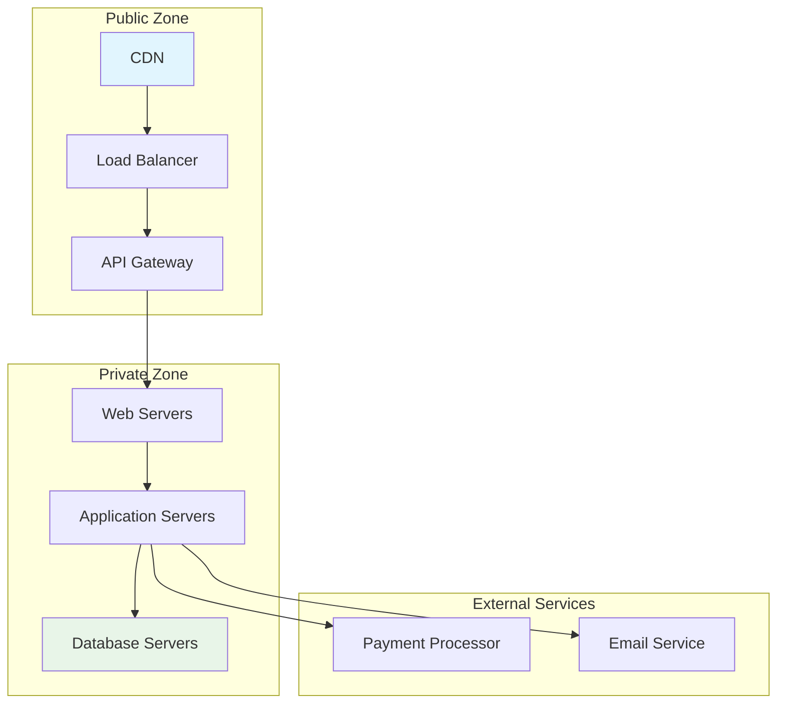

**Purpose**: Visualize network architecture and security zones.

**Requirements**:

- Show all network components and their connections
- Group components into logical zones
- Show traffic flow between components
- Include security boundaries
- Use clear, descriptive labels for all components

**When to Create**: When implementing features that involve infrastructure or network changes.

#### Security Flow Diagram

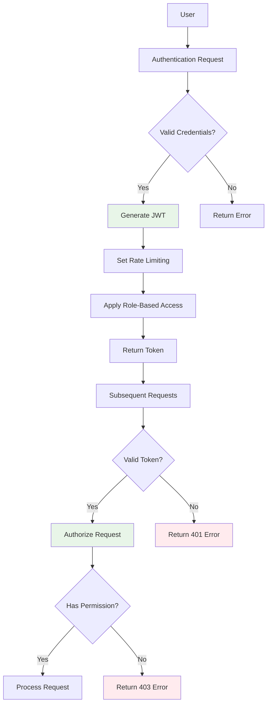

**Purpose**: Visualize security flows, including authentication, authorization, and data protection.

**Requirements**:

- Show the complete security flow
- Include authentication and authorization steps
- Show validation and verification points
- Include error handling for security failures
- Use clear, descriptive labels for all steps

**When to Create**: When implementing features that involve security concerns.

## 🛠️ Mermaid Syntax Guide

### Basic Syntax

Mermaid diagrams are defined using a simple markdown-like syntax:

````
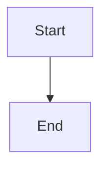
````

### Common Diagram Types

#### Flowchart

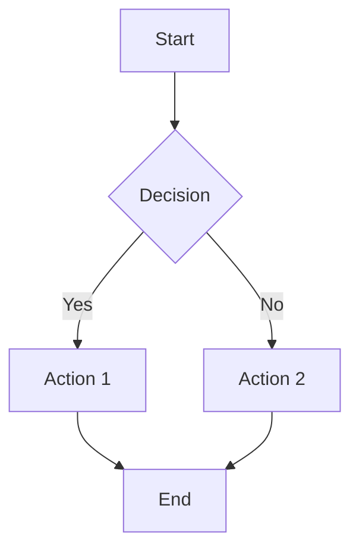

**Syntax**:

```
graph TD
    A[Start] --> B{Decision}
    B -->|Yes| C[Action 1]
    B -->|No| D[Action 2]
    C --> E[End]
    D --> E
```

#### Sequence Diagram

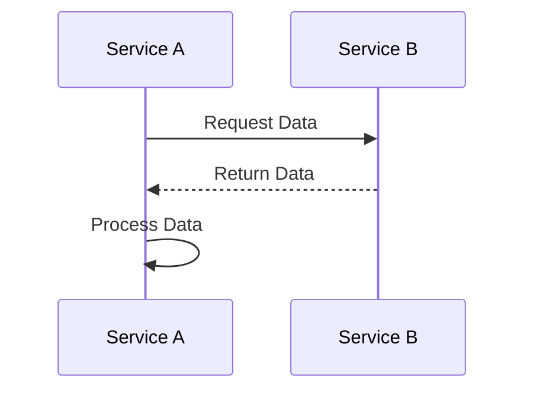

**Syntax**:

```
sequenceDiagram
    participant A as Service A
    participant B as Service B

    A->>B: Request Data
    B-->>A: Return Data

    A->>A: Process Data
```

#### Entity Relationship Diagram

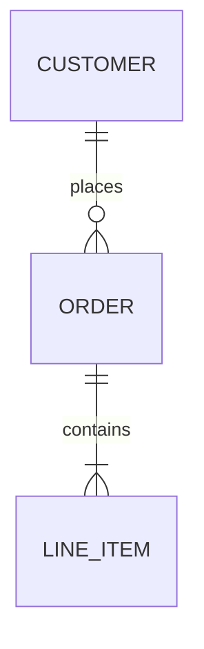

**Syntax**:

```
erDiagram
    CUSTOMER ||--o{ ORDER : places
    ORDER ||--|{ LINE_ITEM : contains
```

#### State Diagram

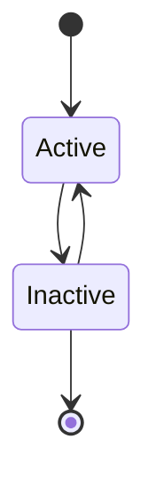

**Syntax**:

```
stateDiagram-v2
    [*] --> Active
    Active --> Inactive
    Inactive --> Active
    Inactive --> [*]
```

#### Class Diagram

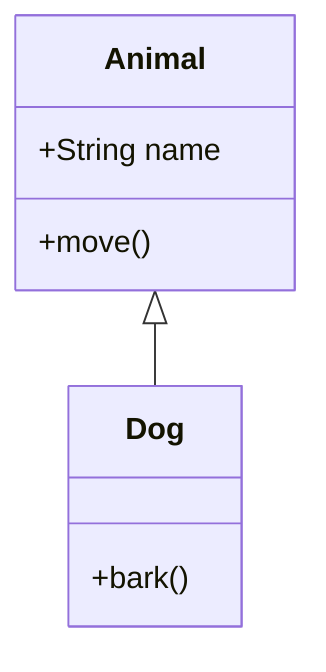

**Syntax**:

```
classDiagram
    class Animal {
        +String name
        +move()
    }
    class Dog {
        +bark()
    }
    Animal <|-- Dog
```

### Styling and Formatting

#### Node Shapes

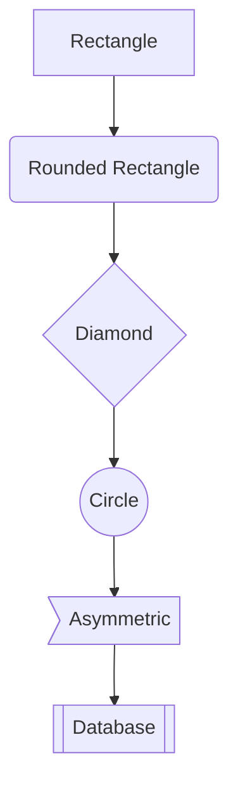

**Syntax**:

```
graph TD
    A[Rectangle] --> B(Rounded Rectangle)
    B --> C{Diamond}
    C --> D((Circle))
    D --> E>Asymmetric]
    E --> F[[Database]]
```

#### Styling Nodes

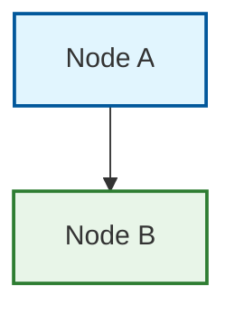

**Syntax**:

```
graph TD
    A[Node A] --> B[Node B]

    style A fill:#e1f5fe,stroke:#01579b,stroke-width:2px
    style B fill:#e8f5e8,stroke:#2e7d32,stroke-width:2px
```

#### Subgraphs

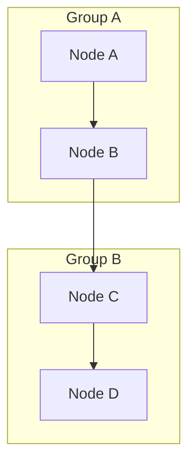

**Syntax**:

```
graph TD
    subgraph Group A
        A[Node A] --> B[Node B]
    end

    subgraph Group B
        C[Node C] --> D[Node D]
    end

    B --> C
```

## 📚 Tools and Resources

### Online Editors

- [Mermaid Live Editor](https://mermaid.live/) - Interactive editor with live preview
- [Mermaid.js Online Editor](https://mermaid-js.github.io/mermaid-live-editor/) - Official editor

### IDE Plugins

- **VS Code**: [Mermaid Preview](https://marketplace.visualstudio.com/items?itemName=bierner.markdown-mermaid)
- **JetBrains**: [Mermaid](https://plugins.jetbrains.com/plugin/8460-mermaid)
- **Vim/Neovim**: [Markdown Preview](https://github.com/iamcco/markdown-preview.nvim)

### Documentation

- [Mermaid.js Documentation](https://mermaid-js.github.io/mermaid/#/)
- [Mermaid Cheat Sheet](https://jojozhuang.github.io/tutorial/mermaid-cheat-sheet/)
- [GitHub Mermaid Support](https://github.blog/2022-02-14-include-diagrams-markdown-files-mermaid/)

## 📝 Best Practices

### Diagram Organization

1. **Keep Diagrams Focused**:
   - Each diagram should have a clear purpose
   - Limit complexity to maintain readability
   - Break complex diagrams into multiple simpler diagrams

2. **Use Consistent Styling**:
   - Maintain consistent node shapes for similar entities
   - Use consistent color coding across diagrams
   - Follow the project's visual style guide

3. **Provide Context**:
   - Include a title for each diagram
   - Add a brief description explaining the diagram's purpose
   - Include legends for color coding and symbols

4. **Ensure Readability**:
   - Limit the number of nodes in a single diagram
   - Use clear, descriptive labels
   - Arrange nodes to minimize crossing lines

### Diagram Review Checklist

- [ ] Diagram has a clear purpose and focus
- [ ] All required elements are included
- [ ] Relationships are correctly represented
- [ ] Labels are clear and descriptive
- [ ] Styling is consistent with project standards
- [ ] Diagram is readable and not overly complex
- [ ] Context and legends are provided where needed

## 🏆 Elite Diagram Status

Diagrams achieve **Elite Status** when they:

✅ **Clearly communicate** the intended information
✅ **Follow project standards** for styling and formatting
✅ **Include appropriate detail** without unnecessary complexity
✅ **Provide context** through titles, descriptions, and legends
✅ **Support the documentation** by visually representing key concepts

---

**MANDATORY REQUIREMENT**: Every user story implementation MUST include the required Mermaid diagrams to achieve elite engineering status. No exceptions.
