# 📊 Mermaid Diagram Requirement

## 📋 Overview

This document establishes the **mandatory requirement** for including Mermaid diagrams in all user story implementations for the Sovren platform. Visual representation through diagrams is essential for understanding complex systems, facilitating knowledge transfer, and maintaining elite engineering standards.

## 🎯 Core Requirement

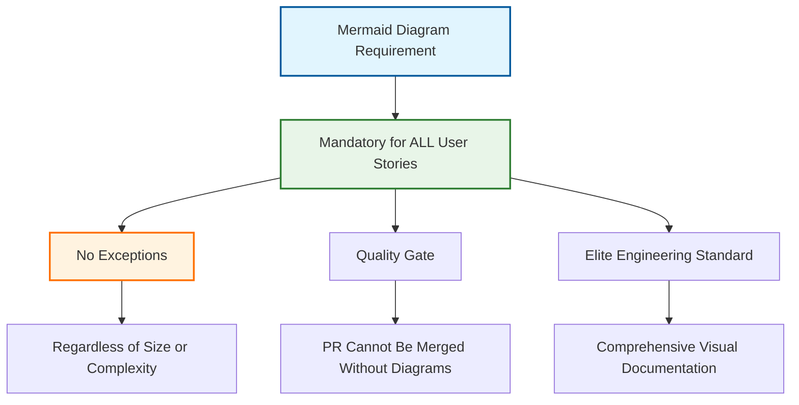

**MANDATORY REQUIREMENT**: Every user story implementation MUST include the required set of Mermaid diagrams to achieve elite engineering status. This requirement applies to ALL user stories without exception and serves as a quality gate for pull request approval.

## 📊 Required Diagram Types

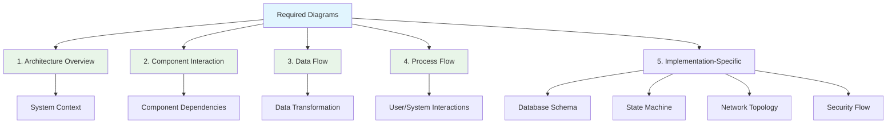

### 1. Architecture Overview Diagram

**Purpose**: Illustrate where the implementation fits within the overall system architecture.

**Requirements**:

- Show the major components involved in the implementation
- Highlight new or modified components
- Show relationships between components
- Use clear, descriptive labels for all components
- Use color coding to distinguish new/modified components

**Example**:

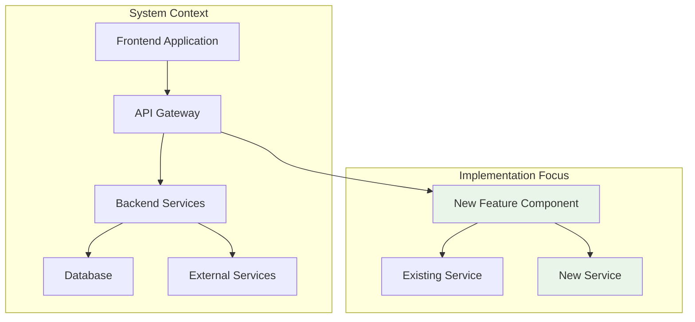

### 2. Component Interaction Diagram

**Purpose**: Show how components interact with each other during the execution of a feature.

**Requirements**:

- Use sequence diagrams to show the flow of interactions
- Include all components involved in the interaction
- Show the sequence of operations in chronological order
- Include error handling paths where appropriate
- Use clear, descriptive messages for each interaction

**Example**:

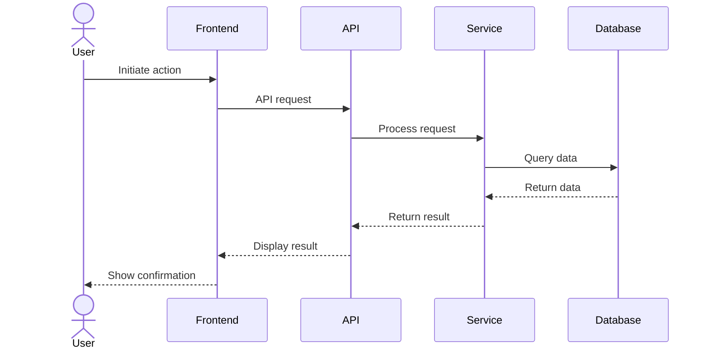

### 3. Data Flow Diagram

**Purpose**: Visualize how data flows through the system during the execution of a feature.

**Requirements**:

- Show the path of data through the system
- Include data transformation steps
- Show data storage points
- Include external data sources/destinations
- Use clear, descriptive labels for data elements

**Example**:

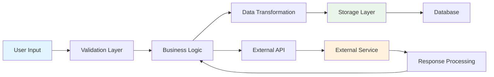

### 4. Process Flow Diagram

**Purpose**: Provide a step-by-step visualization of the process flow, including decision points and error handling.

**Requirements**:

- Show the complete process flow from start to end
- Include all decision points with clear conditions
- Show error handling paths
- Use consistent symbols for different types of steps
- Use clear, descriptive labels for all steps

**Example**:

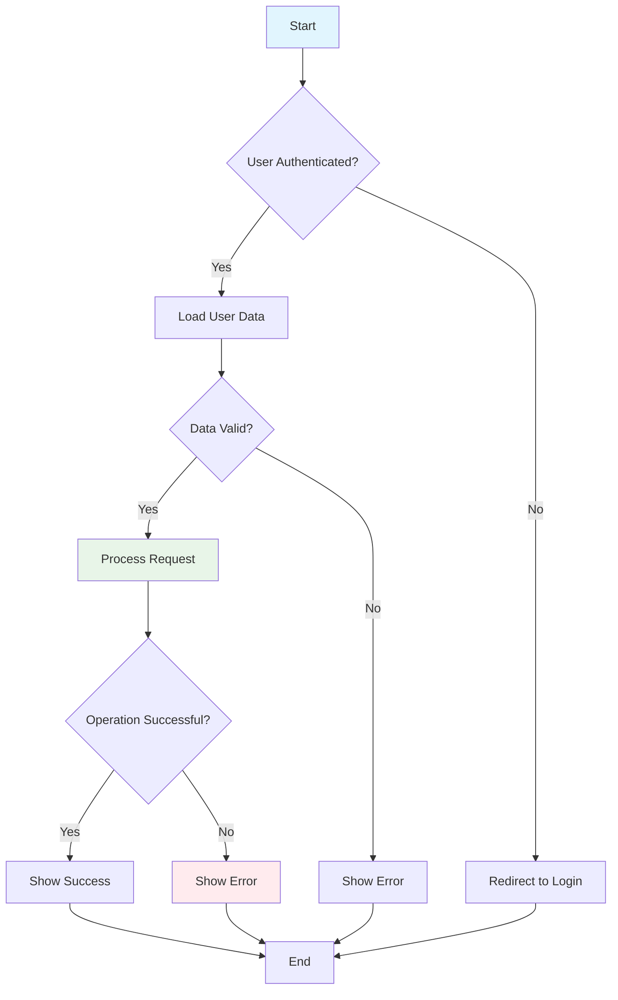

### 5. Implementation-Specific Diagrams

**Purpose**: Provide specialized diagrams based on the specific nature of the implementation.

**When to Include**:

- **Database Schema Diagram**: When implementing features that involve database changes
- **State Machine Diagram**: When implementing features with complex state management
- **Network Topology Diagram**: When implementing features that involve infrastructure changes
- **Security Flow Diagram**: When implementing features related to authentication, authorization, or security

**Examples**:

#### Database Schema Diagram

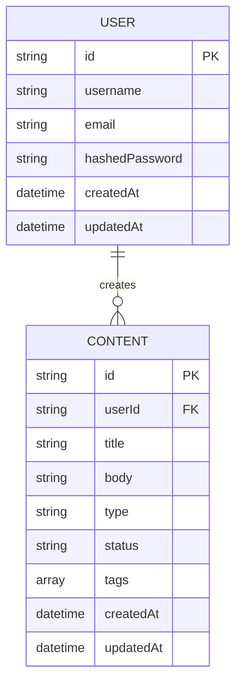

#### State Machine Diagram

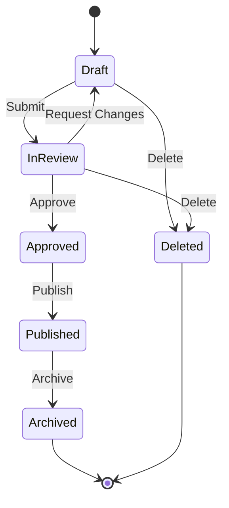

## 🛠️ Implementation Process

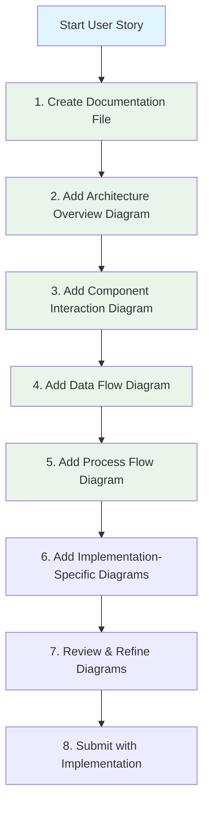

### Documentation Location

All Mermaid diagrams must be included in the following locations:

1. **User Story Documentation**:

   - Located in `docs/user-stories/US-XXX-title.md`
   - Each diagram in its own section with appropriate heading

2. **Technical Documentation**:

   - Located in `docs/development/` or appropriate subdirectory
   - Referenced from the user story documentation

3. **Pull Request Description**:
   - Summary of diagrams included
   - Links to detailed documentation

## 📝 Quality Standards

### Diagram Quality Checklist

- [ ] **Completeness**: All required diagrams are present
- [ ] **Accuracy**: Diagrams accurately represent the implementation
- [ ] **Clarity**: Diagrams are clear and easy to understand
- [ ] **Consistency**: Diagrams follow project styling standards
- [ ] **Detail**: Appropriate level of detail for the complexity of the feature
- [ ] **Formatting**: Proper Mermaid syntax and styling
- [ ] **Labels**: Clear, descriptive labels for all elements
- [ ] **Layout**: Logical flow and organization of elements

### Common Diagram Issues

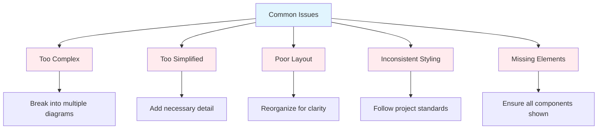

1. **Too Complex**: Diagrams with too many elements become difficult to understand

   - **Solution**: Break into multiple focused diagrams

2. **Too Simplified**: Diagrams that omit important details lose their value

   - **Solution**: Ensure all relevant components and interactions are included

3. **Poor Layout**: Disorganized diagrams with crossing lines reduce clarity

   - **Solution**: Reorganize elements for logical flow and readability

4. **Inconsistent Styling**: Varying styles across diagrams create confusion

   - **Solution**: Follow project styling standards consistently

5. **Missing Elements**: Incomplete diagrams that don't show all components
   - **Solution**: Review against requirements to ensure completeness

## 🔍 Enforcement Mechanisms

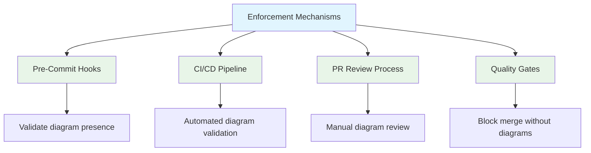

### 1. Pre-Commit Hooks

Pre-commit hooks will validate:

- Presence of Mermaid diagrams in documentation
- Syntax validity of Mermaid diagrams
- Minimum number of required diagrams

### 2. CI/CD Pipeline

The CI/CD pipeline will:

- Validate all Mermaid diagrams
- Generate visual representations of diagrams
- Report missing or invalid diagrams

### 3. PR Review Process

The PR review process will include:

- Specific checklist for diagram review
- Verification of diagram accuracy and completeness
- Feedback on diagram quality and clarity

### 4. Quality Gates

Quality gates will:

- Block PR merging if required diagrams are missing
- Ensure diagram quality meets standards
- Validate diagram consistency with implementation

## 📚 Resources and Tools

### Mermaid Documentation

- [Mermaid.js Official Documentation](https://mermaid-js.github.io/mermaid/#/)
- [Mermaid Live Editor](https://mermaid.live/)
- [GitHub Mermaid Support](https://github.blog/2022-02-14-include-diagrams-markdown-files-mermaid/)

### Recommended Tools

- **VS Code Extensions**:

  - [Markdown Preview Mermaid Support](https://marketplace.visualstudio.com/items?itemName=bierner.markdown-mermaid)
  - [Mermaid Diagram Editor](https://marketplace.visualstudio.com/items?itemName=tomoyukim.vscode-mermaid-editor)

- **CLI Tools**:
  - [mermaid-cli](https://github.com/mermaid-js/mermaid-cli) - Generate diagrams from command line
  - [mermaid-filter](https://github.com/raghur/mermaid-filter) - Process Mermaid diagrams in Markdown

### Internal Resources

- [Mermaid Diagram Guide](./mermaid-diagram-guide.md) - Detailed guide on creating Mermaid diagrams
- [Mermaid Templates](./templates/mermaid-templates.md) - Reusable diagram templates for common patterns
- [Diagram Style Guide](./style-guides/diagram-style-guide.md) - Project-specific styling standards

## 🏆 Elite Diagram Status

Diagrams achieve **Elite Status** when they:

✅ **Clearly communicate** the intended information
✅ **Follow project standards** for styling and formatting
✅ **Include appropriate detail** without unnecessary complexity
✅ **Provide context** through titles, descriptions, and legends
✅ **Support the documentation** by visually representing key concepts

---

**MANDATORY REQUIREMENT**: Every user story implementation MUST include the required Mermaid diagrams to achieve elite engineering status. No exceptions.
