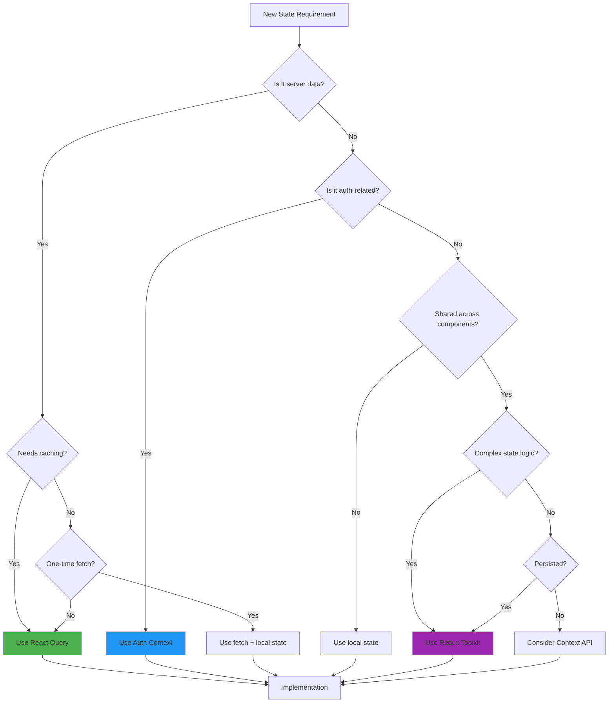

# State Management Guide

## Overview

Sovren uses a hybrid state management approach optimizing for both developer experience and performance:

- **React Query**: Server state (API data, remote resources)
- **Redux Toolkit**: UI state (themes, modals, selections)
- **React Context**: Auth state (user session, permissions)

## State Management Decision Tree



## When to Use Each Solution

### React Query (Server State)

**Use React Query for:**

- API data fetching
- Server state synchronization
- Background refetching
- Caching and invalidation
- Optimistic updates
- Infinite queries/pagination

**Examples:**

```typescript
// ✅ Good: Server data with caching
const { data: users } = useUsersQuery();
const { data: posts } = usePostsQuery({ userId });

// ✅ Good: Mutations with optimistic updates
const mutation = useCreatePostMutation({
  onMutate: async (newPost) => {
    // Optimistic update
    await queryClient.cancelQueries(['posts']);
    const previousPosts = queryClient.getQueryData(['posts']);
    queryClient.setQueryData(['posts'], (old) => [...old, newPost]);
    return { previousPosts };
  },
  onError: (err, newPost, context) => {
    // Rollback on error
    queryClient.setQueryData(['posts'], context.previousPosts);
  },
});
```

### Redux Toolkit (UI State)

**Use Redux for:**

- Theme preferences
- Modal/drawer states
- Selected items
- UI filters/sorting
- Form drafts (complex forms)
- Notification queues
- Layout preferences

**Examples:**

```typescript
// ✅ Good: UI state that needs to be shared
const { theme, setTheme } = useUIState();
const { selectedItems, toggleSelection } = useSelectionState();

// ✅ Good: Complex UI state with business logic
const { notifications, addNotification, dismissNotification } = useNotifications();
```

### React Context (Auth State)

**Use Context for:**

- User authentication state
- User permissions/roles
- Session management
- Feature flags (user-specific)

**Examples:**

```typescript
// ✅ Good: Auth state with context
const { user, isAuthenticated, login, logout } = useAuth();

// ✅ Good: Permission checks
const { hasPermission } = usePermissions();
if (hasPermission('admin.users.edit')) {
  // Show admin UI
}
```

### Local State (Component State)

**Use local state for:**

- Form inputs (simple forms)
- Toggle states (local only)
- Hover/focus states
- Animation states
- Temporary UI states

**Examples:**

```typescript
// ✅ Good: Local-only state
const [isOpen, setIsOpen] = useState(false);
const [search, setSearch] = useState('');
```

## Redux Slices Reference

### UI Slice (`uiSlice`)

Manages global UI state.

```typescript
interface UIState {
  theme: 'light' | 'dark' | 'system';
  sidebarOpen: boolean;
  selectedItemId: string | null;
  notifications: Notification[];
  modals: Record<string, boolean>;
}

// Actions
uiSlice.actions.setTheme(theme);
uiSlice.actions.toggleSidebar();
uiSlice.actions.setSelectedItem(id);
uiSlice.actions.addNotification(notification);
uiSlice.actions.openModal(modalId);
uiSlice.actions.closeModal(modalId);
```

### Auth Slice (`authSlice`)

Manages authentication state (being migrated to Context).

```typescript
interface AuthState {
  user: User | null;
  isAuthenticated: boolean;
  isLoading: boolean;
  error: string | null;
}
```

## React Query Hooks Reference

### Query Hooks

```typescript
// Users
useUsersQuery(options?)
useUserQuery(userId: string, options?)

// Posts
usePostsQuery(filters?, options?)
usePostQuery(postId: string, options?)

// Comments
useCommentsQuery(postId: string, options?)

// Analytics
useAnalyticsQuery(dateRange, options?)
```

### Mutation Hooks

```typescript
// Users
useCreateUserMutation(options?)
useUpdateUserMutation(options?)
useDeleteUserMutation(options?)

// Posts
useCreatePostMutation(options?)
useUpdatePostMutation(options?)
useDeletePostMutation(options?)

// Comments
useCreateCommentMutation(options?)
```

### Query Keys

Consistent query key structure for cache management:

```typescript
// Query key patterns
['users'][('users', userId)][ // All users // Single user
  ('users', { filter: value })
]['posts'][('posts', postId)][('posts', { userId })][('comments', postId)]; // Filtered users // All posts // Single post // User's posts // Post comments
```

## Code Examples

### Example 1: Dashboard with Mixed State

```typescript
function Dashboard() {
  // Server state via React Query
  const { data: analytics } = useAnalyticsQuery({
    range: 'last30days'
  });

  // UI state via Redux
  const { selectedMetric, setSelectedMetric } = useUIState();

  // Local state for temporary UI
  const [isExpanded, setIsExpanded] = useState(false);

  // Auth state via Context
  const { user } = useAuth();

  return (
    <div>
      <h1>Welcome {user.name}</h1>
      <MetricSelector
        selected={selectedMetric}
        onChange={setSelectedMetric}
      />
      <AnalyticsChart
        data={analytics}
        metric={selectedMetric}
        expanded={isExpanded}
        onToggleExpand={() => setIsExpanded(!isExpanded)}
      />
    </div>
  );
}
```

### Example 2: Form with Optimistic Updates

```typescript
function CreatePostForm() {
  // Local state for form inputs
  const [title, setTitle] = useState('');
  const [content, setContent] = useState('');

  // UI state for draft (if needed)
  const { saveDraft, loadDraft } = usePostDraft();

  // Server state mutation
  const createPost = useCreatePostMutation({
    onSuccess: () => {
      // Clear form
      setTitle('');
      setContent('');
      // Show notification via Redux
      dispatch(uiSlice.actions.addNotification({
        type: 'success',
        message: 'Post created successfully!'
      }));
    }
  });

  const handleSubmit = () => {
    createPost.mutate({ title, content });
  };

  return (
    <form onSubmit={handleSubmit}>
      {/* Form fields */}
    </form>
  );
}
```

### Example 3: List with Selection

```typescript
function UserList() {
  // Server state for users
  const { data: users, isLoading } = useUsersQuery();

  // UI state for selection
  const { selectedUsers, toggleUser, selectAll, clearSelection } = useSelection();

  // Local state for filters
  const [filter, setFilter] = useState('');

  const filteredUsers = users?.filter(u =>
    u.name.toLowerCase().includes(filter.toLowerCase())
  );

  return (
    <div>
      <SearchInput value={filter} onChange={setFilter} />
      <SelectionControls
        onSelectAll={selectAll}
        onClearSelection={clearSelection}
        selectedCount={selectedUsers.length}
      />
      <UserGrid
        users={filteredUsers}
        selectedUsers={selectedUsers}
        onToggleUser={toggleUser}
      />
    </div>
  );
}
```

## Migration Guide

### Migrating from Redux to React Query

**Before (Redux for server state):**

```typescript
// ❌ Old pattern
const dispatch = useDispatch();
const users = useSelector(selectUsers);
const loading = useSelector(selectUsersLoading);

useEffect(() => {
  dispatch(fetchUsers());
}, []);
```

**After (React Query for server state):**

```typescript
// ✅ New pattern
const { data: users, isLoading } = useUsersQuery();
// That's it! Caching, refetching, and error handling included
```

### Migrating UI State to Redux

**Before (Local state duplicated):**

```typescript
// ❌ Old pattern - duplicated in multiple components
const [theme, setTheme] = useState('light');
const [sidebarOpen, setSidebarOpen] = useState(false);
```

**After (Centralized in Redux):**

```typescript
// ✅ New pattern - shared across app
const { theme, setTheme, sidebarOpen, toggleSidebar } = useUIState();
```

## Testing State Management

### Testing React Query

```typescript
// Setup
const queryClient = new QueryClient({
  defaultOptions: {
    queries: { retry: false },
  },
});

const wrapper = ({ children }) => (
  <QueryClientProvider client={queryClient}>
    {children}
  </QueryClientProvider>
);

// Test
it('should fetch users', async () => {
  const { result } = renderHook(() => useUsersQuery(), { wrapper });

  await waitFor(() => {
    expect(result.current.isSuccess).toBe(true);
  });

  expect(result.current.data).toHaveLength(2);
});
```

### Testing Redux State

```typescript
// Test
it('should update theme', () => {
  const { result } = renderHook(() => useUIState(), {
    wrapper: ({ children }) => (
      <Provider store={store}>{children}</Provider>
    ),
  });

  act(() => {
    result.current.setTheme('dark');
  });

  expect(result.current.theme).toBe('dark');
});
```

## Troubleshooting

### Common Issues

**1. Unnecessary Re-renders**

- Check selector specificity
- Use `shallowEqual` for object selections
- Memoize computed values

**2. Stale Closures**

- Use query key dependencies correctly
- Include all dependencies in query keys

**3. Cache Invalidation**

- Use consistent query keys
- Invalidate related queries after mutations

**4. Memory Leaks**

- Clean up subscriptions
- Use proper query garbage collection

### Debug Tools

**React Query DevTools:**

```typescript
import { ReactQueryDevtools } from '@tanstack/react-query-devtools';

function App() {
  return (
    <>
      <Routes />
      <ReactQueryDevtools initialIsOpen={false} />
    </>
  );
}
```

**Redux DevTools:**

```typescript
const store = configureStore({
  reducer: rootReducer,
  devTools: process.env.NODE_ENV !== 'production',
});
```

## Best Practices

1. **Keep server and UI state separate**
   - Never store API data in Redux
   - Never use React Query for UI state

2. **Use consistent patterns**
   - Follow naming conventions
   - Use TypeScript for type safety

3. **Optimize for performance**
   - Set appropriate `staleTime` and `gcTime`
   - Use `select` to transform data
   - Memoize expensive computations

4. **Handle errors gracefully**
   - Use error boundaries
   - Provide fallback UI
   - Show user-friendly error messages

5. **Test thoroughly**
   - Unit test state logic
   - Integration test state interactions
   - E2E test critical flows

## API Reference

### Custom Hooks

```typescript
// UI State Hook
function useUIState() {
  const dispatch = useDispatch();
  const uiState = useSelector(selectUIState);

  return {
    ...uiState,
    setTheme: (theme) => dispatch(uiSlice.actions.setTheme(theme)),
    toggleSidebar: () => dispatch(uiSlice.actions.toggleSidebar()),
    // ... other actions
  };
}

// Selection Hook
function useSelection<T>() {
  const [selected, setSelected] = useState<Set<T>>(new Set());

  return {
    selected: Array.from(selected),
    toggle: (item: T) => {
      setSelected((prev) => {
        const next = new Set(prev);
        if (next.has(item)) {
          next.delete(item);
        } else {
          next.add(item);
        }
        return next;
      });
    },
    selectAll: (items: T[]) => setSelected(new Set(items)),
    clearSelection: () => setSelected(new Set()),
  };
}
```

### Utility Functions

```typescript
// Query key factory
const queryKeys = {
  all: ['users'] as const,
  lists: () => [...queryKeys.all, 'list'] as const,
  list: (filters: string) => [...queryKeys.lists(), { filters }] as const,
  details: () => [...queryKeys.all, 'detail'] as const,
  detail: (id: string) => [...queryKeys.details(), id] as const,
};

// Cache utils
function invalidateUserQueries(queryClient: QueryClient) {
  queryClient.invalidateQueries({ queryKey: queryKeys.all });
}
```

## Related Documentation

- [React Query Documentation](https://tanstack.com/query/latest)
- [Redux Toolkit Documentation](https://redux-toolkit.js.org/)
- [Architecture Decision Records](../decisions/adr-state-management.md)
- [Testing Guide](./testing-guide.md)
- [Performance Guide](./performance-guide.md)
