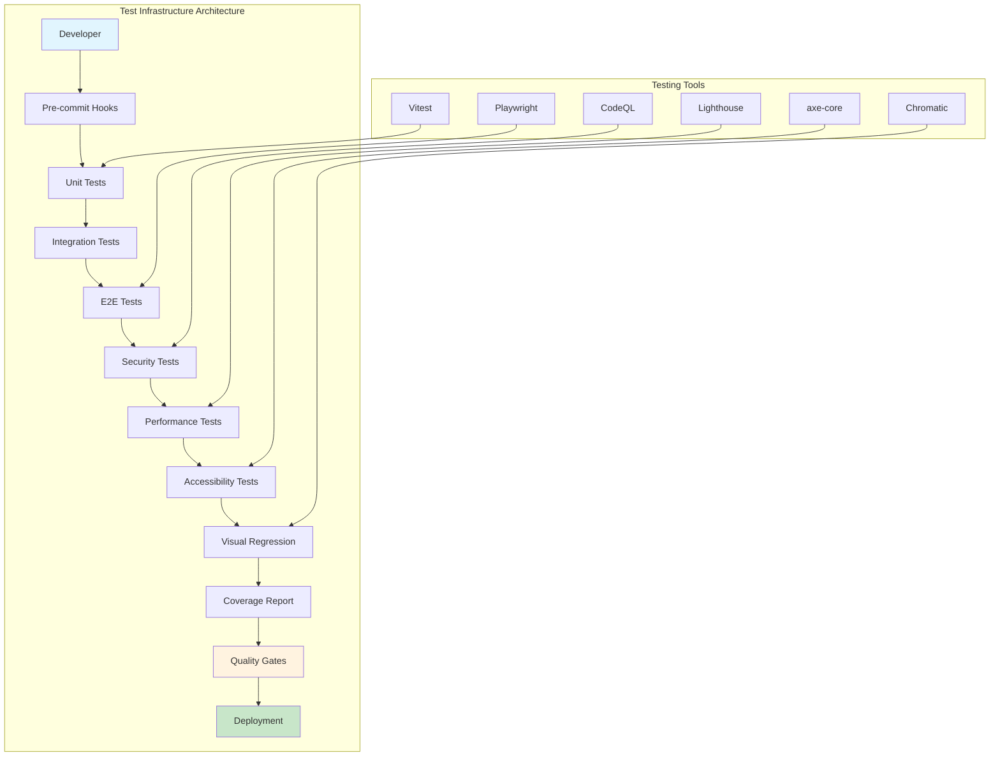
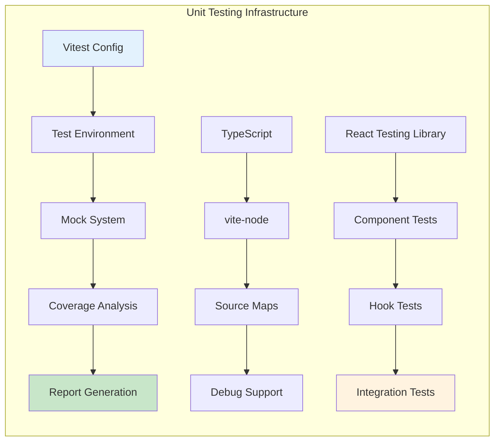
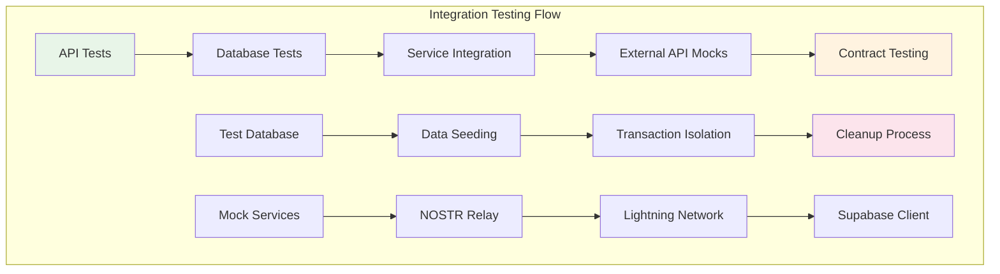
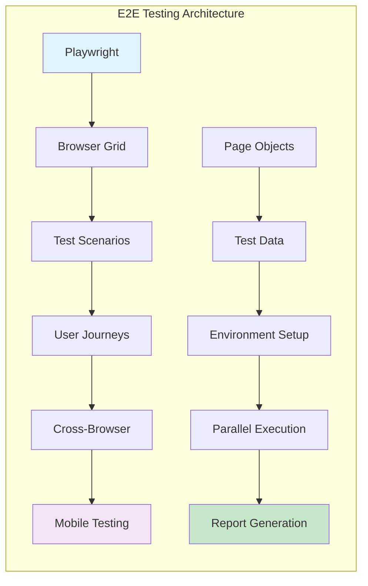
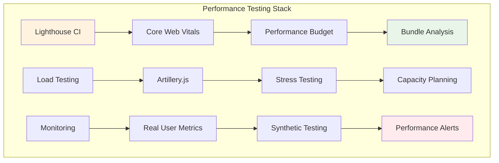
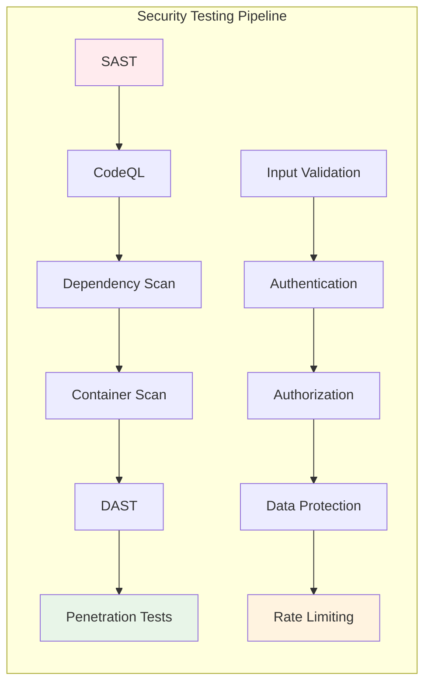
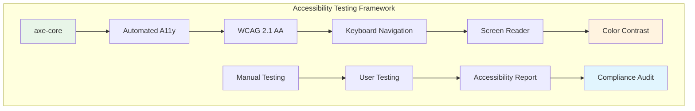
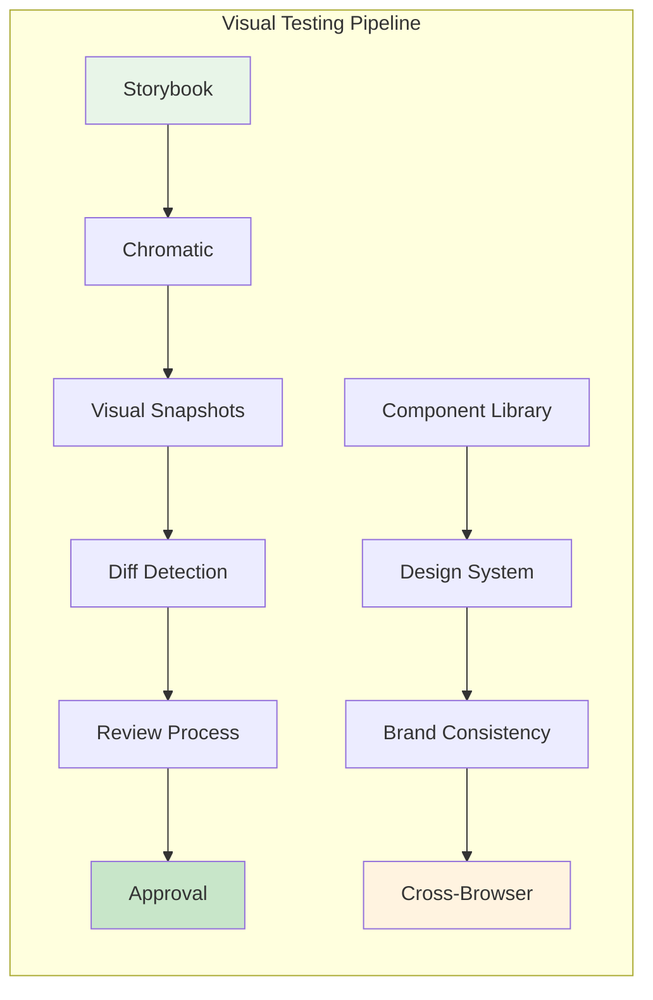
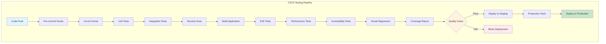
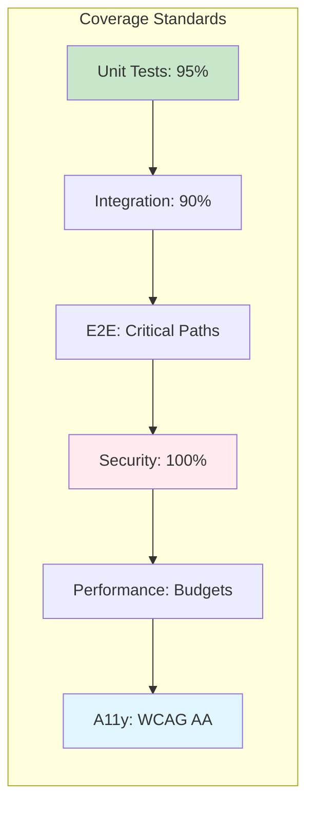

# 🧪 Test Infrastructure - Elite Testing Excellence

## 📋 Overview

This document establishes the comprehensive test infrastructure for Sovren, implementing elite testing standards with **95%+ coverage requirements**, **TDD/BDD methodologies**, and **automated quality gates**. Following the Clean Code principle: _"Testing is more important than shipping"_ and _"100% coverage (all statements and branches) is how you achieve very high confidence and developer peace of mind"_.

## 🎯 Testing Philosophy

### Core Principles

- **Test-First Development**: Write tests before implementation
- **Coverage Excellence**: 95%+ lines, 90%+ branches, 100% functions
- **Security Testing**: Zero vulnerabilities tolerance
- **Performance Testing**: Sub-second response times
- **Accessibility Testing**: WCAG 2.1 AA compliance

## 📊 Test Architecture Overview

## 🏗️ Test Infrastructure Components

### 1. Unit Testing Framework

### 2. Integration Testing Architecture

### 3. End-to-End Testing Framework

### 4. Performance Testing Infrastructure

### 5. Security Testing Framework

### 6. Accessibility Testing Infrastructure

### 7. Visual Regression Testing

### 8. CI/CD Testing Pipeline

## 📊 Test Metrics & Monitoring

### Coverage Requirements

