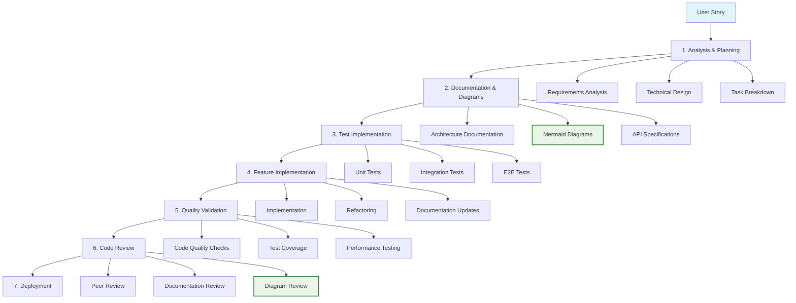
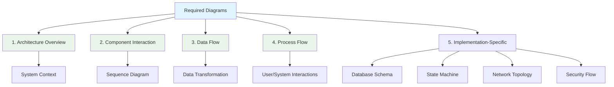
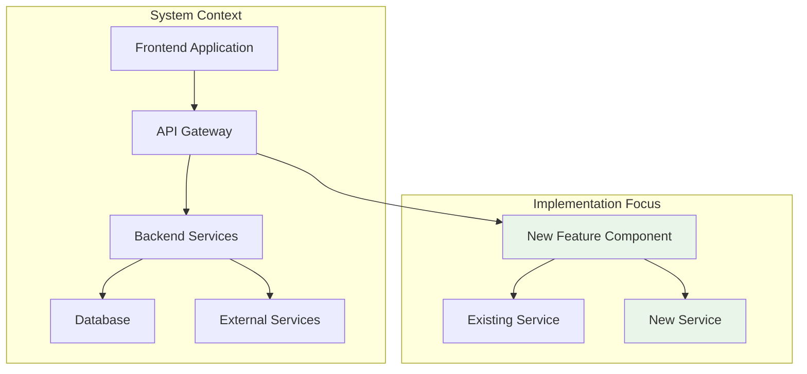
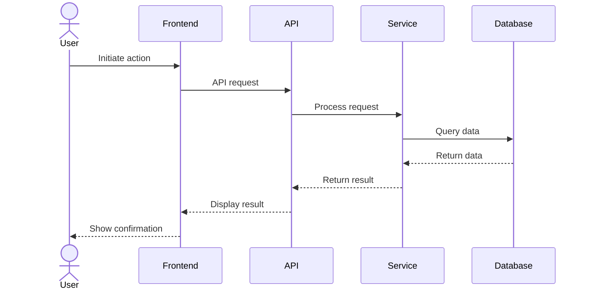
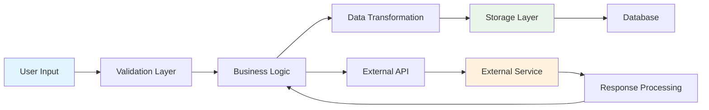
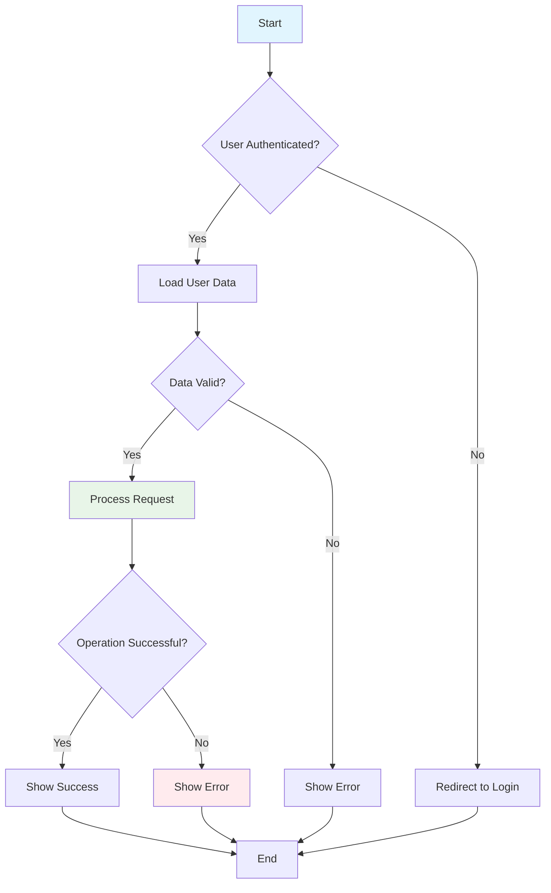
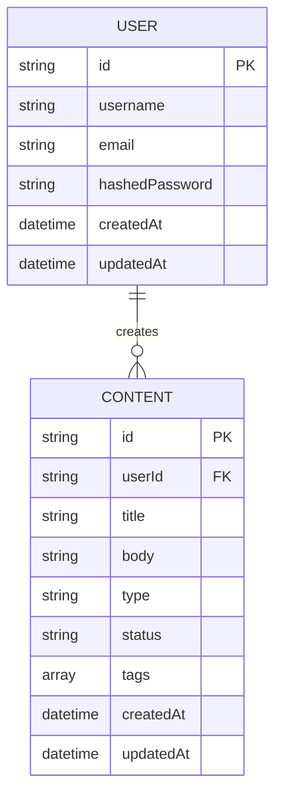
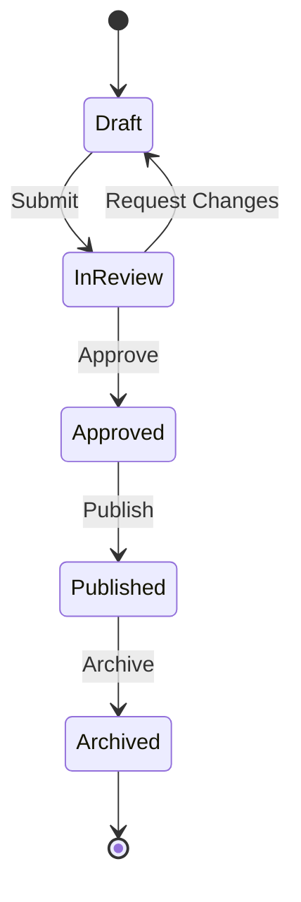
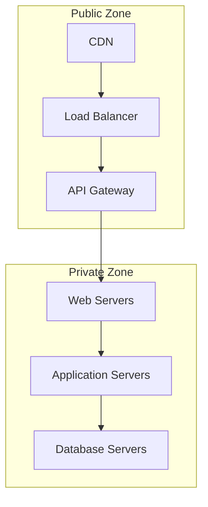
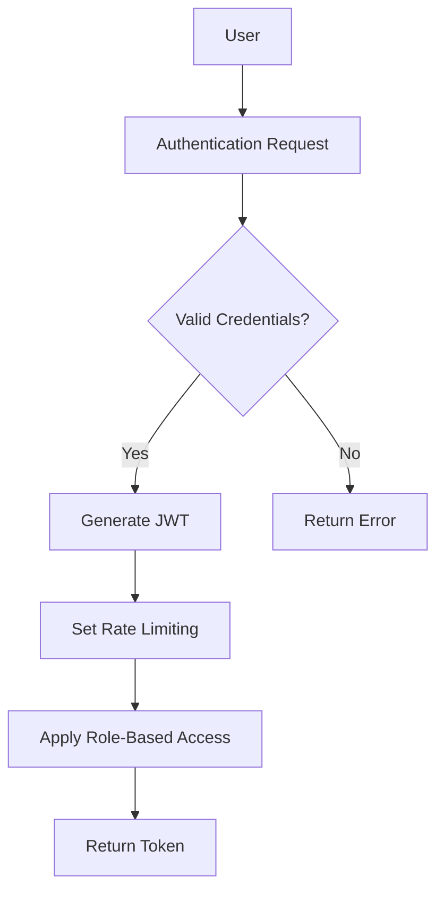

# 🚀 User Story Implementation Guide

## 📋 Overview

This document establishes the standard process for implementing user stories in Sovren, ensuring consistent, high-quality delivery with **comprehensive documentation**, **visual architecture representation**, and **elite engineering practices**. Every user story implementation MUST follow this guide to achieve legendary engineering status.

## 🎯 Implementation Philosophy

### Core Principles

- **Test-Driven Development**: Write tests before implementation code
- **Documentation-First**: Create documentation and diagrams before coding
- **Visual Architecture**: Every implementation MUST include Mermaid diagrams
- **Quality Gates**: All code must pass automated quality checks
- **Comprehensive Testing**: Unit, integration, E2E, security, accessibility

## 📊 Implementation Process



## 📝 Implementation Steps

### 1. Analysis & Planning

- **Requirements Analysis**:

  - Review user story acceptance criteria
  - Identify edge cases and potential issues
  - Clarify requirements with stakeholders

- **Technical Design**:

  - Determine architectural approach
  - Identify affected components
  - Plan integration with existing systems

- **Task Breakdown**:
  - Create detailed implementation tasks
  - Estimate effort for each task
  - Identify dependencies between tasks

### 2. Documentation & Diagrams

- **Architecture Documentation**:

  - Document architectural decisions
  - Create/update component documentation
  - Document API changes

- **Mermaid Diagrams** (MANDATORY):

  - Create architecture overview diagram
  - Create component interaction diagram
  - Create data flow diagram
  - Create process flow diagram
  - Create implementation-specific diagrams as needed

- **API Specifications**:
  - Define API contracts
  - Document request/response formats
  - Specify error handling

### 3. Test Implementation

- **Unit Tests**:

  - Write tests for individual components
  - Cover edge cases and error conditions
  - Ensure minimum 95% coverage

- **Integration Tests**:

  - Test component interactions
  - Verify API contracts
  - Test database operations

- **E2E Tests**:
  - Test complete user flows
  - Verify UI interactions
  - Test cross-browser compatibility

### 4. Feature Implementation

- **Implementation**:

  - Implement feature according to design
  - Follow clean code principles
  - Ensure security best practices

- **Refactoring**:

  - Improve code quality
  - Eliminate duplication
  - Optimize performance

- **Documentation Updates**:
  - Update user documentation
  - Update technical documentation
  - Update CHANGELOG

### 5. Quality Validation

- **Code Quality Checks**:

  - Run linting and formatting
  - Check for code smells
  - Verify coding standards

- **Test Coverage**:

  - Verify minimum coverage thresholds
  - Run all test suites
  - Fix failing tests

- **Performance Testing**:
  - Measure performance impact
  - Check for regressions
  - Optimize as needed

### 6. Code Review

- **Peer Review**:

  - Get code reviewed by peers
  - Address review comments
  - Verify implementation meets requirements

- **Documentation Review**:

  - Ensure documentation is complete
  - Verify documentation accuracy
  - Check for clarity and readability

- **Diagram Review**:
  - Verify all required diagrams are present
  - Ensure diagrams accurately represent implementation
  - Check diagram clarity and readability

### 7. Deployment

- **Feature Flag**:

  - Deploy behind feature flag
  - Test in production environment
  - Monitor for issues

- **Gradual Rollout**:

  - Release to subset of users
  - Collect feedback
  - Address issues

- **Full Deployment**:
  - Release to all users
  - Monitor performance
  - Document lessons learned

## 📊 Mandatory Mermaid Diagrams



### 1. Architecture Overview Diagram



**Purpose**: Illustrate where the implementation fits within the overall system architecture.

**Requirements**:

- Show the major components involved in the implementation
- Highlight new or modified components
- Show relationships between components

### 2. Component Interaction Diagram



**Purpose**: Show how components interact with each other during the execution of a feature.

**Requirements**:

- Use sequence diagrams to show the flow of interactions
- Include all components involved in the interaction
- Show the sequence of operations in chronological order

### 3. Data Flow Diagram



**Purpose**: Visualize how data flows through the system during the execution of a feature.

**Requirements**:

- Show the path of data through the system
- Include data transformation steps
- Show data storage points

### 4. Process Flow Diagram



**Purpose**: Provide a step-by-step visualization of the process flow, including decision points and error handling.

**Requirements**:

- Show the complete process flow from start to end
- Include all decision points with clear conditions
- Show error handling paths

### 5. Implementation-Specific Diagrams

Depending on the nature of the implementation, additional diagrams may be required:

#### Database Schema Diagram (for data model changes)



#### State Machine Diagram (for complex state management)



#### Network Topology Diagram (for infrastructure changes)



#### Security Flow Diagram (for authentication/authorization features)



## 📝 Documentation Requirements

### User Story Documentation Template

```markdown
# User Story: [US-XXX] - [User Story Title]

## Overview

[Brief description of the user story]

## Acceptance Criteria

- [Criterion 1]
- [Criterion 2]
- [Criterion 3]

## Technical Implementation

### Architecture Overview

[Architecture overview diagram]

### Component Interaction

[Component interaction diagram]

### Data Flow

[Data flow diagram]

### Process Flow

[Process flow diagram]

### Implementation Details

[Detailed description of implementation]

## Testing Strategy

- **Unit Tests**: [Description of unit tests]
- **Integration Tests**: [Description of integration tests]
- **E2E Tests**: [Description of E2E tests]

## Deployment Strategy

- **Feature Flag**: [Feature flag details]
- **Rollout Plan**: [Rollout strategy]
- **Monitoring**: [Monitoring approach]
```

### CHANGELOG Entry Template

```markdown
## [Version] - [Date]

### Added

- [US-XXX] [Brief description of new feature]

### Changed

- [US-XXX] [Brief description of changes to existing functionality]

### Fixed

- [US-XXX] [Brief description of bug fixes]
```

## 🔍 Quality Checklist

### Implementation Checklist

- [ ] Requirements fully understood and clarified
- [ ] Technical design documented
- [ ] All required Mermaid diagrams created
- [ ] Tests written for all functionality
- [ ] Code follows project standards
- [ ] Documentation complete and accurate
- [ ] CHANGELOG updated
- [ ] All quality gates passed
- [ ] Code reviewed and approved
- [ ] Feature flagged for controlled deployment

### Diagram Checklist

- [ ] Architecture Overview Diagram present and accurate
- [ ] Component Interaction Diagram present and accurate
- [ ] Data Flow Diagram present and accurate
- [ ] Process Flow Diagram present and accurate
- [ ] Implementation-Specific Diagrams present as needed
- [ ] Diagrams follow project styling standards
- [ ] Diagrams are clear and readable
- [ ] Diagrams accurately represent the implementation

## 🏆 Elite Implementation Status

Implementation achieves **Elite Status** when:

✅ **All acceptance criteria met** with no compromises
✅ **Test coverage exceeds 95%** for the implementation
✅ **All required Mermaid diagrams** are present and follow standards
✅ **Documentation is complete** and up-to-date
✅ **Code quality** meets or exceeds project standards
✅ **All quality gates passed** with no exceptions

---

**MANDATORY REQUIREMENT**: Every user story implementation MUST include all required Mermaid diagrams to achieve elite engineering status. No exceptions.
