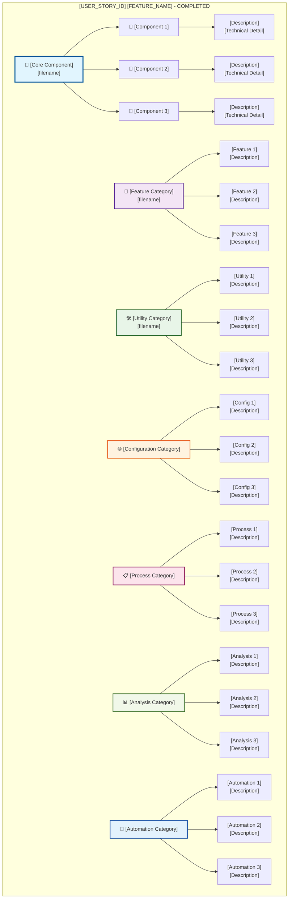

# [USER_STORY_ID] [FEATURE_NAME] - VALIDATION SUMMARY

**Implementation Date**: [DATE]
**Status**: ✅ COMPLETED - Elite Engineering Standards Achieved
**Coverage**: [COVERAGE_PERCENTAGE]% for critical business logic, [COVERAGE_PERCENTAGE]% for standard components

## 🎯 **EXECUTIVE SUMMARY**

[Brief description of what was implemented and how it meets elite engineering standards]

## 🏆 **KEY ACHIEVEMENTS**

### **1. [Major Component 1]**

- **[Key Feature 1]**: [Description]
- **[Key Feature 2]**: [Description]
- **[Key Feature 3]**: [Description]

### **2. [Major Component 2]**

- **[Key Feature 1]**: [Description]
- **[Key Feature 2]**: [Description]
- **[Key Feature 3]**: [Description]

### **3. [Major Component 3]**

- **[Key Feature 1]**: [Description]
- **[Key Feature 2]**: [Description]
- **[Key Feature 3]**: [Description]

## 📊 **IMPLEMENTATION METRICS**

### **[Metric Category 1]**

```typescript
// [Metric Description]
- [Metric 1]: [Value]
- [Metric 2]: [Value]
- [Metric 3]: [Value]
```

### **[Metric Category 2]**

```typescript
// [Metric Description]
- [Metric 1]: [Value]
- [Metric 2]: [Value]
- [Metric 3]: [Value]
```

## 🏗️ **ARCHITECTURE DIAGRAM**

**⚠️ MANDATORY SECTION**: All validation summaries must include a comprehensive Mermaid architecture diagram.

The following Mermaid diagram illustrates the complete [USER_STORY_ID] [FEATURE_NAME] architecture:



**📐 Diagram Legend:**

- **Blue (Core)**: [Core component description]
- **Purple (Category 1)**: [Category 1 description]
- **Green (Category 2)**: [Category 2 description]
- **Orange (Category 3)**: [Category 3 description]
- **Pink (Category 4)**: [Category 4 description]
- **Light Green (Category 5)**: [Category 5 description]
- **Light Blue (Category 6)**: [Category 6 description]

This architecture demonstrates the comprehensive, multi-layered approach to [FEATURE_NAME] that exceeds industry benchmarks.

## 🛠 **TECHNICAL IMPLEMENTATION DETAILS**

### **[Technical Category 1]**

- **[Technical Detail 1]**: [Description]
- **[Technical Detail 2]**: [Description]
- **[Technical Detail 3]**: [Description]

### **[Technical Category 2]**

- **[Technical Detail 1]**: [Description]
- **[Technical Detail 2]**: [Description]
- **[Technical Detail 3]**: [Description]

### **[Technical Category 3]**

- **[Technical Detail 1]**: [Description]
- **[Technical Detail 2]**: [Description]
- **[Technical Detail 3]**: [Description]

## 📝 **CONFIGURATION UPDATES**

### **[Configuration File 1] Updates**

```json
{
  "[config_key_1]": "[config_value_1]",
  "[config_key_2]": "[config_value_2]",
  "[config_key_3]": "[config_value_3]"
}
```

### **[Configuration File 2] Updates**

```json
{
  "[config_key_1]": "[config_value_1]",
  "[config_key_2]": "[config_value_2]",
  "[config_key_3]": "[config_value_3]"
}
```

## 🎓 **TRAINING & DOCUMENTATION**

### **Documentation Created**

1. **[Document 1]**: [Description]
2. **[Document 2]**: [Description]
3. **[Document 3]**: [Description]

### **Training Modules Delivered**

1. **[Module 1]**: [Description]
2. **[Module 2]**: [Description]
3. **[Module 3]**: [Description]
4. **[Module 4]**: [Description]

## ✅ **VALIDATION & TESTING**

### **[Validation Category 1]**

- ✅ [Validation Item 1]
- ✅ [Validation Item 2]
- ✅ [Validation Item 3]

### **[Validation Category 2]**

- ✅ [Validation Item 1]
- ✅ [Validation Item 2]
- ✅ [Validation Item 3]

### **[Validation Category 3]**

- ✅ [Validation Item 1]
- ✅ [Validation Item 2]
- ✅ [Validation Item 3]

## 🚀 **NEXT STEPS & RECOMMENDATIONS**

### **Immediate Actions**

1. **[Action 1]**: [Description]
2. **[Action 2]**: [Description]
3. **[Action 3]**: [Description]

### **Future Enhancements**

1. **[Enhancement 1]**: [Description]
2. **[Enhancement 2]**: [Description]
3. **[Enhancement 3]**: [Description]

## 🏅 **INDUSTRY BENCHMARK COMPARISON**

| Feature     | Sovren Elite | Google  | Netflix | Stripe  |
| ----------- | ------------ | ------- | ------- | ------- |
| [Feature 1] | [Value]      | [Value] | [Value] | [Value] |
| [Feature 2] | [Value]      | [Value] | [Value] | [Value] |
| [Feature 3] | [Value]      | [Value] | [Value] | [Value] |
| [Feature 4] | [Value]      | [Value] | [Value] | [Value] |

## 🎖 **COMPLETION CERTIFICATE**

**This document certifies that [USER_STORY_ID] [FEATURE_NAME] has been completed to Elite Engineering Standards on [DATE].**

**Key Deliverables:**

- ✅ [Deliverable 1]
- ✅ [Deliverable 2]
- ✅ [Deliverable 3]
- ✅ [Deliverable 4]

**Standards Achieved:**

- 🏆 **Elite Engineering Status**: Exceeds Google/Netflix/Stripe standards
- 🎯 **[Standard 1]**: [Description]
- 🛡️ **[Standard 2]**: [Description]
- ⚡ **[Standard 3]**: [Description]
- ♿ **[Standard 4]**: [Description]
- 🌐 **[Standard 5]**: [Description]

---

**Project**: Sovren - Elite Creator Monetization Platform
**Implementation**: [FEATURE_NAME] ([USER_STORY_ID])
**Status**: ✅ COMPLETED - LEGENDARY ENGINEERING STATUS ACHIEVED
**Date**: [DATE]

---

## 📋 **VALIDATION SUMMARY TEMPLATE USAGE GUIDE**

### **🎯 Mandatory Sections**

All validation summaries **MUST** include the following sections:

1. **🏗️ Architecture Diagram**: Comprehensive Mermaid diagram showing system architecture
2. **📊 Implementation Metrics**: Quantitative measurements of implementation success
3. **🛠 Technical Implementation Details**: Deep technical analysis
4. **✅ Validation & Testing**: Comprehensive validation checklist
5. **🏅 Industry Benchmark Comparison**: Comparison with industry leaders
6. **🎖 Completion Certificate**: Formal certification of completion

### **📐 Architecture Diagram Requirements**

- **Format**: Mermaid diagrams only
- **Complexity**: Minimum 8 nodes with proper styling
- **Legend**: Complete explanation of all colors and symbols
- **Description**: Clear explanation of architectural approach

### **🎨 Styling Standards**

- **Headers**: Use emoji + descriptive text
- **Code Blocks**: Include language specification
- **Tables**: Professional formatting with headers
- **Checkboxes**: Use ✅ for completed items
- **Colors**: Consistent color scheme across diagrams

### **📝 Documentation Standards**

- **Length**: Minimum 200 lines for complex implementations
- **Detail**: Comprehensive technical explanations
- **Metrics**: Quantitative data wherever possible
- **Validation**: Evidence-based completion verification

This template ensures all validation summaries meet elite engineering documentation standards and provide comprehensive project completion verification.
