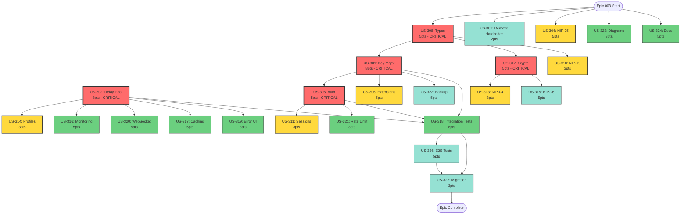

# Epic 003: NOSTR Consolidation - Execution Plan

## Executive Summary

Epic 003 will consolidate 177+ files containing NOSTR code into unified services, reducing duplication by 60% and establishing a single source of truth for all NOSTR operations. The epic contains 26 stories (110 points) organized into 5 parallel work streams.

## Agent Assignments & Work Streams

### 🔴 IMMEDIATE START (Day 1, Morning)

#### Stream A: Backend NOSTR Services

**Agent**: `backend-api-builder`
**Stories**: US-301, US-305, US-304, US-311, US-321
**Start**: IMMEDIATE

```bash
# Agent Instructions for backend-api-builder
1. START with US-308 (Types) - Critical dependency for all
2. Then US-301 (Key Management) - Blocks 5+ other stories
3. Then US-305 (Authentication) - Blocks sessions & rate limiting
4. Parallel: US-304 (NIP-05) can run independently
```

#### Stream B: Frontend NOSTR Components

**Agent**: `elite-frontend-dev`
**Stories**: US-302, US-306, US-314, US-317, US-319
**Start**: IMMEDIATE

```bash
# Agent Instructions for elite-frontend-dev
1. START with US-302 (Relay Pool) - Critical for all frontend
2. Then US-306 (Extensions) after US-301 completes
3. Then US-314 (Profiles) depends on relay pool
4. Parallel: US-319 (Error UI) can start anytime
```

#### Stream C: Shared Types & Utilities

**Agent**: `backend-api-builder` (same agent, parallel work)
**Stories**: US-308, US-310, US-312, US-313, US-315, US-309
**Start**: IMMEDIATE (US-308 first!)

```bash
# Agent Instructions for backend-api-builder
PRIORITY 1: US-308 (Types) - MUST complete first!
Then parallel:
- US-312 (Crypto)
- US-310 (NIP-19)
- US-309 (Remove hardcoded)
```

#### Stream D: Documentation

**Agent**: `technical-docs-writer`
**Stories**: US-323, US-324
**Start**: IMMEDIATE (diagrams can start now)

```bash
# Agent Instructions for technical-docs-writer
1. START with US-323 (Mermaid diagrams) immediately
2. Begin US-324 (Developer docs) in parallel
3. Update docs as implementation progresses
```

### 🟡 START AFTER DEPENDENCIES (Day 2-3)

#### Stream D: Testing

**Agent**: `test-automation-engineer`
**Stories**: US-318, US-326
**Start**: After US-301, US-302, US-305 complete

```bash
# Agent Instructions for test-automation-engineer
1. WAIT for core services (301, 302, 305)
2. START US-318 (Integration tests)
3. Then US-326 (E2E tests)
```

#### Stream E: Monitoring & Migration

**Agent**: `backend-api-builder`
**Stories**: US-316, US-320, US-322, US-325
**Start**: After core services complete

```bash
# Agent Instructions for backend-api-builder
After core work:
1. US-320 (WebSocket manager)
2. US-316 (Monitoring)
3. US-322 (Backup)
4. US-325 (Migration) - LAST
```

## Dependency Graph & Critical Path



## Parallel Execution Timeline

### Day 1 (Monday)

**Morning (4 stories start)**

- 🔴 US-308: Types (backend-api-builder) - CRITICAL START
- 🔴 US-302: Relay Pool (elite-frontend-dev) - CRITICAL START
- 🟢 US-323: Diagrams (technical-docs-writer)
- 🟢 US-309: Remove Hardcoded (backend-api-builder)

**Afternoon (2 stories start)**

- 🔴 US-301: Key Management (backend-api-builder) - After US-308
- 🟢 US-304: NIP-05 (backend-api-builder) - Independent

### Day 2 (Tuesday)

**Morning (4 stories start)**

- 🔴 US-312: Crypto (backend-api-builder) - After US-308
- 🟡 US-305: Auth (backend-api-builder) - After US-301
- 🟡 US-306: Extensions (elite-frontend-dev) - After US-301
- 🟢 US-310: NIP-19 (backend-api-builder) - After US-308

**Afternoon (3 stories start)**

- 🟡 US-314: Profiles (elite-frontend-dev) - After US-302
- 🟢 US-319: Error UI (elite-frontend-dev) - Independent
- 🟢 US-324: Documentation (technical-docs-writer) - Ongoing

### Day 3 (Wednesday)

**Morning (5 stories start)**

- 🟡 US-311: Sessions (backend-api-builder) - After US-305
- 🟡 US-313: NIP-04 (backend-api-builder) - After US-312
- 🟡 US-317: Caching (elite-frontend-dev) - After US-302, US-314
- 🟡 US-320: WebSocket (backend-api-builder) - After US-302
- 🔴 US-318: Integration Tests (test-automation-engineer) - Critical

**Afternoon (3 stories start)**

- 🟢 US-316: Monitoring (backend-api-builder) - After US-302
- 🟢 US-321: Rate Limiting (backend-api-builder) - After US-305
- 🟢 US-322: Backup (backend-api-builder) - After US-301

### Day 4 (Thursday)

**Morning (2 stories start)**

- 🟡 US-326: E2E Tests (test-automation-engineer) - After US-318
- 🟢 US-315: NIP-26 (backend-api-builder) - After US-312

**Afternoon**

- Complete remaining stories
- Begin integration testing
- Start migration script development

### Day 5 (Friday)

**Morning**

- 🔴 US-325: Migration Scripts (backend-api-builder) - FINAL
- Complete all testing
- Final documentation updates

**Afternoon**

- Epic validation
- Quality gate verification
- Deployment preparation

## Communication Protocol

### Daily Sync Points

- **09:00**: Morning standup - blockers & priorities
- **13:00**: Midday check - dependency updates
- **17:00**: EOD sync - completions & handoffs

### Agent Communication Format

```json
{
  "from": "orchestrator",
  "to": "backend-api-builder",
  "action": "START_STORY",
  "story": "US-308",
  "priority": "CRITICAL",
  "dependencies": [],
  "deliverables": [
    "Complete NOSTR type definitions",
    "Zod schemas for validation",
    "Type migration guide"
  ],
  "acceptance_criteria": "See story definition",
  "deadline": "Day 1, 14:00"
}
```

### Progress Reporting

```json
{
  "from": "backend-api-builder",
  "to": "orchestrator",
  "story": "US-308",
  "status": "IN_PROGRESS",
  "percent_complete": 75,
  "blockers": [],
  "eta": "2 hours",
  "completed_tasks": ["Base type definitions", "Zod schemas"],
  "remaining_tasks": ["Migration guide"]
}
```

## Quality Gates

### Story Completion Criteria

- ✅ Code implementation complete
- ✅ Unit tests written (95%+ coverage)
- ✅ Integration tests passing
- ✅ Documentation updated
- ✅ Mermaid diagrams created (if applicable)
- ✅ CHANGELOG.md updated
- ✅ Code review approved
- ✅ No ESLint/TypeScript errors

### Epic Completion Criteria

- ✅ All 26 stories complete
- ✅ 60%+ code reduction achieved
- ✅ Zero duplicate implementations
- ✅ 95%+ test coverage
- ✅ All NIPs implemented
- ✅ Migration scripts tested
- ✅ Documentation complete
- ✅ Performance benchmarks met

## Risk Mitigation

### Risk 1: Dependency Delays

**Impact**: Critical path blocked
**Mitigation**:

- US-308 gets 2x resources if needed
- Parallel work on independent stories
- Daily dependency review at 13:00

### Risk 2: Integration Failures

**Impact**: Rework required
**Mitigation**:

- Continuous integration testing
- Feature flags for gradual rollout
- Backward compatibility layer

### Risk 3: Agent Availability

**Impact**: Story delays
**Mitigation**:

- Cross-training on critical components
- Clear handoff documentation
- Backup agent assignments ready

## Success Metrics

### Daily Metrics

- Stories started/completed
- Story points burned
- Blockers identified/resolved
- Test coverage trend
- Code reduction percentage

### Epic Metrics

- Total cycle time: 5 days target
- Code reduction: 60% target
- Test coverage: 95% target
- Zero duplication: 100% target
- Performance: <100ms operations

## Next Actions (IMMEDIATE)

1. ✅ **Deploy this execution plan** to all agents
2. ⏳ **Start US-308** with backend-api-builder (CRITICAL)
3. ⏳ **Start US-302** with elite-frontend-dev (CRITICAL)
4. ⏳ **Start US-323** with technical-docs-writer
5. ⏳ **Start US-309** with backend-api-builder
6. ⏳ **Set up daily sync schedule**
7. ⏳ **Initialize progress tracking dashboard**

---

**Epic Owner**: Project Orchestration Agent
**Start Date**: 2025-10-26 (Day 6 of refactoring initiative)
**Target Completion**: 2025-10-30 (Day 10)
**Total Story Points**: 110
**Total Stories**: 26
**Assigned Agents**: 4
