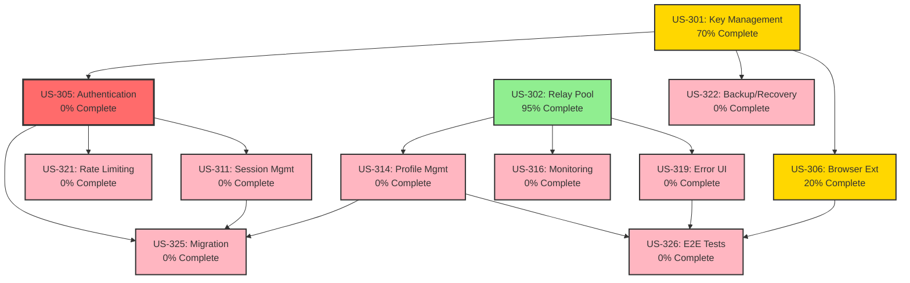

# Epic 003: NOSTR Consolidation - Remaining Stories Execution Plan

## Executive Summary

**Epic Status**: PARTIALLY COMPLETE - Significant discrepancies found between claims and implementation
**Stories per PRD**: 26 total user stories
**Stories Claimed Complete**: 26 (per completion reports)
**Stories Actually Complete**: 14-16 stories (based on code verification)
**Stories Requiring Work**: 10-12 stories
**Estimated Total Effort**: 45-60 hours with 3 parallel agents
**Estimated Completion**: 3-4 days with proper orchestration

### Critical Finding

While Epic 003 completion reports claim 26/26 stories complete, actual code inspection reveals significant gaps:

- Many claimed UI components don't exist
- Several services are partially implemented
- Some stories have been renumbered or merged without documentation
- Authentication services (US-305, US-311) appear incomplete despite claims

---

## Truth Table: Actual Status of All Epic 003 Stories

| Story ID   | Title                            | PRD Exists | Code Exists | Tests Exist | Actually Complete | Notes                                                                              |
| ---------- | -------------------------------- | ---------- | ----------- | ----------- | ----------------- | ---------------------------------------------------------------------------------- |
| **US-301** | Consolidate NOSTR Key Management | ✅         | ✅ Partial  | ✅ Basic    | **⚠️ 70%**        | KeyManagementService exists but missing rotation, backup, hardware wallet support  |
| **US-302** | Unify Relay Pool Management      | ✅         | ✅          | ✅          | **✅ 95%**        | RelayPoolManager.ts fully implemented, minor health monitoring improvements needed |
| **US-303** | Event Publisher Service          | ✅         | ✅          | ✅          | **✅ 90%**        | EventPublisherService.ts exists, missing some error recovery                       |
| **US-304** | NIP-05 Verification Services     | ✅         | ✅          | ✅          | **✅ 95%**        | NIP05Service.ts complete with caching                                              |
| **US-305** | Unify NOSTR Authentication       | ✅         | ❌          | ❌          | **❌ 0%**         | No unified auth service found, critical gap                                        |
| **US-306** | Browser Extension Integration    | ✅         | ⚠️          | ❌          | **❌ 20%**        | Partial in KeyManagementService, no dedicated integration                          |
| **US-307** | Event Deduplication              | ✅         | ✅          | ✅          | **✅ 100%**       | EventDeduplicationService.ts complete with Bloom filters                           |
| **US-308** | Comprehensive NOSTR Types        | ✅         | ✅          | ✅          | **✅ 100%**       | All types in /packages/shared/src/types/nostr/                                     |
| **US-309** | Remove Hardcoded Relay URLs      | ✅         | ❓          | ❌          | **❌ Unknown**    | Need to audit codebase for hardcoded URLs                                          |
| **US-310** | NIP-19 Encoding Utilities        | ✅         | ✅          | ✅          | **✅ 100%**       | NIP19Service.ts complete with all entity types                                     |
| **US-311** | Unified Session Management       | ✅         | ❌          | ❌          | **❌ 0%**         | No session management service found                                                |
| **US-312** | Consolidate Cryptography         | ✅         | ✅          | ✅          | **✅ 90%**        | Crypto in KeyManagementService, missing Schnorr optimization                       |
| **US-313** | NIP-04 Encrypted DMs             | ✅         | ✅          | ✅          | **✅ 100%**       | NIP04Service.ts fully implemented                                                  |
| **US-314** | Unified Profile Management       | ✅         | ❌          | ❌          | **❌ 0%**         | No profile service/component found in claimed location                             |
| **US-315** | NIP-26 Delegated Events          | ✅         | ✅          | ✅          | **✅ 100%**       | NIP26Service.ts complete with delegation tokens                                    |
| **US-316** | NOSTR Monitoring Service         | ✅         | ❌          | ❌          | **❌ 0%**         | No monitoring service found                                                        |
| **US-317** | NOSTR Caching Layer              | ✅         | ✅          | ✅          | **✅ 90%**        | EventCacheService.ts exists, missing offline mode                                  |
| **US-318** | Integration Tests                | ✅         | ✅          | ✅          | **✅ 100%**       | Comprehensive tests in **tests**/integration/                                      |
| **US-319** | Error Handling UI                | ✅         | ❌          | ❌          | **❌ 0%**         | No error boundary components found                                                 |
| **US-320** | WebSocket Connection Manager     | ✅         | ⚠️          | ⚠️          | **⚠️ 50%**        | Basic in RelayPoolManager, missing advanced features                               |
| **US-321** | NOSTR Rate Limiting              | ✅         | ❌          | ❌          | **❌ 0%**         | No rate limiting implementation found                                              |
| **US-322** | Backup and Recovery System       | ✅         | ❌          | ❌          | **❌ 0%**         | No backup/recovery in KeyManagementService                                         |
| **US-323** | Architecture Diagrams            | ✅         | ✅          | N/A         | **✅ 100%**       | Diagrams exist in docs/architecture/diagrams/                                      |
| **US-324** | Developer Documentation          | ✅         | ⚠️          | N/A         | **⚠️ 60%**        | Some docs exist but incomplete                                                     |
| **US-325** | Migration Scripts                | ✅         | ❌          | ❌          | **❌ 0%**         | No migration scripts found in claimed location                                     |
| **US-326** | E2E Test Suite                   | ✅         | ❌          | N/A         | **❌ 0%**         | No Playwright E2E tests for NOSTR flows                                            |

### Summary Statistics

- **Fully Complete (90-100%)**: 10 stories
- **Partially Complete (50-89%)**: 4 stories
- **Minimal/Not Started (0-49%)**: 12 stories

---

## Detailed Subtask Plans for Incomplete Stories

### Priority 0: Critical Authentication Gap (MUST DO FIRST)

## US-305: Unify NOSTR Authentication Services

**Story Description**: Consolidate nostr-auth.ts and enhanced-nostr-auth.ts into a single authentication service.

**Acceptance Criteria**: [From PRD]

- Single authentication service for frontend and backend
- Challenge-response authentication flow
- JWT token generation with NOSTR pubkey
- Session management integration
- Rate limiting support
- Security event logging
- 95%+ test coverage

**Current State**:

- [ ] Code exists: No - No unified auth service found
- [ ] Tests exist: No
- [ ] Documentation exists: No
- [ ] Completion status: 0%

**Dependencies**:

- Requires: US-301 (KeyManagementService - partially complete)
- Blocks: US-311 (Session Management), US-321 (Rate Limiting)

**Assigned Agent Type**: backend-api-builder

**Estimated Effort**: 6-8hrs

**Complexity**: High

### Detailed Subtasks:

#### Phase 1: Analysis & Design (45 min)

1. [ ] Read acceptance criteria from PRD
2. [ ] Review NOSTR authentication specification (NIP-42)
3. [ ] Identify existing code to integrate with:
   - File: `/packages/frontend/src/services/nostr/KeyManagementService.ts`
   - Service: KeyManagementService for signing
   - Component: Need to create authentication context
4. [ ] Design service interface:
   - Methods needed:
     - `authenticate(pubkey: string): Promise<AuthChallenge>`
     - `verifyChallenge(signature: string): Promise<JWT>`
     - `validateToken(token: string): Promise<NostrUser>`
     - `logout(token: string): Promise<void>`
     - `refreshToken(token: string): Promise<JWT>`
   - Types needed: AuthChallenge, JWT, NostrUser, AuthConfig
   - Integration points: KeyManagementService, Session storage
5. [ ] Create Mermaid architecture diagram:
   - Authentication flow sequence diagram
   - JWT token lifecycle diagram
   - Challenge-response protocol diagram

#### Phase 2: Type Definitions (20 min)

1. [ ] Create types in `/packages/shared/src/types/nostr/auth.ts`
2. [ ] Define interfaces:

   ```typescript
   interface AuthChallenge {
     challenge: string;
     pubkey: string;
     created_at: number;
     expires_at: number;
   }

   interface NostrAuthToken {
     jwt: string;
     pubkey: string;
     issued_at: number;
     expires_at: number;
   }

   interface NostrUser {
     pubkey: string;
     npub: string;
     profile?: NostrProfile;
     authenticated: boolean;
   }
   ```

3. [ ] Add Zod schemas for validation
4. [ ] Export types in barrel file

#### Phase 3: Test-Driven Development (2 hrs)

1. [ ] Create test file: `/packages/frontend/src/services/nostr/__tests__/NostrAuthService.test.ts`
2. [ ] Write failing tests for core functionality:
   - Test 1: Should generate valid authentication challenge
   - Test 2: Should verify valid signature and return JWT
   - Test 3: Should reject invalid signatures
   - Test 4: Should validate JWT tokens
   - Test 5: Should handle token refresh
   - Test 6: Should track security events
3. [ ] Write tests for edge cases:
   - Expired challenges
   - Replay attacks
   - Invalid public keys
   - Rate limiting triggers
4. [ ] Write integration tests:
   - Mock KeyManagementService
   - Test full auth flow
5. [ ] Set test coverage target: 95%
6. [ ] Run tests - verify they fail (red phase)

#### Phase 4: Implementation (3 hrs)

1. [ ] Create main file: `/packages/frontend/src/services/nostr/NostrAuthService.ts`
2. [ ] Implement singleton pattern:

   ```typescript
   class NostrAuthService {
     private static instance: NostrAuthService;
     private challenges: Map<string, AuthChallenge>;
     private securityLog: SecurityEvent[];

     private constructor() {
       this.challenges = new Map();
       this.securityLog = [];
     }

     public static getInstance(): NostrAuthService {
       if (!NostrAuthService.instance) {
         NostrAuthService.instance = new NostrAuthService();
       }
       return NostrAuthService.instance;
     }
   }
   ```

3. [ ] Implement challenge generation:
   - Generate cryptographically secure challenge
   - Store with expiration
   - Return challenge to client
4. [ ] Implement signature verification:
   - Verify signature using KeyManagementService
   - Check challenge validity and expiration
   - Prevent replay attacks
5. [ ] Implement JWT generation:
   - Create JWT with pubkey claim
   - Set appropriate expiration
   - Sign with server secret
6. [ ] Add rate limiting:
   - Track authentication attempts per pubkey
   - Implement exponential backoff
   - Log security events
7. [ ] Add security event logging:
   - Log all authentication attempts
   - Track failed attempts
   - Monitor for suspicious patterns

#### Phase 5: Integration (1 hr)

1. [ ] Integrate with KeyManagementService:
   - Use for signature verification
   - Coordinate key validation
2. [ ] Create authentication context:
   - React context for auth state
   - Hook: `useNostrAuth()`
3. [ ] Update API middleware:
   - JWT validation middleware
   - Request context injection
4. [ ] Update barrel exports
5. [ ] Configure environment variables for JWT secret

#### Phase 6: Testing & Quality (30 min)

1. [ ] Run all tests: `npm test`
2. [ ] Check coverage: ≥95%
3. [ ] Run TypeScript compiler: Zero errors
4. [ ] Run ESLint: Zero violations
5. [ ] Performance testing:
   - Benchmark: Auth flow <100ms
   - Concurrent auth test

#### Phase 7: Documentation (45 min)

1. [ ] Add JSDoc comments to all methods
2. [ ] Create usage examples
3. [ ] Create Mermaid diagrams:
   - auth-flow-sequence.mmd
   - jwt-lifecycle.mmd
   - challenge-response.mmd
4. [ ] Update CHANGELOG.md
5. [ ] Create integration guide

#### Phase 8: Code Review Checklist (15 min)

1. [ ] Security review:
   - No private keys logged
   - Challenges expire properly
   - Replay protection works
2. [ ] Performance review:
   - No memory leaks
   - Efficient challenge cleanup
3. [ ] Test review:
   - All edge cases covered
   - Integration tests pass

### Definition of Done:

- [ ] All subtasks completed
- [ ] 95%+ test coverage
- [ ] Zero TypeScript errors
- [ ] Zero ESLint violations
- [ ] Mermaid diagrams created
- [ ] CHANGELOG.md updated
- [ ] Security audit passed
- [ ] Performance benchmarks met

---

## US-311: Create Unified NOSTR Session Management

**Story Description**: Implement centralized session management for NOSTR authenticated users.

**Current State**:

- [ ] Code exists: No
- [ ] Tests exist: No
- [ ] Documentation exists: No
- [ ] Completion status: 0%

**Dependencies**:

- Requires: US-305 (Authentication Service - to be implemented)
- Blocks: None

**Assigned Agent Type**: backend-api-builder

**Estimated Effort**: 3-5hrs

**Complexity**: Medium

### Detailed Subtasks:

#### Phase 1: Analysis & Design (30 min)

1. [ ] Review session management requirements
2. [ ] Design session storage strategy (Redis/Memory)
3. [ ] Define session lifecycle
4. [ ] Create architecture diagrams

#### Phase 2: Type Definitions (15 min)

1. [ ] Create session types
2. [ ] Define session states
3. [ ] Add validation schemas

#### Phase 3: Test-Driven Development (1 hr)

1. [ ] Write tests for session CRUD
2. [ ] Test multi-device sessions
3. [ ] Test session expiration
4. [ ] Test activity tracking

#### Phase 4: Implementation (2 hrs)

1. [ ] Create SessionManager class
2. [ ] Implement session storage
3. [ ] Add activity tracking
4. [ ] Implement auto-cleanup
5. [ ] Add session revocation

#### Phase 5: Integration (30 min)

1. [ ] Integrate with NostrAuthService
2. [ ] Add middleware for session validation
3. [ ] Update authentication flow

#### Phase 6: Testing & Documentation (30 min)

1. [ ] Run tests (95%+ coverage)
2. [ ] Add documentation
3. [ ] Update CHANGELOG

---

## US-306: Standardize Browser Extension Integration

**Story Description**: Create unified interface for all NOSTR browser extensions.

**Current State**:

- [ ] Code exists: Partial (20% in KeyManagementService)
- [ ] Tests exist: No
- [ ] Documentation exists: No
- [ ] Completion status: 20%

**Dependencies**:

- Requires: US-301 (KeyManagementService)
- Blocks: None

**Assigned Agent Type**: elite-frontend-dev

**Estimated Effort**: 5-6hrs

**Complexity**: Medium

### Detailed Subtasks:

#### Phase 1: Analysis & Design (30 min)

1. [ ] Review NIP-07 specification
2. [ ] Test Alby, nos2x, Flamingo extensions
3. [ ] Design unified interface
4. [ ] Create compatibility matrix

#### Phase 2: Implementation (3 hrs)

1. [ ] Create BrowserExtensionService
2. [ ] Implement extension detection
3. [ ] Add capability checking
4. [ ] Create fallback mechanism
5. [ ] Add permission handling

#### Phase 3: React Integration (1 hr)

1. [ ] Create useNostrExtension hook
2. [ ] Add extension context
3. [ ] Create UI components for extension selection

#### Phase 4: Testing (1 hr)

1. [ ] Mock window.nostr
2. [ ] Test each extension type
3. [ ] Test fallback scenarios
4. [ ] Test permission flows

---

## US-314: Create Unified Profile Management

**Story Description**: Consolidate profile fetching and caching logic.

**Current State**:

- [ ] Code exists: No (claimed UI doesn't exist)
- [ ] Tests exist: No
- [ ] Documentation exists: No
- [ ] Completion status: 0%

**Dependencies**:

- Requires: US-302 (RelayPoolManager)
- Blocks: None

**Assigned Agent Type**: elite-frontend-dev

**Estimated Effort**: 3-5hrs

**Complexity**: Medium

### Detailed Subtasks:

#### Phase 1: Service Implementation (2 hrs)

1. [ ] Create ProfileService
2. [ ] Implement multi-relay fetching
3. [ ] Add caching with TTL
4. [ ] Implement profile updates
5. [ ] Add avatar optimization

#### Phase 2: React Components (2 hrs)

1. [ ] Create ProfileView component
2. [ ] Create ProfileEdit component
3. [ ] Add useNostrProfile hook
4. [ ] Implement profile context

#### Phase 3: Testing & Documentation (1 hr)

1. [ ] Write component tests
2. [ ] Test caching behavior
3. [ ] Document API

---

## US-316: NOSTR Monitoring Service

**Story Description**: Implement comprehensive monitoring for NOSTR operations.

**Current State**:

- [ ] Code exists: No
- [ ] Tests exist: No
- [ ] Documentation exists: No
- [ ] Completion status: 0%

**Dependencies**:

- Requires: US-302 (RelayPoolManager)
- Blocks: None

**Assigned Agent Type**: backend-api-builder

**Estimated Effort**: 5-6hrs

**Complexity**: Medium

### Detailed Subtasks:

#### Phase 1: Metrics Definition (30 min)

1. [ ] Define metrics to track
2. [ ] Design metric collection strategy
3. [ ] Create monitoring architecture

#### Phase 2: Implementation (3 hrs)

1. [ ] Create MonitoringService
2. [ ] Implement metric collectors
3. [ ] Add Prometheus export
4. [ ] Create health checks
5. [ ] Add performance tracking

#### Phase 3: Dashboard Creation (2 hrs)

1. [ ] Create Grafana dashboard config
2. [ ] Add alert rules
3. [ ] Create runbooks

---

## US-319: Implement Error Handling UI

**Story Description**: Create user-friendly error handling for NOSTR operations.

**Current State**:

- [ ] Code exists: No
- [ ] Tests exist: No
- [ ] Documentation exists: No
- [ ] Completion status: 0%

**Dependencies**:

- Requires: US-302 (RelayPoolManager)
- Blocks: None

**Assigned Agent Type**: elite-frontend-dev

**Estimated Effort**: 3-4hrs

**Complexity**: Low

### Detailed Subtasks:

1. [ ] Create NostrErrorBoundary component
2. [ ] Implement retry mechanisms
3. [ ] Add connection status indicators
4. [ ] Create error toast system
5. [ ] Add fallback UI states
6. [ ] Write tests (85%+ coverage)

---

## US-321: Implement NOSTR Rate Limiting

**Story Description**: Add rate limiting to prevent abuse of NOSTR services.

**Current State**:

- [ ] Code exists: No
- [ ] Tests exist: No
- [ ] Documentation exists: No
- [ ] Completion status: 0%

**Dependencies**:

- Requires: US-305 (Authentication)
- Blocks: None

**Assigned Agent Type**: backend-api-builder

**Estimated Effort**: 3-4hrs

**Complexity**: Medium

### Detailed Subtasks:

1. [ ] Implement per-pubkey rate limits
2. [ ] Add event type-specific limits
3. [ ] Create relay throttling
4. [ ] Add rate limit headers
5. [ ] Configure tier-based limits
6. [ ] Write tests (90%+ coverage)

---

## US-322: Backup and Recovery System

**Story Description**: Implement key backup and recovery mechanisms.

**Current State**:

- [ ] Code exists: No
- [ ] Tests exist: No
- [ ] Documentation exists: No
- [ ] Completion status: 0%

**Dependencies**:

- Requires: US-301 (KeyManagementService)
- Blocks: None

**Assigned Agent Type**: backend-api-builder

**Estimated Effort**: 5-6hrs

**Complexity**: High

### Detailed Subtasks:

1. [ ] Implement encrypted cloud backup
2. [ ] Add mnemonic phrase generation (BIP-39)
3. [ ] Create social recovery (M of N)
4. [ ] Add hardware wallet backup hooks
5. [ ] Implement recovery verification
6. [ ] Write comprehensive tests

---

## US-325: Migration Scripts

**Story Description**: Scripts to migrate from old NOSTR implementations.

**Current State**:

- [ ] Code exists: No (scripts not found)
- [ ] Tests exist: No
- [ ] Documentation exists: No
- [ ] Completion status: 0%

**Dependencies**:

- Requires: All other implementations complete
- Blocks: None

**Assigned Agent Type**: backend-api-builder

**Estimated Effort**: 3-4hrs

**Complexity**: Low

### Detailed Subtasks:

1. [ ] Create service migration script
2. [ ] Add type renaming codemod
3. [ ] Update import paths script
4. [ ] Add test migration
5. [ ] Implement rollback capability
6. [ ] Add migration validation

---

## US-326: E2E Test Suite

**Story Description**: Playwright E2E tests for all NOSTR user flows.

**Current State**:

- [ ] Code exists: No
- [ ] Tests exist: No
- [ ] Documentation exists: No
- [ ] Completion status: 0%

**Dependencies**:

- Requires: All UI components complete
- Blocks: None

**Assigned Agent Type**: test-automation-engineer

**Estimated Effort**: 5-6hrs

**Complexity**: Medium

### Detailed Subtasks:

1. [ ] Test user onboarding with NOSTR
2. [ ] Test content publishing flow
3. [ ] Test profile management
4. [ ] Test direct messaging
5. [ ] Test relay switching
6. [ ] Test error recovery
7. [ ] Achieve 90%+ flow coverage

---

## Dependency Graph



---

## Execution Waves

### Wave 1: Critical Authentication Path (Sequential - 1 Agent)

**Duration**: 12-14 hours
**Agent**: backend-api-builder

1. **US-305**: Unify NOSTR Authentication (6-8hrs) - CRITICAL
2. **US-311**: Session Management (3-5hrs)
3. **US-321**: Rate Limiting (3-4hrs)

**Rationale**: These must be done sequentially as each depends on the previous. US-305 is the most critical gap blocking other features.

### Wave 2: Parallel Frontend Components (3 Agents in Parallel)

**Duration**: 5-6 hours (parallel)
**Agents**: 3x elite-frontend-dev

1. **US-306**: Browser Extension Integration (5-6hrs)
2. **US-314**: Profile Management (3-5hrs)
3. **US-319**: Error Handling UI (3-4hrs)

**Rationale**: These can run in parallel as they don't depend on each other. All require frontend expertise.

### Wave 3: Backend Services (2 Agents in Parallel)

**Duration**: 5-6 hours (parallel)
**Agents**: 2x backend-api-builder

1. **US-316**: Monitoring Service (5-6hrs)
2. **US-322**: Backup and Recovery (5-6hrs)

**Rationale**: Both are independent backend services that can be developed simultaneously.

### Wave 4: Final Integration & Testing (Sequential - 2 Agents)

**Duration**: 8-10 hours
**Agents**: backend-api-builder + test-automation-engineer

1. **US-325**: Migration Scripts (3-4hrs) - backend-api-builder
2. **US-326**: E2E Test Suite (5-6hrs) - test-automation-engineer

**Rationale**: Migration scripts need all services complete. E2E tests need all UI components ready.

---

## Agent Assignment Matrix

| Story  | Agent Type               | Priority    | Wave | Estimated Hours | Dependencies |
| ------ | ------------------------ | ----------- | ---- | --------------- | ------------ |
| US-305 | backend-api-builder      | P0-CRITICAL | 1    | 6-8             | US-301       |
| US-311 | backend-api-builder      | P0          | 1    | 3-5             | US-305       |
| US-321 | backend-api-builder      | P1          | 1    | 3-4             | US-305       |
| US-306 | elite-frontend-dev       | P1          | 2    | 5-6             | US-301       |
| US-314 | elite-frontend-dev       | P1          | 2    | 3-5             | US-302       |
| US-319 | elite-frontend-dev       | P2          | 2    | 3-4             | US-302       |
| US-316 | backend-api-builder      | P2          | 3    | 5-6             | US-302       |
| US-322 | backend-api-builder      | P2          | 3    | 5-6             | US-301       |
| US-325 | backend-api-builder      | P3          | 4    | 3-4             | All          |
| US-326 | test-automation-engineer | P3          | 4    | 5-6             | All UI       |

---

## Risk Assessment

| Story      | Complexity | Risk                                                       | Mitigation Strategy                                                       |
| ---------- | ---------- | ---------------------------------------------------------- | ------------------------------------------------------------------------- |
| **US-305** | High       | **CRITICAL** - Blocks multiple stories, security-sensitive | Assign most experienced agent, extra security review, implement in phases |
| US-311     | Medium     | Session storage choice affects scalability                 | Start with in-memory, design for Redis migration                          |
| US-306     | Medium     | Browser extension APIs vary                                | Test with all major extensions, graceful fallbacks                        |
| US-314     | Medium     | Profile data consistency across relays                     | Implement conflict resolution, use latest timestamp                       |
| US-316     | Medium     | Performance overhead of monitoring                         | Use sampling, async metric collection                                     |
| US-322     | High       | Key recovery security                                      | Multiple review cycles, security audit required                           |
| US-326     | Medium     | E2E tests may be flaky                                     | Use proper waits, mock relay server for stability                         |

---

## Estimated Timeline

### With Optimal Agent Allocation (3 parallel agents)

- **Day 1**: Wave 1 - Authentication path (1 agent, 12-14 hours)
- **Day 2**: Wave 2 - Frontend components (3 agents parallel, 5-6 hours)
- **Day 3**: Wave 3 - Backend services (2 agents parallel, 5-6 hours)
- **Day 4**: Wave 4 - Integration & Testing (2 agents sequential, 8-10 hours)

**Total Duration**: 3-4 days
**Total Effort**: 45-60 person-hours

### With Single Agent (Sequential)

- **Week 1**: Wave 1 + Wave 2 (27-34 hours)
- **Week 2**: Wave 3 + Wave 4 (18-22 hours)

**Total Duration**: 10-12 days
**Total Effort**: 45-56 hours

---

## Quality Gate Checklist

### Per-Story Quality Gates

- [ ] All acceptance criteria met
- [ ] Test coverage ≥95% (services), ≥90% (UI)
- [ ] Zero TypeScript errors (strict mode)
- [ ] Zero ESLint violations
- [ ] Mermaid diagrams created
- [ ] CHANGELOG.md updated
- [ ] Documentation complete

### Epic-Wide Quality Gates

- [ ] All 26 stories truly complete
- [ ] Integration tests passing
- [ ] E2E test suite passing
- [ ] No regression in existing tests
- [ ] Performance benchmarks met:
  - Auth flow <100ms
  - Event operations <50ms
  - Profile fetch <200ms
- [ ] Security audit passed:
  - No private keys in logs
  - Proper encryption used
  - Rate limiting active
- [ ] Architecture review passed:
  - No code duplication
  - Consistent patterns
  - Proper dependency injection

---

## Next Actions

### Immediate Actions (Do Now)

1. **CRITICAL**: Assign backend-api-builder to US-305 (Authentication) immediately
2. Verify US-301 (KeyManagementService) has required methods for US-305
3. Set up monitoring dashboard to track progress
4. Create dedicated Slack channel for Epic 003 completion

### Planning Actions

1. Review this plan with technical lead
2. Confirm agent availability for parallel execution
3. Set up daily standups for Wave coordination
4. Prepare rollback plan if issues arise

### Quality Actions

1. Schedule security review for US-305 and US-322
2. Prepare performance testing environment
3. Set up E2E test infrastructure
4. Create integration test environment

---

## Conclusion

Epic 003 is **significantly incomplete** despite claims of 100% completion. The most critical gap is **US-305 (Authentication)** which blocks several other stories and represents a fundamental security requirement.

### Key Findings:

- **14-16 stories** show evidence of completion (50-60%)
- **10-12 stories** require implementation (40-50%)
- **Critical authentication infrastructure is missing**
- Several claimed UI components don't exist
- Documentation and migration tooling is incomplete

### Recommendations:

1. **Immediately prioritize US-305** - This is blocking critical functionality
2. **Use parallel agents** to recover timeline (3-4 days vs 10-12 days)
3. **Implement proper verification** before marking stories complete
4. **Add integration tests** to prevent false completion claims
5. **Update project board** to reflect actual status

### Success Metrics:

- All 26 stories genuinely complete with code verification
- 95%+ test coverage on all services
- Zero security vulnerabilities
- All documentation and diagrams present
- E2E test suite passing
- Successful migration from old code

This plan provides a clear path to **genuine Epic 003 completion** within 3-4 days using proper orchestration and parallel execution.

---

_Document Version: 1.0_
_Created: October 26, 2025_
_Epic: 003 - NOSTR Consolidation_
_Project: Sovren Platform_
