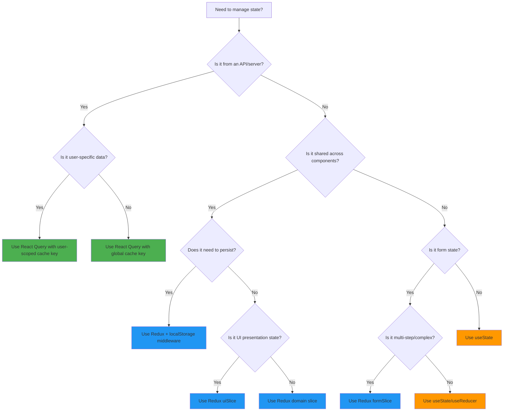

# State Management Decision Tree - Epic 004
**Date**: 2025-10-26
**Epic**: #004 - State Management Boundaries
**Story**: US-004-003 - Create State Management Decision Tree

## Quick Decision Flow



## Detailed Decision Guide

### 1. Use React Query When ✅

**Criteria:**
- Data comes from an API or external source
- Data can become stale and needs refreshing
- Multiple components need the same server data
- Data requires caching between page navigations
- You need loading/error states for async operations
- Data has relationships requiring cache invalidation

**Examples:**
```typescript
// ✅ User profile data
const { data: user } = useUser(userId);

// ✅ Content list with pagination
const { data: posts } = usePosts({ page, limit });

// ✅ Payment history
const { data: payments } = usePayments();

// ✅ Real-time data with polling
const { data: status } = usePaymentStatus(id, {
  refetchInterval: 2000 // Poll every 2s
});
```

### 2. Use Redux When 🔷

**Criteria:**
- UI state shared across multiple components
- Client-side preferences and settings
- Authentication state (token, isAuthenticated)
- Complex client-side state with computed values
- State needs to persist across sessions
- Application-wide UI state (theme, modals, notifications)

**Examples:**
```typescript
// 🔷 Theme preference
dispatch(uiActions.setTheme('dark'));

// 🔷 Modal management
dispatch(uiActions.openModal({ type: 'edit', data: item }));

// 🔷 Authentication state
dispatch(authActions.login({ token, user }));

// 🔷 Notification system
dispatch(uiActions.addNotification({ message, type: 'success' }));
```

### 3. Use Local State (useState/useReducer) When 🟠

**Criteria:**
- State is only used within a single component
- Simple form inputs without validation
- Temporary UI state (hover, focus, toggle)
- Animation or transition states
- State doesn't need to survive unmounting

**Examples:**
```typescript
// 🟠 Simple form input
const [email, setEmail] = useState('');

// 🟠 Toggle state
const [isOpen, setIsOpen] = useState(false);

// 🟠 Component-specific loading
const [isSubmitting, setIsSubmitting] = useState(false);

// 🟠 Temporary selection
const [selectedItems, setSelectedItems] = useState<string[]>([]);
```

## Common Scenarios

### Scenario 1: User Authentication
```typescript
// ❌ WRONG: All in Redux
const userSlice = {
  user: { id, name, email },      // Server data
  token: 'jwt...',                 // Client auth
  loading: false,                  // Server state
  error: null                      // Server state
};

// ✅ CORRECT: Split appropriately
// Redux: Auth state only
const authSlice = {
  isAuthenticated: boolean,
  token: string | null,
  nostrPubkey: string | null
};

// React Query: User data
const { data: user } = useCurrentUser();
```

### Scenario 2: Content Creation Form
```typescript
// Multi-step content creation
// ✅ Redux: Complex form state
const formSlice = {
  contentDraft: {
    step: 1,
    data: { title, body, tags },
    validation: { errors },
    isDirty: true
  }
};

// ✅ React Query: Save/publish
const { mutate: saveContent } = useSaveContent();

// ✅ Local: Simple inputs
const [preview, setPreview] = useState(false);
```

### Scenario 3: Dashboard with Multiple Data Sources
```typescript
// ✅ React Query: All API data
const { data: stats } = useCreatorStats();
const { data: recentPosts } = useRecentPosts();
const { data: earnings } = useEarnings();

// ✅ Redux: Dashboard UI state
const dashboardView = useSelector(state => state.ui.dashboardView);
const selectedDateRange = useSelector(state => state.ui.dateRange);

// ✅ Local: Component interactions
const [expandedCard, setExpandedCard] = useState<string | null>(null);
```

## Anti-Patterns to Avoid ❌

### 1. Server Data in Redux
```typescript
// ❌ NEVER DO THIS
const postsSlice = createSlice({
  name: 'posts',
  initialState: {
    posts: [],        // API data
    loading: false,   // API state
    error: null       // API state
  }
});

// ✅ DO THIS INSTEAD
const { data: posts, isLoading, error } = usePosts();
```

### 2. UI State in React Query
```typescript
// ❌ NEVER DO THIS
queryClient.setQueryData(['ui', 'theme'], 'dark');

// ✅ DO THIS INSTEAD
dispatch(uiActions.setTheme('dark'));
```

### 3. Complex Form State in useState
```typescript
// ❌ AVOID THIS (too complex for local state)
const [formData, setFormData] = useState({
  personalInfo: { ... },
  preferences: { ... },
  notifications: { ... },
  // 10 more nested objects
});

// ✅ DO THIS INSTEAD (Redux for complex forms)
const formData = useSelector(state => state.forms.userProfile);
```

## Migration Patterns

### Pattern 1: Redux to React Query
```typescript
// BEFORE: Redux with thunks
const fetchPosts = createAsyncThunk('posts/fetch', async () => {
  const response = await api.getPosts();
  return response.data;
});

// AFTER: React Query
const usePosts = () => {
  return useQuery({
    queryKey: ['posts'],
    queryFn: api.getPosts,
    staleTime: 2 * 60 * 1000 // 2 minutes
  });
};
```

### Pattern 2: Split Mixed State
```typescript
// BEFORE: Mixed state in Redux
const userSlice = {
  currentUser: userData,    // Server
  isAuthenticated: true,    // Client
  preferences: { ... }      // Client
};

// AFTER: Properly separated
// React Query
const { data: currentUser } = useCurrentUser();

// Redux
const { isAuthenticated, preferences } = useSelector(state => state.auth);
```

## Decision Matrix

| State Type | React Query | Redux | Local State | Context API |
|------------|:-----------:|:-----:|:-----------:|:-----------:|
| API Data | ✅ | ❌ | ❌ | ❌ |
| Auth Token | ❌ | ✅ | ❌ | ❌ |
| User Preferences | ❌ | ✅ | ❌ | ⚠️ |
| Theme | ❌ | ✅ | ❌ | ⚠️ |
| Modal State | ❌ | ✅ | ⚠️ | ❌ |
| Form Input | ❌ | ⚠️ | ✅ | ❌ |
| Multi-step Form | ❌ | ✅ | ❌ | ❌ |
| Notifications | ❌ | ✅ | ❌ | ❌ |
| Hover State | ❌ | ❌ | ✅ | ❌ |
| Animation | ❌ | ❌ | ✅ | ❌ |

Legend:
- ✅ Recommended
- ⚠️ Use with caution
- ❌ Not recommended

## Performance Considerations

### React Query
- **Pros**: Automatic caching, deduplication, background refetch
- **Cons**: Additional bundle size (~25KB)
- **Use when**: Managing server state, need caching

### Redux
- **Pros**: Predictable updates, DevTools, time-travel debugging
- **Cons**: Boilerplate, manual cache management
- **Use when**: Complex client state, needs persistence

### Local State
- **Pros**: Simple, no dependencies, component-scoped
- **Cons**: Lost on unmount, no sharing
- **Use when**: Simple, isolated state

## Team Guidelines

1. **Default to React Query** for all server data
2. **Default to local state** for component-specific UI
3. **Use Redux only when** state is truly global and client-side
4. **Never duplicate** server data between Redux and React Query
5. **Document exceptions** when deviating from these patterns

## Enforcement

### ESLint Rules
```javascript
// .eslintrc.js
{
  rules: {
    'no-redux-server-state': 'error',
    'prefer-react-query-for-api': 'warn',
    'no-ui-state-in-query-cache': 'error'
  }
}
```

### Code Review Checklist
- [ ] No API data in Redux slices
- [ ] No loading/error states in Redux
- [ ] React Query used for all API calls
- [ ] Proper cache key conventions followed
- [ ] UI state not in React Query cache

## Questions to Ask

1. **Does this data come from an API?** → React Query
2. **Do multiple components need this?** → Redux or React Query
3. **Should it survive page refresh?** → Redux with persistence
4. **Is it only UI presentation?** → Redux uiSlice
5. **Is it component-specific?** → Local state
6. **Does it need real-time updates?** → React Query with polling/websockets
7. **Is it form data?** → Depends on complexity

---

**Status**: Decision Tree Complete
**Next Step**: Create architecture diagrams (Story #004)