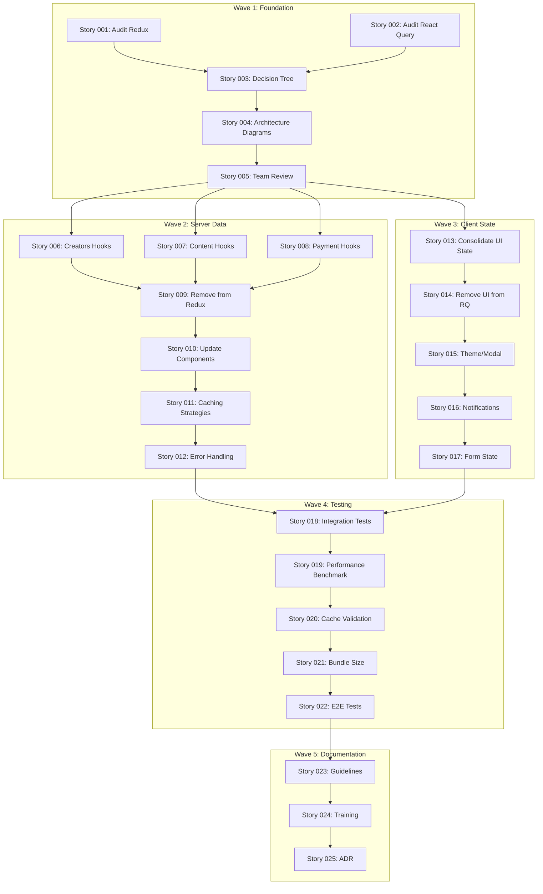

# Epic 004: State Management - Execution Plan

## Executive Summary

**Epic**: #004 - State Management Boundaries
**Stories**: 25 total stories
**Duration**: 10-12 days (with parallel execution)
**Priority**: HIGH - Blocks Epic 005 (Backend Services)
**Quality Target**: 99/100 (Elite Engineering Standards)
**Test Coverage Target**: 95%+ for state management code

## Current Status

- **Epic 001 (Type Safety)**: ✅ COMPLETE
- **Epic 002 (Payment Processing)**: ✅ COMPLETE
- **Epic 003 (NOSTR Consolidation)**: ✅ COMPLETE
- **Epic 004 (State Management)**: 🚀 STARTING NOW

## Story Breakdown by Wave

### Wave 1: Foundation (Critical Path - Sequential)

**Duration**: 2-3 days | **Agent**: backend-api-builder
**Stories**:

- Story #001: Audit Redux Store Structure
- Story #002: Audit React Query Usage
- Story #003: Create State Management Decision Tree
- Story #004: Design State Architecture Diagrams
- Story #005: Team Guidelines Review Session

**Success Gate**: All audits complete, decision tree approved, architecture diagrams created

### Wave 2: Server Data Migration (Parallel Execution)

**Duration**: 3-4 days | **Agents**: 3x backend-api-builder (parallel)
**Streams**:

- Stream A: Stories #006 (Creators), #009 (Remove from Redux)
- Stream B: Stories #007 (Content), #010 (Update Components)
- Stream C: Stories #008 (Payments), #011 (Caching), #012 (Error Handling)

**Success Gate**: All React Query hooks implemented, Redux cleaned, 95% test coverage

### Wave 3: Client State Consolidation (Parallel with Wave 2)

**Duration**: 2-3 days | **Agents**: 2x elite-frontend-dev
**Streams**:

- Stream A: Stories #013 (UI State), #014 (Remove from RQ), #015 (Theme/Modal)
- Stream B: Stories #016 (Notifications), #017 (Form State)

**Success Gate**: All UI state in Redux, no UI state in React Query

### Wave 4: Testing & Validation

**Duration**: 2-3 days | **Agents**: test-automation-engineer + backend-api-builder
**Stories**:

- Story #018: Integration Tests for Data Flow
- Story #019: Performance Benchmarking
- Story #020: Cache Hit Rate Validation (target: >80%)
- Story #021: Bundle Size Impact Check (limit: <5KB increase)
- Story #022: End-to-End Test Coverage

**Success Gate**: All tests passing, performance targets met, bundle size acceptable

### Wave 5: Documentation & Training

**Duration**: 1-2 days | **Agent**: technical-docs-writer
**Stories**:

- Story #023: Create Developer Guidelines Document
- Story #024: Create Training Workshop Materials
- Story #025: Create Architecture Decision Record (ADR)

**Success Gate**: All documentation complete, team trained, ADR approved

## Dependency Graph

## Agent Assignments

### Wave 1 (Sequential - 1 Agent)

- **backend-api-builder**: Stories 001-005 (audit & architecture)

### Wave 2 (Parallel - 3 Agents)

- **backend-api-builder-1**: Stories 006, 009 (Creators + Redux cleanup)
- **backend-api-builder-2**: Stories 007, 010 (Content + Components)
- **backend-api-builder-3**: Stories 008, 011, 012 (Payments + Caching + Error)

### Wave 3 (Parallel - 2 Agents)

- **elite-frontend-dev-1**: Stories 013, 014, 015 (UI State consolidation)
- **elite-frontend-dev-2**: Stories 016, 017 (Notifications + Forms)

### Wave 4 (Parallel - 2 Agents)

- **test-automation-engineer**: Stories 018, 020, 022 (Testing)
- **backend-api-builder**: Stories 019, 021 (Performance)

### Wave 5 (Sequential - 1 Agent)

- **technical-docs-writer**: Stories 023-025 (Documentation)

## Timeline

### Day 1-2: Wave 1 (Foundation)

- Morning: Launch backend-api-builder for audits (Stories 001-002)
- Afternoon: Create decision tree and diagrams (Stories 003-004)
- Day 2: Team review and approval (Story 005)

### Day 3-6: Wave 2 & 3 (Parallel)

- Launch 5 agents simultaneously:
  - 3 for Wave 2 (Server Data Migration)
  - 2 for Wave 3 (Client State Consolidation)
- Monitor progress every 2 hours
- Resolve blockers immediately

### Day 7-9: Wave 4 (Testing)

- Launch 2 agents for comprehensive testing
- Performance benchmarking
- E2E test implementation
- Cache optimization

### Day 10-11: Wave 5 (Documentation)

- Launch technical-docs-writer
- Create all documentation
- Prepare training materials
- Write ADR

### Day 12: Final Validation

- Review all deliverables
- Generate completion report
- Prepare for production deployment

## Quality Gates

### Code Quality (Every Story)

- ✅ TypeScript strict mode (no `any` types)
- ✅ Zero ESLint errors/warnings
- ✅ Prettier formatted
- ✅ 95%+ test coverage for state code

### Performance Metrics

- ✅ Cache hit rate > 80%
- ✅ Bundle size increase < 5KB
- ✅ Redux updates < 16ms (60fps)
- ✅ React Query stale time optimized

### Documentation Requirements

- ✅ Mermaid diagrams for every story
- ✅ CHANGELOG.md updated
- ✅ JSDoc for all public APIs
- ✅ Migration guide complete

## Risk Mitigation

### Risk: Breaking Existing Features

**Mitigation**:

- Feature flags for gradual rollout
- Parallel implementation (keep old code)
- Comprehensive E2E tests before switch

### Risk: Performance Regression

**Mitigation**:

- Benchmark before starting
- Monitor metrics continuously
- Rollback plan ready

### Risk: Team Confusion

**Mitigation**:

- Clear guidelines from Day 1
- Training workshop in Wave 5
- Pair programming available

## Success Criteria

Epic 004 is COMPLETE when:

- ✅ All 25 stories implemented and tested
- ✅ Zero server data in Redux
- ✅ Zero UI state in React Query
- ✅ Cache hit rate > 80%
- ✅ Bundle size increase < 5KB
- ✅ Test coverage ≥ 95% for state code
- ✅ All Mermaid diagrams created
- ✅ Documentation complete
- ✅ Team trained
- ✅ Production ready

## Monitoring & Reporting

### Daily Status Reports

- Story completion status
- Blocker identification
- Quality metrics
- Agent performance

### Progress Dashboard

- `/monitoring/dashboard/data/tasks.json` updated every 2 hours
- Real-time progress tracking
- Dependency status monitoring

### Final Deliverables

1. Complete state management implementation
2. 10+ Mermaid architecture diagrams
3. Developer guidelines document
4. Training materials
5. ADR-004 document
6. Migration guide
7. Performance report
8. Test coverage report

## Launch Sequence

1. **Immediate**: Read full story details from STORY_BREAKDOWN.md
2. **Hour 1**: Launch Wave 1 agent for audits
3. **Day 2 PM**: Launch Wave 2 & 3 agents (5 parallel)
4. **Day 7**: Launch Wave 4 testing agents
5. **Day 10**: Launch Wave 5 documentation agent
6. **Day 12**: Final validation and deployment prep

---

**Status**: READY TO EXECUTE
**Next Action**: Launch Wave 1 agent for Stories 001-005
**Estimated Completion**: 12 days from start
