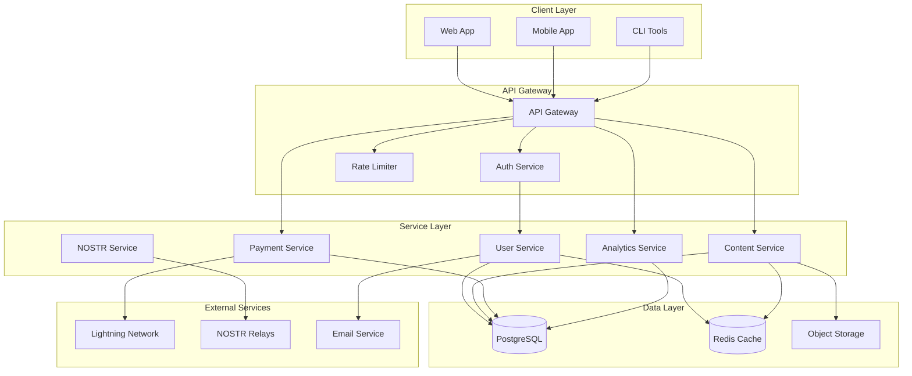
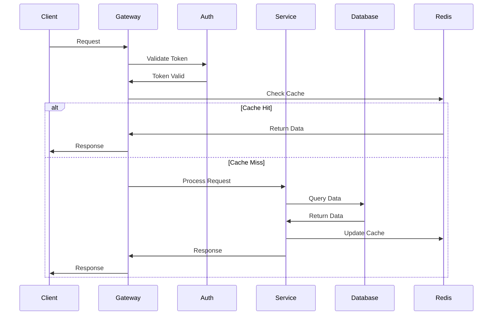

# Epic 005: Backend Services Implementation

## Epic Overview

**Epic ID**: EPIC-005
**Epic Name**: Backend Services
**Status**: Planning
**Priority**: Critical
**Started**: 2025-10-26
**Target Completion**: 2025-11-15 (3 weeks)

## Executive Summary

Epic 005 establishes the complete backend infrastructure for the Sovren platform, including database architecture, API services, authentication, payment processing, and all server-side business logic. This epic is critical for enabling the platform's core functionality and must be completed before frontend integration can proceed.

## Scope

### Included

- Database schema design and migrations
- REST API endpoint implementation
- GraphQL API layer (optional)
- Authentication and authorization services
- Payment processing integration (Lightning Network)
- Content management service layer
- User management services
- Analytics and reporting services
- Caching layer implementation (Redis)
- Error handling and logging
- Service monitoring and health checks
- Background job processing
- Email notification services
- File storage and CDN integration
- Security middleware and rate limiting

### Excluded

- Frontend implementation (Epic 006)
- Mobile app development (Epic 007)
- AI/ML features (Epic 008)
- Advanced analytics (Epic 009)

## Dependencies

### Prerequisites

- Epic 003: NOSTR Consolidation (✅ Complete)
- Epic 004: State Management (🔄 In Progress - can run parallel)

### Blocking

- Epic 006: Frontend Integration (depends on API completion)
- Epic 007: Mobile Development (depends on API completion)

## Technical Architecture

### Technology Stack

- **Runtime**: Node.js 20.x LTS with TypeScript 5.3+
- **Framework**: Express.js / Fastify
- **Database**: PostgreSQL 15+ (via Supabase)
- **Cache**: Redis 7.x
- **Queue**: Bull/BullMQ for job processing
- **ORM**: Prisma 5.x
- **API**: REST + optional GraphQL (Apollo Server)
- **Authentication**: JWT + NOSTR keys
- **Payment**: Lightning Network (LNbits/WebLN)
- **Monitoring**: Prometheus + Grafana
- **Logging**: Winston + Loki
- **Testing**: Jest + Supertest

### Architecture Patterns

- Domain-Driven Design (DDD)
- Repository Pattern for data access
- Service Layer for business logic
- Dependency Injection with InversifyJS
- Event-driven architecture for async operations
- CQRS for read/write separation (where applicable)

## Work Streams

### Stream A: Database & Core Infrastructure (US-501 to US-510)

**Agent**: backend-api-builder
**Dependencies**: None (can start immediately)
**Duration**: 5 days

### Stream B: API Development (US-511 to US-520)

**Agent**: backend-api-builder
**Dependencies**: Stream A completion
**Duration**: 7 days

### Stream C: Services & Integration (US-521 to US-530)

**Agent**: backend-api-builder
**Dependencies**: Partial Stream B completion
**Duration**: 5 days

## User Stories

### Database & Infrastructure Stories (Stream A)

#### US-501: Database Schema Design

**Priority**: P0 - Critical Path
**Points**: 3
**Description**: Design and implement the complete database schema for Sovren platform
**Agent**: backend-api-builder

#### US-502: Database Migrations Setup

**Priority**: P0 - Critical Path
**Points**: 2
**Description**: Implement database migration system with Prisma
**Agent**: backend-api-builder

#### US-503: Redis Cache Layer

**Priority**: P1 - High
**Points**: 2
**Description**: Implement Redis caching infrastructure
**Agent**: backend-api-builder

#### US-504: Background Job Queue

**Priority**: P1 - High
**Points**: 2
**Description**: Set up Bull/BullMQ for background job processing
**Agent**: backend-api-builder

#### US-505: Logging Infrastructure

**Priority**: P1 - High
**Points**: 1
**Description**: Implement Winston logging with Loki integration
**Agent**: backend-api-builder

#### US-506: Monitoring & Metrics

**Priority**: P1 - High
**Points**: 2
**Description**: Set up Prometheus metrics and health checks
**Agent**: backend-api-builder

#### US-507: Environment Configuration

**Priority**: P0 - Critical Path
**Points**: 1
**Description**: Implement secure environment configuration management
**Agent**: backend-api-builder

#### US-508: Docker Configuration

**Priority**: P1 - High
**Points**: 1
**Description**: Create Docker configuration for backend services
**Agent**: infrastructure

#### US-509: Database Seed Data

**Priority**: P2 - Medium
**Points**: 1
**Description**: Create seed data scripts for development and testing
**Agent**: backend-api-builder

#### US-510: Database Backup Strategy

**Priority**: P1 - High
**Points**: 2
**Description**: Implement automated database backup and recovery
**Agent**: backend-api-builder

### API Development Stories (Stream B)

#### US-511: Express Server Setup

**Priority**: P0 - Critical Path
**Points**: 2
**Description**: Initialize Express server with TypeScript configuration
**Agent**: backend-api-builder

#### US-512: Authentication API

**Priority**: P0 - Critical Path
**Points**: 3
**Description**: Implement JWT-based authentication endpoints
**Agent**: backend-api-builder

#### US-513: User Management API

**Priority**: P0 - Critical Path
**Points**: 3
**Description**: Create CRUD APIs for user management
**Agent**: backend-api-builder

#### US-514: Content Management API

**Priority**: P0 - Critical Path
**Points**: 3
**Description**: Implement content creation, retrieval, and management APIs
**Agent**: backend-api-builder

#### US-515: Payment Processing API

**Priority**: P0 - Critical Path
**Points**: 3
**Description**: Integrate Lightning Network payment APIs
**Agent**: backend-api-builder

#### US-516: Subscription Management API

**Priority**: P0 - Critical Path
**Points**: 3
**Description**: Create subscription tier and billing APIs
**Agent**: backend-api-builder

#### US-517: Analytics API

**Priority**: P2 - Medium
**Points**: 2
**Description**: Implement analytics data collection and retrieval APIs
**Agent**: backend-api-builder

#### US-518: Search API

**Priority**: P2 - Medium
**Points**: 2
**Description**: Create full-text search endpoints with filters
**Agent**: backend-api-builder

#### US-519: File Upload API

**Priority**: P1 - High
**Points**: 2
**Description**: Implement secure file upload with CDN integration
**Agent**: backend-api-builder

#### US-520: GraphQL Schema

**Priority**: P3 - Low
**Points**: 3
**Description**: Optional GraphQL API layer implementation
**Agent**: backend-api-builder

### Services & Integration Stories (Stream C)

#### US-521: Email Service

**Priority**: P1 - High
**Points**: 2
**Description**: Implement email notification service with templates
**Agent**: backend-api-builder

#### US-522: NOSTR Integration Service

**Priority**: P0 - Critical Path
**Points**: 3
**Description**: Create service layer for NOSTR protocol operations
**Agent**: backend-api-builder

#### US-523: Lightning Service

**Priority**: P0 - Critical Path
**Points**: 3
**Description**: Implement Lightning Network payment service
**Agent**: backend-api-builder

#### US-524: Security Middleware

**Priority**: P0 - Critical Path
**Points**: 2
**Description**: Implement security headers, CORS, and rate limiting
**Agent**: backend-api-builder

#### US-525: Validation Middleware

**Priority**: P1 - High
**Points**: 2
**Description**: Create request validation middleware with Joi/Zod
**Agent**: backend-api-builder

#### US-526: Error Handler Service

**Priority**: P1 - High
**Points**: 1
**Description**: Implement centralized error handling
**Agent**: backend-api-builder

#### US-527: WebSocket Service

**Priority**: P2 - Medium
**Points**: 2
**Description**: Implement real-time communication via WebSockets
**Agent**: backend-api-builder

#### US-528: Testing Infrastructure

**Priority**: P0 - Critical Path
**Points**: 2
**Description**: Set up Jest, Supertest, and test utilities
**Agent**: test-automation

#### US-529: API Documentation

**Priority**: P1 - High
**Points**: 2
**Description**: Generate OpenAPI/Swagger documentation
**Agent**: documentation

#### US-530: Performance Testing

**Priority**: P2 - Medium
**Points**: 2
**Description**: Implement load testing with k6
**Agent**: test-automation

## Success Criteria

### Functional Requirements

✅ All 30 user stories completed
✅ Database schema fully implemented
✅ All critical APIs operational
✅ Authentication system working
✅ Payment processing integrated
✅ Test coverage ≥ 95% for services

### Non-Functional Requirements

✅ API response time < 200ms (p95)
✅ Database query time < 50ms (p95)
✅ Zero critical security vulnerabilities
✅ All endpoints documented
✅ Load testing passed (1000 concurrent users)
✅ Error rate < 0.1%

### Documentation Requirements

✅ API documentation complete
✅ Database schema documented
✅ Service architecture diagrams created
✅ Deployment guide written
✅ Runbook for operations

## Risk Management

### High Risks

1. **Lightning Network Integration Complexity**
   - Mitigation: Start early, use proven libraries
   - Contingency: Implement mock service first

2. **Database Performance at Scale**
   - Mitigation: Proper indexing, query optimization
   - Contingency: Read replicas, caching strategy

3. **Security Vulnerabilities**
   - Mitigation: Security-first design, regular audits
   - Contingency: Immediate patching process

### Medium Risks

1. **Third-party Service Dependencies**
   - Mitigation: Abstract behind interfaces
   - Contingency: Multiple provider support

2. **Migration Complexity**
   - Mitigation: Incremental migrations
   - Contingency: Rollback procedures

## Timeline

### Week 1 (Days 1-7)

- Stream A: Database & Infrastructure (US-501 to US-510)
- Initial API setup (US-511)

### Week 2 (Days 8-14)

- Stream B: Core APIs (US-512 to US-519)
- Begin Service Integration (US-521, US-522)

### Week 3 (Days 15-21)

- Stream C: Complete Services (US-523 to US-530)
- Testing and documentation
- Performance optimization

## Coordination Points

### Daily Sync Points

- 09:00 UTC: Stream status check
- 14:00 UTC: Blocker resolution
- 18:00 UTC: Progress update

### Key Milestones

- Day 5: Database schema complete
- Day 10: Core APIs operational
- Day 15: Services integrated
- Day 20: Testing complete
- Day 21: Production ready

## Architecture Diagrams

### System Architecture

### Data Flow Architecture

## Delivery Checklist

### Pre-Development

- [ ] Epic documentation complete
- [ ] All stories defined with subtasks
- [ ] Dependencies identified
- [ ] Architecture approved
- [ ] Team assigned

### Development

- [ ] Database schema implemented
- [ ] Migrations tested
- [ ] APIs developed
- [ ] Services integrated
- [ ] Tests written (95% coverage)

### Post-Development

- [ ] Documentation complete
- [ ] Security audit passed
- [ ] Performance testing done
- [ ] Deployment guide written
- [ ] Handoff complete

## References

- PRD: `/Users/fp/Desktop/Sovren/SOVREN_PRD.md`
- Architecture: `/Users/fp/Desktop/Sovren/docs/architecture/`
- API Spec: `/Users/fp/Desktop/Sovren/docs/api/`
- Database Schema: `/Users/fp/Desktop/Sovren/packages/backend/prisma/`
