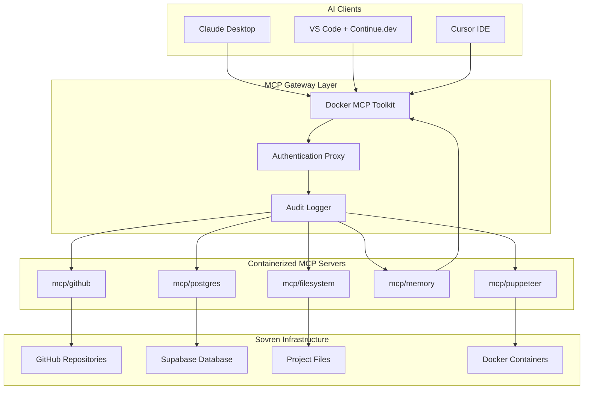
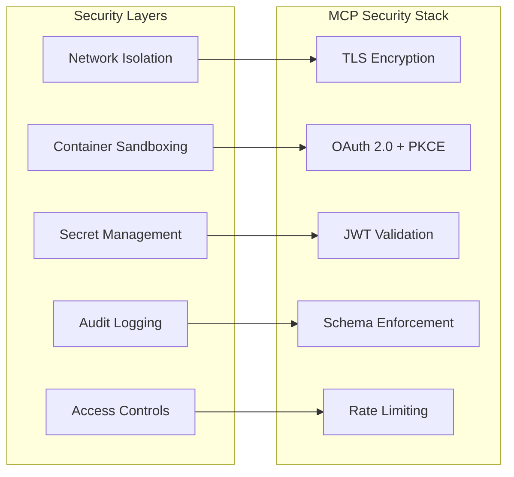

# Docker MCP Tools Integration Plan for Sovren

## Executive Summary

This document outlines the strategic implementation of Docker Model Context Protocol (MCP) tools integration for the Sovren platform, emphasizing security-first architecture and seamless integration with our existing containerized infrastructure.

## Table of Contents

1. [Architecture Overview](#architecture-overview)
2. [Security Framework](#security-framework)
3. [Implementation Phases](#implementation-phases)
4. [Docker Configurations](#docker-configurations)
5. [Security Controls](#security-controls)
6. [Monitoring & Observability](#monitoring--observability)
7. [Team Training & Documentation](#team-training--documentation)
8. [Risk Mitigation](#risk-mitigation)

## Architecture Overview

### MCP Integration Architecture



### Core Principles

1. **Security by Design**: Every MCP connection secured and audited
2. **Container Isolation**: All MCP servers run in isolated Docker containers
3. **Least Privilege Access**: Minimal permissions for each MCP tool
4. **Zero Trust Network**: No implicit trust between components
5. **Comprehensive Auditing**: Full traceability of all AI actions

## Security Framework

### Threat Model

| Threat Category      | Risk Level | Mitigation Strategy                  |
| -------------------- | ---------- | ------------------------------------ |
| Tool Poisoning       | HIGH       | Schema validation, tool verification |
| Prompt Injection     | HIGH       | Input sanitization, output filtering |
| Credential Exposure  | CRITICAL   | Vault integration, secret rotation   |
| Supply Chain Attacks | MEDIUM     | Container scanning, signed images    |
| Data Exfiltration    | HIGH       | Network segmentation, DLP controls   |

### Security Architecture



## Implementation Phases

### Phase 1: Foundation Setup (Week 1-2)

**Objectives:**

- Install Docker MCP Toolkit
- Configure basic security infrastructure
- Set up development environment

**Deliverables:**

- MCP security policies
- Container configurations
- Initial tooling setup

### Phase 2: Secure Tool Integration (Week 3-4)

**Objectives:**

- Deploy core MCP servers with security controls
- Integrate with GitHub and database
- Implement audit logging

**Deliverables:**

- Production-ready MCP servers
- Security monitoring dashboard
- Access control policies

### Phase 3: AI Client Integration (Week 5-6)

**Objectives:**

- Connect Claude Desktop and VS Code
- Configure Continue.dev integration
- Implement human-in-the-loop controls

**Deliverables:**

- AI client configurations
- User training materials
- Operational procedures

### Phase 4: Production Hardening (Week 7-8)

**Objectives:**

- Performance optimization
- Security penetration testing
- Disaster recovery procedures

**Deliverables:**

- Performance benchmarks
- Security audit report
- Incident response playbook

## Docker Configurations

### MCP Network Security

```yaml
# docker-compose.mcp.yml
version: '3.8'

networks:
  mcp_isolated:
    driver: bridge
    internal: true
    ipam:
      config:
        - subnet: 172.20.0.0/24

  mcp_gateway:
    driver: bridge
    ipam:
      config:
        - subnet: 172.21.0.0/24

volumes:
  mcp_secrets:
    driver: local
    driver_opts:
      type: tmpfs
      device: tmpfs
      o: size=100m,uid=1001

  mcp_audit_logs:
    driver: local

secrets:
  github_token:
    external: true
    name: sovren_github_token

  supabase_url:
    external: true
    name: sovren_supabase_url

  supabase_key:
    external: true
    name: sovren_supabase_key

services:
  # MCP Security Gateway
  mcp-gateway:
    image: sovren/mcp-gateway:latest
    build:
      context: ./docker/mcp-gateway
      dockerfile: Dockerfile
    ports:
      - '3000:3000'
    networks:
      - mcp_gateway
      - mcp_isolated
    environment:
      - NODE_ENV=production
      - LOG_LEVEL=info
      - AUDIT_ENABLED=true
    volumes:
      - mcp_audit_logs:/var/log/mcp
    healthcheck:
      test: ['CMD', 'curl', '-f', 'http://localhost:3000/health']
      interval: 30s
      timeout: 10s
      retries: 3
    deploy:
      resources:
        limits:
          memory: 512M
          cpus: '0.5'
    restart: unless-stopped
    security_opt:
      - no-new-privileges:true
    user: '1001:1001'

  # GitHub Integration Server
  mcp-github:
    image: mcp/github:latest
    networks:
      - mcp_isolated
    environment:
      - GITHUB_TOKEN_FILE=/run/secrets/github_token
      - ALLOWED_REPOS=sovren/*
      - READ_ONLY_MODE=true
    secrets:
      - github_token
    volumes:
      - mcp_audit_logs:/var/log/mcp
    healthcheck:
      test: ['CMD', 'node', 'healthcheck.js']
      interval: 60s
      timeout: 15s
      retries: 3
    deploy:
      resources:
        limits:
          memory: 256M
          cpus: '0.3'
    restart: unless-stopped
    security_opt:
      - no-new-privileges:true
      - seccomp:unconfined
    user: '1001:1001'
    read_only: true
    tmpfs:
      - /tmp:noexec,nosuid,size=50m

  # Database Query Server
  mcp-postgres:
    image: mcp/postgres:latest
    networks:
      - mcp_isolated
    environment:
      - DATABASE_URL_FILE=/run/secrets/supabase_url
      - READ_ONLY_MODE=true
      - QUERY_TIMEOUT=30s
      - MAX_ROWS=1000
    secrets:
      - supabase_url
    volumes:
      - mcp_audit_logs:/var/log/mcp
    healthcheck:
      test: ['CMD', 'pg_isready', '--timeout=10']
      interval: 45s
      timeout: 10s
      retries: 3
    deploy:
      resources:
        limits:
          memory: 256M
          cpus: '0.3'
    restart: unless-stopped
    security_opt:
      - no-new-privileges:true
    user: '1001:1001'
    read_only: true
    tmpfs:
      - /tmp:noexec,nosuid,size=50m

  # Filesystem Access Server
  mcp-filesystem:
    image: mcp/filesystem:latest
    networks:
      - mcp_isolated
    environment:
      - ALLOWED_PATHS=/workspace
      - READ_ONLY_MODE=true
      - MAX_FILE_SIZE=10MB
    volumes:
      - ./:/workspace:ro
      - mcp_audit_logs:/var/log/mcp
    healthcheck:
      test: ['CMD', 'test', '-f', '/workspace/package.json']
      interval: 60s
      timeout: 10s
      retries: 3
    deploy:
      resources:
        limits:
          memory: 128M
          cpus: '0.2'
    restart: unless-stopped
    security_opt:
      - no-new-privileges:true
      - apparmor:mcp-filesystem-profile
    user: '1001:1001'
    read_only: true
    tmpfs:
      - /tmp:noexec,nosuid,size=25m

  # Memory Persistence Server
  mcp-memory:
    image: mcp/memory:latest
    networks:
      - mcp_isolated
    environment:
      - STORAGE_LIMIT=100MB
      - ENCRYPTION_ENABLED=true
    volumes:
      - mcp_secrets:/var/lib/mcp/memory
      - mcp_audit_logs:/var/log/mcp
    healthcheck:
      test: ['CMD', 'curl', '-f', 'http://localhost:8080/health']
      interval: 45s
      timeout: 10s
      retries: 3
    deploy:
      resources:
        limits:
          memory: 256M
          cpus: '0.2'
    restart: unless-stopped
    security_opt:
      - no-new-privileges:true
    user: '1001:1001'
    read_only: true
    tmpfs:
      - /tmp:noexec,nosuid,size=50m

  # Browser Automation Server (Sandboxed)
  mcp-puppeteer:
    image: mcp/puppeteer:latest
    networks:
      - mcp_isolated
    environment:
      - SANDBOX_MODE=true
      - NO_SANDBOX=false
      - DISABLE_DEV_SHM_USAGE=true
    volumes:
      - mcp_audit_logs:/var/log/mcp
    healthcheck:
      test: ['CMD', 'node', 'healthcheck.js']
      interval: 60s
      timeout: 20s
      retries: 3
    deploy:
      resources:
        limits:
          memory: 1G
          cpus: '0.5'
    restart: unless-stopped
    security_opt:
      - no-new-privileges:true
      - seccomp:chrome.json
    user: '1001:1001'
    read_only: true
    tmpfs:
      - /tmp:noexec,nosuid,size=100m
      - /dev/shm:rw,nosuid,nodev,noexec,relatime,size=64m

  # Audit Log Aggregator
  mcp-audit:
    image: fluent/fluent-bit:latest
    networks:
      - mcp_gateway
    volumes:
      - mcp_audit_logs:/var/log/mcp:ro
      - ./docker/fluent-bit/fluent-bit.conf:/fluent-bit/etc/fluent-bit.conf:ro
    environment:
      - FLB_LOG_LEVEL=info
    deploy:
      resources:
        limits:
          memory: 128M
          cpus: '0.1'
    restart: unless-stopped
    depends_on:
      - mcp-gateway
```

### MCP Gateway Security Container

```dockerfile
# docker/mcp-gateway/Dockerfile
FROM node:18-alpine AS builder

WORKDIR /app
COPY package*.json ./
RUN npm ci --only=production && npm cache clean --force

FROM node:18-alpine AS runtime

# Security hardening
RUN addgroup -g 1001 -S mcp && \
    adduser -u 1001 -S mcp -G mcp && \
    apk add --no-cache dumb-init && \
    apk del --no-cache apk-tools

WORKDIR /app

# Copy application files
COPY --from=builder /app/node_modules ./node_modules
COPY --chown=mcp:mcp src ./src
COPY --chown=mcp:mcp package*.json ./

# Security configurations
USER mcp
EXPOSE 3000
HEALTHCHECK --interval=30s --timeout=10s --start-period=5s --retries=3 \
  CMD node healthcheck.js

ENTRYPOINT ["dumb-init", "--"]
CMD ["node", "src/server.js"]
```

```javascript
// docker/mcp-gateway/src/server.js
const express = require('express');
const helmet = require('helmet');
const rateLimit = require('express-rate-limit');
const { createProxyMiddleware } = require('http-proxy-middleware');
const winston = require('winston');
const jwt = require('jsonwebtoken');

const app = express();
const port = process.env.PORT || 3000;

// Security middleware
app.use(
  helmet({
    contentSecurityPolicy: {
      directives: {
        defaultSrc: ["'self'"],
        scriptSrc: ["'self'"],
        styleSrc: ["'self'", "'unsafe-inline'"],
        imgSrc: ["'self'", 'data:', 'https:'],
      },
    },
    hsts: {
      maxAge: 31536000,
      includeSubDomains: true,
      preload: true,
    },
  })
);

// Rate limiting
const limiter = rateLimit({
  windowMs: 15 * 60 * 1000, // 15 minutes
  max: 100, // limit each IP to 100 requests per windowMs
  message: 'Too many requests from this IP',
  standardHeaders: true,
  legacyHeaders: false,
});
app.use(limiter);

// Audit logging
const auditLogger = winston.createLogger({
  level: 'info',
  format: winston.format.combine(winston.format.timestamp(), winston.format.json()),
  transports: [
    new winston.transports.File({
      filename: '/var/log/mcp/audit.log',
      maxsize: 10485760, // 10MB
      maxFiles: 5,
    }),
    new winston.transports.Console(),
  ],
});

// Authentication middleware
const authenticateToken = (req, res, next) => {
  const authHeader = req.headers['authorization'];
  const token = authHeader && authHeader.split(' ')[1];

  if (!token) {
    auditLogger.warn('Unauthorized access attempt', {
      ip: req.ip,
      userAgent: req.get('User-Agent'),
      path: req.path,
    });
    return res.sendStatus(401);
  }

  jwt.verify(token, process.env.JWT_SECRET, (err, user) => {
    if (err) {
      auditLogger.warn('Invalid token used', {
        ip: req.ip,
        error: err.message,
      });
      return res.sendStatus(403);
    }
    req.user = user;
    next();
  });
};

// MCP proxy with security controls
const mcpProxy = createProxyMiddleware({
  target: 'http://mcp-github:3000',
  changeOrigin: true,
  pathRewrite: {
    '^/api/mcp': '/',
  },
  onProxyReq: (proxyReq, req, res) => {
    auditLogger.info('MCP request', {
      user: req.user?.id,
      method: req.method,
      path: req.path,
      ip: req.ip,
      userAgent: req.get('User-Agent'),
    });
  },
  onProxyRes: (proxyRes, req, res) => {
    auditLogger.info('MCP response', {
      user: req.user?.id,
      statusCode: proxyRes.statusCode,
      path: req.path,
    });
  },
  onError: (err, req, res) => {
    auditLogger.error('MCP proxy error', {
      user: req.user?.id,
      error: err.message,
      path: req.path,
    });
    res.status(500).json({ error: 'Internal server error' });
  },
});

// Routes
app.use('/api/mcp', authenticateToken, mcpProxy);

app.get('/health', (req, res) => {
  res.json({ status: 'healthy', timestamp: new Date().toISOString() });
});

// Error handling
app.use((err, req, res, next) => {
  auditLogger.error('Unhandled error', {
    error: err.message,
    stack: err.stack,
    path: req.path,
    ip: req.ip,
  });
  res.status(500).json({ error: 'Internal server error' });
});

app.listen(port, '0.0.0.0', () => {
  auditLogger.info(`MCP Gateway started on port ${port}`);
});
```

## Security Controls

### Access Control Matrix

| MCP Server     | Read Access        | Write Access   | Network Access  | File System |
| -------------- | ------------------ | -------------- | --------------- | ----------- |
| mcp-github     | Public repos only  | None           | GitHub API only | None        |
| mcp-postgres   | Read-only queries  | None           | Supabase only   | None        |
| mcp-filesystem | Project files only | None           | None            | Read-only   |
| mcp-memory     | User context only  | Encrypted only | None            | Temp only   |
| mcp-puppeteer  | None               | None           | Sandboxed web   | None        |

### Secret Management

```bash
#!/bin/bash
# scripts/setup-mcp-secrets.sh

set -euo pipefail

echo "Setting up MCP secrets..."

# Create Docker secrets
echo "$GITHUB_TOKEN" | docker secret create sovren_github_token -
echo "$SUPABASE_URL" | docker secret create sovren_supabase_url -
echo "$SUPABASE_ANON_KEY" | docker secret create sovren_supabase_key -

# Generate JWT secret for MCP gateway
JWT_SECRET=$(openssl rand -base64 32)
echo "$JWT_SECRET" | docker secret create sovren_mcp_jwt_secret -

echo "Secrets created successfully"

# Verify secrets
docker secret ls | grep sovren_
```

### Input Validation Schema

```json
{
  "$schema": "http://json-schema.org/draft-07/schema#",
  "title": "MCP Tool Request Schema",
  "type": "object",
  "properties": {
    "method": {
      "type": "string",
      "enum": ["tools/list", "tools/call", "resources/list", "resources/read"]
    },
    "params": {
      "type": "object",
      "properties": {
        "name": {
          "type": "string",
          "pattern": "^[a-zA-Z0-9_-]+$",
          "maxLength": 100
        },
        "arguments": {
          "type": "object",
          "additionalProperties": true
        }
      },
      "required": ["name"],
      "additionalProperties": false
    }
  },
  "required": ["method", "params"],
  "additionalProperties": false
}
```

## Monitoring & Observability

### Metrics Collection

```yaml
# docker/prometheus/prometheus.yml
global:
  scrape_interval: 15s
  evaluation_interval: 15s

rule_files:
  - 'mcp_rules.yml'

scrape_configs:
  - job_name: 'mcp-gateway'
    static_configs:
      - targets: ['mcp-gateway:3000']
    metrics_path: '/metrics'
    scrape_interval: 30s

  - job_name: 'mcp-servers'
    static_configs:
      - targets:
          - 'mcp-github:3000'
          - 'mcp-postgres:3000'
          - 'mcp-filesystem:3000'
          - 'mcp-memory:3000'
    metrics_path: '/metrics'
    scrape_interval: 60s

alerting:
  alertmanagers:
    - static_configs:
        - targets:
            - alertmanager:9093
```

### Alert Rules

```yaml
# docker/prometheus/mcp_rules.yml
groups:
  - name: mcp_security_alerts
    rules:
      - alert: MCPHighFailureRate
        expr: rate(mcp_requests_failed_total[5m]) > 0.1
        for: 2m
        labels:
          severity: warning
        annotations:
          summary: 'High MCP request failure rate'
          description: 'MCP server {{ $labels.server }} has {{ $value }} failed requests per second'

      - alert: MCPUnauthorizedAccess
        expr: increase(mcp_unauthorized_attempts_total[1m]) > 5
        for: 0s
        labels:
          severity: critical
        annotations:
          summary: 'Multiple unauthorized MCP access attempts'
          description: '{{ $value }} unauthorized access attempts detected'

      - alert: MCPAnomalousActivity
        expr: rate(mcp_requests_total[5m]) > 10
        for: 5m
        labels:
          severity: warning
        annotations:
          summary: 'Anomalous MCP activity detected'
          description: 'Unusually high MCP request rate: {{ $value }} req/sec'
```

### Grafana Dashboard

```json
{
  "dashboard": {
    "title": "Sovren MCP Security Dashboard",
    "panels": [
      {
        "title": "MCP Request Volume",
        "type": "graph",
        "targets": [
          {
            "expr": "rate(mcp_requests_total[5m])",
            "legendFormat": "{{ server }}"
          }
        ]
      },
      {
        "title": "Security Events",
        "type": "table",
        "targets": [
          {
            "expr": "increase(mcp_security_events_total[1h])",
            "legendFormat": "{{ event_type }}"
          }
        ]
      },
      {
        "title": "Container Resource Usage",
        "type": "graph",
        "targets": [
          {
            "expr": "container_memory_usage_bytes{name=~\"mcp-.*\"}",
            "legendFormat": "{{ name }}"
          }
        ]
      }
    ]
  }
}
```

## Team Training & Documentation

### Developer Onboarding Checklist

- [ ] Complete MCP security training module
- [ ] Review tool access policies and permissions
- [ ] Practice with sandbox MCP environment
- [ ] Understand incident response procedures
- [ ] Complete hands-on AI integration workshop

### Usage Guidelines

```markdown
# MCP Usage Guidelines for Sovren Team

## Before Using MCP Tools

1. **Verify Tool Legitimacy**: Only use approved MCP servers from our catalog
2. **Review Permissions**: Understand what data the tool can access
3. **Check Context**: Ensure requests contain no sensitive information
4. **Validate Output**: Review AI responses before acting on them

## Approved AI Workflows

### Code Analysis

- ✅ Request code reviews and suggestions
- ✅ Generate unit tests for existing functions
- ✅ Analyze code patterns and architecture
- ❌ Share proprietary algorithms or trade secrets

### Database Queries

- ✅ Generate read-only analytics queries
- ✅ Explain query performance issues
- ✅ Suggest schema optimizations
- ❌ Modify production data
- ❌ Access user personal information

### Documentation

- ✅ Generate API documentation
- ✅ Create user guides and tutorials
- ✅ Update technical specifications
- ❌ Include internal credentials or secrets
```

## Risk Mitigation

### Incident Response Procedures

```bash
#!/bin/bash
# scripts/mcp-incident-response.sh

INCIDENT_TYPE=$1
SEVERITY=$2

case $INCIDENT_TYPE in
  "credential-compromise")
    echo "🚨 CREDENTIAL COMPROMISE DETECTED"

    # Immediately revoke all MCP secrets
    docker secret rm sovren_github_token sovren_supabase_url sovren_supabase_key

    # Stop all MCP services
    docker-compose -f docker-compose.mcp.yml down

    # Notify security team
    curl -X POST "$SLACK_WEBHOOK" -d '{"text":"🚨 MCP Credential Compromise - All services stopped"}'

    echo "✅ Immediate containment complete"
    ;;

  "anomalous-activity")
    echo "⚠️ ANOMALOUS ACTIVITY DETECTED"

    # Enable enhanced logging
    docker-compose -f docker-compose.mcp.yml exec mcp-gateway \
      sh -c 'echo "LOG_LEVEL=debug" >> /app/.env'

    # Restart with monitoring
    docker-compose -f docker-compose.mcp.yml restart mcp-gateway

    echo "✅ Enhanced monitoring enabled"
    ;;

  "tool-poisoning")
    echo "☣️ TOOL POISONING SUSPECTED"

    # Freeze tool configurations
    docker-compose -f docker-compose.mcp.yml exec mcp-gateway \
      sh -c 'mv /app/tools.json /app/tools.json.backup'

    # Switch to minimal tool set
    docker-compose -f docker-compose.mcp.yml exec mcp-gateway \
      sh -c 'echo "{\"tools\":[]}" > /app/tools.json'

    echo "✅ Tools frozen, minimal configuration active"
    ;;
esac

# Log incident
echo "$(date): $INCIDENT_TYPE severity:$SEVERITY" >> /var/log/mcp/incidents.log
```

### Recovery Procedures

```bash
#!/bin/bash
# scripts/mcp-recovery.sh

echo "🔄 Starting MCP recovery procedures..."

# 1. Verify infrastructure health
docker system prune -f
docker network prune -f

# 2. Regenerate secrets
./scripts/setup-mcp-secrets.sh

# 3. Pull latest secured images
docker-compose -f docker-compose.mcp.yml pull

# 4. Start with health checks
docker-compose -f docker-compose.mcp.yml up -d --remove-orphans

# 5. Verify all services healthy
for service in mcp-gateway mcp-github mcp-postgres mcp-filesystem mcp-memory; do
  echo "Checking $service..."
  timeout 60 docker-compose -f docker-compose.mcp.yml exec $service \
    sh -c 'while ! curl -f http://localhost:3000/health; do sleep 2; done'
  echo "✅ $service healthy"
done

# 6. Run security validation
./scripts/mcp-security-check.sh

echo "✅ MCP recovery complete"
```

## Implementation Timeline

| Week | Phase       | Key Activities                        | Security Milestones         |
| ---- | ----------- | ------------------------------------- | --------------------------- |
| 1    | Foundation  | Install MCP Toolkit, Configure Docker | Security policies defined   |
| 2    | Foundation  | Set up networking, secrets management | Threat model completed      |
| 3    | Integration | Deploy GitHub/DB MCP servers          | Access controls implemented |
| 4    | Integration | Configure audit logging, monitoring   | Security monitoring active  |
| 5    | AI Clients  | Connect Claude Desktop, VS Code       | Human-in-loop controls      |
| 6    | AI Clients  | Team training, usage guidelines       | Security training completed |
| 7    | Hardening   | Performance optimization, testing     | Penetration testing         |
| 8    | Production  | Final security review, go-live        | Production readiness        |

## Success Metrics

### Security KPIs

- Zero credential exposure incidents
- 100% audit coverage of MCP operations
- < 2 second average authentication response
- Zero unauthorized tool access attempts

### Performance KPIs

- 99.9% MCP service uptime
- < 500ms average tool response time
- < 5% container resource overhead
- 95% developer satisfaction score

### AI Enhancement KPIs

- 40% reduction in code review time
- 60% improvement in documentation quality
- 30% faster debugging resolution
- 50% increase in test coverage

## Conclusion

This comprehensive implementation plan provides a secure, scalable foundation for integrating Docker MCP tools into the Sovren platform. By emphasizing security-first architecture, comprehensive monitoring, and robust incident response procedures, we can harness the power of AI-enhanced development while maintaining the highest security standards.

The containerized approach aligns perfectly with our existing Docker infrastructure and provides the isolation and control necessary for safe AI tool integration. With proper implementation of these security controls and procedures, MCP will significantly enhance our development capabilities while preserving the security and reliability of the Sovren platform.
