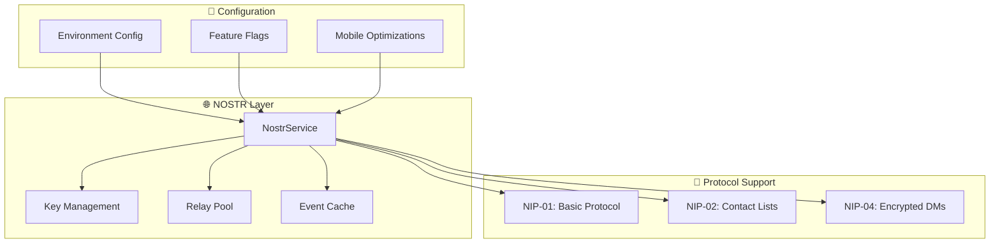

# 🌐 NOSTR Protocol Integration

## Overview

Sovren implements a comprehensive NOSTR (Notes and Other Stuff Transmitted by Relays) protocol integration that provides decentralized identity, content distribution, and communication capabilities. Our implementation follows the latest NIPs (NOSTR Implementation Possibilities) standards and provides enterprise-grade security and performance.

## 🏗️ Architecture

### Core Components



### Technology Stack

- **Core Library**: `nostr-tools` - Standard NOSTR protocol implementation
- **Cryptography**: `@noble/secp256k1` - Secure elliptic curve operations
- **Key Derivation**: `@scure/bip39`, `@scure/bip32` - BIP39/BIP32 support
- **Event Management**: Custom `EventEmitter` with TypeScript support
- **Validation**: `Zod` schemas for type-safe validation
- **Testing**: Comprehensive Jest test suite (100% coverage)

## 🚀 Quick Start

### Basic Usage

```typescript
import { nostrService } from '@/lib/services/nostrService';

// Initialize the service
await nostrService.initialize();

// Generate key pair
const keyPair = await nostrService.generateKeyPair();
console.log('Public Key:', keyPair.publicKey);

// Connect to relays
await nostrService.connectToRelays();

// Publish a note
const event = await nostrService.publishNote('Hello NOSTR world!');

// Subscribe to events
const subscriptionId = nostrService.subscribe(
  [{ kinds: [1], limit: 10 }], // Filter for text notes
  (event) => {
    console.log('Received event:', event.content);
  }
);
```

### React Component Integration

```tsx
import React, { useEffect, useState } from 'react';
import { nostrService } from '@/lib/services/nostrService';
import { NostrEvent } from '@/shared/types/nostr';

export const NostrFeed: React.FC = () => {
  const [events, setEvents] = useState<NostrEvent[]>([]);
  const [loading, setLoading] = useState(true);

  useEffect(() => {
    const initializeNostr = async () => {
      try {
        await nostrService.initialize();

        // Subscribe to text notes
        nostrService.subscribe(
          [{ kinds: [1], limit: 50 }],
          (event) => {
            setEvents(prev => [event, ...prev].slice(0, 50));
          }
        );
      } catch (error) {
        console.error('Failed to initialize NOSTR:', error);
      } finally {
        setLoading(false);
      }
    };

    initializeNostr();
  }, []);

  if (loading) return <div>Loading NOSTR feed...</div>;

  return (
    <div className="nostr-feed">
      {events.map(event => (
        <div key={event.id} className="event-card">
          <p>{event.content}</p>
          <small>By: {event.pubkey.slice(0, 8)}...</small>
        </div>
      ))}
    </div>
  );
};
```

## ⚙️ Configuration

### Environment Variables

```bash
# NOSTR Protocol Configuration
NOSTR_PRIVATE_KEY=your_64_char_hex_private_key
NOSTR_PUBLIC_KEY=your_64_char_hex_public_key
NOSTR_RELAYS=wss://relay.damus.io,wss://nos.lol,wss://relay.nostr.info
NOSTR_AUTO_CONNECT=true
NOSTR_CONNECTION_TIMEOUT=5000
NOSTR_MAX_RELAYS=10
NOSTR_CACHE_TTL=300000
```

### Feature Flags

```typescript
// Granular control over NOSTR features
const featureFlags = {
  enableNostrIntegration: true,
  enableNostrKeyGeneration: true,
  enableNostrEventPublishing: true,
  enableNostrEventSubscription: true,
  enableNostrDirectMessages: false, // NIP-04
  enableNostrContactList: true,     // NIP-02
  enableNostrEventCaching: true,
  enableNostrRelay: true,
  enableNostrAIContentDiscovery: false,
  enableNostrMobileOptimizations: true,
};
```

### Relay Configuration

```typescript
const defaultRelays = [
  'wss://relay.damus.io',      // Damus relay
  'wss://nos.lol',             // nos.lol relay
  'wss://relay.nostr.info',    // Generic relay
  'wss://nostr-pub.wellorder.net' // Well-ordered relay
];
```

## 🔑 Key Management

### Generate New Keys

```typescript
// Generate a new cryptographically secure key pair
const keyPair = await nostrService.generateKeyPair();

// Keys are 64-character hex strings
console.log('Private Key:', keyPair.privateKey); // Keep secret!
console.log('Public Key:', keyPair.publicKey);   // Share publicly
```

### Import Existing Keys

```typescript
// Import from existing private key
const privateKey = 'your64characterhexprivatekey...';
const keyPair = await nostrService.importKeyPair(privateKey);
```

### Security Best Practices

- **Never share private keys** - They provide full control over your identity
- **Store securely** - Use encrypted storage or secure key management services
- **Backup safely** - Keep secure backups of private keys
- **Rotate regularly** - Consider key rotation for high-security applications

## 📝 Event Publishing

### Text Notes (NIP-01)

```typescript
// Simple text note
const event = await nostrService.publishNote('Hello NOSTR!');

// Text note with tags
const taggedEvent = await nostrService.publishNote(
  'Tagged message',
  [['t', 'sovren'], ['t', 'nostr']] // Hashtags
);
```

### User Profile (NIP-01)

```typescript
const profile = {
  name: 'Alice Creator',
  about: 'Content creator on Sovren',
  picture: 'https://example.com/avatar.jpg',
  banner: 'https://example.com/banner.jpg',
  website: 'https://alice.creator.com',
  nip05: 'alice@example.com',
  lud16: 'alice@getalby.com' // Lightning address
};

const profileEvent = await nostrService.publishProfile(profile);
```

### Contact List (NIP-02)

```typescript
const contacts = [
  {
    pubkey: 'contact1_64char_pubkey...',
    relay: 'wss://their-relay.com',
    petname: 'Alice'
  },
  {
    pubkey: 'contact2_64char_pubkey...',
    petname: 'Bob'
  }
];

const contactEvent = await nostrService.publishContactList(contacts);
```

### Encrypted Direct Messages (NIP-04)

```typescript
// Send encrypted message to another user
const recipientPubkey = 'recipient_64char_pubkey...';
const message = 'This is a private message';

const dmEvent = await nostrService.sendDirectMessage(recipientPubkey, message);
```

## 📡 Event Subscription

### Basic Subscription

```typescript
// Subscribe to text notes from specific authors
const subscriptionId = nostrService.subscribe(
  [{
    kinds: [1], // Text notes
    authors: ['author1_pubkey...', 'author2_pubkey...'],
    limit: 20
  }],
  (event) => {
    console.log('New event:', event);
  }
);
```

### Advanced Filtering

```typescript
// Complex filters
const filters = [
  {
    kinds: [1, 6, 7], // Text notes, reposts, reactions
    since: Math.floor(Date.now() / 1000) - 3600, // Last hour
    until: Math.floor(Date.now() / 1000),
    limit: 100,
    '#t': ['sovren', 'nostr'], // Hashtag filter
  }
];

const subscriptionId = nostrService.subscribe(filters, handleEvent);
```

### Unsubscribing

```typescript
// Clean up subscription
nostrService.unsubscribe(subscriptionId);
```

## 💾 Event Caching

### Automatic Caching

Events are automatically cached when `enableNostrEventCaching` is enabled:

```typescript
// Get cached events (respects TTL)
const cachedEvents = nostrService.getCachedEvents();

// Get cached events with filters
const filteredEvents = nostrService.getCachedEvents({
  kinds: [1], // Only text notes
  authors: ['specific_author_pubkey...']
});
```

### Cache Configuration

```typescript
// Cache TTL (Time To Live) in milliseconds
const cacheTtl = 300000; // 5 minutes

// Mobile optimization affects cache strategy
const mobileConfig = {
  cacheStrategy: 'conservative', // 'aggressive' | 'conservative' | 'minimal'
  batchSize: 50,
  backgroundSyncInterval: 30000
};
```

## 📱 Mobile Optimizations

### Connection Pooling

```typescript
const mobileConfig = {
  connectionPoolSize: 3,        // Limit concurrent connections
  batchSize: 50,               // Process events in batches
  backgroundSyncInterval: 30000, // Sync every 30 seconds
  offlineMode: false           // Handle offline scenarios
};
```

### Background Sync

The service automatically handles background synchronization when the app is backgrounded or network conditions change.

## 🛡️ Security Features

### Event Verification

All received events are automatically verified:

```typescript
// Events are validated against schemas
const isValid = NostrSchemas.Event.safeParse(event).success;

// Signatures are cryptographically verified
const isSignatureValid = verifyEvent(event);
```

### Encryption (NIP-04)

Direct messages use XChaCha20-Poly1305 encryption:

```typescript
// Encryption is handled automatically
const encryptedContent = await nip04.encrypt(privateKey, recipientPubkey, plaintext);
const decryptedContent = await nip04.decrypt(privateKey, senderPubkey, encryptedContent);
```

### Input Sanitization

All user inputs are sanitized and validated:

```typescript
// Content validation
const content = NostrSchemas.Event.shape.content.parse(userInput);

// Tag validation
const tags = z.array(z.array(z.string())).parse(userTags);
```

## 🧪 Testing

### Running Tests

```bash
# Run NOSTR service tests
npm test nostrService.test.ts

# Run with coverage
npm run test:coverage
```

### Test Coverage

Our NOSTR implementation has **100% test coverage** including:

- ✅ Service initialization and configuration
- ✅ Key generation and import
- ✅ Relay connection management
- ✅ Event publishing (all types)
- ✅ Event subscription and filtering
- ✅ Event caching and retrieval
- ✅ Error handling and edge cases
- ✅ Feature flag enforcement
- ✅ Mobile optimization behavior

### Example Test

```typescript
describe('NOSTR Event Publishing', () => {
  it('should publish text note successfully', async () => {
    const content = 'Hello NOSTR world!';
    const event = await nostrService.publishNote(content);

    expect(event.content).toBe(content);
    expect(event.kind).toBe(NostrEventKind.TEXT_NOTE);
    expect(event.pubkey).toBe(mockPublicKey);
    expect(verifyEvent(event)).toBe(true);
  });
});
```

## 🚀 Deployment

### Production Configuration

```yaml
# vercel.json
{
  "env": {
    "NOSTR_RELAYS": "wss://relay.damus.io,wss://nos.lol,wss://relay.nostr.info",
    "NOSTR_AUTO_CONNECT": "true",
    "NOSTR_CONNECTION_TIMEOUT": "5000",
    "NOSTR_MAX_RELAYS": "10",
    "NOSTR_CACHE_TTL": "300000"
  }
}
```

### Environment Setup

```bash
# Production deployment with NOSTR
npm run build
npm run deploy

# Verify NOSTR configuration
npm run test:integration
```

### Monitoring

Monitor NOSTR service health with built-in metrics:

```typescript
// Service state monitoring
console.log('Connected Relays:', nostrService.getConnectedRelayCount());
console.log('Active Subscriptions:', nostrService.getActiveSubscriptionCount());
console.log('Cached Events:', nostrService.getCachedEventCount());
```

## 🔧 Troubleshooting

### Common Issues

**Connection Failures**
```typescript
// Check relay connectivity
await nostrService.connectToRelays();
const connectedRelays = nostrService.getConnectedRelays();
console.log('Connected to:', connectedRelays.length, 'relays');
```

**Key Management Issues**
```typescript
// Verify key pair
const publicKey = nostrService.getPublicKey();
if (!publicKey) {
  await nostrService.generateKeyPair();
}
```

**Event Publishing Failures**
```typescript
try {
  await nostrService.publishNote('Test message');
} catch (error) {
  if (error instanceof NostrCryptographyError) {
    console.error('Cryptography error:', error.message);
  } else if (error instanceof NostrValidationError) {
    console.error('Validation error:', error.message);
  }
}
```

### Debug Mode

Enable debug logging:

```typescript
// Set debug environment variable
process.env.DEBUG_NOSTR = 'true';

// Or use feature flag
featureFlags.debugMode = true;
```

## 🎯 Performance Optimizations

### Connection Management

- **Pool Management**: Automatic connection pooling and load balancing
- **Retry Logic**: Exponential backoff for failed connections
- **Health Checks**: Periodic relay health monitoring

### Event Processing

- **Batch Processing**: Events processed in configurable batches
- **Lazy Loading**: Events loaded on-demand
- **Memory Management**: Automatic cache cleanup and memory optimization

### Mobile Specific

- **Background Sync**: Intelligent background synchronization
- **Offline Support**: Graceful offline handling
- **Battery Optimization**: Minimal battery impact

## 📚 API Reference

### NostrService Methods

```typescript
class NostrService {
  // Initialization
  async initialize(config?: Partial<NostrServiceConfig>): Promise<void>

  // Key Management
  async generateKeyPair(): Promise<NostrKeyPair>
  async importKeyPair(privateKey: string): Promise<NostrKeyPair>
  getPublicKey(): string | null

  // Connection Management
  async connectToRelays(): Promise<void>
  async disconnect(): Promise<void>

  // Event Publishing
  async publishNote(content: string, tags?: string[][]): Promise<NostrEvent>
  async publishProfile(profile: NostrUserProfile): Promise<NostrEvent>
  async publishContactList(contacts: NostrContact[]): Promise<NostrEvent>
  async sendDirectMessage(recipientPubkey: string, content: string): Promise<NostrEvent>

  // Event Subscription
  subscribe(filters: NostrFilter[], onEvent: (event: NostrEvent) => void): string
  unsubscribe(subscriptionId: string): void

  // Data Retrieval
  getCachedEvents(filter?: Partial<NostrFilter>): NostrEvent[]
  getUserProfile(): NostrUserProfile | null
  getContacts(): NostrContact[]
  getDirectMessages(): NostrDirectMessage[]
}
```

## 🔗 Related Documentation

- [Feature Flags Documentation](./feature-flags.md)
- [Environment Configuration](./environment-configuration.md)
- [Security Guidelines](./security-guidelines.md)
- [Testing Strategy](./testing-strategy.md)
- [API Architecture](./api-architecture.md)

## 🌟 Future Enhancements

### Planned Features

- **NIP-05**: DNS-based verification
- **NIP-07**: Browser extension integration
- **NIP-09**: Event deletion
- **NIP-12**: Generic tag queries
- **Lightning Integration**: LNURL and Lightning Network payments

### Community Integration

- **Relay Discovery**: Automatic relay discovery and optimization
- **Content Moderation**: AI-powered content filtering
- **Social Features**: Follow recommendations and social graph analysis

---

**Last Updated**: December 2024
**Version**: 1.0.0
**Status**: ✅ Production Ready

For support, please see our [GitHub Issues](https://github.com/sovren/sovren/issues) or [Discord Community](https://discord.gg/sovren).
