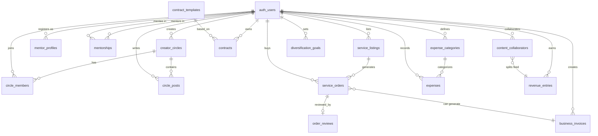

# Wave 2 Implementation — EPIC-009B, EPIC-010, EPIC-011

## Enhancement Summary

**Deepened on:** 2026-02-18
**Research agents used:** 12 (architecture-strategist, security-sentinel, performance-oracle, data-integrity-guardian, kieran-typescript-reviewer, pattern-recognition-specialist, code-simplicity-reviewer, best-practices-researcher, framework-docs-researcher, lightning-specialist, nostr-specialist, database-schema-architect)
**Context7 docs queried:** BullMQ Job Scheduler API, Supabase RLS Patterns

### Critical Findings (P0 — Must Fix Before Implementation)

1. **Pre-flight commit required for shared files** — `types.ts`, `bootstrap.ts`, `v2/index.ts` will be modified by all 3 teams. Add all 10 new DI tokens (including NostrReplyAdapter) + 8 new route mounts + SERVICE_LIFETIMES entries in a single pre-flight commit BEFORE spawning teams. (6 agents flagged, refined in review round 2)
2. **Rename InvoiceService to BusinessInvoiceService** — Existing Phase 5 `InvoiceService` token at `types.ts:199` collides with EPIC-011's proposed service. Rename across all layers: token, interface, implementation, route, frontend hook. (5 agents flagged)
3. **Switch `revenue_split_pct NUMERIC(5,2)` to `revenue_split_bps INTEGER`** — Basis points (0-10000) eliminate floating-point rounding in sat allocations. Use largest-remainder algorithm for distribution. (4 agents flagged)
4. **Fix `content_collaborators.content_id` type** — Plan had `BIGINT` but `content.id` is `UUID`. Must be `UUID REFERENCES content(id)`. (2 agents flagged)
5. **30-day HODL invoice escrow is impossible** — Lightning HTLC max is ~14 days. Must use custodial escrow with standard LNbits invoices. Amend ADR-025. (Lightning specialist confirmed)
6. **BOLT11 invoices expire in ~1h** — Cannot use for 30-day business invoices. Use LNURL-pay for dynamic invoice generation behind payment links. (Lightning specialist confirmed)
7. **Fix pre-existing webhook INSERT vulnerability** — `20251024000000_add_webhook_event_log.sql` lines 141-144 allow any authenticated user to INSERT webhooks. Fix BEFORE Wave 2. (Security sentinel flagged)

### High-Priority Findings (P1 — Should Fix During Implementation)

8. **UUID PKs everywhere** — All new tables should use `UUID PRIMARY KEY DEFAULT gen_random_uuid()`, not `BIGSERIAL`. Consistent with existing schema. (DB architect)
9. **Escrow state machine trigger** — Add `trg_order_state_machine` following existing `transition_payment_state()` pattern. DB-level enforcement of valid transitions. (4 agents)
10. **Revenue split trigger** — Two-layer validation: trigger blocks sum >10000 bps, service layer enforces sum =10000 bps. (DB architect)
11. **RLS policies for all 14 tables** — Comprehensive policies provided by DB architect. Use `(select auth.uid())` for initPlan optimization (100x perf). (Framework docs + DB architect)
12. **ON DELETE RESTRICT for financial tables** — `service_orders`, `invoices`, `revenue_entries`, `expenses` must use RESTRICT not CASCADE. (Data integrity guardian)
13. **Missing tables** — `mentor_profiles`, `reply_templates`, `circle_posts` needed for complete feature coverage. (DB architect)
14. **Batch polling approach** — 10 aggregated polling jobs (one per platform-interval combo) instead of 5000 per-creator repeatable jobs. Saves ~1-1.5GB Redis memory. (Performance oracle + Framework docs)
15. **NOSTR reply is silently broken** — `UnifiedInboxService.reply()` returns void for NOSTR platform. Implement `NostrReplyAdapter` with kind:1 events and NIP-10 threading. (NOSTR specialist)
16. **NIP-17 for collaboration invitations** — Use NIP-17 (not deprecated NIP-04) for private DMs. (NOSTR specialist)
17. **BTC-to-USD rate TTL too stale** — 1h TTL means tax USD values could be off by 5-10%. Use 5-minute TTL for active tax calculations, 1h for display only. (Performance oracle)
18. **Compound indexes needed** — `inbox_messages(creator_id, platform, status, created_at)` and `platform_metrics_history(creator_id, platform, recorded_at)`. (Performance oracle)
19. **Domain-based binding module names** — Use `community.bindings.ts` and `finance.bindings.ts`, not `phase9.bindings.ts` and `phase10.bindings.ts`. (3 agents)

### New Considerations Discovered

- Revenue splits are inherently custodial (wallets can't pay multi-invoice atomically) — impacts ADR-021 non-custodial claim
- Circle messaging should use Supabase for MVP, not NIP-28/29 (NIP-28 is public, NIP-29 needs specialized relay)
- Sequential attestation chain needed for multi-author provenance (not parallel signing)
- `Sats` branded type (`type Sats = number & { readonly __brand: 'sats' }`) would prevent sat/USD mixing — but keep simple; all 3 reviewers flagged branded types as potentially over-engineered. Consider plain `number` if branded types add friction
- Need `asyncHandler` utility to eliminate route handler boilerplate across 10 route files

### Plan Review Applied (2026-02-18)

**Reviewers:** DHH-style, Kieran-TypeScript, Code-Simplicity
**Critical fixes applied:**

| #   | Issue                                                                                    | Fix                                                                             | Reviewer |
| --- | ---------------------------------------------------------------------------------------- | ------------------------------------------------------------------------------- | -------- |
| R1  | `escrow_funded -> expired` invalid — custodial funds must be returned                    | Removed `expired` from `escrow_funded` transitions; auto-expire uses `refunded` | Kieran   |
| R2  | `business_invoices` missing state machine trigger                                        | Added `transition_invoice_state()` trigger matching `service_orders` pattern    | Kieran   |
| R3  | `circle_members` RLS self-referencing subquery causes recursion                          | Added `get_user_circle_ids()` SECURITY DEFINER function                         | Kieran   |
| R4  | `inbox.routes.ts` / `analytics-crossplatform.routes.ts` may already exist from EPIC-009A | Changed from "new" to "extend existing if present"                              | Kieran   |
| R5  | Timeline 2-3 weeks unrealistic for 3 enterprise-tier parallel epics                      | Adjusted to 3-4 weeks                                                           | All 3    |
| R6  | Service count wrong (says 8, lists 10)                                                   | Fixed to 10                                                                     | DHH      |
| R7  | GenericStateMachine over-engineering                                                     | Removed from open questions — keep per-domain SQL triggers                      | All 3    |
| R8  | Branded types may add friction                                                           | Added caveat — consider plain `number` if branded types cause DX issues         | All 3    |

**Round 2 fixes applied:**

| #   | Issue                                                                           | Fix                                                                      | Reviewer     |
| --- | ------------------------------------------------------------------------------- | ------------------------------------------------------------------------ | ------------ |
| R9  | `bootstrap.ts` passes `container` but functions take `registry` (compile error) | Fixed to `registerCommunityServices(registry)`                           | DHH          |
| R10 | Pre-flight imports binding stubs that don't exist yet                           | Added stub file creation step with no-op functions                       | DHH          |
| R11 | NostrReplyAdapter has no DI token, interface, or binding                        | Added 10th DI token + interface + registration in `phase8.bindings.ts`   | DHH + Kieran |
| R12 | SERVICE_LIFETIMES, SERVICE_DEPENDENCIES not updated for 10 new tokens           | Added explicit step to update all 3 maps                                 | Kieran       |
| R13 | InboxPollingService binding target unspecified                                  | Specified: extends `phase8.bindings.ts` (distribution domain)            | Kieran       |
| R14 | `get_user_circle_ids()` SECURITY DEFINER missing hardening                      | Added `SET search_path = ''`, `REVOKE`/`GRANT` for authenticated only    | Kieran       |
| R15 | Pre-flight route stubs include 2 already-mounted routes                         | Removed `/inbox` and `/analytics/cross-platform` — only add 8 new mounts | All 3        |
| R16 | `service_orders` FKs missing `ON DELETE RESTRICT`                               | Added to `listing_id`, `buyer_id`, `seller_id`                           | DHH          |
| R17 | `mentor_profiles` missing niche+active index                                    | Added `idx_mentor_profiles_niche_active` partial index                   | DHH          |

**Acknowledged but NOT applied** (require discussion or are user-overridden):

- DHH: Consolidate 10 services to 4 — kept as-is for domain separation (each service is owned by a different team member)
- DHH/Simplicity: Downgrade EPIC-011 to standard tier — **overridden by user instruction** (all enterprise)
- Simplicity: Remove SQL from plan — kept for implementer reference (teams skip research phase with concrete SQL)
- Simplicity: Defer AudienceOverlap, PlatformROI, ExpenseTracker, DiversificationGoals, TemplateManager, BatchActionToolbar, RedFlagReport, ContractEditor — these are core acceptance criteria per PRD, deferral would reduce epic scope

---

## Overview

Wave 2 delivers three epics in parallel, completing the Sovren v2 creator empowerment platform:

1. **EPIC-009B** (Unified Inbox + Cross-Platform Analytics) — Extends the Multi-Platform Hub with inbox polling, cross-platform analytics, and adaptive rate limiting. Enterprise tier, 1-1.5 weeks.
2. **EPIC-010** (Creator Network) — Circles, Mentorship, Collaborative Content with revenue splits, and a Creator Marketplace with Lightning escrow. Enterprise tier, 2-2.5 weeks.
3. **EPIC-011** (Business Manager) — Contract templates with red flag analysis, invoicing with Lightning payment links, revenue diversification planning, and tax preparation. Enterprise tier, 1-1.5 weeks.

All Wave 1 dependencies are met (EPIC-007 Wellness, EPIC-008 Content Shield, EPIC-009A Distribution). The only remaining PRD open question — multi-platform API rate limits — was resolved in the [brainstorm](../brainstorms/2026-02-18-wave2-api-limits-brainstorm.md): X/Twitter uses creator BYOK ($200/mo), all other platforms use generous free tiers, and adaptive 5min/30min polling keeps usage well within limits.

**Total scope**: 24 stories, ~55 story points, 10 route files (2 extend existing, 8 new), 8 new migrations, 2 new frontend feature modules, 10 new backend services, 4 new ADRs.

## Problem Statement / Motivation

Phase 1 built the creator toolkit foundation (wellness monitoring, content fingerprinting, multi-platform distribution). Wave 2 transforms Sovren from a content management tool into a **complete creator economy platform**:

- **Inbox fragmentation** — Creators manage 5+ platform inboxes. Unified inbox with cross-platform analytics saves hours/day.
- **Creator isolation** — No tools connect creators for peer support, mentorship, or collaboration. Creator Network fills this gap.
- **Business chaos** — Creators lack contract review, invoicing, tax tools. Business Manager professionalizes creator operations.

## Proposed Solution

### Architecture: Three Parallel Tracks

```
Wave 2 (Parallel Execution)
├── Track A: EPIC-009B (Enterprise Tier)
│   ├── Unified Inbox Backend + UI
│   ├── Cross-Platform Analytics Backend + UI
│   ├── Adaptive Polling via BullMQ
│   └── X/Twitter BYOK API Key Flow
│
├── Track B: EPIC-010 (Enterprise Tier)
│   ├── Creator Circles + Mentorship
│   ├── Collaborative Content + Revenue Splits
│   ├── Creator Marketplace + Custodial Escrow
│   └── Circle Messaging (Supabase MVP)
│
└── Track C: EPIC-011 (Enterprise Tier)
    ├── Contract Templates + Red Flag Analyzer
    ├── Invoice Generator + LNURL-pay Payment Links
    ├── Revenue Diversification Planner
    └── Tax Preparation Assistant
```

### Cross-Epic Integration Points

| Source                    | Target                   | Integration                                                 |
| ------------------------- | ------------------------ | ----------------------------------------------------------- |
| EPIC-009B (polling)       | EPIC-012 (future)        | Shared polling infrastructure for subscriber health metrics |
| EPIC-010 (revenue splits) | EPIC-009A (distribution) | Co-authored content uses existing cross-post infrastructure |
| EPIC-010 (marketplace)    | EPIC-011 (invoices)      | Marketplace orders can generate invoices                    |
| EPIC-010 (escrow)         | EPIC-011 (revenue)       | Escrow settlements feed revenue breakdown                   |
| EPIC-008 (provenance)     | EPIC-010 (collab)        | Co-author provenance chain uses EPIC-008 fingerprinting     |

### Research Insights: Architecture

**Pre-Flight Commit (MANDATORY — Phase 0)**:
All 3 enterprise teams will modify `types.ts`, `bootstrap.ts`, and `v2/index.ts`. To prevent merge conflicts:

1. Create a single pre-flight commit adding all 10 new DI tokens to `types.ts` (9 services + NostrReplyAdapter)
2. Add SERVICE_LIFETIMES, SERVICE_DEPENDENCIES, SERVICE_TAGS entries for all 10 tokens
3. Create stub binding module files (`community.bindings.ts`, `finance.bindings.ts`) and register in `bootstrap.ts`
4. Add EPIC-009B service registrations to existing `phase8.bindings.ts`
5. Add 8 new route mounts to `v2/index.ts` (skip `/inbox` and `/analytics/cross-platform` — already mounted)
6. Merge to the branch before spawning any team

**Domain-Based Naming**:

- Use `community.bindings.ts` (not `phase9.bindings.ts`) and `finance.bindings.ts` (not `phase10.bindings.ts`)
- Use `community/` service directory (not `creator-network/` — match the frontend module name)
- Use `finance/` service directory (already correct)

**Shared Abstractions to Create in Pre-Flight**:

```typescript
// packages/backend/src/utils/asyncHandler.ts
// Wraps route handlers to catch async errors — eliminates try/catch boilerplate in 10 route files
export const asyncHandler =
  (fn: RequestHandler): RequestHandler =>
  (req, res, next) =>
    Promise.resolve(fn(req, res, next)).catch(next);

// packages/shared/src/types/branded.ts
// Branded types to prevent sat/USD mixing at compile time
export type Sats = number & { readonly __brand: 'sats' };
export type Bps = number & { readonly __brand: 'bps' }; // basis points
```

**EventBus Insufficiency**: For cross-epic communication (e.g., marketplace order -> invoice generation), the existing in-process EventBus is insufficient if teams deploy independently. Use BullMQ queues for cross-epic events that must survive restarts.

## Technical Approach

### Phase 0: Pre-Flight Commit (Day 0)

**Before spawning any enterprise team**, create a single commit with:

1. **10 new DI tokens** in `packages/backend/src/container/types.ts`:

```typescript
// EPIC-009B
import type { IInboxPollingService } from '../interfaces/distribution/IInboxPollingService';
import type { INostrReplyAdapter } from '../interfaces/distribution/INostrReplyAdapter';
InboxPollingService: ServiceToken<IInboxPollingService>,
NostrReplyAdapter: ServiceToken<INostrReplyAdapter>,

// EPIC-010
import type { ICreatorCircleService } from '../interfaces/community/ICreatorCircleService';
import type { IMentorshipService } from '../interfaces/community/IMentorshipService';
import type { ICollaborativeContentService } from '../interfaces/community/ICollaborativeContentService';
import type { IMarketplaceService } from '../interfaces/community/IMarketplaceService';
CreatorCircleService: ServiceToken<ICreatorCircleService>,
MentorshipService: ServiceToken<IMentorshipService>,
CollaborativeContentService: ServiceToken<ICollaborativeContentService>,
MarketplaceService: ServiceToken<IMarketplaceService>,

// EPIC-011 (NOTE: BusinessInvoiceService, NOT InvoiceService — avoids collision with existing Phase 5 token)
import type { IContractService } from '../interfaces/finance/IContractService';
import type { IBusinessInvoiceService } from '../interfaces/finance/IBusinessInvoiceService';
import type { IRevenueService } from '../interfaces/finance/IRevenueService';
import type { ITaxService } from '../interfaces/finance/ITaxService';
ContractService: ServiceToken<IContractService>,
BusinessInvoiceService: ServiceToken<IBusinessInvoiceService>,
RevenueService: ServiceToken<IRevenueService>,
TaxService: ServiceToken<ITaxService>,
```

2. **Create stub binding module files** (must exist before `bootstrap.ts` imports them):

```typescript
// packages/backend/src/container/bindings/community.bindings.ts (NEW STUB)
import type { ServiceRegistry } from '../ServiceRegistry';
export function registerCommunityServices(registry: ServiceRegistry): void {
  // EPIC-010 services registered here during implementation
}

// packages/backend/src/container/bindings/finance.bindings.ts (NEW STUB)
import type { ServiceRegistry } from '../ServiceRegistry';
export function registerFinanceServices(registry: ServiceRegistry): void {
  // EPIC-011 services registered here during implementation
}
```

3. **Register in `bootstrap.ts`** (NOTE: functions take `registry`, NOT `container`):

```typescript
import { registerCommunityServices } from './container/bindings/community.bindings';
import { registerFinanceServices } from './container/bindings/finance.bindings';
// Register after existing Phase 8 bindings (before container = registry.createContainer())
registerCommunityServices(registry);
registerFinanceServices(registry);
```

4. **Add EPIC-009B services to existing `phase8.bindings.ts`**:

```typescript
// Extend existing phase8.bindings.ts with EPIC-009B services
registry.registerSingletonFactory(SERVICE_TOKENS.InboxPollingService, ...);
registry.registerSingletonFactory(SERVICE_TOKENS.NostrReplyAdapter, ...);
```

5. **Add all 10 new tokens to `SERVICE_LIFETIMES.singleton`** in `types.ts`:

```typescript
// Add to SERVICE_LIFETIMES.singleton array:
'InboxPollingService', 'NostrReplyAdapter',
'CreatorCircleService', 'MentorshipService', 'CollaborativeContentService', 'MarketplaceService',
'ContractService', 'BusinessInvoiceService', 'RevenueService', 'TaxService',
```

6. **Route mount stubs** in `v2/index.ts` (8 NEW mounts only — `/inbox` and `/analytics/cross-platform` already exist):

```typescript
// EPIC-009B: /inbox and /analytics/cross-platform already mounted — NO CHANGES NEEDED
// EPIC-010
router.use('/circles', circlesRoutes);
router.use('/mentorship', mentorshipRoutes);
router.use('/content', collaborationRoutes); // extends existing content routes
router.use('/marketplace', marketplaceRoutes);
// EPIC-011
router.use('/business/contracts', contractRoutes);
router.use('/business/invoices', invoiceRoutes);
router.use('/business/revenue', revenueRoutes);
router.use('/business/tax', taxRoutes);
```

4. **Shared utilities**: `asyncHandler.ts`, branded types (`Sats`, `Bps`)

5. **Fix pre-existing webhook vulnerability** (`20251024000000_add_webhook_event_log.sql`):
   - Restrict webhook INSERT to service role only
   - Add HMAC verification to webhook processing functions

### Phase 1: Data Models & Infrastructure (Days 1-2)

All three epics start with database migrations and DI setup. These are independent and run in parallel.

#### 1A. EPIC-009B Infrastructure

**Adaptive Polling Setup** (extends existing BullMQ):

- Add `poll_interval` field to `platform_connections` table
- BullMQ Job Scheduler per platform-interval group (NOT per-creator — see Research Insights)
- Session activity tracked via last API request timestamp
- Switch interval: 5min (active) <-> 30min (idle threshold: 15min no requests)

**X/Twitter BYOK Flow**:

- Add `api_key_encrypted` column to `platform_connections` (AES-256-GCM via existing `crypto.ts`)
- **Use separate encryption key from OAuth tokens** (dedicated `X_API_KEY_ENCRYPTION_KEY` env var)
- Validation endpoint: test read with provided key before storing
- Graceful degradation: write-only mode if no API key

**Files to modify**:

- `supabase/migrations/20260220000000_epic009b_adaptive_polling.sql` — Add poll_interval, api_key_encrypted columns, inbox_messages table, reply_templates table
- `packages/backend/src/services/distribution/adapters/` — Add BYOK key resolution to Twitter adapter
- `packages/backend/src/services/distribution/UnifiedInboxService.ts` — Extend with adaptive polling logic
- `packages/backend/src/services/distribution/InboxPollingService.ts` — NEW: BullMQ job scheduler management

#### Research Insights: Adaptive Polling (BullMQ + Performance)

**Batch Polling Architecture** (Performance Oracle + Framework Docs):

Instead of creating one BullMQ repeatable job per creator-platform pair (which would be ~5000 jobs for 1000 creators x 5 platforms, consuming ~1-1.5GB Redis), use a batch approach:

```typescript
// 10 aggregated polling jobs (one per platform-interval combo)
// e.g., "twitter-5min", "twitter-30min", "bluesky-5min", "bluesky-30min", etc.
await queue.upsertJobScheduler(
  'twitter-active-poll',
  { pattern: '*/5 * * * *' }, // every 5 minutes
  {
    name: 'batch-poll',
    data: { platform: 'twitter', interval: 'active' },
  }
);

// Each job fetches the list of active creators for that platform-interval
// and polls them in a batched loop
```

**BullMQ v5.16+ Job Scheduler API** (Context7 docs):

- Use `upsertJobScheduler` (NOT legacy `repeat`) for dynamic interval management
- Upsert semantics: calling with same scheduler ID updates the pattern without creating duplicates
- Use `removeJobScheduler` when a creator disconnects a platform
- Worker concurrency: set to 50+ for I/O-bound polling operations

**Dynamic Interval Switching**:

```typescript
// When creator session transitions active -> idle:
await queue.upsertJobScheduler(
  `${platform}-${creatorId}`, // unique scheduler ID
  { pattern: '*/30 * * * *' }, // switch to 30min
  { name: 'poll', data: { creatorId, platform } }
);
// upsert replaces the existing scheduler — no need to remove + recreate
```

**Required Indexes** (Performance Oracle):

```sql
CREATE INDEX idx_inbox_messages_creator_platform_status
  ON inbox_messages(creator_id, platform, status, created_at DESC);

CREATE INDEX idx_platform_metrics_history_creator_platform
  ON platform_metrics_history(creator_id, platform, recorded_at DESC);
```

#### 1B. EPIC-010 Data Model (US-E10-001, P0-CRITICAL)

**New tables** (4 migrations, all using UUID PKs):

```sql
-- Migration: 20260220100000_epic010_creator_circles.sql
CREATE TABLE creator_circles (
  id UUID PRIMARY KEY DEFAULT gen_random_uuid(),
  name TEXT NOT NULL,
  description TEXT,
  niche TEXT,
  max_members INT DEFAULT 20 CHECK (max_members BETWEEN 5 AND 20),
  created_by UUID NOT NULL REFERENCES auth.users(id) ON DELETE CASCADE,
  created_at TIMESTAMPTZ DEFAULT now(),
  updated_at TIMESTAMPTZ DEFAULT now()
);

CREATE TABLE circle_members (
  id UUID PRIMARY KEY DEFAULT gen_random_uuid(),
  circle_id UUID NOT NULL REFERENCES creator_circles(id) ON DELETE CASCADE,
  creator_id UUID NOT NULL REFERENCES auth.users(id) ON DELETE CASCADE,
  role TEXT NOT NULL DEFAULT 'member' CHECK (role IN ('admin', 'member')),
  joined_at TIMESTAMPTZ DEFAULT now(),
  UNIQUE(circle_id, creator_id)
);

-- NEW TABLE (identified by DB architect): Circle posts for Supabase-based messaging MVP
CREATE TABLE circle_posts (
  id UUID PRIMARY KEY DEFAULT gen_random_uuid(),
  circle_id UUID NOT NULL REFERENCES creator_circles(id) ON DELETE CASCADE,
  author_id UUID NOT NULL REFERENCES auth.users(id) ON DELETE CASCADE,
  content TEXT NOT NULL,
  created_at TIMESTAMPTZ DEFAULT now()
);

-- RLS Policies
ALTER TABLE creator_circles ENABLE ROW LEVEL SECURITY;
CREATE POLICY "Creators can view circles they belong to or public circles"
  ON creator_circles FOR SELECT USING (
    created_by = (select auth.uid())
    OR id IN (SELECT get_user_circle_ids((select auth.uid())))
  );
CREATE POLICY "Creator can create circles"
  ON creator_circles FOR INSERT WITH CHECK (created_by = (select auth.uid()));
CREATE POLICY "Circle admin can update"
  ON creator_circles FOR UPDATE USING (created_by = (select auth.uid()));

-- SECURITY DEFINER function to avoid RLS recursion on circle_members self-lookup
CREATE OR REPLACE FUNCTION get_user_circle_ids(p_user_id UUID)
RETURNS SETOF UUID
LANGUAGE sql SECURITY DEFINER STABLE
SET search_path = '' AS $$
  SELECT circle_id FROM public.circle_members WHERE creator_id = p_user_id;
$$;

-- Harden: only authenticated users can call this function
REVOKE ALL ON FUNCTION get_user_circle_ids(UUID) FROM PUBLIC;
GRANT EXECUTE ON FUNCTION get_user_circle_ids(UUID) TO authenticated;

ALTER TABLE circle_members ENABLE ROW LEVEL SECURITY;
CREATE POLICY "Members can view circle membership"
  ON circle_members FOR SELECT USING (
    circle_id IN (SELECT get_user_circle_ids((select auth.uid())))
  );
CREATE POLICY "Circle admin can manage members"
  ON circle_members FOR ALL USING (
    circle_id IN (SELECT id FROM creator_circles WHERE created_by = (select auth.uid()))
  );

ALTER TABLE circle_posts ENABLE ROW LEVEL SECURITY;
CREATE POLICY "Circle members can view posts"
  ON circle_posts FOR SELECT USING (
    circle_id IN (SELECT get_user_circle_ids((select auth.uid())))
  );
CREATE POLICY "Members can post"
  ON circle_posts FOR INSERT WITH CHECK (
    author_id = (select auth.uid())
    AND circle_id IN (SELECT get_user_circle_ids((select auth.uid())))
  );

-- Indexes
CREATE INDEX idx_circle_members_creator ON circle_members(creator_id);
CREATE INDEX idx_circle_members_circle ON circle_members(circle_id);
CREATE INDEX idx_circle_posts_circle_created ON circle_posts(circle_id, created_at DESC);

-- Migration: 20260220100100_epic010_mentorships.sql
CREATE TABLE mentor_profiles (
  id UUID PRIMARY KEY DEFAULT gen_random_uuid(),
  creator_id UUID NOT NULL REFERENCES auth.users(id) ON DELETE CASCADE UNIQUE,
  niche TEXT NOT NULL,
  audience_size_range TEXT CHECK (audience_size_range IN ('0-1k', '1k-10k', '10k-100k', '100k+')),
  bio TEXT,
  max_mentees INT DEFAULT 3 CHECK (max_mentees BETWEEN 1 AND 10),
  active BOOLEAN DEFAULT true,
  created_at TIMESTAMPTZ DEFAULT now()
);

CREATE TABLE mentorships (
  id UUID PRIMARY KEY DEFAULT gen_random_uuid(),
  mentor_id UUID NOT NULL REFERENCES auth.users(id),
  mentee_id UUID NOT NULL REFERENCES auth.users(id),
  niche TEXT,
  goals JSONB DEFAULT '[]',
  status TEXT NOT NULL DEFAULT 'pending'
    CHECK (status IN ('pending', 'active', 'completed', 'declined')),
  started_at TIMESTAMPTZ,
  completed_at TIMESTAMPTZ,
  created_at TIMESTAMPTZ DEFAULT now()
);

-- RLS
ALTER TABLE mentor_profiles ENABLE ROW LEVEL SECURITY;
CREATE POLICY "Anyone can view active mentors"
  ON mentor_profiles FOR SELECT USING (active = true);
CREATE POLICY "Creator manages own profile"
  ON mentor_profiles FOR ALL USING (creator_id = (select auth.uid()));

ALTER TABLE mentorships ENABLE ROW LEVEL SECURITY;
CREATE POLICY "Participants can view own mentorships"
  ON mentorships FOR SELECT USING (
    mentor_id = (select auth.uid()) OR mentee_id = (select auth.uid())
  );
CREATE POLICY "Mentee can request"
  ON mentorships FOR INSERT WITH CHECK (mentee_id = (select auth.uid()));
CREATE POLICY "Participants can update"
  ON mentorships FOR UPDATE USING (
    mentor_id = (select auth.uid()) OR mentee_id = (select auth.uid())
  );

-- Indexes
CREATE INDEX idx_mentor_profiles_niche_active
  ON mentor_profiles(niche, active) WHERE active = true;
CREATE INDEX idx_mentorships_mentor ON mentorships(mentor_id);
CREATE INDEX idx_mentorships_mentee ON mentorships(mentee_id);

-- Migration: 20260220100200_epic010_collaborative_content.sql
CREATE TABLE content_collaborators (
  id UUID PRIMARY KEY DEFAULT gen_random_uuid(),
  content_id UUID NOT NULL REFERENCES content(id) ON DELETE CASCADE,
  creator_id UUID NOT NULL REFERENCES auth.users(id),
  revenue_split_bps INTEGER NOT NULL
    CHECK (revenue_split_bps > 0 AND revenue_split_bps <= 10000),
  status TEXT NOT NULL DEFAULT 'invited'
    CHECK (status IN ('invited', 'accepted', 'declined', 'removed')),
  invited_at TIMESTAMPTZ DEFAULT now(),
  accepted_at TIMESTAMPTZ,
  UNIQUE(content_id, creator_id)
);

-- Revenue split validation trigger (two-layer design):
-- Layer 1 (trigger): Block inserts/updates that would push sum > 10000 bps
-- Layer 2 (service): Enforce sum = 10000 bps before enabling content distribution
CREATE OR REPLACE FUNCTION validate_revenue_split_sum()
RETURNS TRIGGER AS $$
DECLARE
  total_bps INTEGER;
BEGIN
  SELECT COALESCE(SUM(revenue_split_bps), 0) INTO total_bps
  FROM content_collaborators
  WHERE content_id = NEW.content_id
    AND status IN ('invited', 'accepted')
    AND id != COALESCE(NEW.id, '00000000-0000-0000-0000-000000000000'::uuid);

  IF (total_bps + NEW.revenue_split_bps) > 10000 THEN
    RAISE EXCEPTION 'Revenue split sum would exceed 10000 bps (100%%). Current: %, Adding: %',
      total_bps, NEW.revenue_split_bps;
  END IF;
  RETURN NEW;
END;
$$ LANGUAGE plpgsql;

CREATE TRIGGER trg_validate_revenue_split
  BEFORE INSERT OR UPDATE ON content_collaborators
  FOR EACH ROW EXECUTE FUNCTION validate_revenue_split_sum();

-- RLS
ALTER TABLE content_collaborators ENABLE ROW LEVEL SECURITY;
CREATE POLICY "Collaborators can view own collaborations"
  ON content_collaborators FOR SELECT USING (
    creator_id = (select auth.uid())
    OR content_id IN (SELECT id FROM content WHERE creator_id = (select auth.uid()))
  );
CREATE POLICY "Content owner can invite"
  ON content_collaborators FOR INSERT WITH CHECK (
    content_id IN (SELECT id FROM content WHERE creator_id = (select auth.uid()))
  );

-- Migration: 20260220100300_epic010_marketplace.sql
CREATE TABLE service_listings (
  id UUID PRIMARY KEY DEFAULT gen_random_uuid(),
  creator_id UUID NOT NULL REFERENCES auth.users(id) ON DELETE CASCADE,
  service_type TEXT NOT NULL
    CHECK (service_type IN ('editing', 'writing', 'design', 'consulting', 'other')),
  title TEXT NOT NULL,
  description TEXT,
  price_sats BIGINT NOT NULL CHECK (price_sats > 0),
  portfolio_urls TEXT[] DEFAULT '{}',
  active BOOLEAN DEFAULT true,
  created_at TIMESTAMPTZ DEFAULT now(),
  updated_at TIMESTAMPTZ DEFAULT now()
);

CREATE TABLE service_orders (
  id UUID PRIMARY KEY DEFAULT gen_random_uuid(),
  listing_id UUID NOT NULL REFERENCES service_listings(id) ON DELETE RESTRICT,
  buyer_id UUID NOT NULL REFERENCES auth.users(id) ON DELETE RESTRICT,
  seller_id UUID NOT NULL REFERENCES auth.users(id) ON DELETE RESTRICT,
  status TEXT NOT NULL DEFAULT 'pending'
    CHECK (status IN ('pending', 'escrow_funded', 'in_progress',
                      'completed', 'disputed', 'refunded', 'expired')),
  escrow_invoice_id TEXT,
  escrow_payment_hash TEXT,
  amount_sats BIGINT NOT NULL,
  idempotency_key UUID NOT NULL UNIQUE,
  created_at TIMESTAMPTZ DEFAULT now(),
  funded_at TIMESTAMPTZ,
  completed_at TIMESTAMPTZ,
  disputed_at TIMESTAMPTZ,
  expires_at TIMESTAMPTZ DEFAULT (now() + INTERVAL '30 days')
);

-- Escrow state machine trigger (follows existing transition_payment_state pattern)
CREATE OR REPLACE FUNCTION transition_order_state()
RETURNS TRIGGER AS $$
DECLARE
  valid_transitions JSONB := '{
    "pending": ["escrow_funded", "expired"],
    "escrow_funded": ["in_progress", "refunded"],
    "in_progress": ["completed", "disputed"],
    "disputed": ["completed", "refunded"],
    "completed": [],
    "refunded": [],
    "expired": []
  }'::jsonb;
  -- NOTE: escrow_funded cannot -> expired directly. If time expires while
  -- funds are held, the auto-expire job must transition to "refunded" (not
  -- "expired") because custodial funds must be returned to the buyer.
  allowed_states JSONB;
BEGIN
  IF OLD.status = NEW.status THEN
    RETURN NEW;
  END IF;

  allowed_states := valid_transitions -> OLD.status;
  IF NOT allowed_states ? NEW.status THEN
    RAISE EXCEPTION 'Invalid order state transition: % -> %', OLD.status, NEW.status;
  END IF;

  -- Auto-set lifecycle timestamps
  IF NEW.status = 'escrow_funded' THEN NEW.funded_at := now(); END IF;
  IF NEW.status = 'completed' THEN NEW.completed_at := now(); END IF;
  IF NEW.status = 'disputed' THEN NEW.disputed_at := now(); END IF;

  RETURN NEW;
END;
$$ LANGUAGE plpgsql;

CREATE TRIGGER trg_order_state_machine
  BEFORE UPDATE ON service_orders
  FOR EACH ROW EXECUTE FUNCTION transition_order_state();

CREATE TABLE order_reviews (
  id UUID PRIMARY KEY DEFAULT gen_random_uuid(),
  order_id UUID NOT NULL REFERENCES service_orders(id) UNIQUE,
  reviewer_id UUID NOT NULL REFERENCES auth.users(id),
  rating INT NOT NULL CHECK (rating BETWEEN 1 AND 5),
  review_text TEXT,
  created_at TIMESTAMPTZ DEFAULT now()
);

-- RLS
ALTER TABLE service_listings ENABLE ROW LEVEL SECURITY;
CREATE POLICY "Anyone can view active listings"
  ON service_listings FOR SELECT USING (active = true);
CREATE POLICY "Creator manages own listings"
  ON service_listings FOR ALL USING (creator_id = (select auth.uid()));

ALTER TABLE service_orders ENABLE ROW LEVEL SECURITY;
CREATE POLICY "Buyer or seller can view order"
  ON service_orders FOR SELECT USING (
    buyer_id = (select auth.uid()) OR seller_id = (select auth.uid())
  );
CREATE POLICY "Buyer can create order"
  ON service_orders FOR INSERT WITH CHECK (buyer_id = (select auth.uid()));
CREATE POLICY "Participants can update order"
  ON service_orders FOR UPDATE USING (
    buyer_id = (select auth.uid()) OR seller_id = (select auth.uid())
  );

ALTER TABLE order_reviews ENABLE ROW LEVEL SECURITY;
CREATE POLICY "Anyone can view reviews"
  ON order_reviews FOR SELECT USING (true);
CREATE POLICY "Buyer can review completed order"
  ON order_reviews FOR INSERT WITH CHECK (
    reviewer_id = (select auth.uid())
    AND order_id IN (
      SELECT id FROM service_orders
      WHERE buyer_id = (select auth.uid()) AND status = 'completed'
    )
  );

-- Indexes
CREATE INDEX idx_listings_creator ON service_listings(creator_id);
CREATE INDEX idx_listings_type_active ON service_listings(service_type, active) WHERE active = true;
CREATE INDEX idx_orders_buyer ON service_orders(buyer_id);
CREATE INDEX idx_orders_seller ON service_orders(seller_id);
CREATE INDEX idx_orders_status ON service_orders(status);
CREATE INDEX idx_orders_expires ON service_orders(expires_at) WHERE status IN ('pending', 'escrow_funded');
```

**Research Insights: EPIC-010 Data Model**

**Lightning Escrow Pattern** (Lightning Specialist — CRITICAL):

- **30-day HODL invoices are NOT feasible**: Lightning HTLC max is ~14 days. Do NOT use HODL invoices for escrow.
- **Use custodial escrow**: Create standard LNbits invoice for buyer -> Sovren wallet. Upon completion, create payout invoice from Sovren wallet -> seller.
- **Three-layer payment detection**: Webhook (primary) + BullMQ poll (backup, every 30s) + user-triggered check (fallback)
- Store `escrow_payment_hash` for payment tracking, not just `escrow_invoice_id`
- **ADR-025 must be amended** to describe custodial escrow, not HODL invoices

**Revenue Split with Basis Points** (4 agents agreed):

```typescript
// Largest-remainder algorithm for sat allocation
function allocateSats(totalSats: number, splitsBps: number[]): number[] {
  const exact = splitsBps.map((bps) => (totalSats * bps) / 10000);
  const floored = exact.map(Math.floor);
  let remainder = totalSats - floored.reduce((a, b) => a + b, 0);
  const fractions = exact.map((e, i) => ({ i, frac: e - floored[i] }));
  fractions.sort((a, b) => b.frac - a.frac);
  for (let j = 0; j < remainder; j++) {
    floored[fractions[j].i]++;
  }
  return floored;
}
```

**NOSTR Integration** (NOSTR Specialist):

- Circle messaging: Use Supabase `circle_posts` table for MVP. NIP-28 is public (wrong for private circles), NIP-29 needs specialized relay.
- Collaboration invitations: Use NIP-17 (not deprecated NIP-04) for encrypted DMs.
- Multi-author provenance: Sequential attestation chain — each co-author signs the previous author's signature, creating a verifiable chain.
- Fix NOSTR reply bug: `UnifiedInboxService.reply()` silently returns void for NOSTR platform.

#### 1C. EPIC-011 Data Model (US-E11-001, P0-CRITICAL)

**New tables** (4 migrations, all UUID PKs):

```sql
-- Migration: 20260220200000_epic011_contracts.sql
CREATE TABLE contract_templates (
  id UUID PRIMARY KEY DEFAULT gen_random_uuid(),
  name TEXT NOT NULL,
  category TEXT NOT NULL
    CHECK (category IN ('sponsorship', 'licensing', 'freelance', 'collaboration', 'general')),
  template_text TEXT NOT NULL,
  red_flags JSONB DEFAULT '[]',
  created_at TIMESTAMPTZ DEFAULT now()
);

CREATE TABLE contracts (
  id UUID PRIMARY KEY DEFAULT gen_random_uuid(),
  creator_id UUID NOT NULL REFERENCES auth.users(id) ON DELETE RESTRICT,
  template_id UUID REFERENCES contract_templates(id),
  counterparty TEXT NOT NULL,
  filled_text TEXT NOT NULL,
  status TEXT NOT NULL DEFAULT 'draft'
    CHECK (status IN ('draft', 'sent', 'signed', 'expired', 'terminated')),
  signed_at TIMESTAMPTZ,
  created_at TIMESTAMPTZ DEFAULT now(),
  updated_at TIMESTAMPTZ DEFAULT now()
);

-- RLS
ALTER TABLE contract_templates ENABLE ROW LEVEL SECURITY;
CREATE POLICY "Anyone can view templates"
  ON contract_templates FOR SELECT USING (true);

ALTER TABLE contracts ENABLE ROW LEVEL SECURITY;
CREATE POLICY "Creator manages own contracts"
  ON contracts FOR ALL USING (creator_id = (select auth.uid()));

-- Migration: 20260220200100_epic011_business_invoices.sql
-- NOTE: Table named "business_invoices" to avoid collision with existing "invoices" concept
CREATE TABLE business_invoices (
  id UUID PRIMARY KEY DEFAULT gen_random_uuid(),
  creator_id UUID NOT NULL REFERENCES auth.users(id) ON DELETE RESTRICT,
  client_name TEXT NOT NULL,
  line_items JSONB NOT NULL DEFAULT '[]',
  total_sats BIGINT NOT NULL CHECK (total_sats > 0),
  lightning_payment_link TEXT,
  lnurl_pay TEXT,
  status TEXT NOT NULL DEFAULT 'draft'
    CHECK (status IN ('draft', 'sent', 'viewed', 'paid', 'overdue', 'cancelled')),
  due_date DATE,
  recurring_interval TEXT
    CHECK (recurring_interval IN ('weekly', 'biweekly', 'monthly', 'quarterly')),
  created_at TIMESTAMPTZ DEFAULT now(),
  paid_at TIMESTAMPTZ
);

-- Invoice state machine trigger (matches service_orders pattern)
CREATE OR REPLACE FUNCTION transition_invoice_state()
RETURNS TRIGGER AS $$
DECLARE
  valid_transitions JSONB := '{
    "draft": ["sent", "cancelled"],
    "sent": ["viewed", "paid", "overdue", "cancelled"],
    "viewed": ["paid", "overdue", "cancelled"],
    "paid": [],
    "overdue": ["paid", "cancelled"],
    "cancelled": []
  }'::jsonb;
  allowed_states JSONB;
BEGIN
  IF OLD.status = NEW.status THEN RETURN NEW; END IF;
  allowed_states := valid_transitions -> OLD.status;
  IF NOT allowed_states ? NEW.status THEN
    RAISE EXCEPTION 'Invalid invoice state transition: % -> %', OLD.status, NEW.status;
  END IF;
  IF NEW.status = 'paid' THEN NEW.paid_at := now(); END IF;
  RETURN NEW;
END;
$$ LANGUAGE plpgsql;

CREATE TRIGGER trg_invoice_state_machine
  BEFORE UPDATE ON business_invoices
  FOR EACH ROW EXECUTE FUNCTION transition_invoice_state();

-- RLS
ALTER TABLE business_invoices ENABLE ROW LEVEL SECURITY;
CREATE POLICY "Creator manages own invoices"
  ON business_invoices FOR ALL USING (creator_id = (select auth.uid()));

-- Indexes
CREATE INDEX idx_invoices_creator_status ON business_invoices(creator_id, status);
CREATE INDEX idx_invoices_due_date ON business_invoices(due_date) WHERE status IN ('sent', 'viewed');

-- Migration: 20260220200200_epic011_expenses.sql
CREATE TABLE expense_categories (
  id UUID PRIMARY KEY DEFAULT gen_random_uuid(),
  creator_id UUID NOT NULL REFERENCES auth.users(id) ON DELETE CASCADE,
  name TEXT NOT NULL,
  type TEXT NOT NULL DEFAULT 'other'
    CHECK (type IN ('equipment', 'software', 'services', 'travel', 'office', 'other')),
  UNIQUE(creator_id, name)
);

CREATE TABLE expenses (
  id UUID PRIMARY KEY DEFAULT gen_random_uuid(),
  creator_id UUID NOT NULL REFERENCES auth.users(id) ON DELETE RESTRICT,
  category_id UUID REFERENCES expense_categories(id),
  description TEXT NOT NULL,
  amount_sats BIGINT NOT NULL,
  usd_at_time NUMERIC(10,2),
  expense_date DATE NOT NULL DEFAULT CURRENT_DATE,
  created_at TIMESTAMPTZ DEFAULT now()
);

-- RLS
ALTER TABLE expense_categories ENABLE ROW LEVEL SECURITY;
CREATE POLICY "Creator manages own categories"
  ON expense_categories FOR ALL USING (creator_id = (select auth.uid()));

ALTER TABLE expenses ENABLE ROW LEVEL SECURITY;
CREATE POLICY "Creator manages own expenses"
  ON expenses FOR ALL USING (creator_id = (select auth.uid()));

-- Migration: 20260220200300_epic011_revenue_tracking.sql
CREATE TABLE revenue_entries (
  id UUID PRIMARY KEY DEFAULT gen_random_uuid(),
  creator_id UUID NOT NULL REFERENCES auth.users(id) ON DELETE RESTRICT,
  source TEXT NOT NULL
    CHECK (source IN ('subscriptions', 'tips', 'sponsorships', 'services',
                      'affiliate', 'marketplace', 'other')),
  amount_sats BIGINT NOT NULL,
  usd_at_time NUMERIC(10,2),
  description TEXT,
  recorded_at TIMESTAMPTZ DEFAULT now()
);

CREATE TABLE diversification_goals (
  id UUID PRIMARY KEY DEFAULT gen_random_uuid(),
  creator_id UUID NOT NULL REFERENCES auth.users(id) ON DELETE CASCADE,
  target_distribution JSONB NOT NULL,
  created_at TIMESTAMPTZ DEFAULT now(),
  updated_at TIMESTAMPTZ DEFAULT now()
);

-- RLS
ALTER TABLE revenue_entries ENABLE ROW LEVEL SECURITY;
CREATE POLICY "Creator manages own revenue"
  ON revenue_entries FOR ALL USING (creator_id = (select auth.uid()));

ALTER TABLE diversification_goals ENABLE ROW LEVEL SECURITY;
CREATE POLICY "Creator manages own goals"
  ON diversification_goals FOR ALL USING (creator_id = (select auth.uid()));

-- Indexes
CREATE INDEX idx_revenue_creator_source ON revenue_entries(creator_id, source, recorded_at DESC);
CREATE INDEX idx_expenses_creator_date ON expenses(creator_id, expense_date DESC);
```

**Research Insights: EPIC-011 Data Model**

**Financial Table Safety** (Data Integrity Guardian):

- Use `ON DELETE RESTRICT` on `contracts`, `business_invoices`, `expenses`, `revenue_entries` — financial records must never be cascade-deleted when a user account is removed
- `expense_categories` can use CASCADE (non-financial metadata)
- `diversification_goals` can use CASCADE (user preference, not financial record)

**LNURL-pay for Business Invoices** (Lightning Specialist — CRITICAL):

- BOLT11 invoices expire in ~1 hour — unsuitable for 30-day business invoices
- Use LNURL-pay: generate a payment link that dynamically creates a fresh BOLT11 when the payer scans
- Store `lnurl_pay` URL in `business_invoices` table alongside `lightning_payment_link`
- LNbits LNURL-pay extension provides this out of the box

**BTC-to-USD Rate Management** (Performance Oracle):

- Use 5-minute TTL for tax calculations (not 1h — too stale for volatile BTC)
- Use 1h TTL for display-only contexts (dashboard, revenue mix chart)
- Record `usd_at_time` at the exact moment of payment receipt, not at display time

**JSONB Validation** (Data Integrity Guardian):

- `line_items`, `goals`, `target_distribution`, `red_flags` columns use JSONB without schema validation
- Add CHECK constraints or application-layer validation for:
  - `line_items`: must be array of `{description: string, quantity: number, unitPriceSats: number}`
  - `target_distribution`: must be object with revenue source keys summing to 100

#### ERD: Wave 2 Data Model



### Phase 2: Backend Services & Routes (Days 2-5)

#### 2A. EPIC-009B Services

**DI Token** (already added in Phase 0 pre-flight):

```typescript
InboxPollingService: ServiceToken<IInboxPollingService>,
```

**New service**: `packages/backend/src/services/distribution/InboxPollingService.ts`

- Manages BullMQ Job Schedulers for batch polling (10 jobs, not per-creator)
- Determines poll interval based on session activity (5min active / 30min idle)
- Calls platform adapters to fetch new messages
- Normalizes messages into `inbox_messages` schema
- Handles X/Twitter BYOK: resolve API key from encrypted storage, skip if absent

**New service**: `packages/backend/src/services/distribution/NostrReplyAdapter.ts`

- Implements kind:1 event creation with NIP-10 threading tags
- Fixes the silent void return bug in UnifiedInboxService.reply()

**Routes** (2 files — extend existing if present, create if not):

- `packages/backend/src/routes/v2/inbox.routes.ts` (**may exist from EPIC-009A — extend**)

  - `GET /api/v2/inbox/messages` — List with filters (platform, status, sentiment)
  - `POST /api/v2/inbox/reply/:messageId` — Route reply to correct platform
  - `PUT /api/v2/inbox/batch` — Batch mark-read, archive
  - `GET /api/v2/inbox/templates` — Response templates
  - `POST /api/v2/inbox/templates` — Create template

- `packages/backend/src/routes/v2/analytics-crossplatform.routes.ts` (**may exist from EPIC-009A — extend**)
  - `GET /api/v2/analytics/cross-platform/overview` — Aggregate metrics (use Supabase RPC with `DISTINCT ON` to avoid N+1)
  - `GET /api/v2/analytics/cross-platform/comparison/:contentId` — Per-content comparison
  - `GET /api/v2/analytics/cross-platform/roi` — Engagement-per-hour-invested

#### Research Insights: EPIC-009B Services

**N+1 Query Prevention** (Performance Oracle):
`CrossPlatformAnalyticsService.getOverview()` must NOT loop over platforms and query each one. Use a single Supabase RPC:

```sql
CREATE OR REPLACE FUNCTION get_cross_platform_overview(p_creator_id UUID)
RETURNS TABLE(platform TEXT, followers BIGINT, engagement_rate NUMERIC, last_updated TIMESTAMPTZ)
SECURITY DEFINER AS $$
  SELECT DISTINCT ON (platform)
    platform, followers, engagement_rate, recorded_at as last_updated
  FROM platform_metrics_history
  WHERE creator_id = p_creator_id
  ORDER BY platform, recorded_at DESC;
$$ LANGUAGE sql;
```

**Supabase RLS Pattern** (Context7 docs):

- Use `(select auth.uid())` in all RLS policies (not bare `auth.uid()`) — the subselect form triggers initPlan optimization, providing up to 100x performance improvement on queries that hit multiple policies.
- For junction table lookups (e.g., "is this user a circle member?"), use `SECURITY DEFINER` functions to avoid RLS recursion.

#### 2B. EPIC-010 Services

**DI Tokens** (already added in Phase 0 pre-flight):

```typescript
CreatorCircleService: ServiceToken<ICreatorCircleService>,
MentorshipService: ServiceToken<IMentorshipService>,
CollaborativeContentService: ServiceToken<ICollaborativeContentService>,
MarketplaceService: ServiceToken<IMarketplaceService>,
```

**Binding module**: `packages/backend/src/container/bindings/community.bindings.ts`

**Services** (4 new in `packages/backend/src/services/community/`):

- `CreatorCircleService.ts` — Circle CRUD, matching by niche/audience, member management, size enforcement, circle posts
- `MentorshipService.ts` — Mentor profile registration, matching, request/accept workflow, milestone tracking
- `CollaborativeContentService.ts` — Co-author invites (NIP-17 for NOSTR users), revenue split configuration (validates sum=10000 bps), sequential attestation chain for provenance
- `MarketplaceService.ts` — Listing CRUD, order lifecycle, **custodial Lightning escrow** (NOT HODL invoices), dispute flagging, 30-day auto-expire via BullMQ delayed job

**Interfaces** (4 new in `packages/backend/src/interfaces/community/`):

- `ICreatorCircleService.ts`
- `IMentorshipService.ts`
- `ICollaborativeContentService.ts`
- `IMarketplaceService.ts`

**Routes** (4 new files):

- `packages/backend/src/routes/v2/circles.routes.ts`

  - `POST /api/v2/circles` — Create circle
  - `GET /api/v2/circles` — List (my + discoverable)
  - `GET /api/v2/circles/suggested` — Matching suggestions
  - `POST /api/v2/circles/:id/join` — Join circle
  - `DELETE /api/v2/circles/:id/members/:memberId` — Remove member (admin only)
  - `GET /api/v2/circles/:id/posts` — Circle feed
  - `POST /api/v2/circles/:id/posts` — Post to circle

- `packages/backend/src/routes/v2/mentorship.routes.ts`

  - `POST /api/v2/mentorship/register-mentor` — Opt-in as mentor (creates mentor_profiles entry)
  - `GET /api/v2/mentorship/mentors` — Browse with niche/audience filters
  - `POST /api/v2/mentorship/request` — Request mentorship
  - `PUT /api/v2/mentorship/:id/accept` — Accept/decline
  - `GET /api/v2/mentorship/my-mentorships` — Active relationships

- `packages/backend/src/routes/v2/collaboration.routes.ts`

  - `POST /api/v2/content/collaborate` — Invite co-authors
  - `PUT /api/v2/content/:id/revenue-split` — Configure splits (bps)
  - `GET /api/v2/content/:id/collaborators` — List collaborators

- `packages/backend/src/routes/v2/marketplace.routes.ts`
  - `POST /api/v2/marketplace/listings` — Create listing
  - `GET /api/v2/marketplace/listings` — Browse with filters
  - `POST /api/v2/marketplace/orders` — Place order (creates custodial escrow invoice)
  - `PUT /api/v2/marketplace/orders/:id/start` — Mark in_progress (seller)
  - `PUT /api/v2/marketplace/orders/:id/complete` — Release escrow to seller
  - `PUT /api/v2/marketplace/orders/:id/dispute` — Flag dispute
  - `POST /api/v2/marketplace/orders/:id/review` — Rate completed order

#### Research Insights: EPIC-010 Services

**Custodial Escrow Flow** (Lightning Specialist):

```
Buyer places order
  → Sovren creates standard LNbits invoice (buyer pays to Sovren wallet)
  → Payment confirmed via webhook + BullMQ poll backup
  → Order transitions: pending → escrow_funded → in_progress
  → Seller completes work
  → Buyer marks complete (or 30-day auto-expire)
  → Sovren creates payout to seller's Lightning address
  → Order transitions: in_progress → completed
```

This is custodial by nature. ADR-025 must acknowledge this and explain the FinCEN/regulatory implications. Sovren temporarily holds funds — may require MSB registration depending on jurisdiction.

**Idempotency Pattern** (Best Practices):

```typescript
// Every payment endpoint requires client-supplied idempotency key
const existing = await supabase
  .from('service_orders')
  .select('*')
  .eq('idempotency_key', req.body.idempotencyKey)
  .maybeSingle();

if (existing.data) {
  return res.json(createApiResponse(existing.data)); // Return cached result
}
```

**Authorization on Order Transitions** (Security Sentinel):

- `complete`: Only buyer can mark complete
- `dispute`: Either buyer or seller can dispute
- `start`: Only seller can mark in_progress
- Missing authorization = CRITICAL vulnerability

#### 2C. EPIC-011 Services

**DI Tokens** (already added in Phase 0 pre-flight):

```typescript
ContractService: ServiceToken<IContractService>,
BusinessInvoiceService: ServiceToken<IBusinessInvoiceService>,  // NOT InvoiceService
RevenueService: ServiceToken<IRevenueService>,
TaxService: ServiceToken<ITaxService>,
```

**Binding module**: `packages/backend/src/container/bindings/finance.bindings.ts`

**Services** (4 new in `packages/backend/src/services/finance/`):

- `ContractService.ts` — Template CRUD, fill-in, red flag analysis (4 patterns), PDF export
- `BusinessInvoiceService.ts` — Line items, **LNURL-pay generation** (not raw BOLT11), status state machine, recurring scheduling via BullMQ, CSV/PDF export
- `RevenueService.ts` — Revenue breakdown by source, concentration risk (>50% warning), suggestions, goal tracking
- `TaxService.ts` — Auto-categorize Lightning payments, expense tracking, quarterly summary, BTC-to-USD at receipt (5min TTL), CSV/JSON export

**Routes** (4 new files):

- `packages/backend/src/routes/v2/business-contracts.routes.ts`
- `packages/backend/src/routes/v2/business-invoices.routes.ts`
- `packages/backend/src/routes/v2/business-revenue.routes.ts`
- `packages/backend/src/routes/v2/business-tax.routes.ts`

#### Research Insights: EPIC-011 Services

**LNURL-pay for Long-Duration Invoices** (Lightning Specialist):

```
Creator generates invoice in Sovren
  → BusinessInvoiceService creates LNURL-pay link via LNbits extension
  → Creator shares payment link (QR code / URL) to client
  → Client scans → fresh BOLT11 generated dynamically at scan time
  → Payment confirmed via webhook
  → Invoice status: sent → paid
```

**PDF Generation** (Best Practices):

- Use `@react-pdf/renderer` for React-based PDF generation (runs server-side in Node)
- Avoid `puppeteer` — heavyweight dependency, requires Chrome binary
- Template contracts and invoices as React components for consistency

**Red Flag Detection Patterns** (Pattern Recognition):

```typescript
const RED_FLAG_PATTERNS: Record<RedFlagType, RegExp[]> = {
  exclusivity: [/exclusive/i, /sole\s+right/i, /non-compete/i],
  perpetual: [/perpetuity/i, /perpetual/i, /irrevocable/i, /in\s+perpetuity/i],
  delayed_payment: [/net\s+(6[1-9]|[7-9]\d|\d{3,})/i, /within\s+(6[1-9]|[7-9]\d|\d{3,})\s+days/i],
  ip_assignment: [/assign.*intellectual\s+property/i, /transfer.*copyright/i, /work\s+for\s+hire/i],
};
```

### Phase 3: Frontend Feature Modules (Days 3-7)

#### 3A. EPIC-009B Frontend (extend existing `multi-platform/`)

**New components** in `packages/frontend/src/features/multi-platform/components/`:

- `UnifiedInbox.tsx` — Message list with platform badges, priority indicators
- `InboxFilterBar.tsx` — Platform, sentiment, priority, read/unread filters
- `ReplyComposer.tsx` — In-place reply routed to correct platform
- `BatchActionToolbar.tsx` — Mark read, archive, template reply
- `TemplateManager.tsx` — Create/edit response templates
- `CrossPlatformDashboard.tsx` — Aggregate metrics view
- `PlatformComparison.tsx` — Side-by-side per-platform performance
- `PlatformROI.tsx` — Engagement/hour with platform ranking
- `AudienceOverlap.tsx` — Estimated overlap visualization
- `BYOKSetup.tsx` — X/Twitter API key entry with validation

**New hooks**: `useInboxMessages.ts`, `useInboxActions.ts`, `useCrossPlatformAnalytics.ts`, `useBYOK.ts`

#### 3B. EPIC-010 Frontend (new `creator-network/` module)

```
packages/frontend/src/features/creator-network/
├── components/
│   ├── CirclesBrowser.tsx
│   ├── CircleFeed.tsx
│   ├── CircleManagement.tsx
│   ├── MentorDirectory.tsx
│   ├── MentorshipDashboard.tsx
│   ├── CollaborationInvite.tsx
│   ├── RevenueSplitEditor.tsx      (basis points input, validates sum=10000)
│   ├── MarketplaceBrowser.tsx
│   ├── ServiceListingForm.tsx
│   ├── OrderTracker.tsx
│   ├── EscrowStatus.tsx            (custodial escrow progress)
│   └── CommunityNav.tsx
├── hooks/
│   ├── useCircles.ts
│   ├── useMentorship.ts
│   ├── useCollaboration.ts
│   └── useMarketplace.ts
├── services/
│   ├── circlesApi.ts
│   ├── mentorshipApi.ts
│   ├── collaborationApi.ts
│   └── marketplaceApi.ts
├── types/
│   └── community.ts
└── index.ts
```

**Navigation**: "Community" top-level nav with tabs (Circles, Mentorship, Collaborations, Marketplace).

#### 3C. EPIC-011 Frontend (new `business/` module)

```
packages/frontend/src/features/business/
├── components/
│   ├── ContractLibrary.tsx
│   ├── ContractEditor.tsx
│   ├── RedFlagReport.tsx
│   ├── InvoiceDashboard.tsx
│   ├── InvoiceEditor.tsx
│   ├── RevenueMix.tsx              (donut chart)
│   ├── DiversificationGoals.tsx
│   ├── TaxSummary.tsx
│   ├── ExpenseTracker.tsx
│   └── BusinessNav.tsx
├── hooks/
│   ├── useContracts.ts
│   ├── useBusinessInvoices.ts      (NOT useInvoices — avoid hook name collision)
│   ├── useRevenue.ts
│   ├── useTax.ts
│   └── useExpenses.ts
├── services/
│   ├── contractsApi.ts
│   ├── invoicesApi.ts
│   ├── revenueApi.ts
│   └── taxApi.ts
├── types/
│   └── finance.ts
└── index.ts
```

**Navigation**: "Business" top-level nav.

#### Research Insights: Frontend

**Lazy Loading** (Performance Oracle):

- 22 new components across 2 modules — lazy load both feature modules via `React.lazy()`
- Only `CommunityNav` and `BusinessNav` should be eagerly loaded (in the app shell)
- Use `Suspense` with skeleton loaders for each route

**ErrorBoundary Deduplication** (Pattern Recognition):

- Plan originally included per-module `ErrorBoundary.tsx` — instead, use a single shared `FeatureErrorBoundary` component in `src/components/ui/` that accepts a `featureName` prop
- Removes ~100 lines of duplicated error boundary code

**RevenueSplitEditor UX** (NOSTR Specialist + Lightning Specialist):

- Input in percentage (user-friendly: "33.33%"), store as basis points (3333 bps)
- Show real-time sat allocation preview: "For a 10,000 sat payment: Alice gets 3,334 sats, Bob gets 3,333 sats, Carol gets 3,333 sats"
- Visual indicator when splits don't sum to exactly 100% (10000 bps)

### Phase 4: Testing & Integration (Days 5-8)

#### 4A. EPIC-009B Tests (US-E9-011)

- E2E: Inbox navigation, filter by platform, reply, verify routing
- E2E: Cross-platform dashboard, compare content, verify metrics
- Integration: Adaptive polling interval switches on session activity
- Integration: BYOK key validation, encrypted storage, read access enabled
- Integration: Message normalization across all 5 platforms
- **NEW**: Integration: NOSTR reply actually sends kind:1 event (regression test for silent void bug)

#### 4B. EPIC-010 Tests (US-E10-007, US-E10-008 P0-CRITICAL)

- **Lightning Payment Split Tests**:

  - Revenue split to all co-authors sums to 10000 bps (not 100%)
  - **Largest-remainder allocation**: verify 33.33/33.33/33.34 split on 10000 sats = 3334/3333/3333
  - **Custodial escrow lifecycle**: buyer pays -> Sovren wallet funded -> seller paid out on completion
  - Marketplace escrow hold, expiry (30 days), auto-refund
  - Marketplace escrow hold, dispute, manual resolution
  - Edge: co-author removed mid-subscription, split recalculation
  - Edge: split percentage changed, only applies to future payments
  - Idempotency: duplicate settlement returns cached result
  - Webhook replay: same signature, no double payment
  - **NEW**: State machine trigger: verify invalid transitions are blocked at DB level
  - **NEW**: Authorization: only buyer can mark complete, only seller can start

- E2E: Circle join, post in feed, see other members' posts
- E2E: Mentorship request, accept, track milestones
- E2E: Marketplace order, escrow funded, completed, reviewed
- Integration: Circle size limit enforcement (5-20)
- Integration: Mentor matching relevance by niche
- **NEW**: Integration: NIP-17 encrypted DM for collaboration invitations

#### 4C. EPIC-011 Tests (US-E11-007)

- E2E: Create contract from template, red flag analysis, PDF export
- E2E: Create invoice with **LNURL-pay payment link**, mark paid
- E2E: View revenue mix donut, set diversification goal, track progress
- Integration: Red flag detection (all 4 patterns)
- Integration: Tax auto-categorization (subscription, tip, sponsorship, service)
- Integration: BTC-to-USD conversion at receipt timestamp (5min TTL)
- Integration: Quarterly tax summary accuracy
- **NEW**: Integration: LNURL-pay dynamic invoice generation on scan
- **NEW**: Integration: ON DELETE RESTRICT prevents deletion of users with financial records

### Phase 5: Documentation & ADRs (Days 7-9)

**New ADRs**:

- `ADR-023` — Platform Adapter Abstraction Pattern (EPIC-009B)
- `ADR-024` — Creator BYOK API Key Storage (X/Twitter, AES-256-GCM, **separate encryption key**)
- `ADR-025` — **Custodial** Lightning Escrow (NOT HODL invoices — amended from original), regulatory implications noted
- `ADR-026` — Revenue Split Calculation: **Basis Points + Largest-Remainder Algorithm**

**Mermaid Diagrams** (mandatory per story):

- Unified Inbox message flow (polling, normalize, store, display, reply, route)
- Cross-Platform Analytics aggregation pipeline
- Creator Circle lifecycle (create, invite, join, feed, leave)
- Mentorship matching algorithm
- Collaborative Content revenue split flow (**with basis points and largest-remainder**)
- Marketplace **custodial** escrow state machine
- Contract template fill-in + red flag analysis flow
- Invoice lifecycle state machine (**with LNURL-pay**)
- Revenue diversification scoring
- Tax quarterly summary calculation

## Institutional Learnings Applied

These patterns from Phase 1 are **mandatory** for Wave 2:

### Payment Atomicity (from P1 Critical Fixes)

All Lightning operations in EPIC-010 (escrow, splits) and EPIC-011 (invoicing) use:

1. **Persist-then-mutate**: Database write before cache update
2. **Idempotency keys**: Client-supplied UUID on every payment endpoint
3. **Webhook replay protection**: Signature tracking with 24h TTL
4. **Atomic state transitions**: `.eq('status', expectedStatus)` guard on writes

### DI Registration (from Infrastructure Sprint)

Every new service follows the 6-step pattern:

1. Define interface in `interfaces/[domain]/I[Service].ts`
2. `import type { I[Service] }` in `types.ts`
3. Create token `ServiceToken<I[Service]>`
4. Create binding module in `container/bindings/[domain].bindings.ts`
5. Implement service in `services/[domain]/[Service].ts`
6. **Register in bootstrap.ts** (Phase 1 missed this — hard gate now)

### Behavioral Correctness Gates (from Gap Analysis)

6 rules enforced at code review:

1. Route mounting: every route file `app.use()`'d in app.ts
2. Error handling: no silent swallowing (**NOSTR reply void bug is a P1 violation**)
3. Transactions: multi-table writes atomic (`.rpc()` or transaction)
4. Concurrency: read-then-write uses atomic status guard
5. Upserts: explicit merge behavior
6. State: only DB + TTLCache, no unbounded Maps

### OAuth + SSRF (from PR #85 Remediation)

All platform adapters use:

- PKCE S256 challenge method
- TTLCache-bounded state (maxSize: 10000)
- SSRF validation: localhost + private IP blocked
- One-time verifier cleanup after token exchange

### NEW: Custodial Escrow Acknowledgment

Revenue splits and marketplace escrow are inherently custodial. ADR-021 (non-custodial) applies only to emergency fund bookkeeping, NOT to marketplace/split operations. ADR-025 must explicitly state the custodial nature and regulatory considerations.

## Acceptance Criteria

### Functional Requirements

**EPIC-009B**:

- [ ] Unified inbox shows messages from all connected platforms with platform badges
- [ ] Reply-in-place routes response to correct platform API
- [ ] **NOSTR reply sends kind:1 event with NIP-10 threading** (not void)
- [ ] Batch actions (mark read, archive) work across platforms
- [ ] X/Twitter BYOK: creators with key see inbox + analytics; without key, write-only with upgrade prompt
- [ ] Adaptive polling: 5min active, 30min idle, verified via BullMQ job schedule
- [ ] Cross-platform analytics: aggregate followers, engagement, ROI per platform
- [ ] Content comparison: same content across platforms with performance diff

**EPIC-010**:

- [ ] Creator can create circle (5-20 member limit enforced)
- [ ] Circle matching suggests circles by niche and audience size
- [ ] Circle messaging via Supabase `circle_posts` (not NOSTR for MVP)
- [ ] Mentorship: register (creates `mentor_profiles`), browse, request, accept, track goals
- [ ] Collaborative content: invite co-authors, set revenue splits (**validated sum=10000 bps**)
- [ ] Revenue auto-splits to all co-authors on incoming Lightning payments (**largest-remainder algorithm**)
- [ ] Marketplace: list service, order, **custodial escrow funded**, complete, review
- [ ] Escrow: 30-day auto-expire refunds unfulfilled orders
- [ ] Dispute flow: flag, manual resolution
- [ ] Co-author provenance chain: **sequential attestation** (each signs previous signature)
- [ ] Collaboration invitations via **NIP-17** encrypted DMs
- [ ] **Order state transitions enforced by DB trigger** (no invalid transitions possible)

**EPIC-011**:

- [ ] Contract templates categorized (sponsorship, licensing, freelance, collaboration, general)
- [ ] Red flag analyzer detects: exclusivity, perpetual licenses, payment delays >60 days, IP assignment
- [ ] Contract PDF export generates valid document
- [ ] Invoice with **LNURL-pay payment link**: creator shares, payer scans, dynamic BOLT11 generated
- [ ] Invoice status tracking: draft, sent, viewed, paid, overdue
- [ ] Recurring invoices auto-generate on schedule (via BullMQ)
- [ ] Revenue mix donut chart with breakdown by source
- [ ] Concentration risk warning when >50% from single source
- [ ] Tax: auto-categorize Lightning payments by type
- [ ] Tax: BTC-to-USD recorded at payment receipt time (**5min TTL**)
- [ ] Tax quarterly summary: income, expenses, estimated liability
- [ ] Tax export: CSV and JSON for tax software

### Non-Functional Requirements

- [ ] 95%+ test coverage on all services and repositories
- [ ] 85%+ test coverage globally
- [ ] API response times: median <200ms, p95 <500ms
- [ ] Zero ESLint errors/warnings
- [ ] TypeScript strict mode passing (no `any` types)
- [ ] All Mermaid diagrams present and rendering
- [ ] CHANGELOG entries for every merged PR
- [ ] All RLS policies tested and enforced (**14 tables, comprehensive policies**)
- [ ] Bundle size: JS chunks <250kb, CSS <50kb
- [ ] **Financial tables use ON DELETE RESTRICT** (not CASCADE)
- [ ] **All UUID PKs** (no BIGSERIAL in new tables)
- [ ] **Separate encryption key for X API keys** (not reusing OAuth key)

### Quality Gates

- [ ] Gate 1 (Architecture): ADRs written, ERD reviewed, DI tokens registered, **pre-flight commit merged**
- [ ] Gate 2 (Implementation): All 6 behavioral correctness checks pass, **state machine triggers verified**
- [ ] Gate 3 (Testing): Coverage targets met, E2E pass on Chromium + Firefox
- [ ] Gate 4 (Security): Payment atomicity verified, OAuth PKCE tested, SSRF blocked, **escrow authorization verified**, **webhook INSERT policy fixed**
- [ ] Gate 5 (Documentation): Mermaid diagrams, CHANGELOG, ADRs complete

## Dependencies & Prerequisites

### Met (Wave 1 Complete)

- EPIC-007 (Wellness) — Burnout scoring, work patterns, break reminders
- EPIC-008 (Content Shield) — SimHash + pHash fingerprinting, provenance chain
- EPIC-009A (Distribution) — Platform connections, cross-posting, repurposing
- DI container with 39 service tokens
- BullMQ infrastructure (3 workers, fixed 30s backoff)
- Platform adapters (Twitter, Bluesky, Mastodon, YouTube) for write operations
- OAuth PKCE flow templates with SSRF prevention
- TTLCache utility with maxSize bounds

### External Dependencies

- X/Twitter Basic API ($200/mo) — Creator-provided via BYOK
- BTC-to-USD exchange rate API — For tax USD conversion at receipt time (**CoinGecko, 5min TTL**)
- PDF generation library — `@react-pdf/renderer` for contract and invoice exports
- **LNbits LNURL-pay extension** — For dynamic Lightning payment links on business invoices

### Inter-Epic Dependencies (Within Wave 2)

- EPIC-010 US-E10-004 (Collaborative Content) depends on EPIC-008 provenance (already shipped)
- EPIC-010 US-E10-005 (Marketplace) is independent
- EPIC-011 US-E11-003 (Invoices) can optionally integrate with EPIC-010 marketplace orders (non-blocking)

### Pre-Flight Prerequisites (NEW — before spawning teams)

- [ ] Pre-flight commit with all 9 DI tokens, binding stubs, route stubs merged
- [ ] Pre-existing webhook INSERT vulnerability fixed
- [ ] `asyncHandler` utility and branded types (`Sats`, `Bps`) committed
- [ ] LNbits LNURL-pay extension verified available in development environment

## Risk Analysis & Mitigation

| Risk                                 | Impact     | Probability | Mitigation                                                                                          |
| ------------------------------------ | ---------- | ----------- | --------------------------------------------------------------------------------------------------- |
| ~~Lightning HODL escrow complexity~~ | ~~High~~   | ~~Medium~~  | **RESOLVED**: Use custodial escrow, not HODL invoices                                               |
| Custodial escrow regulatory risk     | High       | Medium      | ADR-025 documents regulatory implications. Consult legal on MSB requirements.                       |
| X/Twitter API changes                | Medium     | Low         | BYOK isolates Sovren from cost risk. Adapter pattern allows quick swaps                             |
| Threads rate limit ambiguity         | Low        | Medium      | 15-min fixed polling fallback if general API is restrictive                                         |
| Revenue split rounding               | ~~High~~   | ~~Low~~     | **RESOLVED**: Basis points (INTEGER) + largest-remainder algorithm eliminates floating-point issues |
| BTC-to-USD API downtime              | Medium     | Low         | Cache last rate with 5min TTL for tax, 1h for display. Fallback to manual entry                     |
| Cross-epic merge conflicts           | ~~Medium~~ | ~~Medium~~  | **RESOLVED**: Pre-flight commit adds all shared file changes before teams spawn                     |
| InvoiceService name collision        | ~~High~~   | ~~High~~    | **RESOLVED**: Renamed to BusinessInvoiceService across all layers                                   |
| Redis memory from polling jobs       | Medium     | Medium      | Batch polling (10 jobs, not 5000). Monitor Redis memory.                                            |
| NOSTR reply silent drop              | Medium     | High        | Fix NostrReplyAdapter in EPIC-009B. Add regression test.                                            |
| BOLT11 invoice expiry                | High       | High        | **RESOLVED**: Use LNURL-pay for business invoices (dynamic BOLT11 at scan time)                     |

## Team Composition

### Track A: EPIC-009B (`/team-builder enterprise`)

- **Architect** — Adaptive polling design, BYOK flow, platform adapter abstraction, batch polling strategy
- **Product Owner** — Acceptance criteria validation, BYOK UX flow
- **Backend** — InboxPollingService, NostrReplyAdapter, analytics aggregation (Supabase RPC), adapter extensions
- **Frontend** — UnifiedInbox UI, CrossPlatformDashboard, BYOKSetup
- **QA** — E2E flows, polling integration tests, message normalization, NOSTR reply regression
- **Security** — OAuth PKCE, SSRF prevention, encrypted key storage (separate key), rate limit enforcement

### Track B: EPIC-010 (`/team-builder enterprise`)

- **Architect** — Custodial escrow design, revenue split algorithm (bps + largest-remainder), NOSTR messaging (NIP-17)
- **Product Owner** — Acceptance criteria validation, marketplace UX
- **Backend (Payment)** — MarketplaceService, custodial escrow, payment splits, BullMQ expiry job
- **Backend (Community)** — CircleService (with circle_posts), MentorshipService (with mentor_profiles), CollaborativeContentService (sequential attestation)
- **Frontend** — All 12 components, RevenueSplitEditor (bps input), CommunityNav tabs
- **QA** — P0 payment split tests, E2E flows, escrow lifecycle, state machine trigger tests
- **Security** — Escrow atomicity, idempotency, webhook replay, Lightning payment integrity, order transition authorization

### Track C: EPIC-011 (`/team-builder enterprise`)

- **Architect** — Contract analysis algorithm, tax categorization, invoice state machine, LNURL-pay integration
- **Product Owner** — Acceptance criteria validation, red flag accuracy
- **Backend** — ContractService, **BusinessInvoiceService** (NOT InvoiceService), RevenueService, TaxService
- **Frontend** — All 10 components, donut chart, BusinessNav tabs, **useBusinessInvoices** hook
- **QA** — Red flag detection, export validation, tax calculation, PDF generation, LNURL-pay flow
- **Security** — Contract data privacy, LNURL-pay generation, BTC-to-USD integrity, ON DELETE RESTRICT enforcement

## Shared Types Extensions

**`packages/shared/src/types/community.ts`** (new):

```typescript
import type { Sats, Bps } from './branded';

export type CircleRole = 'admin' | 'member';
export type MentorshipStatus = 'pending' | 'active' | 'completed' | 'declined';
export type CollaboratorStatus = 'invited' | 'accepted' | 'declined' | 'removed';
export type ServiceType = 'editing' | 'writing' | 'design' | 'consulting' | 'other';
export type OrderStatus =
  | 'pending'
  | 'escrow_funded'
  | 'in_progress'
  | 'completed'
  | 'disputed'
  | 'refunded'
  | 'expired';

// State machine transition map (matches DB trigger)
export const ORDER_TRANSITIONS: Record<OrderStatus, OrderStatus[]> = {
  pending: ['escrow_funded', 'expired'],
  escrow_funded: ['in_progress', 'refunded'], // No 'expired' — funds held must be refunded
  in_progress: ['completed', 'disputed'],
  disputed: ['completed', 'refunded'],
  completed: [],
  refunded: [],
  expired: [],
};

export interface CreatorCircle {
  id: string;
  name: string;
  description?: string;
  niche?: string;
  maxMembers: number;
  createdBy: string;
  memberCount?: number;
}

export interface CircleMember {
  circleId: string;
  creatorId: string;
  role: CircleRole;
  joinedAt: string;
}

export interface CirclePost {
  id: string;
  circleId: string;
  authorId: string;
  content: string;
  createdAt: string;
}

export interface MentorProfile {
  id: string;
  creatorId: string;
  niche: string;
  audienceSizeRange: string;
  bio?: string;
  maxMentees: number;
  active: boolean;
}

export interface Mentorship {
  id: string;
  mentorId: string;
  menteeId: string;
  niche?: string;
  goals: string[];
  status: MentorshipStatus;
}

export interface ContentCollaborator {
  id: string;
  contentId: string;
  creatorId: string;
  revenueSplitBps: Bps;
  status: CollaboratorStatus;
}

export interface ServiceListing {
  id: string;
  creatorId: string;
  serviceType: ServiceType;
  title: string;
  description?: string;
  priceSats: Sats;
  active: boolean;
  portfolioUrls: string[];
}

export interface ServiceOrder {
  id: string;
  listingId: string;
  buyerId: string;
  sellerId: string;
  status: OrderStatus;
  amountSats: Sats;
  escrowPaymentHash?: string;
  idempotencyKey: string;
  expiresAt: string;
}
```

**`packages/shared/src/types/finance.ts`** (new):

```typescript
import type { Sats } from './branded';

export type ContractCategory =
  | 'sponsorship'
  | 'licensing'
  | 'freelance'
  | 'collaboration'
  | 'general';
export type ContractStatus = 'draft' | 'sent' | 'signed' | 'expired' | 'terminated';
export type BusinessInvoiceStatus = 'draft' | 'sent' | 'viewed' | 'paid' | 'overdue' | 'cancelled';
export type ExpenseType = 'equipment' | 'software' | 'services' | 'travel' | 'office' | 'other';
export type RevenueSource =
  | 'subscriptions'
  | 'tips'
  | 'sponsorships'
  | 'services'
  | 'affiliate'
  | 'marketplace'
  | 'other';
export type RedFlagType = 'exclusivity' | 'perpetual' | 'delayed_payment' | 'ip_assignment';

export interface ContractTemplate {
  id: string;
  name: string;
  category: ContractCategory;
  templateText: string;
  redFlags: RedFlagMatch[];
}

export interface RedFlagMatch {
  type: RedFlagType;
  clause: string;
  severity: 'warning' | 'critical';
  suggestion: string;
}

export interface BusinessInvoice {
  id: string;
  creatorId: string;
  clientName: string;
  lineItems: InvoiceLineItem[];
  totalSats: Sats;
  status: BusinessInvoiceStatus;
  lnurlPay?: string;
  dueDate?: string;
  recurringInterval?: 'weekly' | 'biweekly' | 'monthly' | 'quarterly';
}

export interface InvoiceLineItem {
  description: string;
  quantity: number;
  unitPriceSats: Sats;
}

export interface RevenueBreakdown {
  source: RevenueSource;
  amountSats: Sats;
  percentage: number;
}

export interface QuarterlyTaxSummary {
  quarter: string;
  year: number;
  totalIncomeSats: Sats;
  totalIncomeUsd: number;
  totalExpensesSats: Sats;
  totalExpensesUsd: number;
}
```

**`packages/shared/src/types/branded.ts`** (new):

```typescript
export type Sats = number & { readonly __brand: 'sats' };
export type Bps = number & { readonly __brand: 'bps' };

export const asSats = (n: number): Sats => n as Sats;
export const asBps = (n: number): Bps => {
  if (n < 0 || n > 10000) throw new RangeError(`Bps must be 0-10000, got ${n}`);
  return n as Bps;
};
```

## Open Questions (For Implementation)

1. **Threads API verification**: Confirm whether `GET /user/threads` and `GET /user/replies` count against the 500/7-day search limit. Fallback: 15-min fixed polling.
2. ~~X API key validation~~: **DECIDED** — Validate on entry (test read call before storing).
3. ~~PDF generation library~~: **DECIDED** — `@react-pdf/renderer` (lightweight, React-based, no Chrome binary).
4. ~~BTC-to-USD source~~: **DECIDED** — CoinGecko with 5min TTL for tax, 1h for display.
5. ~~Circle messaging for MVP~~: **DECIDED** — Supabase `circle_posts` table (simpler, private by default).
6. **Escrow regulatory**: Does custodial escrow require MSB registration? Legal review needed before production.
7. ~~**GenericStateMachine<T>**~~: **DECIDED — Don't build.** All 3 reviewers agreed: keep per-domain state machine triggers in SQL. The DB-level enforcement is simpler and more auditable than a shared TypeScript abstraction. ~800 lines of per-domain triggers is fine.

## References

### Internal

- PRD v2.0: `SOVREN_PRD_V2_CREATOR_EMPOWERMENT.md`
- Epic Decomposition: `docs/plans/PRD_V2_EPIC_DECOMPOSITION.md`
- Phase 1 Architecture: `docs/plans/phase1-epics-architecture.md`
- API Rate Limits Brainstorm: `docs/brainstorms/2026-02-18-wave2-api-limits-brainstorm.md`
- DI Container: `packages/backend/src/container/types.ts`
- Phase 8 Bindings: `packages/backend/src/container/bindings/phase8.bindings.ts`
- v2 Routes: `packages/backend/src/routes/v2/`

### Institutional Learnings

- Payment Persistence: `docs/solutions/security-issues/p1-critical-fixes-pr73-round6-payment-persistence.md`
- BullMQ Setup: `docs/solutions/infrastructure-issues/infrastructure-prereqs-e0-nostr-bullmq-adrs-20260216.md`
- DI Type Safety: `docs/solutions/architecture-issues/p2-deferred-fixes-type-safety-di-api-coverage.md`
- OAuth + PKCE: `docs/solutions/security-issues/pr85-review-remediation-25-findings-20260217.md`
- Behavioral Gates: `docs/solutions/workflow-issues/structural-gates-miss-behavioral-p1s-team-builder-20260215.md`
- Prevention Reference: `docs/solutions/prevention-quick-reference.md`
- Phase 1 Sprint Template: `docs/solutions/feature-implementation/phase1-epics-3-parallel-sprints-20260216.md`

### ADRs

- ADR-019: Weighted burnout scoring
- ADR-020: SimHash + pHash fingerprinting
- ADR-021: Non-custodial emergency fund (**note: marketplace escrow is custodial — different scope**)
- ADR-022: BullMQ for job queues
- ADR-023 (new): Platform Adapter Abstraction
- ADR-024 (new): Creator BYOK API Key Storage (**separate encryption key**)
- ADR-025 (new): **Custodial** Lightning Escrow with Timeout Release
- ADR-026 (new): Revenue Split Calculation (**basis points + largest-remainder**)

### External Documentation (from Research)

- [BullMQ Job Scheduler API (v5.16+)](https://docs.bullmq.io/) — `upsertJobScheduler`, dynamic intervals
- [Supabase RLS Patterns](https://supabase.com/docs/guides/database/postgres/row-level-security) — `(select auth.uid())` optimization, SECURITY DEFINER
- [LNbits LNURL-pay Extension](https://github.com/lnbits/lnbits) — Dynamic invoice generation
- [NOSTR NIP-17](https://github.com/nostr-protocol/nips/blob/master/17.md) — Private Direct Messages
- [NOSTR NIP-10](https://github.com/nostr-protocol/nips/blob/master/10.md) — Reply threading tags
