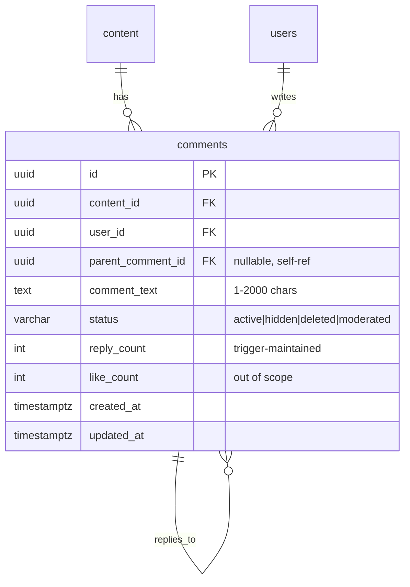

# Slice 6: Comments CRUD with Threading and Moderation

## Enhancement Summary

**Deepened on:** 2026-03-04
**Sections enhanced:** All 5 phases + acceptance criteria + E2E plan
**Research agents used:** Story Decomposer, Database Migration Specialist, Security Sentinel, Accessibility Specialist, E2E Testing Specialist

### Key Improvements

1. **D6 REVISED**: DOMPurify server-side is dangerous (returns input unchanged without real DOM). Replaced with control-character stripping + React default escaping.
2. **Supabase count fix**: All `.update()` calls must chain `.select('id', { count: 'exact', head: true })` or `count` is always `null`, silently breaking TOCTOU guards.
3. **E2E expanded**: Added `comments.public.spec.ts` for anonymous read tests, creator moderation test, and `TEST_CONTENT` fixture.
4. **Migration hardened**: BEFORE INSERT trigger for two-level threading (CHECK with subquery is invalid PG), regular CREATE INDEX (table is empty at migration time), explicit rollback plan.
5. **18 accessibility findings** embedded into component specs (focus management, ARIA, keyboard nav, semantic structure).

### Critical Security Change

> **D6 (XSS Sanitization) — REVISED**: The original plan specified DOMPurify with `ALLOWED_TAGS:[], ALLOWED_ATTR:[]`. Security review discovered that **DOMPurify.sanitize() in Node.js WITHOUT a jsdom window returns the input string completely unchanged** — no error thrown. This means `<script>alert(1)</script>` passes through as-is. **New approach**: Strip control characters server-side, store plain text, rely on React's default text node escaping (never `dangerouslySetInnerHTML`). Add ESLint rule `'react/no-danger': 'error'` to comments feature.

---

## DoD Traceability Matrix

Every Definition of Done criterion is explicitly mapped to tasks:

| DoD Criterion                      | Tasks Covering It                                             | Verification                                             |
| ---------------------------------- | ------------------------------------------------------------- | -------------------------------------------------------- |
| Users can read comments on content | T3 (list endpoint), T9 (useComments hook), T11 (CommentList)  | E2E: anonymous read, authenticated read                  |
| Users can post comments on content | T4 (createComment), T9 (useCreateComment), T12 (CommentForm)  | E2E: post comment, verify appears                        |
| Comments stored in Supabase        | T1 (migration), T4 (INSERT via service)                       | Backend unit test: verify insert                         |
| Server-side XSS sanitization       | T4 (sanitizeCommentText in service), T15 (ESLint no-danger)   | Unit test: control chars stripped, HTML escaped by React |
| Moderation (creator can delete)    | T5 (deleteComment + auth check), T13 (delete button + dialog) | E2E: creator deletes comment on own content              |
| E2E spec                           | T17-T20 (POM + auth spec + public spec + creator moderation)  | CI green, all E2E pass                                   |

---

## 1-Point Task Decomposition

### Task Summary Table

| ID  | Task                                                                                   | Points | Role            | Depends On    | Phase |
| --- | -------------------------------------------------------------------------------------- | ------ | --------------- | ------------- | ----- |
| T1  | Write migration SQL                                                                    | 1      | Architect/opus  | —             | 1     |
| T2  | Create shared types (comments.ts)                                                      | 1      | Architect/opus  | —             | 1     |
| T3  | Create ICommentsService interface + Zod schemas                                        | 1      | Architect/opus  | T2            | 1     |
| T4  | Implement CommentsService (create + list + listReplies)                                | 1      | Backend/sonnet  | T1, T2, T3    | 2     |
| T5  | Implement CommentsService.deleteComment (soft-delete + moderation)                     | 1      | Backend/sonnet  | T4            | 2     |
| T6  | Create comments.routes.ts                                                              | 1      | Backend/sonnet  | T3            | 2     |
| T7  | Wire DI container (types.ts + community.bindings.ts + route registration)              | 1      | Backend/sonnet  | T4, T6        | 2     |
| T8  | Create commentsApi.ts (API client)                                                     | 1      | Frontend/sonnet | T2            | 3     |
| T9  | Create useComments hooks (useComments, useReplies, useCreateComment, useDeleteComment) | 1      | Frontend/sonnet | T8            | 3     |
| T10 | Add commentKeys factory to query-keys.ts + barrel exports                              | 1      | Frontend/sonnet | —             | 3     |
| T11 | Build CommentList.tsx (list + pagination + loading/error/empty states)                 | 1      | Frontend/sonnet | T9            | 4     |
| T12 | Build CommentForm.tsx (textarea + submit + double-submit prevention + anon state)      | 1      | Frontend/sonnet | T9            | 4     |
| T13 | Build CommentItem.tsx (display + reply toggle + delete button + confirmation dialog)   | 1      | Frontend/sonnet | T9, T11       | 4     |
| T14 | Backend unit tests for CommentsService                                                 | 1      | QA/sonnet       | T4, T5        | 5     |
| T15 | Frontend unit tests for hooks + CommentForm                                            | 1      | QA/sonnet       | T9, T12       | 5     |
| T16 | Add ESLint no-danger rule for comments feature                                         | 1      | QA/sonnet       | —             | 5     |
| T17 | Create comments.page.ts (Playwright POM)                                               | 1      | QA/sonnet       | T11, T12, T13 | 5     |
| T18 | Create comments.auth.spec.ts (post, delete own, reply, character limit)                | 1      | QA/sonnet       | T17           | 5     |
| T19 | Create comments.public.spec.ts (anonymous read, sign-in prompt)                        | 1      | QA/sonnet       | T17           | 5     |
| T20 | Add creator moderation E2E test + TEST_CONTENT fixture                                 | 1      | QA/sonnet       | T17           | 5     |

**Total: 20 tasks, 20 points (10 story points with 2x granularity factor)**

### Parallel Execution Map

```
             Architect/opus     Backend/sonnet       Frontend/sonnet      QA/sonnet
             ──────────────     ──────────────       ───────────────      ─────────
Phase 1      T1 (migration)                          T10 (query keys)     T16 (ESLint rule)
  Day 1      T2 (shared types)
             T3 (interface+Zod)

Phase 2                         T4 (service CRUD)    T8 (API client)
  Day 2                         T5 (delete+mod)
                                T6 (routes)
                                T7 (DI wiring)

Phase 3                                              T9 (hooks)
  Day 3

Phase 4                                              T11 (CommentList)    T14 (backend tests)
  Day 3-4                                            T12 (CommentForm)
                                                     T13 (CommentItem)

Phase 5                                                                   T15 (frontend tests)
  Day 4-5                                                                 T17 (POM)
                                                                          T18 (auth E2E)
                                                                          T19 (public E2E)
                                                                          T20 (moderation E2E)
```

---

## Overview

Build the full comments system from scratch: backend CRUD routes, server-side XSS sanitization, creator moderation, frontend comment threads with optimistic updates, and E2E spec. The `comments` table already exists in the baseline schema — this slice wires it to the application.

**Squad boundary**: We only touch community/comments domain files. No wellness, shield, business, or auth module changes.

## Design Decisions (from SpecFlow + Research)

These resolve the ambiguities identified during spec analysis:

| #   | Decision                                                                                            | Rationale                                                                                                                                                                                                                                          |
| --- | --------------------------------------------------------------------------------------------------- | -------------------------------------------------------------------------------------------------------------------------------------------------------------------------------------------------------------------------------------------------- |
| D1  | `nostr_pubkey` → UUID resolution via `getUserIdByPubkey()` helper in CommentsService                | `comments.user_id` is a UUID FK; auth JWT provides `nostr_pubkey`. Single lookup, cached in-memory (TTL 60s). Throw 401 if user not in `users` table.                                                                                              |
| D2  | DELETE route is `DELETE /api/v2/comments/:commentId` (no contentId in path)                         | Comment IDs are globally unique UUIDs. Service fetches comment to get both `user_id` (own-comment auth) and `content_id` (creator moderation auth) in one query.                                                                                   |
| D3  | Soft-delete only (`UPDATE status = 'deleted'` or `'moderated'`) — no physical DELETE                | Preserves audit trail, avoids cascading reply loss. RLS `WHERE status = 'active'` already hides soft-deleted rows from GET.                                                                                                                        |
| D4  | Two-level threading only (top-level + one level of replies)                                         | Backend enforces: if `parentCommentId` is provided, it must itself have `parent_comment_id IS NULL`. Keeps queries simple, UI manageable.                                                                                                          |
| D5  | Pagination: `page` + `limit` (default 20, max 50)                                                   | Consistent with discovery routes pattern. Response: `{ items, pagination: { page, limit, total, hasNext } }`.                                                                                                                                      |
| D6  | **REVISED**: Control-character stripping + React default escaping for XSS                           | DOMPurify server-side WITHOUT jsdom returns input unchanged (security-critical no-op). Strip `[\x00-\x08\x0B\x0C\x0E-\x1F\x7F]`, trim, cap 2000 chars. React's text node rendering handles HTML escaping. Add ESLint `'react/no-danger': 'error'`. |
| D7  | Backend uses `service_role` key (bypasses RLS) — service-layer auth is primary enforcement          | Consistent with all other v2 services. DELETE RLS policy kept for defense-in-depth but physical deletes never happen from service.                                                                                                                 |
| D8  | `reply_count` maintained via PostgreSQL trigger in migration                                        | Atomic, no TOCTOU. `like_count` is out of scope (stays 0).                                                                                                                                                                                         |
| D9  | Optimistic insert via UI approach (`isPending` + `variables`), optimistic delete via cache approach | UI approach for insert = less code, no rollback. Cache approach for delete = instant removal from list.                                                                                                                                            |
| D10 | Anonymous users see comments on public content; private/paid content comments require access check  | GET handler verifies content visibility before returning comments.                                                                                                                                                                                 |
| D11 | Rate limit: 10 comments/minute per user via `createUserRateLimiter`                                 | Lower than circles (20/min) due to higher spam risk. Must use `createUserRateLimiter` (user-keyed), NOT `createRateLimiter` (IP-keyed).                                                                                                            |
| D12 | GET returns comments with nested `author` object (displayName, avatarUrl) via JOIN                  | Avoids N+1 client-side user lookups.                                                                                                                                                                                                               |

## Architecture

### ERD



### Request Flow

```
Client → POST /api/v2/comments/:contentId
  → authenticate → requireAuth → mutationRateLimiter
  → Zod validation (CreateCommentSchema)
  → CommentsService.createComment(callerPubkey, contentId, payload)
    → getUserIdByPubkey(callerPubkey) → UUID
    → sanitizeCommentText(commentText) → strip control chars, trim, cap 2000
    → validate parentCommentId (if reply: parent must be top-level + active)
    → INSERT into comments
    → increment parent reply_count (via trigger)
    → return { id, commentText, createdAt, author }
  → createApiResponse(req, data) → 201

Client → GET /api/v2/comments/:contentId?page=1&limit=20
  → optionalAuth → readOnlyRateLimiter
  → CommentsService.listComments(contentId, callerPubkey?, { page, limit })
    → verify content access (public or caller has access)
    → SELECT comments JOIN users WHERE content_id AND status='active' AND parent_comment_id IS NULL
    → ORDER BY created_at DESC, LIMIT/OFFSET
    → for each top-level: include reply_count (replies fetched on demand)
    → return { items, pagination }
  → createApiResponse(req, data) → 200

Client → DELETE /api/v2/comments/:commentId
  → authenticate → requireAuth → mutationRateLimiter
  → CommentsService.deleteComment(callerPubkey, commentId)
    → getUserIdByPubkey(callerPubkey) → callerUUID
    → fetch comment (id, user_id, content_id, status)
    → if status !== 'active' → 409 ConflictError
    → authorization check:
      - callerUUID === comment.user_id → allowed (own comment)
      - OR caller is creator of content → allowed (moderation)
      - ELSE → 403 AuthorizationError
      - NOTE: Admin moderation deferred to future slice (no admin role system exists yet)
    → newStatus = isOwner ? 'deleted' : 'moderated'
    → Atomic status guard with count check:
      .update({ status: newStatus })
      .eq('id', commentId).eq('status', 'active')
      .select('id', { count: 'exact', head: true })
    → if (count ?? 0) === 0 → ConflictError
  → createApiResponse(req, null) → 200
```

### Additional Endpoint: GET Replies

```
Client → GET /api/v2/comments/:commentId/replies?page=1&limit=20
  → optionalAuth → readOnlyRateLimiter
  → CommentsService.listReplies(commentId, { page, limit })
    → SELECT WHERE parent_comment_id = :commentId AND status = 'active'
    → ORDER BY created_at ASC
    → return { items, pagination }
```

## File Changes

### New Files (16)

| File                                                                        | Purpose                                                                                 | Task     |
| --------------------------------------------------------------------------- | --------------------------------------------------------------------------------------- | -------- |
| `supabase/migrations/20260304000001_comments_delete_rls_and_triggers.sql`   | DELETE RLS policy, reply_count trigger, two-level threading constraint, composite index | T1       |
| `packages/shared/src/types/comments.ts`                                     | Comment, CreateCommentBody, CommentWithAuthor, CommentsPaginatedResponse                | T2       |
| `packages/backend/src/interfaces/community/ICommentsService.ts`             | Service interface                                                                       | T3       |
| `packages/backend/src/services/community/CommentsService.ts`                | Service implementation                                                                  | T4, T5   |
| `packages/backend/src/routes/v2/comments.routes.ts`                         | Express router                                                                          | T6       |
| `packages/frontend/src/features/comments/services/commentsApi.ts`           | API client                                                                              | T8       |
| `packages/frontend/src/features/comments/hooks/useComments.ts`              | React Query hooks                                                                       | T9       |
| `packages/frontend/src/features/comments/components/CommentList.tsx`        | Top-level comment list with pagination                                                  | T11      |
| `packages/frontend/src/features/comments/components/CommentItem.tsx`        | Single comment with reply toggle, delete button                                         | T13      |
| `packages/frontend/src/features/comments/components/CommentForm.tsx`        | Textarea + submit with double-submit prevention                                         | T12      |
| `packages/frontend/src/features/comments/types/index.ts`                    | Re-exports from @shared/types/comments                                                  | T10      |
| `packages/frontend/src/features/comments/index.ts`                          | Barrel export                                                                           | T10      |
| `packages/backend/src/services/community/__tests__/CommentsService.test.ts` | Backend unit tests                                                                      | T14      |
| `packages/frontend/e2e/pages/comments.page.ts`                              | Playwright POM                                                                          | T17      |
| `packages/frontend/e2e/comments.auth.spec.ts`                               | Authenticated E2E spec                                                                  | T18, T20 |
| `packages/frontend/e2e/comments.public.spec.ts`                             | Anonymous E2E spec                                                                      | T19      |

### Modified Files (7)

| File                                                            | Change                                                                                  | Task |
| --------------------------------------------------------------- | --------------------------------------------------------------------------------------- | ---- |
| `packages/backend/src/routes/v2/index.ts`                       | Add `import commentsRoutes` + `router.use('/comments', commentsRoutes)` + info endpoint | T7   |
| `packages/backend/src/container/types.ts`                       | Add `CommentsService` token, singleton lifetime, dependencies                           | T7   |
| `packages/backend/src/container/bindings/community.bindings.ts` | Register CommentsService factory                                                        | T7   |
| `packages/backend/src/validators/community.ts`                  | Add CreateCommentSchema, pagination schemas                                             | T3   |
| `packages/shared/src/types/index.ts`                            | Add `export * from './comments'`                                                        | T2   |
| `packages/frontend/src/hooks/query-keys.ts`                     | Add `commentKeys` factory                                                               | T10  |
| `packages/frontend/e2e/fixtures/test-credentials.ts`            | Add `TEST_CONTENT` fixture                                                              | T20  |

### Files NOT Touched (Squad A boundary)

- `packages/backend/src/services/finance/*` — Squad A (Business Manager)
- `packages/backend/src/routes/v2/business*` — Squad A
- `packages/frontend/src/features/wellness/*` — Squad A
- `packages/frontend/src/features/dashboard/*` — Squad A
- `packages/backend/src/middleware/auth.ts` — shared, no changes needed

## Implementation Phases

### Phase 1: Database + Shared Types + Interface (T1, T2, T3)

**Owner**: Architect/opus
**Depends on**: Nothing — can start immediately

**T1 — Migration SQL:**

```sql
-- 1. DELETE RLS policy (defense-in-depth; backend uses service_role)
CREATE POLICY "comments_delete_own" ON comments
  FOR DELETE USING (user_id = auth.uid());

-- 2. Two-level threading enforcement via BEFORE INSERT trigger
-- NOTE: CHECK constraints cannot contain subqueries in PostgreSQL.
-- Service-layer validation is the primary guard (T4). This trigger is defense-in-depth.
CREATE OR REPLACE FUNCTION enforce_two_level_threading() RETURNS TRIGGER AS $$
BEGIN
  IF NEW.parent_comment_id IS NOT NULL THEN
    PERFORM 1 FROM comments
    WHERE id = NEW.parent_comment_id AND parent_comment_id IS NOT NULL;
    IF FOUND THEN
      RAISE EXCEPTION 'Cannot reply to a reply (two-level threading only)'
        USING ERRCODE = 'check_violation';
    END IF;
  END IF;
  RETURN NEW;
END;
$$ LANGUAGE plpgsql;

CREATE TRIGGER trg_enforce_two_level_threading
  BEFORE INSERT ON comments
  FOR EACH ROW EXECUTE FUNCTION enforce_two_level_threading();

-- 3. reply_count trigger
CREATE OR REPLACE FUNCTION update_reply_count() RETURNS TRIGGER AS $$
BEGIN
  IF TG_OP = 'INSERT' AND NEW.parent_comment_id IS NOT NULL THEN
    UPDATE comments SET reply_count = reply_count + 1
    WHERE id = NEW.parent_comment_id;
  ELSIF TG_OP = 'UPDATE' AND OLD.status = 'active' AND NEW.status != 'active'
    AND NEW.parent_comment_id IS NOT NULL THEN
    UPDATE comments SET reply_count = GREATEST(reply_count - 1, 0)
    WHERE id = NEW.parent_comment_id;
  END IF;
  RETURN NEW;
END;
$$ LANGUAGE plpgsql;

CREATE TRIGGER trg_reply_count
  AFTER INSERT OR UPDATE OF status ON comments
  FOR EACH ROW EXECUTE FUNCTION update_reply_count();

-- 4. updated_at trigger
CREATE TRIGGER set_comments_updated_at
  BEFORE UPDATE ON comments
  FOR EACH ROW EXECUTE FUNCTION update_updated_at();

-- 5. Composite partial index (regular CREATE INDEX — table is empty at migration time)
CREATE INDEX idx_comments_content_status_top_level
  ON comments (content_id, created_at DESC)
  WHERE status = 'active' AND parent_comment_id IS NULL;
```

**Migration review notes:**

- **No CHECK constraint**: PostgreSQL CHECK constraints cannot contain subqueries (`SELECT` from other rows). Using a BEFORE INSERT trigger instead for defense-in-depth. Primary enforcement is in CommentsService (T4).
- **Regular CREATE INDEX** (not CONCURRENTLY): Table has zero rows at migration time — lock duration is negligible. `CONCURRENTLY` cannot run inside a transaction block (Supabase migrations run inside transactions by default).
- **Rollback plan**:
  ```sql
  DROP INDEX IF EXISTS idx_comments_content_status_top_level;
  DROP TRIGGER IF EXISTS set_comments_updated_at ON comments;
  DROP TRIGGER IF EXISTS trg_reply_count ON comments;
  DROP FUNCTION IF EXISTS update_reply_count();
  DROP TRIGGER IF EXISTS trg_enforce_two_level_threading ON comments;
  DROP FUNCTION IF EXISTS enforce_two_level_threading();
  DROP POLICY IF EXISTS "comments_delete_own" ON comments;
  ```

**Acceptance criteria (T1):**

- [ ] Migration runs without error on empty and seeded databases
- [ ] `trg_enforce_two_level_threading` rejects reply-to-reply INSERT with `check_violation`
- [ ] `trg_reply_count` increments on INSERT, decrements on status change from 'active'
- [ ] Composite index appears in `pg_indexes`
- [ ] Rollback SQL executes cleanly

**T2 — Shared types (`packages/shared/src/types/comments.ts`):**

```typescript
export type CommentStatus = 'active' | 'hidden' | 'deleted' | 'moderated';

export interface Comment {
  id: string;
  contentId: string;
  userId: string;
  parentCommentId: string | null;
  commentText: string;
  status: CommentStatus;
  replyCount: number;
  createdAt: string;
  updatedAt: string;
}

export interface CommentAuthor {
  id: string;
  displayName: string;
  avatarUrl: string | null;
  username: string | null;
}

export interface CommentWithAuthor extends Comment {
  author: CommentAuthor;
}

// NOTE: contentId comes from URL param /:contentId, not the request body
export interface CreateCommentBody {
  parentCommentId?: string;
  commentText: string;
}

export interface CommentsPaginatedResponse {
  items: CommentWithAuthor[];
  pagination: {
    page: number;
    limit: number;
    total: number;
    hasNext: boolean;
  };
}
```

**Acceptance criteria (T2):**

- [ ] Types compile with `tsc --noEmit` in shared package
- [ ] `CommentStatus` is a union type (not enum) for tree-shaking
- [ ] Exported from `packages/shared/src/types/index.ts`

**T3 — Interface + Zod schemas:**

```typescript
// ICommentsService.ts
export interface ICommentsService {
  listComments(
    contentId: string,
    callerPubkey: string | null,
    pagination: { page: number; limit: number }
  ): Promise<CommentsPaginatedResponse>;
  listReplies(
    commentId: string,
    pagination: { page: number; limit: number }
  ): Promise<CommentsPaginatedResponse>;
  createComment(
    callerPubkey: string,
    contentId: string,
    payload: { parentCommentId?: string; commentText: string }
  ): Promise<CommentWithAuthor>;
  deleteComment(callerPubkey: string, commentId: string): Promise<void>;
}
```

```typescript
// Add to community.ts validators
export const CreateCommentSchema = z.object({
  parentCommentId: z.string().uuid().optional(),
  commentText: z.string().min(1, 'Comment cannot be empty').max(2000, 'Comment too long'),
});

export const CommentsPaginationSchema = z.object({
  page: z.coerce.number().int().min(1).default(1),
  limit: z.coerce.number().int().min(1).max(50).default(20),
});
```

**Acceptance criteria (T3):**

- [ ] Interface extends no other interface (standalone)
- [ ] Zod schemas validate edge cases: empty string rejected, 2001 chars rejected, non-UUID parentId rejected

### Phase 2: Backend Service + Routes + DI Wiring (T4, T5, T6, T7)

**Owner**: Backend/sonnet
**Depends on**: Phase 1 (T1, T2, T3)

**T4 — CommentsService (create + list):**

```typescript
export class CommentsService implements ICommentsService {
  private readonly db: ISupabaseClient;
  private readonly logger: ILogger;
  // TTLCache pattern (common-solutions.md #2) — auto-evicts stale entries, bounded size
  private readonly userIdCache = new TTLCache<string, string>({ ttl: 60_000, max: 1000 });

  private async getUserIdByPubkey(pubkey: string): Promise<string> {
    const cached = this.userIdCache.get(pubkey);
    if (cached) return cached;

    const { data, error } = await this.db
      .from('users')
      .select('id')
      .eq('nostr_pubkey', pubkey)
      .single();

    if (error || !data) throw new UnauthorizedError('User profile not found');

    this.userIdCache.set(pubkey, data.id);
    return data.id;
  }

  // XSS sanitization — strip control chars, NOT DOMPurify
  private sanitizeCommentText(raw: string): string {
    const trimmed = raw.trim().slice(0, 2000);
    // Strip control characters except \n and \r (allow line breaks)
    return trimmed.replace(/[\x00-\x08\x0B\x0C\x0E-\x1F\x7F]/g, '');
  }

  async createComment(callerPubkey: string, contentId: string, payload: {...}): Promise<CommentWithAuthor> {
    const userId = await this.getUserIdByPubkey(callerPubkey);
    const sanitizedText = this.sanitizeCommentText(payload.commentText);

    // Two-level threading validation
    if (payload.parentCommentId) {
      const { data: parent } = await this.db
        .from('comments')
        .select('parent_comment_id, status')
        .eq('id', payload.parentCommentId)
        .single();
      if (!parent) throw new NotFoundError('Parent comment');
      if (parent.status !== 'active') throw new ConflictError('Parent comment is no longer available');
      if (parent.parent_comment_id !== null) throw new ValidationError('Cannot reply to a reply');
    }

    const { data, error } = await this.db
      .from('comments')
      .insert({
        content_id: contentId,
        user_id: userId,
        parent_comment_id: payload.parentCommentId ?? null,
        comment_text: sanitizedText,
        status: 'active',
      })
      .select('*, users!inner(id, display_name, avatar_url, username)')
      .single();

    if (error) {
      this.logger.error('Failed to create comment', { error, contentId });
      throw new ServiceError('Failed to create comment');
    }
    return this.mapToCommentWithAuthor(data);
  }

  async listComments(contentId: string, callerPubkey: string | null, { page, limit }: { page: number; limit: number }): Promise<CommentsPaginatedResponse> {
    // Content access check (D10) — query content visibility
    const { data: content } = await this.db
      .from('content')
      .select('id, creator_id, status')
      .eq('id', contentId)
      .single();
    // Return 404 for both missing and private content (prevent enumeration)
    if (!content || content.status !== 'published') {
      throw new NotFoundError('Content');
    }

    const offset = (page - 1) * limit;
    const { data, error, count } = await this.db
      .from('comments')
      .select('*, users!inner(id, display_name, avatar_url, username)', { count: 'exact' })
      .eq('content_id', contentId)
      .eq('status', 'active')
      .is('parent_comment_id', null)
      .order('created_at', { ascending: false })
      .range(offset, offset + limit - 1);

    if (error) { /* log + throw */ }

    return {
      items: (data ?? []).map(this.mapToCommentWithAuthor),
      pagination: {
        page,
        limit,
        total: count ?? 0,
        hasNext: (count ?? 0) > offset + limit,
      },
    };
  }
}
```

**Acceptance criteria (T4):**

- [ ] `sanitizeCommentText` strips `\x00`-`\x08`, `\x0B`, `\x0C`, `\x0E`-`\x1F`, `\x7F` but preserves `\n` and `\r`
- [ ] `getUserIdByPubkey` caches with 60s TTL (use TTLCache pattern from common-solutions.md #2)
- [ ] `createComment` rejects reply-to-reply with `ValidationError`
- [ ] `listComments` uses `{ count: 'exact' }` in select options
- [ ] Content access check implemented for D10

**T5 — CommentsService.deleteComment:**

```typescript
async deleteComment(callerPubkey: string, commentId: string): Promise<void> {
  const userId = await this.getUserIdByPubkey(callerPubkey);

  // Fetch comment + content creator in one query
  const { data: comment } = await this.db
    .from('comments')
    .select('id, user_id, content_id, status, content!inner(creator_id)')
    .eq('id', commentId)
    .single();

  if (!comment) throw new NotFoundError('Comment');

  // Status guard (critical-patterns.md #7)
  if (comment.status !== 'active') throw new ConflictError('Comment is already deleted or moderated');

  // Service-layer authorization (critical-patterns.md #2)
  const isOwner = comment.user_id === userId;
  const isContentCreator = comment.content?.creator_id === userId;
  if (!isOwner && !isContentCreator) {
    throw new AuthorizationError('Not authorized to delete this comment');
  }

  const newStatus = isOwner ? 'deleted' : 'moderated';

  // CRITICAL: Must include .select() with count option (Supabase SDK returns null without it)
  const { count } = await this.db
    .from('comments')
    .update({ status: newStatus })
    .eq('id', commentId)
    .eq('status', 'active')
    .select('id', { count: 'exact', head: true });

  if ((count ?? 0) === 0) throw new ConflictError('Comment was already modified');
}
```

**Acceptance criteria (T5):**

- [ ] Own-comment delete sets status to `'deleted'`
- [ ] Creator moderation sets status to `'moderated'`
- [ ] Uses `AuthorizationError` (403) not `ValidationError` (400) for unauthorized
- [ ] Atomic status guard uses `.select('id', { count: 'exact', head: true })`
- [ ] `(count ?? 0) === 0` handles null count case

**T6 — Routes:**

```typescript
const router = Router();

// GET /api/v2/comments/:contentId — list top-level comments
router.get('/:contentId', optionalAuth, readOnlyRateLimiter, asyncHandler(async (req, res) => { ... }));

// GET /api/v2/comments/:commentId/replies — list replies
router.get('/:commentId/replies', optionalAuth, readOnlyRateLimiter, asyncHandler(async (req, res) => { ... }));

// POST /api/v2/comments/:contentId — create comment
router.post('/:contentId', authenticate, requireAuth, mutationRateLimiter, asyncHandler(async (req, res) => { ... }));

// DELETE /api/v2/comments/:commentId — delete/moderate comment
router.delete('/:commentId', authenticate, requireAuth, mutationRateLimiter, asyncHandler(async (req, res) => { ... }));

export default router;
```

**Acceptance criteria (T6):**

- [ ] Uses `createUserRateLimiter` (user-keyed), NOT `createRateLimiter`
- [ ] POST returns 201, GET returns 200, DELETE returns 200
- [ ] Lazy service resolution from DI container (match circles.routes.ts pattern)
- [ ] Route ordering: `/:commentId/replies` before `/:commentId` (named route before param-only)

**T7 — DI Wiring:**

**Acceptance criteria (T7):**

- [ ] `CommentsService` token added to `types.ts`
- [ ] Factory registered in `community.bindings.ts` with db + logger dependencies
- [ ] Route registered in `routes/v2/index.ts` — verify ordering (named routes before `/:id` params)
- [ ] Info endpoint includes comments routes

### Phase 3: Frontend — API Service + Hooks + Query Keys (T8, T9, T10)

**Owner**: Frontend/sonnet
**T8 depends on**: T2 (shared types). **T9 depends on**: T8. **T10 depends on**: Nothing.

**T10 — Query key factory (add to `query-keys.ts`):**

```typescript
export const commentKeys = {
  all: ['comments'] as const,
  byContent: (contentId: string) => [...commentKeys.all, 'content', contentId] as const,
  list: (contentId: string, filters?: Record<string, unknown>) =>
    [...commentKeys.byContent(contentId), 'list', filters] as const,
  replies: (commentId: string) => [...commentKeys.all, 'replies', commentId] as const,
  count: (contentId: string) => [...commentKeys.byContent(contentId), 'count'] as const,
};
```

**Acceptance criteria (T10):**

- [ ] Key factory follows existing pattern in query-keys.ts
- [ ] Barrel exports in `features/comments/index.ts` and `features/comments/types/index.ts`

**T8 — API client (`commentsApi.ts`):**

**Acceptance criteria (T8):**

- [ ] Follows `wellnessApi.ts` pattern (domain-scoped, not in shared apiClient)
- [ ] Methods: `listComments(contentId, params)`, `listReplies(commentId, params)`, `createComment(contentId, payload)`, `deleteComment(commentId)`
- [ ] Uses typed responses from `@shared/types/comments`

**T9 — Hooks:**

- `useComments(contentId, { page })` — useQuery with pagination, `keepPreviousData` gated to page changes only (common-solutions.md #58)
- `useReplies(commentId, { enabled })` — useQuery, lazy-loaded when user expands replies
- `useCreateComment(contentId)` — useMutation, UI-based optimistic insert (render from `variables` while `isPending`), return Promise from `onSettled` to prevent flash
- `useDeleteComment(contentId)` — useMutation, cache-based optimistic delete with snapshot rollback

**Acceptance criteria (T9):**

- [ ] `useComments` uses `placeholderData: keepPreviousData` only for page changes (not filter/sort)
- [ ] `useCreateComment` uses UI approach: render optimistic item from `variables` when `isPending`
- [ ] `useDeleteComment` uses cache approach: `onMutate` saves snapshot, removes item from cache; `onError` restores snapshot
- [ ] All mutations invalidate `commentKeys.byContent(contentId)` on success
- [ ] `useReplies` has `enabled: false` by default, activated by expand toggle
- [ ] Query config: `staleTime: 30_000` (30s — comments change frequently), `gcTime: 300_000` (5min)

### Phase 4: Frontend — UI Components (T11, T12, T13)

**Owner**: Frontend/sonnet
**Depends on**: T9 (hooks)

**T11 — CommentList.tsx:**

- Receives `contentId` prop
- Calls `useComments(contentId, { page })`
- Renders loading spinner, error alert, or empty state
- Maps top-level comments to `<CommentItem>`
- "Load more" button for pagination

**Accessibility requirements (from review):**

- [ ] Wrap in `<section aria-labelledby="comments-heading">` with `<h2 id="comments-heading">Comments</h2>` for heading-based navigation
- [ ] Use `<ul role="list">` for comment list (screen reader count announcement)
- [ ] `aria-live="polite"` region for new comment announcements (inside list, not wrapping it)
- [ ] Loading spinner has `role="status"` and visible label (e.g., "Loading comments...")
- [ ] Error state uses `role="alert"`

**T12 — CommentForm.tsx:**

- Textarea with label + character counter
- Submit button with double-submit prevention (useRef + disabled)
- On success: clear textarea, announce via aria-live
- On error: toast notification, re-populate textarea
- Anonymous users see "Sign in to comment" instead of form

**Accessibility requirements:**

- [ ] `<label htmlFor="comment-input">` explicitly associated with textarea
- [ ] Character counter has stable `id` with `aria-describedby` on the textarea
- [ ] Submit button: `disabled={isPending}` AND `aria-busy={isPending}` AND `aria-label` includes context (e.g., "Post comment" or "Post reply to [author]")
- [ ] All interactive elements are native `<button>` (not `<div onClick>`)
- [ ] Focus returns to textarea after successful submit
- [ ] Sign-in prompt is a link/button, not just text

**T13 — CommentItem.tsx:**

- Renders comment with author avatar, display name, relative timestamp, text
- "Reply" button toggles inline `<CommentForm>` with `parentCommentId`
- "Delete" button (visible if user owns comment OR owns content) → confirmation dialog
- Reply count badge, "Show replies" toggle → calls `useReplies(commentId)`
- Nested `<CommentItem>` for replies (no further nesting)

**Accessibility requirements:**

- [ ] Delete button: contextual `aria-label` (e.g., `aria-label="Delete comment by {author}"`)
- [ ] Reply button: contextual `aria-label` (e.g., `aria-label="Reply to {author}"`)
- [ ] Replies rendered as nested `<ul>` inside parent `<li>` (semantic nesting)
- [ ] After delete confirmation: focus moves to next comment or "no comments" region (deleted element removed from DOM)
- [ ] Delete dialog: uses `<Dialog>` with `DialogTrigger asChild` for focus return on cancel
- [ ] Relative timestamps include full date in `<time datetime="{ISO}">` for screen readers

### Phase 5: Tests + E2E (T14–T20)

**Owner**: QA/sonnet
**T14 depends on**: T4, T5. **T15 depends on**: T9, T12. **T16**: No deps. **T17-T20 depend on**: T11, T12, T13.

**T14 — Backend unit tests (`CommentsService.test.ts`):**

- Table-aware Supabase mock (common-solutions.md #7) — `from()` routes to `comments`, `users`, `content` mocks
- Test: createComment — happy path, XSS control-char stripping, reply-to-reply rejection, parent deleted rejection, pubkey not found
- Test: deleteComment — own comment, creator moderation, unauthorized (403), already deleted (409), TOCTOU count=0
- Test: listComments — pagination, content access check (public vs private), empty results
- `QueryClient` with `retry: false, retryDelay: 0` (common-solutions.md #35)

**Acceptance criteria (T14):**

- [ ] Table-aware mock routes `from('comments')`, `from('users')`, `from('content')` to separate chains
- [ ] Tests cover: happy path create, XSS stripping, reply-to-reply 400, parent deleted 409, pubkey 401, delete own, delete moderation, delete unauthorized 403, delete already-deleted 409, TOCTOU count=0 409, list pagination, list empty, list content access
- [ ] Zero `any` types in test file

**T15 — Frontend unit tests:**

- Test optimistic insert via UI approach (isPending renders variables)
- Test optimistic delete with rollback on error
- Test double-submit guard
- Test pagination with keepPreviousData gate
- CommentForm: render, submit, disabled state, character counter, anonymous state

**Acceptance criteria (T15):**

- [ ] Uses MSW v2 pattern (`setupServer`, `http.get`, `HttpResponse.json`)
- [ ] Verifies optimistic item visible during `isPending`
- [ ] Verifies rollback restores previous cache state on delete error

**T16 — ESLint no-danger rule:**

**Acceptance criteria (T16):**

- [ ] Add `'react/no-danger': 'error'` scoped to `packages/frontend/src/features/comments/`
- [ ] Verify no existing violations in comments feature directory

**T17 — Playwright POM (`comments.page.ts`):**

```typescript
export class CommentsPage {
  readonly page: Page;
  readonly commentsSection: Locator;
  readonly commentInput: Locator;
  readonly submitButton: Locator;
  readonly commentList: Locator;
  readonly firstComment: Locator;
  readonly firstCommentText: Locator;
  readonly firstDeleteButton: Locator;
  readonly confirmDeleteButton: Locator;
  readonly emptyState: Locator;
  readonly signInPrompt: Locator;
  readonly replyButton: Locator;
  readonly loadMoreButton: Locator;
  readonly commentCount: Locator;

  constructor(page: Page) {
    this.page = page;
    this.commentsSection = page.getByRole('region', { name: /comments/i }).first();
    this.commentInput = page.getByRole('textbox', { name: /comment/i }).first();
    this.submitButton = page.getByRole('button', { name: /post comment/i }).first();
    this.commentList = page.getByRole('list', { name: /comments/i }).first();
    this.firstComment = this.commentList.getByRole('listitem').first();
    this.firstCommentText = this.firstComment.locator('p').first();
    this.firstDeleteButton = this.firstComment.getByRole('button', { name: /delete/i }).first();
    this.confirmDeleteButton = page.getByRole('button', { name: /confirm/i }).first();
    this.emptyState = page.getByText(/no comments yet/i).first();
    this.signInPrompt = page.getByText(/sign in to comment/i).first();
    this.replyButton = this.firstComment.getByRole('button', { name: /reply/i }).first();
    this.loadMoreButton = page.getByRole('button', { name: /load more/i }).first();
    this.commentCount = page.getByText(/\d+ comments?/i).first();
  }

  async goto(contentId: string) {
    await this.page.goto(`/content/${contentId}`);
  }
}
```

**Acceptance criteria (T17):**

- [ ] All locators use role-based selectors, never CSS selectors
- [ ] All locators have `.first()` for strict mode safety
- [ ] Scoped locators (e.g., `firstDeleteButton` scoped to `firstComment`)

**T18 — `comments.auth.spec.ts`:**

Tests (authenticated, uses storage state):

1. Post a comment → verify it appears in the list
2. Delete own comment → verify it disappears
3. Reply to a comment → verify nested reply appears
4. Character limit → submit disabled at 2001 chars
5. Empty state shown when no comments exist

**T19 — `comments.public.spec.ts`:**

Tests (no auth):

1. Anonymous user sees comments on public content
2. Anonymous user sees "Sign in to comment" instead of form

**T20 — Creator moderation E2E + TEST_CONTENT fixture:**

- Add `TEST_CONTENT` to `test-credentials.ts` (content ID with env var fallback `E2E_TEST_CONTENT_ID`)
- Test: Creator deletes another user's comment on their content (moderation)
- Test: Comment persists after page reload

**Acceptance criteria (T18-T20):**

- [ ] `comments.auth.spec.ts` has 5 tests minimum
- [ ] `comments.public.spec.ts` has 2 tests minimum
- [ ] Creator moderation test uses separate credentials (creator of `TEST_CONTENT`)
- [ ] All tests use POM locators, no raw `page.getByText()` in spec files
- [ ] No `page.route()` mocks (common-solutions.md #26)
- [ ] No `waitForTimeout` (use web-first assertions)

## Acceptance Criteria

### Functional

- [ ] Authenticated users can post comments on content (POST returns 201)
- [ ] Comments appear in chronological order with author info
- [ ] Users can reply to top-level comments (one level of nesting)
- [ ] Reply-to-reply is rejected with 400
- [ ] Users can delete their own comments (soft-delete, status → 'deleted')
- [ ] Content creators can delete any comment on their content (status → 'moderated')
- [ ] Delete requires confirmation dialog
- [ ] Anonymous users can view comments on public content
- [ ] Anonymous users see "Sign in to comment" instead of form
- [ ] Comments on private/paid content are not visible to unauthorized users
- [ ] HTML in comment text is stripped (control chars removed, React escapes output)
- [ ] Character limit enforced: 1-2000 chars
- [ ] Pagination works (default 20, max 50)
- [ ] Rate limit: 10 comments/minute per user

### Non-Functional

- [ ] Optimistic insert: comment appears immediately while pending
- [ ] Optimistic delete: comment disappears immediately with rollback on failure
- [ ] Double-submit prevention (useRef + disabled)
- [ ] No flash between optimistic and server state
- [ ] `aria-live="polite"` announces new comments
- [ ] Delete dialog traps focus and returns focus on cancel
- [ ] Form has proper labels and `aria-describedby` for counter
- [ ] Comments section has `<section>` + `<h2>` for heading navigation
- [ ] All interactive elements are native `<button>`
- [ ] Focus management after delete (move to next comment)
- [ ] Contextual `aria-label` on Delete/Reply buttons

### Quality Gates

- [ ] All Vitest tests pass (backend service + frontend hooks + components)
- [ ] E2E specs pass (`comments.auth.spec.ts` + `comments.public.spec.ts`)
- [ ] No new ESLint errors
- [ ] TypeScript compiles (per-package tsc)
- [ ] `react/no-danger: error` active for comments feature
- [ ] `/workflows:review` finds 0 P1 findings

## Critical Patterns Applied

| Pattern                                       | Where Applied                                               | Task     |
| --------------------------------------------- | ----------------------------------------------------------- | -------- |
| #1c Atomic claim (UPDATE WHERE status=active) | CommentsService.deleteComment                               | T5       |
| #2 Service-layer authorization                | deleteComment checks owner OR content creator               | T5       |
| #3 Paginated accumulation                     | listComments uses page/limit, never unbounded SELECT        | T4       |
| #7 Status guards                              | deleteComment asserts status='active' before UPDATE         | T5       |
| #11 PostgREST filter escape                   | If search added later — not in Slice 6 scope                | —        |
| common #1 Double-submit prevention            | CommentForm useRef + disabled                               | T12      |
| common #2 TTLCache                            | getUserIdByPubkey cache with 60s TTL                        | T4       |
| common #7 Table-aware mock                    | CommentsService.test.ts from() routing                      | T14      |
| common #18 Query key factory                  | commentKeys in query-keys.ts                                | T10      |
| common #24 Error class selection              | AuthorizationError for ownership, NotFoundError for missing | T5       |
| common #35 retryDelay: 0                      | All test QueryClient instances                              | T14, T15 |
| common #58 keepPreviousData gate              | useComments pagination only, not sort changes               | T9       |
| common #61 Error cause sanitization           | Service catch blocks: no cause in thrown errors             | T4, T5   |

## Risk Mitigation

| Risk                                             | Mitigation                                                                                                                                       |
| ------------------------------------------------ | ------------------------------------------------------------------------------------------------------------------------------------------------ |
| `nostr_pubkey` → UUID lookup fails for new users | Throw clear 401 with message "Complete registration first". Cache successful lookups with TTL.                                                   |
| Two-level threading enforcement                  | CHECK constraints cannot contain subqueries in PG. Using BEFORE INSERT trigger for defense-in-depth + service-layer validation as primary guard. |
| DOMPurify server-side is a no-op (SECURITY)      | **REMOVED**. Using control-char stripping + React default escaping instead.                                                                      |
| Branch collision with Squad A                    | Squad A owns business/wellness/shield. We only touch community/comments files. Zero overlap.                                                     |
| Optimistic delete rollback complexity            | Using cache snapshot pattern — restore exact previous state on error.                                                                            |
| Supabase `.update()` count is null               | All mutations use `.select('id', { count: 'exact', head: true })`.                                                                               |
| RLS DELETE policy allows physical row deletion   | Service uses soft-delete only (UPDATE). DELETE policy kept for defense-in-depth but physical DELETE never called.                                |
| `createRateLimiter` keys on IP not user          | Use `createUserRateLimiter` explicitly for all mutation endpoints.                                                                               |

## References

- Story map: `/Users/fp/Desktop/story-map-v2-production-roadmap.md` (lines 199-218)
- Baseline schema: `supabase/migrations/baseline/001_baseline_schema.sql` (lines 244-266, 334-336, 392-401)
- Route template: `packages/backend/src/routes/v2/circles.routes.ts`
- Service template: `packages/backend/src/services/community/CreatorCircleService.ts`
- DI types: `packages/backend/src/container/types.ts`
- Community bindings: `packages/backend/src/container/bindings/community.bindings.ts`
- Auth middleware: `packages/backend/src/middleware/auth.ts`
- Query keys: `packages/frontend/src/hooks/query-keys.ts`
- Critical patterns: `docs/solutions/patterns/critical-patterns.md`
- Common solutions: `docs/solutions/patterns/common-solutions.md` (#1, #2, #7, #18, #24, #35, #58, #61)
