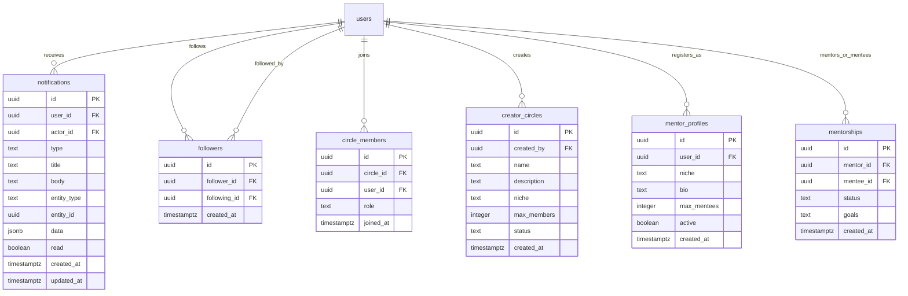

# Slice 8: Creator Network + Notifications

## Enhancement Summary

**Deepened on:** 2026-03-06
**Research agents used:** Architecture Strategist, Security Sentinel, Performance Oracle, Data Integrity Guardian, Frontend Race Conditions (Julik), Best Practices Researcher, E2E Testing Specialist, Database Schema Architect

### Key Improvements

1. **Migration SQL completely revised** — named CHECK constraint, `creators` table target (not `users`), REPLICA IDENTITY FULL, idempotent publication, transaction wrapping, backfill query, composite indexes
2. **7 P1 security findings** addressed — followers RLS policies, circle post flood rate limiting, UUID validation on all routes, maxMentees validator/service cap alignment
3. **3 critical race conditions** mapped (RC-1 StrictMode double-subscribe, RC-3 invalidateQueries not setQueryData, RC-4 markAllRead timestamp)
4. **IFollowService created as focused interface** — new 5-method `IFollowService` with own DI token (existing `IUserRelationshipService` is 314-line God Interface with `@ts-nocheck`)
5. **Typed event payloads** — discriminated union `CommunityEventPayload` replaces `DomainEvent<any>`
6. **E2E: 11 tests across 2 files** (cut 3 public tests, simplified notification test to single-context)

### Review Findings Applied (3 reviewers)

| Finding                          | Source           | Action                                                                                                                          |
| -------------------------------- | ---------------- | ------------------------------------------------------------------------------------------------------------------------------- |
| Kill DI ceremony                 | DHH              | **Rejected** — consistency with 40+ services; but created focused IFollowService instead of extending God Interface (Kieran P1) |
| Kill EventBus                    | DHH              | **Rejected** — EventBus already exists (617 lines), 4-service coupling is worse. Added explicit error handling spec (Kieran P1) |
| Pruning trigger premature        | DHH + Simplicity | **Accepted** — cut from migration, add when needed                                                                              |
| Trim race conditions             | All 3            | **Accepted** — kept RC-1, RC-3, RC-4 as warnings; cut RC-5/6/7, downgraded RC-2                                                 |
| Remove inline code               | DHH + Simplicity | **Accepted** — kept typed signatures, removed implementations                                                                   |
| Drop combined badge              | Simplicity       | **Rejected** — UX requirement (3 lines of code), but simplified phrasing                                                        |
| Drop public E2E 11+13, keep 12   | Simplicity       | **Accepted** — 11 tests across 2 files                                                                                          |
| Type event payloads              | Kieran P1        | **Accepted** — discriminated union for CommunityEventPayload                                                                    |
| Type frontend API returns        | Kieran P2        | **Accepted** — match commentsApi.ts pattern                                                                                     |
| POST not PATCH for mark-all-read | Kieran P2        | **Accepted** — `POST /mark-all-read`                                                                                            |
| Add unit test specs              | Kieran P2        | **Accepted** — FollowService + NotificationPersistenceService                                                                   |
| Tighten entityType to union      | Kieran P2        | **Accepted**                                                                                                                    |
| Add DomainEventType entries      | Kieran P2        | **Accepted**                                                                                                                    |
| notificationEnabled YAGNI        | Simplicity       | **Accepted** — cut from types                                                                                                   |
| Route nesting inconsistent       | Kieran P2        | **Accepted** — anchored under `/users/:userId/`                                                                                 |

## Overview

Wire the Creator Network feature (circles, follow, mentorship) to real backend data and build a persistent notification system with Supabase Realtime. Most backend services and frontend components exist from EPIC-010 — the work is primarily: (1) fix bugs in existing services, (2) build the missing follow vertical slice, (3) create the notifications table + routes + Realtime integration, and (4) wire frontend hooks to real APIs.

## Definition of Done

- Creator Circles: create, join, browse — real data from Supabase
- Follow/unfollow: persisted in `followers` table, button state persists across page loads
- Mentorship directory: browse by niche + request mentorship (pending status)
- Notification center: wired to real events via Supabase Realtime (comments, follows, payments)
- E2E: `network.auth.spec.ts` covering core flows

## Architectural Decisions

| Decision                            | Choice                                                                                                       | Rationale                                                                                                                                                                                                                                                                                                           |
| ----------------------------------- | ------------------------------------------------------------------------------------------------------------ | ------------------------------------------------------------------------------------------------------------------------------------------------------------------------------------------------------------------------------------------------------------------------------------------------------------------- |
| **D1: Follow table**                | Use baseline `followers` table                                                                               | Has `no_self_follow` CHECK constraint + existing RLS policies. `follow_relationships` is v1 recommendation-only.                                                                                                                                                                                                    |
| **D2: Notification reconciliation** | Parallel `ServerNotification` type                                                                           | NOSTR notifications stay client-side (IndexedDB). Server notifications (follow, payment, comment) get a new `notifications` table. Merge at UI layer in `NotificationCenter`.                                                                                                                                       |
| **D3: Realtime strategy**           | Frontend subscribes directly to `notifications` table via `@supabase/supabase-js` `postgres_changes`         | No backend WebSocket relay needed. RLS ensures user only sees their own rows.                                                                                                                                                                                                                                       |
| **D4: Event emission**              | Community services emit to `IEventBus` → `NotificationService` consumes → inserts into `notifications` table | Decoupled. New events are just new listeners.                                                                                                                                                                                                                                                                       |
| **D5: Waitlist**                    | Deferred to v2.1                                                                                             | `joinCircle` returns 409 when full. No waitlist table.                                                                                                                                                                                                                                                              |
| **D6: Circle messaging**            | Deferred to v2.1                                                                                             | Per roadmap.                                                                                                                                                                                                                                                                                                        |
| **D7: Backend auth model**          | Service-role key (bypasses RLS)                                                                              | All authorization MUST be enforced in application code. RLS is defense-in-depth only.                                                                                                                                                                                                                               |
| **D8: IFollowService**              | NEW focused interface (5 methods)                                                                            | `IUserRelationshipService` is a 314-line God Interface with `@ts-nocheck`. DO NOT extend it. Create `IFollowService` with follow/unfollow/isFollowing/getFollowers/getFollowing/getFollowCounts — own DI token, own binding, clean types. Existing `UserRelationshipService` is tech debt, not a pattern to follow. |
| **D9: Pagination params**           | Object shape `{ page, limit }` not positional                                                                | All service/route methods use `opts: PaginationParams` to prevent argument order bugs. Matches `CommentsPaginationSchema` pattern.                                                                                                                                                                                  |
| **D10: markAllRead timestamp**      | Server-side `before` cutoff                                                                                  | `markAllRead(userId, before: Date)` marks only notifications created before the timestamp. Prevents race where new notification arrives between button click and DB update.                                                                                                                                         |

### Research Insights: Architecture

**Must-Fix Before Implementation:**

- `NotificationPersistenceService` DI binding must include `EventBusService` as dependency
- `SERVICE_DEPENDENCIES`, `SERVICE_LIFETIMES`, and `SERVICE_TAGS` in container must be updated for new bindings
- `circle_post` event payload must include `memberIds[]` (fan-out target list)
- Add 7 new entries to `DomainEventType` enum in `IEventBus.ts`
- Define typed `CommunityEventPayload` discriminated union (see Phase 2A)

**EventBus Error Handling (Kieran P1 — must specify):**

- Verify `EventBusService.ts` catches errors from async handlers (it has retry logic in its 617 lines — confirm)
- If not already handled: wrap event listener registration with explicit try/catch, log error with event type + payload context
- Notification insert failure must NEVER fail the original service operation — fire-and-forget with structured logging
- No durability across restarts — acceptable for v2.0, document as v2.1 upgrade (persistent queue)

## Database Schema

### New Migration: `notifications` table

```sql
-- supabase/migrations/20260306000000_notifications.sql
BEGIN;

CREATE TABLE IF NOT EXISTS notifications (
    id UUID PRIMARY KEY DEFAULT uuid_generate_v4(),
    user_id UUID NOT NULL REFERENCES users(id) ON DELETE CASCADE,
    actor_id UUID REFERENCES users(id) ON DELETE SET NULL,
    type VARCHAR(50) NOT NULL,
    title TEXT NOT NULL,
    body TEXT,
    entity_type TEXT,           -- 'comment', 'follow', 'payment', 'mentorship', 'circle'
    entity_id UUID,             -- FK to the originating record
    data JSONB DEFAULT '{}',    -- type-specific metadata (amount, circle name, etc.)
    read BOOLEAN DEFAULT FALSE,
    created_at TIMESTAMPTZ DEFAULT NOW(),
    updated_at TIMESTAMPTZ DEFAULT NOW(),

    -- Named constraint (avoids table lock on ALTER for future type additions)
    CONSTRAINT chk_notification_type CHECK (type IN (
        'new_comment', 'new_follower', 'payment_received',
        'mentorship_request', 'mentorship_accepted', 'mentorship_declined',
        'circle_join', 'circle_post'
    ))
);

-- Indexes (composite for user queries; partial for unread badge)
CREATE INDEX idx_notifications_user_created
    ON notifications(user_id, created_at DESC);           -- list query
CREATE INDEX idx_notifications_user_unread
    ON notifications(user_id, read) WHERE read = FALSE;   -- unread count

-- Realtime requires REPLICA IDENTITY FULL for UPDATE events to include old values
ALTER TABLE notifications REPLICA IDENTITY FULL;

-- RLS (defense-in-depth — backend uses service-role key)
ALTER TABLE notifications ENABLE ROW LEVEL SECURITY;

CREATE POLICY notifications_select ON notifications
    FOR SELECT USING (user_id = auth.uid());
-- UPDATE restricted to read + updated_at only (prevents users modifying type/title/etc.)
CREATE POLICY notifications_update ON notifications
    FOR UPDATE USING (user_id = auth.uid())
    WITH CHECK (user_id = auth.uid());
CREATE POLICY notifications_delete ON notifications
    FOR DELETE USING (user_id = auth.uid());
-- INSERT via service-role only (backend inserts notifications, not users)

-- Trigger: updated_at
CREATE TRIGGER update_notifications_updated_at
    BEFORE UPDATE ON notifications
    FOR EACH ROW EXECUTE FUNCTION update_updated_at();

-- NOTE: Per-user notification cap DEFERRED — add pruning trigger when growth warrants it (v2.1)

-- Enable Realtime (idempotent — check existence first)
DO $$
BEGIN
    IF NOT EXISTS (
        SELECT 1 FROM pg_publication_tables
        WHERE pubname = 'supabase_realtime' AND tablename = 'notifications'
    ) THEN
        ALTER PUBLICATION supabase_realtime ADD TABLE notifications;
    END IF;
END $$;

COMMIT;
```

### Research Insights: Schema

**From Database Schema Architect + Data Integrity Guardian:**

- Named CHECK constraint (`chk_notification_type`) avoids full table lock when adding new types — future migration uses `ALTER TABLE DROP CONSTRAINT + ADD CONSTRAINT` instead of modifying inline CHECK
- VARCHAR(50) instead of TEXT for `type` — bounded storage, better index performance
- REPLICA IDENTITY FULL required for Supabase Realtime to include old column values in UPDATE payloads
- `idx_notifications_user_created` replaces separate `user_id` + `created_at DESC` indexes — one composite index serves both list query and sort
- Partial index on `read = FALSE` serves unread count with minimal storage
- Per-user notification cap deferred — pruning trigger fires a subquery on every INSERT, premature for v2.0 (DHH/Simplicity reviewers)
- ALTER PUBLICATION wrapped in DO $$ existence check — idempotent, won't fail on re-run
- Transaction wrapping (BEGIN/COMMIT) ensures atomic migration

### Supplementary Migration: Follow count triggers

```sql
-- supabase/migrations/20260306000001_follow_count_trigger.sql
BEGIN;

-- CRITICAL: Target `creators` table (not `users`) — discovery_creators view reads creators.follower_count
-- Symmetric: both follower_count and following_count maintained atomically

CREATE OR REPLACE FUNCTION update_follow_counts()
RETURNS TRIGGER AS $$
BEGIN
    IF TG_OP = 'INSERT' THEN
        -- Increment follower_count on the FOLLOWED creator
        UPDATE creators SET follower_count = COALESCE(follower_count, 0) + 1
        WHERE user_id = NEW.following_id;
        -- Increment following_count on the FOLLOWER
        UPDATE creators SET following_count = COALESCE(following_count, 0) + 1
        WHERE user_id = NEW.follower_id;
        RETURN NEW;
    ELSIF TG_OP = 'DELETE' THEN
        UPDATE creators SET follower_count = GREATEST(COALESCE(follower_count, 0) - 1, 0)
        WHERE user_id = OLD.following_id;
        UPDATE creators SET following_count = GREATEST(COALESCE(following_count, 0) - 1, 0)
        WHERE user_id = OLD.follower_id;
        RETURN OLD;
    END IF;
END;
$$ LANGUAGE plpgsql SECURITY DEFINER;

CREATE TRIGGER trg_follow_counts
    AFTER INSERT OR DELETE ON followers
    FOR EACH ROW EXECUTE FUNCTION update_follow_counts();

-- Add following_count column if missing (follower_count already exists on creators)
ALTER TABLE creators ADD COLUMN IF NOT EXISTS following_count INTEGER DEFAULT 0;

-- Followers table RLS policies (defense-in-depth)
CREATE POLICY followers_select ON followers
    FOR SELECT USING (true);  -- Public: anyone can see follow relationships
CREATE POLICY followers_insert ON followers
    FOR INSERT WITH CHECK (follower_id = auth.uid());
CREATE POLICY followers_delete ON followers
    FOR DELETE USING (follower_id = auth.uid());

-- Backfill existing follower counts
UPDATE creators c SET follower_count = (
    SELECT COUNT(*) FROM followers f WHERE f.following_id = c.user_id
);
UPDATE creators c SET following_count = (
    SELECT COUNT(*) FROM followers f WHERE f.follower_id = c.user_id
);

COMMIT;
```

### Research Insights: Follow Counts

**From Performance Oracle + Data Integrity Guardian:**

- **P1: `creators` not `users`** — `discovery_creators` view reads `creators.follower_count`. Targeting `users` table creates split-brain (counter updates `users` but reads come from `creators`)
- **P1: Symmetric trigger** — original plan only had `follower_count`. Missing `following_count` means profile pages can't show "123 following" without a COUNT(\*) query
- **SECURITY DEFINER** on trigger function — prevents non-owner from manipulating counts via direct SQL
- **Backfill query** — existing follow relationships need counts populated (otherwise all creators show 0)
- **Followers RLS policies** — baseline migration enables RLS but defines NO policies. Without these, `auth.uid()` checks silently block all operations (defense-in-depth layer)
- **CASCADE delete drift** — if a user is deleted, CASCADE removes follower rows, trigger fires, counts decrement. GREATEST(0) prevents negative counts

### ERD (New + Modified Tables)



## Implementation Phases

### Phase 1: Backend Foundation (Days 1-2)

**Goal**: All backend services are correct, emit events, and have v2 routes.

#### 1A: Fix Existing Service Bugs

Files:

- `packages/backend/src/services/community/CreatorCircleService.ts`
- `packages/backend/src/services/community/MentorshipService.ts`

| Fix                                                                                 | File:Line                     | Pattern                                                |
| ----------------------------------------------------------------------------------- | ----------------------------- | ------------------------------------------------------ |
| `throw new Error('Only the circle admin...')` → `throw new AuthorizationError(...)` | CreatorCircleService.ts:209   | critical-patterns #2                                   |
| `throw new Error('Circle not found')` → `throw new NotFoundError(...)`              | CreatorCircleService.ts:145   | common-solutions #24                                   |
| `throw new Error('Only the mentor...')` → `throw new AuthorizationError(...)`       | MentorshipService.ts:189      | critical-patterns #2                                   |
| `getCircles` single-circle fetch: add `getCircleById(id)` method                    | circles.routes.ts:96          | O(n) → O(1)                                            |
| `getSuggestedCircles` exclude already-joined circles                                | CreatorCircleService.ts:103   | UX fix                                                 |
| `createPost` add control-char stripping before insert                               | CreatorCircleService.ts       | common-solutions #87                                   |
| `createPost` add membership verification in service code                            | CreatorCircleService.ts       | D7: service-role bypasses RLS                          |
| Add `leaveCircle(circleId, memberId)` method                                        | CreatorCircleService.ts (new) | Gap 5: no self-removal                                 |
| Add UUID param validation (Zod) to circles routes                                   | circles.routes.ts             | SEC-03: bare params parsed as UUIDs without validation |
| Add UUID param validation (Zod) to mentorship routes                                | mentorship.routes.ts          | SEC-03: same pattern                                   |
| Fix `maxMentees` validator cap: 100 → 10 to match service limit                     | validators/community.ts       | SEC-04: validator allows 100 but service rejects >10   |
| Add per-user circle post rate limit (5/min)                                         | circles.routes.ts             | SEC-02: circle_post fan-out enables notification flood |

### Research Insights: Bug Fixes

**From Security Sentinel (P1s that must be addressed in 1A):**

- **SEC-03**: All circle/mentorship/follow routes accept UUID params without Zod validation — must add `UuidParamSchema.safeParse()` matching the comments.routes.ts pattern
- **SEC-04**: `maxMentees` Zod schema allows up to 100 but `MentorshipService` enforces max 10 — users see confusing error. Align validator to `z.number().int().min(1).max(10)`
- **SEC-02**: `createPost` triggers `circle_post` notification fan-out to all members. With no rate limit, a user can spam 100 posts/min and flood all member notification inboxes. Add `createUserRateLimiter({ windowMs: 60_000, max: 5 })` on the circle post route
- **SEC-07**: `sanitizeString` doesn't strip control chars (U+0000-U+001F). Add control-char regex to `createPost` and mentorship goal inputs

**From Performance Oracle (P1):**

- `circle_post` fan-out currently inserts N notifications sequentially in the HTTP request. For a 50-member circle, that's 49 serial INSERTs blocking the response. **Fix**: batch INSERT via `Promise.allSettled` or single multi-row INSERT SQL. Fire-and-forget after response sent.

#### 1B: Build Follow Service (NEW)

**D8: Create focused `IFollowService`** — the existing `IUserRelationshipService` is a 314-line God Interface with `@ts-nocheck` on its implementation. DO NOT extend it.

Files to create/modify:

- `packages/backend/src/interfaces/community/IFollowService.ts` (NEW — 6 methods)
- `packages/backend/src/services/community/FollowService.ts` (NEW — implements `IFollowService`)
- `packages/backend/src/routes/v2/follow.routes.ts` (NEW)
- `packages/backend/src/container/types.ts` (add `TYPES.FollowService` token)
- `packages/backend/src/container/bindings/community.bindings.ts` (add binding)
- `packages/backend/src/routes/v2/index.ts` (register route)

```typescript
// IFollowService.ts — focused, properly typed
interface IFollowService {
  follow(followerId: string, followingId: string): Promise<{ id: string }>;
  unfollow(followerId: string, followingId: string): Promise<void>;
  isFollowing(followerId: string, followingId: string): Promise<boolean>;
  getFollowers(
    userId: string,
    opts: PaginationParams
  ): Promise<PaginatedResult<FollowRelationship>>;
  getFollowing(
    userId: string,
    opts: PaginationParams
  ): Promise<PaginatedResult<FollowRelationship>>;
  getFollowCounts(userId: string): Promise<FollowCounts>;
}
```

Routes (anchored under `/users/:userId/` for consistency — Kieran P2):

- `POST /api/v2/network/users/:userId/follow` — follow (authenticate + requireAuth)
- `DELETE /api/v2/network/users/:userId/follow` — unfollow
- `GET /api/v2/network/users/:userId/follow-status` — check if following
- `GET /api/v2/network/users/:userId/followers` — paginated followers list
- `GET /api/v2/network/users/:userId/following` — paginated following list

Patterns to follow:

- Lazy service resolution (not constructor injection) — match comments.routes.ts
- UUID param validation with `UuidParamSchema.safeParse()`
- No self-follow: validate `followerId !== followingId` in service (in addition to DB constraint)
- Duplicate follow: catch unique constraint → `ConflictError('Already following')`
- Unfollow: atomic `DELETE ... WHERE follower_id = $1 AND following_id = $2` + count check → `NotFoundError` if 0

#### 1C: Build Notification Service (Persistence Layer)

Files to create/modify:

- `packages/backend/src/interfaces/INotificationPersistenceService.ts` (NEW)
- `packages/backend/src/services/NotificationPersistenceService.ts` (NEW)
- `packages/backend/src/routes/v2/notifications.routes.ts` (NEW)
- `packages/backend/src/container/types.ts` (add token)
- `packages/backend/src/container/bindings/notification.bindings.ts` (NEW)
- `packages/backend/src/routes/v2/index.ts` (register route)

This is a NEW service for DB-persisted notifications, separate from the existing in-memory `NotificationService`:

```typescript
interface INotificationPersistenceService {
  create(notification: CreateNotificationInput): Promise<Notification>;
  createBatch(notifications: CreateNotificationInput[]): Promise<void>; // For circle_post fan-out
  list(
    userId: string,
    opts: { page: number; limit: number; unreadOnly?: boolean }
  ): Promise<PaginatedResult>;
  markRead(notificationId: string, userId: string): Promise<void>;
  markAllRead(userId: string, before: Date): Promise<void>; // D10: timestamp cutoff
  delete(notificationId: string, userId: string): Promise<void>;
  getUnreadCount(userId: string): Promise<number>;
}
```

Routes:

- `GET /api/v2/notifications` — paginated list (auth required)
- `GET /api/v2/notifications/unread-count` — unread badge count
- `PATCH /api/v2/notifications/:id` — mark single as read (body: `{ read: true }`)
- `POST /api/v2/notifications/mark-all-read` — mark all as read (body: `{ before: ISO8601 }`) — POST not PATCH per Kieran P2
- `DELETE /api/v2/notifications/:id` — delete single

### Research Insights: Notification Service

**From Performance Oracle:**

- `createBatch()` for circle_post fan-out — single multi-row INSERT instead of N sequential inserts
- `list()` must JOIN actor data (display name, avatar) — avoid N+1 actor lookup per notification
- `getUnreadCount()` served by partial index `idx_notifications_user_unread` — O(1) for users with <500 notifications

**From Data Integrity Guardian:**

- `markAllRead(userId, before)` uses `WHERE user_id = $1 AND created_at <= $2 AND read = FALSE` — prevents marking notifications that arrived after button click (D10)
- Event listener should be fire-and-forget with error logging — notification insert failure must NEVER fail the original service operation

#### 1D: Wire Event Emission

Files to modify:

- `packages/backend/src/services/community/CreatorCircleService.ts`
- `packages/backend/src/services/community/MentorshipService.ts`
- `packages/backend/src/services/community/FollowService.ts` (built in 1B)
- `packages/backend/src/services/community/CommentsService.ts`

Each service method that triggers a user-visible action emits to `IEventBus`:

| Service Method                                   | Event Type            | Recipient                      |
| ------------------------------------------------ | --------------------- | ------------------------------ |
| `FollowService.follow()`                         | `new_follower`        | Followed user                  |
| `CommentsService.createComment()`                | `new_comment`         | Content author                 |
| `MentorshipService.requestMentorship()`          | `mentorship_request`  | Mentor                         |
| `MentorshipService.respondToRequest('accepted')` | `mentorship_accepted` | Mentee                         |
| `MentorshipService.respondToRequest('declined')` | `mentorship_declined` | Mentee                         |
| `CreatorCircleService.joinCircle()`              | `circle_join`         | Circle admin                   |
| `CreatorCircleService.createPost()`              | `circle_post`         | Circle members (except author) |

Event listener in `NotificationPersistenceService` subscribes to these events and inserts rows into `notifications` table.

### Phase 2: Shared Types + Frontend API (Day 2)

**Goal**: All shared types defined, frontend API services created.

#### 2A: Extend Shared Types

File: `packages/shared/src/types/community.ts`

Add:

```typescript
// Follow types
export interface FollowRelationship {
  id: string;
  followerId: string;
  followingId: string;
  createdAt: string;
}

export interface FollowCounts {
  followers: number;
  following: number;
}
```

File: `packages/shared/src/types/notifications.ts` (NEW)

```typescript
export type NotificationType =
  | 'new_comment'
  | 'new_follower'
  | 'payment_received'
  | 'mentorship_request'
  | 'mentorship_accepted'
  | 'mentorship_declined'
  | 'circle_join'
  | 'circle_post';

export type NotificationEntityType = 'comment' | 'follow' | 'payment' | 'mentorship' | 'circle';

export interface ServerNotification {
  id: string;
  userId: string;
  actorId: string | null;
  type: NotificationType;
  title: string;
  body: string | null;
  entityType: NotificationEntityType | null;
  entityId: string | null;
  data: Record<string, unknown>;
  read: boolean;
  createdAt: string;
  updatedAt: string;
}

export interface NotificationListResponse {
  notifications: ServerNotification[];
  pagination: { page: number; limit: number; total: number; hasNext: boolean };
}
```

File: `packages/shared/src/types/events.ts` (NEW — Kieran P1: typed event payloads)

```typescript
// Discriminated union for community event payloads — prevents DomainEvent<any>
export type CommunityEventPayload =
  | { type: 'new_follower'; followerId: string; followingId: string }
  | { type: 'new_comment'; contentId: string; authorId: string; commentId: string }
  | { type: 'mentorship_request'; mentorId: string; menteeId: string; mentorshipId: string }
  | { type: 'mentorship_accepted'; mentorId: string; menteeId: string; mentorshipId: string }
  | { type: 'mentorship_declined'; mentorId: string; menteeId: string; mentorshipId: string }
  | { type: 'circle_join'; circleId: string; memberId: string; adminId: string }
  | {
      type: 'circle_post';
      circleId: string;
      authorId: string;
      memberIds: string[];
      postId: string;
    };
```

Re-export all from `packages/shared/src/types/index.ts`.

#### 2B: Frontend API Services

Files (follow `commentsApi.ts` pattern — explicit return types on all methods, typed params):

- `packages/frontend/src/features/creator-network/services/followApi.ts` (NEW)
- `packages/frontend/src/features/notifications/services/notificationsApi.ts` (NEW)

All methods MUST have explicit return types and typed params (Kieran P2 — `commentsApi.ts` pattern):

```typescript
// Example — followApi must match this pattern:
follow(userId: string): Promise<{ id: string }>;
getFollowers(userId: string, params?: { page?: number; limit?: number }): Promise<PaginatedResult<FollowRelationship>>;
```

### Phase 3: Frontend Hooks + Components (Days 3-4)

**Goal**: All React Query hooks wired, components rendering real data.

#### 3A: Follow Hook + Button

File: `packages/frontend/src/features/creator-network/hooks/useFollow.ts` (NEW)

- `useIsFollowing(userId)` — query with `enabled: !!userId`
- `useFollowMutation()` — optimistic update + useRef double-submit guard
- `useUnfollowMutation()` — atomic status guard
- `useFollowers(userId, page)` — paginated query
- `useFollowing(userId, page)` — paginated query
- `useFollowCounts(userId)` — counts for profile display

Add to `packages/frontend/src/hooks/query-keys.ts`:

```typescript
export const followKeys = {
  all: ['follows'] as const,
  status: (userId: string) => [...followKeys.all, 'status', userId] as const,
  followers: (userId: string) => [...followKeys.all, 'followers', userId] as const,
  following: (userId: string) => [...followKeys.all, 'following', userId] as const,
  counts: (userId: string) => [...followKeys.all, 'counts', userId] as const,
};
```

File: `packages/frontend/src/features/creator-network/components/FollowButton.tsx` (NEW)

- Double-submit prevention: `useRef` + `disabled` + `aria-busy`
- Optimistic toggle: shows opposite state immediately
- Error rollback: reverts on mutation failure
- Shows follower count delta optimistically

### Watch For: Follow Button

- **RC-2**: Optimistic rollback must revert BOTH status AND counts cache — don't just roll back the follow status and leave the follower count incremented
- Error on duplicate follow (409) should show toast, not crash

#### 3B: Wire Existing Circles Hooks

File: `packages/frontend/src/features/creator-network/hooks/useCircles.ts`

- Verify hooks call real API (not hardcoded data)
- Add `useLeaveCircle()` mutation
- Fix `useCircle(id)` to call `getCircleById` (not fetch-all-and-filter)
- Add loading/error/empty states to hooks if missing

File: `packages/frontend/src/features/creator-network/components/CirclesBrowser.tsx`

- Verify renders from hook data
- Add empty state for "no circles" and "no suggested circles"
- Ensure join button has double-submit guard (already has one — verify)
- Add leave button for joined circles

#### 3C: Wire Existing Mentorship Hooks

File: `packages/frontend/src/features/creator-network/hooks/useMentorship.ts`

- Verify hooks call real API
- Add double-submit guard to `requestMentorship` mutation
- Verify MentorDirectory shows display name (not just niche)

File: `packages/frontend/src/features/creator-network/components/MentorDirectory.tsx`

- Fix display: show mentor's display name + niche (not niche-only)
- Add empty state
- Add loading skeleton

#### 3D: Notifications Feature (NEW)

File structure (simplified — no re-export types file, Realtime inlined into hook):

```
features/notifications/
  components/
    ServerNotificationCenter.tsx    # List of server notifications
    NotificationItem.tsx            # Single notification row
    NotificationBadge.tsx           # Unread count badge
  hooks/
    useNotifications.ts             # React Query hooks + Realtime subscription (inline)
  services/
    notificationsApi.ts             # (created in 2B)
  index.ts
```

`useNotifications.ts`:

- `useNotificationList(page)` — paginated query
- `useUnreadCount()` — separate query for badge (short staleTime)
- `useMarkRead()` — mutation, optimistically marks read
- `useMarkAllRead()` — mutation, sends `{ before: new Date().toISOString() }` (D10)
- `useDeleteNotification()` — mutation with optimistic remove
- `useRealtimeNotifications()` — subscribes to Supabase Realtime `postgres_changes` on `notifications` table, filtered by user_id. On INSERT event: `invalidateQueries` (NOT `setQueryData prev+1`).

`ServerNotificationCenter.tsx`:

- Renders `ServerNotification` items (not NOSTR notifications)
- Groups by date (today, yesterday, older)
- "Mark all read" button
- Empty state: "No notifications yet"
- Integrates into existing app shell (header badge + dropdown)
- `aria-live="polite"` region for screen reader announcement of new notifications

Integration with existing NOSTR `NotificationCenter`:

- The existing `NotificationCenter.tsx` stays for NOSTR relay notifications
- Add a tabbed interface: "Activity" (server) | "Nostr" (relay)
- Bell badge shows combined unread count (server + NOSTR) — render `null` until both queries resolve

### Watch For: Realtime Race Conditions

- **RC-1 (MUST-FIX)**: StrictMode double-subscribe — `supabase.removeChannel(channel)` in useEffect cleanup. Use `queryClientRef = useRef(queryClient)` to avoid stale closures in the subscription callback
- **RC-3 (MUST-FIX)**: Use `invalidateQueries` for Realtime INSERT events, NOT `setQueryData(prev + 1)` — concurrent REST responses overwrite client-side increments
- **RC-4 (MUST-FIX)**: `markAllRead` sends `{ before: new Date().toISOString() }` — server uses `WHERE created_at <= $before` to prevent marking unseen notifications (D10)
- On 409 from circle join, `invalidateQueries` to refresh stale member count
- On Supabase Realtime `RECONNECTED` system event, `invalidateQueries` to backfill missed events

### Phase 4: E2E Tests (Day 5)

#### 4A: Page Object Models

Create `NetworkPage` and `NotificationsPage` POMs following existing conventions in `e2e/pages/`.

- `packages/frontend/e2e/pages/network.page.ts` (NEW) — locators for circles, mentors, follow/unfollow buttons
- `packages/frontend/e2e/pages/notifications.page.ts` (NEW) — locators for notification list, badge, mark-read

#### 4B: E2E Specs (2 files, 11 tests)

**File: `packages/frontend/e2e/network.auth.spec.ts`** (8 tests)

1. **Follow/unfollow cycle**: Follow creator → verify button state → reload → verify persists → unfollow → verify
2. **Browse circles**: Load circles → verify circles render from real data → verify member count
3. **Join a circle**: Click join → verify membership → reload → verify persists
4. **Leave a circle**: Join → leave → verify removal → reload → verify persists
5. **Browse mentors**: Load mentor directory → verify mentors render with name + niche
6. **Request mentorship**: Click request → fill goals → submit → verify pending status badge
7. **Follow count updates**: Follow creator → verify their follower count increments
8. **Follow requires auth**: Logout → navigate to creator → verify follow button not available / redirects to login

**File: `packages/frontend/e2e/notifications.auth.spec.ts`** (3 tests)

9. **Notification appears after follow**: Follow a creator → navigate to notifications → verify notification row appears (single-context — backend creates notification synchronously)
10. **Mark all read**: Open notifications → mark all read → verify badge clears → reload → verify persists
11. **Empty state**: New user with no activity → open notifications → verify "No notifications yet" message

**Seed data**: Tests need pre-existing circles and mentor profiles — seed via API calls in `beforeAll`.

## Acceptance Criteria

### Functional

- [ ] Follow/unfollow persists in `followers` table (verified via page reload)
- [ ] Follow button shows correct state for followed/not-followed creators
- [ ] Creator Circles: create, join, browse, leave all functional with real data
- [ ] Circle capacity enforced (409 when full, no TOCTOU race)
- [ ] Mentorship directory: browse by niche, request with pending status
- [ ] Notifications table populated on follow/comment/payment/mentorship events
- [ ] Notification center shows real-time notifications via Supabase Realtime
- [ ] Unread count badge updates in real-time
- [ ] Mark read / mark all read functional

### Non-Functional

- [ ] All service methods verify caller ownership (AuthorizationError for violations)
- [ ] Control-char stripping on all user-generated text (circle posts, mentorship goals)
- [ ] PostgREST filters escaped if used in search
- [ ] No self-follow (service + DB constraint)
- [ ] Double-submit prevention on all mutation buttons (useRef + disabled)
- [ ] E2E: `network.auth.spec.ts` passes

### Quality Gates

- [ ] `tsc --noEmit` passes for modified packages
- [ ] ESLint passes for modified files
- [ ] All existing tests still pass
- [ ] Unit tests for `FollowService` (follow, self-follow error, duplicate 409, unfollow, unfollow not-found, getFollowCounts)
- [ ] Unit tests for `NotificationPersistenceService` (create, createBatch, list pagination, markRead ownership, markAllRead timestamp cutoff, getUnreadCount, delete ownership)
- [ ] `/workflows:review` run before merge

## Dependencies & Risks

| Risk                                                            | Severity | Mitigation                                                                                 |
| --------------------------------------------------------------- | -------- | ------------------------------------------------------------------------------------------ |
| Two notification systems create UX confusion                    | Medium   | Tabbed UI with clear labels ("Activity" vs "Nostr") + combined badge with `isLoaded` guard |
| Supabase Realtime double-subscribe in StrictMode                | High     | `supabase.removeChannel(channel)` in useEffect cleanup + `queryClientRef` pattern (RC-1)   |
| `creators.follower_count` vs `users.follower_count` split-brain | **P1**   | Trigger targets `creators` table (matches `discovery_creators` view) + backfill query      |
| circle_post notification flood (no rate limit)                  | **P1**   | `createUserRateLimiter({ windowMs: 60_000, max: 5 })` on circle post route (SEC-02)        |
| Followers table has RLS enabled but NO policies                 | **P1**   | Migration adds SELECT/INSERT/DELETE policies (SEC-01)                                      |
| Existing EPIC-010 services have wrong error classes             | Medium   | Phase 1A fixes all known bugs first; `/workflows:review` catches the rest                  |
| Circle services bypass RLS with service-role key                | Medium   | All service methods enforce ownership in app code (D7)                                     |
| ALTER PUBLICATION not idempotent                                | Medium   | DO $$ existence check wrapping (prevents migration re-run failures)                        |
| REST response overwrites Realtime badge update                  | Medium   | Use `invalidateQueries` not `setQueryData prev+1` for Realtime events (RC-3)               |

## Parallel Work Diagram

```
Day 1:  [Backend]  1A: Fix service bugs + 1B: FollowService
        [Backend]  Migration: notifications table + follow trigger
        [Frontend] 2A: Shared types (unblocks frontend)

Day 2:  [Backend]  1C: NotificationPersistenceService + routes
        [Backend]  1D: Wire event emission to all services
        [Frontend] 2B: API services (followApi, notificationsApi)
        [Frontend] 3A: useFollow hook + FollowButton component

Day 3:  [Frontend] 3B: Wire circles hooks + fix CirclesBrowser
        [Frontend] 3C: Wire mentorship hooks + fix MentorDirectory
        [QA]       4A: Page Object Models

Day 4:  [Frontend] 3D: Notifications feature (hooks + Realtime + UI)
        [QA]       4B: E2E spec

Day 5:  [All]      /workflows:review on PR
        [All]      Fix review findings
```

## Deferred to v2.1

- Circle messaging / chat
- Circle waitlist (auto-promote on member leave)
- Structured mentorship programs (milestones, assessments)
- Circle post editing/deletion by author
- Desktop push notifications (browser Notification API)
- Notification preferences per-type (toggle individual event types)
- Email/SMS notification channels
- Notification grouping ("5 people followed you" instead of 5 separate items)
- `dedup_key` column for idempotent notification creation on event replay
- Persistent event queue (replace in-memory EventBus with durable queue for cross-restart durability)
- Server-side Realtime aggregation (when >200 concurrent users hit connection limits)
- AbortSignal pass-through in apiClient for tab-switch request cancellation (RC-6)
- Per-user notification cap pruning trigger (add when growth warrants it, not day one)

## References

### Internal

- Roadmap: `/Users/fp/Desktop/story-map-v2-production-roadmap.md` (lines 235-247)
- Comments CRUD (blueprint): `docs/solutions/feature-implementation/comments-crud-threading-moderation-20260304.md`
- Discovery MVP: `docs/solutions/security-issues/discovery-mvp-r2-postgrest-view-security-20260227.md`
- Critical patterns: `docs/solutions/patterns/critical-patterns.md` (#1, #2, #7, #11, #12, #14, #15)
- Common solutions: `docs/solutions/patterns/common-solutions.md` (#1, #7, #24, #58, #85, #86, #87)

### Key Existing Files

- `packages/backend/src/services/community/CreatorCircleService.ts`
- `packages/backend/src/services/community/MentorshipService.ts`
- `packages/backend/src/services/NotificationService.ts` (memory-only, reference)
- `packages/backend/src/services/supabase-realtime-service.ts` (standalone, reference)
- `packages/backend/src/services/EventBusService.ts`
- `packages/backend/src/routes/v2/circles.routes.ts`
- `packages/backend/src/routes/v2/mentorship.routes.ts`
- `packages/frontend/src/features/creator-network/` (full feature module)
- `packages/frontend/src/features/nostr/notifications/` (NOSTR notifications, separate)
- `supabase/migrations/20240101000000_baseline_schema.sql` (followers table, line 126)

---

## 1-Point Todo Breakdown

Each todo is ≤1 story point (half-day or less). Domain expert is the recommended agent `subagent_type` for team spawning.

### Domain Expert Legend

| Expert          | Role                                    | Scope                             |
| --------------- | --------------------------------------- | --------------------------------- |
| **db-engineer** | Database migrations, SQL, triggers, RLS | `supabase/migrations/`, schema    |
| **backend**     | Services, routes, DI, event wiring      | `packages/backend/src/`           |
| **types**       | Shared type definitions                 | `packages/shared/src/types/`      |
| **frontend**    | React hooks, components, API services   | `packages/frontend/src/features/` |
| **qa**          | E2E tests, POMs, test infrastructure    | `packages/frontend/e2e/`          |

### Phase 1: Backend Foundation

| #   | Todo                                                                                                                                                                                                  | Expert      | Files                                                                                                                                         | Depends On   | DoD Trace           |
| --- | ----------------------------------------------------------------------------------------------------------------------------------------------------------------------------------------------------- | ----------- | --------------------------------------------------------------------------------------------------------------------------------------------- | ------------ | ------------------- |
| 1   | **Run notifications migration** — create `notifications` table with named CHECK, composite indexes, REPLICA IDENTITY FULL, RLS policies, idempotent publication                                       | db-engineer | `supabase/migrations/20260306000000_notifications.sql`                                                                                        | —            | Notifications       |
| 2   | **Run follow count trigger migration** — symmetric follower_count + following_count on `creators` table, followers RLS policies, backfill query                                                       | db-engineer | `supabase/migrations/20260306000001_follow_count_trigger.sql`                                                                                 | —            | Follow              |
| 3   | **Fix circle service error classes** — `Error` → `AuthorizationError`/`NotFoundError`, add `getCircleById()`, exclude already-joined from suggestions, add `leaveCircle()`                            | backend     | `CreatorCircleService.ts`, `circles.routes.ts`                                                                                                | —            | Circles             |
| 4   | **Fix mentorship service error classes** — `Error` → `AuthorizationError`/`NotFoundError`                                                                                                             | backend     | `MentorshipService.ts`                                                                                                                        | —            | Mentorship          |
| 5   | **Add UUID validation + rate limits to circle/mentorship routes** — `UuidParamSchema.safeParse()` on all params, `createUserRateLimiter` on circle post route, fix `maxMentees` validator 100→10      | backend     | `circles.routes.ts`, `mentorship.routes.ts`, `validators/community.ts`                                                                        | —            | Circles, Mentorship |
| 6   | **Add control-char stripping** — regex `[\x00-\x1F]` removal on circle post content and mentorship goals                                                                                              | backend     | `CreatorCircleService.ts`, `MentorshipService.ts`                                                                                             | —            | Circles, Mentorship |
| 7   | **Create IFollowService interface + FollowService implementation** — 6-method focused interface, DI token + binding, all CRUD operations against `followers` table                                    | backend     | `IFollowService.ts` (NEW), `FollowService.ts` (NEW), `container/types.ts`, `community.bindings.ts`                                            | #2           | Follow              |
| 8   | **Create follow routes** — 5 routes under `/api/v2/network/users/:userId/`, UUID validation, lazy service resolution                                                                                  | backend     | `follow.routes.ts` (NEW), `routes/v2/index.ts`                                                                                                | #7           | Follow              |
| 9   | **Create INotificationPersistenceService + implementation** — create, createBatch, list (with actor JOIN), markRead, markAllRead (D10 timestamp), delete, getUnreadCount                              | backend     | `INotificationPersistenceService.ts` (NEW), `NotificationPersistenceService.ts` (NEW), `container/types.ts`, `notification.bindings.ts` (NEW) | #1           | Notifications       |
| 10  | **Create notification routes** — 5 routes, POST for mark-all-read, UUID validation, auth required                                                                                                     | backend     | `notifications.routes.ts` (NEW), `routes/v2/index.ts`                                                                                         | #9           | Notifications       |
| 11  | **Add DomainEventType entries + typed payloads** — 7 new enum values in `IEventBus.ts`, verify EventBus error handling for async handlers                                                             | backend     | `IEventBus.ts`, `EventBusService.ts`                                                                                                          | —            | Notifications       |
| 12  | **Wire event emission** — add `eventBus.emit()` calls to FollowService.follow, CommentsService.createComment, MentorshipService.requestMentorship/respond, CreatorCircleService.joinCircle/createPost | backend     | `FollowService.ts`, `CommentsService.ts`, `MentorshipService.ts`, `CreatorCircleService.ts`                                                   | #7, #9, #11  | Notifications       |
| 13  | **Subscribe to events in NotificationPersistenceService** — event listener creates notification rows, batch INSERT for circle_post fan-out, fire-and-forget with error logging                        | backend     | `NotificationPersistenceService.ts`                                                                                                           | #9, #11, #12 | Notifications       |

### Phase 2: Shared Types + Frontend API

| #   | Todo                                                                                                                                                                                                       | Expert   | Files                                                                   | Depends On | DoD Trace     |
| --- | ---------------------------------------------------------------------------------------------------------------------------------------------------------------------------------------------------------- | -------- | ----------------------------------------------------------------------- | ---------- | ------------- |
| 14  | **Add follow + notification shared types** — `FollowRelationship`, `FollowCounts`, `ServerNotification`, `NotificationType`, `NotificationEntityType`, `NotificationListResponse`, `CommunityEventPayload` | types    | `community.ts`, `notifications.ts` (NEW), `events.ts` (NEW), `index.ts` | —          | All           |
| 15  | **Create followApi frontend service** — typed methods matching commentsApi pattern, explicit return types                                                                                                  | frontend | `followApi.ts` (NEW)                                                    | #8, #14    | Follow        |
| 16  | **Create notificationsApi frontend service** — typed methods, POST for mark-all-read, explicit return types                                                                                                | frontend | `notificationsApi.ts` (NEW)                                             | #10, #14   | Notifications |

### Phase 3: Frontend Hooks + Components

| #   | Todo                                                                                                                                                                                                                    | Expert   | Files                                                                                             | Depends On | DoD Trace     |
| --- | ----------------------------------------------------------------------------------------------------------------------------------------------------------------------------------------------------------------------- | -------- | ------------------------------------------------------------------------------------------------- | ---------- | ------------- |
| 17  | **Create follow hooks + query keys** — `useIsFollowing`, `useFollowMutation`, `useUnfollowMutation`, `useFollowers`, `useFollowing`, `useFollowCounts`. Optimistic update with dual-cache rollback (RC-2)               | frontend | `useFollow.ts` (NEW), `query-keys.ts`                                                             | #15        | Follow        |
| 18  | **Create FollowButton component** — useRef double-submit guard, optimistic toggle, aria-busy, error rollback                                                                                                            | frontend | `FollowButton.tsx` (NEW)                                                                          | #17        | Follow        |
| 19  | **Wire circles hooks to real API** — verify `useCircles` calls real API, add `useLeaveCircle`, fix `useCircle(id)` to call `getCircleById`, add loading/error/empty states                                              | frontend | `useCircles.ts`, `CirclesBrowser.tsx`                                                             | #3         | Circles       |
| 20  | **Wire mentorship hooks to real API** — verify `useMentorship` calls real API, add double-submit guard to request mutation, fix display to show name + niche                                                            | frontend | `useMentorship.ts`, `MentorDirectory.tsx`                                                         | #4         | Mentorship    |
| 21  | **Create notification hooks** — `useNotificationList`, `useUnreadCount`, `useMarkRead`, `useMarkAllRead` (D10), `useDeleteNotification`, `useRealtimeNotifications` (inline Supabase subscription with RC-1/RC-3 fixes) | frontend | `useNotifications.ts` (NEW)                                                                       | #16        | Notifications |
| 22  | **Create notification components** — `ServerNotificationCenter` (date grouping, mark-all-read, empty state, aria-live), `NotificationItem`, `NotificationBadge` (combined server + NOSTR count)                         | frontend | `ServerNotificationCenter.tsx` (NEW), `NotificationItem.tsx` (NEW), `NotificationBadge.tsx` (NEW) | #21        | Notifications |
| 23  | **Integrate notification center into app shell** — tabbed interface ("Activity" / "Nostr"), bell badge in header, dropdown panel                                                                                        | frontend | `NotificationCenter.tsx` (MODIFY), app shell layout                                               | #22        | Notifications |

### Phase 4: Tests

| #   | Todo                                                                                                                                                                                           | Expert  | Files                                                  | Depends On         | DoD Trace     |
| --- | ---------------------------------------------------------------------------------------------------------------------------------------------------------------------------------------------- | ------- | ------------------------------------------------------ | ------------------ | ------------- |
| 24  | **Write FollowService unit tests** — follow happy path, self-follow error, duplicate 409, unfollow happy path, unfollow not-found, getFollowCounts. Table-aware Supabase mocks                 | backend | `FollowService.test.ts` (NEW)                          | #7                 | Follow        |
| 25  | **Write NotificationPersistenceService unit tests** — create, createBatch, list pagination, markRead ownership check, markAllRead timestamp cutoff, getUnreadCount, delete ownership check     | backend | `NotificationPersistenceService.test.ts` (NEW)         | #9                 | Notifications |
| 26  | **Create E2E Page Object Models** — `NetworkPage` (circles, mentors, follow buttons), `NotificationsPage` (list, badge, mark-read) following POM conventions                                   | qa      | `network.page.ts` (NEW), `notifications.page.ts` (NEW) | #18, #19, #20, #22 | All           |
| 27  | **Write network.auth.spec.ts E2E** — 8 tests: follow/unfollow cycle, browse circles, join circle, leave circle, browse mentors, request mentorship, follow count updates, follow requires auth | qa      | `network.auth.spec.ts` (NEW)                           | #26                | All           |
| 28  | **Write notifications.auth.spec.ts E2E** — 3 tests: notification after follow, mark all read, empty state                                                                                      | qa      | `notifications.auth.spec.ts` (NEW)                     | #26                | Notifications |

### Summary

| Phase                | Todos  | Points | Parallelizable                                                                   |
| -------------------- | ------ | ------ | -------------------------------------------------------------------------------- |
| Phase 1: Backend     | #1-13  | 13     | #1-6 parallel, #7-8 serial, #9-10 serial, #11 parallel, #12-13 serial after deps |
| Phase 2: Types + API | #14-16 | 3      | #14 first, then #15-16 parallel                                                  |
| Phase 3: Frontend    | #17-23 | 7      | #17-18 serial, #19-20 parallel, #21-23 serial                                    |
| Phase 4: Tests       | #24-28 | 5      | #24-25 parallel with backend, #26-28 serial after frontend                       |
| **Total**            | **28** | **28** |                                                                                  |

### Team Composition for `/team-builder`

```
/team-builder standard
```

Recommended 4-agent team:

| Agent            | Name                | Todos         | Domain                                                     |
| ---------------- | ------------------- | ------------- | ---------------------------------------------------------- |
| backend          | `backend-services`  | #3-13, #24-25 | Services, routes, DI, event wiring, unit tests             |
| db-engineer      | `db-migrations`     | #1-2          | Migrations, triggers, RLS — START FIRST (unblocks backend) |
| types + frontend | `frontend-features` | #14-23        | Shared types, API services, hooks, components              |
| qa               | `e2e-tester`        | #26-28        | POMs, E2E specs — START LAST (needs working UI)            |

**Critical path**: #1/#2 (migrations) → #7 (FollowService) → #8 (routes) → #15 (frontend API) → #17-18 (hooks/components) → #26-28 (E2E)
