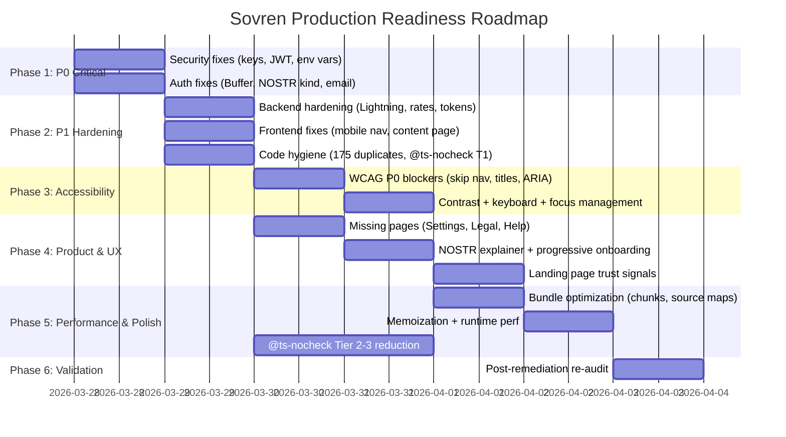

# Full Production Readiness Roadmap — 12-Agent Audit Remediation

## Overview

Comprehensive remediation plan addressing all findings from the 3-wave, 12-agent production readiness audit conducted 2026-03-28. The audit deployed 12 domain expert agents across 3 waves (Engineering/Architecture, QA/UAT/A11y/Performance, Product/Users/Trolls) testing the live application at localhost:3000 with real browser interactions.

**Audit results:** 8 P0/Critical, 12 P1, 36+ P2, 17+ P3 findings across security, frontend, backend, accessibility, performance, and product/UX domains. Product scores: PM 5.8/10, Creator 4/10, Troll 7.5/10 resilience, New User 3/10. WCAG AA compliance ~56%.

**Goal:** Move Sovren from "not production-ready" to "closed alpha ready" (Phase 1-2), then "public beta ready" (Phase 3-4), then "production launch ready" (Phase 5-6).

## Problem Frame

Sovren's backend architecture is mature (JWT + NOSTR + CSRF + rate limiting + RLS + idempotency + graceful shutdown), but the frontend has critical auth blockers, accessibility failures, and crypto-first UX that alienates mainstream creators. Security review found 3 CRITICAL issues (keys on disk, JWT in localStorage, weak secret). No user journey is completable end-to-end.

## Requirements Trace

- R1. All P0/Critical security issues resolved — no credential exposure, no auth bypass
- R2. At least one complete user journey works end-to-end (signup → create → publish → discover)
- R3. WCAG 2.1 AA compliance ≥80% (from current ~56%)
- R4. All P1 findings resolved — auth gaps, code hygiene, mobile nav, content display
- R5. Product scores improved: Creator ≥7/10, New User ≥6/10 (from 4/10 and 3/10)
- R6. Performance grade maintained at B+ or better
- R7. Post-remediation validation confirms no regression or new P0/P1 introduced
- R8. Legal compliance met — Terms of Service, Privacy Policy pages exist

## Scope Boundaries

- **In scope:** All findings from the 12-agent audit, organized into 6 phases
- **Out of scope:** Fiat on-ramp integration (Strike/River), creator migration tools, mobile native app, newsletter/email functionality, digital product sales — these are post-launch features
- **Deferred:** The 114 P2+P3 findings from the March 23 prior audit (already tracked separately)

## Context & Research

### Relevant Code and Patterns

- Auth middleware: `packages/backend/src/middleware/auth.ts`
- NOSTR auth service: `packages/backend/src/services/nostr-auth.ts`
- Auth context: `packages/frontend/src/features/auth/services/AuthContext.tsx`
- Layout (a11y): `packages/frontend/src/components/ui/Layout.tsx`
- CommentForm (a11y exemplar): `packages/frontend/src/features/comments/components/CommentForm.tsx`
- Vite config: `packages/frontend/vite.config.ts`
- App routing: `packages/frontend/src/App.tsx`
- Backend middleware stack: `packages/backend/src/app.ts`
- Lightning receipts (no auth): `packages/backend/src/routes/lightning-receipts.ts`

### Institutional Learnings

- **Prior remediation phasing works:** P0+P1 first → P2 → P3 → re-audit (see origin: `docs/solutions/infrastructure-issues/production-readiness-full-cycle-red-to-green-20260326.md`)
- **Post-remediation re-audit is mandatory** — last sprint found 1 P0 + 18 P1 in the fixes themselves
- **Domain-grouped agents = zero merge conflicts** — proven across 8+ consecutive sprints. Formula: `ceil(findings / 4)` agents, capped at 6
- **85% of pre-existing todos were stale** — verify each finding against current source before implementing
- **Verify before deleting** — 30% of "dead code" items are actually functional. Always `grep -r` across full monorepo before removing exports
- **@ts-nocheck ratchet** — CI baseline in `ci/ts-nocheck-baseline.txt`. Remove @ts-nocheck only after fixing underlying type errors
- **Vite treeshake risk** — never set `treeshake.moduleSideEffects: false`. Always validate vite.config.ts changes with `npm run build && npx vite preview`
- **JWT migration risks** — signing secret must come from env var (no random fallback), roles assigned server-side from DB, middleware ordering: auth before body-parser
- **`VITE_*` vars must be present at BUILD time** — not just runtime. Verify CI has correct vars in the build step

### External References

- WCAG 2.1 AA Guidelines — skip navigation (2.4.1), page titles (2.4.2), focus management (2.1.2), contrast (1.4.3)
- OWASP Top 10 — A01 (Broken Access Control), A02 (Cryptographic Failures), A07 (Auth Failures)
- NIP-42 (NOSTR Authentication) — event kind 22242 for auth challenges

## Key Technical Decisions

- **Buffer fix approach:** Replace `Buffer.from()` with inline hex conversion (`Array.from(bytes, b => b.toString(16).padStart(2, '0')).join('')`) rather than adding a polyfill — avoids bundle bloat and aligns with browser-native APIs
- **JWT storage migration:** Move from localStorage to HttpOnly cookies with SameSite=Strict — the CSRF double-submit pattern already exists in the backend
- **Email signup:** Remove the Email tab entirely for now — it creates a deceptive dead-end. Re-add when Supabase email auth is properly wired
- **NOSTR explainer approach:** One-sentence plain-English definition on first mention per page, not a separate education page. Progressive disclosure: email-first option → NOSTR as upgrade path
- **@ts-nocheck removal:** Tiered approach — security-critical files first (controllers, routes, payment), then business logic, then test infra. Fix underlying type errors, never add `as any` casts
- **Duplicate file cleanup:** Delete all macOS Finder copy artifacts (` 2.ts`, ` 3.ts` suffixes) outright after verifying with `git log` they are not canonical versions
- **Missing pages (Settings, Legal):** Create minimal viable pages — not full features. Settings: profile edit + wallet config. Legal: static markdown-rendered pages

## Open Questions

### Resolved During Planning

- **Q: Fix Buffer via polyfill or replacement?** → Replacement. Polyfill adds ~50KB to bundle. Inline hex conversion is 2 lines.
- **Q: Remove email signup or implement it?** → Remove for now. Implementing Supabase email auth properly (verification, password reset) is a separate feature.
- **Q: How to phase 170 @ts-nocheck removals?** → By severity tier. Security-critical first (10 files), business logic second (80 files), test infra third (40 files), frontend fourth (40 files). Track via CI ratchet baseline.
- **Q: Separate PRs per phase or bundled?** → Separate PRs per phase. Prior sprint validated this approach across 9 PRs. Allows independent review and rollback.

### Deferred to Implementation

- **Q: Exact type errors in each @ts-nocheck file** — unknown until @ts-nocheck is removed and compiler runs
- **Q: Which of 175 duplicate files are imported at runtime** — requires `grep -r` verification during implementation
- **Q: React chunking fix** — may require function-based `manualChunks` strategy instead of array-based. Exact approach depends on Rollup's module graph
- **Q: HttpOnly cookie format** — exact cookie name, path, domain, expiry need to be determined alongside backend CORS changes

## High-Level Technical Design

> _This illustrates the intended approach and is directional guidance for review, not implementation specification. The implementing agent should treat it as context, not code to reproduce._

## Implementation Units

### Phase 1: P0 Critical — Unblock Alpha (2 units, parallel)

- [ ] **Unit 1: Security Critical Fixes**

**Goal:** Eliminate credential exposure, fix JWT storage, strengthen JWT secret, fix env var convention

**Requirements:** R1

**Dependencies:** None — first unit

**Files:**

- Delete: `packages/backend/.env` (after extracting values to secure location)
- Modify: `packages/frontend/src/shared/utils/auth.ts` (JWT → HttpOnly cookie)
- Modify: `packages/frontend/src/contexts/NostrAuthContext.tsx` (remove localStorage token storage)
- Modify: `packages/frontend/src/services/api/apiClient.ts` (send credentials: 'include' instead of Bearer header)
- Modify: `packages/backend/src/routes/auth.ts` (set HttpOnly cookie on login/refresh, clear on logout)
- Modify: `packages/backend/src/middleware/auth.ts` (read JWT from cookie, not Authorization header)
- Modify: `packages/backend/src/app.ts` (CORS: add frontend origin to credentials allowlist)
- Modify: `packages/frontend/src/contexts/NostrAuthContext.tsx` (fix `process.env.REACT_APP_API_URL` → `import.meta.env.VITE_API_URL`)
- Modify: `packages/frontend/src/hooks/useAnalyticsService.ts` (same env var fix)
- Modify: `packages/frontend/src/hooks/useQualityMetricsService.ts` (same env var fix)
- Modify: `packages/frontend/src/features/analytics/services/enhancedAnalyticsService.ts` (fix `process.env.NEXT_PUBLIC_*`)
- Modify: `packages/frontend/src/features/subscriptions/services/useUserSubscriptionService.ts` (fix `process.env.NEXT_PUBLIC_API_URL`)
- Modify: `packages/frontend/src/features/supporter/services/supporterExperienceService.ts` (fix `process.env.NEXT_PUBLIC_API_URL`)
- Test: `packages/backend/src/__tests__/middleware/auth.test.ts`
- Test: `packages/backend/src/__tests__/routes/auth.test.ts`

**Approach:**

- JWT migration: Backend sets `Set-Cookie: token=<jwt>; HttpOnly; Secure; SameSite=Strict; Path=/api; Max-Age=86400` on successful auth. Frontend sends `credentials: 'include'` on all API requests. Backend auth middleware reads from `req.cookies.token`. CSRF double-submit pattern already exists and protects cookie-based auth.
- JWT secret: Generate new 256-bit secret via `openssl rand -base64 48`. Add production guard that throws if secret length < 32 or matches UUID pattern.
- Env var fix: Find-and-replace `process.env.REACT_APP_*` and `process.env.NEXT_PUBLIC_*` with `import.meta.env.VITE_*` equivalents in the 6 identified files.
- Delete `packages/backend/.env` from disk (it should never have been there — `.gitignore` should prevent, but verify).

**Patterns to follow:**

- CSRF double-submit pattern already in `packages/backend/src/middleware/csrf.ts`
- Cookie parser already in middleware stack (`app.ts`)
- Prior JWT secret fix in `docs/solutions/security-issues/p1-critical-fixes-pr73-round4.md`

**Test scenarios:**

- Auth middleware reads JWT from cookie, not Authorization header
- Login response sets HttpOnly cookie with correct attributes
- Logout clears the cookie
- CSRF protection still works with cookie-based auth
- API calls with `credentials: 'include'` pass auth
- Production guard throws on weak JWT secret
- All 6 env var files use `import.meta.env.VITE_*` correctly
- Frontend build succeeds with correct env vars resolved

**Verification:**

- No `.env` file exists in `packages/backend/`
- `grep -r 'localStorage.*token' packages/frontend/` returns zero matches (except demo mode)
- `grep -r 'process.env.REACT_APP\|process.env.NEXT_PUBLIC' packages/frontend/src/` returns zero matches
- Auth flow works end-to-end with HttpOnly cookies
- CSRF protection functional

---

- [ ] **Unit 2: Auth Flow Critical Fixes**

**Goal:** Fix Buffer polyfill, NOSTR event kind, email signup dead-end, and WCAG P0 blockers

**Requirements:** R2, R3

**Dependencies:** None — parallel with Unit 1

**Files:**

- Modify: `packages/frontend/src/pages/Login.tsx` (replace Buffer.from with hex conversion)
- Modify: `packages/frontend/src/pages/Signup.tsx` (replace Buffer.from, fix kind: 1 → 22242, fix timestamp ms → s, remove email tab)
- Modify: `packages/frontend/src/features/nostr/components/NostrOnboarding.tsx` (Buffer fix)
- Modify: `packages/frontend/src/features/nostr/components/NOSTRKeyManager.tsx` (Buffer fix)
- Modify: `packages/frontend/src/features/nostr/services/KeyManagementService.ts` (Buffer fix)
- Modify: `packages/frontend/src/features/nostr/services/BackupEncryptionService.ts` (Buffer fix)
- Modify: `packages/frontend/src/features/nostr/services/NIP26Service.ts` (Buffer fix)
- Modify: `packages/frontend/src/components/ui/Layout.tsx` (skip nav, aria-labels, page title hook, mobile menu focus trap, contrast fixes)
- Modify: `packages/frontend/src/pages/Home.tsx` (add `<main>` landmark, contrast fixes)
- Create: `packages/frontend/src/hooks/useDocumentTitle.ts` (page title management)
- Modify: `packages/frontend/src/pages/Login.tsx` (add useDocumentTitle, role="alert" on error)
- Modify: `packages/frontend/src/pages/Signup.tsx` (add useDocumentTitle)
- Modify: `packages/frontend/src/pages/NotFound.tsx` (add useDocumentTitle)
- Modify: `packages/frontend/src/components/ui/spinner.tsx` (add role="status", sr-only text)
- Modify: `packages/frontend/src/components/ui/loading-spinner.tsx` (add role="status", sr-only text)
- Modify: `packages/frontend/src/App.tsx` (Suspense fallback spinner gets role="status")
- Test: `packages/frontend/src/__tests__/pages/Signup.test.tsx`
- Test: `packages/frontend/src/__tests__/pages/Login.test.tsx`

**Approach:**

- Buffer fix: Replace all `Buffer.from(x).toString('hex')` with `Array.from(new Uint8Array(x), b => b.toString(16).padStart(2, '0')).join('')`. Replace `new Uint8Array(Buffer.from(hex, 'hex'))` with `new Uint8Array(hex.match(/.{1,2}/g)!.map(b => parseInt(b, 16)))`. Extract to a shared util if used in 3+ files.
- NOSTR kind fix: Change `kind: 1` to `kind: 22242` in Signup.tsx event construction. Change `Date.now()` to `Math.floor(Date.now() / 1000)` for timestamp.
- Email tab removal: Remove the "Email" tab from Signup.tsx. Keep only the NOSTR tab. Add a note: "Email signup coming soon."
- Skip navigation: Add `<a href="#main-content" className="sr-only focus:not-sr-only ...">Skip to main content</a>` as first child of Layout and Home.
- Page titles: Create `useDocumentTitle(title: string)` hook using `useEffect` to set `document.title`. Apply to every page component.
- Spinner a11y: Add `role="status"` and `Loading...` to all spinner components.
- Layout a11y: Add `aria-label` to all `<nav>` elements, `aria-label` to icon-only buttons, focus trap on mobile menu overlay, Escape key handler.
- Contrast: Replace `text-white/20`, `text-white/30`, `text-white/40` with `text-white/60` minimum on interactive elements (meets 3:1 for UI components) and `text-white/70` minimum for body text (meets 4.5:1).

**Patterns to follow:**

- CommentForm a11y patterns (`aria-describedby`, `aria-required`, `role="alert"`, focus management)
- DiscoveryPage patterns (`aria-pressed`, `sr-only` labels, `aria-label` on nav)

**Test scenarios:**

- NOSTR key generation works in browser (no Buffer dependency)
- Signup creates event with kind: 22242 and timestamp in seconds
- Email tab is not visible on signup page
- Skip navigation link visible on focus, navigates to #main-content
- Each page has a unique `<title>` (e.g., "Login - Sovren", "Discover Creators - Sovren")
- All spinners announce "Loading" to screen readers
- Mobile menu traps focus and closes on Escape
- All interactive text meets WCAG contrast minimums
- Tab order through Layout sidebar is logical

**Verification:**

- `grep -r 'Buffer\.' packages/frontend/src/` returns zero matches
- `grep -r "kind: 1" packages/frontend/src/pages/Signup.tsx` returns zero matches
- Lighthouse accessibility audit ≥80 on /, /login, /signup, /discover
- All pages have unique titles visible in browser tab

---

### Phase 2: P1 Hardening (3 units, parallel with non-overlapping files)

- [ ] **Unit 3: Backend Security Hardening**

**Goal:** Add auth to Lightning receipts, add rate limiting to subscription tiers, implement token refresh revocation, fix admin role in JWT schema

**Requirements:** R1, R2

**Dependencies:** Unit 1 (JWT cookie migration must land first — auth middleware changes)

**Files:**

- Modify: `packages/backend/src/routes/lightning-receipts.ts` (add `authenticate` middleware to all handlers)
- Modify: `packages/backend/src/routes/subscription-tiers.ts` (add rate limiter)
- Modify: `packages/backend/src/services/nostr-auth.ts` (add `revokeToken(oldToken)` inside `refreshJWT()`, add 'admin' to JWT role schema, move challenge store to Redis)
- Modify: `packages/backend/src/routes/auth.ts` (inline admin check → `authorize(['admin'])` middleware)
- Modify: `packages/backend/src/middleware/idempotency.ts` (add key format validation — UUID only, max 64 chars)
- Test: `packages/backend/src/__tests__/routes/lightning-receipts.test.ts`
- Test: `packages/backend/src/__tests__/services/nostr-auth.test.ts`

**Approach:**

- Lightning receipts: Add `authenticate` middleware before all route handlers. Add `requireOwnership` check — receipt must belong to the requesting user's payment.
- Subscription tiers: Apply `rateLimiters.payment.createSubscription` at router level.
- Token refresh: Inside `refreshJWT()`, after issuing new token, call `revokeToken(currentToken)` with TTL matching JWT expiry. Re-read user role from database on refresh (not from stale token claims).
- Admin role: Add `'admin'` to `VALID_JWT_ROLES` set and Zod enum. This unblocks admin authorization guards.
- Challenge store: Move from in-memory `Map` to Redis with 5-minute TTL (same pattern as token revocation).
- Idempotency key: Validate format as UUID v4, reject keys > 64 characters.

**Patterns to follow:**

- Two-layer IDOR pattern (critical-patterns.md #20): route middleware `requireOwnership` + controller verification
- Timing-safe HMAC comparison (critical-patterns.md, common-solutions.md)
- Redis with in-memory fallback pattern in `nostr-auth.ts` token revocation

**Test scenarios:**

- Lightning receipt endpoints return 401 without auth token
- Lightning receipt endpoints return 403 when accessing another user's receipt
- Subscription tier mutations are rate-limited (return 429 after threshold)
- Token refresh revokes the old token (old token returns 401 after refresh)
- Refresh endpoint re-reads role from database
- Admin role is accepted in JWT validation
- Challenge verification works across Redis (not just in-memory)
- Idempotency key rejects non-UUID formats and >64 char strings

**Verification:**

- `grep -r 'router\.' packages/backend/src/routes/lightning-receipts.ts` shows `authenticate` on every handler
- Token refresh + old token test passes
- Rate limit test for subscription tiers passes

---

- [ ] **Unit 4: Frontend UX Critical Fixes**

**Goal:** Fix mobile navigation, content detail page, onboarding flow, and NOSTR key validation

**Requirements:** R2, R5

**Dependencies:** Unit 2 (auth flow fixes must land first)

**Files:**

- Modify: `packages/frontend/src/components/ui/Layout.tsx` (add hamburger menu for mobile — the nav links are hidden at 375px with no menu button)
- Modify: `packages/frontend/src/pages/ContentDetail.tsx` (add content display above comments — currently shows only comments)
- Modify: `packages/frontend/src/components/onboarding/SovereignOnboarding.tsx` (fix "Begin Journey" button → should advance to step 2, not redirect to /login)
- Modify: `packages/frontend/src/pages/Signup.tsx` (add NOSTR key format validation — bech32 npub1/nsec1 prefix, length check)
- Modify: `packages/frontend/src/pages/Login.tsx` (same NOSTR key validation)
- Modify: `packages/frontend/src/features/discovery/components/DiscoveryPage.tsx` (proper empty state design instead of error message)
- Modify: `packages/frontend/src/pages/Home.tsx` (add footer with nav links)
- Test: `packages/frontend/src/__tests__/pages/ContentDetail.test.tsx`

**Approach:**

- Mobile nav: Layout.tsx already has mobile detection. The nav links (Features, How It Works, Discover) at `<375px` need a hamburger toggle. Use the existing mobile menu overlay pattern but include the public nav links, not just auth sidebar links.
- Content detail: ContentDetail.tsx needs a content fetch (title, body, author, media) above the comments section. Add loading state, error state ("Content not found" for invalid IDs), and proper 404 UX.
- Onboarding: Debug the "Begin Journey" button handler — it should call `setCurrentStep(2)` but appears to navigate to `/login` instead. Likely a conditional that checks auth status and redirects.
- Key validation: Add bech32 validation — check `npub1` prefix (33-byte pubkey), `nsec1` prefix (32-byte privkey). Show inline error: "Please enter a valid NOSTR public key (starts with npub1)".
- Empty states: Discovery page shows "No creators found yet — be the first to join!" with CTA to signup, instead of error message.

**Patterns to follow:**

- Mobile overlay pattern already in Layout.tsx (lines 320-362)
- Error boundary pattern per feature domain
- DiscoveryPage category buttons for UX reference

**Test scenarios:**

- Mobile viewport (375px) shows hamburger menu with working nav links
- Content detail page shows content above comments for valid IDs
- Content detail page shows "Content not found" for invalid IDs (not infinite spinner)
- Onboarding "Begin Journey" advances to step 2
- Invalid NOSTR keys show inline validation error
- Valid NOSTR keys enable submit button
- Discovery empty state shows helpful message, not error
- Home page footer contains Terms, Privacy, Help links

**Verification:**

- Visual verification at 375x812 viewport shows hamburger menu
- `/content/fake-id` shows proper 404/not-found state
- Onboarding flow advances through all 7 steps without redirect loops

---

- [ ] **Unit 5: Code Hygiene — Duplicate Files + @ts-nocheck Tier 1**

**Goal:** Delete 175 macOS duplicate files, remove @ts-nocheck from 10 security-critical files

**Requirements:** R4

**Dependencies:** None — can run parallel with Units 3-4 (non-overlapping files)

**Files:**

- Delete: All 175 files matching `* 2.ts`, `* 2.tsx`, `* 3.ts`, `* 3.tsx` patterns across `packages/`
- Modify: `packages/backend/src/controllers/payment/PaymentController.ts` (remove @ts-nocheck, fix type errors)
- Modify: `packages/backend/src/controllers/content/ContentController.ts` (same)
- Modify: `packages/backend/src/controllers/user/UserController.ts` (same)
- Modify: `packages/backend/src/routes/lightning.ts` (same)
- Modify: `packages/backend/src/routes/subscription-tiers.ts` (same)
- Modify: `packages/backend/src/routes/lightning-receipts.ts` (same — also gets auth in Unit 3)
- Modify: `packages/backend/src/services/payment/PaymentStateMachine.ts` (same)
- Modify: `packages/backend/src/services/payment/RefundService.ts` (same)
- Modify: `packages/backend/src/services/payment/SubscriptionService.ts` (same)
- Modify: `packages/backend/src/routes/webhooks.ts` (same)
- Modify: `ci/ts-nocheck-baseline.txt` (update count)

**Approach:**

- Duplicate deletion: `find packages/ -name "* 2.ts" -o -name "* 2.tsx" -o -name "* 3.ts" -o -name "* 3.tsx" | sort`. Before deleting, verify each with `grep -r` that it's not imported anywhere. Prior sprint confirmed these are macOS Finder copy artifacts (see origin: `docs/solutions/code-quality/p3-sprint1-cleanup-dead-code-architecture.md`).
- @ts-nocheck Tier 1: Remove the `// @ts-nocheck` line from each file. Run `tsc --noEmit` to see type errors. Fix each error properly — no `as any` casts (see origin: `docs/solutions/code-quality/pr146-review-remediation-s9-buffer-hardening.md`). Update the CI ratchet baseline count.

**Patterns to follow:**

- @ts-nocheck ratchet in CI (`ci/ts-nocheck-baseline.txt`)
- Prior duplicate cleanup in `docs/solutions/code-quality/p3-sprint1-cleanup-dead-code-architecture.md`

**Test scenarios:**

- Build succeeds after duplicate file deletion (`npm run build`)
- Type-check succeeds on all Tier 1 files (`npx tsc --noEmit`)
- No runtime regressions — existing tests still pass
- CI ratchet count decreased

**Verification:**

- `find packages/ -name "* 2.ts" -o -name "* 2.tsx" -o -name "* 3.ts" -o -name "* 3.tsx"` returns empty
- `grep -r '@ts-nocheck' packages/backend/src/controllers/ packages/backend/src/routes/lightning*.ts` returns zero matches for Tier 1 files
- `npm run type-check` passes
- `npm test` passes

---

### Phase 3: Accessibility — WCAG AA Compliance (2 units, sequential)

- [ ] **Unit 6: WCAG P0 Blockers (covered in Unit 2)**

**Note:** The 5 WCAG P0 blockers (skip nav, page titles, spinner roles, mobile menu focus trap, contrast) are addressed in Unit 2. This unit covers the remaining P1 accessibility items.

**Goal:** Fix remaining WCAG P1 issues — form accessibility, landmark roles, ARIA patterns

**Requirements:** R3

**Dependencies:** Unit 2 (P0 a11y fixes)

**Files:**

- Modify: `packages/frontend/src/pages/Login.tsx` (add `aria-required` to key/password fields, `role="alert"` on error container)
- Modify: `packages/frontend/src/pages/Signup.tsx` (proper ARIA tab pattern on auth mode selector)
- Modify: `packages/frontend/src/pages/Home.tsx` (add `aria-hidden="true"` to decorative SVG icons, add `aria-label` to `<nav>`)
- Modify: `packages/frontend/src/components/ui/Layout.tsx` (add `aria-label` to collapsed sidebar icon buttons, `aria-label="Sidebar navigation"` on nav)
- Modify: `packages/frontend/src/features/auth/components/ProtectedRoute.tsx` (add `role="alert"` to access denied message)
- Test: `packages/frontend/e2e/accessibility.spec.ts`

**Approach:**

- Follow CommentForm patterns exactly — `aria-describedby`, `aria-required`, `aria-invalid`, `role="alert"` on all error containers
- Auth mode selector in Signup: Convert to proper ARIA tabs — `role="tablist"` on container, `role="tab"` + `aria-selected` on each button, `role="tabpanel"` on content
- Decorative SVGs: Add `aria-hidden="true"` to icons that have adjacent text labels. Add `<title>` + `aria-labelledby` to icons that are the sole content of a button.
- Layout sidebar: When collapsed, icon-only buttons need `aria-label` matching the full text (e.g., `aria-label="Dashboard"`)

**Patterns to follow:**

- CommentForm: `packages/frontend/src/features/comments/components/CommentForm.tsx`
- DiscoveryPage: `packages/frontend/src/features/discovery/components/DiscoveryPage.tsx`
- CreatorCard: `packages/frontend/src/features/discovery/components/CreatorCard.tsx`

**Test scenarios:**

- Axe accessibility audit passes on /, /login, /signup, /discover with 0 critical violations
- Tab through entire signup form — logical order, all inputs reachable
- Screen reader announces error messages when login fails
- Screen reader identifies sidebar navigation links by name when collapsed
- All decorative images have `aria-hidden="true"`

**Verification:**

- Lighthouse accessibility score ≥85 on all tested pages
- Zero critical/serious axe-core violations
- Manual keyboard navigation test passes

---

- [ ] **Unit 7: Accessibility Testing & Validation**

**Goal:** Add automated accessibility testing to CI and validate compliance

**Requirements:** R3

**Dependencies:** Unit 6

**Files:**

- Create: `packages/frontend/e2e/accessibility.spec.ts` (Playwright + axe-core)
- Modify: `.github/workflows/ci.yml` (add a11y test step)
- Modify: `packages/frontend/package.json` (add `@axe-core/playwright` dev dependency)

**Approach:**

- Create Playwright spec that runs axe-core on every major page (/, /login, /signup, /discover, /onboarding, /content/test, 404 page)
- Configure axe rules: WCAG 2.1 AA, exclude `color-contrast` with known exceptions documented in comments
- Add to CI pipeline after E2E tests
- Fail CI on any new critical/serious axe violations

**Test scenarios:**

- Axe scan on each page produces zero critical/serious violations
- CI blocks PRs that introduce new a11y violations
- Report format shows page + violation + element for easy debugging

**Verification:**

- `npm run test:a11y` passes with zero critical/serious violations
- CI pipeline includes a11y gate

---

### Phase 4: Product & UX — Creator/User Experience (3 units, sequential)

- [ ] **Unit 8: Missing Pages — Settings, Legal, Help**

**Goal:** Create Settings, Terms of Service, Privacy Policy, and Help/FAQ pages

**Requirements:** R5, R8

**Dependencies:** Unit 1 (auth), Unit 4 (routing)

**Files:**

- Create: `packages/frontend/src/pages/Settings.tsx` (profile edit, wallet config, notification prefs)
- Create: `packages/frontend/src/pages/Terms.tsx` (static markdown-rendered)
- Create: `packages/frontend/src/pages/Privacy.tsx` (static markdown-rendered)
- Create: `packages/frontend/src/pages/Help.tsx` (FAQ with common questions + expandable answers)
- Modify: `packages/frontend/src/App.tsx` (add routes: /settings, /terms, /privacy, /help)
- Modify: `packages/frontend/src/components/ui/Layout.tsx` (add Settings to sidebar nav)
- Modify: `packages/frontend/src/pages/Home.tsx` (add footer links to Terms, Privacy, Help)

**Approach:**

- Settings: Minimal viable page — display current profile (name, bio, avatar URL, NOSTR pubkey), allow editing name/bio, show connected wallet status. Use existing `ProtectedRoute` wrapper. Follow same dark theme and glass-morphism card pattern as other pages.
- Legal pages: Static content rendered from markdown strings. Must include: data collection disclosure, NOSTR key responsibility, Lightning payment terms, contact information. Mark as public routes (no auth required).
- Help/FAQ: Collapsible accordion with 10-15 common questions. Must include: "What is NOSTR?", "Do I need Bitcoin?", "What are sats?", "What happens if I lose my keys?", "How do payments work?", "What are the fees?". Public route.

**Patterns to follow:**

- Page component pattern: lazy-loaded, with ErrorBoundary wrapper, useDocumentTitle hook
- Card layout pattern from existing pages
- ProtectedRoute for Settings, public for Legal/Help

**Test scenarios:**

- /settings accessible when authenticated, redirects to /login when not
- /terms, /privacy, /help accessible without authentication
- Settings page displays user profile data
- Settings page allows editing name and bio
- Legal pages render complete content
- Help page accordion expands/collapses FAQ items
- Footer links navigate to correct pages
- All new pages have unique document titles

**Verification:**

- All 4 new routes exist in App.tsx
- Navigation to each page works
- Settings page displays and edits profile data

---

- [ ] **Unit 9: NOSTR Explainer & Progressive Onboarding**

**Goal:** Add plain-English NOSTR explanation, simplify onboarding, reduce crypto jargon

**Requirements:** R5

**Dependencies:** Unit 2 (email tab removed), Unit 8 (Help/FAQ exists for deep-dive links)

**Files:**

- Modify: `packages/frontend/src/pages/Home.tsx` (NOSTR explainer on first mention, replace fake stats, add social proof section)
- Modify: `packages/frontend/src/components/onboarding/SovereignOnboarding.tsx` (simplify to 5 steps max, progressive disclosure, plain language)
- Modify: `packages/frontend/src/pages/Signup.tsx` (add brief NOSTR explainer above key fields)
- Modify: `packages/frontend/src/pages/Login.tsx` (same)
- Modify: `packages/frontend/src/features/discovery/components/DiscoveryPage.tsx` (remove "building on NOSTR and Lightning Network" subtitle)

**Approach:**

- NOSTR explainer: One sentence on first mention per page. Example: "NOSTR is a new way to publish online where no company can delete your content or ban your account. Your keys are your login — they work across any NOSTR app." Place this in a subtle info callout, not a modal.
- Homepage: Replace "12,500+ Creators" / "2,100,000 Sats Earned" with honest messaging: "Join the first wave of sovereign creators" / "Early access — help shape the platform". Replace "sats" in the dashboard mockup with a USD equivalent tooltip. Add "What are sats?" link to Help page.
- Onboarding simplification: Reduce from 7 steps to 5 — combine Welcome+Path into one step, combine Secure+Verify into one step. Add "I'll do this later" skip option for Lightning wallet setup. Add estimated time per step ("~30 seconds").
- Jargon reduction: Replace "sovereign" with "independent" or "self-owned" where possible. Replace "cryptographic identity" with "your personal keys (like a username and password that only you control)". Keep technical terms available via tooltip/link for interested users.

**Patterns to follow:**

- Info callout component pattern (if exists, or create simple one)
- Tooltip pattern for technical term definitions

**Test scenarios:**

- Homepage first mention of NOSTR includes plain-English explanation
- Homepage stats section uses honest messaging (no fake numbers)
- Onboarding flow has ≤5 steps
- Each step shows estimated time
- Lightning wallet step can be skipped
- "Sats" has USD equivalent or explanation wherever it appears
- Non-technical user can understand signup page without prior crypto knowledge

**Verification:**

- Read through all user-facing text — no undefined jargon (NOSTR, sats, Lightning) without adjacent explanation
- Onboarding step count ≤5
- Homepage stats are honest

---

- [ ] **Unit 10: Landing Page Trust & Conversion**

**Goal:** Add social proof, fix CTA for dual audiences, improve footer

**Requirements:** R5

**Dependencies:** Unit 9 (NOSTR explainer), Unit 8 (Legal pages exist for footer links)

**Files:**

- Modify: `packages/frontend/src/pages/Home.tsx` (social proof section, dual-audience CTA, complete footer)

**Approach:**

- Social proof: Add "Built with" section showing tech logos (NOSTR, Lightning, React, TypeScript). Add "Why creators choose Sovren" section with 3 benefit cards comparing to Patreon fees. Since there are no real testimonials yet, use the honest approach: "Be among the first creators to own their platform."
- Dual CTA: "Start Creating" for creators, "Browse Creators" for supporters. Both above the fold.
- Footer: Full footer with columns — Product (Features, Discover, Pricing), Resources (Help, FAQ, API Docs), Legal (Terms, Privacy), Social (GitHub link). Include company name and year.
- Remove the duplicate signup form embedded at the bottom of the homepage (it creates an extremely long page).

**Test scenarios:**

- Landing page has both creator and supporter CTAs
- Footer contains links to all legal and help pages
- "Why Sovren" section communicates fee advantage over Patreon
- No duplicate signup form at page bottom
- Social proof section renders without hardcoded user counts

**Verification:**

- Homepage visual review at desktop and mobile viewports
- All footer links navigate correctly
- Page length reduced (no duplicate signup form)

---

### Phase 5: Performance & Polish (3 units)

- [ ] **Unit 11: Bundle Optimization**

**Goal:** Fix React chunking, remove source maps from dist, optimize charts chunk

**Requirements:** R6

**Dependencies:** Unit 2 (must validate against auth changes)

**Files:**

- Modify: `packages/frontend/vite.config.ts` (fix manualChunks to separate React from router, set sourcemap: false for production, add post-build chunk size CI check)
- Modify: `.github/workflows/ci.yml` (add chunk size validation step)

**Approach:**

- React chunking: Switch from array-based `manualChunks` to function-based strategy that inspects `id` paths. React and ReactDOM should be in their own `react-vendor` chunk, separate from `react-router-dom`.
- Source maps: Change `sourcemap: isProd ? 'hidden' : true` to `sourcemap: isProd ? false : true`. Hidden source maps are still generated and deployed — they expose source code. If Sentry integration needs them, upload via `@sentry/vite-plugin` during CI and exclude from deployment.
- Charts: Investigate lazy-importing only specific recharts components (`BarChart`, `LineChart`, `PieChart`) instead of the full library. The 374KB raw chunk may reduce to <200KB.

**Execution note:** Always validate vite.config.ts changes with `npm run build && npx vite preview`. The dev server does NOT apply Rollup treeshaking. (see origin: `docs/solutions/build-errors/vite-treeshake-empty-production-bundles-20260301.md`)

**Test scenarios:**

- `react-vendor` chunk contains React + ReactDOM, NOT react-router-dom
- No `.map` files in `dist/assets/` after production build
- `charts` chunk < 250KB raw
- All other chunks < 250KB raw
- Production build succeeds and app renders correctly in preview
- Post-build CI step validates chunk sizes

**Verification:**

- `npm run build` output shows separate `react-vendor` and `router` chunks
- `find packages/frontend/dist -name "*.map" | wc -l` returns 0
- `npx vite preview` renders the app correctly

---

- [ ] **Unit 12: Runtime Performance**

**Goal:** Memoize CreatorCard, throttle analytics listener, add per-route Suspense

**Requirements:** R6

**Dependencies:** Unit 4 (discovery page changes)

**Files:**

- Modify: `packages/frontend/src/features/discovery/components/CreatorCard.tsx` (wrap with React.memo)
- Modify: `packages/frontend/src/hooks/useAnalytics.ts` (throttle mousemove listener to 5-second intervals)
- Modify: `packages/frontend/src/App.tsx` (move Suspense inside each Route, after Layout, so shell stays visible during navigation)
- Modify: `packages/frontend/src/main.tsx` (fix ReactQueryDevtools check: `import.meta.env.DEV` not `import.meta.env.NODE_ENV`)

**Approach:**

- CreatorCard memo: Wrap export with `React.memo()`. The component renders in lists on the Discovery page — memoization prevents re-renders when filters change.
- Analytics throttle: Replace raw `mousemove` addEventListener with a throttled version (5-second interval). The current listener fires on every pixel of mouse movement.
- Per-route Suspense: Move the single `<Suspense>` from wrapping all routes to inside each `<Route>` element. This keeps the Layout shell (sidebar + header) visible during lazy-loaded route transitions. Resolves TODO(SOV-UX-001).
- DevTools fix: Change `import.meta.env.NODE_ENV` to `import.meta.env.DEV` — Vite doesn't set `NODE_ENV` in `import.meta.env`.

**Test scenarios:**

- Discovery page re-renders: changing sort order does not re-render unchanged CreatorCards
- mousemove listener fires at most once per 5 seconds
- Navigation between routes keeps Layout shell visible (no full-page spinner)
- ReactQueryDevtools visible in development mode

**Verification:**

- Discovery page performance: no unnecessary re-renders visible in React DevTools profiler
- Layout shell persists during route transitions
- `npm run dev` shows ReactQueryDevtools panel

---

- [ ] **Unit 13: @ts-nocheck Tier 2 Reduction**

**Goal:** Remove @ts-nocheck from business logic services and remaining route files

**Requirements:** R4

**Dependencies:** Unit 5 (Tier 1 complete)

**Files:**

- Modify: ~80 files across `packages/backend/src/services/` and `packages/backend/src/routes/v2/`
- Modify: `ci/ts-nocheck-baseline.txt`

**Approach:**

- Systematic removal: Process files in batches of 10. For each file: remove `// @ts-nocheck`, run `tsc --noEmit`, fix all type errors. Common fixes: add proper interface types to function parameters, replace `any` with specific types, add null checks.
- Priority order within Tier 2: payment services first, then content services, then user services, then remaining routes.
- Track progress via CI ratchet baseline.
- Tier 3 (40 test infra files in `packages/testing/`) deferred to post-launch — they don't affect production runtime.

**Execution note:** Execution target: external-delegate — this is mechanical type-fixing work suitable for parallel delegation.

**Test scenarios:**

- Each batch of files compiles without @ts-nocheck
- Existing tests pass after each batch
- No `as any` casts introduced (prefer proper typing)

**Verification:**

- @ts-nocheck count reduced by ≥80 from baseline
- `npm run type-check` passes
- `npm test` passes

---

### Phase 6: Post-Remediation Validation (1 unit)

- [ ] **Unit 14: Re-Audit & Regression Validation**

**Goal:** Run a focused re-audit to confirm all P0/P1 findings are resolved and no new issues were introduced

**Requirements:** R7

**Dependencies:** All previous units

**Files:**

- No new files — this is a validation unit

**Approach:**

- Re-run the 3-wave audit methodology at reduced scope: 6 agents (not 12), focused on the specific findings from this audit
- Wave A: Security engineer + Backend engineer — verify all CRITICAL/HIGH findings resolved
- Wave B: QA lead + A11y specialist — verify functional and accessibility fixes
- Wave C: New User persona — re-test the signup and onboarding flow
- Document any new findings
- If new P0/P1 found, create a follow-up remediation unit (do not expand this plan)

**Test scenarios:**

- All 8 P0/Critical findings verified resolved
- All 12 P1 findings verified resolved
- No new P0/P1 introduced by the fixes
- WCAG AA compliance ≥80%
- At least one complete user journey works end-to-end
- Performance grade maintained at B+ or better

**Verification:**

- Re-audit report shows zero P0/Critical, zero new P1
- Complete user journey demonstrated: signup → onboarding → dashboard → create → publish → discover
- Lighthouse scores: Performance ≥80, Accessibility ≥80, Best Practices ≥90

---

## System-Wide Impact

- **Auth flow changes (Unit 1):** JWT migration from localStorage to HttpOnly cookies affects: apiClient.ts, AuthContext.tsx, all E2E auth setup, CORS config, CSRF middleware. Every API call pattern changes from `Authorization: Bearer` to `credentials: 'include'`.
- **Buffer removal (Unit 2):** Affects 7 files across frontend NOSTR features. Must verify no other Node.js-only APIs are used (check for `crypto`, `Buffer`, `process` in frontend code).
- **Duplicate file deletion (Unit 5):** 175 files deleted — must verify no barrel exports (`index.ts`) reference them. TypeScript compiler will catch most issues, but dynamic imports could be missed.
- **@ts-nocheck removal (Units 5, 13):** Removing type suppression will surface real type errors. Some may cascade (fixing one type reveals errors in callers). Budget for cascading fixes.
- **Layout changes (Units 2, 4, 6):** Layout.tsx is the most widely-used component — changes here affect every authenticated page. Test at multiple viewports.

## Risks & Dependencies

| Risk                                                | Likelihood | Impact | Mitigation                                                                                   |
| --------------------------------------------------- | ---------- | ------ | -------------------------------------------------------------------------------------------- |
| JWT cookie migration breaks existing E2E tests      | High       | Medium | Update auth.setup.ts to use cookie-based auth before running tests                           |
| @ts-nocheck removal reveals deep type issues        | High       | Medium | Process in batches of 10. If a file has >20 type errors, defer to Tier 3                     |
| Vite config changes break production build          | Medium     | High   | Always validate with `npm run build && npx vite preview` (Pattern #6 in learnings)           |
| Duplicate file deletion breaks barrel imports       | Low        | High   | `grep -r` every file before deletion. TypeScript compiler catches most issues                |
| NOSTR explainer copy is too technical or too simple | Medium     | Low    | Test with non-technical team member. Iterate based on feedback                               |
| Re-audit finds new P0/P1 in the fixes               | High       | Medium | Budget for it — prior sprint found 1 P0 + 18 P1 in re-audit. Treat as expected, not surprise |

## Alternative Approaches Considered

- **Buffer polyfill vs replacement:** Polyfill adds ~50KB to bundle. Replacement is 2 lines of code. Chose replacement.
- **Email signup: implement vs remove:** Implementing Supabase email auth properly requires verification emails, password reset, and session management — a separate feature. Chose removal for now.
- **JWT: HttpOnly cookies vs server-side sessions:** Server-side sessions would require Redis session store and change the auth architecture significantly. HttpOnly cookies preserve the JWT architecture while fixing the XSS exposure. Chose cookies.
- **@ts-nocheck: all at once vs tiered:** All at once would be a massive PR with unpredictable cascade. Tiered approach (security → business → test) allows incremental progress with CI validation. Chose tiered.

## Success Metrics

- All P0/Critical findings: 8/8 resolved → 0 remaining
- All P1 findings: 12/12 resolved → 0 remaining
- WCAG AA compliance: 56% → ≥80%
- Performance grade: B+ maintained or improved
- Product scores: Creator ≥7/10 (from 4), New User ≥6/10 (from 3)
- User journey: ≥1 complete path works end-to-end
- @ts-nocheck count: 170 → ≤50 (Tier 3 test infra deferred)

## Phased Delivery

### Phase 1: P0 Critical (Units 1-2) — PR #1-2

Unblocks closed alpha. Fixes security criticals, auth flow, and WCAG P0 blockers. After this phase, users can sign up and the app doesn't leak credentials.

### Phase 2: P1 Hardening (Units 3-5) — PR #3-5

Unblocks confident alpha. Fixes backend security gaps, frontend UX breaks, and code hygiene. After this phase, the app is functionally solid.

### Phase 3: Accessibility (Units 6-7) — PR #6-7

Achieves WCAG AA compliance ≥80% and adds automated a11y testing to CI. After this phase, the app meets accessibility legal requirements.

### Phase 4: Product & UX (Units 8-10) — PR #8-10

Addresses user feedback from Maya (creator), Sarah (new user), and PM. After this phase, the app is understandable to non-crypto users.

### Phase 5: Performance & Polish (Units 11-13) — PR #11-13

Optimizes bundle, runtime performance, and reduces type safety debt. After this phase, the app meets production performance standards.

### Phase 6: Validation (Unit 14) — PR #14

Confirms all fixes landed correctly and no regressions. Produces final GREEN report.

## Documentation / Operational Notes

- Each phase produces a separate PR with detailed commit messages
- Update CHANGELOG.md with each PR
- After Phase 6, run `/workflows:compound` to document the full sprint
- Cross-reference pattern files after compound (critical-patterns.md, common-solutions.md)
- Update docs/PROJECT_CONTEXT.md if architecture changed (JWT cookie migration)

## Sources & References

- **Audit source:** 3-wave, 12-agent production readiness audit (2026-03-28) — this conversation
- **Prior remediation:** `docs/solutions/infrastructure-issues/production-readiness-full-cycle-red-to-green-20260326.md`
- **Prior plan:** `docs/plans/2026-03-23-001-fix-production-readiness-remediation-plan.md`
- **Critical patterns:** `docs/solutions/patterns/critical-patterns.md` (22 patterns)
- **Common solutions:** `docs/solutions/patterns/common-solutions.md` (180+ patterns)
- **Vite treeshake risk:** `docs/solutions/build-errors/vite-treeshake-empty-production-bundles-20260301.md`
- **JWT prior fix:** `docs/solutions/security-issues/p1-critical-fixes-pr73-round4.md`
- **Dead code cleanup:** `docs/solutions/code-quality/p3-sprint1-cleanup-dead-code-architecture.md`
- **Domain-grouped agents:** `docs/solutions/process-issues/p2-remediation-r5-hook-disaster-domain-agents-20260220.md`
