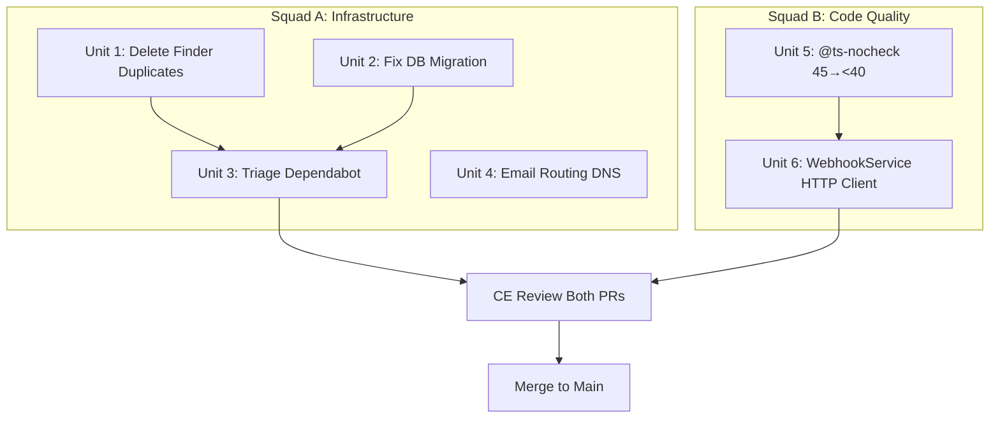

# Quality Sprint: Backlog Burndown

## Overview

Clear all accumulated quality debt before growth features begin. 7 requirements across filesystem hygiene, dependency security, CI stabilization, email compliance, type safety, and production readiness. Two squads execute in parallel with zero file overlap.

## Problem Frame

Sovren's closed alpha works for crypto-native creators, but the codebase carries 174 Finder duplicate files, 35 pending dependency bumps, a broken CI migration, unconfigured compliance email, 45 @ts-nocheck files, and a production stub in WebhookService. This debt weakens the investor story and slows future development. (see origin: docs/brainstorms/2026-03-31-quality-sprint-backlog-burndown-requirements.md)

## Requirements Trace

- R1. Delete all Finder duplicate files from base repo
- R2. Triage and merge Dependabot PR #194 (35 production dependency bumps)
- R3. Close or merge 6 stale dependabot PRs (#148-152, #166)
- R4. Fix DB migration `20260323000003_fix_creator_id_text_to_uuid.sql`
- R5. Configure email routing for dmca@, privacy@, abuse@ sovren.app
- R6. Reduce @ts-nocheck from 45 to <40
- R7. Replace WebhookService.makeHttpRequest stub with real HTTP client

## Scope Boundaries

- No growth features — deferred to next sprint
- Email routing: generate DNS records + docs only; user applies to domain provider
- DB migration fix: schema-only, no application logic changes
- @ts-nocheck: file-by-file removal only, no Supabase row/domain type refactoring

## Context & Research

### Relevant Code and Patterns

- **HTTP client**: Codebase uses native `fetch` exclusively (17 call sites). No axios/got/undici. Node >=20 required.
- **DB migration**: `supabase/migrations/20260323000003_fix_creator_id_text_to_uuid.sql` fails because `platform_connections_select_own` and `platform_connections_service_role` RLS policies reference `creator_id`. Policies created in `20260307000004_rls_financial_tables_phase1.sql`.
- **@ts-nocheck**: All 45 files have zero tsc errors when compiled — removal is pure line deletion + eslint fix. CI ratchet threshold is 101 (stale, should be updated to match actual count).
- **WebhookService stub**: `packages/backend/src/services/payment/WebhookService.ts` lines 1504-1517. Called from line 664 (delivery) and 1074 (ping). Return type `{ status, body, headers }` must be preserved.
- **Email**: nodemailer + handlebars templates. SMTP env vars configured. No DNS config files exist.
- **Finder duplicates**: 174 files with " 2" or " 3" in name across packages/ (not just the 7 originally identified).
- **CI**: `ci.yml` has migration dry-run as non-blocking in test-gate. @ts-nocheck ratchet at typecheck stage.

### Institutional Learnings

- @ts-nocheck bulk removal cascade pattern (docs/solutions/workflow-issues/ts-nocheck-bulk-removal-cascade-pattern-20260330.md): file-by-file only, CI threshold management
- CI production readiness audit (docs/solutions/remediation/ci-production-readiness-audit-2026-03-17.md): RLS type mismatches, lockfile regeneration, bootstrap role creation
- Dependency update patterns PR #99 (docs/solutions/infrastructure-issues/dependency-update-pr99-patterns.md): React 19 hoisting, lockfile precedence, workspace version agreement
- RLS security (docs/solutions/security-issues/discovery-mvp-r2-postgrest-view-security-20260227.md): table + view level policies, security_barrier

## Key Technical Decisions

- **Native fetch for WebhookService**: Use Node.js global `fetch` with `AbortController` signal for timeouts. Matches all 17 existing call sites. No new dependency needed. (see origin: R7)
- **Fix migration in-place**: Add a new migration that drops policies, alters column, recreates policies. Do not modify the existing migration file (Supabase tracks applied migrations by filename).
- **@ts-nocheck removal targets**: Route files (3) + wellness services (2) + frontend components (1+) for easiest wins. All have zero suppressed errors.
- **Dependabot triage strategy**: Close PRs superseded by #194. Review #194 bumps by breaking-change risk. Lockfile regeneration after merge per learned pattern.

## Open Questions

### Resolved During Planning

- **RLS policy dependencies on creator_id**: Two policies (`platform_connections_service_role`, `platform_connections_select_own`) in migration `20260307000004`. Fix: new migration drops both, alters column, recreates with UUID comparison.
- **HTTP client choice for WebhookService**: Native `fetch` — already the repo standard with 17 call sites.
- **Which @ts-nocheck files to target**: All 45 have zero tsc errors. Target 6+ easiest (routes + wellness) to reach <40.
- **CI ratchet threshold**: Currently 101, should be updated to actual count minus buffer (e.g., 42 after removing 6).

### Deferred to Implementation

- **Exact dependency bump review for PR #194**: Each of 35 bumps needs CHANGELOG review for breaking changes — discoverable only by reading each package's release notes.
- **Which stale dependabot PRs are superseded vs still-relevant**: Need to compare version ranges against #194.
- **Email forwarding provider**: Depends on domain provider capabilities. Generate records for Cloudflare Email Routing (most common) with fallback instructions.

## High-Level Technical Design

> _This illustrates the intended approach and is directional guidance for review, not implementation specification._

## Implementation Units

### Squad A: Infrastructure + Dependencies

- [ ] **Unit 1: Delete Finder Duplicate Files**

**Goal:** Remove all 174 macOS Finder duplicate files from the base repo.

**Requirements:** R1

**Dependencies:** None — first unit, unblocks clean grep results for all subsequent work.

**Files:**

- Delete: All files matching `" 2."` or `" 3."` patterns in `packages/backend/src/`, `packages/frontend/src/`, `packages/shared/src/`

**Approach:**

- Find all files with ` 2.` or ` 3.` in name under packages/ (excluding node_modules, dist)
- Verify each is a Finder duplicate (same content as the version without the number suffix)
- Delete all confirmed duplicates
- Verify @ts-nocheck count drops (some duplicates have the directive)

**Test expectation:** none — pure filesystem cleanup, no behavioral change.

**Verification:**

- `find packages/ -name "* [23].*" | wc -l` returns 0
- No imports reference deleted files
- `npm run lint` still passes

---

- [ ] **Unit 2: Fix DB Migration (creator_id text→uuid)**

**Goal:** Make the `20260323000003_fix_creator_id_text_to_uuid.sql` migration pass by handling RLS policy dependencies.

**Requirements:** R4

**Dependencies:** None — independent of Unit 1.

**Files:**

- Create: `supabase/migrations/20260331000001_fix_creator_id_migration_rls.sql`

**Approach:**

- New migration (do NOT edit existing migration files — Supabase tracks by filename)
- Drop policies `platform_connections_service_role` and `platform_connections_select_own` on `platform_connections`
- Run the column alteration (text→uuid) from the original failing migration
- Recreate both policies with UUID-typed comparison (`creator_id = auth.uid()` instead of `creator_id = auth.uid()::text`)
- Wrap in a transaction for atomicity

**Patterns to follow:**

- Existing RLS policy patterns in `supabase/migrations/20260307000004_rls_financial_tables_phase1.sql`
- Learned pattern: RLS column type verification (docs/solutions/remediation/ci-production-readiness-audit-2026-03-17.md)

**Test scenarios:**

- Happy path: Migration applies cleanly against fresh Postgres 16 with bootstrapped auth functions
- Edge case: Migration is idempotent — running it twice does not error (use IF EXISTS on drops)
- Integration: CI `validate-migrations` job passes with the new migration in sequence

**Verification:**

- CI `validate-migrations` job passes (dry-run psql succeeds)
- `platform_connections` table has UUID `creator_id` column
- Both RLS policies exist and reference UUID comparison

---

- [ ] **Unit 3: Triage and Merge Dependabot PRs**

**Goal:** Resolve all 7 open dependabot PRs (PR #194 + 6 stale PRs #148-152, #166).

**Requirements:** R2, R3

**Dependencies:** Units 1 and 2 (clean repo state and green migration before dependency changes)

**Files:**

- Modify: `package.json` (root), `package-lock.json`
- Potentially modify: `packages/*/package.json` if workspace-specific bumps

**Approach:**

- Check each of 6 stale PRs against #194 — if #194 includes the same or newer version, close the stale PR with comment
- For #194: review each of 35 bumps by category (patch/minor/major), check changelogs for breaking changes
- Merge #194 (or cherry-pick safe bumps if any are breaking)
- Run full CI to verify no regressions
- Regenerate lockfile with `npm install` after merge per learned pattern

**Patterns to follow:**

- Dependency update patterns (docs/solutions/infrastructure-issues/dependency-update-pr99-patterns.md): React hoisting, lockfile precedence
- Lockfile regeneration pattern (docs/solutions/remediation/ci-production-readiness-audit-2026-03-17.md)

**Test scenarios:**

- Happy path: All 35 bumps are non-breaking patches/minors → merge entire PR, CI passes
- Error path: A major bump breaks a test → revert that specific bump via `overrides` in root package.json, merge remainder
- Edge case: Stale PR has a version newer than #194 for one package → merge the stale PR first, then #194

**Verification:**

- `gh pr list --state open --label dependencies` returns 0 open dependabot PRs
- `npm audit --audit-level=critical` returns 0 critical vulnerabilities
- All CI jobs that ran before still pass

---

- [ ] **Unit 4: Email Routing DNS Documentation**

**Goal:** Generate DNS records and documentation for compliance email addresses.

**Requirements:** R5

**Dependencies:** None — independent, can run in parallel with Unit 3.

**Files:**

- Create: `docs/infrastructure/email-routing-dns.md`

**Approach:**

- Document required DNS records for email forwarding to a designated inbox
- Cover three addresses: dmca@sovren.app, privacy@sovren.app, abuse@sovren.app
- Provide instructions for Cloudflare Email Routing (primary) and generic MX forwarding (fallback)
- Include SPF, DKIM, DMARC record templates aligned with existing EmailService SMTP config
- Reference existing env vars (`SMTP_HOST`, `SMTP_FROM`, etc.)

**Test expectation:** none — documentation deliverable, no code change.

**Verification:**

- Document exists at `docs/infrastructure/email-routing-dns.md`
- Contains MX, SPF, DKIM, DMARC records for sovren.app
- User can apply records to their domain provider

### Squad B: Code Quality

- [ ] **Unit 5: @ts-nocheck Removal (45→<40)**

**Goal:** Remove @ts-nocheck from 6+ files to hit <40 target. Update CI ratchet.

**Requirements:** R6

**Dependencies:** None — independent of Squad A work.

**Files:**

- Modify: 6+ files from this priority list (all have zero tsc errors):
  - `packages/backend/src/routes/content-discovery.ts`
  - `packages/backend/src/routes/subscription-tiers.ts`
  - `packages/backend/src/routes/unified-sessions.ts`
  - `packages/backend/src/services/wellness/ScheduleService.ts`
  - `packages/backend/src/services/wellness/WellnessService.ts`
  - `packages/backend/src/services/AuditLogService.ts` (or any other zero-error file)
- Modify: `ci/ts-nocheck-baseline.txt` (update ratchet)

**Approach:**

- For each file: remove `// @ts-nocheck` line → run `npx eslint <file> --fix` → fix remaining lint errors (unused params → `_` prefix) → verify `npx tsc` still passes
- All 45 files have zero tsc errors — this is pure directive removal + eslint cleanup
- Update `ci/ts-nocheck-baseline.txt` to new count
- Do NOT attempt more than 10 files per PR (learned pattern)

**Patterns to follow:**

- File-by-file approach (docs/solutions/workflow-issues/ts-nocheck-bulk-removal-cascade-pattern-20260330.md)
- PR #212 approach: testing files with eslint-only, services with tsc verification

**Test scenarios:**

- Happy path: Remove @ts-nocheck from route file → eslint --fix resolves all issues → tsc clean → CI passes
- Edge case: Removing @ts-nocheck exposes eslint warnings that push count above --max-warnings 350 → check total warning count before committing
- Error path: A file has hidden errors not caught by per-package tsc (path alias issue) → re-add @ts-nocheck for that file only

**Verification:**

- `grep -rl "@ts-nocheck" packages/ --include="*.ts" --include="*.tsx" | wc -l` returns <40
- CI typecheck and lint jobs pass
- `ci/ts-nocheck-baseline.txt` updated to match actual count

---

- [ ] **Unit 6: WebhookService Real HTTP Client**

**Goal:** Replace the hardcoded stub with a working `fetch`-based HTTP client.

**Requirements:** R7

**Dependencies:** Unit 5 (clean type state before modifying WebhookService)

**Files:**

- Modify: `packages/backend/src/services/payment/WebhookService.ts`
- Modify: `packages/backend/src/services/payment/__tests__/WebhookService.test.ts`

**Approach:**

- Replace `makeHttpRequest` stub with native `fetch` + `AbortController` for timeout
- Preserve return type `{ status: number; body: string; headers: Record<string, string> }`
- Convert `fetch` Response to the expected return shape (read body as text, extract headers)
- Handle network errors, timeouts, and non-2xx responses
- Mock `global.fetch` in tests (established pattern — no new test infrastructure needed)

**Patterns to follow:**

- Existing `fetch` usage in `packages/backend/src/services/distribution/adapters/TwitterAdapter.ts`, `YouTubeAdapter.ts`, `BlueskyAdapter.ts`
- `packages/backend/src/utils/ssrf.ts` for URL validation (webhook URLs should be validated against SSRF)
- Critical pattern #5: SSRF prevention (docs/solutions/patterns/critical-patterns.md)

**Test scenarios:**

- Happy path: `makeHttpRequest('https://example.com/hook', '{"event":"test"}', headers, 30000)` → returns `{ status: 200, body: '...', headers: {...} }`
- Error path: Network error (DNS resolution failure) → throws or returns error status
- Error path: Timeout after configured ms → AbortController aborts, returns timeout error
- Error path: Non-2xx response (e.g., 500) → returns the actual status code and body (not a fake 200)
- Edge case: Response body larger than 1MB → truncate to prevent memory issues (existing delivery code already limits to 1000 chars)
- Integration: SSRF validation rejects private IPs (127.0.0.1, 10.x, 192.168.x) in webhook URLs

**Verification:**

- `makeHttpRequest` parameters are no longer prefixed with `_` (they are used)
- All existing WebhookService tests pass
- New test cases for timeout, network error, non-2xx response, and SSRF validation pass
- `npx tsc --noEmit` shows no new errors

## System-Wide Impact

- **CI pipeline**: Unit 2 (migration fix) makes `validate-migrations` pass. Unit 3 (deps) may change lockfile affecting all CI jobs. Unit 5 updates the ratchet threshold.
- **Error propagation**: Unit 6 (WebhookService) changes error behavior — callers currently assume all deliveries succeed. After fix, real HTTP errors will surface through the existing retry/DLQ pipeline.
- **State lifecycle risks**: Unit 3 (deps) — lockfile changes can cause workspace resolution drift. Mitigated by `npm ci` in CI and lockfile regeneration.
- **Unchanged invariants**: All API endpoints, auth flows, NOSTR protocol handling, and Lightning payment processing remain unchanged. Frontend behavior is unaffected.

## Risks & Dependencies

| Risk                                                                              | Mitigation                                                                                                               |
| --------------------------------------------------------------------------------- | ------------------------------------------------------------------------------------------------------------------------ |
| Dependabot PR #194 contains a breaking major bump                                 | Review each bump individually. Use `overrides` in root package.json to pin breaking deps while merging safe ones.        |
| DB migration fix breaks existing data in staging                                  | New migration is additive (drop+recreate policies). Column alteration preserves data. Test against CI Postgres first.    |
| @ts-nocheck removal exposes hidden eslint warnings above --max-warnings threshold | Check total warning count before each commit. Threshold is 350, current count ~315.                                      |
| WebhookService fetch changes break existing delivery flow                         | All callers already handle errors via try/catch. The stub was always wrong — real errors are better than silent success. |
| Finder duplicate deletion accidentally removes a real file                        | Verify each file has a non-suffixed counterpart with identical or near-identical content before deleting.                |

## Documentation / Operational Notes

- Update `docs/HANDOFF.md` after sprint completion with new @ts-nocheck count, CI status, and resolved items
- Email routing doc (`docs/infrastructure/email-routing-dns.md`) is the user-facing deliverable for R5
- After dependabot merge, run `npm audit` and document any remaining moderate/low findings

## Sources & References

- **Origin document:** [docs/brainstorms/2026-03-31-quality-sprint-backlog-burndown-requirements.md](docs/brainstorms/2026-03-31-quality-sprint-backlog-burndown-requirements.md)
- @ts-nocheck cascade pattern: docs/solutions/workflow-issues/ts-nocheck-bulk-removal-cascade-pattern-20260330.md
- CI audit: docs/solutions/remediation/ci-production-readiness-audit-2026-03-17.md
- Dep update patterns: docs/solutions/infrastructure-issues/dependency-update-pr99-patterns.md
- RLS security: docs/solutions/security-issues/discovery-mvp-r2-postgrest-view-security-20260227.md
- SSRF prevention: docs/solutions/patterns/critical-patterns.md #5
- Related PRs: #194 (dependabot), #148-152, #166 (stale dependabot), #212-214 (prior @ts-nocheck work)
