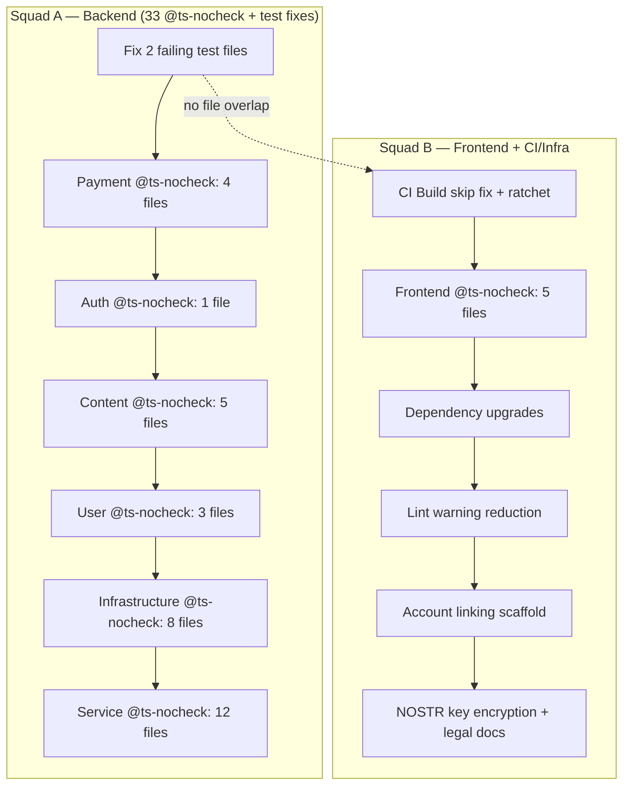

# MVP Quality Remediation — Full Production Readiness

## Overview

Remediate all open quality items blocking Sovren MVP production ship. Two parallel squads with zero file overlap execute across 38 @ts-nocheck files, 20 failing backend tests, CI pipeline gaps, dependency upgrades, NOSTR key encryption, and lint warning reduction. Account linking (email↔NOSTR) is scoped as a design + scaffold unit, not full implementation.

## Problem Frame

CI is green on main — but only because backend tests, integration tests, E2E, Docker build, and deployment jobs are conditionally skipped (path filtering). When backend tests DO run, 20 tests fail across 2 files. 38 files still have @ts-nocheck suppressing 1,282+ real TypeScript errors, including in payment-critical services. The @ts-nocheck ratchet in CI is set at 101 (should be 38). Legal/compliance items are documented but not code-fixable.

## Requirements Trace

- R1. Fix all 20 failing backend tests (DatabaseSessionManager, ContentSearchService)
- R2. Remove @ts-nocheck from all 38 files (fix real type errors per-file)
- R3. Lower @ts-nocheck CI ratchet from 101 to match actual count
- R4. Ensure CI Build job runs on main pushes (investigate skip cause)
- R5. Fix backend test failures so they pass when triggered by backend changes
- R6. Upgrade deferred dependencies (argon2, pdfkit, rollup)
- R7. Run NOSTR key encryption setup
- R8. Reduce lint warnings toward removing `--max-warnings 350`
- R9. Scaffold account linking (email↔NOSTR) types and plan
- R10. Document legal/compliance blockers for public launch

## Scope Boundaries

- Account linking: types + interface design only, not full implementation
- Legal/compliance: documentation only, no code fix
- CI deployment jobs (Deploy Staging/Production): these require infrastructure secrets (Vercel, SSH) — verify they gracefully skip when secrets are missing, but don't configure secrets
- Integration tests: require Docker in CI — verify they run, accept continue-on-error during stabilization
- No new features — this is purely quality remediation

## Context & Research

### Relevant Code and Patterns

- CI workflow: `.github/workflows/ci.yml` — path-filter-based change detection via `dorny/paths-filter`
- Backend tests skip when `needs.changes.outputs.backend != 'true'` — by design
- Build job has NO `if` condition but still skips — likely GitHub Actions dependency chain propagation from skipped test-gate dependencies
- @ts-nocheck ratchet: line 163-170 of ci.yml, threshold 101
- DatabaseSessionManager test: expects `.eq('active', true)` but service uses `is_active` (DB column)
- ContentSearchService test: mocks ES response as `{ body: { hits: {...} } }` but service reads `response.hits` directly (newer ES client API)

### Institutional Learnings

- @ts-nocheck removal: file-by-file ONLY. Remove directive, count errors, fix per-file. Never bulk remove. (common-solutions.md, quality-sprint-five-learnings)
- Removing @ts-nocheck cascades through consumers — fix consumers FIRST, then services
- DB operations use snake_case column names (is_active, last_activity), NOT domain camelCase
- SSRF: `redirect: 'error'` on fetch + body size cap + AbortController
- RLS policies must be dropped before column changes, recreated after

## Key Technical Decisions

- **Squad A owns all backend files; Squad B owns all frontend files + CI/infra** — This is the cleanest domain split. Backend has 33 @ts-nocheck files + both failing test files. Frontend has 5 @ts-nocheck files. CI changes are infrastructure-only (no code overlap with backend).
- **@ts-nocheck files grouped by dependency order** — Services with downstream consumers must be cleaned AFTER their consumers, per cascade pattern. Payment-path files are highest priority.
- **ContentSearchService mock fix: update mock format, not service** — The service correctly reads the newer ES client API. The mocks need updating from `{ body: { hits } }` to `{ hits }`.
- **DatabaseSessionManager test fix: update test assertions** — Change `.eq('active', true)` to `.eq('is_active', true)` to match DB column name.
- **CI Build skip: investigate dependency chain** — Build depends on test-gate. Test-gate has `if: always()` and succeeds. But Build may still skip if GitHub Actions considers the transitive dependency chain (test-backend, test-frontend being skipped). Fix: add `if: always() && needs.test-gate.result == 'success'` to Build job.

## Open Questions

### Resolved During Planning

- **Why do Build/E2E/Docker skip on main?** — GitHub Actions skips jobs when ANY job in their transitive `needs` chain is skipped, even if the direct dependency succeeded. Build needs test-gate, but test-gate needs test-backend/test-frontend (which skip on frontend-only changes). Fix: add explicit `if` condition to Build.
- **Are the 20 test failures real bugs or test drift?** — Both are test drift. The service code is correct (uses DB column names, newer ES API). The tests need updating.
- **Can all 38 @ts-nocheck files be cleaned in one sprint?** — Ambitious but feasible with two squads. Each file has 9-171 errors. Strategy: prioritize payment-path and auth files, then content, then utility files.

### Deferred to Implementation

- Exact error counts per file after removing @ts-nocheck (must measure by removing directive and running tsc)
- Whether any @ts-nocheck files have consumer cascade risks that require reordering
- Final lint warning count after @ts-nocheck removal (removing the directive exposes new eslint warnings)

## High-Level Technical Design

> _This illustrates the intended approach and is directional guidance for review, not implementation specification._

## Implementation Units

### Squad A — Backend Quality (branch: `fix/squad-a/FRE-21-backend-quality`)

- [ ] **Unit A1: Fix failing backend tests (20 failures)**

**Goal:** Fix DatabaseSessionManager and ContentSearchService test files so all 20 tests pass

**Requirements:** R1, R5

**Dependencies:** None — can start immediately

**Files:**

- Modify: `packages/backend/src/services/__tests__/DatabaseSessionManager.test.ts`
- Modify: `packages/backend/src/services/content/__tests__/ContentSearchService.test.ts`

**Approach:**

- DatabaseSessionManager: Change test assertion from `.eq('active', true)` to `.eq('is_active', true)` (line 718). Scan for any other domain-vs-DB-column mismatches in the same file.
- ContentSearchService: Update all 19 mock return values from `{ body: { hits: {...} } }` to `{ hits: {...} }` format (newer @elastic/elasticsearch client API returns responses without `body` wrapper). Also verify `took`, `aggregations`, etc. are at the top level.

**Patterns to follow:**

- Quality sprint learning #4: DB operations use DB column names, not domain names
- Verify by running `npx vitest run packages/backend/src/services/__tests__/DatabaseSessionManager.test.ts` and `npx vitest run packages/backend/src/services/content/__tests__/ContentSearchService.test.ts`

**Test scenarios:**

- Happy path: All 20 previously failing tests now pass
- Regression: All 5,358 previously passing tests still pass
- Integration: Run full `npx vitest run --project backend` to verify no side effects

**Verification:**

- `npx vitest run --project backend` exits 0 with 0 failures

---

- [ ] **Unit A2: @ts-nocheck removal — Payment services (4 files, HIGHEST PRIORITY)**

**Goal:** Remove @ts-nocheck from the 4 payment-path files that handle real money

**Requirements:** R2

**Dependencies:** Unit A1 (tests must pass first to establish baseline)

**Files:**

- Modify: `packages/backend/src/services/payment/InvoiceService.ts`
- Modify: `packages/backend/src/services/payment/PaymentRetryService.ts`
- Modify: `packages/backend/src/services/payment/SubscriptionService.ts`
- Modify: `packages/backend/src/services/lightning-payment-service.ts`
- Modify: `packages/backend/src/services/payment/InvoiceExpirationService.ts`

**Approach:**

- For each file: (1) remove `// @ts-nocheck`, (2) run `npx tsc -p packages/backend/tsconfig.json --noEmit` and count errors, (3) fix all type errors, (4) run eslint on the file, (5) fix lint errors
- Common fixes: add proper type annotations, replace `any` with concrete types, fix Supabase column names (snake_case), add null checks
- If a file has consumer-cascade risk (exports used by other @ts-nocheck files), note it but fix the file anyway — consumers will be fixed in later units

**Patterns to follow:**

- critical-patterns.md #5 (SSRF), #7 (payment persistence)
- Quality sprint learning #1: measure errors AFTER removing directive
- Quality sprint learning #5: cascade through consumers

**Test scenarios:**

- Happy path: Each file compiles without @ts-nocheck with 0 tsc errors
- Edge case: Supabase operations use snake_case column names (is_active, not active)
- Integration: Existing payment tests still pass after type fixes
- Error path: No `any` types remain in payment logic that handles amounts, invoices, or subscriptions

**Verification:**

- `npx tsc -p packages/backend/tsconfig.json --noEmit 2>&1 | grep -c "InvoiceService\|PaymentRetryService\|SubscriptionService\|lightning-payment\|InvoiceExpiration"` returns 0
- `npx vitest run --project backend` still passes

---

- [ ] **Unit A3: @ts-nocheck removal — Auth service (1 file)**

**Goal:** Remove @ts-nocheck from UserAuthenticationService

**Requirements:** R2

**Dependencies:** Unit A2

**Files:**

- Modify: `packages/backend/src/services/user/UserAuthenticationService.ts`

**Approach:**

- Same file-by-file approach as Unit A2
- Pay special attention to Supabase Auth types (email_confirmed_at vs email for verification)
- Follow email signup auth integration learnings

**Patterns to follow:**

- Email signup learnings: use `email_confirmed_at` not `email` for verification
- critical-patterns.md #2 (authorization at service layer)

**Test scenarios:**

- Happy path: File compiles with 0 tsc errors after @ts-nocheck removal
- Edge case: Auth types correctly use `email_confirmed_at` for email verification
- Integration: Auth-related backend tests still pass

**Verification:**

- 0 tsc errors in UserAuthenticationService.ts
- Backend tests pass

---

- [ ] **Unit A4: @ts-nocheck removal — Content services (5 files)**

**Goal:** Remove @ts-nocheck from content-domain backend services

**Requirements:** R2

**Dependencies:** Unit A3

**Files:**

- Modify: `packages/backend/src/services/content/ContentVersioningService.ts`
- Modify: `packages/backend/src/services/content/ContentPublishingService.ts`
- Modify: `packages/backend/src/services/content/ContentCreationService.ts`
- Modify: `packages/backend/src/services/content-management-service.ts`
- Modify: `packages/backend/src/services/recommendation-service.ts`

**Approach:**

- Same file-by-file approach
- Content services likely share types — fix shared type imports first

**Patterns to follow:**

- Quality sprint learning #4: DB column names in Supabase operations

**Test scenarios:**

- Happy path: All 5 files compile with 0 tsc errors
- Integration: Content-related backend tests still pass
- Edge case: Shared content types are consistent across all 5 files

**Verification:**

- 0 tsc errors across all 5 content service files
- Backend tests pass

---

- [ ] **Unit A5: @ts-nocheck removal — User services (3 files)**

**Goal:** Remove @ts-nocheck from user-domain services

**Requirements:** R2

**Dependencies:** Unit A4

**Files:**

- Modify: `packages/backend/src/services/user/UserActivityService.ts`
- Modify: `packages/backend/src/services/user/UserAnalyticsService.ts`
- Modify: `packages/backend/src/services/wellness/WellnessService.ts`

**Approach:**

- Same file-by-file approach

**Test scenarios:**

- Happy path: All 3 files compile with 0 tsc errors
- Integration: User-related backend tests still pass

**Verification:**

- 0 tsc errors in user service files
- Backend tests pass

---

- [ ] **Unit A6: @ts-nocheck removal — Infrastructure files (8 files)**

**Goal:** Remove @ts-nocheck from DI container bindings and factories

**Requirements:** R2

**Dependencies:** Units A2-A5 (these files import the services cleaned in prior units)

**Files:**

- Modify: `packages/backend/src/container/bindings/payment.bindings.ts`
- Modify: `packages/backend/src/container/bindings/content.bindings.ts`
- Modify: `packages/backend/src/container/bindings/shared.bindings.ts`
- Modify: `packages/backend/src/container/bindings/user.bindings.ts`
- Modify: `packages/backend/src/factories/payment/PaymentServiceFactory.ts`
- Modify: `packages/backend/src/factories/content/ContentServiceFactory.ts`
- Modify: `packages/backend/src/factories/user/UserServiceFactory.ts`
- Modify: `packages/backend/src/factories/shared/SharedServiceFactory.ts`

**Approach:**

- These files are consumers of the services cleaned in A2-A5
- After services have proper types, bindings/factories should largely self-resolve
- Main errors will be constructor argument mismatches and missing interface implementations

**Patterns to follow:**

- Quality sprint learning #5: fix consumers after services (these ARE the consumers)

**Test scenarios:**

- Happy path: All 8 files compile with 0 tsc errors
- Integration: Backend tests still pass (DI container correctly wires services)

**Verification:**

- 0 tsc errors in all binding and factory files
- Backend tests pass

---

- [ ] **Unit A7: @ts-nocheck removal — Remaining backend services (12 files)**

**Goal:** Remove @ts-nocheck from all remaining backend files

**Requirements:** R2

**Dependencies:** Unit A6

**Files:**

- Modify: `packages/backend/src/routes/unified-sessions.ts`
- Modify: `packages/backend/src/routes/subscription-tiers.ts`
- Modify: `packages/backend/src/services/subscription-management-service.ts`
- Modify: `packages/backend/src/services/NotificationService.ts`
- Modify: `packages/backend/src/services/ai-recommendation-service.ts`
- Modify: `packages/backend/src/services/distribution/PlatformConnectionService.ts`
- Modify: `packages/backend/src/services/finance/TaxService.ts`
- Modify: `packages/backend/src/services/EmailService.ts`
- Modify: `packages/backend/src/services/ai-enhanced-features-service.ts`
- Modify: `packages/backend/src/services/AuditLogService.ts`
- Modify: `packages/backend/src/services/nostr/SovrenNIPService.ts` (frontend, but NOSTR domain — assign to Squad A for domain coherence)
- Modify: (any remaining files discovered during implementation)

**Approach:**

- Same file-by-file approach for each
- Routes may have Express handler type issues — use `Request`, `Response`, `NextFunction` from express
- Service files: fix constructor types, return types, Supabase column names

**Test scenarios:**

- Happy path: All remaining files compile with 0 tsc errors
- Integration: Full backend test suite passes
- Regression: `grep -rn '@ts-nocheck' packages/backend/ --include='*.ts' | wc -l` returns 0

**Verification:**

- 0 @ts-nocheck directives remaining in packages/backend/
- Full backend test suite passes

---

### Squad B — Frontend + CI/Infra (branch: `fix/squad-b/FRE-22-frontend-ci-quality`)

- [ ] **Unit B1: Fix CI Build job skip + lower @ts-nocheck ratchet**

**Goal:** Ensure Build job runs on every main push regardless of which packages changed. Lower @ts-nocheck ratchet.

**Requirements:** R3, R4

**Dependencies:** None — can start immediately

**Files:**

- Modify: `.github/workflows/ci.yml`

**Approach:**

- Build job (line 449): Add `if: always() && !cancelled() && needs.test-gate.result == 'success'` — this ensures Build runs even when test-gate's transitive dependencies (test-backend, test-frontend) were skipped
- E2E job (line 493): Same fix — add `if: always() && !cancelled() && needs.build.result == 'success'`
- Docker job (line 550): already has `if: github.event_name == 'push'` but may also need the always() pattern since it needs test-gate
- @ts-nocheck ratchet (line 163): Lower threshold from 101 to 40 (slightly above current 38 to allow buffer during this sprint, with intent to lower to exact count after completion)
- `--max-warnings` (line 84): Leave at 350 for now — Squad B will reduce warnings in Unit B4

**Patterns to follow:**

- GitHub Actions: `if: always()` evaluates regardless of dependency outcomes; combine with result checks to control behavior

**Test scenarios:**

- Happy path: Push a frontend-only change to main — Build, E2E, Docker all run (not skipped)
- Edge case: When test-gate fails, Build should NOT run (the result check prevents this)
- Error path: When changes job fails, entire pipeline fails early

**Verification:**

- CI run on main shows Build, E2E, Docker as either success or failure, never "skipped" (unless the `if` condition legitimately excludes them)
- @ts-nocheck ratchet set to 40

---

- [ ] **Unit B2: @ts-nocheck removal — Frontend files (5 files)**

**Goal:** Remove @ts-nocheck from all frontend files

**Requirements:** R2

**Dependencies:** Unit B1 (CI must be fixed first to validate changes)

**Files:**

- Modify: `packages/frontend/src/features/content/components/ContentManagementHub.tsx`
- Modify: `packages/frontend/src/features/content/components/ContentEditor.tsx`
- Modify: `packages/frontend/src/components/ui/PersonalizedRecommendations.tsx`
- Modify: `packages/frontend/src/components/nostr/NostrKeyManagement.tsx`
- Modify: `packages/frontend/src/components/nostr/DMInbox.tsx`

**Approach:**

- Same file-by-file approach as backend
- React component files: fix prop types, hook return types, event handler types
- JSX elements: fix ref types, event types (`React.ChangeEvent<HTMLInputElement>` etc.)
- NOSTR components: verify nostr-tools API types match current version

**Patterns to follow:**

- Use existing typed components in `packages/frontend/src/components/` as reference
- Import types from `@shared/` when available

**Test scenarios:**

- Happy path: All 5 files compile with 0 tsc errors
- Integration: Frontend test suite still passes (`npx vitest run --project frontend`)
- Regression: `grep -rn '@ts-nocheck' packages/frontend/ --include='*.ts' --include='*.tsx' | wc -l` returns 0

**Verification:**

- 0 @ts-nocheck directives in packages/frontend/
- Frontend tests pass

---

- [ ] **Unit B3: Dependency upgrades (3 deferred deps)**

**Goal:** Upgrade argon2, pdfkit, and rollup to latest versions

**Requirements:** R6

**Dependencies:** Unit B2

**Files:**

- Modify: `package.json` (root)
- Modify: `package-lock.json` (regenerated)
- Possibly modify: files importing argon2/pdfkit if API changed

**Approach:**

- argon2: Check changelog for breaking changes between current and latest (0.41→0.44). Likely minor — hash/verify API stable.
- pdfkit: Check changelog 0.15→0.18. Likely minor — document creation API stable.
- rollup: Tied to Vite — check Vite compatibility before upgrading. May need to upgrade Vite too. If Vite pinning prevents rollup upgrade, document and defer.
- After each upgrade: run full test suite to verify no regressions
- Regenerate lockfile: `rm package-lock.json && npm install` (per pattern #131 — stale nested lockfile entries require full regeneration)

**Patterns to follow:**

- common-solutions.md #131: lockfile regeneration
- Test after each individual upgrade, not all at once

**Test scenarios:**

- Happy path: Each dependency upgrades cleanly, tests pass
- Error path: If argon2 API changed, update hash/verify calls in UserAuthenticationService (note: Squad A may be working on this file — coordinate)
- Edge case: rollup upgrade blocked by Vite pinning — document and defer

**Verification:**

- `npm audit` shows no new vulnerabilities from upgrades
- All test suites pass
- `npm ls argon2 pdfkit rollup` shows latest versions

---

- [ ] **Unit B4: Lint warning reduction**

**Goal:** Reduce lint warnings significantly, ideally below 200

**Requirements:** R8

**Dependencies:** Units B2, B3 (removing @ts-nocheck exposes new warnings)

**Files:**

- Modify: Various frontend and CI files
- Modify: `.github/workflows/ci.yml` (lower `--max-warnings` threshold)

**Approach:**

- Run `npx eslint packages/ --max-warnings 9999 2>&1 | tail -5` to get current warning count
- Categorize warnings by rule (e.g., `@typescript-eslint/no-explicit-any`, `no-unused-vars`, `react-hooks/exhaustive-deps`)
- Fix the highest-count rules first for maximum impact
- After fixing, lower `--max-warnings` in ci.yml to new count + small buffer
- DO NOT fix warnings in files owned by Squad A (backend services)

**Test scenarios:**

- Happy path: Warning count drops below 200
- Integration: All tests still pass after lint fixes
- Regression: CI lint step passes with new lower threshold

**Verification:**

- `npx eslint packages/frontend/ --max-warnings 0 2>&1 | grep "problems"` shows reduced count
- CI passes with lowered `--max-warnings`

---

- [ ] **Unit B5: Account linking scaffold (email↔NOSTR)**

**Goal:** Design and scaffold the types/interfaces for account linking without full implementation

**Requirements:** R9

**Dependencies:** Unit B2

**Files:**

- Create: `packages/shared/src/types/account-linking.ts`
- Create: `packages/frontend/src/features/auth/types/account-linking.ts`
- Modify: `packages/frontend/src/features/auth/index.ts` (export new types)

**Approach:**

- Define `LinkedAccount` type (email + NOSTR pubkey + linking metadata)
- Define `AccountLinkingService` interface (link, unlink, getLinkedAccounts)
- Define `AccountLinkingState` for React context
- Add TODO comments for implementation in next sprint
- This is a design scaffold — no business logic, no API calls, no UI

**Test scenarios:**

- Test expectation: none — pure type/interface scaffold with no behavioral changes

**Verification:**

- Types compile without errors
- Barrel exports work correctly

---

- [ ] **Unit B6: NOSTR key encryption + legal compliance docs**

**Goal:** Run production encryption setup and document legal blockers

**Requirements:** R7, R10

**Dependencies:** None (can run in parallel with other B units)

**Files:**

- Run: `npm run production:encrypt` (script at `scripts/production-setup.sh --encrypt`)
- Create: `docs/legal/mvp-launch-blockers.md` (summary of legal items from PRA2)

**Approach:**

- Read `scripts/production-setup.sh` to understand what `--encrypt` does before running
- Run it and verify success
- Document the 5 legal blockers identified in PRA2 (DMCA, CSAM, money transmission, age verification, dispute resolution) with their status and what's needed to resolve each
- Note: these are documentation items, not code fixes

**Test scenarios:**

- Happy path: `npm run production:encrypt` completes successfully
- Error path: If script requires env vars or credentials not available locally, document what's needed

**Verification:**

- NOSTR key encryption is applied (verify per script's success output)
- Legal blockers doc exists and covers all 5 items

## System-Wide Impact

- **@ts-nocheck removal exposes new lint warnings** — Squad B must coordinate: don't lower `--max-warnings` until Squad A's backend @ts-nocheck removal is complete, or set threshold high enough to accommodate both squads' in-progress work
- **CI changes affect all future PRs** — Build/E2E/Docker running on every push will increase CI duration by ~5-10 minutes. This is correct behavior.
- **@ts-nocheck ratchet lowering** — Set to 40 during sprint, then lower to 0 after both squads complete. This prevents regressions while work is in progress.
- **Dependency upgrades** — argon2 is used in UserAuthenticationService (Squad A territory). If API changes, coordinate via message. Low risk — argon2 API is stable.
- **Unchanged invariants:** Frontend routing, NOSTR event handling, Lightning payment flows, Supabase RLS policies, E2E test infrastructure — all unchanged.

## Risks & Dependencies

| Risk                                                                            | Mitigation                                                                                                                                                                             |
| ------------------------------------------------------------------------------- | -------------------------------------------------------------------------------------------------------------------------------------------------------------------------------------- |
| @ts-nocheck file has 171 errors (quality-metrics-service.ts) and takes too long | If >80 errors and not payment-critical, add targeted `// eslint-disable-next-line` instead of full fix. Document remaining errors.                                                     |
| Cascade: fixing one @ts-nocheck file breaks consumers                           | Follow dependency order: services → bindings/factories → routes. Fix consumers after their dependencies.                                                                               |
| argon2 upgrade breaks password hashing                                          | Test hash/verify with known test vectors before and after upgrade. Run auth tests.                                                                                                     |
| Squad A and B accidentally edit same file                                       | File ownership is strictly separated by package (backend vs frontend). Only overlap risk: `packages/shared/` — Squad B owns shared type additions only, Squad A does not touch shared. |
| CI ratchet too aggressive during sprint                                         | Set to 40 (buffer above 38). Both squads can temporarily increase count by 1-2 during in-progress work without failing CI.                                                             |

## Documentation / Operational Notes

- After both squads complete: lower @ts-nocheck ratchet to 0 and `--max-warnings` to actual count
- Run `/ce:review` on each squad's PR before merge
- Run `/ce:compound` after merge to document learnings
- Cross-reference pattern files (critical-patterns.md, common-solutions.md) with any new patterns discovered

## Sources & References

- Related code: `.github/workflows/ci.yml`, all 38 @ts-nocheck files
- Related PRs: #212-223 (prior quality sprint)
- Compound docs: `docs/solutions/workflow-issues/quality-sprint-five-learnings-20260331.md`, `docs/solutions/workflow-issues/ts-nocheck-bulk-removal-cascade-pattern-20260330.md`
- Legal: PRA2 audit (Mar 28) — legal/compliance NO-GO findings
