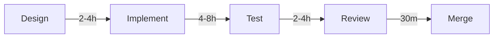

# 🤖 AGENT ASSIGNMENT MATRIX - Sovren Production Launch

**Total Agents**: 12 specialized agents
**Total Stories**: 67 user stories
**Execution Model**: 4-phase pipeline per story (Design → Implement → Test → Review)

---

## 📊 COMPLETE AGENT-TO-STORY MAPPING

### EPIC-IMMEDIATE (Week 1) - Issues #5-11

| Issue | Story ID | Title | Primary Agent | Support Agents | Duration |
|-------|----------|-------|---------------|----------------|----------|
| #5 | IMMED-001 | Fix Jest Configuration | None (Manual) | - | 30 min |
| #6 | IMMED-002 | Fix pool.test.ts | None (Manual) | - | 30 min |
| #7 | IMMED-003 | Rotate GitHub Token | **security-engineer** | - | 1 hour |
| #8 | IMMED-004 | Rotate Supabase Credentials | **security-engineer** | - | 2 hours |
| #9 | IMMED-005 | Update npm Dependencies | None (Manual) | - | 1 hour |
| #10 | IMMED-006 | Code Review US-007 | **code-review-specialist** | - | 3 hours |
| #11 | IMMED-007 | Merge US-007 | None (Manual) | - | 1 hour |

---

### EPIC-FRONTEND (Weeks 2-4) - Issues #12-41

#### NOSTR Authentication Module (#12-26)

| Issue | Story ID | Title | Agent Pipeline | Duration |
|-------|----------|-------|----------------|----------|
| #12 | FRONT-001 | Browser Extension Detection | design-ux → frontend-dev → test → review | 8h |
| #13 | FRONT-002 | Manual Key Input UI | design-ux → frontend-dev → test → review | 6h |
| #14 | FRONT-003 | Role Selection (Creator/Supporter) | design-ux → frontend-dev → test → review | 4h |
| #15 | FRONT-004 | Session Persistence | frontend-dev → test → review | 4h |
| #16 | FRONT-005 | Profile Display & Management | design-ux → frontend-dev → test → review | 6h |
| #17 | FRONT-006 | Multi-Account Switching | design-ux → frontend-dev → test → review | 8h |
| #18 | FRONT-007 | Key Backup/Recovery UI | design-ux → frontend-dev → security → test → review | 8h |
| #19 | FRONT-008 | NIP-05 Verification UI | design-ux → frontend-dev → nostr-specialist → test → review | 6h |
| #20 | FRONT-009 | Permission Management | design-ux → frontend-dev → test → review | 6h |
| #21 | FRONT-010 | Mobile Auth Flow | design-ux → frontend-dev → test → review | 8h |
| #22 | FRONT-011 | Auth Context Provider | frontend-dev → test → review | 6h |
| #23 | FRONT-012 | Protected Route Components | frontend-dev → test → review | 4h |
| #24 | FRONT-013 | Auth Error Boundaries | frontend-dev → test → review | 4h |
| #25 | FRONT-014 | Logout Flow & Cleanup | frontend-dev → test → review | 3h |
| #26 | FRONT-015 | Auth State Synchronization | frontend-dev → test → review | 6h |

#### Content Creation System (#27-41)

| Issue | Story ID | Title | Agent Pipeline | Duration |
|-------|----------|-------|----------------|----------|
| #27 | FRONT-016 | Rich Text Editor | design-ux → frontend-dev → test → review | 12h |
| #28 | FRONT-017 | Markdown Support | frontend-dev → test → review | 4h |
| #29 | FRONT-018 | Media Upload (Images/Videos) | design-ux → frontend-dev → test → review | 8h |
| #30 | FRONT-019 | Content Categories & Tags | design-ux → frontend-dev → test → review | 6h |
| #31 | FRONT-020 | Draft Saving & Management | frontend-dev → test → review | 6h |
| #32 | FRONT-021 | Content Preview | design-ux → frontend-dev → test → review | 4h |
| #33 | FRONT-022 | Publishing Workflow | design-ux → frontend-dev → test → review | 6h |
| #34 | FRONT-023 | Content Scheduling | design-ux → frontend-dev → test → review | 8h |
| #35 | FRONT-024 | Edit Published Content | frontend-dev → test → review | 4h |
| #36 | FRONT-025 | Delete Content Flow | design-ux → frontend-dev → test → review | 3h |
| #37 | FRONT-026 | Content Analytics Dashboard | design-ux → frontend-dev → test → review | 10h |
| #38 | FRONT-027 | Engagement Metrics | frontend-dev → test → review | 6h |
| #39 | FRONT-028 | Revenue Analytics | design-ux → frontend-dev → test → review | 8h |
| #40 | FRONT-029 | Subscriber Management UI | design-ux → frontend-dev → test → review | 8h |
| #41 | FRONT-030 | Content Discovery Feed | design-ux → frontend-dev → test → review | 10h |

---

### EPIC-INTEGRATION (Weeks 3-5) - Issues #42-62

#### Lightning Payment Integration (#42-52)

| Issue | Story ID | Title | Agent Pipeline | Duration |
|-------|----------|-------|----------------|----------|
| #42 | INTEG-001 | WebLN Provider Detection | frontend-dev → lightning-specialist → test → review | 6h |
| #43 | INTEG-002 | Manual Invoice Entry | design-ux → frontend-dev → lightning-specialist → test → review | 6h |
| #44 | INTEG-003 | Invoice Generation UI | design-ux → frontend-dev → lightning-specialist → test → review | 8h |
| #45 | INTEG-004 | Payment Confirmation UI | design-ux → frontend-dev → test → review | 4h |
| #46 | INTEG-005 | Payment History | design-ux → frontend-dev → test → review | 6h |
| #47 | INTEG-006 | Subscription Payment Flow | design-ux → frontend-dev → lightning-specialist → test → review | 10h |
| #48 | INTEG-007 | One-Time Payment Flow | design-ux → frontend-dev → lightning-specialist → test → review | 6h |
| #49 | INTEG-008 | Payment Error Handling | frontend-dev → test → review | 4h |
| #50 | INTEG-009 | Refund Management | design-ux → frontend-dev → test → review | 6h |
| #51 | INTEG-010 | Payment Analytics | design-ux → frontend-dev → test → review | 8h |
| #52 | INTEG-011 | Multi-Currency Support | frontend-dev → lightning-specialist → test → review | 8h |

#### E2E Testing Suite (#53-57)

| Issue | Story ID | Title | Primary Agent | Support Agents | Duration |
|-------|----------|-------|---------------|----------------|----------|
| #53 | INTEG-012 | Creator Onboarding E2E | **e2e-testing-specialist** | - | 8h |
| #54 | INTEG-013 | Supporter Subscription E2E | **e2e-testing-specialist** | - | 8h |
| #55 | INTEG-014 | Content Creation E2E | **e2e-testing-specialist** | - | 8h |
| #56 | INTEG-015 | Payment Flow E2E | **e2e-testing-specialist** | lightning-specialist | 8h |
| #57 | INTEG-016 | Error Recovery E2E | **e2e-testing-specialist** | - | 6h |

#### Specialized Testing (#58-62)

| Issue | Story ID | Title | Primary Agent | Support Agents | Duration |
|-------|----------|-------|---------------|----------------|----------|
| #58 | INTEG-017 | NOSTR Protocol Compliance | **nostr-protocol-specialist** | - | 8h |
| #59 | INTEG-018 | Accessibility Audit | **accessibility-specialist** | - | 8h |
| #60 | INTEG-019 | Security Penetration Test | **security-engineer** | - | 12h |
| #61 | INTEG-020 | Performance Testing | **performance-optimization-engineer** | - | 8h |
| #62 | INTEG-021 | Cross-Browser Testing | **test-automation-engineer** | - | 6h |

---

### EPIC-PRODUCTION (Week 6) - Issues #63-67

| Issue | Story ID | Title | Primary Agent | Support Agents | Duration |
|-------|----------|-------|---------------|----------------|----------|
| #63 | PROD-001 | Security Certification | **security-engineer** | - | 8h |
| #64 | PROD-002 | Performance Optimization | **performance-optimization-engineer** | - | 8h |
| #65 | PROD-003 | Monitoring Setup | **monitoring-observability-architect** | - | 8h |
| #66 | PROD-004 | Documentation | **documentation-specialist** | - | 8h |
| #67 | PROD-005 | Launch Readiness Review | **code-review-specialist** | All agents | 4h |

---

## 🎯 AGENT SPECIALIZATION MATRIX

### Agent Capabilities & Responsibilities

| Agent | Specialization | Story Types | Weekly Allocation |
|-------|---------------|-------------|-------------------|
| **design-ux-specialist** | UI/UX design, mockups, user flows | All UI components | Weeks 2-4 (56h) |
| **elite-frontend-dev** | React, TypeScript, component implementation | All frontend stories | Weeks 2-4 (104h) |
| **test-automation-engineer** | Jest, React Testing Library, coverage | All test stories | Weeks 2-5 (80h) |
| **code-review-specialist** | Code quality, standards, best practices | All PR reviews | All weeks (39h) |
| **security-engineer** | Credentials, vulnerabilities, audits | Security stories | Weeks 1,5,6 (32h) |
| **e2e-testing-specialist** | Playwright, user flows, integration | E2E test stories | Week 5 (38h) |
| **nostr-protocol-specialist** | NOSTR NIPs, event formats, relays | NOSTR stories | Weeks 2-5 (28h) |
| **lightning-specialist** | WebLN, BOLT11, payment verification | Payment stories | Weeks 3-4 (48h) |
| **accessibility-specialist** | WCAG, screen readers, keyboard nav | A11y audit | Week 5 (8h) |
| **performance-optimization-engineer** | Core Web Vitals, bundle optimization | Performance stories | Weeks 5-6 (16h) |
| **monitoring-observability-architect** | Sentry, CloudWatch, dashboards | Monitoring setup | Week 6 (8h) |
| **documentation-specialist** | User docs, API docs, guides | Documentation | Week 6 (8h) |

---

## 🔄 AGENT HANDOFF PROTOCOL

### Standard 4-Phase Pipeline



### Handoff Requirements

**Design → Implementation**:
- Deliverables: Mockups, component specs, design tokens
- Format: Figma files or high-fidelity images
- Location: `/docs/design/[story-id]/`

**Implementation → Testing**:
- Deliverables: Working code, unit tests
- Coverage: 95%+ for new code
- Branch: `feature/[story-id]`

**Testing → Review**:
- Deliverables: Test suite, coverage report
- E2E: Playwright scripts if applicable
- PR: Created with description

**Review → Merge**:
- Deliverables: Approval, feedback addressed
- CI/CD: All checks passing
- Deploy: Auto to staging

---

## 📈 AGENT PERFORMANCE METRICS

### Expected Velocity

| Agent | Stories/Day | Lines of Code/Day | Tests/Day |
|-------|------------|------------------|-----------|
| design-ux-specialist | 2-3 mockups | - | - |
| elite-frontend-dev | 1-2 components | 200-400 | 10-20 |
| test-automation-engineer | 3-4 test suites | - | 30-50 |
| code-review-specialist | 4-5 reviews | - | - |
| e2e-testing-specialist | 1 flow | - | 5-10 scenarios |

### Quality Standards

- **Design**: Pixel-perfect, responsive, accessible
- **Code**: TypeScript strict, no any, ESLint clean
- **Tests**: 95%+ coverage, no flaky tests
- **Reviews**: <2 hour turnaround, actionable feedback
- **Documentation**: Complete, accurate, examples

---

## 🚦 AGENT COORDINATION RULES

### Parallel Execution Rules

1. **No File Conflicts**: Agents working on different files can run in parallel
2. **Feature Isolation**: Separate feature modules can be developed simultaneously
3. **Test Independence**: Test suites can run in parallel with development
4. **Review Queue**: Reviews processed in FIFO order

### Blocking Dependencies

1. **Design Before Implementation**: Cannot implement without approved mockups
2. **Tests Before Merge**: Cannot merge without passing tests
3. **Review Before Deploy**: Cannot deploy without code review
4. **Security Before Launch**: Cannot launch without security certification

### Conflict Resolution

1. **Git Conflicts**: Last agent to commit resolves
2. **Design Disputes**: design-ux-specialist has final say
3. **Technical Disputes**: elite-frontend-dev decides implementation
4. **Quality Disputes**: code-review-specialist determines standards

---

## 📊 AGENT AVAILABILITY SCHEDULE

### Week 1 (Nov 7-8)
- security-engineer: Available immediately (4h)
- code-review-specialist: Available after manual fixes (3h)

### Week 2 (Nov 11-15)
- design-ux-specialist: Full availability (40h)
- elite-frontend-dev: Available after designs (40h)
- test-automation-engineer: Available for completed features
- code-review-specialist: On-demand for PRs

### Week 3-4 (Nov 18-29)
- All frontend agents: Maximum capacity
- lightning-specialist: Payment stories only
- nostr-protocol-specialist: NOSTR stories only

### Week 5 (Dec 2-6)
- e2e-testing-specialist: Full dedication (40h)
- accessibility-specialist: One-day audit
- security-engineer: Penetration testing

### Week 6 (Dec 9-13)
- security-engineer: Final certification
- performance-optimization-engineer: Optimization
- monitoring-observability-architect: Setup
- documentation-specialist: Guides
- code-review-specialist: Final review

---

## 🎯 CRITICAL SUCCESS FACTORS

1. **Week 1 Completion**: Must fix blockers before frontend work
2. **Design Approval**: 4-hour SLA for mockup approval
3. **Parallel Efficiency**: Maintain 3+ agents active simultaneously
4. **Test Coverage**: Never drop below 95% for new code
5. **Daily Integration**: Merge completed work daily
6. **Continuous Deployment**: Deploy to staging after each merge
7. **Blocker Resolution**: <2 hour response time
8. **Quality Gates**: No compromises on standards

---

## 📝 AGENT INVOCATION TEMPLATES

### Security Engineer (Week 1)
```
Task: Rotate exposed credentials
- GitHub token: [REDACTED - ROTATED]
- Supabase credentials in AWS Secrets Manager
- Update all CI/CD references
- Verify zero-downtime rotation
```

### Design UX Specialist
```
Task: Create mockups for [STORY-ID: Title]
- Mobile-first responsive design (320px-2560px)
- Follow Sovren design system
- Include all states (loading, error, success, empty)
- Accessibility annotations
- Export to /docs/design/[story-id]/
```

### Elite Frontend Developer
```
Task: Implement [STORY-ID: Title]
- Based on designs at /docs/design/[story-id]/
- TypeScript strict mode, no any types
- 95%+ test coverage
- Feature-based architecture
- Include Mermaid diagrams
```

### Test Automation Engineer
```
Task: Create test suite for [STORY-ID: Title]
- Unit tests with Jest
- Integration tests where applicable
- 95%+ coverage requirement
- No flaky tests
- Accessibility tests included
```

### Code Review Specialist
```
Task: Review PR for [STORY-ID: Title]
- Verify quality gates met
- Check TypeScript strict compliance
- Validate test coverage
- Review Mermaid diagrams
- Provide actionable feedback
```

---

**Next Step**: Begin Week 1 execution using the templates above!