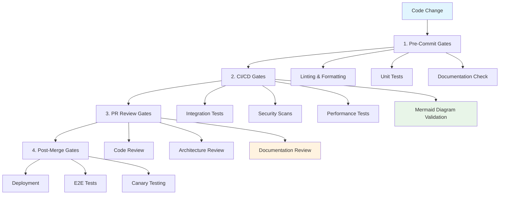
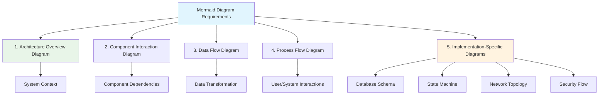
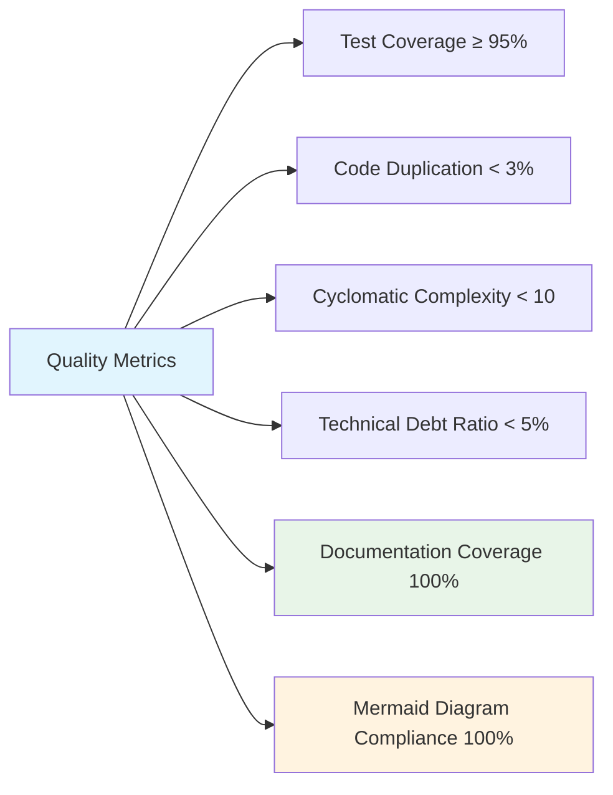

# 🚪 Quality Gates

## 📋 Overview

This document defines the quality gates that all code changes must pass before being integrated into the main codebase. These gates ensure that all code meets our elite engineering standards and maintains the legendary status of the Sovren platform.

## 🎯 Quality Gate Philosophy

### Core Principles

- **Prevention over Detection**: Catch issues early in the development process
- **Automated Validation**: Automate quality checks wherever possible
- **Zero Tolerance**: No exceptions to quality requirements
- **Continuous Improvement**: Regularly review and enhance quality standards
- **Visual Documentation**: All implementations must include comprehensive Mermaid diagrams

## 📊 Quality Gate Process



## 📝 Quality Gate Requirements

### 1. Pre-Commit Gates

These gates run locally before code is committed to the repository:

- **Linting & Formatting**:
  - Zero ESLint errors
  - Code formatted according to project standards
  - Import order validation

- **Unit Tests**:
  - All unit tests must pass
  - New code must have unit tests
  - Test coverage must meet thresholds

- **Documentation Check**:
  - Required documentation files exist
  - Documentation follows standards
  - Mermaid diagrams are properly formatted

### 2. CI/CD Gates

These gates run in the CI/CD pipeline when code is pushed:

- **Integration Tests**:
  - All integration tests must pass
  - API contract tests must pass
  - Database migration tests must pass

- **Security Scans**:
  - Dependency vulnerability scan
  - SAST (Static Application Security Testing)
  - Secret detection

- **Performance Tests**:
  - Performance regression tests
  - Load testing for critical paths
  - Memory leak detection

- **Mermaid Diagram Validation**:
  - All required diagrams are present
  - Diagrams are syntactically valid
  - Diagrams follow project standards

### 3. PR Review Gates

These gates are part of the pull request review process:

- **Code Review**:
  - Minimum 1 approving review
  - No unresolved comments
  - Code follows best practices

- **Architecture Review**:
  - Follows architectural patterns
  - Properly integrates with existing systems
  - Considers scalability and performance

- **Documentation Review**:
  - Complete and accurate documentation
  - All required Mermaid diagrams present
  - CHANGELOG properly updated

### 4. Post-Merge Gates

These gates run after code is merged but before deployment:

- **E2E Tests**:
  - All end-to-end tests pass
  - Cross-browser compatibility
  - Mobile responsiveness

- **Canary Testing**:
  - Gradual rollout to subset of users
  - Monitoring for errors and performance
  - Automatic rollback if issues detected

## 📊 Mermaid Diagram Requirements



### Mandatory Diagram Types

**EVERY** user story implementation MUST include the following diagrams:

1. **Architecture Overview Diagram**:
   - Shows the components involved in the implementation
   - Illustrates the relationship between components
   - Places the changes within the broader system context

2. **Component Interaction Diagram**:
   - Details how components interact with each other
   - Shows the sequence of operations
   - Illustrates API calls and data exchange patterns

3. **Data Flow Diagram**:
   - Visualizes how data moves through the system
   - Shows data transformation steps
   - Illustrates storage points and persistence mechanisms

4. **Process Flow Diagram**:
   - Provides step-by-step visualization of user interactions
   - Shows system processes and decision points
   - Illustrates error handling paths

5. **Implementation-Specific Diagrams** (as needed):
   - Database schema diagrams for data model changes
   - State machine diagrams for complex state management
   - Network topology diagrams for infrastructure changes
   - Security flow diagrams for authentication/authorization features

## 🛠️ Quality Gate Implementation

### Pre-Commit Hooks

```bash
# .husky/pre-commit
#!/bin/sh
. "$(dirname "$0")/_/husky.sh"

# Run linting and formatting
npm run lint
npm run format

# Run unit tests
npm run test:unit

# Check documentation
npm run docs:check

# Validate Mermaid diagrams
npm run mermaid:validate
```

### CI/CD Pipeline

```yaml
# .github/workflows/quality-gates.yml
name: Quality Gates

on:
  push:
    branches: [main, develop]
  pull_request:
    branches: [main, develop]

jobs:
  pre-commit-gates:
    name: Pre-Commit Gates
    runs-on: ubuntu-latest
    steps:
      - name: Checkout code
        uses: actions/checkout@v3

      - name: Setup Node.js
        uses: actions/setup-node@v3
        with:
          node-version: '18'

      - name: Install dependencies
        run: npm ci

      - name: Run linting
        run: npm run lint

      - name: Run formatting check
        run: npm run format:check

      - name: Run unit tests
        run: npm run test:unit

      - name: Check documentation
        run: npm run docs:check

      - name: Validate Mermaid diagrams
        run: npm run mermaid:validate

  integration-gates:
    name: Integration Gates
    runs-on: ubuntu-latest
    needs: pre-commit-gates
    steps:
      - name: Checkout code
        uses: actions/checkout@v3

      - name: Setup Node.js
        uses: actions/setup-node@v3
        with:
          node-version: '18'

      - name: Install dependencies
        run: npm ci

      - name: Run integration tests
        run: npm run test:integration

      - name: Run security scans
        run: npm run security:scan

      - name: Run performance tests
        run: npm run test:performance

  documentation-gates:
    name: Documentation Gates
    runs-on: ubuntu-latest
    needs: pre-commit-gates
    steps:
      - name: Checkout code
        uses: actions/checkout@v3

      - name: Check documentation completeness
        run: npm run docs:validate

      - name: Validate Mermaid diagrams
        run: npm run mermaid:validate

      - name: Check CHANGELOG
        run: npm run changelog:check
```

## 🔍 Quality Gate Validation

### Automated Checks

- **Test Coverage**: Enforced minimum coverage thresholds
- **Code Quality**: SonarQube analysis with quality gates
- **Documentation**: Automated checks for required documentation
- **Mermaid Diagrams**: Syntax validation and presence check

### Manual Review Checklist

- [ ] Code follows project standards and best practices
- [ ] Architecture is consistent with system design
- [ ] Documentation is complete and accurate
- [ ] All required Mermaid diagrams are present and clear
- [ ] Tests cover happy path and edge cases
- [ ] Security considerations are addressed
- [ ] Performance impact is acceptable
- [ ] Accessibility requirements are met

## 📈 Quality Metrics

### Key Quality Indicators



- **Test Coverage**: Minimum 95% line coverage, 90% branch coverage
- **Code Duplication**: Less than 3% duplicated code
- **Cyclomatic Complexity**: Maximum complexity of 10 per function
- **Technical Debt Ratio**: Less than 5% technical debt
- **Documentation Coverage**: 100% of public APIs documented
- **Mermaid Diagram Compliance**: 100% of required diagrams present

### Quality Reporting

- **Dashboard**: Real-time quality metrics dashboard
- **Trend Analysis**: Historical quality metrics tracking
- **Team Scorecards**: Team-level quality performance
- **Quality Alerts**: Automated alerts for quality regressions

## 🏆 Elite Quality Status

Quality achieves **Elite Status** when:

✅ **All automated quality gates pass** with no exceptions
✅ **Test coverage exceeds 95%** across all code areas
✅ **Zero known security vulnerabilities** exist in the codebase
✅ **Documentation is complete** and up-to-date
✅ **All required Mermaid diagrams** are present and follow standards
✅ **Technical debt** is actively managed and minimized

---

**MANDATORY REQUIREMENT**: Every code change MUST pass all quality gates, including the Mermaid diagram requirements, to be eligible for merge. No exceptions.
