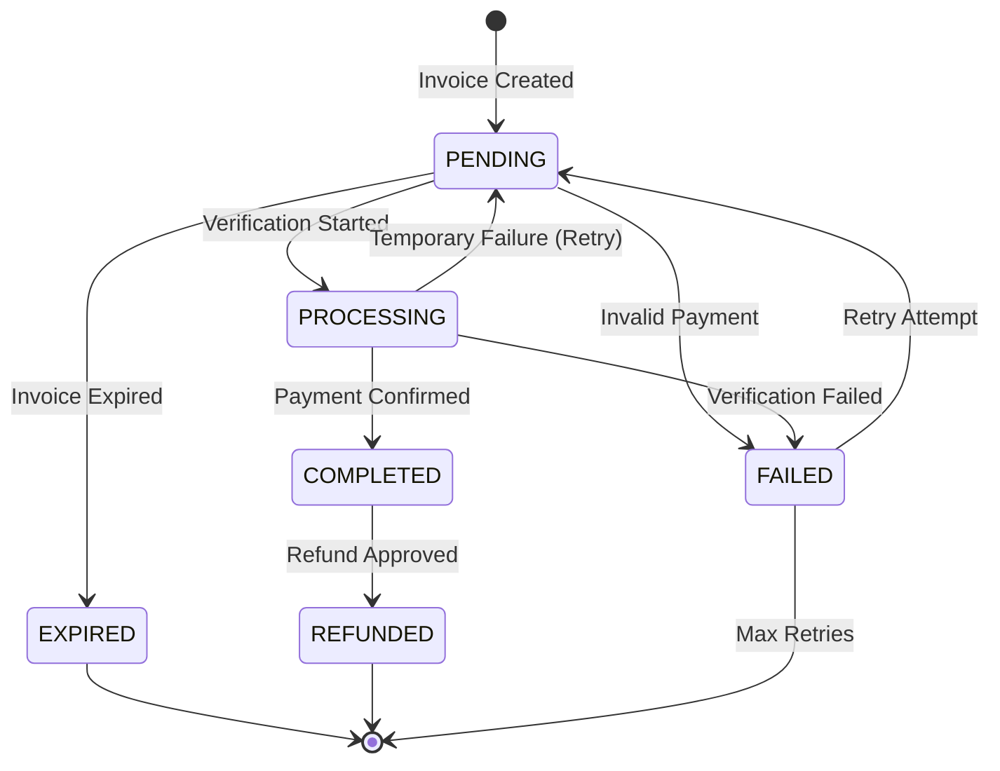
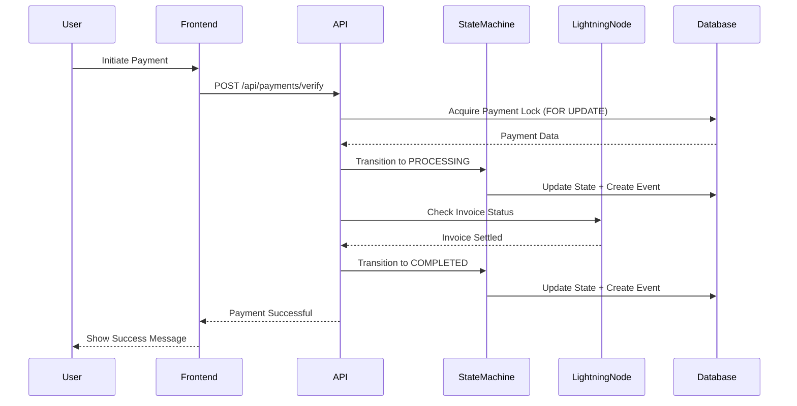

# Epic 002: Payment Processing - User Stories Breakdown

## Executive Summary

**Epic**: Payment Processing TODO Resolution
**Total Stories**: 18 granular 1-point stories
**Estimated Effort**: 36-72 hours (4.5-9 days at 8 hours/day)
**Sprints**: 3 sprints organized by dependency chains
**Parallel Work Streams**: 3 streams (Foundation → Security → Features)
**Risk Level**: HIGH (direct revenue impact)

---

## Sprint 0: Foundation - Payment State Machine (CRITICAL PATH)

**Duration**: 8-12 hours (1-1.5 days)
**Must Complete Before**: All other stories
**Risk**: HIGH - All payment flows depend on this

### Story 001: Define Payment State Machine Types and Enums

**As a** payment system developer
**I want** comprehensive payment state types and enums
**So that** all payment flows have consistent state management

#### Acceptance Criteria

- **Given** payment processing needs clear state definitions
  **When** I define PaymentState enum
  **Then** it includes: PENDING, PROCESSING, COMPLETED, FAILED, EXPIRED, REFUNDED states

- **Given** state transitions need validation
  **When** I define PaymentTransition interface
  **Then** it includes: from, to, action, validator function

- **Given** payment events need tracking
  **When** I define PaymentEvent type
  **Then** it includes: timestamp, state, metadata, user context

#### Technical Implementation

**Types File**: `packages/shared/src/types/payment-state.ts`

```typescript
enum PaymentState {
  PENDING = 'pending',
  PROCESSING = 'processing',
  COMPLETED = 'completed',
  FAILED = 'failed',
  EXPIRED = 'expired',
  REFUNDED = 'refunded',
}

interface PaymentTransition {
  from: PaymentState;
  to: PaymentState;
  action: string;
  validator?: (payment: Payment) => Promise<boolean>;
  timestamp: number;
  metadata?: Record<string, any>;
}

interface PaymentEvent {
  id: string;
  paymentId: string;
  state: PaymentState;
  previousState?: PaymentState;
  timestamp: number;
  metadata: Record<string, any>;
  userId?: string;
  errorMessage?: string;
}

interface PaymentStateMachineConfig {
  allowedTransitions: Map<PaymentState, PaymentState[]>;
  transitionValidators: Map<string, (payment: Payment) => Promise<boolean>>;
  transitionHooks: Map<string, (payment: Payment) => Promise<void>>;
}
```

**Database Migration**: `supabase/migrations/YYYYMMDDHHMMSS_add_payment_events_table.sql`

```sql
CREATE TABLE payment_events (
  id UUID PRIMARY KEY DEFAULT uuid_generate_v4(),
  payment_id UUID NOT NULL REFERENCES payments(id) ON DELETE CASCADE,
  state VARCHAR(20) NOT NULL CHECK (state IN ('pending', 'processing', 'completed', 'failed', 'expired', 'refunded')),
  previous_state VARCHAR(20),
  timestamp TIMESTAMPTZ NOT NULL DEFAULT NOW(),
  metadata JSONB,
  user_id UUID REFERENCES users(id),
  error_message TEXT,
  created_at TIMESTAMPTZ NOT NULL DEFAULT NOW()
);

CREATE INDEX idx_payment_events_payment_id ON payment_events(payment_id);
CREATE INDEX idx_payment_events_state ON payment_events(state);
CREATE INDEX idx_payment_events_timestamp ON payment_events(timestamp DESC);
```

#### Dependencies

**Blocked by**: None (foundation story)
**Blocks**: #002, #003, #004, #005, #006, #007, #008, #009
**Related to**: Epic 001 - Type refactoring

#### Parallel Work Opportunities

**Cannot work in parallel** - This is the critical foundation
**Work stream**: `foundation`
**Rationale**: All payment logic depends on these type definitions

#### Definition of Done

- [ ] PaymentState enum defined with all 6 states
- [ ] PaymentTransition interface with validator support
- [ ] PaymentEvent type for audit trail
- [ ] PaymentStateMachineConfig interface
- [ ] Database migration for payment_events table created
- [ ] Migration tested in local Supabase instance
- [ ] Types exported from shared package
- [ ] Unit tests for type validation (Zod schemas)
- [ ] Documentation with state transition diagram (Mermaid)
- [ ] Code review approved
- [ ] Types available in both frontend and backend packages

#### Security Considerations

- Enum values immutable after definition
- State transitions validated before persistence
- Audit trail for all state changes
- No direct state manipulation - only through state machine
- User context captured for compliance

#### Testing Requirements

**Unit Tests**: `packages/shared/src/types/__tests__/payment-state.test.ts`
- Validate PaymentState enum has exactly 6 values
- Validate PaymentTransition interface structure
- Test Zod schema validation for PaymentEvent
- Test invalid state transitions are rejected

**Integration Tests**: None (pure types)

#### Performance Requirements

- Type checking: < 1ms compile time impact
- Zod validation: < 5ms per payment event

#### Estimated Complexity

**Size**: 1 point (2-4 hours)
**Priority**: CRITICAL
**Risk**: LOW - Well-defined scope, no external dependencies

---

### Story 002: Implement Payment State Machine Service

**As a** payment system developer
**I want** a centralized state machine service
**So that** all payment state transitions are validated and auditable

#### Acceptance Criteria

- **Given** a payment in PENDING state
  **When** I transition to PROCESSING
  **Then** transition is validated, event logged, and database updated atomically

- **Given** a payment in PROCESSING state
  **When** I attempt to transition to PENDING
  **Then** transition is rejected with InvalidTransitionError

- **Given** any payment state change
  **When** transition completes
  **Then** PaymentEvent is created in payment_events table

#### Technical Implementation

**Service File**: `packages/backend/src/services/payment/PaymentStateMachine.ts`

```typescript
export class PaymentStateMachine {
  private allowedTransitions: Map<PaymentState, PaymentState[]>;
  private supabase: SupabaseClient;

  constructor(supabase: SupabaseClient) {
    this.supabase = supabase;
    this.initializeTransitions();
  }

  private initializeTransitions(): void {
    this.allowedTransitions = new Map([
      [PaymentState.PENDING, [PaymentState.PROCESSING, PaymentState.EXPIRED, PaymentState.FAILED]],
      [PaymentState.PROCESSING, [PaymentState.COMPLETED, PaymentState.FAILED]],
      [PaymentState.COMPLETED, [PaymentState.REFUNDED]],
      [PaymentState.FAILED, [PaymentState.PENDING]], // retry
      [PaymentState.EXPIRED, []],
      [PaymentState.REFUNDED, []],
    ]);
  }

  async transition(
    paymentId: string,
    toState: PaymentState,
    metadata?: Record<string, any>
  ): Promise<PaymentEvent> {
    // Use database transaction for atomicity
    const { data: payment, error: fetchError } = await this.supabase
      .from('payments')
      .select('*')
      .eq('id', paymentId)
      .single();

    if (fetchError || !payment) {
      throw new PaymentNotFoundError(paymentId);
    }

    // Validate transition
    const allowed = this.allowedTransitions.get(payment.state as PaymentState);
    if (!allowed?.includes(toState)) {
      throw new InvalidTransitionError(payment.state, toState);
    }

    // Perform atomic update with transaction
    const { data: event, error: updateError } = await this.supabase.rpc(
      'transition_payment_state',
      {
        p_payment_id: paymentId,
        p_from_state: payment.state,
        p_to_state: toState,
        p_metadata: metadata || {},
      }
    );

    if (updateError) {
      throw new StateTransitionError(updateError.message);
    }

    return event;
  }
}
```

**Database Function**: `supabase/migrations/YYYYMMDDHHMMSS_add_payment_state_transition_function.sql`

```sql
CREATE OR REPLACE FUNCTION transition_payment_state(
  p_payment_id UUID,
  p_from_state VARCHAR(20),
  p_to_state VARCHAR(20),
  p_metadata JSONB DEFAULT '{}'::jsonb
) RETURNS TABLE(event_id UUID, success BOOLEAN) AS $$
DECLARE
  v_event_id UUID;
BEGIN
  -- Verify current state matches expected from_state
  IF NOT EXISTS (
    SELECT 1 FROM payments
    WHERE id = p_payment_id AND state = p_from_state
  ) THEN
    RAISE EXCEPTION 'Payment state mismatch or payment not found';
  END IF;

  -- Update payment state
  UPDATE payments
  SET
    state = p_to_state,
    updated_at = NOW()
  WHERE id = p_payment_id;

  -- Create audit event
  INSERT INTO payment_events (payment_id, state, previous_state, metadata)
  VALUES (p_payment_id, p_to_state, p_from_state, p_metadata)
  RETURNING id INTO v_event_id;

  RETURN QUERY SELECT v_event_id, TRUE;
END;
$$ LANGUAGE plpgsql;
```

#### Dependencies

**Blocked by**: #001 - Payment state types
**Blocks**: #003, #004, #005, #006, #007, #008
**Related to**: All payment processing stories

#### Parallel Work Opportunities

**Cannot work in parallel** - Critical path continues
**Work stream**: `foundation`
**Rationale**: Core state machine needed before security and feature work

#### Definition of Done

- [ ] PaymentStateMachine class implemented
- [ ] initializeTransitions() defines all valid transitions
- [ ] transition() method validates and executes state changes
- [ ] Database function transition_payment_state() is atomic
- [ ] Custom error classes: InvalidTransitionError, StateTransitionError
- [ ] Unit tests for all valid transitions (15 test cases)
- [ ] Unit tests for all invalid transitions (20+ test cases)
- [ ] Integration tests with real Supabase instance
- [ ] Transaction rollback tested on failure
- [ ] Performance test: 1000 transitions < 5 seconds
- [ ] Code review approved
- [ ] Deployed to staging

#### Security Considerations

- Database transactions prevent race conditions
- State validation prevents invalid payment states
- Audit trail immutable (INSERT only, no UPDATE/DELETE)
- User context required for all transitions
- Correlation IDs for distributed tracing

#### Testing Requirements

**Unit Tests**: `packages/backend/src/services/payment/__tests__/PaymentStateMachine.test.ts`
- Test all 15 valid state transitions
- Test 20+ invalid transitions throw errors
- Test transition validation logic
- Test error handling for missing payments

**Integration Tests**: `packages/backend/src/__tests__/integration/payment-state-machine.test.ts`
- Test atomic transaction behavior
- Test concurrent transitions (race condition prevention)
- Test audit trail creation
- Test database function rollback on error

**Load Tests**:
- 100 concurrent transitions should not cause race conditions
- p95 latency < 100ms for single transition

#### Performance Requirements

- Transition validation: < 5ms
- Database transaction: < 50ms
- Total transition time: < 100ms (p95)
- Support 1000 transitions/second

#### Estimated Complexity

**Size**: 1 point (3-4 hours)
**Priority**: CRITICAL
**Risk**: MEDIUM - Database transactions need careful testing

---

### Story 003: Add Invoice Expiration Handling to State Machine

**As a** payment system
**I want** automatic invoice expiration handling
**So that** expired invoices transition to EXPIRED state and trigger cleanup

#### Acceptance Criteria

- **Given** an invoice with expiresAt timestamp in the past
  **When** expiration check runs
  **Then** payment transitions to EXPIRED state

- **Given** a payment in EXPIRED state
  **When** user is notified
  **Then** email sent with option to create new invoice

- **Given** an expired invoice
  **When** cleanup job runs
  **Then** invoice removed from active queue

#### Technical Implementation

**Service File**: `packages/backend/src/services/payment/InvoiceExpirationService.ts`

```typescript
export class InvoiceExpirationService {
  private stateMachine: PaymentStateMachine;
  private supabase: SupabaseClient;
  private emailService: EmailService;

  async checkExpiredInvoices(): Promise<void> {
    const now = Math.floor(Date.now() / 1000);

    // Find all pending payments with expired invoices
    const { data: expiredPayments } = await this.supabase
      .from('payments')
      .select('*')
      .eq('state', PaymentState.PENDING)
      .lt('expires_at', now);

    for (const payment of expiredPayments || []) {
      try {
        // Transition to EXPIRED state
        await this.stateMachine.transition(
          payment.id,
          PaymentState.EXPIRED,
          { reason: 'invoice_expired', expired_at: now }
        );

        // Notify user
        await this.emailService.sendInvoiceExpiredEmail(
          payment.user_id,
          payment.id
        );

        // Log expiration
        console.log(`Invoice ${payment.id} expired and user notified`);
      } catch (error) {
        console.error(`Failed to expire invoice ${payment.id}:`, error);
      }
    }
  }

  async scheduleExpirationCheck(): Promise<void> {
    // Run every 5 minutes
    setInterval(() => this.checkExpiredInvoices(), 5 * 60 * 1000);
  }
}
```

**Cron Job**: Use Supabase Edge Functions or similar
**Email Template**: `packages/backend/src/templates/invoice-expired.html`

#### Dependencies

**Blocked by**: #001, #002 - Payment state machine
**Blocks**: None
**Related to**: #007 - Email notifications

#### Parallel Work Opportunities

**Can work in parallel with**: #004, #005, #006 (after #002 completes)
**Work stream**: `features`
**Rationale**: Independent feature, doesn't block other work

#### Definition of Done

- [ ] InvoiceExpirationService class implemented
- [ ] checkExpiredInvoices() finds and expires old invoices
- [ ] scheduleExpirationCheck() sets up recurring job
- [ ] Email notification sent to users
- [ ] Cleanup removes expired invoices from active queue
- [ ] Unit tests for expiration logic
- [ ] Integration tests with mock timestamps
- [ ] Cron job configured in production
- [ ] Monitoring alert for failed expirations
- [ ] Code review approved
- [ ] Deployed to staging and verified

#### Security Considerations

- Rate limiting on email notifications (prevent spam)
- User privacy in email content (no sensitive data)
- Idempotency - same invoice not processed twice
- Transaction isolation to prevent race conditions

#### Testing Requirements

**Unit Tests**: `packages/backend/src/services/payment/__tests__/InvoiceExpirationService.test.ts`
- Test expiration detection with mock timestamps
- Test state machine transition call
- Test email notification triggering
- Test error handling for failed transitions

**Integration Tests**:
- Create invoice with short expiry, wait, verify expiration
- Test concurrent expiration checks don't duplicate
- Test email delivery

#### Performance Requirements

- Expiration check: < 5 seconds for 10,000 invoices
- Email sending: async, non-blocking
- Cron job: Run every 5 minutes maximum

#### Estimated Complexity

**Size**: 1 point (3-4 hours)
**Priority**: HIGH
**Risk**: LOW - Straightforward implementation

---

## Sprint 1: Security Hardening (CRITICAL PATH CONTINUES)

**Duration**: 12-16 hours (1.5-2 days)
**Must Complete Before**: Payment processing features
**Risk**: CRITICAL - Security vulnerabilities pose revenue risk

### Story 004: Implement Race Condition Prevention in Payment Verification

**As a** payment system developer
**I want** atomic payment verification
**So that** concurrent verification attempts don't cause duplicate processing

#### Acceptance Criteria

- **Given** two concurrent verification requests for same payment
  **When** both execute simultaneously
  **Then** only one succeeds, other receives "already processing" error

- **Given** a payment in PROCESSING state
  **When** verification attempt occurs
  **Then** request rejected with PaymentAlreadyProcessingError

- **Given** successful payment verification
  **When** transition to COMPLETED
  **Then** database lock released and other operations can proceed

#### Technical Implementation

**Service File**: `packages/backend/src/services/payment/PaymentVerificationService.ts`

```typescript
export class PaymentVerificationService {
  private stateMachine: PaymentStateMachine;
  private supabase: SupabaseClient;
  private lndClient: LNDClient;

  async verifyPayment(paymentHash: string): Promise<PaymentVerificationResult> {
    // Use SELECT FOR UPDATE to acquire row lock
    const { data: payment, error } = await this.supabase.rpc(
      'acquire_payment_lock',
      { p_payment_hash: paymentHash }
    );

    if (error) {
      throw new PaymentLockError(error.message);
    }

    if (!payment) {
      throw new PaymentNotFoundError(paymentHash);
    }

    if (payment.state === PaymentState.PROCESSING) {
      throw new PaymentAlreadyProcessingError(paymentHash);
    }

    try {
      // Transition to PROCESSING (validates not already processing)
      await this.stateMachine.transition(
        payment.id,
        PaymentState.PROCESSING,
        { verification_started_at: Date.now() }
      );

      // Check with Lightning node
      const invoice = await this.lndClient.checkInvoiceStatus(paymentHash);

      if (invoice.settled) {
        // Payment confirmed - transition to COMPLETED
        await this.stateMachine.transition(
          payment.id,
          PaymentState.COMPLETED,
          {
            settled_at: invoice.settledAt,
            preimage: invoice.preimage,
            amount_received: invoice.amount,
          }
        );

        return { success: true, payment };
      } else {
        // Not yet settled - transition back to PENDING
        await this.stateMachine.transition(
          payment.id,
          PaymentState.PENDING,
          { verification_failed: true }
        );

        return { success: false, reason: 'not_settled' };
      }
    } catch (error) {
      // On any error, transition to FAILED
      await this.stateMachine.transition(
        payment.id,
        PaymentState.FAILED,
        { error: error.message }
      );

      throw error;
    }
  }
}
```

**Database Function**: `supabase/migrations/YYYYMMDDHHMMSS_add_payment_lock_function.sql`

```sql
CREATE OR REPLACE FUNCTION acquire_payment_lock(p_payment_hash VARCHAR)
RETURNS TABLE(
  id UUID,
  state VARCHAR(20),
  user_id UUID,
  amount BIGINT
) AS $$
BEGIN
  RETURN QUERY
  SELECT p.id, p.state, p.user_id, p.amount
  FROM payments p
  WHERE p.payment_hash = p_payment_hash
  FOR UPDATE NOWAIT; -- Fail immediately if locked
EXCEPTION
  WHEN lock_not_available THEN
    RAISE EXCEPTION 'Payment is locked by another process';
END;
$$ LANGUAGE plpgsql;
```

#### Dependencies

**Blocked by**: #001, #002 - Payment state machine
**Blocks**: #008, #009 - Payment retry logic
**Related to**: #005 - Webhook validation

#### Parallel Work Opportunities

**Can work in parallel with**: #003, #005, #006
**Work stream**: `security`
**Rationale**: Independent security concern, can be developed alongside other security features

#### Definition of Done

- [ ] PaymentVerificationService with atomic verification
- [ ] acquire_payment_lock() function with SELECT FOR UPDATE
- [ ] NOWAIT lock acquisition prevents deadlocks
- [ ] PaymentAlreadyProcessingError custom error class
- [ ] Unit tests for lock acquisition
- [ ] Unit tests for concurrent verification prevention
- [ ] Integration tests with concurrent requests (100 simultaneous)
- [ ] Load test: 1000 concurrent verifications, 0 duplicates
- [ ] Monitoring for lock contention
- [ ] Code review approved
- [ ] Deployed to staging with concurrency testing

#### Security Considerations

- Row-level locking prevents race conditions
- NOWAIT prevents deadlocks
- Transaction isolation level: SERIALIZABLE
- Audit trail for all verification attempts
- Lock timeout: 5 seconds maximum

#### Testing Requirements

**Unit Tests**: `packages/backend/src/services/payment/__tests__/PaymentVerificationService.test.ts`
- Test successful verification flow
- Test lock acquisition
- Test concurrent verification rejection
- Test error handling

**Integration Tests**: `packages/backend/src/__tests__/integration/payment-verification-race-condition.test.ts`
- Create payment
- Send 100 concurrent verification requests
- Verify only 1 succeeds, others get "already processing" error
- Verify final payment state is COMPLETED
- Verify no duplicate payment_events

**Load Tests**:
- 1000 payments verified concurrently
- 0 duplicate completions
- p95 latency < 200ms

#### Performance Requirements

- Lock acquisition: < 10ms
- Verification with LND: < 500ms
- Total verification time: < 1 second (p95)
- Lock contention alerts if > 5%

#### Estimated Complexity

**Size**: 1 point (4 hours)
**Priority**: CRITICAL
**Risk**: HIGH - Race conditions are subtle and hard to test

---

### Story 005: Implement HMAC Webhook Signature Validation

**As a** payment system
**I want** cryptographic webhook signature validation
**So that** only authentic Lightning Network webhooks are processed

#### Acceptance Criteria

- **Given** a webhook from Lightning node
  **When** signature header is invalid
  **Then** webhook rejected with 401 Unauthorized

- **Given** a valid webhook signature
  **When** timestamp is older than 5 minutes
  **Then** webhook rejected to prevent replay attacks

- **Given** a valid webhook
  **When** signature verification passes
  **Then** webhook payload processed and payment updated

#### Technical Implementation

**Service File**: `packages/backend/src/services/payment/WebhookSignatureValidator.ts`

```typescript
import crypto from 'crypto';

export class WebhookSignatureValidator {
  private webhookSecret: string;
  private maxTimestampAge: number = 300; // 5 minutes

  constructor(webhookSecret: string) {
    this.webhookSecret = webhookSecret;
  }

  validateSignature(
    payload: string,
    signature: string,
    timestamp: number
  ): boolean {
    // Verify timestamp is recent (replay attack prevention)
    const now = Math.floor(Date.now() / 1000);
    if (now - timestamp > this.maxTimestampAge) {
      throw new WebhookTimestampExpiredError(timestamp, now);
    }

    // Compute HMAC signature
    const signedPayload = `${timestamp}.${payload}`;
    const expectedSignature = crypto
      .createHmac('sha256', this.webhookSecret)
      .update(signedPayload)
      .digest('hex');

    // Constant-time comparison to prevent timing attacks
    const isValid = crypto.timingSafeEqual(
      Buffer.from(signature),
      Buffer.from(expectedSignature)
    );

    if (!isValid) {
      throw new InvalidWebhookSignatureError();
    }

    return true;
  }

  // Verify request from Express middleware
  async verifyWebhookRequest(req: Request): Promise<void> {
    const signature = req.headers['x-webhook-signature'] as string;
    const timestamp = parseInt(req.headers['x-webhook-timestamp'] as string);
    const payload = JSON.stringify(req.body);

    if (!signature || !timestamp) {
      throw new MissingWebhookHeadersError();
    }

    this.validateSignature(payload, signature, timestamp);
  }
}
```

**Middleware**: `packages/backend/src/middleware/validateWebhook.ts`

```typescript
export const validateWebhookMiddleware = async (
  req: Request,
  res: Response,
  next: NextFunction
) => {
  try {
    const validator = new WebhookSignatureValidator(
      process.env.LIGHTNING_WEBHOOK_SECRET!
    );

    await validator.verifyWebhookRequest(req);
    next();
  } catch (error) {
    if (error instanceof WebhookTimestampExpiredError) {
      return res.status(401).json({ error: 'Webhook timestamp expired' });
    }
    if (error instanceof InvalidWebhookSignatureError) {
      return res.status(401).json({ error: 'Invalid webhook signature' });
    }
    return res.status(400).json({ error: 'Invalid webhook request' });
  }
};
```

**Route**: `packages/backend/src/routes/webhooks.ts`

```typescript
router.post(
  '/webhooks/lightning',
  validateWebhookMiddleware,
  async (req, res) => {
    // Webhook is verified, process payment update
    const { payment_hash, settled, amount } = req.body;
    // ... process payment
  }
);
```

#### Dependencies

**Blocked by**: #001, #002 - Payment state machine
**Blocks**: None
**Related to**: #004 - Race condition prevention

#### Parallel Work Opportunities

**Can work in parallel with**: #003, #004, #006
**Work stream**: `security`
**Rationale**: Independent security feature

#### Definition of Done

- [ ] WebhookSignatureValidator class implemented
- [ ] HMAC SHA-256 signature computation
- [ ] Timestamp validation (5 minute window)
- [ ] Constant-time comparison (timing attack prevention)
- [ ] validateWebhookMiddleware for Express routes
- [ ] Custom error classes for all failure modes
- [ ] Unit tests for signature validation (20+ test cases)
- [ ] Unit tests for timestamp expiration
- [ ] Unit tests for timing attack resistance
- [ ] Integration tests with real webhook payloads
- [ ] Documentation for webhook setup
- [ ] LIGHTNING_WEBHOOK_SECRET environment variable configured
- [ ] Code review approved
- [ ] Security audit of signature validation

#### Security Considerations

- HMAC SHA-256 for cryptographic signatures
- Constant-time comparison prevents timing attacks
- Replay attack prevention via timestamp validation
- Webhook secret stored in environment variables (never in code)
- Rate limiting on webhook endpoint (100 requests/minute)
- Logging of all failed validation attempts

#### Testing Requirements

**Unit Tests**: `packages/backend/src/services/payment/__tests__/WebhookSignatureValidator.test.ts`
- Test valid signature passes
- Test invalid signature rejected
- Test expired timestamp rejected
- Test missing headers rejected
- Test timing attack resistance (constant-time comparison)
- Test various payload sizes

**Integration Tests**: `packages/backend/src/__tests__/integration/webhook-validation.test.ts`
- Send webhook with valid signature → 200 OK
- Send webhook with invalid signature → 401 Unauthorized
- Send webhook with old timestamp → 401 Unauthorized
- Send webhook with missing headers → 400 Bad Request

**Security Tests**:
- Penetration test with forged signatures
- Timing attack test (signature comparison timing must be constant)

#### Performance Requirements

- Signature validation: < 5ms
- Middleware overhead: < 10ms
- Support 1000 webhooks/minute

#### Estimated Complexity

**Size**: 1 point (3-4 hours)
**Priority**: CRITICAL
**Risk**: MEDIUM - Cryptographic implementation needs security review

---

### Story 006: Add Idempotency Key Support for Payment Operations

**As a** payment system developer
**I want** idempotency keys for all payment operations
**So that** duplicate requests don't create multiple payments

#### Acceptance Criteria

- **Given** a payment creation request with idempotency key
  **When** same request is sent twice
  **Then** second request returns existing payment (no duplicate created)

- **Given** an idempotency key
  **When** request completes successfully
  **Then** result cached for 24 hours

- **Given** an idempotency key for failed request
  **When** request retried with same key
  **Then** operation retried (failed results not cached)

#### Technical Implementation

**Service File**: `packages/backend/src/services/payment/IdempotencyService.ts`

```typescript
export class IdempotencyService {
  private supabase: SupabaseClient;
  private redis: RedisClient;

  async executeIdempotent<T>(
    idempotencyKey: string,
    operation: () => Promise<T>
  ): Promise<T> {
    // Check if operation already executed
    const cached = await this.redis.get(`idempotency:${idempotencyKey}`);
    if (cached) {
      return JSON.parse(cached) as T;
    }

    // Check database for persisted result
    const { data: existing } = await this.supabase
      .from('idempotency_keys')
      .select('*')
      .eq('key', idempotencyKey)
      .single();

    if (existing && existing.status === 'success') {
      // Return cached result
      await this.redis.setex(
        `idempotency:${idempotencyKey}`,
        86400, // 24 hours
        JSON.stringify(existing.result)
      );
      return existing.result as T;
    }

    // Create idempotency record (prevents concurrent execution)
    try {
      await this.supabase.from('idempotency_keys').insert({
        key: idempotencyKey,
        status: 'processing',
        created_at: new Date().toISOString(),
      });
    } catch (error) {
      // Key already exists - another request is processing
      throw new IdempotencyKeyInUseError(idempotencyKey);
    }

    // Execute operation
    try {
      const result = await operation();

      // Store successful result
      await this.supabase
        .from('idempotency_keys')
        .update({
          status: 'success',
          result: result,
          completed_at: new Date().toISOString(),
        })
        .eq('key', idempotencyKey);

      // Cache in Redis
      await this.redis.setex(
        `idempotency:${idempotencyKey}`,
        86400,
        JSON.stringify(result)
      );

      return result;
    } catch (error) {
      // Mark as failed (allows retry)
      await this.supabase
        .from('idempotency_keys')
        .update({
          status: 'failed',
          error: error.message,
          completed_at: new Date().toISOString(),
        })
        .eq('key', idempotencyKey);

      throw error;
    }
  }
}
```

**Database Migration**: `supabase/migrations/YYYYMMDDHHMMSS_create_idempotency_keys_table.sql`

```sql
CREATE TABLE idempotency_keys (
  key VARCHAR(255) PRIMARY KEY,
  status VARCHAR(20) NOT NULL CHECK (status IN ('processing', 'success', 'failed')),
  result JSONB,
  error TEXT,
  created_at TIMESTAMPTZ NOT NULL,
  completed_at TIMESTAMPTZ,
  expires_at TIMESTAMPTZ GENERATED ALWAYS AS (created_at + INTERVAL '24 hours') STORED
);

CREATE INDEX idx_idempotency_keys_status ON idempotency_keys(status);
CREATE INDEX idx_idempotency_keys_expires_at ON idempotency_keys(expires_at);

-- Cleanup old keys (run daily)
CREATE OR REPLACE FUNCTION cleanup_expired_idempotency_keys()
RETURNS void AS $$
BEGIN
  DELETE FROM idempotency_keys WHERE expires_at < NOW();
END;
$$ LANGUAGE plpgsql;
```

**Middleware**: `packages/backend/src/middleware/requireIdempotency.ts`

```typescript
export const requireIdempotencyKey = (
  req: Request,
  res: Response,
  next: NextFunction
) => {
  const idempotencyKey = req.headers['idempotency-key'] as string;

  if (!idempotencyKey) {
    return res.status(400).json({
      error: 'Idempotency-Key header required for this operation',
    });
  }

  // Validate format (UUID)
  if (!isUUID(idempotencyKey)) {
    return res.status(400).json({
      error: 'Idempotency-Key must be a valid UUID',
    });
  }

  req.idempotencyKey = idempotencyKey;
  next();
};
```

#### Dependencies

**Blocked by**: #001, #002 - Payment state machine
**Blocks**: None
**Related to**: #004 - Race condition prevention

#### Parallel Work Opportunities

**Can work in parallel with**: #003, #004, #005
**Work stream**: `security`
**Rationale**: Independent infrastructure concern

#### Definition of Done

- [ ] IdempotencyService class implemented
- [ ] executeIdempotent() method with Redis + database caching
- [ ] idempotency_keys database table created
- [ ] Cleanup function for expired keys
- [ ] requireIdempotencyKey middleware
- [ ] Unit tests for idempotent execution
- [ ] Unit tests for duplicate request handling
- [ ] Integration tests with Redis
- [ ] Integration tests for concurrent requests with same key
- [ ] Documentation for API clients (how to generate keys)
- [ ] Monitoring for idempotency cache hit rate
- [ ] Code review approved
- [ ] Deployed to staging

#### Security Considerations

- Idempotency keys must be UUIDs (prevent guessing)
- Failed operations not cached (allow retry)
- 24-hour expiration prevents unbounded growth
- Database unique constraint prevents race conditions
- Rate limiting on operations even with idempotency

#### Testing Requirements

**Unit Tests**: `packages/backend/src/services/payment/__tests__/IdempotencyService.test.ts`
- Test first execution succeeds and result cached
- Test second execution returns cached result
- Test failed operation allows retry
- Test concurrent requests with same key

**Integration Tests**: `packages/backend/src/__tests__/integration/idempotency.test.ts`
- Create payment with idempotency key
- Send duplicate request → same payment returned
- Verify only 1 database record created
- Test Redis cache hit/miss

#### Performance Requirements

- Redis cache check: < 5ms
- Database check: < 20ms
- Total overhead: < 30ms per request
- Cache hit rate: > 80% for duplicate requests

#### Estimated Complexity

**Size**: 1 point (3-4 hours)
**Priority**: HIGH
**Risk**: MEDIUM - Redis + database coordination

---

## Sprint 2: Payment Features & Resilience

**Duration**: 16-24 hours (2-3 days)
**Can start after**: Sprint 0 and Sprint 1 complete
**Risk**: MEDIUM - Feature work, less critical than foundation

### Story 007: Implement Exponential Backoff Retry Logic for Failed Payments

**As a** payment system
**I want** intelligent retry logic for failed payments
**So that** transient failures don't result in lost revenue

#### Acceptance Criteria

- **Given** a payment fails due to network error
  **When** retry logic activates
  **Then** payment retried with exponential backoff (1s, 2s, 4s, 8s, 16s)

- **Given** a payment fails due to insufficient funds
  **When** retry logic evaluates error
  **Then** payment marked as permanently failed (no retry)

- **Given** a payment fails 5 times
  **When** max retry attempts reached
  **Then** payment marked as failed and user notified

#### Technical Implementation

**Service File**: `packages/backend/src/services/payment/PaymentRetryService.ts`

```typescript
interface RetryConfig {
  maxAttempts: number;
  baseDelay: number; // milliseconds
  maxDelay: number;
  backoffMultiplier: number;
  retryableErrors: string[];
}

export class PaymentRetryService {
  private config: RetryConfig = {
    maxAttempts: 5,
    baseDelay: 1000,
    maxDelay: 32000,
    backoffMultiplier: 2,
    retryableErrors: [
      'network_error',
      'timeout',
      'temporary_failure',
      'routing_failure',
    ],
  };

  private stateMachine: PaymentStateMachine;
  private verificationService: PaymentVerificationService;
  private supabase: SupabaseClient;

  async retryPayment(paymentId: string): Promise<RetryResult> {
    // Get payment with retry history
    const { data: payment } = await this.supabase
      .from('payments')
      .select('*, payment_retry_attempts(*)')
      .eq('id', paymentId)
      .single();

    if (!payment) {
      throw new PaymentNotFoundError(paymentId);
    }

    // Check if error is retryable
    const lastAttempt = payment.payment_retry_attempts[0];
    if (!this.isRetryable(lastAttempt?.error_code)) {
      throw new PaymentNotRetryableError(lastAttempt?.error_code);
    }

    // Check retry count
    const attemptCount = payment.payment_retry_attempts.length;
    if (attemptCount >= this.config.maxAttempts) {
      // Max retries reached - permanently fail
      await this.stateMachine.transition(
        paymentId,
        PaymentState.FAILED,
        { reason: 'max_retries_exceeded', attempts: attemptCount }
      );

      throw new MaxRetriesExceededError(paymentId);
    }

    // Calculate backoff delay
    const delay = Math.min(
      this.config.baseDelay * Math.pow(this.config.backoffMultiplier, attemptCount),
      this.config.maxDelay
    );

    // Record retry attempt
    await this.supabase.from('payment_retry_attempts').insert({
      payment_id: paymentId,
      attempt_number: attemptCount + 1,
      scheduled_at: new Date(Date.now() + delay).toISOString(),
      status: 'pending',
    });

    // Schedule retry (use job queue in production)
    setTimeout(async () => {
      try {
        await this.stateMachine.transition(
          paymentId,
          PaymentState.PENDING,
          { retry_attempt: attemptCount + 1 }
        );

        const result = await this.verificationService.verifyPayment(
          payment.payment_hash
        );

        if (result.success) {
          // Success - update retry attempt
          await this.updateRetryAttempt(paymentId, attemptCount + 1, 'success');
        } else {
          // Still failed - will retry again
          await this.updateRetryAttempt(paymentId, attemptCount + 1, 'failed');
        }
      } catch (error) {
        await this.updateRetryAttempt(
          paymentId,
          attemptCount + 1,
          'failed',
          error.message
        );
      }
    }, delay);

    return { scheduled: true, delay, attempt: attemptCount + 1 };
  }

  private isRetryable(errorCode: string): boolean {
    return this.config.retryableErrors.includes(errorCode);
  }
}
```

**Database Migration**: `supabase/migrations/YYYYMMDDHHMMSS_create_payment_retry_attempts_table.sql`

```sql
CREATE TABLE payment_retry_attempts (
  id UUID PRIMARY KEY DEFAULT uuid_generate_v4(),
  payment_id UUID NOT NULL REFERENCES payments(id) ON DELETE CASCADE,
  attempt_number INT NOT NULL,
  scheduled_at TIMESTAMPTZ NOT NULL,
  executed_at TIMESTAMPTZ,
  status VARCHAR(20) NOT NULL CHECK (status IN ('pending', 'success', 'failed', 'skipped')),
  error_code VARCHAR(100),
  error_message TEXT,
  created_at TIMESTAMPTZ NOT NULL DEFAULT NOW()
);

CREATE INDEX idx_payment_retry_attempts_payment_id ON payment_retry_attempts(payment_id);
CREATE INDEX idx_payment_retry_attempts_scheduled_at ON payment_retry_attempts(scheduled_at);
```

#### Dependencies

**Blocked by**: #001, #002, #004 - State machine and verification
**Blocks**: None
**Related to**: #008 - Subscription retry

#### Parallel Work Opportunities

**Can work in parallel with**: #008, #009, #010, #011
**Work stream**: `features`
**Rationale**: Independent feature, doesn't block other work

#### Definition of Done

- [ ] PaymentRetryService class implemented
- [ ] Exponential backoff calculation
- [ ] Retryable vs non-retryable error classification
- [ ] Max retry limit enforcement
- [ ] payment_retry_attempts table created
- [ ] Job scheduling for retries (or production queue integration)
- [ ] Unit tests for backoff calculation
- [ ] Unit tests for retry eligibility
- [ ] Integration tests with mock payment failures
- [ ] Monitoring for retry success rate
- [ ] Alerting for high retry rates
- [ ] Code review approved
- [ ] Deployed to staging

#### Security Considerations

- Retry attempts logged for audit trail
- Rate limiting prevents retry abuse
- Max retry limit prevents infinite loops
- User notification on permanent failure

#### Testing Requirements

**Unit Tests**: `packages/backend/src/services/payment/__tests__/PaymentRetryService.test.ts`
- Test exponential backoff calculation (1s, 2s, 4s, 8s, 16s)
- Test max delay cap (32s)
- Test retryable error detection
- Test non-retryable error rejection
- Test max retry limit

**Integration Tests**: `packages/backend/src/__tests__/integration/payment-retry.test.ts`
- Create failed payment
- Trigger retry → verify backoff timing
- Test successful retry updates payment state
- Test max retries triggers permanent failure

#### Performance Requirements

- Retry scheduling: < 50ms
- Backoff calculation: < 1ms
- Job queue integration: < 100ms

#### Estimated Complexity

**Size**: 1 point (4 hours)
**Priority**: HIGH
**Risk**: MEDIUM - Job scheduling needs production-ready queue

---

### Story 008: Implement Subscription Payment Retry and Grace Period

**As a** subscription system
**I want** automatic retry for failed subscription payments
**So that** temporary payment issues don't cancel active subscriptions

#### Acceptance Criteria

- **Given** a subscription payment fails
  **When** retry logic activates
  **Then** payment retried 3 times over 7 days

- **Given** a subscription in grace period
  **When** user accesses content
  **Then** access granted with "payment pending" warning

- **Given** all retry attempts fail
  **When** grace period expires
  **Then** subscription canceled and user notified

#### Technical Implementation

**Service File**: `packages/backend/src/services/payment/SubscriptionRetryService.ts`

```typescript
export class SubscriptionRetryService {
  private retrySchedule = [
    { attempt: 1, delayDays: 1 },
    { attempt: 2, delayDays: 3 },
    { attempt: 3, delayDays: 7 },
  ];

  async handleFailedSubscriptionPayment(subscriptionId: string): Promise<void> {
    // Get subscription
    const { data: subscription } = await this.supabase
      .from('subscriptions')
      .select('*')
      .eq('id', subscriptionId)
      .single();

    // Put subscription in grace period
    await this.supabase
      .from('subscriptions')
      .update({
        status: 'grace_period',
        grace_period_ends_at: new Date(
          Date.now() + 7 * 24 * 60 * 60 * 1000
        ).toISOString(),
      })
      .eq('id', subscriptionId);

    // Schedule retry attempts
    for (const retry of this.retrySchedule) {
      await this.scheduleSubscriptionRetry(
        subscriptionId,
        retry.attempt,
        retry.delayDays
      );
    }

    // Notify user of payment failure
    await this.emailService.sendSubscriptionPaymentFailedEmail(
      subscription.user_id,
      subscriptionId
    );
  }

  async processSubscriptionRetry(retryId: string): Promise<void> {
    const { data: retry } = await this.supabase
      .from('subscription_retry_attempts')
      .select('*, subscriptions(*)')
      .eq('id', retryId)
      .single();

    try {
      // Create new payment for subscription
      const invoice = await this.lightningService.createInvoice({
        amount: retry.subscriptions.amount,
        description: `Subscription payment retry - ${retry.subscriptions.tier}`,
        expirySeconds: 3600,
      });

      // Attempt payment
      const result = await this.lightningService.makePayment(
        invoice.paymentRequest
      );

      if (result.success) {
        // Payment succeeded - reactivate subscription
        await this.supabase
          .from('subscriptions')
          .update({
            status: 'active',
            grace_period_ends_at: null,
            next_payment_date: this.calculateNextPayment(
              retry.subscriptions.interval
            ),
          })
          .eq('id', retry.subscription_id);

        // Mark retry as success
        await this.updateRetryStatus(retryId, 'success');

        // Notify user
        await this.emailService.sendSubscriptionReactivatedEmail(
          retry.subscriptions.user_id,
          retry.subscription_id
        );
      } else {
        // Payment failed - mark retry as failed
        await this.updateRetryStatus(retryId, 'failed', result.error);

        // Check if this was last retry
        if (retry.attempt_number === this.retrySchedule.length) {
          await this.cancelSubscription(retry.subscription_id);
        }
      }
    } catch (error) {
      await this.updateRetryStatus(retryId, 'failed', error.message);
    }
  }

  private async cancelSubscription(subscriptionId: string): Promise<void> {
    await this.supabase
      .from('subscriptions')
      .update({
        status: 'canceled',
        canceled_at: new Date().toISOString(),
        cancellation_reason: 'payment_failure',
      })
      .eq('id', subscriptionId);

    // Notify user
    const { data: subscription } = await this.supabase
      .from('subscriptions')
      .select('user_id')
      .eq('id', subscriptionId)
      .single();

    await this.emailService.sendSubscriptionCanceledEmail(
      subscription.user_id,
      subscriptionId
    );
  }
}
```

**Database Migration**: `supabase/migrations/YYYYMMDDHHMMSS_add_subscription_grace_period.sql`

```sql
ALTER TABLE subscriptions
ADD COLUMN grace_period_ends_at TIMESTAMPTZ,
ADD COLUMN cancellation_reason VARCHAR(100);

CREATE TABLE subscription_retry_attempts (
  id UUID PRIMARY KEY DEFAULT uuid_generate_v4(),
  subscription_id UUID NOT NULL REFERENCES subscriptions(id) ON DELETE CASCADE,
  attempt_number INT NOT NULL,
  scheduled_at TIMESTAMPTZ NOT NULL,
  executed_at TIMESTAMPTZ,
  status VARCHAR(20) NOT NULL CHECK (status IN ('pending', 'success', 'failed', 'skipped')),
  error_message TEXT,
  created_at TIMESTAMPTZ NOT NULL DEFAULT NOW()
);

CREATE INDEX idx_subscription_retry_attempts_subscription_id ON subscription_retry_attempts(subscription_id);
CREATE INDEX idx_subscription_retry_attempts_scheduled_at ON subscription_retry_attempts(scheduled_at);
```

#### Dependencies

**Blocked by**: #001, #002, #007 - State machine and retry logic
**Blocks**: None
**Related to**: #007 - Payment retry

#### Parallel Work Opportunities

**Can work in parallel with**: #007, #009, #010, #011
**Work stream**: `features`
**Rationale**: Independent subscription feature

#### Definition of Done

- [ ] SubscriptionRetryService class implemented
- [ ] Grace period handling (7 days)
- [ ] Retry schedule (day 1, 3, 7)
- [ ] Automatic cancellation after failed retries
- [ ] User notifications (failed, retry, canceled, reactivated)
- [ ] Database migration for grace period columns
- [ ] subscription_retry_attempts table
- [ ] Unit tests for retry scheduling
- [ ] Integration tests for full retry flow
- [ ] E2E test: failed payment → grace period → retry → reactivation
- [ ] Monitoring for subscription churn due to payment failures
- [ ] Code review approved
- [ ] Deployed to staging

#### Security Considerations

- Grace period access logged for audit
- User can manually retry payment during grace period
- Cancellation reason tracked for analytics

#### Testing Requirements

**Unit Tests**: `packages/backend/src/services/payment/__tests__/SubscriptionRetryService.test.ts`
- Test grace period calculation
- Test retry schedule generation
- Test successful retry reactivation
- Test failed retry cancellation

**Integration Tests**: `packages/backend/src/__tests__/integration/subscription-retry.test.ts`
- Create subscription with failed payment
- Verify grace period set
- Simulate retry success → verify reactivation
- Simulate retry failures → verify cancellation

**E2E Tests**:
- Full user journey: subscribe → payment fails → grace period → retry → success

#### Performance Requirements

- Retry scheduling: < 100ms
- Grace period check: < 20ms (cached)
- Email sending: async, non-blocking

#### Estimated Complexity

**Size**: 1 point (4 hours)
**Priority**: HIGH
**Risk**: LOW - Straightforward implementation

---

### Story 009: Implement Refund Processing with Approval Workflow

**As a** customer support representative
**I want** streamlined refund processing
**So that** legitimate refund requests are handled quickly and securely

#### Acceptance Criteria

- **Given** a completed payment
  **When** refund requested
  **Then** refund request created with "pending_approval" status

- **Given** a pending refund
  **When** admin approves
  **Then** Lightning payout initiated and payment transitions to REFUNDED

- **Given** a refund in progress
  **When** payout fails
  **Then** refund marked as failed and admin notified

#### Technical Implementation

**Service File**: `packages/backend/src/services/payment/RefundService.ts`

```typescript
export class RefundService {
  private stateMachine: PaymentStateMachine;
  private lightningService: LightningService;
  private supabase: SupabaseClient;

  async requestRefund(
    paymentId: string,
    reason: string,
    requestedBy: string
  ): Promise<Refund> {
    // Verify payment is in COMPLETED state
    const { data: payment } = await this.supabase
      .from('payments')
      .select('*')
      .eq('id', paymentId)
      .single();

    if (!payment) {
      throw new PaymentNotFoundError(paymentId);
    }

    if (payment.state !== PaymentState.COMPLETED) {
      throw new PaymentNotRefundableError(payment.state);
    }

    // Check if refund already exists
    const { data: existingRefund } = await this.supabase
      .from('refunds')
      .select('*')
      .eq('payment_id', paymentId)
      .single();

    if (existingRefund) {
      throw new RefundAlreadyExistsError(paymentId);
    }

    // Create refund request
    const { data: refund } = await this.supabase
      .from('refunds')
      .insert({
        payment_id: paymentId,
        amount: payment.amount,
        reason: reason,
        requested_by: requestedBy,
        status: 'pending_approval',
      })
      .select()
      .single();

    // Notify admins
    await this.notificationService.notifyAdmins('refund_requested', {
      refundId: refund.id,
      paymentId,
      amount: payment.amount,
      reason,
    });

    return refund;
  }

  async approveRefund(refundId: string, approvedBy: string): Promise<Refund> {
    const { data: refund } = await this.supabase
      .from('refunds')
      .select('*, payments(*)')
      .eq('id', refundId)
      .single();

    if (!refund) {
      throw new RefundNotFoundError(refundId);
    }

    if (refund.status !== 'pending_approval') {
      throw new RefundNotPendingError(refund.status);
    }

    // Update refund status
    await this.supabase
      .from('refunds')
      .update({
        status: 'processing',
        approved_by: approvedBy,
        approved_at: new Date().toISOString(),
      })
      .eq('id', refundId);

    try {
      // Get user's Lightning address for payout
      const { data: user } = await this.supabase
        .from('users')
        .select('lightning_address')
        .eq('id', refund.payments.user_id)
        .single();

      if (!user?.lightning_address) {
        throw new UserLightningAddressMissingError(refund.payments.user_id);
      }

      // Process Lightning payout
      const payout = await this.lightningService.processPayout(
        refund.payments.user_id,
        refund.amount,
        user.lightning_address
      );

      // Transition payment to REFUNDED state
      await this.stateMachine.transition(
        refund.payment_id,
        PaymentState.REFUNDED,
        {
          refund_id: refundId,
          payout_hash: payout.paymentHash,
        }
      );

      // Update refund as completed
      await this.supabase
        .from('refunds')
        .update({
          status: 'completed',
          payout_hash: payout.paymentHash,
          completed_at: new Date().toISOString(),
        })
        .eq('id', refundId);

      // Notify user
      await this.emailService.sendRefundCompletedEmail(
        refund.payments.user_id,
        refundId
      );

      return refund;
    } catch (error) {
      // Mark refund as failed
      await this.supabase
        .from('refunds')
        .update({
          status: 'failed',
          error_message: error.message,
        })
        .eq('id', refundId);

      // Notify admins
      await this.notificationService.notifyAdmins('refund_failed', {
        refundId,
        error: error.message,
      });

      throw new RefundProcessingError(error.message);
    }
  }

  async rejectRefund(refundId: string, rejectedBy: string, reason: string): Promise<void> {
    await this.supabase
      .from('refunds')
      .update({
        status: 'rejected',
        rejected_by: rejectedBy,
        rejected_at: new Date().toISOString(),
        rejection_reason: reason,
      })
      .eq('id', refundId);

    // Notify user
    const { data: refund } = await this.supabase
      .from('refunds')
      .select('payments(user_id)')
      .eq('id', refundId)
      .single();

    await this.emailService.sendRefundRejectedEmail(
      refund.payments.user_id,
      refundId,
      reason
    );
  }
}
```

**Database Migration**: `supabase/migrations/YYYYMMDDHHMMSS_create_refunds_table.sql`

```sql
CREATE TABLE refunds (
  id UUID PRIMARY KEY DEFAULT uuid_generate_v4(),
  payment_id UUID NOT NULL REFERENCES payments(id) ON DELETE CASCADE UNIQUE,
  amount BIGINT NOT NULL,
  reason TEXT NOT NULL,
  requested_by UUID NOT NULL REFERENCES users(id),
  approved_by UUID REFERENCES users(id),
  rejected_by UUID REFERENCES users(id),
  status VARCHAR(20) NOT NULL CHECK (status IN ('pending_approval', 'processing', 'completed', 'failed', 'rejected')),
  payout_hash VARCHAR(255),
  error_message TEXT,
  rejection_reason TEXT,
  created_at TIMESTAMPTZ NOT NULL DEFAULT NOW(),
  approved_at TIMESTAMPTZ,
  rejected_at TIMESTAMPTZ,
  completed_at TIMESTAMPTZ
);

CREATE INDEX idx_refunds_payment_id ON refunds(payment_id);
CREATE INDEX idx_refunds_status ON refunds(status);
CREATE INDEX idx_refunds_created_at ON refunds(created_at DESC);
```

#### Dependencies

**Blocked by**: #001, #002 - Payment state machine
**Blocks**: None
**Related to**: None

#### Parallel Work Opportunities

**Can work in parallel with**: #007, #008, #010, #011
**Work stream**: `features`
**Rationale**: Independent refund feature

#### Definition of Done

- [ ] RefundService class implemented
- [ ] requestRefund() creates pending refund
- [ ] approveRefund() processes Lightning payout
- [ ] rejectRefund() handles rejections
- [ ] refunds table created
- [ ] Admin notification system
- [ ] User email notifications (approved, rejected, completed)
- [ ] Unit tests for refund workflow
- [ ] Integration tests with Lightning payout
- [ ] Admin UI for refund approval (separate story/epic)
- [ ] Monitoring for refund processing times
- [ ] Code review approved
- [ ] Deployed to staging

#### Security Considerations

- Only admins can approve/reject refunds
- Refund amount validated against original payment
- Audit trail for all refund actions
- User Lightning address validated before payout
- Duplicate refund prevention (unique constraint)

#### Testing Requirements

**Unit Tests**: `packages/backend/src/services/payment/__tests__/RefundService.test.ts`
- Test refund request creation
- Test approval process
- Test rejection process
- Test duplicate refund prevention
- Test invalid payment state rejection

**Integration Tests**: `packages/backend/src/__tests__/integration/refund-processing.test.ts`
- Create completed payment
- Request refund → verify pending status
- Approve refund → verify payout and state transition
- Test failed payout handling

#### Performance Requirements

- Refund request creation: < 100ms
- Payout processing: < 5 seconds
- Admin notifications: async, non-blocking

#### Estimated Complexity

**Size**: 1 point (4 hours)
**Priority**: MEDIUM
**Risk**: MEDIUM - Lightning payout integration

---

### Story 010: Implement Subscription Upgrade/Downgrade with Prorated Billing

**As a** subscriber
**I want** to upgrade or downgrade my subscription
**So that** I'm only charged for the time I use each tier

#### Acceptance Criteria

- **Given** a user on monthly $10 plan (15 days remaining)
  **When** upgrading to $20 plan
  **Then** charged prorated $15 ($10 for 15 days + $5 credit applied)

- **Given** a user on $20 plan (10 days remaining)
  **When** downgrading to $10 plan
  **Then** $5 credit applied to next billing cycle

- **Given** a tier change
  **When** proration calculated
  **Then** credit/charge accurate to the day

#### Technical Implementation

**Service File**: `packages/backend/src/services/payment/SubscriptionUpgradeService.ts`

```typescript
export class SubscriptionUpgradeService {
  async changeSubscriptionTier(
    subscriptionId: string,
    newTier: string,
    newAmount: number
  ): Promise<SubscriptionChange> {
    const { data: subscription } = await this.supabase
      .from('subscriptions')
      .select('*')
      .eq('id', subscriptionId)
      .single();

    if (!subscription) {
      throw new SubscriptionNotFoundError(subscriptionId);
    }

    // Calculate proration
    const proration = this.calculateProration(
      subscription.amount,
      newAmount,
      subscription.next_payment_date,
      subscription.interval
    );

    // Create subscription change record
    const { data: change } = await this.supabase
      .from('subscription_changes')
      .insert({
        subscription_id: subscriptionId,
        old_tier: subscription.tier,
        new_tier: newTier,
        old_amount: subscription.amount,
        new_amount: newAmount,
        proration_amount: proration.amount,
        proration_credit: proration.isCredit,
        effective_date: new Date().toISOString(),
      })
      .select()
      .single();

    if (proration.amount > 0 && !proration.isCredit) {
      // Charge difference immediately
      const invoice = await this.lightningService.createInvoice({
        amount: proration.amount,
        description: `Subscription upgrade to ${newTier} (prorated)`,
        expirySeconds: 3600,
      });

      // Process payment
      const payment = await this.lightningService.makePayment(
        invoice.paymentRequest
      );

      if (!payment.success) {
        throw new ProrationPaymentFailedError(payment.error);
      }

      // Update change record
      await this.supabase
        .from('subscription_changes')
        .update({ payment_hash: payment.paymentHash })
        .eq('id', change.id);
    } else if (proration.isCredit) {
      // Apply credit to next billing cycle
      await this.supabase
        .from('subscriptions')
        .update({ credit_balance: proration.amount })
        .eq('id', subscriptionId);
    }

    // Update subscription
    await this.supabase
      .from('subscriptions')
      .update({
        tier: newTier,
        amount: newAmount,
      })
      .eq('id', subscriptionId);

    return change;
  }

  private calculateProration(
    oldAmount: number,
    newAmount: number,
    nextPaymentDate: string,
    interval: string
  ): { amount: number; isCredit: boolean } {
    const now = Date.now();
    const nextPayment = new Date(nextPaymentDate).getTime();
    const daysRemaining = Math.ceil((nextPayment - now) / (1000 * 60 * 60 * 24));

    // Calculate total days in interval
    const intervalDays = {
      daily: 1,
      weekly: 7,
      monthly: 30,
      yearly: 365,
    }[interval];

    // Calculate credit for unused time on old plan
    const oldCredit = (oldAmount / intervalDays) * daysRemaining;

    // Calculate charge for remaining time on new plan
    const newCharge = (newAmount / intervalDays) * daysRemaining;

    const difference = newCharge - oldCredit;

    return {
      amount: Math.abs(Math.round(difference)),
      isCredit: difference < 0,
    };
  }
}
```

**Database Migration**: `supabase/migrations/YYYYMMDDHHMMSS_add_subscription_changes.sql`

```sql
ALTER TABLE subscriptions
ADD COLUMN credit_balance BIGINT DEFAULT 0;

CREATE TABLE subscription_changes (
  id UUID PRIMARY KEY DEFAULT uuid_generate_v4(),
  subscription_id UUID NOT NULL REFERENCES subscriptions(id) ON DELETE CASCADE,
  old_tier VARCHAR(50) NOT NULL,
  new_tier VARCHAR(50) NOT NULL,
  old_amount BIGINT NOT NULL,
  new_amount BIGINT NOT NULL,
  proration_amount BIGINT NOT NULL,
  proration_credit BOOLEAN NOT NULL,
  payment_hash VARCHAR(255),
  effective_date TIMESTAMPTZ NOT NULL,
  created_at TIMESTAMPTZ NOT NULL DEFAULT NOW()
);

CREATE INDEX idx_subscription_changes_subscription_id ON subscription_changes(subscription_id);
CREATE INDEX idx_subscription_changes_effective_date ON subscription_changes(effective_date DESC);
```

#### Dependencies

**Blocked by**: #001, #002 - Payment state machine
**Blocks**: None
**Related to**: #008 - Subscription management

#### Parallel Work Opportunities

**Can work in parallel with**: #007, #008, #009, #011
**Work stream**: `features`
**Rationale**: Independent subscription feature

#### Definition of Done

- [ ] SubscriptionUpgradeService class implemented
- [ ] calculateProration() with daily precision
- [ ] Immediate charge for upgrades
- [ ] Credit balance for downgrades
- [ ] subscription_changes table created
- [ ] Unit tests for proration calculation (10+ scenarios)
- [ ] Integration tests for upgrade/downgrade flow
- [ ] User notification emails
- [ ] Frontend UI for tier changes (separate story)
- [ ] Monitoring for tier change conversion rates
- [ ] Code review approved
- [ ] Deployed to staging

#### Security Considerations

- Proration calculation audited for accuracy
- Credit balance validated (no negative credits)
- Subscription change log immutable
- User confirmation required for tier changes

#### Testing Requirements

**Unit Tests**: `packages/backend/src/services/payment/__tests__/SubscriptionUpgradeService.test.ts`
- Test upgrade proration (10 scenarios with different days remaining)
- Test downgrade proration
- Test same-day tier change
- Test end-of-cycle tier change
- Test different intervals (daily, weekly, monthly, yearly)

**Integration Tests**: `packages/backend/src/__tests__/integration/subscription-upgrade.test.ts`
- Create monthly $10 subscription
- Upgrade to $20 mid-cycle
- Verify prorated charge
- Verify new tier applied
- Test downgrade with credit

#### Performance Requirements

- Proration calculation: < 5ms
- Tier change processing: < 2 seconds
- Database updates: < 100ms

#### Estimated Complexity

**Size**: 1 point (4 hours)
**Priority**: MEDIUM
**Risk**: MEDIUM - Proration math must be precise

---

### Story 011: Implement Multi-Currency Display with Real-Time Conversion

**As a** user
**I want** to see prices in my local currency
**So that** I understand the cost in familiar terms

#### Acceptance Criteria

- **Given** a payment amount in satoshis
  **When** user's preferred currency is USD
  **Then** display both sats and USD equivalent (e.g., "10,000 sats ($4.20 USD)")

- **Given** Bitcoin price changes
  **When** conversion rate updates
  **Then** displayed prices reflect current market rate (updated every 5 minutes)

- **Given** a user in Europe
  **When** they view pricing
  **Then** EUR equivalent shown with proper formatting

#### Technical Implementation

**Service File**: `packages/backend/src/services/payment/CurrencyConversionService.ts`

```typescript
export class CurrencyConversionService {
  private exchangeRates: Map<string, number> = new Map();
  private lastUpdate: number = 0;
  private updateInterval: number = 5 * 60 * 1000; // 5 minutes

  async getExchangeRate(currency: string): Promise<number> {
    // Check if update needed
    if (Date.now() - this.lastUpdate > this.updateInterval) {
      await this.updateExchangeRates();
    }

    const rate = this.exchangeRates.get(currency);
    if (!rate) {
      throw new UnsupportedCurrencyError(currency);
    }

    return rate;
  }

  async convertSatsToCurrency(sats: number, currency: string): Promise<number> {
    const btcPrice = await this.getExchangeRate(currency);
    const btcAmount = sats / 100_000_000; // sats to BTC
    return btcAmount * btcPrice;
  }

  async convertCurrencyToSats(amount: number, currency: string): Promise<number> {
    const btcPrice = await this.getExchangeRate(currency);
    const btcAmount = amount / btcPrice;
    return Math.round(btcAmount * 100_000_000); // BTC to sats
  }

  private async updateExchangeRates(): Promise<void> {
    try {
      // Fetch from multiple sources for redundancy
      const sources = [
        this.fetchFromCoinGecko(),
        this.fetchFromKraken(),
        this.fetchFromBinance(),
      ];

      const results = await Promise.allSettled(sources);

      // Use first successful result
      const successful = results.find(r => r.status === 'fulfilled');
      if (!successful || successful.status !== 'fulfilled') {
        throw new ExchangeRateFetchError('All sources failed');
      }

      this.exchangeRates = successful.value;
      this.lastUpdate = Date.now();

      // Cache in Redis for high availability
      await this.redis.setex(
        'exchange_rates',
        this.updateInterval / 1000,
        JSON.stringify(Array.from(this.exchangeRates.entries()))
      );
    } catch (error) {
      console.error('Failed to update exchange rates:', error);

      // Fallback to Redis cache
      const cached = await this.redis.get('exchange_rates');
      if (cached) {
        this.exchangeRates = new Map(JSON.parse(cached));
      }
    }
  }

  private async fetchFromCoinGecko(): Promise<Map<string, number>> {
    const response = await fetch(
      'https://api.coingecko.com/api/v3/simple/price?ids=bitcoin&vs_currencies=usd,eur,gbp,jpy,cad,aud'
    );
    const data = await response.json();

    return new Map([
      ['USD', data.bitcoin.usd],
      ['EUR', data.bitcoin.eur],
      ['GBP', data.bitcoin.gbp],
      ['JPY', data.bitcoin.jpy],
      ['CAD', data.bitcoin.cad],
      ['AUD', data.bitcoin.aud],
    ]);
  }

  // Similar methods for Kraken and Binance APIs
}
```

**Frontend Component**: `packages/frontend/src/components/PriceDisplay.tsx`

```typescript
export const PriceDisplay: React.FC<{ sats: number; currency?: string }> = ({
  sats,
  currency = 'USD',
}) => {
  const [fiatAmount, setFiatAmount] = useState<number | null>(null);

  useEffect(() => {
    const convert = async () => {
      const converted = await currencyService.convertSatsToCurrency(sats, currency);
      setFiatAmount(converted);
    };
    convert();
  }, [sats, currency]);

  return (
    <div>
      <span className="sats">{sats.toLocaleString()} sats</span>
      {fiatAmount !== null && (
        <span className="fiat">
          ({new Intl.NumberFormat('en-US', {
            style: 'currency',
            currency: currency,
          }).format(fiatAmount)})
        </span>
      )}
    </div>
  );
};
```

#### Dependencies

**Blocked by**: None (independent feature)
**Blocks**: None
**Related to**: All payment display stories

#### Parallel Work Opportunities

**Can work in parallel with**: All other stories
**Work stream**: `features`
**Rationale**: UI enhancement, no backend dependencies

#### Definition of Done

- [ ] CurrencyConversionService class implemented
- [ ] Multi-source exchange rate fetching (CoinGecko, Kraken, Binance)
- [ ] Redis caching for high availability
- [ ] 5-minute update interval
- [ ] Fallback to cached rates on API failure
- [ ] PriceDisplay React component
- [ ] Support for USD, EUR, GBP, JPY, CAD, AUD
- [ ] Unit tests for conversion logic
- [ ] Integration tests with API mocking
- [ ] User preference storage (currency selection)
- [ ] Monitoring for exchange rate API uptime
- [ ] Code review approved
- [ ] Deployed to staging

#### Security Considerations

- API rate limiting to prevent quota exhaustion
- Multiple sources prevent single point of failure
- Cached rates prevent service degradation
- No financial advice disclaimer

#### Testing Requirements

**Unit Tests**: `packages/backend/src/services/payment/__tests__/CurrencyConversionService.test.ts`
- Test sats to currency conversion
- Test currency to sats conversion
- Test exchange rate caching
- Test fallback to cached rates on API failure

**Integration Tests**: `packages/backend/src/__tests__/integration/currency-conversion.test.ts`
- Test real API calls (or mocked)
- Test Redis caching
- Test multiple currency conversions

#### Performance Requirements

- Conversion calculation: < 5ms
- Exchange rate fetch: < 500ms
- Redis cache hit: < 10ms
- UI update: < 100ms

#### Estimated Complexity

**Size**: 1 point (3-4 hours)
**Priority**: LOW
**Risk**: LOW - Nice-to-have feature

---

### Story 012: Implement Payment Analytics Dashboard

**As a** platform administrator
**I want** comprehensive payment analytics
**So that** I can monitor revenue, identify issues, and optimize conversions

#### Acceptance Criteria

- **Given** payment data for last 30 days
  **When** viewing analytics dashboard
  **Then** see: total revenue, payment success rate, average transaction size, failed payment reasons

- **Given** subscription metrics
  **When** viewing cohort analysis
  **Then** see: churn rate by cohort, LTV by tier, retention curves

- **Given** real-time payment processing
  **When** payment completes or fails
  **Then** analytics updated within 5 seconds

#### Technical Implementation

**Service File**: `packages/backend/src/services/payment/PaymentAnalyticsService.ts`

```typescript
export class PaymentAnalyticsService {
  async getRevenueMetrics(startDate: Date, endDate: Date): Promise<RevenueMetrics> {
    const { data: payments } = await this.supabase
      .from('payments')
      .select('amount, state, created_at')
      .eq('state', PaymentState.COMPLETED)
      .gte('created_at', startDate.toISOString())
      .lte('created_at', endDate.toISOString());

    const totalRevenue = payments?.reduce((sum, p) => sum + p.amount, 0) || 0;
    const transactionCount = payments?.length || 0;
    const averageTransaction = transactionCount > 0 ? totalRevenue / transactionCount : 0;

    return {
      totalRevenue,
      transactionCount,
      averageTransaction,
      period: { start: startDate, end: endDate },
    };
  }

  async getPaymentSuccessRate(startDate: Date, endDate: Date): Promise<number> {
    const { count: totalPayments } = await this.supabase
      .from('payments')
      .select('*', { count: 'exact', head: true })
      .gte('created_at', startDate.toISOString())
      .lte('created_at', endDate.toISOString());

    const { count: successfulPayments } = await this.supabase
      .from('payments')
      .select('*', { count: 'exact', head: true })
      .eq('state', PaymentState.COMPLETED)
      .gte('created_at', startDate.toISOString())
      .lte('created_at', endDate.toISOString());

    return totalPayments > 0 ? (successfulPayments / totalPayments) * 100 : 0;
  }

  async getFailedPaymentReasons(startDate: Date, endDate: Date): Promise<FailureReason[]> {
    const { data: events } = await this.supabase
      .from('payment_events')
      .select('metadata, payment_id')
      .eq('state', PaymentState.FAILED)
      .gte('timestamp', startDate.toISOString())
      .lte('timestamp', endDate.toISOString());

    // Group by error reason
    const reasonCounts = new Map<string, number>();
    events?.forEach(event => {
      const reason = event.metadata?.error || 'unknown';
      reasonCounts.set(reason, (reasonCounts.get(reason) || 0) + 1);
    });

    return Array.from(reasonCounts.entries())
      .map(([reason, count]) => ({ reason, count }))
      .sort((a, b) => b.count - a.count);
  }

  async getSubscriptionChurnRate(cohortMonth: string): Promise<number> {
    // Get all subscriptions that started in cohort month
    const { data: cohort } = await this.supabase
      .from('subscriptions')
      .select('id, status, canceled_at')
      .gte('start_date', `${cohortMonth}-01`)
      .lt('start_date', this.getNextMonth(cohortMonth));

    const totalSubscribers = cohort?.length || 0;
    const churned = cohort?.filter(s => s.status === 'canceled').length || 0;

    return totalSubscribers > 0 ? (churned / totalSubscribers) * 100 : 0;
  }

  async getLifetimeValueByTier(): Promise<LTVMetrics[]> {
    const { data: subscriptions } = await this.supabase
      .from('subscriptions')
      .select('tier, amount, start_date, canceled_at');

    // Group by tier and calculate average LTV
    const tierGroups = new Map<string, number[]>();

    subscriptions?.forEach(sub => {
      const lifetimeMonths = sub.canceled_at
        ? Math.ceil(
            (new Date(sub.canceled_at).getTime() - new Date(sub.start_date).getTime()) /
            (30 * 24 * 60 * 60 * 1000)
          )
        : 12; // Assume 12 months for active subscriptions

      const ltv = sub.amount * lifetimeMonths;

      if (!tierGroups.has(sub.tier)) {
        tierGroups.set(sub.tier, []);
      }
      tierGroups.get(sub.tier)!.push(ltv);
    });

    return Array.from(tierGroups.entries()).map(([tier, ltvs]) => ({
      tier,
      averageLTV: ltvs.reduce((sum, ltv) => sum + ltv, 0) / ltvs.length,
      subscriberCount: ltvs.length,
    }));
  }
}
```

**Frontend Component**: `packages/frontend/src/components/analytics/PaymentAnalyticsDashboard.tsx`

```typescript
export const PaymentAnalyticsDashboard: React.FC = () => {
  const [metrics, setMetrics] = useState<RevenueMetrics | null>(null);
  const [successRate, setSuccessRate] = useState<number>(0);
  const [failureReasons, setFailureReasons] = useState<FailureReason[]>([]);

  useEffect(() => {
    const fetchMetrics = async () => {
      const end = new Date();
      const start = new Date(end.getTime() - 30 * 24 * 60 * 60 * 1000);

      const [revenue, success, failures] = await Promise.all([
        analyticsService.getRevenueMetrics(start, end),
        analyticsService.getPaymentSuccessRate(start, end),
        analyticsService.getFailedPaymentReasons(start, end),
      ]);

      setMetrics(revenue);
      setSuccessRate(success);
      setFailureReasons(failures);
    };

    fetchMetrics();

    // Refresh every 5 minutes
    const interval = setInterval(fetchMetrics, 5 * 60 * 1000);
    return () => clearInterval(interval);
  }, []);

  return (
    <div className="analytics-dashboard">
      <div className="metrics-grid">
        <MetricCard
          title="Total Revenue (30d)"
          value={`${metrics?.totalRevenue.toLocaleString()} sats`}
        />
        <MetricCard
          title="Payment Success Rate"
          value={`${successRate.toFixed(1)}%`}
        />
        <MetricCard
          title="Transaction Count"
          value={metrics?.transactionCount}
        />
        <MetricCard
          title="Average Transaction"
          value={`${metrics?.averageTransaction.toFixed(0)} sats`}
        />
      </div>

      <div className="failure-reasons">
        <h3>Top Failure Reasons</h3>
        <table>
          <thead>
            <tr>
              <th>Reason</th>
              <th>Count</th>
            </tr>
          </thead>
          <tbody>
            {failureReasons.slice(0, 10).map(reason => (
              <tr key={reason.reason}>
                <td>{reason.reason}</td>
                <td>{reason.count}</td>
              </tr>
            ))}
          </tbody>
        </table>
      </div>
    </div>
  );
};
```

#### Dependencies

**Blocked by**: #001, #002 - Payment state machine (for audit trail data)
**Blocks**: None
**Related to**: All payment stories (consumes data)

#### Parallel Work Opportunities

**Can work in parallel with**: All other stories
**Work stream**: `features`
**Rationale**: Analytics is read-only, doesn't affect payment processing

#### Definition of Done

- [ ] PaymentAnalyticsService class implemented
- [ ] Revenue metrics calculation
- [ ] Payment success rate calculation
- [ ] Failed payment reason aggregation
- [ ] Subscription churn rate by cohort
- [ ] LTV by tier calculation
- [ ] PaymentAnalyticsDashboard React component
- [ ] Real-time updates (5-minute refresh)
- [ ] Admin-only access (authorization)
- [ ] Unit tests for metric calculations
- [ ] Integration tests with sample data
- [ ] Performance testing with large datasets (100k+ payments)
- [ ] Caching for expensive queries
- [ ] Export to CSV functionality
- [ ] Code review approved
- [ ] Deployed to staging

#### Security Considerations

- Admin-only access (role-based authorization)
- No PII exposed in analytics
- Aggregated data only (no individual user details)
- Rate limiting on analytics API endpoints

#### Testing Requirements

**Unit Tests**: `packages/backend/src/services/payment/__tests__/PaymentAnalyticsService.test.ts`
- Test revenue calculation with sample payments
- Test success rate calculation
- Test failure reason aggregation
- Test churn rate calculation
- Test LTV calculation

**Integration Tests**: `packages/backend/src/__tests__/integration/payment-analytics.test.ts`
- Create 100 sample payments (mix of completed/failed)
- Fetch analytics → verify metrics
- Test date range filtering

**Performance Tests**:
- Test with 100,000 payments → metrics < 5 seconds
- Test with 10,000 subscriptions → churn analysis < 3 seconds

#### Performance Requirements

- Revenue metrics: < 2 seconds
- Success rate: < 1 second
- Failure reasons: < 2 seconds
- Churn analysis: < 3 seconds
- Dashboard load: < 5 seconds total

#### Estimated Complexity

**Size**: 1 point (4 hours)
**Priority**: MEDIUM
**Risk**: LOW - Read-only analytics

---

## Sprint 3: Advanced Features & Optimization

**Duration**: 8-12 hours (1-1.5 days)
**Nice-to-have features** - Lower priority
**Risk**: LOW - Enhancement work

### Story 013: Implement Batch Payment Processing

**As a** platform administrator
**I want** batch payout processing for creators
**So that** multiple creators can be paid efficiently in one operation

#### Acceptance Criteria

- **Given** 100 creators eligible for payout
  **When** batch payout initiated
  **Then** all payouts processed in parallel with status tracking

- **Given** a batch payout operation
  **When** some payouts fail
  **Then** successful payouts complete and failed ones logged for retry

- **Given** a batch operation
  **When** processing completes
  **Then** summary report generated with success/failure counts

#### Technical Implementation

**Service File**: `packages/backend/src/services/payment/BatchPaymentService.ts`

```typescript
export class BatchPaymentService {
  private concurrencyLimit = 10; // Process 10 at a time

  async processBatchPayout(payoutRequests: PayoutRequest[]): Promise<BatchResult> {
    const batchId = uuidv4();

    // Create batch record
    await this.supabase.from('payment_batches').insert({
      id: batchId,
      total_count: payoutRequests.length,
      status: 'processing',
    });

    const results = await this.processInBatches(
      payoutRequests,
      this.concurrencyLimit,
      async (request) => {
        try {
          const payout = await this.lightningService.processPayout(
            request.creatorId,
            request.amount,
            request.destination
          );

          await this.recordBatchItem(batchId, request.creatorId, 'success', payout);
          return { success: true, creatorId: request.creatorId };
        } catch (error) {
          await this.recordBatchItem(batchId, request.creatorId, 'failed', null, error.message);
          return { success: false, creatorId: request.creatorId, error: error.message };
        }
      }
    );

    const successCount = results.filter(r => r.success).length;
    const failedCount = results.length - successCount;

    // Update batch record
    await this.supabase
      .from('payment_batches')
      .update({
        status: 'completed',
        success_count: successCount,
        failed_count: failedCount,
        completed_at: new Date().toISOString(),
      })
      .eq('id', batchId);

    return {
      batchId,
      total: payoutRequests.length,
      successful: successCount,
      failed: failedCount,
      results,
    };
  }

  private async processInBatches<T, R>(
    items: T[],
    batchSize: number,
    processor: (item: T) => Promise<R>
  ): Promise<R[]> {
    const results: R[] = [];

    for (let i = 0; i < items.length; i += batchSize) {
      const batch = items.slice(i, i + batchSize);
      const batchResults = await Promise.all(batch.map(processor));
      results.push(...batchResults);
    }

    return results;
  }
}
```

**Database Migration**: `supabase/migrations/YYYYMMDDHHMMSS_create_payment_batches.sql`

```sql
CREATE TABLE payment_batches (
  id UUID PRIMARY KEY,
  total_count INT NOT NULL,
  success_count INT DEFAULT 0,
  failed_count INT DEFAULT 0,
  status VARCHAR(20) NOT NULL CHECK (status IN ('processing', 'completed', 'failed')),
  created_at TIMESTAMPTZ NOT NULL DEFAULT NOW(),
  completed_at TIMESTAMPTZ
);

CREATE TABLE payment_batch_items (
  id UUID PRIMARY KEY DEFAULT uuid_generate_v4(),
  batch_id UUID NOT NULL REFERENCES payment_batches(id) ON DELETE CASCADE,
  creator_id UUID NOT NULL,
  status VARCHAR(20) NOT NULL CHECK (status IN ('success', 'failed')),
  payout_id UUID,
  error_message TEXT,
  created_at TIMESTAMPTZ NOT NULL DEFAULT NOW()
);

CREATE INDEX idx_payment_batch_items_batch_id ON payment_batch_items(batch_id);
```

#### Dependencies

**Blocked by**: #001, #002 - Payment state machine
**Blocks**: None
**Related to**: #009 - Refund processing

#### Parallel Work Opportunities

**Can work in parallel with**: All other Sprint 3 stories
**Work stream**: `advanced-features`
**Rationale**: Independent enhancement

#### Definition of Done

- [ ] BatchPaymentService class implemented
- [ ] Concurrent processing with configurable limit
- [ ] Batch status tracking
- [ ] Individual item success/failure logging
- [ ] Summary report generation
- [ ] Database tables for batch tracking
- [ ] Unit tests for batch processing logic
- [ ] Integration tests with mock payouts
- [ ] Admin UI for batch operations
- [ ] Monitoring for batch completion times
- [ ] Code review approved
- [ ] Deployed to staging

#### Security Considerations

- Admin-only access to batch operations
- Audit trail for all batch operations
- Individual payout validation
- Rate limiting on batch creation

#### Testing Requirements

**Unit Tests**: `packages/backend/src/services/payment/__tests__/BatchPaymentService.test.ts`
- Test batch processing with 100 items
- Test concurrent processing limit
- Test partial failure handling
- Test summary report generation

**Integration Tests**: `packages/backend/src/__tests__/integration/batch-payment.test.ts`
- Create batch with 50 payouts
- Process batch → verify all complete
- Test mixed success/failure scenario

#### Performance Requirements

- Process 100 payouts: < 60 seconds
- Concurrent limit: 10 simultaneous payouts
- Database writes: < 10ms per item

#### Estimated Complexity

**Size**: 1 point (3-4 hours)
**Priority**: LOW
**Risk**: LOW - Straightforward implementation

---

### Story 014: Implement Payment Method Fallback

**As a** user
**I want** automatic fallback to alternative payment methods
**So that** payment failures don't block my access

#### Acceptance Criteria

- **Given** Lightning payment fails
  **When** fallback enabled
  **Then** on-chain Bitcoin payment option offered

- **Given** multiple payment methods configured
  **When** primary method fails
  **Then** automatically try next method in priority order

- **Given** all payment methods fail
  **When** no fallback available
  **Then** user notified with manual payment instructions

#### Technical Implementation

**Service File**: `packages/backend/src/services/payment/PaymentMethodFallbackService.ts`

```typescript
export class PaymentMethodFallbackService {
  private paymentMethods = [
    { type: 'lightning', priority: 1, handler: this.lightningPayment },
    { type: 'onchain', priority: 2, handler: this.onchainPayment },
    { type: 'manual', priority: 3, handler: this.manualPayment },
  ];

  async processPaymentWithFallback(
    userId: string,
    amount: number,
    description: string
  ): Promise<PaymentResult> {
    for (const method of this.paymentMethods) {
      try {
        const result = await method.handler(userId, amount, description);

        if (result.success) {
          await this.logSuccessfulMethod(userId, method.type);
          return result;
        }
      } catch (error) {
        console.log(`Payment method ${method.type} failed:`, error);
        await this.logFailedMethod(userId, method.type, error.message);
        continue; // Try next method
      }
    }

    // All methods failed
    throw new AllPaymentMethodsFailedError(userId);
  }

  private async lightningPayment(
    userId: string,
    amount: number,
    description: string
  ): Promise<PaymentResult> {
    // Lightning payment logic
    const invoice = await this.lightningService.createInvoice({
      amount,
      description,
      expirySeconds: 3600,
    });

    return {
      success: true,
      method: 'lightning',
      paymentRequest: invoice.paymentRequest,
    };
  }

  private async onchainPayment(
    userId: string,
    amount: number,
    description: string
  ): Promise<PaymentResult> {
    // Generate on-chain Bitcoin address
    const address = await this.bitcoinService.generateAddress(userId);

    return {
      success: true,
      method: 'onchain',
      address,
      amount,
    };
  }

  private async manualPayment(
    userId: string,
    amount: number,
    description: string
  ): Promise<PaymentResult> {
    // Generate manual payment instructions
    return {
      success: true,
      method: 'manual',
      instructions: 'Contact support for manual payment processing',
    };
  }
}
```

#### Dependencies

**Blocked by**: #001, #002 - Payment state machine
**Blocks**: None
**Related to**: #007 - Retry logic

#### Parallel Work Opportunities

**Can work in parallel with**: All other Sprint 3 stories
**Work stream**: `advanced-features`
**Rationale**: Independent enhancement

#### Definition of Done

- [ ] PaymentMethodFallbackService class implemented
- [ ] Priority-based fallback logic
- [ ] Lightning → On-chain → Manual fallback chain
- [ ] Method success/failure logging
- [ ] User notification for fallback usage
- [ ] Unit tests for fallback logic
- [ ] Integration tests with simulated failures
- [ ] Frontend UI for alternative payment methods
- [ ] Documentation for payment method setup
- [ ] Code review approved
- [ ] Deployed to staging

#### Security Considerations

- Each payment method validated independently
- Audit trail for fallback usage
- User confirmation for method changes

#### Testing Requirements

**Unit Tests**: `packages/backend/src/services/payment/__tests__/PaymentMethodFallbackService.test.ts`
- Test Lightning success (no fallback)
- Test Lightning failure → On-chain success
- Test all methods fail → error thrown

**Integration Tests**: `packages/backend/src/__tests__/integration/payment-fallback.test.ts`
- Simulate Lightning failure
- Verify on-chain method attempted
- Test user notification

#### Performance Requirements

- Fallback decision: < 50ms
- Total payment flow: < 5 seconds

#### Estimated Complexity

**Size**: 1 point (3-4 hours)
**Priority**: LOW
**Risk**: MEDIUM - Multiple payment method integration

---

### Story 015: Implement Tax Calculation for Payments

**As a** platform
**I want** automatic tax calculation
**So that** we comply with tax regulations

#### Acceptance Criteria

- **Given** a payment from US user
  **When** calculating total
  **Then** appropriate sales tax added based on user's state

- **Given** a payment from EU user
  **When** VAT applicable
  **Then** VAT added based on user's country

- **Given** tax rates change
  **When** tax service updates
  **Then** new rates applied to future payments

#### Technical Implementation

**Service File**: `packages/backend/src/services/payment/TaxCalculationService.ts`

```typescript
export class TaxCalculationService {
  private taxRates = new Map<string, number>([
    ['US-CA', 0.0725], // California
    ['US-NY', 0.08], // New York
    ['EU-DE', 0.19], // Germany VAT
    ['EU-FR', 0.20], // France VAT
  ]);

  async calculateTax(amount: number, userLocation: string): Promise<TaxCalculation> {
    const taxRate = this.taxRates.get(userLocation) || 0;
    const taxAmount = Math.round(amount * taxRate);
    const totalAmount = amount + taxAmount;

    return {
      subtotal: amount,
      taxRate,
      taxAmount,
      total: totalAmount,
      taxRegion: userLocation,
    };
  }

  async updateTaxRates(): Promise<void> {
    // Fetch latest tax rates from external API
    const rates = await this.fetchTaxRates();
    this.taxRates = new Map(Object.entries(rates));
  }
}
```

#### Dependencies

**Blocked by**: None
**Blocks**: None
**Related to**: #011 - Currency conversion

#### Parallel Work Opportunities

**Can work in parallel with**: All other stories
**Work stream**: `advanced-features`
**Rationale**: Independent enhancement

#### Definition of Done

- [ ] TaxCalculationService class implemented
- [ ] Tax rate database (per region)
- [ ] Tax calculation logic
- [ ] Tax rate updates from external API
- [ ] Unit tests for tax calculations
- [ ] Integration tests
- [ ] Frontend display of tax breakdown
- [ ] Admin UI for tax rate management
- [ ] Code review approved
- [ ] Deployed to staging

#### Security Considerations

- Tax calculations auditable
- Compliance with regional tax laws
- Legal review of tax implementation

#### Testing Requirements

**Unit Tests**: `packages/backend/src/services/payment/__tests__/TaxCalculationService.test.ts`
- Test tax calculation for various regions
- Test zero-tax regions
- Test rounding

**Integration Tests**:
- Create payment with tax
- Verify tax amount in database

#### Performance Requirements

- Tax calculation: < 10ms
- Rate updates: < 1 second

#### Estimated Complexity

**Size**: 1 point (3-4 hours)
**Priority**: LOW
**Risk**: MEDIUM - Legal/compliance implications

---

### Story 016: Implement Invoice PDF Generation

**As a** user
**I want** downloadable PDF invoices
**So that** I have receipts for accounting purposes

#### Acceptance Criteria

- **Given** a completed payment
  **When** user requests invoice
  **Then** PDF generated with payment details, date, amount, taxes

- **Given** an invoice PDF
  **When** downloaded
  **Then** filename includes invoice number and date

- **Given** a subscription
  **When** monthly payment completes
  **Then** invoice automatically emailed to user

#### Technical Implementation

**Service File**: `packages/backend/src/services/payment/InvoicePDFService.ts`

```typescript
import PDFDocument from 'pdfkit';

export class InvoicePDFService {
  async generateInvoicePDF(paymentId: string): Promise<Buffer> {
    const { data: payment } = await this.supabase
      .from('payments')
      .select('*, users(email, name)')
      .eq('id', paymentId)
      .single();

    const doc = new PDFDocument();
    const chunks: Buffer[] = [];

    doc.on('data', (chunk) => chunks.push(chunk));

    // Header
    doc.fontSize(20).text('Invoice', { align: 'center' });
    doc.moveDown();

    // Invoice details
    doc.fontSize(12);
    doc.text(`Invoice Number: INV-${payment.id.slice(0, 8)}`);
    doc.text(`Date: ${new Date(payment.created_at).toLocaleDateString()}`);
    doc.text(`Customer: ${payment.users.name}`);
    doc.text(`Email: ${payment.users.email}`);
    doc.moveDown();

    // Payment details
    doc.text(`Amount: ${payment.amount} sats`);
    doc.text(`Status: ${payment.state}`);
    doc.text(`Payment Hash: ${payment.payment_hash}`);

    doc.end();

    return new Promise((resolve) => {
      doc.on('end', () => {
        resolve(Buffer.concat(chunks));
      });
    });
  }
}
```

#### Dependencies

**Blocked by**: None
**Blocks**: None
**Related to**: #012 - Analytics

#### Parallel Work Opportunities

**Can work in parallel with**: All other stories
**Work stream**: `advanced-features`
**Rationale**: Independent enhancement

#### Definition of Done

- [ ] InvoicePDFService class implemented
- [ ] PDF generation with payment details
- [ ] Professional invoice template
- [ ] Download endpoint (/api/invoices/:id/pdf)
- [ ] Automatic email on payment completion
- [ ] Unit tests for PDF generation
- [ ] Integration tests
- [ ] Frontend download button
- [ ] Code review approved
- [ ] Deployed to staging

#### Security Considerations

- User can only download their own invoices
- Invoice PDFs stored securely (S3 with encryption)
- No PII in filenames

#### Testing Requirements

**Unit Tests**: `packages/backend/src/services/payment/__tests__/InvoicePDFService.test.ts`
- Test PDF generation
- Test PDF content accuracy

**Integration Tests**:
- Generate PDF for payment
- Verify download

#### Performance Requirements

- PDF generation: < 2 seconds
- File size: < 100KB

#### Estimated Complexity

**Size**: 1 point (3-4 hours)
**Priority**: LOW
**Risk**: LOW - Well-established libraries

---

### Story 017: Implement Payment Webhook Event System

**As a** third-party integration developer
**I want** webhook notifications for payment events
**So that** I can trigger actions in external systems

#### Acceptance Criteria

- **Given** a payment completes
  **When** webhook subscribers registered
  **Then** POST request sent to all webhook URLs with payment data

- **Given** a webhook delivery fails
  **When** retry logic activates
  **Then** webhook retried 3 times with exponential backoff

- **Given** webhook delivery
  **When** signature verification required
  **Then** HMAC signature included in headers

#### Technical Implementation

**Service File**: `packages/backend/src/services/payment/PaymentWebhookService.ts`

```typescript
export class PaymentWebhookService {
  async notifyWebhooks(event: PaymentEvent): Promise<void> {
    // Get all webhook subscriptions
    const { data: webhooks } = await this.supabase
      .from('webhook_subscriptions')
      .select('*')
      .eq('event_type', event.type)
      .eq('active', true);

    for (const webhook of webhooks || []) {
      await this.deliverWebhook(webhook, event);
    }
  }

  private async deliverWebhook(
    webhook: WebhookSubscription,
    event: PaymentEvent
  ): Promise<void> {
    const payload = JSON.stringify(event);
    const timestamp = Math.floor(Date.now() / 1000);
    const signature = this.generateSignature(payload, timestamp, webhook.secret);

    try {
      const response = await fetch(webhook.url, {
        method: 'POST',
        headers: {
          'Content-Type': 'application/json',
          'X-Webhook-Signature': signature,
          'X-Webhook-Timestamp': timestamp.toString(),
          'X-Webhook-Event': event.type,
        },
        body: payload,
      });

      if (!response.ok) {
        throw new WebhookDeliveryError(response.status);
      }

      await this.logWebhookDelivery(webhook.id, event.id, 'success');
    } catch (error) {
      await this.logWebhookDelivery(webhook.id, event.id, 'failed', error.message);
      await this.scheduleRetry(webhook, event);
    }
  }

  private generateSignature(
    payload: string,
    timestamp: number,
    secret: string
  ): string {
    const signedPayload = `${timestamp}.${payload}`;
    return crypto.createHmac('sha256', secret).update(signedPayload).digest('hex');
  }
}
```

**Database Migration**: `supabase/migrations/YYYYMMDDHHMMSS_create_webhook_subscriptions.sql`

```sql
CREATE TABLE webhook_subscriptions (
  id UUID PRIMARY KEY DEFAULT uuid_generate_v4(),
  user_id UUID NOT NULL REFERENCES users(id),
  url VARCHAR(500) NOT NULL,
  event_type VARCHAR(50) NOT NULL,
  secret VARCHAR(255) NOT NULL,
  active BOOLEAN DEFAULT true,
  created_at TIMESTAMPTZ NOT NULL DEFAULT NOW()
);

CREATE TABLE webhook_deliveries (
  id UUID PRIMARY KEY DEFAULT uuid_generate_v4(),
  webhook_id UUID NOT NULL REFERENCES webhook_subscriptions(id),
  event_id UUID NOT NULL,
  status VARCHAR(20) NOT NULL CHECK (status IN ('success', 'failed')),
  error_message TEXT,
  created_at TIMESTAMPTZ NOT NULL DEFAULT NOW()
);

CREATE INDEX idx_webhook_subscriptions_user_id ON webhook_subscriptions(user_id);
CREATE INDEX idx_webhook_deliveries_webhook_id ON webhook_deliveries(webhook_id);
```

#### Dependencies

**Blocked by**: #005 - Webhook signature validation
**Blocks**: None
**Related to**: All payment stories

#### Parallel Work Opportunities

**Can work in parallel with**: Other Sprint 3 stories
**Work stream**: `advanced-features`
**Rationale**: Independent integration feature

#### Definition of Done

- [ ] PaymentWebhookService class implemented
- [ ] Webhook delivery with signature
- [ ] Retry logic (3 attempts, exponential backoff)
- [ ] Database tables for subscriptions and deliveries
- [ ] Admin UI for webhook management
- [ ] Unit tests for webhook delivery
- [ ] Integration tests with mock endpoints
- [ ] Documentation for webhook integration
- [ ] Code review approved
- [ ] Deployed to staging

#### Security Considerations

- HMAC signature for webhook authentication
- User can only manage their own webhooks
- Rate limiting on webhook endpoints
- Webhook URL validation (no localhost/internal IPs)

#### Testing Requirements

**Unit Tests**: `packages/backend/src/services/payment/__tests__/PaymentWebhookService.test.ts`
- Test webhook delivery
- Test signature generation
- Test retry logic

**Integration Tests**: `packages/backend/src/__tests__/integration/payment-webhooks.test.ts`
- Create webhook subscription
- Trigger payment event
- Verify webhook delivered

#### Performance Requirements

- Webhook delivery: async, non-blocking
- Delivery timeout: 10 seconds
- Retry backoff: 1s, 2s, 4s

#### Estimated Complexity

**Size**: 1 point (4 hours)
**Priority**: MEDIUM
**Risk**: MEDIUM - External system integration

---

### Story 018: Implement Payment Flow Mermaid Documentation

**As a** developer
**I want** comprehensive payment flow diagrams
**So that** I understand the complete payment architecture

#### Acceptance Criteria

- **Given** payment processing documentation
  **When** reviewing architecture
  **Then** see Mermaid diagrams for: state machine, verification flow, retry logic, webhook flow, subscription lifecycle

- **Given** a state transition diagram
  **When** viewing
  **Then** all 6 states and valid transitions clearly shown

- **Given** documentation updates
  **When** code changes
  **Then** diagrams automatically updated

#### Technical Implementation

**Documentation Files**:

1. **State Machine Diagram**: `docs/payment/state-machine.mmd`
2. **Verification Flow**: `docs/payment/verification-flow.mmd`
3. **Retry Logic**: `docs/payment/retry-flow.mmd`
4. **Webhook Flow**: `docs/payment/webhook-flow.mmd`
5. **Subscription Lifecycle**: `docs/payment/subscription-lifecycle.mmd`

**Example State Machine Diagram**:



**Example Verification Flow**:



#### Dependencies

**Blocked by**: All previous stories (documents their implementation)
**Blocks**: None
**Related to**: All payment stories

#### Parallel Work Opportunities

**Can work in parallel with**: Code implementation
**Work stream**: `documentation`
**Rationale**: Documentation can be written alongside development

#### Definition of Done

- [ ] State machine diagram created
- [ ] Verification flow sequence diagram created
- [ ] Retry logic flowchart created
- [ ] Webhook flow diagram created
- [ ] Subscription lifecycle diagram created
- [ ] All diagrams rendered correctly in docs
- [ ] Diagrams linked in main README
- [ ] CI/CD pipeline validates Mermaid syntax
- [ ] Code review approved
- [ ] Documentation deployed

#### Security Considerations

- No sensitive data in diagrams
- Authentication flows documented
- Security review checkpoints indicated

#### Testing Requirements

**Documentation Tests**:
- Mermaid syntax validation
- Diagram rendering test
- Link validation

#### Performance Requirements

- Diagram rendering: < 1 second
- Documentation site load: < 3 seconds

#### Estimated Complexity

**Size**: 1 point (3-4 hours)
**Priority**: MEDIUM
**Risk**: LOW - Documentation task

---

## Summary: Story Organization

### Total Stories: 18

### Sprint 0 - Foundation (CRITICAL PATH): 3 stories, 8-12 hours
- Story 001: Payment State Machine Types
- Story 002: Payment State Machine Service
- Story 003: Invoice Expiration Handling

### Sprint 1 - Security (CRITICAL PATH): 4 stories, 12-16 hours
- Story 004: Race Condition Prevention
- Story 005: Webhook Signature Validation
- Story 006: Idempotency Key Support
- Story 007: Exponential Backoff Retry Logic

### Sprint 2 - Features: 5 stories, 16-24 hours
- Story 008: Subscription Retry & Grace Period
- Story 009: Refund Processing
- Story 010: Subscription Upgrade/Downgrade
- Story 011: Multi-Currency Display
- Story 012: Payment Analytics Dashboard

### Sprint 3 - Advanced Features: 6 stories, 16-24 hours
- Story 013: Batch Payment Processing
- Story 014: Payment Method Fallback
- Story 015: Tax Calculation
- Story 016: Invoice PDF Generation
- Story 017: Payment Webhook Event System
- Story 018: Payment Flow Mermaid Documentation

### Dependency Chain

**Critical Path (Sequential)**:
1. Story 001 → Story 002 → Story 003
2. Story 002 → Story 004, 005, 006
3. Story 004 → Story 007, 008

**Parallel Work Streams**:
- **Stream A - Security**: Stories 005, 006 (parallel after #002)
- **Stream B - Features**: Stories 009, 010, 011, 012 (parallel after #002)
- **Stream C - Advanced**: Stories 013-018 (parallel after Sprint 1)

### Risk Assessment

**HIGH RISK**: Stories 001, 002, 004 (foundation, race conditions)
**MEDIUM RISK**: Stories 005, 006, 007, 008, 009, 010, 017 (security, complex logic)
**LOW RISK**: Stories 003, 011, 012, 013, 014, 015, 016, 018 (features, enhancements)

---

## Next Steps

1. **Review and Approve** this story breakdown
2. **Create GitHub Issues** for each story (can be automated)
3. **Set Up Project Board** with sprint columns
4. **Assign Stories** to developers based on skill sets
5. **Begin Sprint 0** - Foundation work (critical path)
6. **Daily Standups** to track progress and blockers
7. **Sprint Reviews** after each sprint completion
8. **Retrospective** after Epic completion

---

**Generated**: 2025-10-23
**Epic**: Epic 002 - Payment Processing TODO Resolution
**Stories**: 18 granular 1-point stories
**Estimated Total Effort**: 52-76 hours (6.5-9.5 days)
**Recommended Team**: 2 developers with payment system experience
