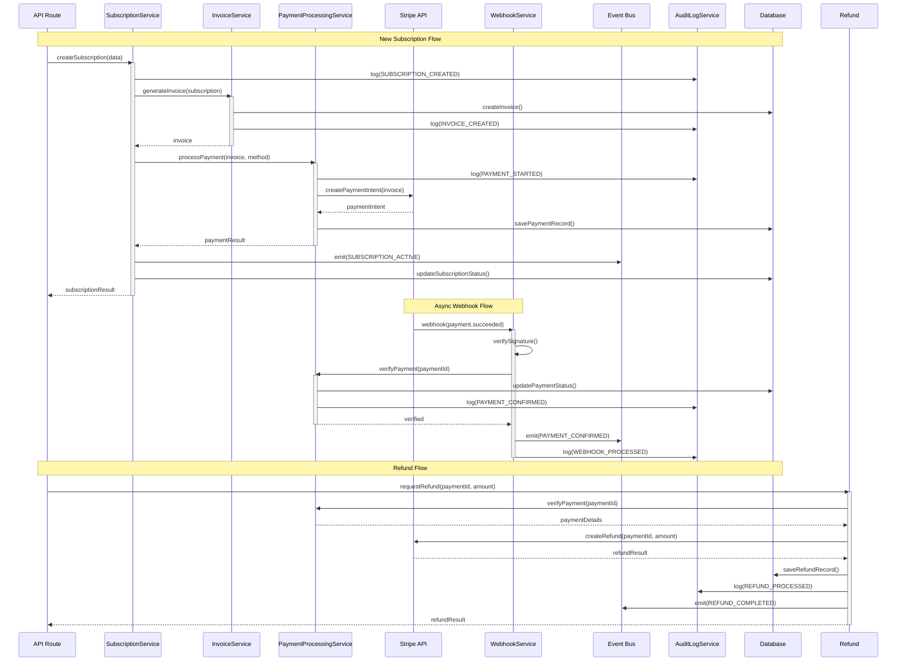
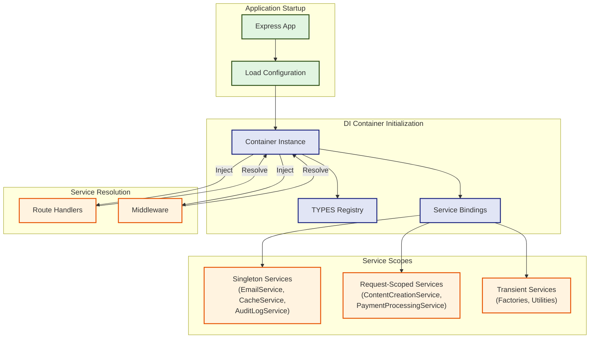
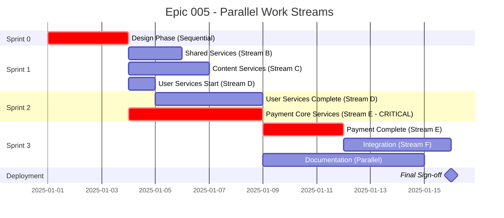
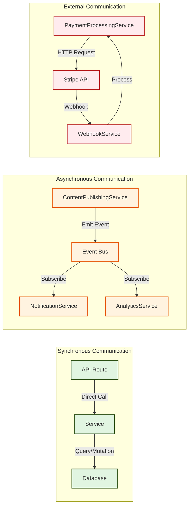
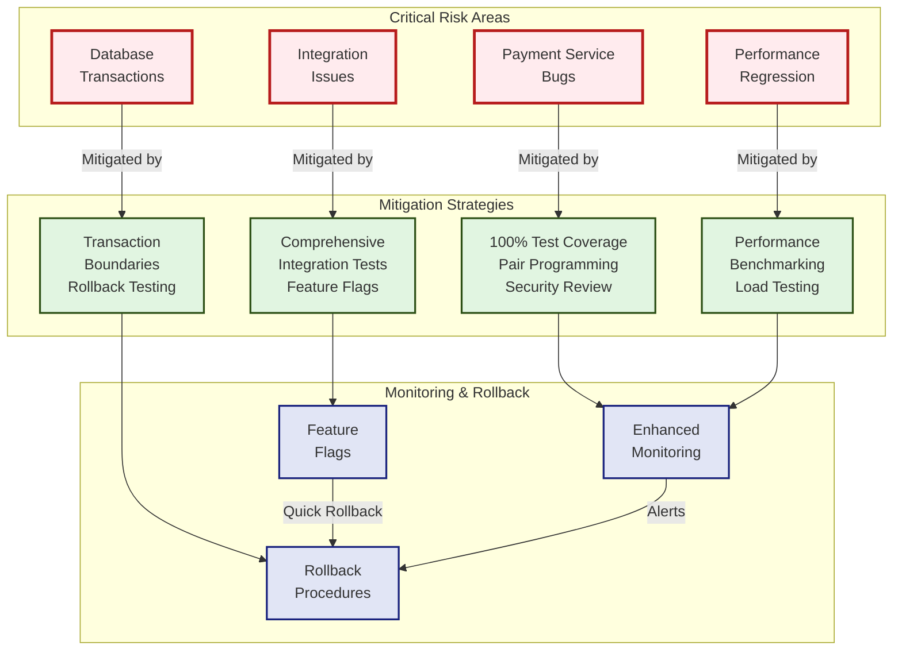
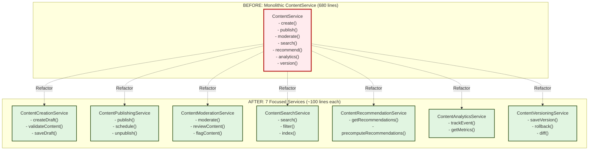
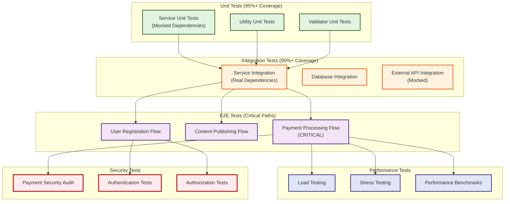

# Epic 005: Backend Service Refactoring - Dependency Diagrams

## Story Dependency Flow Diagram

```mermaid
graph TB
    subgraph "Sprint 0: Foundation (Week 1, Days 1-3)"
        S1["#1: Service Dependency<br/>Analysis"]
        S2["#2: Define Bounded<br/>Contexts & Interfaces"]
        S3["#3: Setup DI<br/>Container"]
        S4["#4: Service Factory<br/>Pattern"]
        S5["#5: Event Bus<br/>Setup"]
        S6["#6: Migration<br/>Strategy"]
    end

    subgraph "Sprint 1: Shared Services (Week 1-2, Days 4-2)"
        S7["#7: EmailService"]
        S8["#8: NotificationService"]
        S9["#9: AuditLogService"]
        S10["#10: CacheService"]
    end

    subgraph "Sprint 1: Content Services (Week 2, Days 1-2)"
        S11["#11: ContentCreationService"]
        S12["#12: ContentPublishingService"]
        S13["#13: ContentModerationService"]
        S14["#14: ContentSearchService"]
        S15["#15: ContentRecommendationService"]
        S16["#16: ContentAnalyticsService"]
        S17["#17: ContentVersioningService"]
    end

    subgraph "Sprint 2: User Services (Week 2, Days 3-5)"
        S18["#18: UserAuthenticationService"]
        S19["#19: UserProfileService"]
        S20["#20: UserPreferencesService"]
        S21["#21: UserActivityService"]
        S22["#22: UserRelationshipService"]
        S23["#23: UserAnalyticsService"]
    end

    subgraph "Sprint 2-3: Payment Services - CRITICAL (Week 2-3)"
        S24["#24: InvoiceService<br/>⚠️ CRITICAL"]
        S25["#25: PaymentProcessingService<br/>⚠️ CRITICAL"]
        S26["#26: SubscriptionService<br/>⚠️ CRITICAL"]
        S27["#27: RefundService<br/>⚠️ CRITICAL"]
        S28["#28: PaymentAnalyticsService"]
        S29["#29: WebhookService"]
        S30["#30: CurrencyService"]
        S31["#31: Payment Integration Tests<br/>🔒 BLOCKS PRODUCTION"]
    end

    subgraph "Sprint 3: Integration (Week 3-4)"
        S32["#32: Wire All Services<br/>Through DI"]
        S33["#33: Update API<br/>Routes"]
        S34["#34: Integration<br/>Tests"]
        S35["#35: Performance<br/>Testing"]
        S36["#36: Fix Issues &<br/>Regressions"]
    end

    subgraph "Sprint 3: Documentation (Week 4)"
        S37["#37: Architecture<br/>Diagrams"]
        S38["#38: API<br/>Documentation"]
        S39["#39: Developer<br/>Guide"]
        S40["#40: ADRs"]
        S41["#41: Cleanup Old<br/>Code"]
        S42["#42: Final Sign-off<br/>🔒 BLOCKS PRODUCTION"]
    end

    %% Critical Path Dependencies (solid red lines)
    S1 -->|BLOCKS ALL| S2
    S2 -->|BLOCKS ALL| S3
    S3 -->|BLOCKS ALL IMPL| S24
    S24 -->|SEQUENTIAL| S25
    S25 -->|SEQUENTIAL| S26
    S26 -->|SEQUENTIAL| S27
    S24 --> S31
    S25 --> S31
    S26 --> S31
    S27 --> S31
    S28 --> S31
    S29 --> S31
    S30 --> S31
    S31 -->|BLOCKS PROD| S32
    S32 --> S33
    S33 --> S34
    S34 --> S35
    S35 --> S36
    S36 --> S42

    %% Foundation Dependencies
    S1 --> S6
    S2 --> S6
    S3 --> S6
    S4 --> S6
    S5 --> S6
    S3 --> S4
    S3 --> S5

    %% Shared Service Dependencies
    S3 --> S7
    S3 --> S8
    S3 --> S9
    S3 --> S10
    S7 --> S8

    %% Content Service Dependencies
    S2 --> S11
    S2 --> S12
    S2 --> S13
    S2 --> S14
    S2 --> S15
    S2 --> S16
    S2 --> S17
    S3 --> S11
    S3 --> S12
    S3 --> S13
    S3 --> S14
    S3 --> S15
    S3 --> S16
    S3 --> S17
    S9 --> S11
    S9 --> S13
    S5 --> S12
    S10 --> S14
    S10 --> S15

    %% User Service Dependencies
    S2 --> S18
    S2 --> S19
    S2 --> S20
    S2 --> S21
    S2 --> S22
    S2 --> S23
    S3 --> S18
    S3 --> S19
    S3 --> S20
    S3 --> S21
    S3 --> S22
    S3 --> S23
    S9 --> S18
    S9 --> S21
    S8 --> S22

    %% Payment Service Dependencies
    S2 --> S24
    S3 --> S24
    S9 --> S24
    S24 --> S28
    S24 --> S30
    S25 --> S27
    S25 --> S29
    S26 --> S27

    %% Integration Dependencies
    S11 --> S32
    S12 --> S32
    S13 --> S32
    S14 --> S32
    S15 --> S32
    S16 --> S32
    S17 --> S32
    S18 --> S32
    S19 --> S32
    S20 --> S32
    S21 --> S32
    S22 --> S32
    S23 --> S32
    S24 --> S32
    S25 --> S32
    S26 --> S32
    S27 --> S32
    S28 --> S32
    S29 --> S32
    S30 --> S32

    %% Documentation Dependencies
    S32 --> S37
    S33 --> S38
    S36 --> S41
    S37 --> S42
    S38 --> S42
    S39 --> S42
    S40 --> S42
    S41 --> S42

    %% Styling
    classDef foundation fill:#e1f5e1,stroke:#2d5016,stroke-width:2px
    classDef shared fill:#e1e5f5,stroke:#1a237e,stroke-width:2px
    classDef content fill:#fff3e0,stroke:#e65100,stroke-width:2px
    classDef user fill:#f3e5f5,stroke:#4a148c,stroke-width:2px
    classDef payment fill:#ffebee,stroke:#b71c1c,stroke-width:3px
    classDef integration fill:#e0f2f1,stroke:#004d40,stroke-width:2px
    classDef documentation fill:#fce4ec,stroke:#880e4f,stroke-width:2px
    classDef critical fill:#ff0000,stroke:#000000,stroke-width:4px

    class S1,S2,S3,S4,S5,S6 foundation
    class S7,S8,S9,S10 shared
    class S11,S12,S13,S14,S15,S16,S17 content
    class S18,S19,S20,S21,S22,S23 user
    class S24,S25,S26,S27,S28,S29,S30,S31 payment
    class S32,S33,S34,S35,S36 integration
    class S37,S38,S39,S40,S41,S42 documentation
    class S31,S42 critical
```

---

## Service Architecture Overview

```mermaid
graph TB
    subgraph "API Layer"
        Routes["Express Routes<br/>(Controller Layer)"]
    end

    subgraph "DI Container"
        Container["InversifyJS<br/>Service Container"]
    end

    subgraph "Shared Services"
        Email["EmailService"]
        Notification["NotificationService"]
        Audit["AuditLogService"]
        Cache["CacheService"]
    end

    subgraph "Content Domain"
        ContentCreate["ContentCreationService"]
        ContentPublish["ContentPublishingService"]
        ContentMod["ContentModerationService"]
        ContentSearch["ContentSearchService"]
        ContentRec["ContentRecommendationService"]
        ContentAnalytics["ContentAnalyticsService"]
        ContentVersion["ContentVersioningService"]
    end

    subgraph "User Domain"
        UserAuth["UserAuthenticationService"]
        UserProfile["UserProfileService"]
        UserPrefs["UserPreferencesService"]
        UserActivity["UserActivityService"]
        UserRel["UserRelationshipService"]
        UserAnalytics["UserAnalyticsService"]
    end

    subgraph "Payment Domain - CRITICAL"
        Invoice["InvoiceService"]
        Payment["PaymentProcessingService"]
        Subscription["SubscriptionService"]
        Refund["RefundService"]
        PaymentAnalytics["PaymentAnalyticsService"]
        Webhook["WebhookService"]
        Currency["CurrencyService"]
    end

    subgraph "Infrastructure"
        EventBus["Event Bus"]
        DB["Database"]
        Redis["Redis Cache"]
        Stripe["Stripe API"]
        Lightning["Lightning Network"]
        Nostr["Nostr Relays"]
    end

    %% Route to Container
    Routes -->|Resolves Services| Container

    %% Container to Services
    Container -->|Injects| Email
    Container -->|Injects| Notification
    Container -->|Injects| Audit
    Container -->|Injects| Cache
    Container -->|Injects| ContentCreate
    Container -->|Injects| ContentPublish
    Container -->|Injects| UserAuth
    Container -->|Injects| Invoice
    Container -->|Injects| Payment

    %% Service Dependencies
    ContentPublish -->|Uses| Email
    ContentPublish -->|Uses| Notification
    ContentPublish -->|Uses| EventBus
    ContentPublish -->|Uses| Nostr

    ContentCreate -->|Uses| Audit
    ContentMod -->|Uses| Audit

    ContentSearch -->|Uses| Cache
    ContentRec -->|Uses| Cache

    UserAuth -->|Uses| Audit
    UserActivity -->|Uses| Audit
    UserRel -->|Uses| Notification

    Invoice -->|Uses| Audit
    Payment -->|Uses| Audit
    Payment -->|Uses| Stripe
    Payment -->|Uses| Lightning
    Refund -->|Uses| Audit
    Webhook -->|Uses| EventBus

    %% Infrastructure Dependencies
    Email -->|Connects| DB
    Notification -->|Connects| DB
    Audit -->|Connects| DB
    Cache -->|Connects| Redis

    ContentCreate -->|Connects| DB
    ContentSearch -->|Connects| DB

    UserAuth -->|Connects| DB
    UserProfile -->|Connects| DB

    Invoice -->|Connects| DB
    Payment -->|Connects| DB
    Subscription -->|Connects| DB

    %% Styling
    classDef shared fill:#e1e5f5,stroke:#1a237e,stroke-width:2px
    classDef content fill:#fff3e0,stroke:#e65100,stroke-width:2px
    classDef user fill:#f3e5f5,stroke:#4a148c,stroke-width:2px
    classDef payment fill:#ffebee,stroke:#b71c1c,stroke-width:3px
    classDef infrastructure fill:#e0f2f1,stroke:#004d40,stroke-width:2px

    class Email,Notification,Audit,Cache shared
    class ContentCreate,ContentPublish,ContentMod,ContentSearch,ContentRec,ContentAnalytics,ContentVersion content
    class UserAuth,UserProfile,UserPrefs,UserActivity,UserRel,UserAnalytics user
    class Invoice,Payment,Subscription,Refund,PaymentAnalytics,Webhook,Currency payment
    class EventBus,DB,Redis,Stripe,Lightning,Nostr infrastructure
```

---

## Payment Service Flow - CRITICAL PATH

---

## DI Container Structure

---

## Parallel Work Stream Visualization

---

## Service Communication Patterns

---

## Risk Areas and Mitigation

---

## Content Service Decomposition Example

---

## Testing Strategy Layers

---

## Legend

### Diagram Symbols

- **Solid Lines**: Direct dependencies (blocking)
- **Dashed Lines**: Parallel work opportunities (can work simultaneously)
- **Red/Critical Styling**: Critical path stories (payment services)
- **Lock Symbol 🔒**: Blocks production deployment
- **Warning Symbol ⚠️**: High-risk area requiring extra care

### Color Coding

- **Green**: Foundation/Infrastructure (Sprint 0)
- **Blue**: Shared Services
- **Orange**: Content Domain Services
- **Purple**: User Domain Services
- **Red**: Payment Domain Services (CRITICAL)
- **Teal**: Integration & Testing
- **Pink**: Documentation

### Story Priority

- **CRITICAL**: Payment services - revenue impacting
- **HIGH**: Authentication, core services
- **MEDIUM**: Analytics, recommendations
- **LOW**: Documentation (can be done in parallel)

---

## Notes

1. **Critical Path**: The longest sequential chain runs through payment services (#1 → #2 → #3 → #24 → #25 → #26 → #27 → #31 → #32 → #33 → #34 → #35 → #36 → #42)

2. **Parallel Opportunities**: Maximum parallelization occurs in Sprint 1-2 where content services, user services, and shared services can all be worked simultaneously (up to 17 stories in parallel with proper team allocation)

3. **Blocking Stories**:
   - Story #31 (Payment Integration Tests) blocks production deployment
   - Story #42 (Final Sign-off) is the final gate
   - Story #3 (DI Container) blocks all implementation

4. **Risk Management**: Payment services are on the critical path and require the most experienced developers, comprehensive testing, and gradual rollout with feature flags
