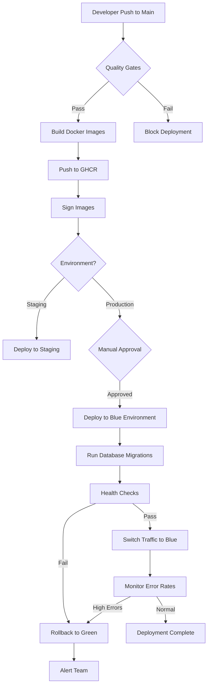

# Epic 006: Automated Deployment Pipeline

**Status**: In Progress
**Goal**: Achieve 100% CI/CD automation (from current 75%)
**Target**: Zero-downtime deployments with cutting-edge Docker and GitHub Actions best practices

## Executive Summary

Epic 006 closes the deployment automation gap by implementing fully automated CI/CD for the 29 backend services delivered in Epic 005. Current maturity is 75% (frontend: 95%, backend: 40%). This epic will achieve 100% automation with blue-green deployments, automatic rollbacks, and comprehensive health checks.

## Current State Analysis

### Existing Infrastructure (✅ Working)

- Frontend Vercel deployment: 95% automated (`.github/workflows/release.yml`)
- Quality gates: 100% automated (`.github/workflows/quality-gates.yml`)
- Security scanning: 100% automated
- 13 GitHub Actions workflows operational

### Gaps to Address (❌ Missing)

1. **Backend Deployment**: No automated workflow for 29 services from Epic 005
2. **Auto-Deploy Triggers**: Manual trigger only, not automatic on main push
3. **Docker Automation**: No Docker build/push workflows
4. **Rollback Automation**: Manual intervention required on failures
5. **Secrets Documentation**: Incomplete secrets inventory
6. **Health Check Automation**: Post-deployment validation not automated

## Epic 006 User Stories

### Phase 1: Containerization (Stories 1-2)

#### US-E6-001: Docker Multi-Stage Builds for 29 Backend Services

**Priority**: P0 (Critical Path)
**Agent**: cicd-pipeline-architect
**Estimated Effort**: 8 story points

**Acceptance Criteria**:

- [ ] Multi-stage Dockerfile for Node.js TypeScript services
- [ ] Production image size < 150MB (using Alpine base)
- [ ] Build cache optimization (layer caching)
- [ ] Health check endpoints in all services
- [ ] Non-root user execution
- [ ] Security scanning with Trivy in build
- [ ] All 29 services containerized

**Subtasks**:

1. Create optimized multi-stage Dockerfile template
2. Add health check routes to each service
3. Configure Docker Compose for local testing
4. Implement security best practices (non-root, minimal base)
5. Add Trivy security scanning
6. Test build for all 29 services
7. Document Docker architecture

**Cutting-Edge Practices**:

- BuildKit for parallel layer builds
- Multi-stage builds (build → deps → production)
- Distroless or Alpine base images
- SBOM generation for supply chain security
- .dockerignore optimization

---

#### US-E6-002: GitHub Container Registry Setup & Image Management

**Priority**: P0 (Critical Path)
**Agent**: cicd-pipeline-architect
**Estimated Effort**: 5 story points

**Acceptance Criteria**:

- [ ] GHCR repository per service configured
- [ ] Automatic image tagging (semantic versioning + SHA)
- [ ] Image retention policy (keep last 10 versions)
- [ ] Vulnerability scanning on push
- [ ] Package visibility properly configured
- [ ] Image signing with Cosign

**Subtasks**:

1. Configure GHCR authentication in GitHub Actions
2. Create image naming convention (ghcr.io/owner/sovren-{service}:version)
3. Implement semantic versioning tagging strategy
4. Set up retention policies
5. Configure vulnerability scanning
6. Document registry architecture

**Cutting-Edge Practices**:

- Container image signing with Sigstore/Cosign
- SLSA provenance generation
- Multi-architecture builds (amd64, arm64)
- Image attestations for supply chain security

---

### Phase 2: Deployment Workflows (Stories 3-4)

#### US-E6-003: Backend Deployment Workflow (Blue-Green Strategy)

**Priority**: P0 (Critical Path)
**Agent**: cicd-pipeline-architect
**Estimated Effort**: 13 story points

**Acceptance Criteria**:

- [ ] Blue-green deployment implementation
- [ ] Zero-downtime service updates
- [ ] Automated database migrations
- [ ] Load balancer traffic switching
- [ ] Deployment status notifications (Slack)
- [ ] Deployment metrics tracking
- [ ] Rollback on failure

**Subtasks**:

1. Design blue-green architecture (2 environments)
2. Create GitHub Actions workflow for backend deployment
3. Implement pre-deployment health checks
4. Add database migration automation
5. Configure traffic switching logic
6. Add Slack notifications
7. Test deployment pipeline end-to-end
8. Document deployment process

**Workflow Structure**:

```yaml
name: Backend Deployment (Blue-Green)
on:
  workflow_dispatch:
  push:
    branches: [main]
    paths: ['packages/backend/**']

jobs:
  build-and-push:
    - Docker build with BuildKit
    - Push to GHCR with tags
    - Sign images with Cosign

  deploy-blue:
    - Deploy to blue environment
    - Run database migrations
    - Health check validation

  traffic-switch:
    - Gradual traffic shift (10% → 50% → 100%)
    - Monitor error rates
    - Automatic rollback on threshold breach

  cleanup-green:
    - Decommission old green environment
    - Keep for quick rollback (5 min window)
```

**Cutting-Edge Practices**:

- Progressive delivery (canary deployments)
- Automated rollback based on error rate SLIs
- Deployment freeze windows
- ChatOps integration (Slack commands)

---

#### US-E6-004: Auto-Deploy on Main Branch Push

**Priority**: P0 (Critical Path)
**Agent**: cicd-pipeline-architect
**Estimated Effort**: 3 story points

**Acceptance Criteria**:

- [ ] Automatic trigger on push to main
- [ ] Path-based triggers (only deploy changed services)
- [ ] Quality gate enforcement before deploy
- [ ] Manual approval gate for production
- [ ] Deployment schedule (business hours only)
- [ ] Emergency override capability

**Subtasks**:

1. Configure automatic workflow triggers
2. Implement path filters for monorepo
3. Add quality gate checks (tests, lint, security)
4. Create manual approval environment
5. Add deployment window logic
6. Test auto-deploy flow

**Cutting-Edge Practices**:

- Monorepo path filters (only deploy changed packages)
- Required status checks before deploy
- GitHub Environments with protection rules
- Deployment concurrency limits

---

### Phase 3: Reliability & Operations (Stories 5-6)

#### US-E6-005: Health Checks & Automated Rollback

**Priority**: P0 (Critical Path)
**Agent**: cicd-pipeline-architect
**Estimated Effort**: 8 story points

**Acceptance Criteria**:

- [ ] Health check endpoints for all services
- [ ] Liveness and readiness probes
- [ ] Post-deployment smoke tests
- [ ] Error rate monitoring
- [ ] Automatic rollback on failure
- [ ] Rollback completion time < 2 minutes
- [ ] Alert notifications on rollback

**Subtasks**:

1. Implement `/health`, `/ready`, `/live` endpoints
2. Create smoke test suite
3. Configure error rate monitoring
4. Implement rollback automation
5. Add rollback notifications
6. Test rollback scenarios
7. Document health check architecture

**Health Check Strategy**:

- `/health` - Overall service health
- `/ready` - Ready to receive traffic (DB connected, cache available)
- `/live` - Process is alive (for orchestrator)

**Rollback Triggers**:

- HTTP 5xx error rate > 5%
- Response time P95 > 1000ms
- Health check failures > 3 consecutive
- Manual trigger via ChatOps

**Cutting-Edge Practices**:

- Chaos engineering tests (failure injection)
- SLO-based automated rollback
- Distributed tracing for deployment validation
- Synthetic monitoring post-deploy

---

#### US-E6-006: Secrets Management & Documentation

**Priority**: P1 (High)
**Agent**: technical-docs-writer
**Estimated Effort**: 3 story points

**Acceptance Criteria**:

- [ ] Complete secrets inventory documented
- [ ] GitHub Secrets configuration guide
- [ ] Environment-specific secrets documented
- [ ] Secrets rotation procedures
- [ ] Access control documentation
- [ ] Secrets validation in CI

**Subtasks**:

1. Audit all required secrets
2. Document each secret with purpose
3. Create secrets setup guide
4. Document rotation procedures
5. Add secrets validation checks
6. Create secrets troubleshooting guide

**Required Secrets**:

```
Production:
- VERCEL_TOKEN
- VERCEL_ORG_ID
- VERCEL_PROJECT_ID
- DOCKER_USERNAME
- DOCKER_PASSWORD
- DATABASE_URL
- REDIS_URL
- SUPABASE_URL
- SUPABASE_ANON_KEY
- SUPABASE_SERVICE_ROLE_KEY
- SLACK_WEBHOOK_URL
- NOSTR_RELAY_SECRET
- LIGHTNING_NODE_MACAROON

Staging:
- Same as production with _STAGING suffix
```

**Cutting-Edge Practices**:

- OIDC authentication (no long-lived tokens)
- Secrets detection in commits (GitGuardian)
- Automatic secrets rotation
- HashiCorp Vault integration (future)

---

### Phase 4: Multi-Environment & Testing (Stories 7-8)

#### US-E6-007: Multi-Environment Configuration (Staging/Production)

**Priority**: P1 (High)
**Agent**: infrastructure-provisioner
**Estimated Effort**: 5 story points

**Acceptance Criteria**:

- [ ] Staging environment fully configured
- [ ] Production environment configured
- [ ] Environment-specific configurations
- [ ] Database per environment
- [ ] Separate GHCR tags per environment
- [ ] Environment promotion workflow

**Subtasks**:

1. Design environment architecture
2. Create environment-specific configs
3. Set up staging database
4. Configure environment variables
5. Implement promotion workflow
6. Document environment strategy

**Environment Strategy**:

```
Development (Local):
- Docker Compose
- Local PostgreSQL
- Local Redis

Staging:
- Vercel Preview (frontend)
- Docker containers on cloud
- Staging database
- Staging secrets

Production:
- Vercel Production (frontend)
- Docker containers with blue-green
- Production database
- Production secrets
- CDN enabled
```

**Cutting-Edge Practices**:

- Infrastructure as Code (Terraform)
- Ephemeral preview environments
- Production parity (12-factor app)
- Feature flags for gradual rollout

---

#### US-E6-008: Deployment Pipeline Integration Tests

**Priority**: P1 (High)
**Agent**: test-automation-engineer
**Estimated Effort**: 8 story points

**Acceptance Criteria**:

- [ ] End-to-end deployment tests
- [ ] Rollback scenario tests
- [ ] Health check validation tests
- [ ] Multi-service deployment tests
- [ ] Performance regression tests
- [ ] Test coverage > 90% for deployment logic
- [ ] CI integration for deployment tests

**Subtasks**:

1. Design deployment test strategy
2. Implement deployment simulation tests
3. Create rollback scenario tests
4. Add health check validation tests
5. Implement performance regression tests
6. Integrate tests into CI pipeline
7. Document testing approach

**Test Scenarios**:

- ✅ Successful deployment (all services healthy)
- ✅ Partial deployment failure (rollback triggered)
- ✅ Health check failure (rollback triggered)
- ✅ Database migration failure (rollback triggered)
- ✅ Traffic switch validation
- ✅ Multi-service coordination
- ✅ Secrets validation
- ✅ Performance regression detection

**Cutting-Edge Practices**:

- Contract testing for service dependencies
- Load testing in staging before production
- Deployment chaos tests (failure injection)
- Observability validation (metrics/logs/traces)

---

## Success Metrics

### Deployment Automation

- **Target**: 100% automation (from 75%)
- **Frontend**: Maintain 95%
- **Backend**: Increase from 40% to 100%

### Deployment Performance

- **Deployment Time**: < 10 minutes (full backend deploy)
- **Rollback Time**: < 2 minutes
- **Zero-Downtime**: 100% of deployments
- **Success Rate**: > 99% (with automatic rollback)

### Developer Experience

- **Time to Deploy**: < 15 minutes (commit to production)
- **Manual Steps**: 0 (except approval gates)
- **Rollback Confidence**: 100% (tested and automated)

### Operational Excellence

- **Deployment Frequency**: 10+ per day (capable)
- **Mean Time to Recovery**: < 5 minutes
- **Change Failure Rate**: < 5%
- **Service Availability**: > 99.9%

## Technical Architecture

### Deployment Pipeline Flow



### Blue-Green Architecture

```
┌─────────────────────────────────────────────┐
│          Load Balancer / Ingress            │
│         (Traffic Switching Layer)           │
└─────────────────┬───────────────────────────┘
                  │
      ┌───────────┴───────────┐
      ▼                       ▼
┌─────────────┐         ┌─────────────┐
│   BLUE      │         │   GREEN     │
│ Environment │         │ Environment │
│ (Active)    │         │ (Standby)   │
├─────────────┤         ├─────────────┤
│ 29 Services │         │ 29 Services │
│ New Version │         │ Old Version │
└─────────────┘         └─────────────┘
      │                       │
      └───────────┬───────────┘
                  ▼
        ┌──────────────────┐
        │   Shared Data    │
        │   - PostgreSQL   │
        │   - Redis        │
        └──────────────────┘

Deployment Flow:
1. Deploy new version to GREEN (currently idle)
2. Run health checks on GREEN
3. Gradually shift traffic: BLUE 100% → GREEN 10% → 50% → 100%
4. Monitor error rates during shift
5. If healthy: GREEN becomes active, BLUE becomes standby
6. If unhealthy: Rollback traffic to BLUE
```

## Dependencies

### External Services

- GitHub Container Registry (GHCR)
- Vercel (frontend hosting)
- Cloud provider for Docker containers
- PostgreSQL (Supabase)
- Redis (caching)
- Slack (notifications)

### Internal Dependencies

- Epic 005 backend services (29 services)
- Existing quality gates (working)
- Existing security scans (working)

## Risks and Mitigation

| Risk                           | Impact | Probability | Mitigation                           |
| ------------------------------ | ------ | ----------- | ------------------------------------ |
| Database migration failure     | High   | Medium      | Automated rollback, migration tests  |
| Traffic switch causes downtime | High   | Low         | Gradual shift, automatic rollback    |
| Secrets misconfiguration       | High   | Medium      | Validation in CI, comprehensive docs |
| Docker image size too large    | Medium | Medium      | Multi-stage builds, optimization     |
| Deployment too slow            | Medium | Low         | Parallel builds, cache optimization  |

## Timeline

**Total Duration**: 2 weeks (with parallel agent execution)

### Week 1

- **Days 1-2**: Docker containerization (US-E6-001)
- **Days 2-3**: GHCR setup (US-E6-002)
- **Days 3-5**: Backend deployment workflow (US-E6-003)

### Week 2

- **Days 6-7**: Auto-deploy triggers (US-E6-004)
- **Days 7-9**: Health checks & rollback (US-E6-005)
- **Days 9-10**: Secrets & environments (US-E6-006, US-E6-007)
- **Days 10-12**: Integration tests (US-E6-008)

## Cutting-Edge Best Practices Checklist

### Docker Excellence

- ✅ Multi-stage builds (build → deps → production)
- ✅ BuildKit for parallel layer builds
- ✅ Distroless or Alpine base images
- ✅ Non-root user execution
- ✅ SBOM generation
- ✅ Image signing with Cosign
- ✅ Multi-architecture builds
- ✅ Layer caching optimization

### GitHub Actions Excellence

- ✅ Reusable workflows
- ✅ Composite actions for common tasks
- ✅ Matrix builds for parallel execution
- ✅ OIDC authentication (no long-lived tokens)
- ✅ Path-based triggers for monorepo
- ✅ Required status checks
- ✅ Environment protection rules
- ✅ Deployment concurrency limits
- ✅ ChatOps integration

### Deployment Excellence

- ✅ Blue-green deployments
- ✅ Progressive traffic shifting
- ✅ Automated rollback on SLO breach
- ✅ Zero-downtime deployments
- ✅ Database migration automation
- ✅ Health check endpoints
- ✅ Smoke tests post-deploy
- ✅ Deployment metrics tracking

### Security Excellence

- ✅ Container vulnerability scanning
- ✅ Image signing and verification
- ✅ Secrets rotation procedures
- ✅ SLSA provenance
- ✅ Supply chain security (SBOM)
- ✅ Least privilege access
- ✅ Security gates before deploy

### Observability Excellence

- ✅ Deployment metrics
- ✅ Error rate monitoring
- ✅ Performance regression detection
- ✅ Distributed tracing validation
- ✅ Log aggregation
- ✅ Alert notifications
- ✅ Deployment dashboard

## Agent Orchestration Plan

Execute stories in parallel for maximum velocity:

**Parallel Wave 1** (Stories 1-2):

- cicd-pipeline-architect: US-E6-001 (Docker builds)
- cicd-pipeline-architect: US-E6-002 (GHCR setup)

**Parallel Wave 2** (Stories 3-5):

- cicd-pipeline-architect: US-E6-003 (Deployment workflow)
- cicd-pipeline-architect: US-E6-004 (Auto-deploy)
- cicd-pipeline-architect: US-E6-005 (Health checks)

**Parallel Wave 3** (Stories 6-8):

- technical-docs-writer: US-E6-006 (Secrets docs)
- infrastructure-provisioner: US-E6-007 (Multi-environment)
- test-automation-engineer: US-E6-008 (Integration tests)

**Total Agent Hours**: ~53 story points across 4 agents = ~13 story points per agent (1.5 weeks with parallelization)

## Completion Criteria

Epic 006 is complete when:

- ✅ All 29 backend services containerized with Docker
- ✅ Automated deployment to staging and production
- ✅ Blue-green deployment with zero downtime
- ✅ Automatic rollback on failure (< 2 min)
- ✅ Health checks for all services
- ✅ 100% CI/CD automation achieved
- ✅ Comprehensive secrets documentation
- ✅ Multi-environment configuration complete
- ✅ Integration tests for deployment pipeline (> 90% coverage)
- ✅ Team trained on new deployment process
- ✅ 10+ successful production deployments validated

## References

- [GitHub Actions Documentation](https://docs.github.com/en/actions)
- [Docker Best Practices](https://docs.docker.com/develop/dev-best-practices/)
- [Blue-Green Deployments](https://martinfowler.com/bliki/BlueGreenDeployment.html)
- [SLSA Framework](https://slsa.dev/)
- [Sigstore/Cosign](https://docs.sigstore.dev/)
- Epic 005 Backend Services (29 services requiring deployment)
- Current CI/CD workflows in `.github/workflows/`
