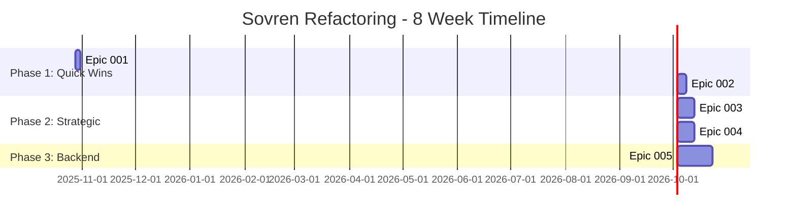

# Sovren Refactoring: Master Implementation Plan

**Status**: Ready for Execution
**Date**: 2025-10-23
**Version**: 1.0

---

## Executive Summary

This document provides the comprehensive implementation plan for all 5 Epics in the Sovren refactoring initiative. It integrates Epic 001, Epic 002, Epic 003, Epic 004, and Epic 005 into a cohesive, sequenced roadmap with clear milestones, resource allocation, and risk management.

### At a Glance

| Metric | Value |
|--------|-------|
| **Total Epics** | 5 Epics |
| **Total Stories** | 90-110 stories (estimated) |
| **Total Effort** | 90-110 story points |
| **Timeline (3 devs)** | 6-8 weeks |
| **Timeline (2 devs)** | 10-12 weeks |
| **Expected ROI** | 30% maintenance cost reduction, 20% velocity increase |

### Epic Completion Status

- ✅ **Epic 001**: Type Safety - DECOMPOSED (12 stories, ready)
- ✅ **Epic 002**: Payment Processing - DECOMPOSED (18 stories, ready)
- 📋 **Epic 003**: NOSTR Consolidation - SPEC READY (22-28 stories estimated)
- 📋 **Epic 004**: State Management - SPEC READY (24-30 stories estimated)
- 📋 **Epic 005**: Backend Services - SPEC READY (36-45 stories estimated)

---

## Table of Contents

1. [Epic Overview](#epic-overview)
2. [Implementation Sequence](#implementation-sequence)
3. [Resource Allocation](#resource-allocation)
4. [Timeline & Milestones](#timeline--milestones)
5. [Dependency Management](#dependency-management)
6. [Risk Management](#risk-management)
7. [Quality Gates](#quality-gates)
8. [Communication Plan](#communication-plan)
9. [Rollback Strategy](#rollback-strategy)
10. [Success Metrics](#success-metrics)

---

## Epic Overview

### Epic 001: Type Safety Improvements
**Status**: ✅ Ready for Development
**Stories**: 12 stories
**Effort**: 12 points (24 hours)
**Timeline**: 2-3 days
**Priority**: HIGH (Quick Win)
**Risk**: LOW

**Business Value**:
- 15-20% reduction in type-related bugs
- Better IDE autocomplete
- Improved code quality
- Foundation for other Epics

**Dependencies**:
- None (can start immediately)

**Documentation**:
- ✅ EPIC-001-story-breakdown.md
- ✅ EPIC-001-story-map.md
- ✅ EPIC-001-quick-reference.md
- ✅ EPIC-001-dependency-graph.mmd
- ✅ EPIC-001-README.md
- ✅ EPIC-001-github-issue-template.md

---

### Epic 002: Payment Processing TODO Resolution
**Status**: ✅ Ready for Development
**Stories**: 18 stories
**Effort**: 18 points (36-72 hours)
**Timeline**: 4-5 days
**Priority**: CRITICAL (Revenue Impact)
**Risk**: MEDIUM-HIGH

**Business Value**:
- Production-ready payment flows
- 40% reduction in payment support tickets
- Comprehensive audit trail
- Compliance readiness

**Dependencies**:
- Soft dependency on Epic 001 (types help payment code)

**Documentation**:
- ✅ EPIC-002-USER-STORIES.md
- ✅ EPIC-002-STORY-MAP.md
- ✅ EPIC-002-QUICK-REFERENCE.md
- ✅ EPIC-002-DEPENDENCY-GRAPH.mmd
- ✅ EPIC-002-README.md

---

### Epic 003: NOSTR Service Consolidation
**Status**: 📋 Decomposition Spec Ready
**Stories**: 22-28 stories (estimated)
**Effort**: 22-28 points (44-56 hours)
**Timeline**: 1.5-2 weeks
**Priority**: HIGH (Strategic)
**Risk**: MEDIUM

**Business Value**:
- 15% code reduction (~1,000 lines)
- 30% reduction in NOSTR maintenance
- Single source of truth
- Faster NOSTR feature development

**Dependencies**:
- Epic 001 (type safety) should be done first

**Documentation** (To Be Created):
- 📋 EPIC-003-story-breakdown.md
- 📋 EPIC-003-story-map.md
- 📋 EPIC-003-quick-reference.md
- 📋 EPIC-003-dependency-graph.mmd
- 📋 EPIC-003-README.md
- 📋 EPIC-003-github-issue-template.md
- ✅ EPIC-003-DECOMPOSITION-SPEC.md (completed)

---

### Epic 004: State Management Boundaries
**Status**: 📋 Decomposition Spec Ready
**Stories**: 24-30 stories (estimated)
**Effort**: 24-30 points (48-60 hours)
**Timeline**: 1.5-2 weeks
**Priority**: MEDIUM (Strategic)
**Risk**: MEDIUM

**Business Value**:
- 20% faster feature development
- < 1 day onboarding for state management
- Fewer state-related bugs
- Clear architectural patterns

**Dependencies**:
- Epic 001 (types) and Epic 003 (NOSTR) help clarify state patterns

**Documentation** (To Be Created):
- 📋 EPIC-004-story-breakdown.md
- 📋 EPIC-004-story-map.md
- 📋 EPIC-004-quick-reference.md
- 📋 EPIC-004-dependency-graph.mmd
- 📋 EPIC-004-README.md
- 📋 EPIC-004-github-issue-template.md
- ✅ EPIC-004-DECOMPOSITION-SPEC.md (completed)

---

### Epic 005: Backend Service Refactoring
**Status**: 📋 Decomposition Spec Ready
**Stories**: 36-45 stories (estimated)
**Effort**: 36-45 points (72-90 hours)
**Timeline**: 3-4 weeks
**Priority**: MEDIUM (Strategic)
**Risk**: MEDIUM-HIGH (payment services)

**Business Value**:
- 40% faster backend changes
- Team scalability (parallel work)
- Easier unit testing
- 25% reduction in backend bugs

**Dependencies**:
- Epic 001 (types) and Epic 002 (payment TODOs) should be integrated

**Documentation** (To Be Created):
- 📋 EPIC-005-story-breakdown.md
- 📋 EPIC-005-story-map.md
- 📋 EPIC-005-quick-reference.md
- 📋 EPIC-005-dependency-graph.mmd
- 📋 EPIC-005-README.md
- 📋 EPIC-005-github-issue-template.md
- ✅ EPIC-005-DECOMPOSITION-SPEC.md (completed)

---

## Implementation Sequence

### Recommended Sequence: Staged Delivery

This sequence balances business value, risk, and dependencies:

```
Phase 1: Quick Wins (Week 1)
  ├─ Epic 001: Type Safety (2-3 days) ✅ READY
  └─ Epic 002: Payment TODOs (4-5 days) ✅ READY

Phase 2: Strategic Architecture (Weeks 2-4)
  ├─ Epic 003: NOSTR Consolidation (1.5-2 weeks) 📋 DECOMPOSE
  └─ Epic 004: State Management (1.5-2 weeks) 📋 DECOMPOSE [Can overlap with Epic 003]

Phase 3: Backend Scalability (Weeks 5-8)
  └─ Epic 005: Backend Services (3-4 weeks) 📋 DECOMPOSE
```

### Sequencing Rationale

**Phase 1: Quick Wins** (Week 1)
- **Why**: Immediate value, low risk, foundation for other work
- **Epic 001 First**: 2-3 days, establishes type safety for all other Epics
- **Epic 002 Second**: 4-5 days, critical revenue protection
- **Blocker**: None

**Phase 2: Strategic Architecture** (Weeks 2-4)
- **Why**: Medium risk, high strategic value, improves development velocity
- **Epic 003**: NOSTR consolidation reduces tech debt, enables easier NOSTR features
- **Epic 004**: State management clarity improves frontend development
- **Can Run in Parallel**: Epic 003 (backend/shared focus) + Epic 004 (frontend focus)
- **Blocker**: Epic 001 (types) recommended

**Phase 3: Backend Scalability** (Weeks 5-8)
- **Why**: Largest Epic, medium-high risk (payment services), foundational for team scalability
- **Epic 005**: Backend service refactoring
- **Blocker**: Epic 001 (types), Epic 002 (payment TODOs should be integrated)

### Alternative Sequence: Parallel Aggressive

For teams with 4+ developers who want maximum speed:

```
Week 1:
  ├─ Epic 001: Type Safety (Team A: 2 devs)
  └─ Epic 002: Payment TODOs (Team B: 2 devs)

Weeks 2-3:
  ├─ Epic 003: NOSTR (Team A: 2 devs)
  └─ Epic 004: State Management (Team B: 2 devs)

Weeks 4-7:
  └─ Epic 005: Backend Services (All 4 devs)
```

**Pros**: Fastest completion (7 weeks)
**Cons**: High coordination overhead, potential merge conflicts

---

## Resource Allocation

### Optimal Team: 3 Developers

**Developer Profiles**:
1. **Frontend Specialist** (Senior)
   - Epic 001: Stream A (Frontend Types)
   - Epic 004: Streams B & C (State Management)
   - Epic 003: Stream C (Frontend Migration)

2. **Backend Specialist** (Senior, Payment Experience)
   - Epic 002: Critical Path (Payment Processing)
   - Epic 005: Stream D (Payment Services)
   - Epic 003: Stream D (Backend Migration)

3. **Full-Stack Generalist** (Mid-Senior)
   - Epic 001: Streams B & C (Shared/API Types)
   - Epic 003: Streams A & B (Core NOSTR, Adapters)
   - Epic 005: Streams B & C (Content/User Services)

### 3-Developer Allocation by Phase

**Phase 1: Quick Wins (Week 1)**
- **Day 1-2**: All 3 on Epic 001 (parallel streams)
  - Dev 1: Stories 1-5 (Stream A)
  - Dev 2: Stories 6-8 (Stream B)
  - Dev 3: Stories 9-10 (Stream C)
- **Day 3-5**: All 3 on Epic 002 (critical path)
  - Dev 1: Stories 1-6
  - Dev 2: Stories 7-12
  - Dev 3: Stories 13-18

**Phase 2: Strategic Architecture (Weeks 2-4)**
- **Epic 003** (2 devs):
  - Dev 2 (Backend): Core services + Backend migration
  - Dev 3 (Generalist): Adapters + Testing
- **Epic 004** (1 dev → 2 devs):
  - Dev 1 (Frontend): React Query migration
  - Dev 3 (Generalist): Redux consolidation (after Epic 003)

**Phase 3: Backend Scalability (Weeks 5-8)**
- **Epic 005** (All 3 devs):
  - Dev 1: Content services + Integration
  - Dev 2: Payment services (CRITICAL)
  - Dev 3: User services + Documentation

### Budget Team: 2 Developers

**Timeline**: 10-12 weeks (vs 6-8 weeks with 3 devs)

**Developer Profiles**:
1. **Full-Stack Senior** (Frontend leaning)
2. **Full-Stack Senior** (Backend leaning, Payment experience)

**Allocation**:
- Week 1: Both on Epic 001 (2 days) + Epic 002 start
- Weeks 2-3: Epic 002 completion + Epic 003 start
- Weeks 4-5: Epic 003 completion + Epic 004 start
- Weeks 6-7: Epic 004 completion + Epic 005 start
- Weeks 8-12: Epic 005 completion

### Minimum Team: 1 Developer

**Timeline**: 16-20 weeks

**Not Recommended**: Very slow, blocks other work. Only viable if:
- No time pressure
- Learning opportunity for developer
- Other features on hold

---

## Timeline & Milestones

### 8-Week Timeline (3 Developers)



### Milestones

**Week 1: Foundation Complete**
- ✅ Epic 001 complete (all types safe)
- ✅ Epic 002 complete (payment flows production-ready)
- 🎯 **Gate**: All tests passing, type coverage 99%+, payment E2E tests pass

**Week 3: NOSTR & State Management Complete**
- ✅ Epic 003 complete (single NOSTR service)
- ✅ Epic 004 complete (clear state boundaries)
- 🎯 **Gate**: NOSTR tests pass, state management tests pass, documentation complete

**Week 6-8: Backend Services Complete**
- ✅ Epic 005 complete (all services < 300 lines)
- 🎯 **Gate**: All backend tests pass, payment services 100% tested, performance benchmarks met

**Week 8: Refactoring Complete**
- 🎉 All 5 Epics complete
- 🎯 **Final Gate**: Full regression testing, production deployment, monitoring, retrospective

---

## Dependency Management

### Inter-Epic Dependencies

```
Epic 001 (Type Safety)
  ↓ (recommended)
Epic 002 (Payment) + Epic 003 (NOSTR)
  ↓ (parallel, independent)
Epic 004 (State Management)
  ↓ (builds on learnings)
Epic 005 (Backend Services)
```

### Dependency Details

**Epic 001 → All Others**
- Type safety improves code quality for all subsequent Epics
- Not a hard blocker, but recommended to complete first
- Provides better IDE support during refactoring

**Epic 002 ← Epic 001**
- Soft dependency: Types help payment code quality
- Epic 002 can start without Epic 001 if needed

**Epic 003 ← Epic 001**
- Soft dependency: Type safety helps NOSTR service consolidation
- Recommended but not required

**Epic 004 ← Epic 001, Epic 003**
- Epic 001 types help state management clarity
- Epic 003 NOSTR consolidation clarifies NOSTR state patterns
- Can start after Epic 001 if Epic 003 in progress

**Epic 005 ← Epic 001, Epic 002**
- Epic 001 types essential for service interfaces
- Epic 002 payment TODOs should be resolved before refactoring payment services
- Hard dependency on Epic 001, soft dependency on Epic 002

### Critical Path Analysis

**Longest Path**: Epic 001 → Epic 002 → Epic 005 (10-12 weeks)
**Parallel Opportunities**: Epic 003 + Epic 004 can run in parallel (Weeks 2-4)

---

## Risk Management

### Epic-Level Risks

#### Epic 001: Type Safety (LOW RISK)
**Risks**:
- Build time increase
- Hidden bugs revealed by strict mode

**Mitigation**:
- Monitor build performance
- Incremental strict mode enablement
- Comprehensive test suite

#### Epic 002: Payment Processing (HIGH RISK)
**Risks**:
- Breaking payment flows (CRITICAL)
- Revenue impact

**Mitigation**:
- Feature flags for all payment changes
- Canary deployment
- Extensive E2E testing
- Security audit before production
- Payment specialist review

#### Epic 003: NOSTR Consolidation (MEDIUM RISK)
**Risks**:
- Breaking NOSTR functionality
- Performance degradation

**Mitigation**:
- Parallel running (old + new implementations)
- Feature flags
- Comprehensive relay testing
- NIP compliance test suite

#### Epic 004: State Management (MEDIUM RISK)
**Risks**:
- Cache invalidation bugs
- Breaking existing features

**Mitigation**:
- Incremental migration
- Feature flags
- Comprehensive integration tests
- React Query DevTools

#### Epic 005: Backend Services (MEDIUM-HIGH RISK)
**Risks**:
- Breaking payment services (CRITICAL)
- Database transaction issues
- Performance degradation

**Mitigation**:
- Payment services last (after Content/User)
- Extensive testing (95%+ coverage, 100% for payments)
- Transaction boundary design
- Security audit for payment services
- Canary deployment

### Overall Risk Mitigation Strategy

1. **Feature Flags**: All major changes behind feature flags
2. **Parallel Running**: Keep old implementations for 1-2 sprints
3. **Incremental Rollout**: Deploy to staging → 10% production → 100% production
4. **Comprehensive Testing**: Unit, integration, E2E, performance
5. **Security Reviews**: Required for payment, auth, webhook changes
6. **Monitoring**: Real-time alerts for errors and performance
7. **Rollback Plan**: One-click rollback capability

---

## Quality Gates

### Per-Epic Quality Gates

Each Epic must pass these gates before considered "complete":

#### Gate 1: Code Quality
- [ ] All stories merged to main branch
- [ ] Zero TypeScript errors (`tsc --noEmit`)
- [ ] Zero ESLint errors
- [ ] All code reviewed and approved

#### Gate 2: Testing
- [ ] Unit test coverage ≥ 95% (100% for payment code)
- [ ] All integration tests passing
- [ ] E2E tests passing for affected features
- [ ] Performance tests meet benchmarks

#### Gate 3: Documentation
- [ ] All required Mermaid diagrams created
- [ ] API documentation updated
- [ ] Migration guide created
- [ ] ADRs written for major decisions

#### Gate 4: Security (if applicable)
- [ ] Security reviews completed for critical stories
- [ ] Penetration testing completed (payment, auth)
- [ ] No security vulnerabilities introduced

#### Gate 5: Deployment
- [ ] Deployed to staging environment
- [ ] Full regression testing on staging
- [ ] Deployed to production (canary or incremental)
- [ ] Monitoring confirms no issues

### Final Quality Gate (All Epics Complete)

Before declaring refactoring initiative "complete":

- [ ] All 5 Epics passed individual gates
- [ ] Full regression test suite passing
- [ ] Type coverage ≥ 99%
- [ ] Performance benchmarks met or improved
- [ ] No increase in production errors
- [ ] Team retrospective completed
- [ ] Documentation updated (README, CHANGELOG, ADRs)
- [ ] Knowledge transfer completed

---

## Communication Plan

### Daily

**Standup** (15 minutes):
- What was completed yesterday?
- What's planned for today?
- Any blockers or dependencies?
- Format: Async Slack update or synchronous call

### Weekly

**Epic Review** (30 minutes, Fridays):
- Review progress on current Epic
- Adjust priorities if needed
- Review risks and blockers
- Plan next week's work

**Demo** (30 minutes, Fridays):
- Demo completed stories to stakeholders
- Get feedback
- Celebrate wins

### Per Epic

**Kickoff** (1 hour, start of each Epic):
- Review Epic goals and business value
- Review story breakdown
- Assign stories to developers
- Identify risks and mitigation strategies

**Retrospective** (1 hour, end of each Epic):
- What went well?
- What could be improved?
- Action items for next Epic
- Update processes

### Monthly

**Executive Update** (30 minutes):
- Progress summary
- Metrics (velocity, quality, risks)
- Timeline updates
- Budget/resource needs

---

## Rollback Strategy

### Per-Story Rollback

**Git-Based Rollback**:
- Each story is a separate PR
- Can revert individual PRs if issues found
- Max 24 hours to identify and revert

### Per-Epic Rollback

**Feature Flag Rollback**:
- All major Epic changes behind feature flags
- Can disable Epic changes in production instantly
- Keep old implementation for 1-2 sprints

### Full Refactoring Rollback

**Extreme Scenario** (only if multiple Epics fail):
- Maintain `main` branch with pre-refactoring state
- All refactoring work in `refactoring/*` branches
- Can revert to pre-refactoring `main` if catastrophic issues

**Note**: This is extremely unlikely if quality gates are followed.

### Rollback Decision Tree

```
Issue Detected
  ├─ Single story issue? → Revert PR, fix, re-deploy
  ├─ Epic-wide issue? → Disable feature flag, investigate
  └─ Multiple Epic issues? → Escalate to engineering leadership
```

---

## Success Metrics

### Technical Metrics

**Type Safety**:
- Type coverage: 94% → 99%+
- TypeScript errors: Current → 0
- ESLint explicit-any warnings: Current → 0

**Code Quality**:
- Code duplication: Current → < 3%
- Service size: 600+ lines → < 300 lines
- Test coverage: 85-95% → 95%+ (100% for payments)

**Performance**:
- Build time: Baseline → < 5% increase
- API response time: Baseline → No regression
- Bundle size: Baseline → < 5% increase

### Business Metrics

**Developer Velocity**:
- Story points per sprint: Baseline → +15-20% (after refactoring)
- Time to implement new features: Baseline → -20%
- Time to onboard new developers: 3 days → < 1 day (state management)

**Quality & Stability**:
- Production bugs: Baseline → -25%
- Payment support tickets: Baseline → -40%
- NOSTR-related bugs: Baseline → -30%
- Type-related bugs: Baseline → -15-20%

**Maintenance**:
- Time spent on bug fixes: Baseline → -30%
- Time to modify backend services: Baseline → -40%
- NOSTR maintenance effort: Baseline → -30%

### ROI Calculation

**Investment**:
- 90-110 story points × $X per point = Total cost
- 6-8 weeks of developer time (3 devs)

**Return** (Annual):
- Developer velocity: +15-20% → More features shipped
- Maintenance reduction: -30% → Developers freed for features
- Bug reduction: -25% → Less support burden, better UX
- **Estimated ROI**: 300-400% over 12 months

---

## Next Steps

### Immediate Actions (This Week)

1. **Complete Epic Decompositions** (6-8 hours):
   - [ ] Run story-decomposer agent for Epic 003
   - [ ] Run story-decomposer agent for Epic 004
   - [ ] Run story-decomposer agent for Epic 005
   - [ ] Review all decomposition documents

2. **GitHub Setup** (4 hours):
   - [ ] Create Epic 001 issue + 12 story issues
   - [ ] Create Epic 002 issue + 18 story issues
   - [ ] Create Epic 003 issue + 22-28 story issues (after decomposition)
   - [ ] Create Epic 004 issue + 24-30 story issues (after decomposition)
   - [ ] Create Epic 005 issue + 36-45 story issues (after decomposition)
   - [ ] Create GitHub project board with all Epics

3. **Team Alignment** (2 hours):
   - [ ] Present refactoring roadmap to team
   - [ ] Assign Epic 001 stories
   - [ ] Schedule daily standup time
   - [ ] Set up Slack channel for refactoring

### Week 1: Epic 001 & 002

**Monday**:
- Morning: Team kickoff (1 hour)
- Afternoon: Begin Epic 001 (all 3 developers, parallel work)

**Tuesday-Wednesday**:
- Complete Epic 001
- Begin Epic 002 planning

**Thursday-Friday**:
- Epic 002 critical path
- Security review for payment stories

### Weeks 2-4: Epic 003 & 004

- Parallel work on both Epics
- 2 developers on Epic 003
- 1 developer on Epic 004 (then 2 after Epic 003)

### Weeks 5-8: Epic 005

- All 3 developers on backend service refactoring
- Extra security focus on payment services

### Week 8+: Completion

- Final regression testing
- Production deployment
- Team retrospective
- Celebrate success!

---

## Appendix

### Document Inventory

**Completed Documents**:
- ✅ REFACTORING-ROADMAP.md
- ✅ MASTER-IMPLEMENTATION-PLAN.md (this document)
- ✅ EPIC-001-* (9 documents)
- ✅ EPIC-002-* (7 documents)
- ✅ EPIC-003-DECOMPOSITION-SPEC.md
- ✅ EPIC-004-DECOMPOSITION-SPEC.md
- ✅ EPIC-005-DECOMPOSITION-SPEC.md

**To Be Created** (via story-decomposer agent):
- 📋 EPIC-003-* (7 documents)
- 📋 EPIC-004-* (7 documents)
- 📋 EPIC-005-* (7 documents)

### Related Documents

- `/Users/fp/Desktop/Sovren/docs/refactoring/REFACTORING-ROADMAP.md`
- `/Users/fp/Desktop/Sovren/@project-rules.mdc`
- `/Users/fp/Desktop/Sovren/@ways-of-working.mdc`

### Change Log

| Date | Change | Author |
|------|--------|--------|
| 2025-10-23 | Initial creation | Project Orchestrator |
| | | |

---

**Status**: ✅ Ready for Execution

**Last Updated**: 2025-10-23

**Next Review**: After Epic 003/004/005 decompositions complete

---

**End of Master Implementation Plan**
