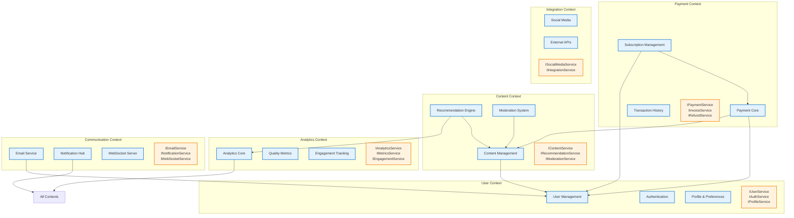

# Service Bounded Contexts and Interface Definitions - Epic 005

**Generated**: 2025-10-26
**Story**: US-E5-002
**Architect**: Lead Engineering Manager

## Executive Summary

This document defines clear bounded contexts and interface contracts for all backend services in the Sovren platform. Each service has well-defined responsibilities, clear boundaries, and explicit interface contracts following Domain-Driven Design (DDD) principles.

## Bounded Context Map



## Service Interface Definitions

### 1. Payment Context Interfaces

#### IPaymentService

```typescript
// packages/backend/src/interfaces/payment/IPaymentService.ts
import { PaymentStatus, PaymentMethod, Currency } from '@/types/payment';

export interface IPaymentService {
  // Invoice Management
  createInvoice(params: CreateInvoiceParams): Promise<Invoice>;
  getInvoice(invoiceId: string): Promise<Invoice | null>;
  cancelInvoice(invoiceId: string): Promise<void>;

  // Payment Processing
  processPayment(params: ProcessPaymentParams): Promise<PaymentResult>;
  verifyPayment(paymentHash: string): Promise<PaymentVerification>;

  // Refunds
  initiateRefund(params: RefundParams): Promise<RefundResult>;

  // Events
  onPaymentReceived(callback: PaymentCallback): void;
  onPaymentFailed(callback: PaymentCallback): void;
}

export interface CreateInvoiceParams {
  userId: string;
  amount: number;
  currency: Currency;
  description?: string;
  expiresIn?: number; // seconds
  metadata?: Record<string, any>;
}

export interface ProcessPaymentParams {
  invoiceId: string;
  paymentRequest: string;
  method: PaymentMethod;
}

export interface PaymentResult {
  success: boolean;
  transactionId?: string;
  error?: string;
  timestamp: Date;
}

export interface PaymentVerification {
  valid: boolean;
  paymentHash: string;
  preimage?: string;
  amountPaid?: number;
  confirmedAt?: Date;
}

export type PaymentCallback = (event: PaymentEvent) => void | Promise<void>;
```

#### ISubscriptionService

```typescript
// packages/backend/src/interfaces/payment/ISubscriptionService.ts
export interface ISubscriptionService {
  // Subscription Management
  createSubscription(params: CreateSubscriptionParams): Promise<Subscription>;
  cancelSubscription(subscriptionId: string): Promise<void>;
  pauseSubscription(subscriptionId: string): Promise<void>;
  resumeSubscription(subscriptionId: string): Promise<void>;

  // Subscription Queries
  getSubscription(subscriptionId: string): Promise<Subscription | null>;
  getUserSubscriptions(userId: string): Promise<Subscription[]>;
  getActiveSubscriptions(): Promise<Subscription[]>;

  // Billing
  processRecurringPayment(subscriptionId: string): Promise<PaymentResult>;
  updatePaymentMethod(subscriptionId: string, method: PaymentMethod): Promise<void>;

  // Events
  onSubscriptionCreated(callback: SubscriptionCallback): void;
  onSubscriptionCancelled(callback: SubscriptionCallback): void;
  onPaymentFailed(callback: SubscriptionCallback): void;
}

export interface CreateSubscriptionParams {
  userId: string;
  planId: string;
  paymentMethod: PaymentMethod;
  startDate?: Date;
  trialDays?: number;
}

export interface Subscription {
  id: string;
  userId: string;
  planId: string;
  status: SubscriptionStatus;
  currentPeriodStart: Date;
  currentPeriodEnd: Date;
  cancelledAt?: Date;
  trialEndsAt?: Date;
}

export type SubscriptionStatus = 'active' | 'paused' | 'cancelled' | 'expired' | 'trial';
```

### 2. Content Context Interfaces

#### IContentService

```typescript
// packages/backend/src/interfaces/content/IContentService.ts
export interface IContentService {
  // Content CRUD
  createContent(params: CreateContentParams): Promise<Content>;
  updateContent(contentId: string, updates: ContentUpdates): Promise<Content>;
  deleteContent(contentId: string): Promise<void>;
  publishContent(contentId: string): Promise<void>;

  // Content Queries
  getContent(contentId: string): Promise<Content | null>;
  getContentBySlug(slug: string): Promise<Content | null>;
  searchContent(query: SearchParams): Promise<ContentSearchResult>;

  // Content Management
  addContentBlock(contentId: string, block: ContentBlock): Promise<void>;
  removeContentBlock(contentId: string, blockId: string): Promise<void>;
  reorderContentBlocks(contentId: string, blockIds: string[]): Promise<void>;

  // Events
  onContentPublished(callback: ContentCallback): void;
  onContentDeleted(callback: ContentCallback): void;
}

export interface CreateContentParams {
  title: string;
  type: ContentType;
  authorId: string;
  blocks?: ContentBlock[];
  tags?: string[];
  isPremium?: boolean;
  price?: number;
}

export interface Content {
  id: string;
  title: string;
  slug: string;
  type: ContentType;
  status: ContentStatus;
  authorId: string;
  blocks: ContentBlock[];
  publishedAt?: Date;
  viewCount: number;
  metadata: ContentMetadata;
}

export type ContentType = 'article' | 'video' | 'audio' | 'course' | 'ebook';
export type ContentStatus = 'draft' | 'published' | 'archived' | 'deleted';
```

#### IRecommendationService

```typescript
// packages/backend/src/interfaces/content/IRecommendationService.ts
export interface IRecommendationService {
  // Recommendations
  getRecommendationsForUser(
    userId: string,
    options?: RecommendationOptions
  ): Promise<Recommendation[]>;
  getRecommendationsForContent(
    contentId: string,
    options?: RecommendationOptions
  ): Promise<Recommendation[]>;
  getSimilarCreators(creatorId: string, limit?: number): Promise<CreatorRecommendation[]>;

  // Training & Feedback
  recordInteraction(interaction: UserInteraction): Promise<void>;
  updateUserPreferences(userId: string, preferences: UserPreferences): Promise<void>;

  // Analytics
  getRecommendationPerformance(timeRange: TimeRange): Promise<PerformanceMetrics>;
}

export interface RecommendationOptions {
  limit?: number;
  excludeViewed?: boolean;
  contentTypes?: ContentType[];
  minScore?: number;
}

export interface Recommendation {
  contentId: string;
  score: number;
  reason: string;
  metadata?: Record<string, any>;
}
```

### 3. User Context Interfaces

#### IUserService

```typescript
// packages/backend/src/interfaces/user/IUserService.ts
export interface IUserService {
  // User Management
  createUser(params: CreateUserParams): Promise<User>;
  updateUser(userId: string, updates: UserUpdates): Promise<User>;
  deleteUser(userId: string): Promise<void>;

  // User Queries
  getUser(userId: string): Promise<User | null>;
  getUserByEmail(email: string): Promise<User | null>;
  getUserByNostrPubkey(pubkey: string): Promise<User | null>;
  searchUsers(query: string): Promise<User[]>;

  // Profile Management
  updateProfile(userId: string, profile: ProfileUpdates): Promise<UserProfile>;
  updatePreferences(userId: string, preferences: UserPreferences): Promise<void>;

  // Events
  onUserCreated(callback: UserCallback): void;
  onUserDeleted(callback: UserCallback): void;
}

export interface User {
  id: string;
  email?: string;
  nostrPubkey?: string;
  username: string;
  profile: UserProfile;
  preferences: UserPreferences;
  createdAt: Date;
  updatedAt: Date;
}

export interface UserProfile {
  displayName: string;
  bio?: string;
  avatar?: string;
  banner?: string;
  links?: ProfileLink[];
  verified: boolean;
}
```

#### IAuthService

```typescript
// packages/backend/src/interfaces/user/IAuthService.ts
export interface IAuthService {
  // Authentication
  authenticate(credentials: AuthCredentials): Promise<AuthResult>;
  verifyToken(token: string): Promise<TokenVerification>;
  refreshToken(refreshToken: string): Promise<AuthTokens>;

  // Session Management
  createSession(userId: string, metadata?: SessionMetadata): Promise<Session>;
  getSession(sessionId: string): Promise<Session | null>;
  invalidateSession(sessionId: string): Promise<void>;

  // NOSTR Authentication
  verifyNostrSignature(event: NostrEvent): Promise<boolean>;
  generateChallenge(pubkey: string): Promise<string>;

  // Events
  onLogin(callback: AuthCallback): void;
  onLogout(callback: AuthCallback): void;
}

export interface AuthCredentials {
  type: 'email' | 'nostr' | 'lightning';
  identifier: string;
  proof: string; // password, signature, etc.
}

export interface AuthResult {
  success: boolean;
  userId?: string;
  tokens?: AuthTokens;
  error?: string;
}

export interface Session {
  id: string;
  userId: string;
  expiresAt: Date;
  metadata: SessionMetadata;
}
```

### 4. Analytics Context Interfaces

#### IAnalyticsService

```typescript
// packages/backend/src/interfaces/analytics/IAnalyticsService.ts
export interface IAnalyticsService {
  // Event Tracking
  trackEvent(event: AnalyticsEvent): Promise<void>;
  trackPageView(pageView: PageViewEvent): Promise<void>;
  trackUserAction(action: UserActionEvent): Promise<void>;

  // Metrics Queries
  getMetrics(query: MetricsQuery): Promise<MetricsResult>;
  getUserMetrics(userId: string, timeRange: TimeRange): Promise<UserMetrics>;
  getContentMetrics(contentId: string, timeRange: TimeRange): Promise<ContentMetrics>;

  // Real-time Analytics
  subscribeToMetrics(metric: MetricType, callback: MetricsCallback): void;
  unsubscribeFromMetrics(subscriptionId: string): void;
}

export interface AnalyticsEvent {
  type: string;
  userId?: string;
  properties?: Record<string, any>;
  timestamp?: Date;
}

export interface MetricsQuery {
  metrics: MetricType[];
  dimensions?: string[];
  filters?: MetricFilter[];
  timeRange: TimeRange;
  granularity?: 'minute' | 'hour' | 'day' | 'week' | 'month';
}
```

### 5. Communication Context Interfaces

#### INotificationService

```typescript
// packages/backend/src/interfaces/communication/INotificationService.ts
export interface INotificationService {
  // Notification Management
  sendNotification(notification: NotificationRequest): Promise<NotificationResult>;
  sendBulkNotifications(notifications: NotificationRequest[]): Promise<BulkNotificationResult>;

  // Template Management
  registerTemplate(template: NotificationTemplate): Promise<void>;
  sendTemplatedNotification(params: TemplatedNotificationParams): Promise<NotificationResult>;

  // User Preferences
  getUserNotificationPreferences(userId: string): Promise<NotificationPreferences>;
  updateNotificationPreferences(userId: string, prefs: NotificationPreferences): Promise<void>;

  // Delivery Status
  getNotificationStatus(notificationId: string): Promise<NotificationStatus>;
  markAsRead(notificationId: string): Promise<void>;
}

export interface NotificationRequest {
  userId: string;
  type: NotificationType;
  channel: NotificationChannel;
  title: string;
  message: string;
  data?: Record<string, any>;
  priority?: 'low' | 'normal' | 'high' | 'urgent';
}

export type NotificationType = 'payment' | 'content' | 'social' | 'system';
export type NotificationChannel = 'email' | 'push' | 'in-app' | 'nostr';
```

#### IEmailService

```typescript
// packages/backend/src/interfaces/communication/IEmailService.ts
export interface IEmailService {
  // Email Sending
  sendEmail(email: EmailRequest): Promise<EmailResult>;
  sendBulkEmails(emails: EmailRequest[]): Promise<BulkEmailResult>;

  // Template Management
  sendTemplatedEmail(params: TemplatedEmailParams): Promise<EmailResult>;
  previewTemplate(templateId: string, data: Record<string, any>): Promise<string>;

  // Bounce & Complaint Handling
  processBounce(bounce: BounceEvent): Promise<void>;
  processComplaint(complaint: ComplaintEvent): Promise<void>;

  // Unsubscribe Management
  unsubscribeUser(email: string, category?: string): Promise<void>;
  getUnsubscribeStatus(email: string): Promise<UnsubscribeStatus>;
}

export interface EmailRequest {
  to: string | string[];
  from?: string;
  subject: string;
  html?: string;
  text?: string;
  attachments?: Attachment[];
  headers?: Record<string, string>;
}
```

#### IWebSocketService

```typescript
// packages/backend/src/interfaces/communication/IWebSocketService.ts
export interface IWebSocketService {
  // Connection Management
  handleConnection(socket: WebSocket, userId?: string): void;
  closeConnection(socketId: string): void;

  // Message Broadcasting
  broadcast(message: WebSocketMessage): void;
  sendToUser(userId: string, message: WebSocketMessage): void;
  sendToRoom(roomId: string, message: WebSocketMessage): void;

  // Room Management
  joinRoom(socketId: string, roomId: string): void;
  leaveRoom(socketId: string, roomId: string): void;

  // Events
  onMessage(callback: MessageCallback): void;
  onConnection(callback: ConnectionCallback): void;
  onDisconnection(callback: ConnectionCallback): void;
}

export interface WebSocketMessage {
  type: string;
  payload: any;
  timestamp?: Date;
}
```

## Service Dependencies Rules

### Allowed Dependencies

1. **Payment Context**
   - ✅ Can depend on: User Context, Analytics Context, Communication Context
   - ❌ Cannot depend on: Content Context

2. **Content Context**
   - ✅ Can depend on: User Context, Analytics Context
   - ❌ Cannot depend on: Payment Context

3. **User Context**
   - ✅ Can depend on: Communication Context
   - ❌ Cannot depend on: Payment, Content, Analytics

4. **Analytics Context**
   - ✅ Can depend on: None (leaf context)
   - ❌ Cannot depend on: Any business context

5. **Communication Context**
   - ✅ Can depend on: None (leaf context)
   - ❌ Cannot depend on: Any business context

### Anti-Corruption Layer

Each bounded context will implement an Anti-Corruption Layer (ACL) to:

- Translate external models to internal domain models
- Validate incoming data
- Handle versioning and backward compatibility
- Prevent domain model leakage

```typescript
// Example ACL Implementation
export class PaymentContextACL {
  constructor(
    private userService: IUserService,
    private analyticsService: IAnalyticsService
  ) {}

  async translateUserToPaymentCustomer(userId: string): Promise<PaymentCustomer> {
    const user = await this.userService.getUser(userId);
    if (!user) throw new Error('User not found');

    return {
      customerId: user.id,
      email: user.email,
      paymentMethods: [], // Load from payment context
      billingAddress: this.extractBillingAddress(user.profile),
    };
  }
}
```

## Event-Driven Communication

### Domain Events

Each bounded context publishes domain events for cross-context communication:

```typescript
// Domain Event Types
export enum DomainEventType {
  // Payment Events
  PAYMENT_RECEIVED = 'payment.received',
  PAYMENT_FAILED = 'payment.failed',
  SUBSCRIPTION_CREATED = 'subscription.created',
  SUBSCRIPTION_CANCELLED = 'subscription.cancelled',

  // Content Events
  CONTENT_PUBLISHED = 'content.published',
  CONTENT_DELETED = 'content.deleted',
  CONTENT_MONETIZED = 'content.monetized',

  // User Events
  USER_REGISTERED = 'user.registered',
  USER_VERIFIED = 'user.verified',
  USER_DELETED = 'user.deleted',

  // Analytics Events
  METRIC_THRESHOLD_REACHED = 'metric.threshold.reached',
  ANOMALY_DETECTED = 'anomaly.detected',
}

// Base Domain Event
export interface DomainEvent {
  id: string;
  type: DomainEventType;
  aggregateId: string;
  payload: any;
  metadata: {
    userId?: string;
    timestamp: Date;
    version: string;
    correlationId?: string;
  };
}
```

### Event Bus Interface

```typescript
// packages/backend/src/interfaces/shared/IEventBus.ts
export interface IEventBus {
  // Publishing
  publish(event: DomainEvent): Promise<void>;
  publishBatch(events: DomainEvent[]): Promise<void>;

  // Subscribing
  subscribe(eventType: DomainEventType, handler: EventHandler): string;
  subscribeToAll(handler: EventHandler): string;
  unsubscribe(subscriptionId: string): void;

  // Replay
  replayEvents(from: Date, to: Date, filter?: EventFilter): Promise<DomainEvent[]>;
}

export type EventHandler = (event: DomainEvent) => void | Promise<void>;
```

## Service Registry Interface

```typescript
// packages/backend/src/interfaces/shared/IServiceRegistry.ts
export interface IServiceRegistry {
  // Registration
  register<T>(token: ServiceToken<T>, implementation: T): void;
  registerSingleton<T>(token: ServiceToken<T>, factory: () => T): void;
  registerScoped<T>(token: ServiceToken<T>, factory: () => T): void;

  // Resolution
  resolve<T>(token: ServiceToken<T>): T;
  resolveOptional<T>(token: ServiceToken<T>): T | null;

  // Lifecycle
  dispose(): Promise<void>;
}

export class ServiceToken<T> {
  constructor(public readonly name: string) {}
}

// Service Tokens
export const TOKENS = {
  PaymentService: new ServiceToken<IPaymentService>('PaymentService'),
  SubscriptionService: new ServiceToken<ISubscriptionService>('SubscriptionService'),
  ContentService: new ServiceToken<IContentService>('ContentService'),
  UserService: new ServiceToken<IUserService>('UserService'),
  AuthService: new ServiceToken<IAuthService>('AuthService'),
  AnalyticsService: new ServiceToken<IAnalyticsService>('AnalyticsService'),
  NotificationService: new ServiceToken<INotificationService>('NotificationService'),
  EmailService: new ServiceToken<IEmailService>('EmailService'),
  WebSocketService: new ServiceToken<IWebSocketService>('WebSocketService'),
  EventBus: new ServiceToken<IEventBus>('EventBus'),
};
```

## Implementation Guidelines

### 1. Interface Segregation

Each interface should:

- Be focused on a single responsibility
- Contain 5-10 methods maximum
- Use clear, descriptive method names
- Return promises for async operations

### 2. Dependency Injection

All services must:

- Depend on interfaces, not implementations
- Receive dependencies through constructor injection
- Register with the service registry
- Support multiple implementations

### 3. Error Handling

Services should:

- Throw domain-specific exceptions
- Include error codes for client handling
- Log errors with appropriate context
- Provide fallback mechanisms

### 4. Testing

Each service requires:

- Unit tests with mocked dependencies
- Integration tests for boundary interactions
- Contract tests for interface compliance
- Performance tests for SLA validation

## Migration Path

### Phase 1: Interface Definition (Current)

- ✅ Define all service interfaces
- ✅ Create bounded context documentation
- ⏳ Review with team

### Phase 2: Implementation Adapters

- Create adapter classes for existing services
- Implement interface compliance
- Add missing methods as stubs

### Phase 3: Service Extraction

- Extract services one context at a time
- Start with leaf contexts (Analytics, Communication)
- Payment context last (highest risk)

### Phase 4: Event Bus Integration

- Implement domain events
- Replace direct calls with events
- Add event replay capability

### Phase 5: Cleanup

- Remove old service implementations
- Update all imports
- Final testing and validation

## Success Metrics

- ✅ 100% interface coverage
- ✅ Zero circular dependencies
- ✅ All contexts clearly bounded
- ✅ Event-driven communication established
- ✅ Full DI container adoption

---

**Document Status**: ✅ COMPLETE
**Next Step**: Proceed to Story #3 - Design DI Container Structure
**Blocks**: Stories #7-42 (all service implementations)
