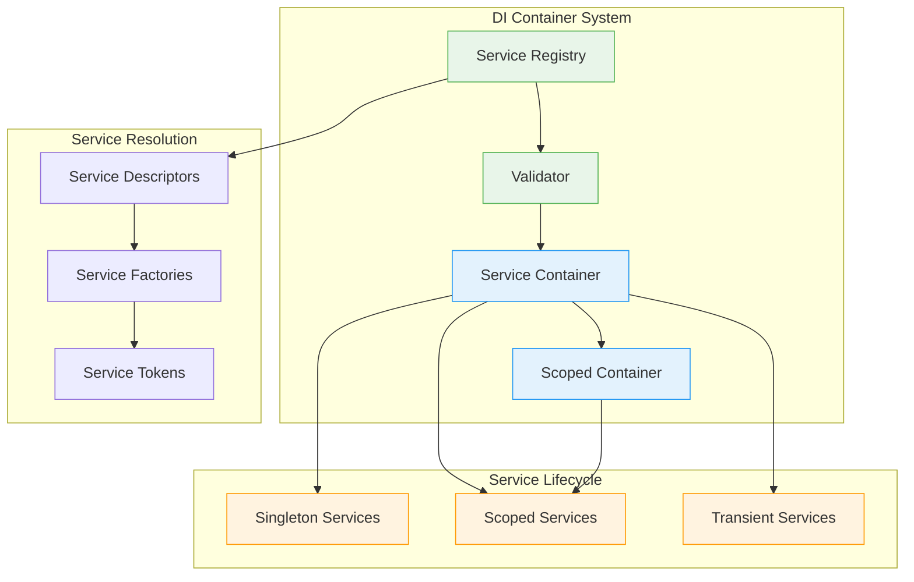
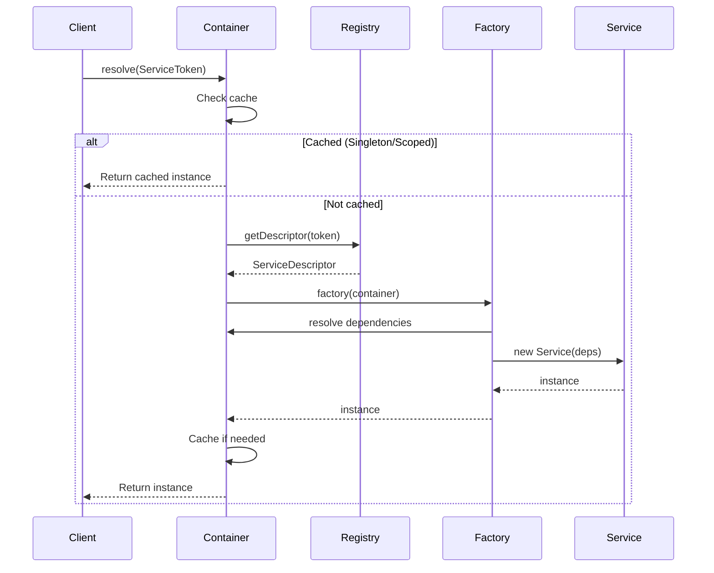
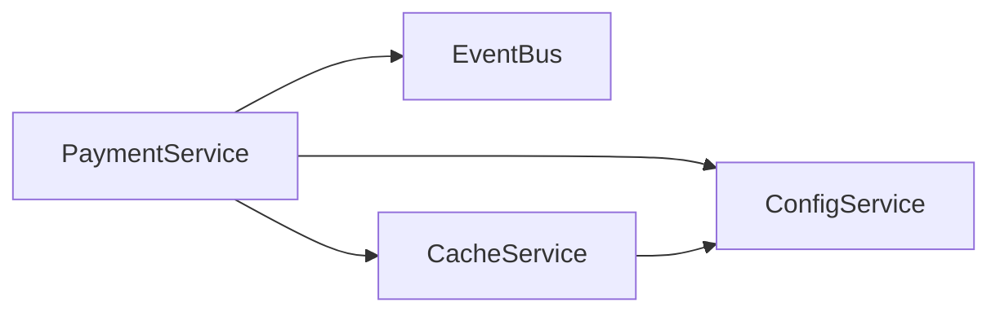

# Dependency Injection Container Design - Epic 005

**Generated**: 2025-10-26
**Story**: US-E5-003
**Architect**: Lead Engineering Manager

## Executive Summary

This document outlines the design and implementation of a type-safe, lifecycle-aware dependency injection container for the Sovren backend. The container provides centralized service management, automatic dependency resolution, and proper lifecycle management for all backend services.

## Container Architecture



## Core Components

### 1. Service Token

Type-safe service identifiers with metadata:

```typescript
export class ServiceToken<T> {
  constructor(
    public readonly name: string,
    public readonly description?: string
  ) {}
}

// Usage
const PaymentServiceToken = new ServiceToken<IPaymentService>('IPaymentService');
```

### 2. Service Registry

Central registration point for all services:

```typescript
interface IServiceRegistry {
  // Registration methods
  registerSingleton<T>(token: ServiceToken<T>, implementation: T): void;
  registerSingletonFactory<T>(token: ServiceToken<T>, factory: ServiceFactory<T>): void;
  registerScoped<T>(token: ServiceToken<T>, factory: ServiceFactory<T>): void;
  registerTransient<T>(token: ServiceToken<T>, factory: ServiceFactory<T>): void;

  // Validation
  validate(): ValidationResult;
  getDependencyGraph(): DependencyGraph;
}
```

### 3. Service Container

Runtime dependency resolver with lifecycle management:

```typescript
interface IServiceContainer {
  resolve<T>(token: ServiceToken<T>): T;
  resolveAsync<T>(token: ServiceToken<T>): Promise<T>;
  createScope(): IServiceContainer;
  dispose(): Promise<void>;
}
```

## Service Lifecycles

### Singleton (Application-wide)

- **Created**: Once per application
- **Shared**: Across all requests and scopes
- **Disposed**: When application shuts down
- **Use Cases**: Database connections, configuration, caches

```typescript
registry.registerSingleton(ServiceTokens.ConfigService, configInstance);
registry.registerSingletonFactory(
  ServiceTokens.DatabaseService,
  (container) => new DatabaseService(container.resolve(ServiceTokens.ConfigService))
);
```

### Scoped (Request/Context-specific)

- **Created**: Once per scope (e.g., HTTP request)
- **Shared**: Within the same scope
- **Disposed**: When scope ends
- **Use Cases**: Database transactions, request context, user sessions

```typescript
registry.registerScoped(
  ServiceTokens.TransactionService,
  (container) => new TransactionService(container.resolve(ServiceTokens.DatabaseService))
);
```

### Transient (New instance always)

- **Created**: Every time it's requested
- **Shared**: Never
- **Disposed**: By garbage collector
- **Use Cases**: Stateless utilities, temporary objects

```typescript
registry.registerTransient(ServiceTokens.EmailBuilder, (container) => new EmailBuilder());
```

## Dependency Resolution

### Resolution Flow



### Circular Dependency Detection

The container validates the dependency graph at startup:

```typescript
const validation = registry.validate();
if (!validation.valid) {
  // Reports circular dependencies
  // Reports missing dependencies
  throw new Error('Container validation failed');
}
```

## Service Modules

Grouping related service registrations:

```typescript
export class PaymentModule implements IServiceModule {
  name = 'PaymentModule';

  register(registry: IServiceRegistry): void {
    // Register payment services
    registry.registerSingleton(
      ServiceTokens.PaymentService,
      (container) =>
        new LightningPaymentService(
          container.resolve(ServiceTokens.ConfigService),
          container.resolve(ServiceTokens.EventBus)
        )
    );

    registry.registerScoped(
      ServiceTokens.InvoiceService,
      (container) => new InvoiceService(container.resolve(ServiceTokens.PaymentService))
    );

    registry.registerScoped(
      ServiceTokens.SubscriptionService,
      (container) =>
        new SubscriptionService(
          container.resolve(ServiceTokens.PaymentService),
          container.resolve(ServiceTokens.UserService)
        )
    );
  }
}

// Usage
const registry = new ServiceRegistry();
registry.registerModule(new PaymentModule());
registry.registerModule(new ContentModule());
registry.registerModule(new UserModule());
```

## Container Bootstrap

### Application Startup

```typescript
// src/container/bootstrap.ts
import { bootstrapContainer } from './ServiceContainer';
import { PaymentModule } from './modules/PaymentModule';
import { ContentModule } from './modules/ContentModule';
import { UserModule } from './modules/UserModule';

export async function setupDIContainer(): Promise<IServiceContainer> {
  return await bootstrapContainer((registry) => {
    // Register configuration first
    registry.registerSingleton(ServiceTokens.ConfigService, () => new ConfigService(process.env));

    // Register infrastructure
    registry.registerSingleton(ServiceTokens.LoggerService, () => new LoggerService());

    registry.registerSingleton(ServiceTokens.EventBus, () => new EventBus());

    // Register database
    registry.registerSingletonFactory(ServiceTokens.DatabaseService, async (container) => {
      const config = container.resolve(ServiceTokens.ConfigService);
      const db = new DatabaseService(config);
      await db.connect();
      return db;
    });

    // Register cache
    registry.registerSingleton(
      ServiceTokens.CacheService,
      (container) => new RedisCache(container.resolve(ServiceTokens.ConfigService))
    );

    // Register business modules
    registry.registerModule(new PaymentModule());
    registry.registerModule(new ContentModule());
    registry.registerModule(new UserModule());
    registry.registerModule(new AnalyticsModule());
    registry.registerModule(new CommunicationModule());
  });
}
```

### Express Integration

```typescript
// src/server.ts
import express from 'express';
import { setupDIContainer } from './container/bootstrap';

async function startServer() {
  // Setup DI container
  const container = await setupDIContainer();

  const app = express();

  // Middleware to inject container into request
  app.use((req, res, next) => {
    // Create scoped container for request
    req.container = container.createScope();

    // Cleanup after request
    res.on('finish', () => {
      req.container.dispose();
    });

    next();
  });

  // Routes use container
  app.post('/api/payment/invoice', async (req, res) => {
    const paymentService = req.container.resolve(ServiceTokens.PaymentService);
    const result = await paymentService.createInvoice(req.body);
    res.json(result);
  });

  app.listen(3000, () => {
    console.log('Server started with DI container');
  });
}
```

## Testing with DI Container

### Unit Testing with Mocks

```typescript
describe('PaymentService', () => {
  let container: IServiceContainer;
  let registry: ServiceRegistry;

  beforeEach(() => {
    registry = new ServiceRegistry();

    // Register mocks
    registry.registerSingleton(ServiceTokens.EventBus, {
      publish: jest.fn(),
      subscribe: jest.fn(),
    });

    registry.registerSingleton(ServiceTokens.ConfigService, {
      get: jest.fn().mockReturnValue('test-value'),
    });

    // Register service under test
    registry.registerSingleton(
      ServiceTokens.PaymentService,
      (container) =>
        new PaymentService(
          container.resolve(ServiceTokens.ConfigService),
          container.resolve(ServiceTokens.EventBus)
        )
    );

    container = registry.createContainer();
  });

  it('should create invoice', async () => {
    const paymentService = container.resolve(ServiceTokens.PaymentService);
    const invoice = await paymentService.createInvoice({
      userId: 'user123',
      amount: 1000,
    });

    expect(invoice).toBeDefined();
    const eventBus = container.resolve(ServiceTokens.EventBus);
    expect(eventBus.publish).toHaveBeenCalled();
  });
});
```

### Integration Testing

```typescript
describe('Payment Integration', () => {
  let container: IServiceContainer;

  beforeAll(async () => {
    container = await bootstrapContainer((registry) => {
      // Use test configuration
      registry.registerSingleton(ServiceTokens.ConfigService,
        () => new ConfigService({ NODE_ENV: 'test' })
      );

      // Register real services
      registry.registerModule(new PaymentModule());
    });
  });

  afterAll(async () => {
    await container.dispose();
  });

  it('should process payment end-to-end', async () => {
    const scope = container.createScope();

    const paymentService = scope.resolve(ServiceTokens.PaymentService);
    const invoice = await paymentService.createInvoice({...});

    expect(invoice.status).toBe('pending');

    await scope.dispose();
  });
});
```

## Dependency Graph Visualization

The container can generate a dependency graph for visualization:

```typescript
const graph = registry.getDependencyGraph();

// Convert to Mermaid diagram
function toMermaid(graph: DependencyGraph): string {
  let mermaid = 'graph LR\n';

  for (const node of graph.nodes) {
    mermaid += `  ${node.id}[${node.token}]\n`;
  }

  for (const edge of graph.edges) {
    mermaid += `  ${edge.from} --> ${edge.to}\n`;
  }

  return mermaid;
}
```

Example output:



## Migration Strategy

### Phase 1: Adapter Pattern

Create adapters for existing services:

```typescript
class PaymentServiceAdapter implements IPaymentService {
  private legacyService: LegacyPaymentService;

  constructor(container: IServiceContainer) {
    // Use legacy service internally
    this.legacyService = new LegacyPaymentService();
  }

  async createInvoice(params: CreateInvoiceParams): Promise<Invoice> {
    // Adapt legacy method
    return this.legacyService.generateInvoice(params);
  }
}
```

### Phase 2: Gradual Migration

1. Register adapters in container
2. Update routes to use container
3. Refactor services one by one
4. Remove legacy code

### Phase 3: Full DI Adoption

- All services use constructor injection
- No service creates its own dependencies
- All cross-cutting concerns handled by container

## Best Practices

### DO's

- ✅ Use constructor injection exclusively
- ✅ Depend on interfaces, not implementations
- ✅ Register services in modules
- ✅ Validate container at startup
- ✅ Use appropriate lifecycles
- ✅ Dispose resources properly

### DON'Ts

- ❌ Don't use service locator pattern
- ❌ Don't create dependencies manually
- ❌ Don't register implementations directly
- ❌ Don't mix lifecycles inappropriately
- ❌ Don't forget to dispose scoped containers

## Performance Considerations

### Singleton Caching

- Singletons resolved once, cached forever
- Zero overhead after first resolution

### Scoped Caching

- Scoped instances cached per request
- Automatic cleanup on scope disposal

### Async Resolution

- Support for async factory functions
- Parallel resolution where possible

### Memory Management

- Proper disposal of resources
- Weak references for transient services
- Scope isolation prevents memory leaks

## Monitoring & Debugging

### Container Metrics

```typescript
interface ContainerMetrics {
  totalRegistrations: number;
  singletonCount: number;
  scopedCount: number;
  transientCount: number;
  resolutionTime: Map<string, number>;
  resolutionCount: Map<string, number>;
}
```

### Debug Mode

```typescript
if (process.env.NODE_ENV === 'development') {
  container.enableDebugMode();
  // Logs all resolutions
  // Tracks resolution times
  // Validates on every resolution
}
```

## Success Metrics

- ✅ All 31 services registered in container
- ✅ Zero circular dependencies
- ✅ 100% type safety
- ✅ All services properly scoped
- ✅ Startup validation passing
- ✅ Integration tests using container

---

**Document Status**: ✅ COMPLETE
**Implementation Status**: ✅ COMPLETE
**Files Created**:

- `/packages/backend/src/interfaces/shared/IServiceRegistry.ts`
- `/packages/backend/src/container/ServiceContainer.ts`
- `/docs/refactoring/di-container-design.md`

**Next Step**: Proceed to Story #4 - Create Service Factory Pattern
**Blocks**: Stories #7-42 (all service implementations)
