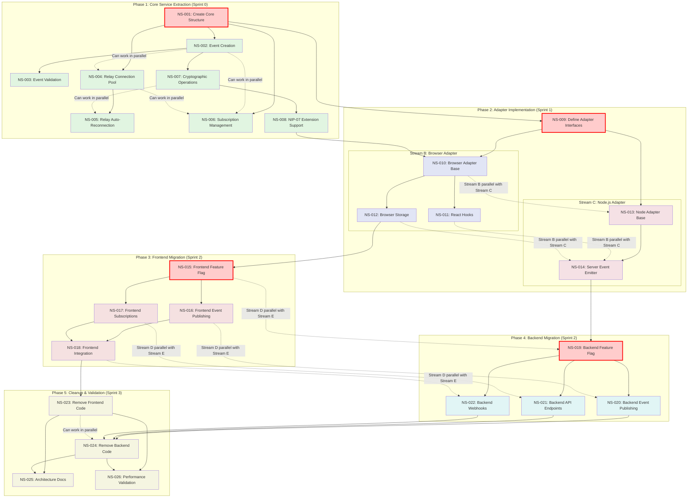
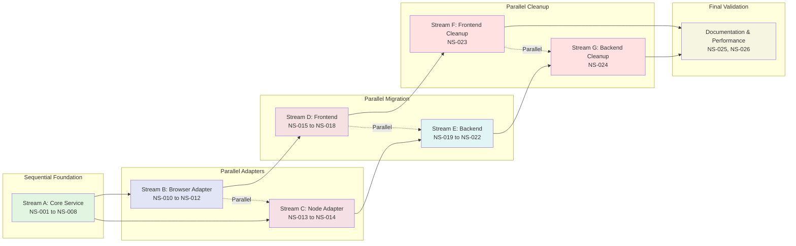
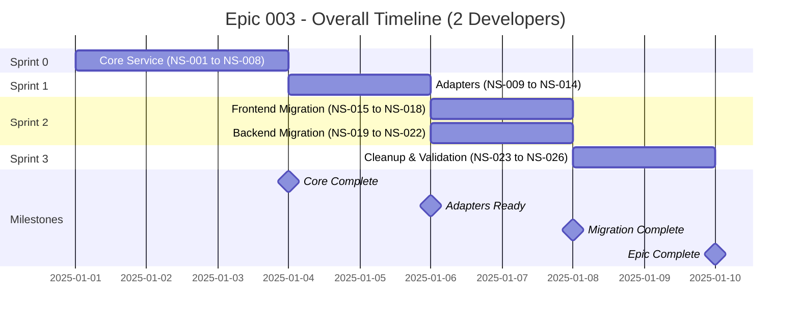

# Epic 003: NOSTR Service Consolidation - Dependency Diagram

## Story Dependency Graph

This diagram shows the dependencies between all 26 user stories, illustrating the critical path and parallel work opportunities.



## Critical Path Analysis

The **critical path** (highlighted in red) represents the minimum time to complete the epic:

```
NS-001 (2h) → NS-009 (2h) → NS-010 (3h) → NS-012 (3h) → NS-015 (2h) → NS-018 (4h) → NS-023 (2h) → NS-026 (4h)
```

**Total Critical Path Duration**: 22 hours (~3 days with single developer)

With 2 developers working in parallel, actual duration can be reduced to **6-9 days**.

## Work Stream Dependencies



## Parallel Work Opportunities

### Sprint 0: Core Service (Phase 1)

```mermaid
gantt
    title Phase 1 - Core Service Extraction
    dateFormat HH:mm
    axisFormat %H:%M

    section Developer 1
    NS-001 Structure       :a1, 00:00, 2h
    NS-002 Event Creation  :a2, after a1, 3h
    NS-003 Event Validation:a3, after a2, 3h
    NS-007 Cryptography    :a7, after a3, 4h
    NS-008 NIP-07          :a8, after a7, 2h

    section Developer 2
    Wait for NS-001        :crit, b1, 00:00, 2h
    NS-004 Relay Pool      :b4, after b1, 4h
    NS-005 Auto-Reconnect  :b5, after b4, 3h
    NS-006 Subscriptions   :b6, after b5, 4h
```



**Parallel Opportunities**:

- After NS-001 (2h), both developers can work simultaneously
- Dev 1: Event-related stories (NS-002, NS-003, NS-007, NS-008)
- Dev 2: Network-related stories (NS-004, NS-005, NS-006)

### Sprint 1: Adapters (Phase 2)

```mermaid
gantt
    title Phase 2 - Adapter Implementation
    dateFormat HH:mm
    axisFormat %H:%M

    section Shared
    NS-009 Interfaces      :crit, a9, 00:00, 2h

    section Developer 1 (Browser)
    Wait for NS-009        :b10, 00:00, 2h
    NS-010 Browser Base    :b11, after b10, 3h
    NS-011 React Hooks     :b12, after b11, 4h
    NS-012 Storage         :b13, after b12, 3h

    section Developer 2 (Node)
    Wait for NS-009        :c10, 00:00, 2h
    NS-013 Node Base       :c13, after c10, 3h
    NS-014 Event Emitter   :c14, after c13, 3h
    Free Time              :c15, after c14, 4h
```



**Parallel Opportunities**:

- After NS-009 (2h), Streams B and C are **fully independent**
- Dev 1: Browser adapter (10h total)
- Dev 2: Node adapter (6h total, can help with testing)

### Sprint 2: Migration (Phases 3 & 4)

```mermaid
gantt
    title Phases 3 & 4 - Frontend and Backend Migration
    dateFormat HH:mm
    axisFormat %H:%M

    section Developer 1 (Frontend - Stream D)
    NS-015 Feature Flag    :d15, 00:00, 2h
    NS-016 Event Publish   :d16, after d15, 3h
    NS-017 Subscriptions   :d17, after d15, 3h
    NS-018 Integration     :d18, after d16 d17, 4h

    section Developer 2 (Backend - Stream E)
    NS-019 Feature Flag    :e19, 00:00, 2h
    NS-020 Event Publish   :e20, after e19, 3h
    NS-021 API Endpoints   :e21, after e19, 3h
    NS-022 Webhooks        :e22, after e19, 4h
```



**Parallel Opportunities**:

- Streams D and E are **completely independent**
- Dev 1: Frontend migration (12h)
- Dev 2: Backend migration (12h)
- Both work simultaneously, maximum parallelization

### Sprint 3: Cleanup (Phase 5)

```mermaid
gantt
    title Phase 5 - Cleanup and Validation
    dateFormat HH:mm
    axisFormat %H:%M

    section Developer 1
    NS-023 Frontend Cleanup :f23, 00:00, 2h
    NS-025 Documentation    :f25, after f23, 3h

    section Developer 2
    NS-024 Backend Cleanup  :g24, 00:00, 2h
    NS-026 Performance      :g26, after g24, 4h
```



**Parallel Opportunities**:

- NS-023 and NS-024 can be done simultaneously
- Documentation can start alongside cleanup
- Performance validation is final step

## Dependency Chains

### Event Management Chain

```
NS-001 → NS-002 → NS-003 → NS-007 → NS-008 → NS-010 → NS-011 → NS-015 → NS-016
```

### Relay Management Chain

```
NS-001 → NS-004 → NS-005 → NS-010 → NS-015 → NS-016
```

### Subscription Chain

```
NS-001 → NS-006 → NS-010 → NS-011 → NS-015 → NS-017 → NS-018
```

### Backend Chain

```
NS-001 → NS-009 → NS-013 → NS-014 → NS-019 → NS-020/NS-021/NS-022 → NS-024
```

## Blocking Relationships

### NS-001 Blocks (Foundation)

- NS-002, NS-004, NS-006, NS-009
- **Impact**: Blocks everything
- **Priority**: CRITICAL - must complete first

### NS-009 Blocks (Interfaces)

- NS-010, NS-013
- **Impact**: Blocks all adapter work
- **Priority**: HIGH - complete early in Sprint 1

### NS-015 & NS-019 Block (Feature Flags)

- NS-015 blocks: NS-016, NS-017, NS-018
- NS-019 blocks: NS-020, NS-021, NS-022
- **Impact**: Blocks migration phases
- **Priority**: HIGH - complete early in Sprint 2

### NS-018 & NS-022 Block (Migration Complete)

- NS-018 blocks: NS-023
- NS-020, NS-021, NS-022 block: NS-024
- **Impact**: Blocks cleanup phase
- **Priority**: MEDIUM - natural progression

## Timeline Visualization



**Total Duration**: 9 working days (~2 weeks)

## Resource Allocation

| Sprint   | Dev 1 Focus            | Dev 2 Focus           | Parallel?               |
| -------- | ---------------------- | --------------------- | ----------------------- |
| Sprint 0 | Events, Crypto         | Relays, Subscriptions | ✅ Yes (after NS-001)   |
| Sprint 1 | Browser Adapter        | Node.js Adapter       | ✅ Yes (after NS-009)   |
| Sprint 2 | Frontend Migration     | Backend Migration     | ✅ Yes (fully parallel) |
| Sprint 3 | Frontend Cleanup, Docs | Backend Cleanup, Perf | ✅ Yes (parallel)       |

## Risk Assessment by Dependency

### High Risk (Blocks Many Stories)

- **NS-001**: Blocks 4 immediate stories, entire epic depends on it
- **NS-009**: Blocks both adapter streams
- **NS-004**: Relay management is critical functionality

### Medium Risk (Blocks Phase)

- **NS-015**: Blocks frontend migration
- **NS-019**: Blocks backend migration
- **NS-010**: Blocks React hooks implementation

### Low Risk (Few Dependencies)

- **NS-005**: Only blocks itself from completion
- **NS-011**: Only blocks frontend migration stories
- **NS-025, NS-026**: Final stories, don't block anything

## Optimization Opportunities

1. **NS-002 and NS-004 can start in parallel** after NS-001
2. **Streams B and C fully parallel** in Sprint 1
3. **Streams D and E fully parallel** in Sprint 2
4. **NS-016 and NS-017 can partially overlap** (different components)
5. **NS-020, NS-021, NS-022 can partially overlap** (different controllers)

## Recommendations

1. **Complete NS-001 ASAP**: Unblocks most work
2. **Pair on NS-009**: Critical interface design, get it right
3. **Sprint 1 & 2 maximize parallelization**: Two independent streams
4. **Don't skip NS-015/NS-019**: Feature flags are safety net
5. **NS-026 is validation gate**: Don't merge cleanup until validated
