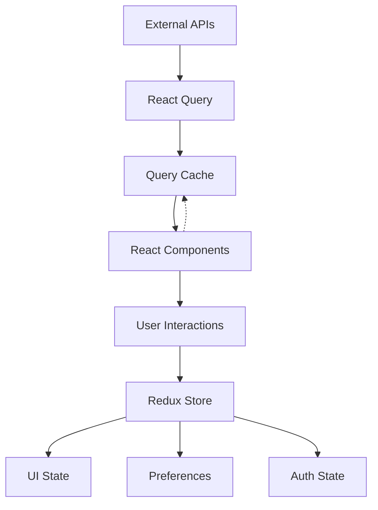

# Epic 004: State Management Boundaries - Story Breakdown

## Executive Summary

**Epic**: #004 - State Management Boundaries
**Total Stories**: 25
**Total Story Points**: 25 (1 point per story)
**Estimated Duration**: 10-12 days with 2-3 developers
**Parallel Work Streams**: 4

## Story Organization by Phase

---

## Phase 1: Audit & Guidelines (Stories 1-5)
**Sprint 0 - Foundation**
**Duration**: 2-3 days
**Dependencies**: Sequential - Must complete before other phases

### Story #001: Audit Redux Store Structure

**As a** technical architect
**I want** to inventory all existing Redux slices and their usage
**So that** I can identify which slices contain server vs client state

#### Acceptance Criteria
- [ ] **Given** the Redux store configuration exists
      **When** I run the audit script
      **Then** it generates a report listing all slices with their state types

- [ ] **Given** each Redux slice in the store
      **When** I analyze its contents
      **Then** I categorize each property as client-state, server-state, or mixed

- [ ] **Given** the audit is complete
      **When** I review the results
      **Then** I have a clear migration list of server data to move to React Query

#### Technical Implementation

**Script Location**: `scripts/audit-redux-store.js`
```javascript
// Analyze each slice and categorize state
const auditResults = {
  authSlice: { type: 'client', properties: ['user', 'token', 'isAuthenticated'] },
  creatorsSlice: { type: 'server', properties: ['list', 'loading', 'error'] },
  uiSlice: { type: 'client', properties: ['theme', 'modals', 'notifications'] }
};
```

**Output File**: `docs/refactoring/epic-004-stories/redux-audit-report.json`

#### Dependencies
**Blocked by**: None
**Blocks**: #002, #003, #004
**Related to**: All migration stories

#### Definition of Done
- [ ] Audit script created and executed
- [ ] JSON report generated with all slices categorized
- [ ] Markdown summary created for team review
- [ ] Identified all server data currently in Redux
- [ ] Identified all client state properly in Redux
- [ ] Report reviewed and approved by tech lead

---

### Story #002: Audit React Query Usage

**As a** technical architect
**I want** to inventory all existing React Query hooks and queries
**So that** I can identify gaps and overlaps with Redux

#### Acceptance Criteria
- [ ] **Given** React Query is used in the codebase
      **When** I run the audit script
      **Then** it lists all query hooks with their cache keys and data types

- [ ] **Given** each React Query hook
      **When** I analyze its usage
      **Then** I identify if it duplicates Redux state

- [ ] **Given** the audit is complete
      **When** I review the results
      **Then** I have a list of queries that need consolidation

#### Technical Implementation

**Script Location**: `scripts/audit-react-query.js`
```javascript
// Find all useQuery, useMutation hooks
const queryHooks = [
  { name: 'useCreators', cacheKey: 'creators', duplicatesRedux: true },
  { name: 'useNostrEvents', cacheKey: 'nostr-events', duplicatesRedux: false }
];
```

**Output File**: `docs/refactoring/epic-004-stories/react-query-audit-report.json`

#### Dependencies
**Blocked by**: None
**Blocks**: #003, #004
**Related to**: #001

#### Definition of Done
- [ ] Audit script created and executed
- [ ] JSON report generated with all queries documented
- [ ] Identified all duplicate state between Redux and React Query
- [ ] Identified missing React Query hooks for server data
- [ ] Report reviewed and approved

---

### Story #003: Create State Management Decision Tree

**As a** developer
**I want** a clear decision tree for choosing Redux vs React Query
**So that** I can make consistent state management decisions

#### Acceptance Criteria
- [ ] **Given** a new feature requiring state
      **When** I consult the decision tree
      **Then** it clearly guides me to use Redux or React Query

- [ ] **Given** edge cases exist
      **When** the decision tree addresses them
      **Then** it provides clear examples and rationale

- [ ] **Given** the decision tree is created
      **When** team reviews it
      **Then** all developers understand and agree with the guidelines

#### Technical Implementation

**File Location**: `docs/refactoring/epic-004-stories/decision-tree.md`
```markdown
# State Management Decision Tree

## Quick Decision Flow
1. Is this data from an API/server? → Use React Query
2. Is this UI presentation state? → Use Redux
3. Does it need to persist? → Use Redux + localStorage
4. Is it shared across components? → Use Redux
5. Is it component-local? → Use useState
```

**Visual Diagram**: `docs/refactoring/epic-004-stories/decision-tree.mmd`

#### Dependencies
**Blocked by**: #001, #002
**Blocks**: #004, #005
**Related to**: All future stories

#### Definition of Done
- [ ] Decision tree document created
- [ ] Mermaid diagram generated
- [ ] Examples provided for each decision path
- [ ] Edge cases documented
- [ ] Team review completed and approved
- [ ] Added to developer documentation

---

### Story #004: Design State Architecture Diagrams

**As a** developer
**I want** visual architecture diagrams showing state boundaries
**So that** I can understand the overall state management architecture

#### Acceptance Criteria
- [ ] **Given** the new architecture design
      **When** I view the diagrams
      **Then** I see clear boundaries between Redux and React Query

- [ ] **Given** data flow patterns
      **When** illustrated in diagrams
      **Then** they show API → React Query → Components flow

- [ ] **Given** the diagrams are complete
      **When** shared with the team
      **Then** everyone understands the target architecture

#### Technical Implementation

**Mermaid Diagrams**: `docs/refactoring/epic-004-stories/architecture-diagrams.mmd`


#### Dependencies
**Blocked by**: #001, #002, #003
**Blocks**: #005
**Related to**: All implementation stories

#### Definition of Done
- [ ] Overall architecture diagram created
- [ ] Data flow diagram created
- [ ] Redux slice organization diagram created
- [ ] React Query structure diagram created
- [ ] Diagrams reviewed and approved
- [ ] PNG versions generated for documentation

---

### Story #005: Team Guidelines Review Session

**As a** development team
**I want** to review and agree on state management guidelines
**So that** we have consensus before implementation begins

#### Acceptance Criteria
- [ ] **Given** all audit reports and guidelines are ready
      **When** team meeting is held
      **Then** all developers attend and provide feedback

- [ ] **Given** feedback is collected
      **When** incorporated into guidelines
      **Then** final version is approved by all team members

- [ ] **Given** guidelines are finalized
      **When** published to team wiki
      **Then** they become the official standard

#### Technical Implementation

**Meeting Agenda**: `docs/refactoring/epic-004-stories/review-meeting-agenda.md`
**Feedback Document**: `docs/refactoring/epic-004-stories/team-feedback.md`
**Final Guidelines**: `docs/refactoring/epic-004-stories/FINAL-GUIDELINES.md`

#### Dependencies
**Blocked by**: #001, #002, #003, #004
**Blocks**: All Phase 2-5 stories
**Related to**: #023, #024, #025

#### Definition of Done
- [ ] Review meeting scheduled and held
- [ ] All team members provided feedback
- [ ] Feedback incorporated into guidelines
- [ ] Final guidelines document created
- [ ] Guidelines published to team wiki
- [ ] Team sign-off obtained

---

## Phase 2: Server Data Migration (Stories 6-12)
**Sprint 1 - Core Migration**
**Duration**: 3-4 days
**Dependencies**: Can parallelize after Phase 1

### Story #006: Create React Query Hooks for Creators

**As a** developer
**I want** React Query hooks for all creator-related server data
**So that** creator data is properly managed as server state

#### Acceptance Criteria
- [ ] **Given** creator APIs exist
      **When** I use useCreators hook
      **Then** it fetches and caches creator list data

- [ ] **Given** individual creator data is needed
      **When** I use useCreatorProfile hook
      **Then** it fetches and caches single creator data

- [ ] **Given** creator data changes
      **When** mutations are performed
      **Then** cache is automatically invalidated and refetched

#### Technical Implementation

**File Location**: `packages/frontend/src/queries/creators/index.ts`
```typescript
export const useCreators = (filters?: CreatorFilters) => {
  return useQuery({
    queryKey: ['creators', filters],
    queryFn: () => api.creators.list(filters),
    staleTime: 5 * 60 * 1000, // 5 minutes
    cacheTime: 10 * 60 * 1000 // 10 minutes
  });
};

export const useCreatorProfile = (creatorId: string) => {
  return useQuery({
    queryKey: ['creator', creatorId],
    queryFn: () => api.creators.get(creatorId),
    enabled: !!creatorId
  });
};

export const useUpdateCreator = () => {
  const queryClient = useQueryClient();
  return useMutation({
    mutationFn: api.creators.update,
    onSuccess: (data, variables) => {
      queryClient.invalidateQueries(['creators']);
      queryClient.invalidateQueries(['creator', variables.id]);
    }
  });
};
```

#### Dependencies
**Blocked by**: #005
**Blocks**: #009
**Related to**: #007, #008
**Parallel with**: #007, #008

#### Definition of Done
- [ ] useCreators hook created with proper caching
- [ ] useCreatorProfile hook created
- [ ] useUpdateCreator mutation hook created
- [ ] useDeleteCreator mutation hook created
- [ ] Optimistic updates implemented
- [ ] Error handling added
- [ ] Unit tests written with 80% coverage
- [ ] Integration tests passing

---

### Story #007: Create React Query Hooks for Content

**As a** developer
**I want** React Query hooks for all content-related server data
**So that** content data is properly managed as server state

#### Acceptance Criteria
- [ ] **Given** content APIs exist
      **When** I use useContent hook
      **Then** it fetches and caches content list with pagination

- [ ] **Given** content streams are needed
      **When** I use useContentStream hook
      **Then** it manages real-time content updates

- [ ] **Given** content is created/updated
      **When** mutations are performed
      **Then** optimistic updates show immediately

#### Technical Implementation

**File Location**: `packages/frontend/src/queries/content/index.ts`
```typescript
export const useContent = (page: number, limit: number) => {
  return useInfiniteQuery({
    queryKey: ['content'],
    queryFn: ({ pageParam = 1 }) => api.content.list({ page: pageParam, limit }),
    getNextPageParam: (lastPage) => lastPage.hasMore ? lastPage.page + 1 : undefined,
    staleTime: 1 * 60 * 1000 // 1 minute
  });
};

export const useContentItem = (contentId: string) => {
  return useQuery({
    queryKey: ['content', contentId],
    queryFn: () => api.content.get(contentId)
  });
};

export const useCreateContent = () => {
  const queryClient = useQueryClient();
  return useMutation({
    mutationFn: api.content.create,
    onMutate: async (newContent) => {
      // Optimistic update
      await queryClient.cancelQueries(['content']);
      const previous = queryClient.getQueryData(['content']);
      queryClient.setQueryData(['content'], old => ({
        ...old,
        pages: [[newContent, ...old.pages[0]], ...old.pages.slice(1)]
      }));
      return { previous };
    },
    onError: (err, newContent, context) => {
      queryClient.setQueryData(['content'], context.previous);
    },
    onSettled: () => {
      queryClient.invalidateQueries(['content']);
    }
  });
};
```

#### Dependencies
**Blocked by**: #005
**Blocks**: #009
**Related to**: #006, #008
**Parallel with**: #006, #008

#### Definition of Done
- [ ] useContent hook with infinite scrolling
- [ ] useContentItem hook for single items
- [ ] useCreateContent mutation with optimistic updates
- [ ] useUpdateContent mutation hook
- [ ] useDeleteContent mutation hook
- [ ] Real-time subscription setup for content streams
- [ ] Error boundaries implemented
- [ ] Unit tests with 80% coverage

---

### Story #008: Create React Query Hooks for Payments

**As a** developer
**I want** React Query hooks for all payment-related server data
**So that** payment data is properly managed as server state

#### Acceptance Criteria
- [ ] **Given** payment APIs exist
      **When** I use useSubscriptions hook
      **Then** it fetches and caches user subscriptions

- [ ] **Given** invoice data is needed
      **When** I use useInvoices hook
      **Then** it fetches paginated invoice history

- [ ] **Given** payment status needs monitoring
      **When** I use usePaymentStatus hook
      **Then** it polls for status updates until complete

#### Technical Implementation

**File Location**: `packages/frontend/src/queries/payments/index.ts`
```typescript
export const useSubscriptions = (userId: string) => {
  return useQuery({
    queryKey: ['subscriptions', userId],
    queryFn: () => api.payments.getSubscriptions(userId),
    staleTime: 10 * 60 * 1000 // 10 minutes
  });
};

export const useInvoices = (userId: string, filters?: InvoiceFilters) => {
  return useQuery({
    queryKey: ['invoices', userId, filters],
    queryFn: () => api.payments.getInvoices(userId, filters),
    staleTime: 5 * 60 * 1000
  });
};

export const usePaymentStatus = (paymentId: string) => {
  return useQuery({
    queryKey: ['payment-status', paymentId],
    queryFn: () => api.payments.getStatus(paymentId),
    refetchInterval: (data) => {
      if (data?.status === 'pending') return 2000; // Poll every 2s
      return false; // Stop polling when complete
    }
  });
};

export const useCreatePayment = () => {
  const queryClient = useQueryClient();
  return useMutation({
    mutationFn: api.payments.create,
    onSuccess: () => {
      queryClient.invalidateQueries(['subscriptions']);
      queryClient.invalidateQueries(['invoices']);
    }
  });
};
```

#### Dependencies
**Blocked by**: #005
**Blocks**: #009
**Related to**: #006, #007
**Parallel with**: #006, #007

#### Definition of Done
- [ ] useSubscriptions hook created
- [ ] useInvoices hook with pagination
- [ ] usePaymentStatus with polling logic
- [ ] useCreatePayment mutation hook
- [ ] useCancelSubscription mutation hook
- [ ] Error handling for payment failures
- [ ] Retry logic for failed payments
- [ ] Unit tests with 80% coverage

---

### Story #009: Remove Server Data from Redux Slices

**As a** developer
**I want** to remove all server data from Redux slices
**So that** Redux only contains client state

#### Acceptance Criteria
- [ ] **Given** server data exists in Redux
      **When** I refactor the slices
      **Then** all server data properties are removed

- [ ] **Given** components depend on Redux server data
      **When** I update them
      **Then** they use React Query hooks instead

- [ ] **Given** the refactoring is complete
      **When** I run the application
      **Then** all features work without Redux server data

#### Technical Implementation

**Files to Modify**:
```typescript
// packages/frontend/src/store/slices/creatorsSlice.ts
// REMOVE ENTIRELY - all server data

// packages/frontend/src/store/slices/cmsSlice.ts
// BEFORE
export const cmsSlice = createSlice({
  name: 'cms',
  initialState: {
    content: [], // ❌ Remove - server data
    loading: false, // ❌ Remove - server state
    error: null, // ❌ Remove - server state
    selectedView: 'grid', // ✅ Keep - UI state
    filters: {} // ✅ Keep - UI state
  }
});

// AFTER
export const cmsSlice = createSlice({
  name: 'cms',
  initialState: {
    selectedView: 'grid', // UI state
    filters: {} // UI state
  }
});
```

#### Dependencies
**Blocked by**: #006, #007, #008
**Blocks**: #010
**Related to**: #010, #011

#### Definition of Done
- [ ] creatorsSlice.ts deleted entirely
- [ ] Server data removed from cmsSlice.ts
- [ ] Server data removed from analyticsSlice.ts
- [ ] All Redux actions for server data removed
- [ ] All Redux selectors for server data removed
- [ ] Store configuration updated
- [ ] No TypeScript errors
- [ ] All tests updated and passing

---

### Story #010: Update Components to Use React Query

**As a** developer
**I want** to update all components to use React Query hooks
**So that** they consume server data from the proper source

#### Acceptance Criteria
- [ ] **Given** components using Redux server data
      **When** I refactor them
      **Then** they use React Query hooks instead

- [ ] **Given** loading and error states
      **When** components render
      **Then** they use React Query's isLoading and error states

- [ ] **Given** data mutations occur
      **When** components trigger them
      **Then** they use React Query mutations with proper feedback

#### Technical Implementation

**Example Component Update**:
```typescript
// BEFORE - Using Redux
const CreatorList = () => {
  const dispatch = useDispatch();
  const { creators, loading, error } = useSelector(state => state.creators);

  useEffect(() => {
    dispatch(fetchCreators());
  }, []);

  if (loading) return <Spinner />;
  if (error) return <Error message={error} />;
  return <List items={creators} />;
};

// AFTER - Using React Query
const CreatorList = () => {
  const { data: creators, isLoading, error } = useCreators();

  if (isLoading) return <Spinner />;
  if (error) return <Error message={error.message} />;
  return <List items={creators} />;
};
```

#### Dependencies
**Blocked by**: #009
**Blocks**: #011, #012
**Related to**: All component updates

#### Definition of Done
- [ ] CreatorList component updated
- [ ] CreatorProfile component updated
- [ ] ContentList component updated
- [ ] ContentEditor component updated
- [ ] PaymentHistory component updated
- [ ] SubscriptionManager component updated
- [ ] All imports updated
- [ ] PropTypes/interfaces updated
- [ ] Component tests updated and passing

---

### Story #011: Implement Caching Strategies

**As a** developer
**I want** proper caching strategies for all React Query data
**So that** we optimize API calls and user experience

#### Acceptance Criteria
- [ ] **Given** different data types
      **When** I configure cache times
      **Then** they reflect appropriate staleness for each type

- [ ] **Given** user navigation patterns
      **When** cache is configured
      **Then** frequently accessed data stays fresh

- [ ] **Given** background refetching
      **When** configured properly
      **Then** data updates without user intervention

#### Technical Implementation

**Cache Configuration**: `packages/frontend/src/queries/queryClient.ts`
```typescript
export const queryClient = new QueryClient({
  defaultOptions: {
    queries: {
      staleTime: 5 * 60 * 1000, // 5 minutes default
      cacheTime: 10 * 60 * 1000, // 10 minutes default
      retry: 3,
      retryDelay: attemptIndex => Math.min(1000 * 2 ** attemptIndex, 30000),
      refetchOnWindowFocus: true,
      refetchOnReconnect: true
    }
  }
});

// Specific cache strategies
export const cacheStrategies = {
  creators: { staleTime: 5 * 60 * 1000 }, // 5 min
  content: { staleTime: 1 * 60 * 1000 }, // 1 min - fresher
  payments: { staleTime: 10 * 60 * 1000 }, // 10 min - less volatile
  profile: { staleTime: 15 * 60 * 1000 }, // 15 min - rarely changes
  realtime: { staleTime: 0 } // Always fresh
};
```

#### Dependencies
**Blocked by**: #010
**Blocks**: #012
**Related to**: #006, #007, #008

#### Definition of Done
- [ ] Global query client configuration set
- [ ] Cache strategies defined for each data type
- [ ] Background refetch intervals configured
- [ ] Window focus refetch configured
- [ ] Network reconnect refetch configured
- [ ] Cache persistence setup (if needed)
- [ ] Performance metrics tracked
- [ ] Documentation written

---

### Story #012: Implement Error Handling for React Query

**As a** developer
**I want** comprehensive error handling for all React Query operations
**So that** users see meaningful error messages and have retry options

#### Acceptance Criteria
- [ ] **Given** a query fails
      **When** error occurs
      **Then** user sees contextual error message with retry option

- [ ] **Given** a mutation fails
      **When** error occurs
      **Then** optimistic updates are rolled back

- [ ] **Given** network errors occur
      **When** detected by React Query
      **Then** appropriate offline message is shown

#### Technical Implementation

**Error Handling**: `packages/frontend/src/queries/errorHandling.ts`
```typescript
export const queryErrorHandler = (error: Error) => {
  if (error.message.includes('Network')) {
    toast.error('Network error. Please check your connection.');
  } else if (error.message.includes('401')) {
    toast.error('Session expired. Please login again.');
    // Trigger re-authentication
  } else {
    toast.error(`An error occurred: ${error.message}`);
  }
};

export const mutationErrorHandler = (error: Error, variables: any, context: any) => {
  // Rollback optimistic updates
  if (context?.previousData) {
    queryClient.setQueryData(context.queryKey, context.previousData);
  }

  // Show error toast
  toast.error(`Failed to save: ${error.message}`);

  // Log to monitoring
  Sentry.captureException(error, { extra: variables });
};

// Global error boundary for React Query
export const QueryErrorBoundary: React.FC = ({ children }) => {
  return (
    <ErrorBoundary
      fallback={<ErrorFallback />}
      onError={queryErrorHandler}
    >
      {children}
    </ErrorBoundary>
  );
};
```

#### Dependencies
**Blocked by**: #010, #011
**Blocks**: Phase 3 stories
**Related to**: All query hooks

#### Definition of Done
- [ ] Global error handler implemented
- [ ] Query-specific error handlers added
- [ ] Mutation rollback logic implemented
- [ ] Error boundaries added to components
- [ ] Retry UI components created
- [ ] Offline detection implemented
- [ ] Error logging to Sentry configured
- [ ] User-friendly error messages defined

---

## Phase 3: Client State Consolidation (Stories 13-17)
**Sprint 2 - Redux Cleanup**
**Duration**: 2-3 days
**Dependencies**: Can parallelize with Phase 2

### Story #013: Consolidate UI State in Redux

**As a** developer
**I want** all UI state centralized in Redux uiSlice
**So that** UI state management is consistent across the app

#### Acceptance Criteria
- [ ] **Given** UI state scattered across components
      **When** I consolidate it
      **Then** all UI state lives in the uiSlice

- [ ] **Given** theme, modals, notifications state
      **When** managed in Redux
      **Then** they work consistently across all pages

- [ ] **Given** the consolidation is complete
      **When** I check for UI state
      **Then** no UI state exists in React Query or scattered useState

#### Technical Implementation

**Enhanced UI Slice**: `packages/frontend/src/store/slices/uiSlice.ts`
```typescript
interface UIState {
  theme: 'light' | 'dark';
  sidebarOpen: boolean;
  activeModal: string | null;
  modalData: any;
  notifications: Notification[];
  toasts: Toast[];
  loadingOverlay: boolean;
  selectedView: ViewType;
  expandedItems: string[];
}

export const uiSlice = createSlice({
  name: 'ui',
  initialState: initialUIState,
  reducers: {
    setTheme: (state, action) => {
      state.theme = action.payload;
      localStorage.setItem('theme', action.payload);
    },
    toggleSidebar: (state) => {
      state.sidebarOpen = !state.sidebarOpen;
    },
    openModal: (state, action) => {
      state.activeModal = action.payload.type;
      state.modalData = action.payload.data;
    },
    closeModal: (state) => {
      state.activeModal = null;
      state.modalData = null;
    },
    addNotification: (state, action) => {
      state.notifications.push({
        id: nanoid(),
        ...action.payload,
        timestamp: Date.now()
      });
    },
    removeNotification: (state, action) => {
      state.notifications = state.notifications.filter(n => n.id !== action.payload);
    }
  }
});
```

#### Dependencies
**Blocked by**: #005
**Blocks**: #014, #015
**Parallel with**: Phase 2 stories

#### Definition of Done
- [ ] UI slice expanded with all UI state
- [ ] Actions created for all UI operations
- [ ] Selectors created for UI state access
- [ ] Middleware for persistence added
- [ ] All UI state removed from components
- [ ] TypeScript types defined
- [ ] Unit tests for reducers
- [ ] Integration tests for UI flows

---

### Story #014: Remove UI State from React Query

**As a** developer
**I want** to remove any UI state from React Query cache
**So that** React Query only manages server state

#### Acceptance Criteria
- [ ] **Given** UI state in React Query cache
      **When** I audit the cache
      **Then** I identify and remove all UI state

- [ ] **Given** components using React Query for UI state
      **When** I refactor them
      **Then** they use Redux for UI state instead

- [ ] **Given** the cleanup is complete
      **When** I inspect React Query DevTools
      **Then** only server data appears in the cache

#### Technical Implementation

**Cleanup Tasks**:
```typescript
// REMOVE these patterns:
// ❌ Using React Query for UI state
const { data: modalState } = useQuery(['modal-state'], () => getModalState());

// ❌ Storing UI preferences in cache
queryClient.setQueryData(['ui-preferences'], preferences);

// REPLACE with Redux:
// ✅ Using Redux for UI state
const modalState = useSelector(state => state.ui.activeModal);
const dispatch = useDispatch();
dispatch(uiActions.openModal({ type: 'edit', data: item }));
```

#### Dependencies
**Blocked by**: #013
**Blocks**: #015
**Related to**: #013

#### Definition of Done
- [ ] All UI state removed from React Query
- [ ] Components updated to use Redux for UI
- [ ] React Query cache keys audited
- [ ] No UI state in query cache
- [ ] DevTools verified clean
- [ ] Tests updated and passing

---

### Story #015: Update Theme and Modal Management

**As a** developer
**I want** theme and modal state properly managed in Redux
**So that** these critical UI features work consistently

#### Acceptance Criteria
- [ ] **Given** theme switching functionality
      **When** user changes theme
      **Then** it updates Redux and persists to localStorage

- [ ] **Given** modal management
      **When** modals open/close
      **Then** Redux tracks state and prevents multiple modals

- [ ] **Given** the refactoring is complete
      **When** testing UI flows
      **Then** theme and modals work across all routes

#### Technical Implementation

**Theme Manager**: `packages/frontend/src/components/ThemeProvider.tsx`
```typescript
export const ThemeProvider: React.FC = ({ children }) => {
  const theme = useSelector(state => state.ui.theme);
  const dispatch = useDispatch();

  useEffect(() => {
    // Apply theme to document root
    document.documentElement.setAttribute('data-theme', theme);
  }, [theme]);

  const toggleTheme = () => {
    dispatch(uiActions.setTheme(theme === 'light' ? 'dark' : 'light'));
  };

  return (
    <ThemeContext.Provider value={{ theme, toggleTheme }}>
      {children}
    </ThemeContext.Provider>
  );
};
```

**Modal Manager**: `packages/frontend/src/components/ModalManager.tsx`
```typescript
export const ModalManager: React.FC = () => {
  const { activeModal, modalData } = useSelector(state => state.ui);
  const dispatch = useDispatch();

  const closeModal = () => dispatch(uiActions.closeModal());

  const modals = {
    'edit-profile': <EditProfileModal data={modalData} onClose={closeModal} />,
    'create-content': <CreateContentModal data={modalData} onClose={closeModal} />,
    'confirm-delete': <ConfirmDeleteModal data={modalData} onClose={closeModal} />
  };

  if (!activeModal) return null;

  return (
    <Portal>
      <ModalOverlay onClick={closeModal}>
        <ModalContent onClick={e => e.stopPropagation()}>
          {modals[activeModal]}
        </ModalContent>
      </ModalOverlay>
    </Portal>
  );
};
```

#### Dependencies
**Blocked by**: #013, #014
**Blocks**: #016
**Related to**: #013

#### Definition of Done
- [ ] ThemeProvider using Redux created
- [ ] ModalManager using Redux created
- [ ] Theme persistence to localStorage
- [ ] Modal stacking prevention
- [ ] Keyboard shortcuts (ESC to close)
- [ ] Accessibility features added
- [ ] CSS variables for theming
- [ ] Component tests written

---

### Story #016: Update Notification System

**As a** developer
**I want** the notification system managed through Redux
**So that** notifications work consistently across the app

#### Acceptance Criteria
- [ ] **Given** notifications need to be shown
      **When** triggered from any component
      **Then** they appear via Redux actions

- [ ] **Given** multiple notifications
      **When** displayed
      **Then** they stack properly with auto-dismiss

- [ ] **Given** important notifications
      **When** marked as persistent
      **Then** they require manual dismissal

#### Technical Implementation

**Notification System**: `packages/frontend/src/components/NotificationCenter.tsx`
```typescript
export const NotificationCenter: React.FC = () => {
  const notifications = useSelector(state => state.ui.notifications);
  const dispatch = useDispatch();

  // Auto-dismiss non-persistent notifications
  useEffect(() => {
    notifications.forEach(notification => {
      if (!notification.persistent) {
        setTimeout(() => {
          dispatch(uiActions.removeNotification(notification.id));
        }, notification.duration || 5000);
      }
    });
  }, [notifications]);

  return (
    <NotificationContainer>
      {notifications.map(notification => (
        <Notification
          key={notification.id}
          type={notification.type}
          onClose={() => dispatch(uiActions.removeNotification(notification.id))}
        >
          {notification.message}
        </Notification>
      ))}
    </NotificationContainer>
  );
};

// Usage helper hook
export const useNotification = () => {
  const dispatch = useDispatch();

  return {
    success: (message: string, options?: NotificationOptions) =>
      dispatch(uiActions.addNotification({ type: 'success', message, ...options })),
    error: (message: string, options?: NotificationOptions) =>
      dispatch(uiActions.addNotification({ type: 'error', message, ...options })),
    info: (message: string, options?: NotificationOptions) =>
      dispatch(uiActions.addNotification({ type: 'info', message, ...options }))
  };
};
```

#### Dependencies
**Blocked by**: #015
**Blocks**: #017
**Related to**: #013

#### Definition of Done
- [ ] NotificationCenter component created
- [ ] Redux actions for notifications
- [ ] Auto-dismiss timer logic
- [ ] Notification stacking UI
- [ ] Toast vs notification differentiation
- [ ] Sound/vibration options
- [ ] Accessibility announcements
- [ ] Unit and integration tests

---

### Story #017: Update Form State Management

**As a** developer
**I want** complex form state managed appropriately
**So that** forms work efficiently without unnecessary Redux usage

#### Acceptance Criteria
- [ ] **Given** simple forms
      **When** implemented
      **Then** they use local React state (useState/useReducer)

- [ ] **Given** complex multi-step forms
      **When** implemented
      **Then** they use Redux for cross-step state persistence

- [ ] **Given** form guidelines
      **When** documented
      **Then** developers know when to use Redux vs local state

#### Technical Implementation

**Form State Slice** (for complex forms only): `packages/frontend/src/store/slices/formSlice.ts`
```typescript
interface FormState {
  multiStepForms: {
    [formId: string]: {
      currentStep: number;
      data: Record<string, any>;
      validation: Record<string, string[]>;
      isDirty: boolean;
    };
  };
}

export const formSlice = createSlice({
  name: 'forms',
  initialState: { multiStepForms: {} },
  reducers: {
    initializeForm: (state, action) => {
      state.multiStepForms[action.payload.formId] = {
        currentStep: 0,
        data: {},
        validation: {},
        isDirty: false
      };
    },
    updateFormData: (state, action) => {
      const { formId, data } = action.payload;
      state.multiStepForms[formId].data = {
        ...state.multiStepForms[formId].data,
        ...data
      };
      state.multiStepForms[formId].isDirty = true;
    },
    nextStep: (state, action) => {
      state.multiStepForms[action.payload].currentStep++;
    },
    previousStep: (state, action) => {
      state.multiStepForms[action.payload].currentStep--;
    },
    clearForm: (state, action) => {
      delete state.multiStepForms[action.payload];
    }
  }
});

// Simple form example (no Redux)
export const SimpleContactForm: React.FC = () => {
  const [formData, setFormData] = useState({ name: '', email: '', message: '' });

  // Handle locally - no need for Redux
  const handleSubmit = async (e) => {
    e.preventDefault();
    await api.contact.send(formData);
  };

  return <form onSubmit={handleSubmit}>...</form>;
};
```

#### Dependencies
**Blocked by**: #016
**Blocks**: Phase 4 stories
**Related to**: #013

#### Definition of Done
- [ ] Form state guidelines documented
- [ ] Complex form slice created (if needed)
- [ ] Simple forms using local state
- [ ] Multi-step form example created
- [ ] Form validation patterns defined
- [ ] Auto-save functionality (for complex forms)
- [ ] Form state persistence
- [ ] Tests for form flows

---

## Phase 4: Testing & Validation (Stories 18-22)
**Sprint 2 - Quality Assurance**
**Duration**: 2-3 days
**Dependencies**: After Phase 2 & 3

### Story #018: Integration Tests for Data Flow

**As a** QA engineer
**I want** comprehensive integration tests for the new state architecture
**So that** we verify data flows correctly through the system

#### Acceptance Criteria
- [ ] **Given** API to React Query flow
      **When** tested end-to-end
      **Then** data flows correctly and caches properly

- [ ] **Given** UI state in Redux
      **When** tested across components
      **Then** state updates propagate correctly

- [ ] **Given** the test suite runs
      **When** all tests pass
      **Then** we have confidence in the refactoring

#### Technical Implementation

**Test File**: `packages/frontend/src/__tests__/integration/stateManagement.test.tsx`
```typescript
describe('State Management Integration', () => {
  describe('React Query - Server State', () => {
    it('fetches and caches creator data', async () => {
      const { result, waitFor } = renderHook(() => useCreators(), {
        wrapper: createWrapper()
      });

      await waitFor(() => expect(result.current.isSuccess).toBe(true));
      expect(result.current.data).toHaveLength(10);

      // Verify cache hit on second call
      const { result: result2 } = renderHook(() => useCreators(), {
        wrapper: createWrapper()
      });
      expect(result2.current.isSuccess).toBe(true); // Immediate success from cache
    });

    it('invalidates cache on mutation', async () => {
      const { result: queryResult } = renderHook(() => useCreators());
      const { result: mutationResult } = renderHook(() => useUpdateCreator());

      await act(async () => {
        await mutationResult.current.mutateAsync({ id: '1', name: 'Updated' });
      });

      // Verify cache invalidation triggered refetch
      await waitFor(() => {
        expect(queryResult.current.data[0].name).toBe('Updated');
      });
    });
  });

  describe('Redux - Client State', () => {
    it('manages theme state correctly', () => {
      const store = setupStore();

      store.dispatch(uiActions.setTheme('dark'));
      expect(store.getState().ui.theme).toBe('dark');
      expect(localStorage.getItem('theme')).toBe('dark');
    });

    it('manages modal state with proper stacking', () => {
      const store = setupStore();

      store.dispatch(uiActions.openModal({ type: 'edit', data: { id: 1 } }));
      expect(store.getState().ui.activeModal).toBe('edit');

      // Should not open second modal while one is active
      store.dispatch(uiActions.openModal({ type: 'delete', data: { id: 2 } }));
      expect(store.getState().ui.activeModal).toBe('edit'); // Still first modal
    });
  });
});
```

#### Dependencies
**Blocked by**: #012, #017
**Blocks**: #019
**Related to**: All implementation stories

#### Definition of Done
- [ ] React Query data flow tests
- [ ] Redux state flow tests
- [ ] Cache invalidation tests
- [ ] Optimistic update tests
- [ ] Error handling tests
- [ ] Cross-feature integration tests
- [ ] Test coverage > 80%
- [ ] CI pipeline updated

---

### Story #019: Performance Benchmarking

**As a** developer
**I want** to benchmark performance before and after refactoring
**So that** we ensure no performance regression

#### Acceptance Criteria
- [ ] **Given** performance metrics
      **When** measured before refactoring
      **Then** baseline is established

- [ ] **Given** performance metrics
      **When** measured after refactoring
      **Then** they meet or exceed baseline

- [ ] **Given** the benchmarks
      **When** documented
      **Then** we have evidence of improvement

#### Technical Implementation

**Benchmark Script**: `scripts/benchmark-state-management.js`
```javascript
const benchmarks = {
  // Measure React Query cache performance
  cacheHitRate: async () => {
    const start = performance.now();
    let cacheHits = 0;
    let totalQueries = 0;

    // Monitor cache hits
    queryClient.getQueryCache().subscribe((event) => {
      if (event.type === 'observerResultsUpdated') {
        totalQueries++;
        if (event.query.state.dataUpdateCount === 0) {
          cacheHits++;
        }
      }
    });

    // Run typical user flow
    await runUserFlow();

    return {
      cacheHitRate: (cacheHits / totalQueries) * 100,
      duration: performance.now() - start
    };
  },

  // Measure Redux update performance
  reduxUpdateSpeed: async () => {
    const updates = [];

    for (let i = 0; i < 1000; i++) {
      const start = performance.now();
      store.dispatch(uiActions.addNotification({ message: `Test ${i}` }));
      updates.push(performance.now() - start);
    }

    return {
      avgUpdateTime: updates.reduce((a, b) => a + b) / updates.length,
      maxUpdateTime: Math.max(...updates),
      under16ms: updates.filter(t => t < 16).length / updates.length * 100
    };
  },

  // Measure bundle size impact
  bundleSize: async () => {
    const stats = await import('./webpack-stats.json');
    return {
      totalSize: stats.assets.reduce((sum, asset) => sum + asset.size, 0),
      reactQuerySize: stats.modules.find(m => m.name.includes('react-query')).size,
      reduxSize: stats.modules.find(m => m.name.includes('redux')).size
    };
  }
};

// Generate report
const report = {
  timestamp: new Date().toISOString(),
  benchmarks: await runBenchmarks(),
  comparison: compareWithBaseline()
};

fs.writeFileSync('performance-report.json', JSON.stringify(report, null, 2));
```

#### Dependencies
**Blocked by**: #018
**Blocks**: #020
**Related to**: #020, #021

#### Definition of Done
- [ ] Benchmark script created
- [ ] Baseline metrics captured
- [ ] Post-refactoring metrics captured
- [ ] Cache hit rate > 80%
- [ ] Redux updates < 16ms (60fps)
- [ ] Bundle size increase < 5KB
- [ ] Performance report generated
- [ ] Results documented in PR

---

### Story #020: Cache Hit Rate Validation

**As a** developer
**I want** to validate React Query cache effectiveness
**So that** we minimize unnecessary API calls

#### Acceptance Criteria
- [ ] **Given** React Query caching
      **When** users navigate the app
      **Then** cache hit rate exceeds 80%

- [ ] **Given** cache configuration
      **When** validated
      **Then** stale times are appropriate for each data type

- [ ] **Given** background refetching
      **When** monitored
      **Then** it occurs at expected intervals

#### Technical Implementation

**Cache Monitoring**: `packages/frontend/src/monitoring/cacheMetrics.ts`
```typescript
export class CacheMetrics {
  private metrics = {
    queries: new Map<string, QueryMetrics>(),
    globalHitRate: 0,
    totalQueries: 0,
    totalHits: 0
  };

  constructor(queryClient: QueryClient) {
    // Subscribe to query cache
    queryClient.getQueryCache().subscribe(this.handleCacheEvent);

    // Report metrics periodically
    setInterval(this.reportMetrics, 60000); // Every minute
  }

  private handleCacheEvent = (event: QueryCacheNotifyEvent) => {
    if (event.type === 'observerResultsUpdated') {
      const queryKey = JSON.stringify(event.query.queryKey);

      if (!this.metrics.queries.has(queryKey)) {
        this.metrics.queries.set(queryKey, {
          hits: 0,
          misses: 0,
          staleFetches: 0,
          backgroundFetches: 0
        });
      }

      const metrics = this.metrics.queries.get(queryKey)!;

      if (event.query.state.dataUpdateCount === 0) {
        metrics.hits++;
        this.metrics.totalHits++;
      } else {
        metrics.misses++;
      }

      this.metrics.totalQueries++;
      this.metrics.globalHitRate =
        (this.metrics.totalHits / this.metrics.totalQueries) * 100;
    }
  };

  private reportMetrics = () => {
    console.log('Cache Metrics Report:', {
      globalHitRate: `${this.metrics.globalHitRate.toFixed(2)}%`,
      totalQueries: this.metrics.totalQueries,
      queryBreakdown: Array.from(this.metrics.queries.entries()).map(([key, metrics]) => ({
        query: key,
        hitRate: (metrics.hits / (metrics.hits + metrics.misses)) * 100
      }))
    });

    // Send to monitoring service
    if (window.analyticsService) {
      window.analyticsService.track('cache_metrics', this.metrics);
    }
  };

  public getCacheHitRate(): number {
    return this.metrics.globalHitRate;
  }
}

// Initialize in app
export const cacheMetrics = new CacheMetrics(queryClient);
```

#### Dependencies
**Blocked by**: #019
**Blocks**: #021
**Related to**: #011

#### Definition of Done
- [ ] Cache metrics class implemented
- [ ] Monitoring integrated with app
- [ ] Dashboard showing cache metrics
- [ ] Alert for low hit rate (< 70%)
- [ ] Per-query hit rate tracking
- [ ] Background fetch monitoring
- [ ] Stale fetch tracking
- [ ] Reports generated daily

---

### Story #021: Bundle Size Impact Check

**As a** developer
**I want** to verify the bundle size impact of the refactoring
**So that** we ensure acceptable performance for users

#### Acceptance Criteria
- [ ] **Given** bundle analysis
      **When** comparing before/after
      **Then** increase is less than 5KB

- [ ] **Given** code splitting
      **When** properly implemented
      **Then** React Query loads only where needed

- [ ] **Given** tree shaking
      **When** build optimizes
      **Then** unused code is eliminated

#### Technical Implementation

**Bundle Analysis Script**: `scripts/analyze-bundle.js`
```javascript
const webpack = require('webpack');
const BundleAnalyzerPlugin = require('webpack-bundle-analyzer').BundleAnalyzerPlugin;
const gzipSize = require('gzip-size');

async function analyzeBundleSize() {
  // Build with bundle analyzer
  const config = {
    ...webpackConfig,
    plugins: [
      ...webpackConfig.plugins,
      new BundleAnalyzerPlugin({
        analyzerMode: 'json',
        reportFilename: 'bundle-stats.json'
      })
    ]
  };

  const compiler = webpack(config);
  const stats = await new Promise((resolve, reject) => {
    compiler.run((err, stats) => {
      if (err) reject(err);
      else resolve(stats);
    });
  });

  // Analyze specific libraries
  const analysis = {
    totalSize: 0,
    libraries: {
      'react-query': 0,
      'redux-toolkit': 0,
      'react-redux': 0
    },
    chunks: []
  };

  stats.toJson().assets.forEach(asset => {
    const size = asset.size;
    const gzipped = gzipSize.sync(fs.readFileSync(asset.name));

    analysis.totalSize += size;
    analysis.chunks.push({
      name: asset.name,
      size: size,
      gzipped: gzipped,
      parsed: size
    });

    // Check library sizes
    Object.keys(analysis.libraries).forEach(lib => {
      if (asset.name.includes(lib)) {
        analysis.libraries[lib] += size;
      }
    });
  });

  // Compare with baseline
  const baseline = JSON.parse(fs.readFileSync('bundle-baseline.json'));
  const difference = analysis.totalSize - baseline.totalSize;
  const percentChange = (difference / baseline.totalSize) * 100;

  console.log(`
Bundle Size Analysis:
=====================
Total Size: ${(analysis.totalSize / 1024).toFixed(2)} KB
Baseline: ${(baseline.totalSize / 1024).toFixed(2)} KB
Difference: ${difference > 0 ? '+' : ''}${(difference / 1024).toFixed(2)} KB (${percentChange.toFixed(2)}%)

Library Sizes:
- React Query: ${(analysis.libraries['react-query'] / 1024).toFixed(2)} KB
- Redux Toolkit: ${(analysis.libraries['redux-toolkit'] / 1024).toFixed(2)} KB
- React Redux: ${(analysis.libraries['react-redux'] / 1024).toFixed(2)} KB

Status: ${difference < 5120 ? '✅ PASS' : '❌ FAIL'} (Limit: 5KB increase)
  `);

  // Write detailed report
  fs.writeFileSync('bundle-analysis.json', JSON.stringify(analysis, null, 2));

  return difference < 5120; // Return true if under 5KB increase
}

analyzeBundleSize().then(passed => {
  process.exit(passed ? 0 : 1);
});
```

#### Dependencies
**Blocked by**: #020
**Blocks**: #022
**Related to**: Build optimization

#### Definition of Done
- [ ] Bundle analysis script created
- [ ] Baseline bundle size captured
- [ ] Post-refactor size measured
- [ ] Size increase < 5KB verified
- [ ] Code splitting implemented
- [ ] Tree shaking verified
- [ ] Lazy loading for React Query
- [ ] Report added to PR

---

### Story #022: End-to-End Test Coverage

**As a** QA engineer
**I want** E2E tests covering critical user flows
**So that** we ensure the refactoring doesn't break user experience

#### Acceptance Criteria
- [ ] **Given** critical user flows
      **When** tested end-to-end
      **Then** all flows work correctly

- [ ] **Given** state persistence
      **When** tested across page refreshes
      **Then** appropriate state is maintained

- [ ] **Given** error scenarios
      **When** tested
      **Then** proper error handling occurs

#### Technical Implementation

**E2E Tests**: `packages/frontend/tests/e2e/stateManagement.spec.ts`
```typescript
import { test, expect } from '@playwright/test';

test.describe('State Management E2E', () => {
  test('Creator flow with React Query', async ({ page }) => {
    await page.goto('/creators');

    // Verify initial load from API
    await expect(page.locator('[data-testid="creator-list"]')).toBeVisible();
    await expect(page.locator('[data-testid="creator-card"]')).toHaveCount(10);

    // Navigate away and back - should use cache
    await page.goto('/home');
    await page.goto('/creators');

    // Should load instantly from cache (no loading spinner)
    await expect(page.locator('[data-testid="loading-spinner"]')).not.toBeVisible();
    await expect(page.locator('[data-testid="creator-card"]')).toHaveCount(10);

    // Update a creator
    await page.locator('[data-testid="edit-creator-1"]').click();
    await page.fill('[name="name"]', 'Updated Creator Name');
    await page.locator('[data-testid="save-button"]').click();

    // Verify optimistic update
    await expect(page.locator('[data-testid="creator-1-name"]')).toHaveText('Updated Creator Name');
  });

  test('UI state with Redux', async ({ page }) => {
    await page.goto('/');

    // Test theme persistence
    await page.locator('[data-testid="theme-toggle"]').click();
    await expect(page.locator('html')).toHaveAttribute('data-theme', 'dark');

    // Refresh page - theme should persist
    await page.reload();
    await expect(page.locator('html')).toHaveAttribute('data-theme', 'dark');

    // Test modal management
    await page.locator('[data-testid="open-modal"]').click();
    await expect(page.locator('[data-testid="modal"]')).toBeVisible();

    // ESC key should close modal
    await page.keyboard.press('Escape');
    await expect(page.locator('[data-testid="modal"]')).not.toBeVisible();

    // Test notifications
    await page.locator('[data-testid="trigger-notification"]').click();
    await expect(page.locator('[data-testid="notification"]')).toBeVisible();

    // Auto-dismiss after 5 seconds
    await page.waitForTimeout(5100);
    await expect(page.locator('[data-testid="notification"]')).not.toBeVisible();
  });

  test('Error handling', async ({ page, context }) => {
    // Simulate offline
    await context.setOffline(true);
    await page.goto('/creators');

    // Should show offline message
    await expect(page.locator('[data-testid="offline-message"]')).toBeVisible();

    // Go back online
    await context.setOffline(false);
    await page.reload();

    // Should recover and load data
    await expect(page.locator('[data-testid="creator-list"]')).toBeVisible();
  });

  test('Form state management', async ({ page }) => {
    await page.goto('/multi-step-form');

    // Fill step 1
    await page.fill('[name="firstName"]', 'John');
    await page.fill('[name="lastName"]', 'Doe');
    await page.locator('[data-testid="next-step"]').click();

    // Fill step 2
    await page.fill('[name="email"]', 'john@example.com');
    await page.locator('[data-testid="next-step"]').click();

    // Go back to step 1
    await page.locator('[data-testid="prev-step"]').click();
    await page.locator('[data-testid="prev-step"]').click();

    // Data should be preserved
    await expect(page.locator('[name="firstName"]')).toHaveValue('John');
    await expect(page.locator('[name="lastName"]')).toHaveValue('Doe');
  });
});
```

#### Dependencies
**Blocked by**: #021
**Blocks**: Phase 5 stories
**Related to**: All implementation stories

#### Definition of Done
- [ ] E2E test suite created
- [ ] Creator flow tests
- [ ] Content flow tests
- [ ] Payment flow tests
- [ ] UI state persistence tests
- [ ] Error recovery tests
- [ ] Form flow tests
- [ ] CI pipeline integration
- [ ] Tests passing consistently

---

## Phase 5: Documentation & Training (Stories 23-25)
**Sprint 3 - Knowledge Transfer**
**Duration**: 1-2 days
**Dependencies**: After all implementation

### Story #023: Create Developer Guidelines Document

**As a** developer
**I want** comprehensive state management guidelines
**So that** I can make correct decisions for future features

#### Acceptance Criteria
- [ ] **Given** the guidelines document
      **When** I read it
      **Then** I understand when to use Redux vs React Query

- [ ] **Given** code examples
      **When** provided in guidelines
      **Then** they demonstrate real-world patterns

- [ ] **Given** the document is complete
      **When** reviewed by team
      **Then** it becomes the official standard

#### Technical Implementation

**Document Structure**: `docs/refactoring/epic-004-stories/DEVELOPER_GUIDELINES.md`
```markdown
# State Management Guidelines

## Quick Decision Guide

### Use React Query When:
- Fetching data from an API
- Managing server state
- Caching API responses
- Implementing real-time updates
- Background data synchronization

### Use Redux When:
- Managing UI state (theme, modals, notifications)
- Storing user authentication/session
- Managing client-side preferences
- Complex form state (multi-step)
- Derived/computed client state

### Use Local State When:
- Simple form inputs
- Component-specific UI state
- Temporary interaction state
- Values that don't need sharing

## Detailed Patterns

### Pattern 1: Server Data with React Query
[Code examples...]

### Pattern 2: UI State with Redux
[Code examples...]

### Pattern 3: Form State Guidelines
[Code examples...]

## Anti-Patterns to Avoid
[Examples of what NOT to do...]

## Migration Guide
[How to refactor existing code...]
```

#### Dependencies
**Blocked by**: #022
**Blocks**: #024
**Related to**: #003

#### Definition of Done
- [ ] Guidelines document created
- [ ] Decision matrix included
- [ ] Code examples for each pattern
- [ ] Anti-patterns documented
- [ ] Migration guide included
- [ ] Team review completed
- [ ] Published to team wiki
- [ ] Added to onboarding docs

---

### Story #024: Create Training Workshop Materials

**As a** tech lead
**I want** training materials for the development team
**So that** everyone understands the new state architecture

#### Acceptance Criteria
- [ ] **Given** training materials
      **When** prepared
      **Then** they cover all aspects of state management

- [ ] **Given** hands-on exercises
      **When** included
      **Then** developers can practice the patterns

- [ ] **Given** the workshop
      **When** delivered
      **Then** all team members understand the guidelines

#### Technical Implementation

**Training Materials**: `docs/refactoring/epic-004-stories/training/`
```
training/
├── slides/
│   ├── 01-introduction.md
│   ├── 02-redux-vs-react-query.md
│   ├── 03-decision-tree.md
│   ├── 04-code-examples.md
│   └── 05-exercises.md
├── exercises/
│   ├── 01-convert-redux-to-query/
│   ├── 02-implement-ui-state/
│   └── 03-cache-optimization/
├── solutions/
│   └── [exercise solutions]
└── recording/
    └── workshop-recording.mp4
```

**Workshop Agenda**:
1. Introduction (15 min)
2. Redux vs React Query Theory (30 min)
3. Live Coding Demo (45 min)
4. Hands-on Exercises (60 min)
5. Q&A and Discussion (30 min)

#### Dependencies
**Blocked by**: #023
**Blocks**: #025
**Related to**: Team training

#### Definition of Done
- [ ] Slide deck created
- [ ] Exercise repository prepared
- [ ] Solutions documented
- [ ] Live coding script written
- [ ] Workshop scheduled
- [ ] Workshop delivered
- [ ] Recording available
- [ ] Feedback collected

---

### Story #025: Create Architecture Decision Record (ADR)

**As a** technical architect
**I want** an ADR documenting our state management decisions
**So that** future developers understand why these choices were made

#### Acceptance Criteria
- [ ] **Given** the ADR
      **When** written
      **Then** it explains the context, decision, and consequences

- [ ] **Given** alternatives
      **When** documented
      **Then** they explain why other approaches were rejected

- [ ] **Given** the ADR is complete
      **When** reviewed
      **Then** it's added to the project's ADR collection

#### Technical Implementation

**ADR Document**: `docs/architecture/decisions/004-state-management-boundaries.md`
```markdown
# ADR-004: State Management Boundaries

## Status
Accepted

## Context
We had mixed patterns for state management with both Redux and React Query being used inconsistently, causing:
- Developer confusion about which tool to use
- Duplicate data storage
- Performance issues
- Maintenance difficulties

## Decision
We will establish clear boundaries:
- **React Query**: All server state and API data
- **Redux**: Client-side application state only
- **Local State**: Component-specific UI state

## Consequences

### Positive
- Clear mental model for developers
- Better performance (cache optimization)
- Reduced bundle size (removed redundant code)
- Easier onboarding

### Negative
- Migration effort required
- Team training needed
- Some refactoring of existing features

## Alternatives Considered

### Option 1: Redux for Everything
- Rejected: Poor fit for server state, manual cache management

### Option 2: React Query for Everything
- Rejected: Not suitable for client state, no persistence

### Option 3: Context API Instead of Redux
- Rejected: Performance issues at scale, no DevTools

## Implementation
See Epic-004 implementation guide and developer guidelines.

## References
- [React Query Documentation](https://react-query.tanstack.com/)
- [Redux Toolkit Documentation](https://redux-toolkit.js.org/)
- [When to Use React Query vs Redux](https://tkdodo.eu/blog/react-query-vs-redux)
```

#### Dependencies
**Blocked by**: #024
**Blocks**: None (final story)
**Related to**: All Epic stories

#### Definition of Done
- [ ] ADR document written
- [ ] Context section complete
- [ ] Decision clearly stated
- [ ] Consequences documented
- [ ] Alternatives analyzed
- [ ] References provided
- [ ] Peer review completed
- [ ] Added to ADR index

---

## Parallel Work Streams

### Stream A: Guidelines and Audit (Sequential)
**Stories**: #001, #002, #003, #004, #005
**Duration**: 2-3 days
**Team**: 1 Technical Architect
**Critical Path**: Yes - blocks all other work

### Stream B: Server Data Migration (Parallel)
**Stories**: #006, #007, #008, #009, #010, #011, #012
**Duration**: 3-4 days
**Team**: 2 Backend/Full-stack Developers
**Can Start**: After Story #005

### Stream C: Client State Consolidation (Parallel)
**Stories**: #013, #014, #015, #016, #017
**Duration**: 2-3 days
**Team**: 1-2 Frontend Developers
**Can Start**: After Story #005 (parallel with Stream B)

### Stream D: Testing and Documentation
**Stories**: #018, #019, #020, #021, #022, #023, #024, #025
**Duration**: 3-4 days
**Team**: 1 QA Engineer + 1 Technical Writer
**Can Start**: After Streams B and C complete

## Risk Mitigation

### Risk 1: Breaking Existing Features
**Mitigation**:
- Feature flags for gradual rollout
- Comprehensive test coverage before refactoring
- Keep old code parallel during migration

### Risk 2: Performance Regression
**Mitigation**:
- Benchmark before starting
- Monitor cache hit rates
- Performance budget enforcement

### Risk 3: Developer Resistance
**Mitigation**:
- Clear documentation and examples
- Hands-on training workshop
- Pair programming during initial implementation

## Success Metrics

- ✅ Cache hit rate > 80%
- ✅ Bundle size increase < 5KB
- ✅ Zero duplicate state between Redux and React Query
- ✅ All developers trained on new patterns
- ✅ 100% test coverage for state management
- ✅ Page load performance maintained or improved
- ✅ Developer satisfaction score > 4/5

## Definition of Done for Epic

- [ ] All 25 stories completed
- [ ] No server data in Redux
- [ ] No UI state in React Query
- [ ] Guidelines documented and published
- [ ] Team training completed
- [ ] All tests passing
- [ ] Performance targets met
- [ ] ADR documented
- [ ] No critical bugs in production