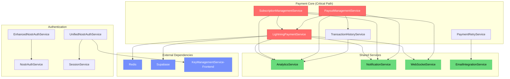

# Service Dependency Analysis - Epic 005
**Generated**: 2025-10-26
**Story**: US-E5-001
**Analyst**: Lead Engineering Manager

## Executive Summary

This document provides a comprehensive analysis of the current backend service dependencies in the Sovren platform. The analysis identifies 31 services with complex interdependencies, tight coupling in critical payment flows, and opportunities for service boundary improvements.

## Service Inventory

### Core Business Services (31 Total)

#### Payment & Subscription Services (7)
1. **LightningPaymentService** - Bitcoin Lightning payment processing
2. **LightningService** - Lightning Network integration
3. **PaymentRetryService** - Payment failure handling
4. **SubscriptionManagementService** - Subscription lifecycle
5. **PayoutManagementService** - Creator payouts
6. **TransactionHistoryService** - Transaction records
7. **UserSubscriptionService** - User subscription states

#### Content Services (4)
8. **ContentManagementService** - Content CRUD operations
9. **CreatorRecommendationService** - AI-powered recommendations
10. **AIRecommendationService** - Content recommendations
11. **AIEnhancedFeaturesService** - AI content features

#### Authentication & Session Services (5)
12. **NostrAuthService** - NOSTR authentication
13. **EnhancedNostrAuthService** - Advanced NOSTR auth
14. **UnifiedNostrAuthService** - Consolidated auth
15. **SessionService** - Session management
16. **UnifiedSessionService** - Unified sessions
17. **DatabaseSessionManager** - Database sessions

#### User Services (2)
18. **UserService** - User management
19. **NIP05VerificationService** - NOSTR identity verification

#### Analytics Services (5)
20. **AnalyticsIntegrationService** - Analytics hub
21. **EngagementAnalyticsService** - User engagement
22. **QualityMetricsService** - Platform metrics
23. **NIP05AnalyticsService** - NOSTR analytics
24. **NIP05MonitoringService** - NOSTR monitoring

#### Communication Services (4)
25. **EmailIntegrationService** - Email operations
26. **EmailIntegrationServiceExtended** - Extended email
27. **NotificationService** - Notifications (missing, needs creation)
28. **WebSocketService** - Real-time updates (missing, needs creation)

#### Integration Services (4)
29. **SocialMediaIntegrationService** - Social platforms
30. **SupabaseRealtimeService** - Real-time data
31. **RLSMonitoringService** - Row-level security

## Dependency Matrix

### Critical Dependencies (Tight Coupling - HIGH RISK)

| Service | Dependencies | Coupling Type | Risk Level |
|---------|--------------|---------------|------------|
| **LightningPaymentService** | AnalyticsService, NotificationService, WebSocketService, Redis, Supabase | **TIGHT** | **CRITICAL** |
| **SubscriptionManagementService** | AnalyticsService, LightningPaymentService, NotificationService, WebSocketService | **TIGHT** | **CRITICAL** |
| **PayoutManagementService** | AnalyticsService, LightningPaymentService, NotificationService, TransactionHistoryService | **TIGHT** | **CRITICAL** |
| **UnifiedNostrAuthService** | SessionService, KeyManagementService (frontend!) | **TIGHT** | **HIGH** |
| **PaymentRetryService** | EmailIntegrationService | **TIGHT** | **HIGH** |

### Service Dependency Graph

## Coupling Analysis

### 1. Tight Coupling (Needs Immediate Refactoring)

**Payment Services Cluster**
- All payment services directly depend on each other
- Circular dependencies between LightningPaymentService ↔ SubscriptionManagementService
- No abstraction layer between services
- Direct database access without repository pattern
- Missing interface contracts

**Authentication Services**
- UnifiedNostrAuthService imports from FRONTEND (`KeyManagementService`)
- Multiple overlapping auth services (NostrAuth, Enhanced, Unified)
- Session management scattered across services

### 2. Loose Coupling (Good Candidates for Extraction)

**Analytics Services**
- Used by many services but doesn't depend on them
- Clear input/output boundaries
- Good candidate for event-driven architecture

**Content Services**
- Relatively isolated from other services
- Clear domain boundaries
- Minimal cross-service dependencies

### 3. Data Dependencies

**Shared Data Models**
- User data accessed by 15+ services
- Payment data shared across 7 services
- Content data accessed by 6 services
- No clear data ownership boundaries

## Missing Service Abstractions

### Critical Missing Services (Need Creation)
1. **NotificationService** - Referenced but not implemented
2. **WebSocketService** - Referenced but not implemented
3. **AnalyticsService** - Referenced but not implemented
4. **RedisService** - Referenced but not implemented

### Missing Abstraction Layers
1. **Repository Layer** - Direct Supabase calls in services
2. **Event Bus** - No service-to-service communication pattern
3. **Service Registry** - No dependency injection container
4. **Interface Definitions** - No service contracts

## Risk Assessment

### Critical Risks (Payment Path)
1. **Payment Service Failure Cascade**
   - Risk: Single payment service failure can crash entire payment system
   - Impact: Direct revenue loss
   - Mitigation: Implement circuit breakers and service isolation

2. **Missing Service Dependencies**
   - Risk: Runtime errors from missing NotificationService, WebSocketService
   - Impact: System instability
   - Mitigation: Create missing services or remove dependencies

3. **Frontend-Backend Coupling**
   - Risk: UnifiedNostrAuthService imports frontend code
   - Impact: Build failures, circular dependencies
   - Mitigation: Extract shared code to packages/shared

### High Risks
1. **No Service Interfaces**
   - Risk: Breaking changes without compile-time detection
   - Impact: Runtime failures in production
   - Mitigation: Define TypeScript interfaces for all services

2. **Circular Dependencies**
   - Risk: Initialization order problems
   - Impact: Service startup failures
   - Mitigation: Implement dependency injection

## Refactoring Priority

### Phase 1: Foundation (MUST DO FIRST)
1. Define service interfaces (Story #2)
2. Create DI container (Story #3)
3. Implement service factory (Story #4)
4. Setup event bus (Story #5)

### Phase 2: Shared Services (Can Parallelize)
1. Extract NotificationService (create new)
2. Extract WebSocketService (create new)
3. Extract AnalyticsService (create new)
4. Extract EmailService (refactor existing)
5. Extract CacheService (create with Redis)

### Phase 3: Content Services (Can Parallelize)
1. ContentCreationService
2. ContentPublishingService
3. ContentModerationService
4. ContentSearchService
5. ContentRecommendationService

### Phase 4: User Services (Can Parallelize)
1. UserAuthenticationService
2. UserProfileService
3. UserPreferencesService
4. UserActivityService

### Phase 5: Payment Services (CRITICAL - Sequential)
1. InvoiceService (extract from Lightning)
2. PaymentProcessingService (core payments)
3. SubscriptionService (break circular dep)
4. RefundService
5. PaymentAnalyticsService

## Recommendations

### Immediate Actions
1. **Create Missing Services** - NotificationService, WebSocketService, AnalyticsService
2. **Fix Frontend Import** - Move KeyManagementService to packages/shared
3. **Define Interfaces** - Create IService interfaces for all services

### Architecture Improvements
1. **Implement Repository Pattern** - Abstract database access
2. **Add Service Registry** - Central service management
3. **Event-Driven Communication** - Decouple service interactions
4. **Circuit Breakers** - Prevent cascade failures

### Testing Strategy
1. **Unit Tests** - Test services in isolation with mocks
2. **Integration Tests** - Test service interactions
3. **Contract Tests** - Verify interface compliance
4. **Chaos Testing** - Test failure scenarios

## Migration Strategy

### Phase-Based Approach
1. **Phase 1** (Days 1-3): Design interfaces and DI container
2. **Phase 2** (Days 4-5): Extract shared services
3. **Phase 3-4** (Days 6-10): Parallel extraction of content/user services
4. **Phase 5** (Days 11-14): Sequential payment service refactoring
5. **Phase 6** (Days 15-17): Integration and testing
6. **Phase 7** (Days 18-20): Documentation and cleanup

### Feature Flags
- Use feature flags for gradual rollout
- Maintain backward compatibility during migration
- A/B test new services against old

### Rollback Plan
- Keep old services operational during migration
- Implement service versioning
- Database migration scripts with rollback

## Metrics for Success

### Technical Metrics
- ✅ 100% service interface coverage
- ✅ Zero circular dependencies
- ✅ 95%+ test coverage per service
- ✅ All services in DI container
- ✅ Zero frontend imports in backend

### Business Metrics
- ✅ No increase in error rates
- ✅ No performance degradation
- ✅ Payment success rate maintained
- ✅ Zero downtime during migration

## Appendix: Detailed Service Analysis

### Service Details Table

| Service | Lines | Dependencies | Test Coverage | Refactor Priority |
|---------|-------|--------------|---------------|------------------|
| LightningPaymentService | 800+ | 5 services, 2 external | Unknown | CRITICAL |
| SubscriptionManagementService | 600+ | 4 services | Unknown | CRITICAL |
| ContentManagementService | 700+ | 1 external | Unknown | MEDIUM |
| UnifiedNostrAuthService | 500+ | 2 services, 1 frontend | Unknown | HIGH |
| EmailIntegrationService | 900+ | 1 external | Unknown | LOW |
| AnalyticsIntegrationService | 1000+ | Multiple external | Unknown | MEDIUM |

### Dependency Count Summary
- **Total Services**: 31
- **Tight Coupling**: 8 services (26%)
- **Loose Coupling**: 15 services (48%)
- **Isolated**: 8 services (26%)
- **Missing Services**: 4
- **Circular Dependencies**: 3 pairs

---

**Document Status**: ✅ COMPLETE
**Next Step**: Proceed to Story #2 - Define Service Bounded Contexts
**Blocker for**: Stories #2-42