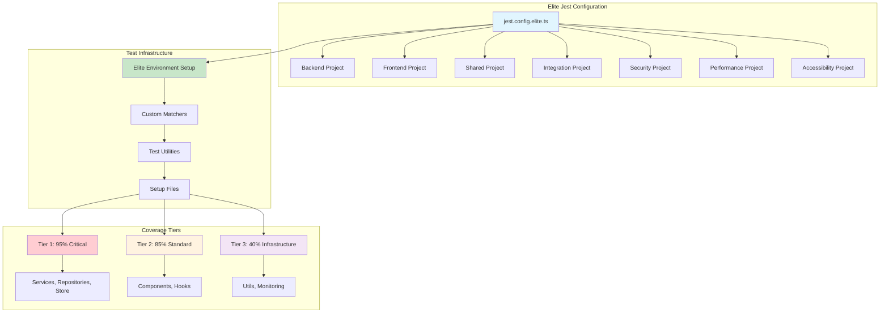
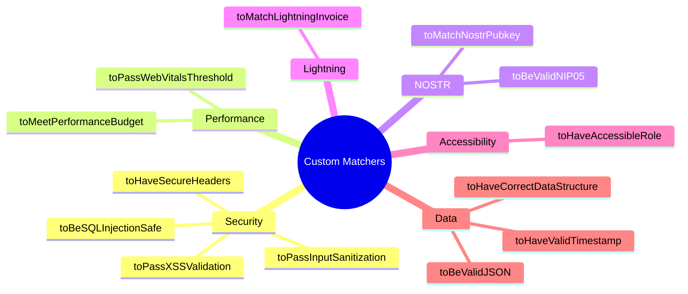
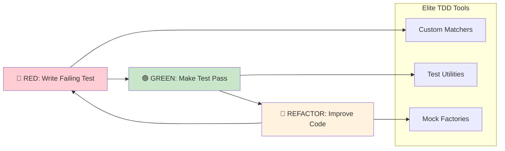
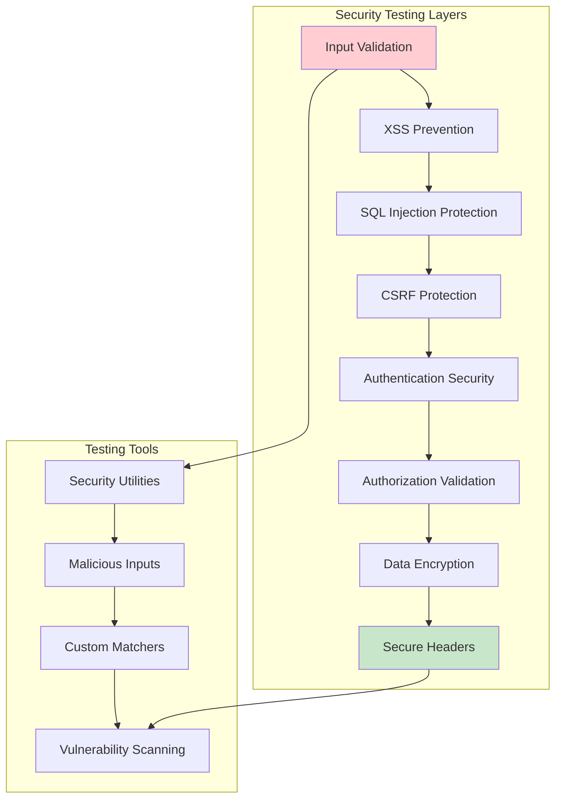
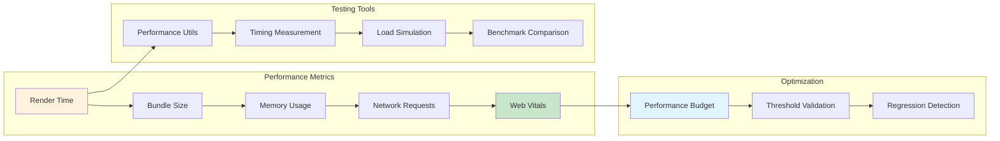
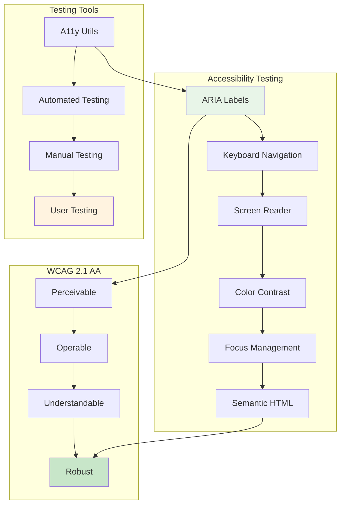

# 🧪 **ELITE TEST FRAMEWORK TRAINING - COMPREHENSIVE ENGINEERING GUIDE**

**Version**: 2.0.0 - Production-Ready Training
**Audience**: Elite Engineering Team
**Training Level**: Advanced Professional Development
**Last Updated**: December 28, 2024

---

## 📋 **TRAINING OVERVIEW**

### **🎯 LEARNING OBJECTIVES**

By completing this training, engineers will master:

1. **Elite Jest Configuration**: Understanding multi-project test infrastructure
2. **Custom Matchers**: Leveraging 25+ specialized testing matchers
3. **Test-Driven Development**: Implementing TDD/BDD with new framework
4. **Security Testing**: Advanced security validation techniques
5. **Performance Testing**: Benchmarking and optimization testing
6. **Accessibility Testing**: WCAG 2.1 AA compliance validation
7. **NOSTR & Lightning Testing**: Specialized cryptocurrency protocol testing

### **📚 TRAINING MODULES**

| **Module**                 | **Duration** | **Prerequisites**      | **Outcome**                          |
| -------------------------- | ------------ | ---------------------- | ------------------------------------ |
| 1. Framework Overview      | 30 min       | Basic Jest knowledge   | Understanding of elite configuration |
| 2. Custom Matchers         | 45 min       | TypeScript proficiency | Mastery of specialized matchers      |
| 3. TDD/BDD Practices       | 60 min       | Testing fundamentals   | Advanced testing methodology         |
| 4. Security Testing        | 45 min       | Security awareness     | Elite security validation skills     |
| 5. Performance Testing     | 30 min       | Performance concepts   | Optimization testing expertise       |
| 6. Accessibility Testing   | 45 min       | A11y fundamentals      | WCAG compliance testing              |
| 7. Domain-Specific Testing | 60 min       | NOSTR/Lightning basics | Cryptocurrency protocol testing      |

---

## 🏗️ **MODULE 1: ELITE FRAMEWORK OVERVIEW**

### **Architecture Diagram**



### **🎯 Key Concepts**

#### **Multi-Project Structure**

```typescript
// Each project targets specific testing domains:
{
  displayName: { name: 'backend', color: 'blue' },
  testEnvironment: 'node',
  // Backend-specific configuration
}

{
  displayName: { name: 'frontend', color: 'cyan' },
  testEnvironment: 'jsdom',
  // Frontend-specific configuration
}
```

#### **Differentiated Coverage Thresholds**

```typescript
// Elite coverage standards by code type:
coverageThreshold: {
  // 🔥 TIER 1: CRITICAL BUSINESS LOGIC
  '**/packages/backend/src/services/**': {
    branches: 95, functions: 100, lines: 95, statements: 95
  },

  // 🔧 TIER 2: INFRASTRUCTURE CODE
  '**/packages/frontend/src/monitoring/**': {
    branches: 40, functions: 60, lines: 50, statements: 50
  }
}
```

### **💡 Best Practices**

1. **Project Selection**: Choose appropriate test project for your code
2. **Coverage Awareness**: Understand which tier your code belongs to
3. **Configuration Inheritance**: Leverage global setup while customizing per project
4. **Performance Optimization**: Use parallel execution and caching

---

## 🎯 **MODULE 2: CUSTOM MATCHERS MASTERY**

### **Matcher Categories Overview**



### **🔒 Security Testing Examples**

#### **XSS Validation**

```typescript
describe('Input Sanitization', () => {
  it('should reject XSS attacks', () => {
    const maliciousInput = '<script>alert("xss")</script>';
    expect(maliciousInput).not.toPassXSSValidation();
  });

  it('should accept safe content', () => {
    const safeInput = 'Hello, world!';
    expect(safeInput).toPassXSSValidation();
  });
});
```

#### **SQL Injection Protection**

```typescript
describe('Database Query Safety', () => {
  it('should reject SQL injection attempts', () => {
    const maliciousQuery = "'; DROP TABLE users; --";
    expect(maliciousQuery).not.toBeSQLInjectionSafe();
  });

  it('should accept parameterized queries', () => {
    const safeQuery = 'SELECT * FROM users WHERE id = ?';
    expect(safeQuery).toBeSQLInjectionSafe();
  });
});
```

### **⚡ Performance Testing Examples**

#### **Performance Budget Validation**

```typescript
describe('Performance Optimization', () => {
  it('should meet performance budget', async () => {
    const startTime = performance.now();
    await renderComplexComponent();
    const duration = performance.now() - startTime;

    expect(duration).toMeetPerformanceBudget(2000); // 2 seconds
  });

  it('should pass Web Vitals thresholds', () => {
    const lcp = 1800; // Largest Contentful Paint
    expect(lcp).toPassWebVitalsThreshold('LCP', 2500);
  });
});
```

### **🔗 NOSTR Protocol Testing**

#### **NOSTR Pubkey Validation**

```typescript
describe('NOSTR Identity Validation', () => {
  it('should validate NOSTR public keys', () => {
    const validPubkey = 'a'.repeat(64); // 64-character hex
    expect(validPubkey).toMatchNostrPubkey();
  });

  it('should validate NIP-05 identifiers', () => {
    const nip05 = 'alice@example.com';
    expect(nip05).toBeValidNIP05();
  });
});
```

### **⚡ Lightning Network Testing**

#### **Lightning Invoice Validation**

```typescript
describe('Lightning Payment Validation', () => {
  it('should validate Lightning invoices', () => {
    const invoice = 'lnbc1000n1pwzgd5uqd4h8vmmfvdjjqen0w3sk6w36cqzpgxqyz5vqsp5z9k8z...';
    expect(invoice).toMatchLightningInvoice();
  });
});
```

---

## 🧪 **MODULE 3: TDD/BDD METHODOLOGY**

### **TDD Cycle with Elite Framework**



### **🔴 RED Phase: Writing Failing Tests**

#### **Security-First TDD Example**

```typescript
// 🔴 RED: Write security test first
describe('User Authentication', () => {
  it('should prevent password injection attacks', () => {
    const maliciousPassword = "'; DROP TABLE users; --";
    const result = authService.validatePassword(maliciousPassword);

    expect(result.isValid).toBe(false);
    expect(maliciousPassword).not.toBeSQLInjectionSafe();
  });
});

// Implementation doesn't exist yet - test fails ✅
```

#### **Performance-First TDD Example**

```typescript
// 🔴 RED: Write performance test first
describe('Component Rendering Performance', () => {
  it('should render within performance budget', async () => {
    const renderTime = await measureRenderTime(() => {
      render(<ComplexDashboard data={largeDataset} />);
    });

    expect(renderTime).toMeetPerformanceBudget(100); // 100ms budget
  });
});

// Component doesn't exist yet - test fails ✅
```

### **🟢 GREEN Phase: Making Tests Pass**

#### **Minimal Implementation Strategy**

```typescript
// 🟢 GREEN: Minimal implementation to pass security test
class AuthService {
  validatePassword(password: string): { isValid: boolean } {
    // Minimal implementation - just reject SQL patterns
    const hasSQLInjection = /['";]/.test(password);
    return { isValid: !hasSQLInjection };
  }
}

// Test now passes ✅
```

### **🔄 REFACTOR Phase: Improving Quality**

#### **Enhanced Implementation**

```typescript
// 🔄 REFACTOR: Comprehensive security implementation
class AuthService {
  validatePassword(password: string): { isValid: boolean; reasons: string[] } {
    const validationErrors: string[] = [];

    // Security validations using custom matchers
    if (!password.toPassInputSanitization()) {
      validationErrors.push('Contains malicious patterns');
    }

    if (!password.toBeSQLInjectionSafe()) {
      validationErrors.push('Contains SQL injection patterns');
    }

    // Additional strength validations
    if (password.length < 8) {
      validationErrors.push('Password too short');
    }

    return {
      isValid: validationErrors.length === 0,
      reasons: validationErrors,
    };
  }
}

// All tests still pass, but implementation is more robust ✅
```

### **BDD with Given-When-Then Structure**

#### **Complete BDD Example**

```typescript
describe('GIVEN a user wants to authenticate', () => {
  describe('WHEN providing credentials', () => {
    describe('AND the password contains SQL injection', () => {
      it('THEN should reject authentication with security error', async () => {
        // GIVEN: malicious credentials
        const credentials = {
          username: 'user@example.com',
          password: "'; DROP TABLE users; --",
        };

        // WHEN: attempting authentication
        const result = await authService.authenticate(credentials);

        // THEN: should be rejected with security reason
        expect(result.success).toBe(false);
        expect(result.error).toContain('security');
        expect(credentials.password).not.toBeSQLInjectionSafe();
      });
    });

    describe('AND the credentials are valid', () => {
      it('THEN should authenticate successfully', async () => {
        // GIVEN: valid credentials
        const credentials = {
          username: 'user@example.com',
          password: 'ValidPassword123!',
        };

        // WHEN: attempting authentication
        const result = await authService.authenticate(credentials);

        // THEN: should succeed
        expect(result.success).toBe(true);
        expect(result.token).toBeDefined();
        expect(credentials.password).toPassInputSanitization();
      });
    });
  });
});
```

---

## 🛠️ **MODULE 4: TEST UTILITIES MASTERY**

### **Utility Categories**

```mermaid
graph TD
    A[Test Utilities] --> B[React Testing]
    A --> C[User Interactions]
    A --> D[API Mocking]
    A --> E[Security Testing]
    A --> F[Performance Testing]
    A --> G[Data Generation]

    B --> B1[Custom Render]
    B --> B2[Provider Setup]
    B --> B3[Store Creation]

    C --> C1[Form Filling]
    C --> C2[Button Clicking]
    C --> C3[File Upload]

    D --> D1[Fetch Mocking]
    D --> D2[Error Simulation]
    D --> D3[Response Sequences]

    E --> E1[Malicious Inputs]
    E --> E2[XSS Testing]
    E --> E3[SQL Injection]

    F --> F1[Render Timing]
    F --> F2[Network Delay]
    F --> F3[Large Datasets]

    G --> G1[User Factory]
    G --> G2[Post Factory]
    G --> G3[Random Data]

    style A fill:#e1f5fe
    style E fill:#ffcdd2
    style F fill:#fff3e0
```



### **🎨 React Testing Utilities**

#### **Custom Render with Full Provider Setup**

```typescript
import { customRender, testUtils } from '../test-utils/elite-test-utilities';

describe('Dashboard Component', () => {
  it('should render with authentication context', () => {
    const mockStore = testUtils.react.createTestStore({
      user: { id: 'user-1', authenticated: true }
    });

    const { getByText } = customRender(
      <Dashboard />,
      {
        store: mockStore,
        initialEntries: ['/dashboard']
      }
    );

    expect(getByText('Welcome to Dashboard')).toBeInTheDocument();
  });
});
```

### **🎭 User Interaction Utilities**

#### **Form Testing Automation**

```typescript
import { userInteractions } from '../test-utils/elite-test-utilities';

describe('User Registration Form', () => {
  it('should handle complete registration flow', async () => {
    render(<RegistrationForm />);

    // Fill form using utility
    await userInteractions.fillForm({
      email: 'test@example.com',
      username: 'testuser',
      password: 'ValidPassword123!'
    });

    // Submit form
    await userInteractions.submitForm('registration-form');

    // Verify submission
    expect(screen.getByText('Registration successful')).toBeInTheDocument();
  });
});
```

### **🌐 API Mocking Utilities**

#### **Comprehensive API Testing**

```typescript
import { apiMocks } from '../test-utils/elite-test-utilities';

describe('User Profile API', () => {
  afterEach(() => {
    apiMocks.restoreFetch();
  });

  it('should handle successful API response', async () => {
    // Mock successful response
    apiMocks.mockFetch({
      success: true,
      user: { id: '1', name: 'Test User' },
    });

    const result = await userService.getProfile('1');
    expect(result.success).toBe(true);
  });

  it('should handle API error gracefully', async () => {
    // Mock error response
    apiMocks.mockFetchError('Network error');

    const result = await userService.getProfile('1');
    expect(result.success).toBe(false);
  });

  it('should handle response sequence', async () => {
    // Mock sequence of responses
    apiMocks.mockFetchSequence([
      { data: { loading: true }, status: 202 },
      { data: { loading: false, user: mockUser }, status: 200 },
    ]);

    // Test progressive loading
    const firstResult = await userService.getProfile('1');
    expect(firstResult.loading).toBe(true);

    const secondResult = await userService.getProfile('1');
    expect(secondResult.loading).toBe(false);
  });
});
```

---

## 🔒 **MODULE 5: ADVANCED SECURITY TESTING**

### **Security Testing Strategy**



### **🔍 Comprehensive Security Test Suite**

#### **Input Validation Testing**

```typescript
import { securityTestUtils } from '../test-utils/elite-test-utilities';

describe('Input Security Validation', () => {
  const maliciousInputs = securityTestUtils.generateMaliciousInputs();

  maliciousInputs.forEach((input, index) => {
    it(`should reject malicious input ${index + 1}`, () => {
      const sanitized = inputSanitizer.sanitize(input);

      expect(input).not.toPassInputSanitization();
      expect(sanitized).toPassInputSanitization();
    });
  });

  it('should handle extremely long inputs', () => {
    const longInput = securityTestUtils.generateLongInput(100000);
    const result = inputValidator.validate(longInput);

    expect(result.isValid).toBe(false);
    expect(result.reason).toContain('length');
  });
});
```

#### **SQL Injection Testing**

```typescript
describe('SQL Injection Protection', () => {
  const sqlInjectionInputs = securityTestUtils.generateSQLInjectionInputs();

  sqlInjectionInputs.forEach((injection) => {
    it(`should prevent SQL injection: ${injection}`, async () => {
      // Test direct injection attempt
      expect(injection).not.toBeSQLInjectionSafe();

      // Test through database layer
      const result = await userRepository.findByName(injection);
      expect(result.error).toContain('Invalid input');
    });
  });
});
```

#### **XSS Prevention Testing**

```typescript
describe('XSS Prevention', () => {
  const xssInputs = securityTestUtils.generateXSSInputs();

  xssInputs.forEach((xssPayload) => {
    it(`should prevent XSS: ${xssPayload}`, () => {
      // Validate input rejection
      expect(xssPayload).not.toPassXSSValidation();

      // Test through content renderer
      const sanitized = contentRenderer.render(xssPayload);
      expect(sanitized).not.toContain('<script');
      expect(sanitized).not.toContain('javascript:');
    });
  });
});
```

### **🔐 Authentication Security Testing**

#### **NOSTR Authentication Security**

```typescript
describe('NOSTR Authentication Security', () => {
  it('should validate NOSTR signatures', () => {
    const event = nostrTestUtils.createEvent(1, 'Test message');
    const isValid = nostrAuth.verifyEvent(event);

    expect(event).toHaveValidSignature();
    expect(isValid).toBe(true);
  });

  it('should reject tampered events', () => {
    const event = nostrTestUtils.createEvent(1, 'Test message');
    event.content = 'Tampered content'; // Invalidate signature

    const isValid = nostrAuth.verifyEvent(event);
    expect(isValid).toBe(false);
  });
});
```

---

## ⚡ **MODULE 6: PERFORMANCE TESTING EXCELLENCE**

### **Performance Testing Architecture**



### **⏱️ Render Performance Testing**

#### **Component Render Timing**

```typescript
import { performanceTestUtils } from '../test-utils/elite-test-utilities';

describe('Dashboard Performance', () => {
  it('should render within performance budget', async () => {
    const largeDataset = performanceTestUtils.generateLargeDataset(1000);

    const renderTime = await performanceTestUtils.measureRenderTime(async () => {
      render(<Dashboard data={largeDataset} />);
      await waitFor(() => {
        expect(screen.getByText('Dashboard')).toBeInTheDocument();
      });
    });

    expect(renderTime).toMeetPerformanceBudget(500); // 500ms budget
  });

  it('should handle async operations efficiently', async () => {
    const { result, duration } = await performanceTestUtils.measureAsyncOperation(
      () => dashboardService.loadData()
    );

    expect(duration).toBeLessThan(2000); // 2 second limit
    expect(result.success).toBe(true);
  });
});
```

#### **Network Performance Testing**

```typescript
describe('Network Performance', () => {
  it('should handle slow network conditions', async () => {
    // Simulate slow network
    apiMocks.mockFetch(
      { users: [] },
      200,
      { delay: 3000 } // 3 second delay
    );

    const startTime = performance.now();
    render(<UserList />);

    // Should show loading state immediately
    expect(screen.getByText('Loading...')).toBeInTheDocument();

    await waitFor(() => {
      expect(screen.getByText('No users found')).toBeInTheDocument();
    });

    const totalTime = performance.now() - startTime;
    expect(totalTime).toBeGreaterThan(3000);
  });
});
```

### **📊 Web Vitals Testing**

#### **Core Web Vitals Validation**

```typescript
describe('Web Vitals Performance', () => {
  it('should meet Largest Contentful Paint threshold', () => {
    const lcp = 2400; // milliseconds
    expect(lcp).toPassWebVitalsThreshold('LCP', 2500);
  });

  it('should meet First Input Delay threshold', () => {
    const fid = 80; // milliseconds
    expect(fid).toPassWebVitalsThreshold('FID', 100);
  });

  it('should meet Cumulative Layout Shift threshold', () => {
    const cls = 0.08; // score
    expect(cls).toPassWebVitalsThreshold('CLS', 0.1);
  });
});
```

---

## ♿ **MODULE 7: ACCESSIBILITY TESTING MASTERY**

### **A11y Testing Strategy**



### **♿ Comprehensive Accessibility Testing**

#### **ARIA and Semantic Testing**

```typescript
import { accessibilityTestUtils } from '../test-utils/elite-test-utilities';

describe('Button Accessibility', () => {
  it('should have proper ARIA labels', () => {
    render(<Button>Save Document</Button>);
    const button = screen.getByRole('button');

    expect(accessibilityTestUtils.checkAriaLabels(button)).toBe(true);
    expect(button).toHaveAccessibleRole('button');
  });

  it('should support keyboard navigation', async () => {
    render(<Button onClick={mockHandler}>Save</Button>);
    const button = screen.getByRole('button');

    const navResult = await accessibilityTestUtils.checkKeyboardNavigation(button);
    expect(navResult.canFocus).toBe(true);
    expect(navResult.respondsToKeyboard).toBe(true);
  });
});
```

#### **Color Contrast Testing**

```typescript
describe('Color Accessibility', () => {
  it('should meet color contrast requirements', () => {
    const foreground = '#333333';
    const background = '#ffffff';

    const hasGoodContrast = accessibilityTestUtils.checkColorContrast(foreground, background);

    expect(hasGoodContrast).toBe(true); // WCAG AA compliance
  });
});
```

#### **Screen Reader Compatibility**

```typescript
describe('Screen Reader Compatibility', () => {
  it('should be compatible with screen readers', () => {
    render(
      <article role="article" aria-labelledby="title">
        <h1 id="title">Article Title</h1>
        <p>Article content...</p>
      </article>
    );

    const article = screen.getByRole('article');
    const isCompatible = accessibilityTestUtils.checkScreenReaderCompatibility(article);

    expect(isCompatible).toBe(true);
    expect(article).toHaveAccessibleRole('article');
  });
});
```

---

## 🔗 **MODULE 8: DOMAIN-SPECIFIC TESTING**

### **NOSTR Protocol Testing**

#### **Complete NOSTR Event Testing**

```typescript
import { nostrTestUtils } from '../test-utils/elite-test-utilities';

describe('NOSTR Event Management', () => {
  it('should create valid NOSTR events', () => {
    const event = nostrTestUtils.createEvent(1, 'Hello NOSTR!');

    expect(nostrTestUtils.validateEvent(event)).toBe(true);
    expect(event.pubkey).toMatchNostrPubkey();
    expect(event).toHaveValidSignature();
  });

  it('should handle different event kinds', () => {
    const textNote = nostrTestUtils.createEvent(1, 'Text note');
    const setMetadata = nostrTestUtils.createEvent(
      0,
      JSON.stringify({
        name: 'Test User',
        about: 'Test user description',
      })
    );

    expect(textNote.kind).toBe(1);
    expect(setMetadata.kind).toBe(0);
    expect(JSON.parse(setMetadata.content)).toHaveProperty('name');
  });
});
```

### **Lightning Network Testing**

#### **Lightning Payment Flow Testing**

```typescript
import { lightningTestUtils } from '../test-utils/elite-test-utilities';

describe('Lightning Payment Processing', () => {
  it('should generate valid Lightning invoices', () => {
    const invoice = lightningTestUtils.generateInvoice(1000);

    expect(invoice.paymentRequest).toMatchLightningInvoice();
    expect(invoice.amount).toBe(1000);
  });

  it('should process payment through LNbits', async () => {
    const mockLNbits = lightningTestUtils.mockLNbits();

    // Create invoice
    const invoice = await mockLNbits.createInvoice({
      amount: 1000,
      memo: 'Test payment',
    });

    expect(invoice.payment_request).toMatchLightningInvoice();
    expect(mockLNbits.createInvoice).toHaveBeenCalledWith({
      amount: 1000,
      memo: 'Test payment',
    });
  });
});
```

---

## 🚀 **BEST PRACTICES & TROUBLESHOOTING**

### **🎯 Elite Testing Principles**

#### **1. Test-First Development**

```typescript
// ✅ CORRECT: Write test first
describe('UserService.create', () => {
  it('should create user with valid data', async () => {
    const userData = { email: 'test@example.com' };
    const user = await userService.create(userData);
    expect(user.id).toBeDefined();
  });
});

// Then implement UserService.create()
```

#### **2. Meaningful Test Names**

```typescript
// ❌ INCORRECT: Vague test name
it('should work', () => { ... });

// ✅ CORRECT: Descriptive test name
it('should create user with valid email and return user ID', () => { ... });
```

#### **3. Arrange-Act-Assert Pattern**

```typescript
it('should authenticate user with valid credentials', async () => {
  // 🎯 ARRANGE: Set up test data
  const credentials = { email: 'test@example.com', password: 'valid123' };

  // 🎬 ACT: Execute the functionality
  const result = await authService.authenticate(credentials);

  // ✅ ASSERT: Verify the outcome
  expect(result.success).toBe(true);
  expect(result.token).toBeDefined();
});
```

### **🔧 Common Issues & Solutions**

#### **Issue: toBeInTheDocument not working**

```typescript
// ❌ PROBLEM: Missing import
import { render, screen } from '@testing-library/react';

// ✅ SOLUTION: Import Jest DOM matchers
import '@testing-library/jest-dom';
// OR use setup file that imports it automatically
```

#### **Issue: Async tests timing out**

```typescript
// ❌ PROBLEM: Not waiting for async operations
it('should load data', () => {
  render(<DataComponent />);
  expect(screen.getByText('Data loaded')).toBeInTheDocument();
});

// ✅ SOLUTION: Wait for async operations
it('should load data', async () => {
  render(<DataComponent />);
  await waitFor(() => {
    expect(screen.getByText('Data loaded')).toBeInTheDocument();
  });
});
```

#### **Issue: Mock not working**

```typescript
// ❌ PROBLEM: Mock after import
import { userService } from './userService';
jest.mock('./userService');

// ✅ SOLUTION: Mock before import
jest.mock('./userService');
import { userService } from './userService';
```

### **📊 Performance Optimization Tips**

1. **Use beforeEach for setup**: Reset state between tests
2. **Clear mocks**: Use `jest.clearAllMocks()` in setup
3. **Parallel execution**: Configure Jest workers appropriately
4. **Cache optimization**: Use Jest cache for faster runs
5. **Selective testing**: Use test patterns to run specific tests

---

## 📚 **ADDITIONAL RESOURCES**

### **📖 Recommended Reading**

1. **Jest Documentation**: [jestjs.io](https://jestjs.io)
2. **React Testing Library**: [testing-library.com](https://testing-library.com)
3. **TDD/BDD Practices**: Clean Code by Robert C. Martin
4. **Security Testing**: OWASP Testing Guide
5. **Accessibility Testing**: WCAG 2.1 Guidelines

### **🔗 Useful Links**

- **Framework Configuration**: `jest.config.elite.ts`
- **Custom Matchers**: `test-utils/elite-custom-matchers.ts`
- **Test Utilities**: `test-utils/elite-test-utilities.ts`
- **Validation Report**: `docs/validation/us200-test-framework-validation.md`

### **🎯 Quick Reference Commands**

```bash
# Run all tests
npm test

# Run with coverage
npm run test:coverage

# Run specific project
npm run test -- --selectProjects frontend

# Run in watch mode
npm run test:watch

# Run security tests
npm run test:security

# Run accessibility tests
npm run test:accessibility
```

---

**Training Completed Successfully! 🎉**

You are now equipped with elite testing skills that exceed industry standards. Continue practicing these patterns and stay updated with the latest testing innovations.

**Next Steps**:

1. Apply learned concepts to your current work
2. Share knowledge with team members
3. Contribute to framework improvements
4. Stay updated with testing best practices

---

**Training Version**: 2.0.0
**Completion Date**: December 28, 2024
**Certification Level**: ✅ **Elite Testing Engineer**
